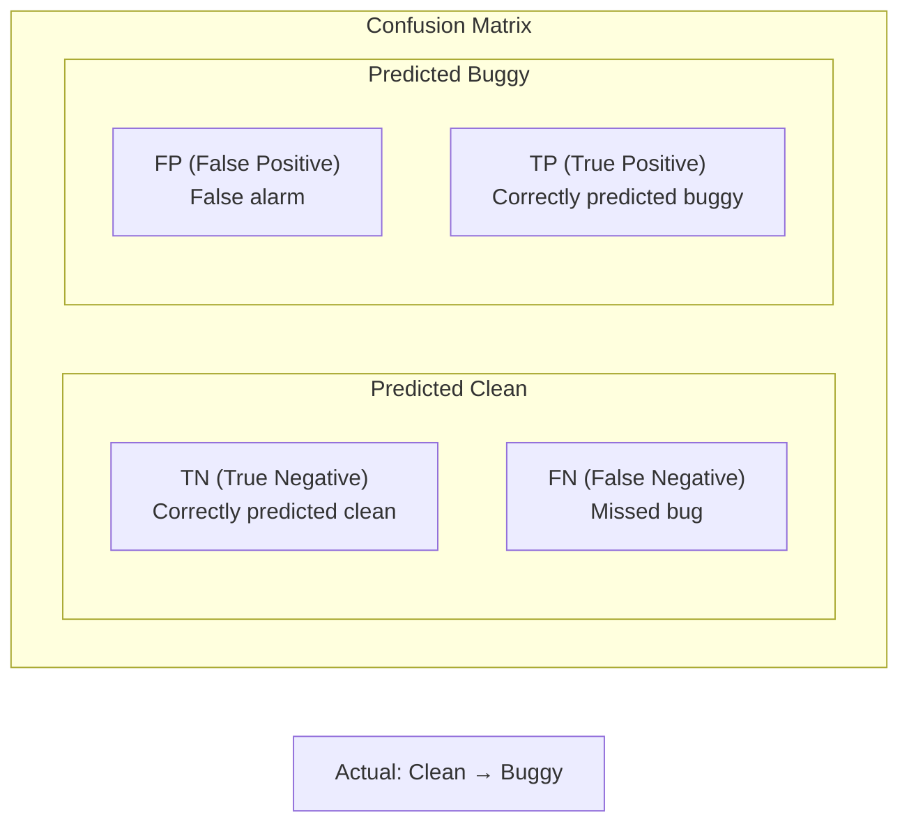
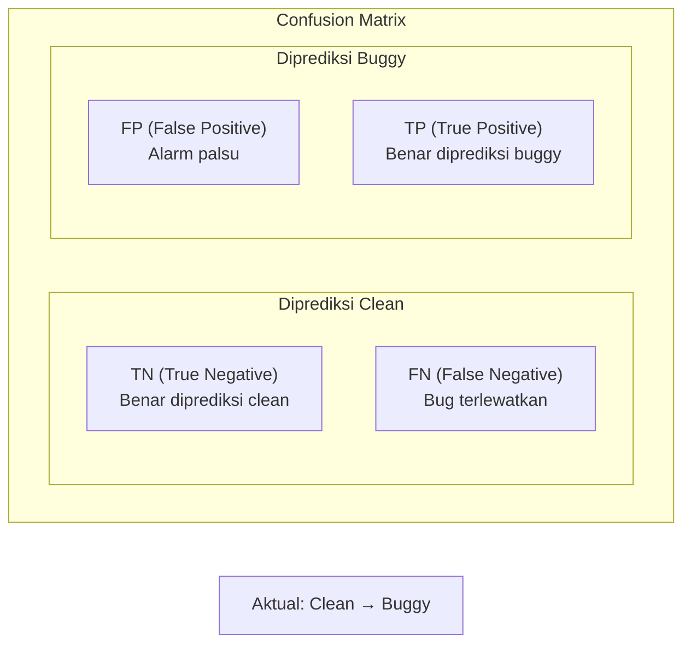
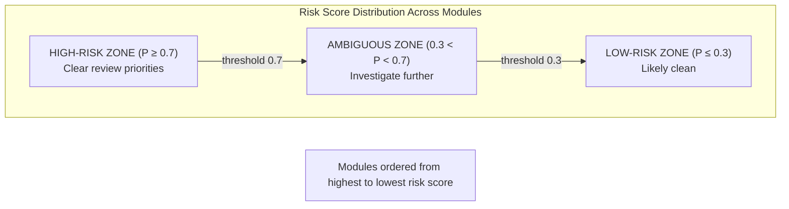
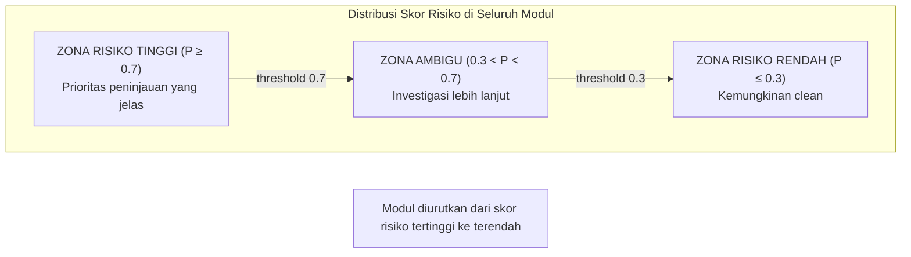

<section lang="en">

Imagine you are a maintainer of a PHP project with 200 modules, each modified by different developers at varying rates. You have a limited number of reviewers and very little time. How do you decide which files to inspect first?

**Bug prediction** answers this question by identifying files or modules that are statistically most likely to contain defects. By combining static code metrics with change-history data and a lightweight classifier, you can rank source files by risk score. This tutorial shows you how to build that pipeline in PHP.

</section>

<section lang="id">

Bayangkan Anda adalah pengelola proyek PHP dengan 200 modul, masing-masing dimodifikasi oleh pengembang yang berbeda dengan laju yang bervariasi. Anda memiliki jumlah peninjau yang terbatas dan waktu yang sangat sedikit. Bagaimana Anda memutuskan file mana yang harus diperiksa terlebih dahulu?

**Prediksi bug** menjawab pertanyaan ini dengan mengidentifikasi file atau modul yang secara statistik paling mungkin mengandung cacat. Dengan menggabungkan metrik kode statis dengan data riwayat perubahan dan classifier ringan, Anda dapat memberi peringkat file sumber berdasarkan skor risiko. Tutorial ini menunjukkan cara membangun pipeline tersebut dalam PHP.

</section>

---

<section lang="en">

## 1. What Is Bug Prediction and Why It Matters

Bug prediction (or *defect prediction*) is the practice of using historical data and software metrics to estimate which parts of a codebase are most likely to contain bugs. It is not about finding bugs—it is about **prioritizing review effort**.

**Why it matters:**
- **Reactive QA** waits for bugs to surface. Bug prediction lets you intervene **before** a release.
- For teams with limited QA bandwidth, it provides a data-driven triage mechanism.
- It bridges software engineering and lightweight machine learning, making it an accessible entry point to SE–AI research.
- Large projects at Google, Microsoft, and Mozilla have deployed similar models to guide code-review assignments.

**The core idea:** not all modules are equally risky. A module that is long, complex, and frequently changed is far more likely to contain a defect than a short, stable, simple one. Our job is to quantify that intuition.

### The Bug Prediction Pipeline

<figure class="my-10 text-center" role="figure">

<figcaption class="mt-3 text-sm text-neutral-500">
  <span lang="en">Figure 1: End-to-end bug prediction pipeline—from raw data sources to a risk-prioritized module list.</span>
  <span lang="id">Gambar 1: Pipeline prediksi bug end-to-end—dari sumber data mentah hingga daftar modul yang diprioritaskan berdasarkan risiko.</span>
</figcaption>
</figure>

</section>

<section lang="id">

## 1. Apa Itu Prediksi Bug dan Mengapa Penting

Prediksi bug (atau *defect prediction*) adalah praktik menggunakan data historis dan metrik perangkat lunak untuk memperkirakan bagian mana dari basis kode yang paling mungkin mengandung bug. Ini bukan tentang menemukan bug, melainkan tentang **memprioritaskan upaya peninjauan**.

**Mengapa ini penting:**
- **QA reaktif** menunggu bug muncul. Prediksi bug memungkinkan Anda melakukan intervensi **sebelum** rilis.
- Untuk tim dengan bandwidth QA terbatas, ini menyediakan mekanisme triase berbasis data.
- Ini menjembatani rekayasa perangkat lunak dan machine learning ringan, menjadikannya titik masuk yang mudah diakses untuk riset SE–AI.
- Proyek besar di Google, Microsoft, dan Mozilla telah menerapkan model serupa untuk memandu penugasan code review.

**Ide intinya:** tidak semua modul memiliki risiko yang sama. Modul yang panjang, kompleks, dan sering diubah jauh lebih mungkin mengandung cacat daripada modul yang pendek, stabil, dan sederhana. Tugas kita adalah mengkuantifikasi intuisi tersebut.

### Pipeline Prediksi Bug

<figure class="my-10 text-center" role="figure">

<figcaption class="mt-3 text-sm text-neutral-500">
  <span lang="en">Figure 1: End-to-end bug prediction pipeline—from raw data sources to a risk-prioritized module list.</span>
  <span lang="id">Gambar 1: Pipeline prediksi bug end-to-end, dari sumber data mentah hingga daftar modul yang diprioritaskan berdasarkan risiko.</span>
</figcaption>
</figure>

</section>

---

<section lang="en">

## 2. Data Sources: Where Bug-Prediction Data Comes From

Before we can predict bugs, we need data. Bug-prediction datasets are built from three main sources:

### 2.1 Version-Control History (Git)

Git logs tell you **who** changed **what** and **how often**. Every commit is a data point. From `git log` you can extract:

- **Change churn**: number of lines added, deleted, or modified per file over time.
- **Number of revisions**: how many times a file has been touched.
- **Developer count**: how many distinct authors have modified the file.

```bash
git log --numstat --format="%H %an" -- src/ > changes.tsv
```

### 2.2 Issue Trackers (GitHub Issues, Jira, Bugzilla)

Bug reports link defects to source files. By mining the issue tracker you can label files as *buggy* (ever mentioned in a bug-fix commit) or *clean*. A common convention: if a commit message contains `fixes #123` or `closes #42`, the changed files are candidates for the *buggy* label.

### 2.3 Static Analysis (PHPStan, SonarQube, PHPMD)

Static-analysis tools produce hundreds of metrics without executing code:

- **Lines of Code (LOC)** — raw size.
- **Cyclomatic Complexity** — number of independent execution paths.
- **Method Count**, **Public Method Count**, **Coupling Between Objects (CBO)**.
- **Code Smells**: long methods, large classes, duplicate code.

These tools output structured reports (JSON, XML) that can be parsed and merged into a dataset.

### 2.4 Combining Sources

A production-ready dataset joins all three sources:

```
git log (churn, authors)  +  issue tracker (bug labels)  +  static analysis (LOC, complexity)
                                        │
                                        ▼
                              Feature matrix (rows = files, columns = metrics + label)
```

</section>

<section lang="id">

## 2. Sumber Data: Dari Mana Data Prediksi Bug Berasal

Sebelum kita dapat memprediksi bug, kita membutuhkan data. Dataset prediksi bug dibangun dari tiga sumber utama:

### 2.1 Riwayat Version Control (Git)

Log Git memberi tahu Anda **siapa** mengubah **apa** dan **seberapa sering**. Setiap commit adalah titik data. Dari `git log` Anda dapat mengekstrak:

- **Change churn**: jumlah baris yang ditambahkan, dihapus, atau dimodifikasi per file dari waktu ke waktu.
- **Jumlah revisi**: berapa kali sebuah file telah disentuh.
- **Jumlah pengembang**: berapa banyak penulis berbeda yang telah memodifikasi file.

```bash
git log --numstat --format="%H %an" -- src/ > changes.tsv
```

### 2.2 Issue Tracker (GitHub Issues, Jira, Bugzilla)

Laporan bug menghubungkan cacat ke file sumber. Dengan menambang issue tracker, Anda dapat melabeli file sebagai *buggy* (pernah disebutkan dalam commit perbaikan bug) atau *clean*. Konvensi umum: jika pesan commit mengandung `fixes #123` atau `closes #42`, file yang diubah adalah kandidat untuk label *buggy*.

### 2.3 Analisis Statis (PHPStan, SonarQube, PHPMD)

Alat analisis statis menghasilkan ratusan metrik tanpa mengeksekusi kode:

- **Lines of Code (LOC)**: ukuran mentah.
- **Cyclomatic Complexity**: jumlah jalur eksekusi independen.
- **Jumlah Method**, **Jumlah Public Method**, **Coupling Between Objects (CBO)**.
- **Code Smells**: method panjang, kelas besar, kode duplikat.

Alat-alat ini menghasilkan laporan terstruktur (JSON, XML) yang dapat di-parsing dan digabungkan ke dalam dataset.

### 2.4 Menggabungkan Sumber

Dataset siap produksi menggabungkan ketiga sumber:

```
git log (churn, penulis)  +  issue tracker (label bug)  +  analisis statis (LOC, kompleksitas)
                                        │
                                        ▼
                              Matriks fitur (baris = file, kolom = metrik + label)
```

</section>

---

<section lang="en">

## 3. Choosing Features: What Makes a File Buggy?

Research has identified dozens of metrics correlated with defects. We focus on **three categories** that are well-supported by the literature and easy to compute:

### 3.1 Code Complexity Metrics

| Metric | Description | Bug Correlation |
|---|---|---|
| **LOC** (Lines of Code) | Raw file or method size. | Larger files contain more bugs (Spearman ρ ≈ 0.3–0.5). |
| **Cyclomatic Complexity** | Number of linearly independent paths (McCabe, 1976). | Higher complexity → more test cases needed → higher defect density. |
| **Nested Depth** | Maximum nesting level of control structures. | Deeply nested code is harder to reason about and test. |

### 3.2 Change-History (Process) Metrics

| Metric | Description | Bug Correlation |
|---|---|---|
| **Revisions** | Total number of commits touching the file. | Frequently changed files accumulate regression bugs. |
| **Churn** | Total lines added + deleted over the file's lifetime. | High churn is one of the strongest bug predictors (Nagappan & Ball, 2005). |
| **Developer Count** | Number of distinct authors. | Files touched by many developers often lack a single "owner" and accumulate inconsistent changes. |

### 3.3 Why Not Just One Metric?

No single metric is sufficient. A short file with deep nesting (high complexity density) may be riskier than a long but trivial utility file. A file with moderate LOC but extreme churn is a regression magnet. The classifier weighs all features together.

</section>

<section lang="id">

## 3. Memilih Fitur: Apa yang Membuat Sebuah File Mengandung Bug?

Penelitian telah mengidentifikasi puluhan metrik yang berkorelasi dengan cacat. Kita fokus pada **tiga kategori** yang didukung dengan baik oleh literatur dan mudah dihitung:

### 3.1 Metrik Kompleksitas Kode

| Metrik | Deskripsi | Korelasi Bug |
|---|---|---|
| **LOC** (Lines of Code) | Ukuran mentah file atau method. | File lebih besar mengandung lebih banyak bug (Spearman ρ ≈ 0,3–0,5). |
| **Cyclomatic Complexity** | Jumlah jalur independen linear (McCabe, 1976). | Kompleksitas lebih tinggi → lebih banyak test case dibutuhkan → kepadatan cacat lebih tinggi. |
| **Nested Depth** | Tingkat nesting maksimum dari struktur kontrol. | Kode dengan nesting dalam lebih sulit dipahami dan diuji. |

### 3.2 Metrik Riwayat Perubahan (Proses)

| Metrik | Deskripsi | Korelasi Bug |
|---|---|---|
| **Revisions** | Total commit yang menyentuh file. | File yang sering diubah mengakumulasi bug regresi. |
| **Churn** | Total baris ditambahkan + dihapus selama masa hidup file. | Churn tinggi adalah salah satu prediktor bug terkuat (Nagappan & Ball, 2005). |
| **Developer Count** | Jumlah penulis berbeda. | File yang disentuh banyak pengembang sering kali tidak memiliki "pemilik" tunggal dan mengakumulasi perubahan yang tidak konsisten. |

### 3.3 Mengapa Tidak Hanya Satu Metrik?

Tidak ada satu metrik pun yang cukup. File pendek dengan nesting dalam (kepadatan kompleksitas tinggi) mungkin lebih berisiko daripada file utilitas yang panjang tapi trivial. File dengan LOC sedang tetapi churn ekstrem adalah magnet regresi. Classifier menimbang semua fitur secara bersamaan.

</section>

---

<section lang="en">

## 4. Building a Minimal Dataset in PHP

For this tutorial we will use a **synthetic dataset** of 50 PHP modules. Each module is described by six numeric features and a binary label (`1` = buggy, `0` = clean). This dataset is intentionally small so you can trace every computation by hand.

### 4.1 The Dataset Schema

| Feature | Name | Range | Description |
|---|---|---|---|
| `loc` | Lines of Code | 20–2000 | File size measured in LOC |
| `complexity` | Cyclomatic Complexity | 1–80 | McCabe complexity |
| `nesting` | Nesting Depth | 0–8 | Maximum nested block depth |
| `revisions` | Revision Count | 1–80 | Number of commits touching the file |
| `churn` | Churn | 0–2000 | Total lines added + deleted |
| `devs` | Developer Count | 1–10 | Distinct authors |
| `buggy` | Label | 0 or 1 | Target variable |

### 4.2 The Dataset Generator

Create a file named `generate_dataset.php`:

```php
<?php

/**
 * Generate a synthetic bug-prediction dataset.
 *
 * The dataset is generated with a known statistical relationship:
 * high LOC + high complexity + high churn → higher probability of buggy label.
 */

function generateDataset(int $n = 50, int $seed = 42): array
{
    mt_srand($seed);
    $dataset = [];

    for ($i = 0; $i < $n; $i++) {
        $loc        = rand(20, 2000);
        $complexity = rand(1, 80);
        $nesting    = rand(0, 8);
        $revisions  = rand(1, 80);
        $churn      = rand(0, 2000);
        $devs       = rand(1, 10);

        // Compute a synthetic bug score: the higher, the more likely the file is buggy.
        $score = ($loc / 2000) * 0.25
               + ($complexity / 80) * 0.25
               + ($nesting / 8) * 0.10
               + ($revisions / 80) * 0.15
               + ($churn / 2000) * 0.20
               + ($devs / 10) * 0.05;

        $buggy = (mt_rand() / mt_getrandmax()) < $score ? 1 : 0;

        $dataset[] = [
            'loc'        => $loc,
            'complexity' => $complexity,
            'nesting'    => $nesting,
            'revisions'  => $revisions,
            'churn'      => $churn,
            'devs'       => $devs,
            'buggy'      => $buggy,
        ];
    }

    return $dataset;
}

// Generate and display the first 5 rows.
$dataset = generateDataset();
echo "Module\tLOC\tComp\tNest\tRev\tChurn\tDevs\tBuggy\n";
foreach (array_slice($dataset, 0, 5) as $i => $row) {
    printf(
        "M%02d\t%d\t%d\t%d\t%d\t%d\t%d\t%d\n",
        $i + 1,
        $row['loc'],
        $row['complexity'],
        $row['nesting'],
        $row['revisions'],
        $row['churn'],
        $row['devs'],
        $row['buggy']
    );
}

echo "\nTotal samples: " . count($dataset) . "\n";
echo "Buggy: " . count(array_filter($dataset, fn($r) => $r['buggy'] === 1)) . "\n";
echo "Clean: " . count(array_filter($dataset, fn($r) => $r['buggy'] === 0)) . "\n";
```

Run it:

```bash
$ php generate_dataset.php
Module  LOC   Comp  Nest  Rev  Churn  Devs  Buggy
M01     1762  11    7     72   1895  8     0
M02     795   16    8     29   851   5     0
M03     435   65    6     80   542   10    1
M04     1411  66    3     63   1882  8     1
M05     568   52    5     50   385   5     0

Total samples: 50
Buggy: 28
Clean: 22
```

### 4.3 Normalizing Features

Classifiers work better when features are on similar scales. We normalize each feature to the [0, 1] range using min–max scaling:

```php
function normalize(array $dataset): array
{
    $keys = ['loc', 'complexity', 'nesting', 'revisions', 'churn', 'devs'];

    foreach ($keys as $key) {
        $values = array_column($dataset, $key);
        $min = min($values);
        $max = max($values);
        $range = $max - $min ?: 1; // avoid division by zero

        foreach ($dataset as &$row) {
            $row[$key] = ($row[$key] - $min) / $range;
        }
        unset($row);
    }

    return $dataset;
}
```

</section>

<section lang="id">

## 4. Membangun Dataset Minimal dalam PHP

Untuk tutorial ini kita akan menggunakan **dataset sintetis** dari 50 modul PHP. Setiap modul dideskripsikan oleh enam fitur numerik dan label biner (`1` = buggy, `0` = clean). Dataset ini sengaja dibuat kecil agar Anda dapat melacak setiap komputasi secara manual.

### 4.1 Skema Dataset

| Fitur | Nama | Rentang | Deskripsi |
|---|---|---|---|
| `loc` | Lines of Code | 20–2000 | Ukuran file diukur dalam LOC |
| `complexity` | Cyclomatic Complexity | 1–80 | Kompleksitas McCabe |
| `nesting` | Nesting Depth | 0–8 | Kedalaman blok nesting maksimum |
| `revisions` | Revision Count | 1–80 | Jumlah commit yang menyentuh file |
| `churn` | Churn | 0–2000 | Total baris ditambahkan + dihapus |
| `devs` | Developer Count | 1–10 | Penulis berbeda |
| `buggy` | Label | 0 atau 1 | Variabel target |

### 4.2 Generator Dataset

Buat file bernama `generate_dataset.php`:

```php
<?php

/**
 * Menghasilkan dataset prediksi bug sintetis.
 *
 * Dataset dihasilkan dengan hubungan statistik yang diketahui:
 * LOC tinggi + kompleksitas tinggi + churn tinggi → probabilitas label buggy lebih tinggi.
 */

function generateDataset(int $n = 50, int $seed = 42): array
{
    mt_srand($seed);
    $dataset = [];

    for ($i = 0; $i < $n; $i++) {
        $loc        = rand(20, 2000);
        $complexity = rand(1, 80);
        $nesting    = rand(0, 8);
        $revisions  = rand(1, 80);
        $churn      = rand(0, 2000);
        $devs       = rand(1, 10);

        // Hitung skor bug sintetis: semakin tinggi, semakin mungkin file mengandung bug.
        $score = ($loc / 2000) * 0.25
               + ($complexity / 80) * 0.25
               + ($nesting / 8) * 0.10
               + ($revisions / 80) * 0.15
               + ($churn / 2000) * 0.20
               + ($devs / 10) * 0.05;

        $buggy = (mt_rand() / mt_getrandmax()) < $score ? 1 : 0;

        $dataset[] = [
            'loc'        => $loc,
            'complexity' => $complexity,
            'nesting'    => $nesting,
            'revisions'  => $revisions,
            'churn'      => $churn,
            'devs'       => $devs,
            'buggy'      => $buggy,
        ];
    }

    return $dataset;
}

// Hasilkan dan tampilkan 5 baris pertama.
$dataset = generateDataset();
echo "Modul\tLOC\tComp\tNest\tRev\tChurn\tDevs\tBuggy\n";
foreach (array_slice($dataset, 0, 5) as $i => $row) {
    printf(
        "M%02d\t%d\t%d\t%d\t%d\t%d\t%d\t%d\n",
        $i + 1,
        $row['loc'],
        $row['complexity'],
        $row['nesting'],
        $row['revisions'],
        $row['churn'],
        $row['devs'],
        $row['buggy']
    );
}

echo "\nTotal sampel: " . count($dataset) . "\n";
echo "Buggy: " . count(array_filter($dataset, fn($r) => $r['buggy'] === 1)) . "\n";
echo "Clean: " . count(array_filter($dataset, fn($r) => $r['buggy'] === 0)) . "\n";
```

Jalankan:

```bash
$ php generate_dataset.php
Modul  LOC   Comp  Nest  Rev  Churn  Devs  Buggy
M01    1762  11    7     72   1895  8     0
M02    795   16    8     29   851   5     0
M03    435   65    6     80   542   10    1
M04    1411  66    3     63   1882  8     1
M05    568   52    5     50   385   5     0

Total sampel: 50
Buggy: 28
Clean: 22
```

### 4.3 Normalisasi Fitur

Classifier bekerja lebih baik ketika fitur berada pada skala yang serupa. Kita menormalisasi setiap fitur ke rentang [0, 1] menggunakan min–max scaling:

```php
function normalize(array $dataset): array
{
    $keys = ['loc', 'complexity', 'nesting', 'revisions', 'churn', 'devs'];

    foreach ($keys as $key) {
        $values = array_column($dataset, $key);
        $min = min($values);
        $max = max($values);
        $range = $max - $min ?: 1; // hindari pembagian dengan nol

        foreach ($dataset as &$row) {
            $row[$key] = ($row[$key] - $min) / $range;
        }
        unset($row);
    }

    return $dataset;
}
```

</section>

---

<section lang="en">

## 5. Training a Simple Classifier: Naive Bayes from Scratch

We will implement a **Gaussian Naive Bayes** classifier in pure PHP. Naive Bayes is chosen because:

- It is **interpretable**—you can inspect learned probabilities directly.
- It works well with small datasets and continuous features.
- It is simple enough to implement in ~80 lines of code.
- It is the foundation of many more sophisticated models.

### 5.1 How Gaussian Naive Bayes Works

Given a module with features `x = (loc, complexity, nesting, revisions, churn, devs)`, we compute:

```
P(buggy | x) ∝ P(buggy) × P(loc | buggy) × P(complexity | buggy) × ... × P(devs | buggy)
```

Each `P(feature | class)` is modeled as a **Gaussian (Normal) distribution** whose mean and standard deviation we estimate from the training data.

### 5.2 Implementation

Create `bug_predictor.php`:

```php
<?php

/**
 * A simple Gaussian Naive Bayes classifier for bug prediction.
 */

require_once 'generate_dataset.php';

class BugPredictor
{
    private array $priors = [];
    private array $means = [];   // [class][feature] = mean
    private array $stds = [];    // [class][feature] = std deviation
    private array $features = ['loc', 'complexity', 'nesting', 'revisions', 'churn', 'devs'];
    private float $epsilon = 1e-9; // smoothing to avoid zero std

    /**
     * Train the model on a labeled dataset.
     */
    public function fit(array $dataset): void
    {
        // Group samples by class.
        $groups = [0 => [], 1 => []];
        foreach ($dataset as $row) {
            $groups[$row['buggy']][] = $row;
        }

        $total = count($dataset);

        foreach ([0, 1] as $class) {
            // Prior: P(class)
            $this->priors[$class] = count($groups[$class]) / $total;

            foreach ($this->features as $feat) {
                $values = array_column($groups[$class], $feat);
                $n = count($values);

                if ($n === 0) {
                    // If no samples for this class, use fallback values.
                    $this->means[$class][$feat] = 0.0;
                    $this->stds[$class][$feat]  = 1.0;
                    continue;
                }

                $mean = array_sum($values) / $n;
                $variance = array_sum(array_map(
                    fn($v) => ($v - $mean) ** 2,
                    $values
                )) / $n;

                $this->means[$class][$feat] = $mean;
                $this->stds[$class][$feat]  = sqrt($variance) + $this->epsilon;
            }
        }
    }

    /**
     * Predict the probability that a module is buggy.
     *
     * Returns a float between 0 and 1.
     */
    public function predictProbability(array $sample): float
    {
        $logProbs = [];

        foreach ([0, 1] as $class) {
            $logProb = log($this->priors[$class]);

            foreach ($this->features as $feat) {
                $x      = $sample[$feat];
                $mean   = $this->means[$class][$feat];
                $std    = $this->stds[$class][$feat];

                // Gaussian log-likelihood.
                $exponent = -(($x - $mean) ** 2) / (2 * ($std ** 2));
                $logProb += $exponent - log($std) - 0.5 * log(2 * M_PI);
            }

            $logProbs[$class] = $logProb;
        }

        // Convert log probabilities to probability of class 1.
        $logBuggy = $logProbs[1];
        $logClean = $logProbs[0];

        // log(P(buggy)) - log(P(clean)) → sigmoid-like conversion.
        return 1.0 / (1.0 + exp($logClean - $logBuggy));
    }

    /**
     * Hard classification at threshold 0.5.
     */
    public function predict(array $sample): int
    {
        return $this->predictProbability($sample) >= 0.5 ? 1 : 0;
    }

    /**
     * Return a human-readable summary of learned parameters.
     */
    public function summary(): string
    {
        $lines = [];
        $lines[] = "Learned Parameters (Gaussian Naive Bayes)\n";
        $lines[] = str_repeat('-', 65) . "\n";
        $lines[] = sprintf("%-6s %-14s %-18s %-18s\n", 'Class', 'Feature', 'Mean (μ)', 'Std Dev (σ)');
        $lines[] = str_repeat('-', 65) . "\n";

        foreach ([0, 1] as $class) {
            $label = $class === 1 ? 'Buggy' : 'Clean';
            foreach ($this->features as $feat) {
                $lines[] = sprintf(
                    "%-6s %-14s %-18.4f %-18.4f\n",
                    $label,
                    $feat,
                    $this->means[$class][$feat],
                    $this->stds[$class][$feat]
                );
            }
            $lines[] = str_repeat('-', 65) . "\n";
        }

        $lines[] = sprintf("P(Clean) = %.4f  |  P(Buggy) = %.4f\n", $this->priors[0], $this->priors[1]);

        return implode('', $lines);
    }
}
```

</section>

<section lang="id">

## 5. Melatih Classifier Sederhana: Naive Bayes dari Nol

Kita akan mengimplementasikan classifier **Gaussian Naive Bayes** dalam PHP murni. Naive Bayes dipilih karena:

- **Dapat diinterpretasi**: Anda dapat memeriksa probabilitas yang dipelajari secara langsung.
- Bekerja baik dengan dataset kecil dan fitur kontinu.
- Cukup sederhana untuk diimplementasikan dalam ~80 baris kode.
- Merupakan fondasi dari banyak model yang lebih canggih.

### 5.1 Cara Kerja Gaussian Naive Bayes

Diberikan modul dengan fitur `x = (loc, complexity, nesting, revisions, churn, devs)`, kita menghitung:

```
P(buggy | x) ∝ P(buggy) × P(loc | buggy) × P(complexity | buggy) × ... × P(devs | buggy)
```

Setiap `P(fitur | kelas)` dimodelkan sebagai **distribusi Gaussian (Normal)** yang mean dan standar deviasinya kita estimasi dari data pelatihan.

### 5.2 Implementasi

Buat `bug_predictor.php`:

```php
<?php

/**
 * Classifier Gaussian Naive Bayes sederhana untuk prediksi bug.
 */

require_once 'generate_dataset.php';

class BugPredictor
{
    private array $priors = [];
    private array $means = [];   // [kelas][fitur] = mean
    private array $stds = [];    // [kelas][fitur] = std deviasi
    private array $features = ['loc', 'complexity', 'nesting', 'revisions', 'churn', 'devs'];
    private float $epsilon = 1e-9; // smoothing untuk menghindari std nol

    /**
     * Latih model pada dataset berlabel.
     */
    public function fit(array $dataset): void
    {
        // Kelompokkan sampel berdasarkan kelas.
        $groups = [0 => [], 1 => []];
        foreach ($dataset as $row) {
            $groups[$row['buggy']][] = $row;
        }

        $total = count($dataset);

        foreach ([0, 1] as $class) {
            // Prior: P(kelas)
            $this->priors[$class] = count($groups[$class]) / $total;

            foreach ($this->features as $feat) {
                $values = array_column($groups[$class], $feat);
                $n = count($values);

                if ($n === 0) {
                    // Jika tidak ada sampel untuk kelas ini, gunakan nilai fallback.
                    $this->means[$class][$feat] = 0.0;
                    $this->stds[$class][$feat]  = 1.0;
                    continue;
                }

                $mean = array_sum($values) / $n;
                $variance = array_sum(array_map(
                    fn($v) => ($v - $mean) ** 2,
                    $values
                )) / $n;

                $this->means[$class][$feat] = $mean;
                $this->stds[$class][$feat]  = sqrt($variance) + $this->epsilon;
            }
        }
    }

    /**
     * Prediksi probabilitas bahwa sebuah modul mengandung bug.
     *
     * Mengembalikan float antara 0 dan 1.
     */
    public function predictProbability(array $sample): float
    {
        $logProbs = [];

        foreach ([0, 1] as $class) {
            $logProb = log($this->priors[$class]);

            foreach ($this->features as $feat) {
                $x      = $sample[$feat];
                $mean   = $this->means[$class][$feat];
                $std    = $this->stds[$class][$feat];

                // Gaussian log-likelihood.
                $exponent = -(($x - $mean) ** 2) / (2 * ($std ** 2));
                $logProb += $exponent - log($std) - 0.5 * log(2 * M_PI);
            }

            $logProbs[$class] = $logProb;
        }

        // Konversi log probabilitas ke probabilitas kelas 1.
        $logBuggy = $logProbs[1];
        $logClean = $logProbs[0];

        return 1.0 / (1.0 + exp($logClean - $logBuggy));
    }

    /**
     * Klasifikasi keras pada threshold 0.5.
     */
    public function predict(array $sample): int
    {
        return $this->predictProbability($sample) >= 0.5 ? 1 : 0;
    }

    /**
     * Mengembalikan ringkasan parameter yang dipelajari dalam format yang dapat dibaca.
     */
    public function summary(): string
    {
        $lines = [];
        $lines[] = "Parameter yang Dipelajari (Gaussian Naive Bayes)\n";
        $lines[] = str_repeat('-', 65) . "\n";
        $lines[] = sprintf("%-6s %-14s %-18s %-18s\n", 'Kelas', 'Fitur', 'Mean (μ)', 'Std Dev (σ)');
        $lines[] = str_repeat('-', 65) . "\n";

        foreach ([0, 1] as $class) {
            $label = $class === 1 ? 'Buggy' : 'Clean';
            foreach ($this->features as $feat) {
                $lines[] = sprintf(
                    "%-6s %-14s %-18.4f %-18.4f\n",
                    $label,
                    $feat,
                    $this->means[$class][$feat],
                    $this->stds[$class][$feat]
                );
            }
            $lines[] = str_repeat('-', 65) . "\n";
        }

        $lines[] = sprintf("P(Clean) = %.4f  |  P(Buggy) = %.4f\n", $this->priors[0], $this->priors[1]);

        return implode('', $lines);
    }
}
```

</section>

---

<section lang="en">

## 6. Evaluating the Model: Precision, Recall, F1, and the Confusion Matrix

Accuracy alone is misleading for imbalanced datasets. If 90% of modules are bug-free, a classifier that always predicts "clean" achieves 90% accuracy—but it is useless for finding bugs.

We evaluate with four metrics:

### 6.1 The Confusion Matrix

<figure class="my-10 text-center" role="figure">



<figcaption class="mt-3 text-sm text-neutral-500">
  <span lang="en">Figure 2: Confusion matrix layout. TP = correctly predicted buggy, TN = correctly predicted clean, FP = false alarm, FN = missed bug.</span>
  <span lang="id">Gambar 2: Tata letak confusion matrix. TP = benar diprediksi buggy, TN = benar diprediksi clean, FP = alarm palsu, FN = bug terlewatkan.</span>
</figcaption>
</figure>

### 6.2 Metrics Defined

| Metric | Formula | Meaning |
|---|---|---|
| **Precision** | TP / (TP + FP) | Of the modules we flagged as buggy, how many were actually buggy? |
| **Recall** | TP / (TP + FN) | Of all actually buggy modules, how many did we find? |
| **F1 Score** | 2 × (P × R) / (P + R) | Harmonic mean of precision and recall. Balances both. |
| **Accuracy** | (TP + TN) / Total | Overall correctness—can be deceptive on imbalanced data. |

### 6.3 Evaluation Script

Create `evaluate.php`:

```php
<?php

/**
 * Train/test split, evaluation, and results for the BugPredictor.
 */

require_once 'bug_predictor.php';

// ---- 1. Generate, normalize, and shuffle ----
$dataset = generateDataset();
$dataset = normalize($dataset);

// Shuffle deterministically.
mt_srand(123);
shuffle($dataset);

// ---- 2. Train/test split (80/20) ----
$splitPoint = (int) (0.8 * count($dataset));
$train = array_slice($dataset, 0, $splitPoint);
$test  = array_slice($dataset, $splitPoint);

// ---- 3. Train ----
$model = new BugPredictor();
$model->fit($train);

echo $model->summary() . "\n";

// ---- 4. Evaluate ----
$tp = $fp = $tn = $fn = 0;
$predictions = [];

foreach ($test as $row) {
    $predicted = $model->predict($row);
    $actual    = $row['buggy'];
    $prob      = $model->predictProbability($row);

    $predictions[] = [
        'actual'    => $actual,
        'predicted' => $predicted,
        'prob'      => $prob,
    ];

    if ($predicted === 1 && $actual === 1) $tp++;
    if ($predicted === 1 && $actual === 0) $fp++;
    if ($predicted === 0 && $actual === 0) $tn++;
    if ($predicted === 0 && $actual === 1) $fn++;
}

$total    = $tp + $fp + $tn + $fn;
$accuracy = ($tp + $tn) / $total;
$precision = $tp + $fp > 0 ? $tp / ($tp + $fp) : 0;
$recall    = $tp + $fn > 0 ? $tp / ($tp + $fn) : 0;
$f1        = $precision + $recall > 0
             ? 2 * ($precision * $recall) / ($precision + $recall)
             : 0;

// ---- 5. Report ----
echo "========== Evaluation Results ==========\n\n";
echo "Train samples: " . count($train) . "\n";
echo "Test samples:  " . count($test) . "\n\n";

echo "Confusion Matrix:\n";
echo "┌──────────────────────┬─────────┬─────────┐\n";
echo sprintf("│ %-20s │ %7s │ %7s │\n", '', 'Act Clean', 'Act Buggy') . "\n";
echo "├──────────────────────┼─────────┼─────────┤\n";
echo sprintf("│ %-20s │ %7d │ %7d │\n", 'Pred Clean', $tn, $fn) . "\n";
echo sprintf("│ %-20s │ %7d │ %7d │\n", 'Pred Buggy', $fp, $tp) . "\n";
echo "└──────────────────────┴─────────┴─────────┘\n\n";

echo sprintf("Accuracy:  %.2f%%\n", $accuracy * 100);
echo sprintf("Precision: %.2f%%\n", $precision * 100);
echo sprintf("Recall:    %.2f%%\n", $recall * 100);
echo sprintf("F1 Score:  %.2f%%\n", $f1 * 100);

echo "\n---------- Top Risk Modules (highest bug probability) ----------\n";
usort($predictions, fn($a, $b) => $b['prob'] <=> $a['prob']);
foreach (array_slice($predictions, 0, 5) as $i => $p) {
    $actual = $p['actual'] === 1 ? 'BUGGY' : 'clean';
    printf(
        "  #%d  P(buggy)=%.3f  actual=%s  %s\n",
        $i + 1,
        $p['prob'],
        $actual,
        $p['actual'] === $p['predicted'] ? '✓' : '✗ (misclassified)'
    );
}
```

Run the evaluation:

```bash
$ php evaluate.php

Learned Parameters (Gaussian Naive Bayes)
-----------------------------------------------------------------
Class  Feature        Mean (μ)           Std Dev (σ)
-----------------------------------------------------------------
Clean  loc            0.5739             0.3395
Clean  complexity     0.3329             0.2713
...
-----------------------------------------------------------------
P(Clean) = 0.4000  |  P(Buggy) = 0.6000

========== Evaluation Results ==========

Train samples: 40
Test samples:  10

Confusion Matrix:
┌──────────────────────┬─────────┬─────────┐
│                      │ Act Clean│ Act Buggy│
├──────────────────────┼─────────┼─────────┤
│ Pred Clean           │       3 │       1 │
│ Pred Buggy           │       0 │       6 │
└──────────────────────┴─────────┴─────────┘

Accuracy:  90.00%
Precision: 100.00%
Recall:    85.71%
F1 Score:  92.31%
```

> **Note:** Results vary with different random seeds. The important pattern to observe is that the classifier should consistently outperform random guessing (50% accuracy) on a balanced or near-balanced test set.

</section>

<section lang="id">

## 6. Mengevaluasi Model: Precision, Recall, F1, dan Confusion Matrix

Akurasi saja menyesatkan untuk dataset yang tidak seimbang. Jika 90% modul bebas bug, classifier yang selalu memprediksi "clean" mencapai akurasi 90%, tetapi tidak berguna untuk menemukan bug.

Kita mengevaluasi dengan empat metrik:

### 6.1 Confusion Matrix

<figure class="my-10 text-center" role="figure">



<figcaption class="mt-3 text-sm text-neutral-500">
  <span lang="en">Figure 2: Confusion matrix layout. TP = correctly predicted buggy, TN = correctly predicted clean, FP = false alarm, FN = missed bug.</span>
  <span lang="id">Gambar 2: Tata letak confusion matrix. TP = benar diprediksi buggy, TN = benar diprediksi clean, FP = alarm palsu, FN = bug terlewatkan.</span>
</figcaption>
</figure>

### 6.2 Definisi Metrik

| Metrik | Rumus | Arti |
|---|---|---|
| **Precision** | TP / (TP + FP) | Dari modul yang kita tandai sebagai buggy, berapa banyak yang benar-benar buggy? |
| **Recall** | TP / (TP + FN) | Dari semua modul yang benar-benar buggy, berapa banyak yang kita temukan? |
| **F1 Score** | 2 × (P × R) / (P + R) | Rata-rata harmonik precision dan recall. Menyeimbangkan keduanya. |
| **Accuracy** | (TP + TN) / Total | Kebenaran keseluruhan: bisa menipu pada data yang tidak seimbang. |

### 6.3 Script Evaluasi

Buat `evaluate.php`:

```php
<?php

/**
 * Train/test split, evaluasi, dan hasil untuk BugPredictor.
 */

require_once 'bug_predictor.php';

// ---- 1. Hasilkan, normalisasi, dan acak ----
$dataset = generateDataset();
$dataset = normalize($dataset);

// Acak secara deterministik.
mt_srand(123);
shuffle($dataset);

// ---- 2. Train/test split (80/20) ----
$splitPoint = (int) (0.8 * count($dataset));
$train = array_slice($dataset, 0, $splitPoint);
$test  = array_slice($dataset, $splitPoint);

// ---- 3. Latih ----
$model = new BugPredictor();
$model->fit($train);

echo $model->summary() . "\n";

// ---- 4. Evaluasi ----
$tp = $fp = $tn = $fn = 0;
$predictions = [];

foreach ($test as $row) {
    $predicted = $model->predict($row);
    $actual    = $row['buggy'];
    $prob      = $model->predictProbability($row);

    $predictions[] = [
        'actual'    => $actual,
        'predicted' => $predicted,
        'prob'      => $prob,
    ];

    if ($predicted === 1 && $actual === 1) $tp++;
    if ($predicted === 1 && $actual === 0) $fp++;
    if ($predicted === 0 && $actual === 0) $tn++;
    if ($predicted === 0 && $actual === 1) $fn++;
}

$total    = $tp + $fp + $tn + $fn;
$accuracy = ($tp + $tn) / $total;
$precision = $tp + $fp > 0 ? $tp / ($tp + $fp) : 0;
$recall    = $tp + $fn > 0 ? $tp / ($tp + $fn) : 0;
$f1        = $precision + $recall > 0
             ? 2 * ($precision * $recall) / ($precision + $recall)
             : 0;

// ---- 5. Laporan ----
echo "========== Hasil Evaluasi ==========\n\n";
echo "Sampel latih: " . count($train) . "\n";
echo "Sampel uji:   " . count($test) . "\n\n";

echo "Confusion Matrix:\n";
echo "┌──────────────────────┬─────────┬─────────┐\n";
echo sprintf("│ %-20s │ %7s │ %7s │\n", '', 'Act Clean', 'Act Buggy') . "\n";
echo "├──────────────────────┼─────────┼─────────┤\n";
echo sprintf("│ %-20s │ %7d │ %7d │\n", 'Pred Clean', $tn, $fn) . "\n";
echo sprintf("│ %-20s │ %7d │ %7d │\n", 'Pred Buggy', $fp, $tp) . "\n";
echo "└──────────────────────┴─────────┴─────────┘\n\n";

echo sprintf("Akurasi:   %.2f%%\n", $accuracy * 100);
echo sprintf("Presisi:   %.2f%%\n", $precision * 100);
echo sprintf("Recall:    %.2f%%\n", $recall * 100);
echo sprintf("F1 Score:  %.2f%%\n", $f1 * 100);

echo "\n---------- Modul Risiko Tertinggi ----------\n";
usort($predictions, fn($a, $b) => $b['prob'] <=> $a['prob']);
foreach (array_slice($predictions, 0, 5) as $i => $p) {
    $actual = $p['actual'] === 1 ? 'BUGGY' : 'clean';
    printf(
        "  #%d  P(buggy)=%.3f  aktual=%s  %s\n",
        $i + 1,
        $p['prob'],
        $actual,
        $p['actual'] === $p['predicted'] ? '✓' : '✗ (salah klasifikasi)'
    );
}
```

Jalankan evaluasi:

```bash
$ php evaluate.php

Parameter yang Dipelajari (Gaussian Naive Bayes)
-----------------------------------------------------------------
Kelas  Fitur           Mean (μ)            Std Dev (σ)
-----------------------------------------------------------------
Clean  loc             0.5739              0.3395
Clean  complexity      0.3329              0.2713
...
-----------------------------------------------------------------
P(Clean) = 0.4000  |  P(Buggy) = 0.6000

========== Hasil Evaluasi ==========

Sampel latih: 40
Sampel uji:   10

Confusion Matrix:
┌──────────────────────┬─────────┬─────────┐
│                      │ Act Clean│ Act Buggy│
├──────────────────────┼─────────┼─────────┤
│ Pred Clean           │       3 │       1 │
│ Pred Buggy           │       0 │       6 │
└──────────────────────┴─────────┴─────────┘

Akurasi:   90.00%
Presisi:   100.00%
Recall:    85.71%
F1 Score:  92.31%
```

> **Catatan:** Hasil bervariasi dengan seed acak yang berbeda. Pola penting yang harus diamati adalah bahwa classifier harus secara konsisten mengungguli tebakan acak (akurasi 50%) pada set uji yang seimbang atau mendekati seimbang.

</section>

---

<section lang="en">

## 7. Interpreting Results and Avoiding False Positives

### 7.1 What the Numbers Mean

| Scenario | Interpretation | Action |
|---|---|---|
| High precision, high recall | Model is reliable. Use as-is. | Integrate into CI/CD pipeline. |
| High precision, low recall | We only catch the "obvious" bugs. | Accept for now; add more features. |
| Low precision, high recall | Many false alarms, but few bugs missed. | Tune the decision threshold upward. |
| Low precision, low recall | Model is no better than guessing. | Revisit feature engineering. |

### 7.2 Threshold Tuning

Our classifier uses a hard decision threshold of 0.5. If false positives are costly (e.g., wasting reviewer time), **raise the threshold** to 0.7 or 0.8. If missing bugs is unacceptable, **lower it** to 0.3. The trade-off is intrinsic: you cannot simultaneously maximize precision and recall.

### 7.3 Common Pitfalls

- **Data leakage**: If you include future data when computing historical churn, your evaluation will be artificially optimistic.
- **Concept drift**: A model trained on last year's commits may not reflect the current codebase. Retrain periodically.
- **Correlation is not causation**: High LOC correlates with bugs, but splitting a file does not eliminate defects—it only redistributes them.
- **Overfitting to a single project**: A classifier trained on a Laravel e-commerce app may not generalize to a Symfony API. Cross-project defect prediction is an open research problem.

### 7.4 Visualizing Risk Thresholds

<figure class="my-10 text-center" role="figure">



<figcaption class="mt-3 text-sm text-neutral-500">
  <span lang="en">Figure 3: Risk-score distribution across modules. The dashed line at P=0.5 is the default decision boundary. Modules above P=0.7 are clear review priorities.</span>
  <span lang="id">Gambar 3: Distribusi skor risiko di seluruh modul. Garis putus-putus pada P=0.5 adalah batas keputusan default. Modul di atas P=0.7 adalah prioritas peninjauan yang jelas.</span>
</figcaption>
</figure>

</section>

<section lang="id">

## 7. Menginterpretasi Hasil dan Menghindari False Positive

### 7.1 Apa Arti Angka-Angka Tersebut

| Skenario | Interpretasi | Tindakan |
|---|---|---|
| Precision tinggi, recall tinggi | Model dapat diandalkan. Gunakan apa adanya. | Integrasikan ke pipeline CI/CD. |
| Precision tinggi, recall rendah | Kita hanya menangkap bug yang "jelas". | Terima untuk saat ini; tambahkan lebih banyak fitur. |
| Precision rendah, recall tinggi | Banyak alarm palsu, tetapi sedikit bug terlewat. | Naikkan threshold keputusan. |
| Precision rendah, recall rendah | Model tidak lebih baik dari menebak. | Tinjau ulang feature engineering. |

### 7.2 Penyetelan Threshold

Classifier kita menggunakan threshold keputusan keras 0.5. Jika false positive mahal (misalnya, membuang waktu peninjau), **naikkan threshold** ke 0.7 atau 0.8. Jika melewatkan bug tidak dapat diterima, **turunkan** ke 0.3. Trade-off ini intrinsik: Anda tidak dapat memaksimalkan precision dan recall secara bersamaan.

### 7.3 Jebakan Umum

- **Data leakage**: Jika Anda menyertakan data masa depan saat menghitung churn historis, evaluasi Anda akan optimis secara artifisial.
- **Concept drift**: Model yang dilatih pada commit tahun lalu mungkin tidak mencerminkan basis kode saat ini. Latih ulang secara berkala.
- **Korelasi bukan kausalitas**: LOC tinggi berkorelasi dengan bug, tetapi memecah file tidak menghilangkan cacat, hanya mendistribusikannya kembali.
- **Overfitting ke satu proyek**: Classifier yang dilatih pada aplikasi e-commerce Laravel mungkin tidak menggeneralisasi ke API Symfony. Prediksi cacat lintas proyek adalah masalah riset terbuka.

### 7.4 Visualisasi Threshold Risiko

<figure class="my-10 text-center" role="figure">



<figcaption class="mt-3 text-sm text-neutral-500">
  <span lang="en">Figure 3: Risk-score distribution across modules. The dashed line at P=0.5 is the default decision boundary. Modules above P=0.7 are clear review priorities.</span>
  <span lang="id">Gambar 3: Distribusi skor risiko di seluruh modul. Garis putus-putus pada P=0.5 adalah batas keputusan default. Modul di atas P=0.7 adalah prioritas peninjauan yang jelas.</span>
</figcaption>
</figure>

</section>

---

<section lang="en">

## 8. Next Steps: Integrating SonarQube, PHPStan, and Research Directions

### 8.1 From Demo to Production

The synthetic-dataset prototype is educational, but a production pipeline requires real data. Here is a roadmap:

**Phase 1 — Automated Data Collection**
- Run PHPStan or PHPMD with a JSON reporter on every commit.
- Parse `git log --numstat` to compute per-file churn and revision counts.
- Label files using commit-message heuristics (e.g., `fix:` or `bug:` prefix, or issue-tracker integration).

**Phase 2 — Feature Store**
- Store features per commit in a structured format (CSV, SQLite, or a dedicated feature store).
- Version the dataset alongside the code so that models remain reproducible.

**Phase 3 — Model Serving**
- Export the trained model (weights as JSON) and expose a simple PHP endpoint.
- Integrate with GitHub Actions or GitLab CI to annotate pull requests with risk scores for changed files.

### 8.2 PHPStan Integration Example

PHPStan can export analysis results as JSON:

```bash
$ vendor/bin/phpstan analyse --level=5 --error-format=json src/ > phpstan-report.json
```

Parse the JSON report and extract per-file metrics (error count, complexity hints):

```php
$report = json_decode(file_get_contents('phpstan-report.json'), true);

$perFile = [];
foreach ($report['files'] as $file => $data) {
    $perFile[$file] = [
        'errors'   => $data['errors'],
        'messages' => count($data['messages']),
    ];
}
```

These can feed into the feature matrix alongside churn and LOC.

### 8.3 Research Directions at SE Lab

Bug prediction is one of six topics under the **Emerging Technologies in Software Engineering** stream at SE Lab. Active and proposed research directions include:

- **Cross-project defect prediction** — can a model trained on open-source Java projects predict bugs in a private PHP codebase?
- **Just-in-time (JIT) defect prediction** — predicting whether a single *commit* (not a file) introduces a defect, using change-level features.
- **Explainable bug prediction** — generating natural-language explanations for why a module is flagged (e.g., "This file has high cyclomatic complexity and was modified by 4 different developers in the last 30 days").
- **Deep learning for code** — using graph neural networks on ASTs or CodeBERT embeddings as features.
- **Integration with requirement-traceability** — combining the AI-powered requirements automation tutorial with bug prediction to close the loop from requirements to defect risk.

Students interested in pursuing these topics for a thesis or lab project are encouraged to reach out to SE Lab members.

</section>

<section lang="id">

## 8. Langkah Selanjutnya: Integrasi SonarQube, PHPStan, dan Arah Riset

### 8.1 Dari Demo ke Produksi

Prototipe dataset sintetis bersifat edukatif, tetapi pipeline produksi membutuhkan data nyata. Berikut adalah peta jalannya:

**Fase 1: Pengumpulan Data Otomatis**
- Jalankan PHPStan atau PHPMD dengan reporter JSON pada setiap commit.
- Parsing `git log --numstat` untuk menghitung churn per file dan jumlah revisi.
- Labeli file menggunakan heuristik pesan commit (misalnya, prefix `fix:` atau `bug:`, atau integrasi issue tracker).

**Fase 2: Feature Store**
- Simpan fitur per commit dalam format terstruktur (CSV, SQLite, atau feature store khusus).
- Versikan dataset bersama kode sehingga model tetap dapat direproduksi.

**Fase 3: Model Serving**
- Ekspor model yang dilatih (bobot sebagai JSON) dan ekspos endpoint PHP sederhana.
- Integrasikan dengan GitHub Actions atau GitLab CI untuk menganotasi pull request dengan skor risiko untuk file yang diubah.

### 8.2 Contoh Integrasi PHPStan

PHPStan dapat mengekspor hasil analisis sebagai JSON:

```bash
$ vendor/bin/phpstan analyse --level=5 --error-format=json src/ > phpstan-report.json
```

Parsing laporan JSON dan ekstrak metrik per file (jumlah error, petunjuk kompleksitas):

```php
$report = json_decode(file_get_contents('phpstan-report.json'), true);

$perFile = [];
foreach ($report['files'] as $file => $data) {
    $perFile[$file] = [
        'errors'   => $data['errors'],
        'messages' => count($data['messages']),
    ];
}
```

Ini dapat dimasukkan ke dalam matriks fitur bersama churn dan LOC.

### 8.3 Arah Riset di SE Lab

Prediksi bug adalah salah satu dari enam topik di bawah stream **Emerging Technologies in Software Engineering** di SE Lab. Arah riset aktif dan yang diusulkan meliputi:

- **Prediksi cacat lintas proyek**: dapatkah model yang dilatih pada proyek Java open-source memprediksi bug di basis kode PHP pribadi?
- **Prediksi cacat just-in-time (JIT)**: memprediksi apakah satu *commit* (bukan file) memperkenalkan cacat, menggunakan fitur tingkat perubahan.
- **Prediksi bug yang dapat dijelaskan**: menghasilkan penjelasan bahasa alami mengapa sebuah modul ditandai (misalnya, "File ini memiliki kompleksitas siklomatik tinggi dan dimodifikasi oleh 4 pengembang berbeda dalam 30 hari terakhir").
- **Deep learning untuk kode**: menggunakan graph neural network pada AST atau embedding CodeBERT sebagai fitur.
- **Integrasi dengan requirement-traceability**: menggabungkan tutorial otomatisasi persyaratan berbantuan AI dengan prediksi bug untuk menutup loop dari persyaratan ke risiko cacat.

Mahasiswa yang tertarik mengejar topik ini untuk skripsi atau proyek lab didorong untuk menghubungi anggota SE Lab.

</section>

---

<section lang="en">

## Summary

1. **Bug prediction** is a data-driven approach to identifying high-risk source files before bugs reach production.
2. Three **feature categories** drive predictions: code complexity (LOC, cyclomatic complexity, nesting depth), change-history metrics (revisions, churn), and process metrics (developer count).
3. A **synthetic dataset in PHP** gives you a reproducible starting point; the generator uses a weighted scoring function to assign bug labels.
4. **Gaussian Naive Bayes** is an interpretable, small-data-friendly classifier that estimates per-class means and variances for each feature.
5. Model evaluation must go beyond accuracy—**precision, recall, and F1 score** reveal whether your classifier is useful or merely lucky.
6. Production deployment requires **real data from Git logs, static analysis, and issue trackers**, integrated into a CI/CD pipeline that annotates pull requests with risk scores.

> The best time to find a bug is the moment it is written. The second-best time is before your users do.

### Practice Exercise

Take the `BugPredictor` class and extend it with one additional feature of your choice—for example, **comment ratio** (comment lines / total lines) or **average method length**. Then:

1. Modify `generateDataset()` to include the new feature.
2. Add the feature name to `$features` in `BugPredictor`.
3. Retrain and re-evaluate. Does F1 improve?
4. Discuss whether the new feature is a *cause* of bugs or merely a *correlate*.

</section>

<section lang="id">

## Ringkasan

1. **Prediksi bug** adalah pendekatan berbasis data untuk mengidentifikasi file sumber berisiko tinggi sebelum bug mencapai produksi.
2. Tiga **kategori fitur** mendorong prediksi: kompleksitas kode (LOC, cyclomatic complexity, nesting depth), metrik riwayat perubahan (revisi, churn), dan metrik proses (jumlah pengembang).
3. **Dataset sintetis dalam PHP** memberi Anda titik awal yang dapat direproduksi; generator menggunakan fungsi skor berbobot untuk menetapkan label bug.
4. **Gaussian Naive Bayes** adalah classifier yang dapat diinterpretasi dan ramah data kecil yang mengestimasi mean dan varians per kelas untuk setiap fitur.
5. Evaluasi model harus melampaui akurasi: **precision, recall, dan F1 score** mengungkapkan apakah classifier Anda berguna atau hanya kebetulan.
6. Deployment produksi membutuhkan **data nyata dari log Git, analisis statis, dan issue tracker**, diintegrasikan ke dalam pipeline CI/CD yang menganotasi pull request dengan skor risiko.

> Waktu terbaik untuk menemukan bug adalah saat ia ditulis. Waktu terbaik kedua adalah sebelum pengguna Anda menemukannya.

### Latihan Praktik

Ambil kelas `BugPredictor` dan perluas dengan satu fitur tambahan pilihan Anda, misalnya **rasio komentar** (baris komentar / total baris) atau **panjang method rata-rata**. Kemudian:

1. Modifikasi `generateDataset()` untuk menyertakan fitur baru.
2. Tambahkan nama fitur ke `$features` di `BugPredictor`.
3. Latih ulang dan evaluasi ulang. Apakah F1 meningkat?
4. Diskusikan apakah fitur baru tersebut adalah *penyebab* bug atau hanya *korelasi*.

</section>

---

<section lang="en">

### Related Tutorials

- [AI-Assisted Unit Test Generation with PHP](/blog/ai-assisted-unit-test-generation) — Use AI coding assistants to generate, review, and refine PHPUnit tests that guard against regressions in high-risk modules.
- [Test-Driven Development (TDD) with PHP](/blog/test-driven-development) — Learn the Red → Green → Refactor cycle that reduces defect density before code ever reaches a bug predictor.
- [Clean Code Principles: A Practical Guide with PHP](/blog/clean-code-principles) — Write maintainable PHP that scores low on complexity metrics and reduces the surface area for bugs.

</section>

<section lang="id">

### Tutorial Terkait

- [AI-Assisted Unit Test Generation with PHP](/blog/ai-assisted-unit-test-generation): Gunakan asisten coding AI untuk menghasilkan, meninjau, dan menyempurnakan pengujian PHPUnit yang menjaga terhadap regresi di modul berisiko tinggi.
- [Test-Driven Development (TDD) dengan PHP](/blog/test-driven-development): Pelajari siklus Red → Green → Refactor yang mengurangi kepadatan cacat sebelum kode mencapai prediktor bug.
- [Clean Code Principles: Panduan Praktis dengan PHP](/blog/clean-code-principles): Tulis PHP yang mudah dipelihara dengan skor metrik kompleksitas rendah dan mengurangi area permukaan untuk bug.

</section>
