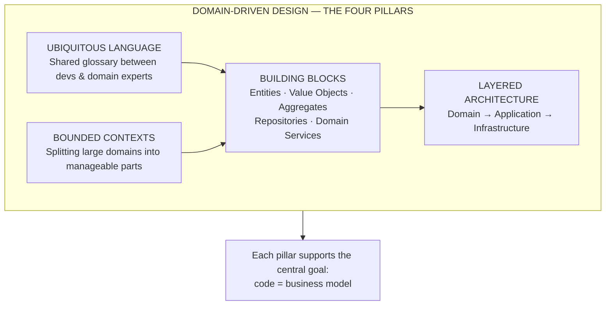
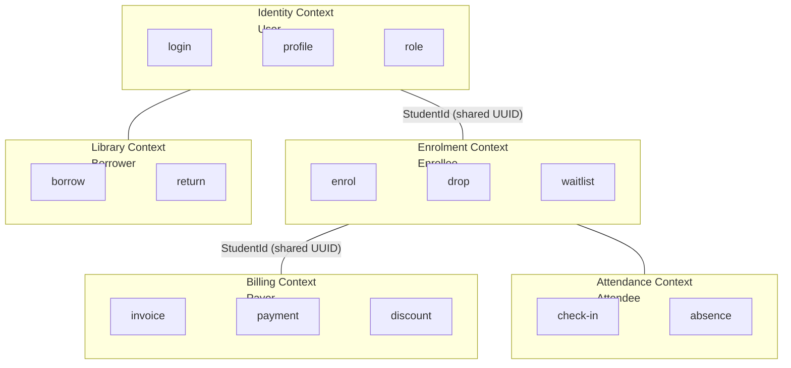

<section lang="en">

## What Is Domain-Driven Design?

**Domain-Driven Design (DDD)** is a software design approach that puts the business domain at the centre of every decision. Instead of starting with a database schema or a framework, you start by deeply understanding the problem space — the *domain* — and modelling your code to mirror it.

Eric Evans introduced DDD in his 2003 book and the core insight is deceptively simple: **the code should speak the same language as the business experts.** When a lecturer says "a student enrols in a course only if they have completed the prerequisite," your `Enrolment` class should enforce that rule — not some orphaned `if` statement in a controller a thousand lines away.

### Common Misconceptions

| Misconception | Reality |
|---|---|
| "DDD is about Entity and Value Object classes." | DDD is about **communication and boundaries** first. The building blocks are tools, not the goal. |
| "DDD requires CQRS, Event Sourcing, and microservices." | DDD works inside a monolith. CQRS and Event Sourcing are tactical patterns you *may* add when complexity demands them. |
| "DDD is only for enterprise Java projects." | DDD works in any language. PHP, with strong typing (PHP 8+), interfaces, and readonly classes, supports DDD well. |
| "DDD means no framework." | DDD means the domain layer has **zero framework dependencies**. Infrastructure layers (HTTP, database) can still use Symfony or Laravel. |

In this tutorial, you will learn the four pillars of DDD — Ubiquitous Language, Bounded Contexts, Building Blocks, and Layered Architecture — and apply them by refactoring a real PHP example.

</section>

<section lang="id">

## Apa Itu Domain-Driven Design?

**Domain-Driven Design (DDD)** adalah pendekatan desain perangkat lunak yang menempatkan domain bisnis di pusat setiap keputusan. Alih-alih memulai dengan skema database atau framework, Anda mulai dengan memahami secara mendalam ruang masalah, yaitu *domain*, lalu memodelkan kode Anda untuk mencerminkannya.

Eric Evans memperkenalkan DDD dalam bukunya tahun 2003 dan wawasan intinya sederhana namun menipu: **kode harus berbicara dalam bahasa yang sama dengan para ahli bisnis.** Ketika seorang dosen mengatakan "mahasiswa mendaftar mata kuliah hanya jika mereka telah menyelesaikan prasyaratnya," kelas `Enrolment` Anda harus menegakkan aturan itu, bukan statement `if` yatim piatu di controller yang berjarak seribu baris.

### Kesalahpahaman Umum

| Kesalahpahaman | Realitas |
|---|---|
| "DDD adalah tentang kelas Entity dan Value Object." | DDD adalah tentang **komunikasi dan batasan** terlebih dahulu. Building block adalah alat, bukan tujuan. |
| "DDD memerlukan CQRS, Event Sourcing, dan microservices." | DDD bekerja di dalam monolit. CQRS dan Event Sourcing adalah pola taktis yang *mungkin* Anda tambahkan ketika kompleksitas menuntutnya. |
| "DDD hanya untuk proyek enterprise Java." | DDD bekerja dalam bahasa apa pun. PHP, dengan strong typing (PHP 8+), interface, dan readonly class, mendukung DDD dengan baik. |
| "DDD berarti tanpa framework." | DDD berarti lapisan domain memiliki **nol dependensi framework**. Lapisan infrastruktur (HTTP, database) tetap dapat menggunakan Symfony atau Laravel. |

Dalam tutorial ini, Anda akan mempelajari empat pilar DDD: Ubiquitous Language, Bounded Contexts, Building Blocks, dan Layered Architecture, lalu menerapkannya dengan me-refactor contoh PHP nyata.

</section>

<figure class="my-10 text-center" role="figure">



<figcaption class="mt-3 text-sm text-neutral-500">
  <span lang="en">Figure: The four pillars of Domain-Driven Design covered in this tutorial</span>
  <span lang="id">Gambar: Empat pilar Domain-Driven Design yang dibahas dalam tutorial ini</span>
</figcaption>
</figure>

---

<section lang="en">

## Pillar 1: Ubiquitous Language

### The Problem

In a typical campus system, the same concept has different names in different places. The business expert says "course registration," the database schema has a table called `enrolments`, the controller variable is `$reg`, and the API returns `{ "enrollment_status": "confirmed" }`. When a bug report arrives, nobody is sure which term refers to what.

This translation layer — from business language to code language and back — is the source of countless misunderstandings and bugs.

### The Solution

**Ubiquitous Language** is a shared, precise vocabulary used by *everyone* on the project: domain experts, developers, QA, and even the UI copy. The same term appears in conversation, user stories, class names, database columns, and API responses.

### Building a Ubiquitous Language

Step 1 — Sit with a domain expert (a lecturer, a registrar) and capture raw statements:

> "When a student wants to join a course, they submit a registration request. The system checks whether the student has completed all required prerequisite courses. If they have, the registration is confirmed and the student is added to the course roster."

Step 2 — Extract the nouns and verbs. These become candidates for classes and methods:

| Raw Term | Refined Term | Becomes |
|---|---|---|
| "student" | `Student` | Entity |
| "course" | `Course` | Entity |
| "registration request" | `Enrolment` | Aggregate Root |
| "join a course" | `enrol(Student, Course)` | Method on `EnrolmentService` or `Student` |
| "completed prerequisite" | `hasCompletedPrerequisite(Course)` | Method on `Student` |
| "course roster" | `CourseRoster` | Value Object or Read Model |

Step 3 — **Enforce the language in code.** Never let a controller variable `$reg` slip through when the domain says `$enrolment`. Every mismatch erodes trust in the model.

### PHP Example: Before and After

**Before — inconsistent language:**

```php
<?php

class RegistrationCtrl
{
    public function joinCourse($sid, $cid): array
    {
        $reg = $this->db->findReg($sid, $cid);
        if ($reg) {
            return ['error' => 'already_in'];
        }

        $done = $this->checkDone($sid, $cid);
        if (!$done) {
            return ['error' => 'prereq_missing'];
        }

        $this->db->insertReg($sid, $cid);
        return ['status' => 'ok'];
    }

    private function checkDone($sid, $cid): bool
    {
        // Ambiguous: "done" what? Completed the course? Completed prerequisites?
        return true;
    }
}
```

**After — ubiquitous language in class and method names:**

```php
<?php

class EnrolmentService
{
    public function enrol(Student $student, Course $course): EnrolmentResult
    {
        if ($this->enrolmentRepository->exists($student, $course)) {
            return EnrolmentResult::alreadyEnrolled();
        }

        if (!$student->hasCompletedPrerequisitesFor($course)) {
            return EnrolmentResult::prerequisitesNotMet(
                $course->prerequisitesNotCompletedBy($student)
            );
        }

        $enrolment = $student->enrolIn($course);
        $this->enrolmentRepository->save($enrolment);

        return EnrolmentResult::confirmed($enrolment);
    }
}
```

No translation needed. The code reads like the domain expert's sentence.

### Rules of Thumb

| Do | Don't |
|---|---|
| Use the domain expert's exact words for class and method names. | Invent your own abbreviations (`$reg`, `$sid`, `chkPrereq`). |
| Document the glossary in a shared wiki or README — keep it alive. | Assume everyone "just knows" the terms. |
| Refactor class names when the business changes its terminology. | Keep the old name because "renaming is too hard." |
| Use the same term in API responses, error messages, and logs. | Call it "enrolment" in the API and "registration" in the email template. |

</section>

<section lang="id">

## Pilar 1: Ubiquitous Language

### Masalahnya

Dalam sistem kampus yang umum, konsep yang sama memiliki nama berbeda di tempat berbeda. Pakar bisnis mengatakan "registrasi mata kuliah," skema database memiliki tabel bernama `enrolments`, variabel controller adalah `$reg`, dan API mengembalikan `{ "enrollment_status": "confirmed" }`. Ketika laporan bug tiba, tidak ada yang yakin istilah mana merujuk ke apa.

Lapisan translasi ini, dari bahasa bisnis ke bahasa kode dan kembali, adalah sumber dari kesalahpahaman dan bug yang tak terhitung jumlahnya.

### Solusinya

**Ubiquitous Language** adalah kosakata bersama yang tepat yang digunakan oleh *semua orang* di proyek: pakar domain, pengembang, QA, dan bahkan teks UI. Istilah yang sama muncul dalam percakapan, user story, nama kelas, kolom database, dan respons API.

### Membangun Ubiquitous Language

Langkah 1: Duduklah dengan pakar domain (dosen, petugas registrasi) dan tangkap pernyataan mentah:

> "Ketika seorang mahasiswa ingin bergabung dengan mata kuliah, mereka mengajukan permintaan registrasi. Sistem memeriksa apakah mahasiswa telah menyelesaikan semua mata kuliah prasyarat yang diperlukan. Jika sudah, registrasi dikonfirmasi dan mahasiswa ditambahkan ke daftar hadir mata kuliah."

Langkah 2: Ekstrak kata benda dan kata kerja. Ini menjadi kandidat untuk kelas dan metode:

| Istilah Mentah | Istilah yang Disempurnakan | Menjadi |
|---|---|---|
| "mahasiswa" | `Student` | Entity |
| "mata kuliah" | `Course` | Entity |
| "permintaan registrasi" | `Enrolment` | Aggregate Root |
| "bergabung dengan mata kuliah" | `enrol(Student, Course)` | Metode pada `EnrolmentService` atau `Student` |
| "menyelesaikan prasyarat" | `hasCompletedPrerequisite(Course)` | Metode pada `Student` |
| "daftar hadir mata kuliah" | `CourseRoster` | Value Object atau Read Model |

Langkah 3: **Tegakkan bahasa dalam kode.** Jangan pernah biarkan variabel controller `$reg` lolos ketika domain mengatakan `$enrolment`. Setiap ketidakcocokan mengikis kepercayaan pada model.

### Contoh PHP: Before dan After

**Before (bahasa yang tidak konsisten):**

```php
<?php

class RegistrationCtrl
{
    public function joinCourse($sid, $cid): array
    {
        $reg = $this->db->findReg($sid, $cid);
        if ($reg) {
            return ['error' => 'already_in'];
        }

        $done = $this->checkDone($sid, $cid);
        if (!$done) {
            return ['error' => 'prereq_missing'];
        }

        $this->db->insertReg($sid, $cid);
        return ['status' => 'ok'];
    }

    private function checkDone($sid, $cid): bool
    {
        // Ambigu: "done" apa? Menyelesaikan mata kuliah? Menyelesaikan prasyarat?
        return true;
    }
}
```

**After (ubiquitous language dalam nama kelas dan metode):**

```php
<?php

class EnrolmentService
{
    public function enrol(Student $student, Course $course): EnrolmentResult
    {
        if ($this->enrolmentRepository->exists($student, $course)) {
            return EnrolmentResult::alreadyEnrolled();
        }

        if (!$student->hasCompletedPrerequisitesFor($course)) {
            return EnrolmentResult::prerequisitesNotMet(
                $course->prerequisitesNotCompletedBy($student)
            );
        }

        $enrolment = $student->enrolIn($course);
        $this->enrolmentRepository->save($enrolment);

        return EnrolmentResult::confirmed($enrolment);
    }
}
```

Tidak perlu translasi. Kode terbaca seperti kalimat pakar domain.

### Aturan Praktis

| Lakukan | Jangan Lakukan |
|---|---|
| Gunakan kata-kata persis pakar domain untuk nama kelas dan metode. | Ciptakan singkatan Anda sendiri (`$reg`, `$sid`, `chkPrereq`). |
| Dokumentasikan glosarium di wiki atau README bersama, dan jaga agar tetap hidup. | Asumsikan semua orang "sudah tahu" istilahnya. |
| Refactor nama kelas ketika bisnis mengubah terminologinya. | Pertahankan nama lama karena "rename terlalu sulit." |
| Gunakan istilah yang sama di respons API, pesan error, dan log. | Sebut "enrolment" di API dan "registration" di template email. |

</section>

---

<section lang="en">

## Pillar 2: Bounded Contexts

### The Problem

A large domain — like a university — contains many sub-domains: course catalogues, student enrolment, billing, library management, attendance tracking. If you try to build *one unified model* that satisfies every sub-domain, you end up with a `Student` class that has 200 properties (GPA, overdue books, unpaid invoices, dormitory room number, dietary preferences for the cafeteria) and every change to one sub-domain breaks another.

### The Solution

A **Bounded Context** is a logical boundary within which a particular domain model applies. Inside each context, terms have precise, unambiguous meanings. The same real-world thing (e.g., a "Student") may have different models in different contexts, and that is not only acceptable — it is *correct*.

### Context Map for a Campus System

| Bounded Context | Core Responsibility | What "Student" Means |
|---|---|---|
| **Enrolment** | Course registration, prerequisites, waitlists, drops | An enrollee with an academic record. Properties: `enrolledCourses`, `completedCourses`, `academicStanding`. |
| **Billing** | Tuition invoicing, payments, scholarships | A payer with a financial record. Properties: `outstandingBalance`, `paymentHistory`, `scholarshipDiscount`. |
| **Library** | Book borrowing, returns, fines | A borrower with a library account. Properties: `borrowedBooks`, `overdueFine`, `membershipStatus`. |
| **Attendance** | Class attendance, participation tracking | An attendee with attendance records. Properties: `attendedSessions`, `attendancePercentage`. |
| **Identity** | Login, roles, profile | A user with authentication credentials. Properties: `email`, `passwordHash`, `role`. |

These five models of "Student" share an identity (a `StudentId` UUID), but they do not share a class. The Billing context does not need to know the student's GPA, and the Attendance context does not need to know about overdue library books.

### Context Relationships

Bounded contexts communicate through well-defined interfaces. The diagram below shows a typical campus context map:

</section>

<section lang="id">

## Pilar 2: Bounded Contexts

### Masalahnya

Domain besar, seperti universitas, berisi banyak sub-domain: katalog mata kuliah, pendaftaran mahasiswa, penagihan, manajemen perpustakaan, pelacakan kehadiran. Jika Anda mencoba membangun *satu model terpadu* yang memuaskan setiap sub-domain, Anda akan berakhir dengan kelas `Student` yang memiliki 200 properti (IPK, buku yang terlambat, invoice yang belum dibayar, nomor kamar asrama, preferensi diet untuk kafetaria) dan setiap perubahan pada satu sub-domain merusak yang lain.

### Solusinya

**Bounded Context** adalah batas logis di mana model domain tertentu berlaku. Di dalam setiap context, istilah memiliki makna yang tepat dan tidak ambigu. Hal dunia nyata yang sama (misalnya, "Student") mungkin memiliki model yang berbeda di context yang berbeda, dan itu bukan hanya dapat diterima, melainkan *benar*.

### Context Map untuk Sistem Kampus

| Bounded Context | Tanggung Jawab Inti | Apa Arti "Student" |
|---|---|---|
| **Enrolment** | Pendaftaran mata kuliah, prasyarat, waitlist, drop | Pendaftar dengan catatan akademik. Properti: `enrolledCourses`, `completedCourses`, `academicStanding`. |
| **Billing** | Invoice UKT, pembayaran, beasiswa | Pembayar dengan catatan keuangan. Properti: `outstandingBalance`, `paymentHistory`, `scholarshipDiscount`. |
| **Library** | Peminjaman buku, pengembalian, denda | Peminjam dengan akun perpustakaan. Properti: `borrowedBooks`, `overdueFine`, `membershipStatus`. |
| **Attendance** | Kehadiran kelas, pelacakan partisipasi | Peserta dengan catatan kehadiran. Properti: `attendedSessions`, `attendancePercentage`. |
| **Identity** | Login, peran, profil | Pengguna dengan kredensial autentikasi. Properti: `email`, `passwordHash`, `role`. |

Kelima model "Student" ini berbagi identitas (UUID `StudentId`), tetapi mereka tidak berbagi kelas. Context Billing tidak perlu tahu IPK mahasiswa, dan context Attendance tidak perlu tahu tentang buku perpustakaan yang terlambat.

### Hubungan Antar Context

Bounded context berkomunikasi melalui antarmuka yang terdefinisi dengan baik. Diagram di bawah ini menunjukkan context map kampus yang umum:

</section>

<figure class="my-10 text-center" role="figure">



<figcaption class="mt-3 text-sm text-neutral-500">
  <span lang="en">Figure: Bounded contexts in a campus system connected through shared identifiers</span>
  <span lang="id">Gambar: Bounded context dalam sistem kampus yang terhubung melalui identifier bersama</span>
</figcaption>
</figure>

---

<section lang="en">

### Integrating Contexts: Shared Kernel vs Anti-Corruption Layer

Two contexts that need to share data have several options:

**Shared Kernel** — two contexts agree on a small, shared subset of the model. For example, Identity and Enrolment contexts both use the same `StudentId` value object. Keep the shared kernel as small as possible.

**Anti-Corruption Layer (ACL)** — when one context must consume data from another, build a translation layer that converts the external model into your internal model. This prevents the other context's design from "leaking" into yours.

```php
<?php

// Anti-Corruption Layer: Enrolment context calls Billing context
// but translates the response into its own model

class BillingAntiCorruptionLayer
{
    public function __construct(
        private BillingApiClient $billingClient
    ) {}

    public function getStudentPaymentStatus(StudentId $studentId): PaymentStatus
    {
        $raw = $this->billingClient->fetchStudent(
            $studentId->toString()
        );

        // Translate external model into Enrolment context's model
        return match ($raw['financial_status']) {
            'clear'        => PaymentStatus::Clear,
            'outstanding'  => PaymentStatus::Outstanding,
            'suspended'    => PaymentStatus::Suspended,
            default        => throw new \RuntimeException(
                "Unknown billing status: {$raw['financial_status']}"
            ),
        };
    }
}
```

An ACL is extra code, but it is a one-time investment. Without it, a change in the Billing API silently cascades into every if-statement that checks `$raw['financial_status']`.

</section>

<section lang="id">

### Mengintegrasikan Context: Shared Kernel vs Anti-Corruption Layer

Dua context yang perlu berbagi data memiliki beberapa opsi:

**Shared Kernel**: dua context menyetujui subset kecil model yang dibagikan. Misalnya, context Identity dan Enrolment sama-sama menggunakan value object `StudentId` yang sama. Jaga shared kernel sekecil mungkin.

**Anti-Corruption Layer (ACL)**: ketika satu context harus mengonsumsi data dari context lain, bangun lapisan translasi yang mengonversi model eksternal ke dalam model internal Anda. Ini mencegah desain context lain "bocor" ke dalam desain Anda.

```php
<?php

// Anti-Corruption Layer: Context Enrolment memanggil context Billing
// tetapi menerjemahkan responsnya ke dalam modelnya sendiri

class BillingAntiCorruptionLayer
{
    public function __construct(
        private BillingApiClient $billingClient
    ) {}

    public function getStudentPaymentStatus(StudentId $studentId): PaymentStatus
    {
        $raw = $this->billingClient->fetchStudent(
            $studentId->toString()
        );

        // Terjemahkan model eksternal ke model context Enrolment
        return match ($raw['financial_status']) {
            'clear'        => PaymentStatus::Clear,
            'outstanding'  => PaymentStatus::Outstanding,
            'suspended'    => PaymentStatus::Suspended,
            default        => throw new \RuntimeException(
                "Status billing tidak dikenal: {$raw['financial_status']}"
            ),
        };
    }
}
```

ACL adalah kode tambahan, tetapi ini adalah investasi satu kali. Tanpanya, perubahan di Billing API secara diam-diam merambat ke setiap if-statement yang memeriksa `$raw['financial_status']`.

</section>

---

<section lang="en">

## Pillar 3: DDD Building Blocks in PHP

DDD provides a set of **tactical patterns** — concrete building blocks you use to construct the domain model. Each block has a specific role and a specific set of rules.

### Entity

An **Entity** is an object defined by its **identity**, not its attributes. Two `Student` objects with the same NIM are the same student, even if one has a stale name and the other has an updated one. Entities are mutable — their attributes change over time while their identity remains constant.

```php
<?php

class Student
{
    /** @param Enrolment[] $enrolments */
    private array $enrolments = [];

    private function __construct(
        private StudentId $id,
        private string $name,
        private Email $email,
        private NIM $nim,
    ) {}

    public static function register(
        StudentId $id,
        string $name,
        Email $email,
        NIM $nim
    ): self {
        return new self($id, $name, $email, $nim);
    }

    public function enrolIn(Course $course): Enrolment
    {
        $enrolment = Enrolment::create(
            EnrolmentId::generate(),
            $this->id,
            $course->id(),
            new \DateTimeImmutable()
        );

        $this->enrolments[] = $enrolment;

        return $enrolment;
    }

    public function id(): StudentId { return $this->id; }
    public function name(): string { return $this->name; }
    public function email(): Email { return $this->email; }
    public function nim(): NIM { return $this->nim; }

    /** @return Enrolment[] */
    public function enrolments(): array { return $this->enrolments; }
}
```

Key rules:
- An entity always has an identifier (`StudentId`, `EnrolmentId`).
- Identity equality: `$studentA->id()->equals($studentB->id())` determines sameness, not `$studentA == $studentB`.
- Entities encapsulate behaviour. The `enrolIn()` method is on `Student`, not in a separate `StudentService`.

### Value Object

A **Value Object** has no identity. It is defined entirely by its attributes. Two `Money` objects with the same amount and currency are interchangeable. Value Objects are **immutable** — methods return new instances rather than modifying state.

```php
<?php

class StudentId
{
    private function __construct(
        private string $value
    ) {}

    public static function generate(): self
    {
        return new self(bin2hex(random_bytes(16)));
    }

    public static function fromString(string $value): self
    {
        if (!preg_match('/^[a-f0-9]{32}$/', $value)) {
            throw new \InvalidArgumentException("Invalid StudentId: $value");
        }
        return new self($value);
    }

    public function equals(self $other): bool
    {
        return $this->value === $other->value;
    }

    public function toString(): string
    {
        return $this->value;
    }
}
```

```php
<?php

class NIM
{
    private function __construct(
        private string $value
    ) {}

    public static function fromString(string $value): self
    {
        if (!preg_match('/^\d{10}$/', $value)) {
            throw new \InvalidArgumentException("NIM must be exactly 10 digits, got: $value");
        }
        return new self($value);
    }

    public function equals(self $other): bool
    {
        return $this->value === $other->value;
    }

    public function toString(): string
    {
        return $this->value;
    }

    public function admissionYear(): int
    {
        return (int) substr($this->value, 0, 4);
    }
}
```

```php
<?php

class Email
{
    private function __construct(
        private string $value
    ) {}

    public static function fromString(string $value): self
    {
        if (!filter_var($value, FILTER_VALIDATE_EMAIL)) {
            throw new \InvalidArgumentException("Invalid email address: $value");
        }
        return new self(strtolower($value));
    }

    public function equals(self $other): bool
    {
        return $this->value === $other->value;
    }

    public function toString(): string { return $this->value; }

    public function domain(): string
    {
        return substr($this->value, strpos($this->value, '@') + 1);
    }
}
```

### Entity vs Value Object — Quick Decision Table

| Criterion | Entity | Value Object |
|---|---|---|
| Has identity? | Yes — two objects with the same ID are the same thing. | No — two objects with the same attributes are interchangeable. |
| Mutable or immutable? | Mutable (attributes change, identity stays). | Immutable (methods return new instances). |
| Equality check | By ID (`$a->id()->equals($b->id())`). | By value (every attribute must match). |
| Lifecycle | Created, updated, (soft) deleted. | Created and discarded. |
| PHP examples | `Student`, `Course`, `Enrolment`. | `StudentId`, `NIM`, `Email`, `Money`. |

### Aggregate and Aggregate Root

An **Aggregate** is a cluster of entities and value objects treated as a single unit for data changes. The **Aggregate Root** is the single entry point — all external references to the aggregate go through the root.

**Why?** Without aggregates, any part of the code can modify any entity, and business invariants scatter across the codebase. With aggregates, the root guarantees consistency.

Example: The `Enrolment` aggregate:
- Aggregate root: `Enrolment`
- Internal entity: `EnrolmentHistory` (a log of status changes, never accessed directly)
- Invariant: "An enrolment cannot be confirmed if the maximum capacity is reached."

```php
<?php

class Enrolment
{
    /** @var EnrolmentHistory[] */
    private array $history = [];

    private function __construct(
        private EnrolmentId $id,
        private StudentId $studentId,
        private CourseId $courseId,
        private EnrolmentStatus $status,
        private \DateTimeImmutable $createdAt,
    ) {}

    public static function create(
        EnrolmentId $id,
        StudentId $studentId,
        CourseId $courseId,
        \DateTimeImmutable $createdAt
    ): self {
        $enrolment = new self($id, $studentId, $courseId, EnrolmentStatus::Pending, $createdAt);
        $enrolment->recordEvent(new EnrolmentCreated($id, $studentId, $courseId, $createdAt));
        return $enrolment;
    }

    public function confirm(int $currentEnrolmentCount, int $maxCapacity): void
    {
        if ($this->status !== EnrolmentStatus::Pending) {
            throw new \DomainException("Only pending enrolments can be confirmed.");
        }

        if ($currentEnrolmentCount >= $maxCapacity) {
            throw new \DomainException(
                "Course capacity reached ({$maxCapacity}). Cannot confirm enrolment."
            );
        }

        $this->status = EnrolmentStatus::Confirmed;
        $this->recordEvent(new EnrolmentConfirmed($this->id, new \DateTimeImmutable()));
    }

    public function cancel(): void
    {
        if ($this->status === EnrolmentStatus::Cancelled) {
            throw new \DomainException("Enrolment is already cancelled.");
        }

        $this->status = EnrolmentStatus::Cancelled;
        $this->recordEvent(new EnrolmentCancelled($this->id, new \DateTimeImmutable()));
    }

    public function id(): EnrolmentId { return $this->id; }
    public function studentId(): StudentId { return $this->studentId; }
    public function courseId(): CourseId { return $this->courseId; }
    public function status(): EnrolmentStatus { return $this->status; }

    private function recordEvent(object $event): void
    {
        $this->history[] = new EnrolmentHistory(
            EnrolmentHistoryId::generate(),
            $this->id,
            $event,
            new \DateTimeImmutable()
        );
    }
}
```

Key rules:
- Only the aggregate root (`Enrolment`) has a global identity. Internal entities have local identities.
- External code never holds a reference to `EnrolmentHistory`. It talks to `Enrolment` only.
- All invariants are checked inside the aggregate before state changes.
- Aggregates should be small. A `University` aggregate containing every `Student` and `Course` is the wrong granularity — prefer many small aggregates.

### Repository

A **Repository** provides the illusion of an in-memory collection for aggregate roots. Application code retrieves and persists aggregates through the repository, never touching the database directly.

```php
<?php

interface EnrolmentRepository
{
    public function save(Enrolment $enrolment): void;
    public function findById(EnrolmentId $id): ?Enrolment;
    public function findByStudent(StudentId $studentId): array;
    public function countForCourse(CourseId $courseId): int;
    public function exists(StudentId $studentId, CourseId $courseId): bool;
}
```

A concrete implementation using PDO (in the infrastructure layer):

```php
<?php

class PdoEnrolmentRepository implements EnrolmentRepository
{
    public function __construct(private \PDO $pdo) {}

    public function save(Enrolment $enrolment): void
    {
        $stmt = $this->pdo->prepare(
            'INSERT INTO enrolments (id, student_id, course_id, status, created_at)
             VALUES (?, ?, ?, ?, ?)
             ON CONFLICT (id) DO UPDATE SET status = ?, created_at = ?'
        );
        $stmt->execute([
            $enrolment->id()->toString(),
            $enrolment->studentId()->toString(),
            $enrolment->courseId()->toString(),
            $enrolment->status()->value,
            $enrolment->createdAt()->format('Y-m-d H:i:s'),
            $enrolment->status()->value,
            $enrolment->createdAt()->format('Y-m-d H:i:s'),
        ]);
    }

    public function findById(EnrolmentId $id): ?Enrolment
    {
        $stmt = $this->pdo->prepare(
            'SELECT * FROM enrolments WHERE id = ?'
        );
        $stmt->execute([$id->toString()]);
        $row = $stmt->fetch(\PDO::FETCH_ASSOC);

        return $row ? $this->hydrate($row) : null;
    }

    private function hydrate(array $row): Enrolment
    {
        return new Enrolment(
            EnrolmentId::fromString($row['id']),
            StudentId::fromString($row['student_id']),
            CourseId::fromString($row['course_id']),
            EnrolmentStatus::from($row['status']),
            new \DateTimeImmutable($row['created_at']),
        );
    }

    // ... other methods
}
```

The `PdoEnrolmentRepository` lives in the infrastructure layer. The `EnrolmentRepository` interface lives in the domain layer. Application code depends on the interface — it never knows about PDO.

### Domain Service

When a business operation does not naturally belong to any single entity, use a **Domain Service**. Unlike application services (which orchestrate workflows), domain services contain pure domain logic.

```php
<?php

class PrerequisiteChecker
{
    public function studentMeetsAllPrerequisites(
        Student $student,
        Course $course
    ): bool {
        foreach ($course->prerequisites() as $prerequisite) {
            if (!$student->hasCompleted($prerequisite->requiredCourseId())) {
                return false;
            }
        }
        return true;
    }
}
```

### Building Blocks Summary

| Block | Identity? | Responsibility | Lives In |
|---|---|---|---|
| **Entity** | Yes | Mutable object with a unique identity and lifecycle. | Domain |
| **Value Object** | No | Immutable, self-validating value. | Domain |
| **Aggregate** | Root has identity | Cluster of entities + value objects; enforces invariants. | Domain |
| **Repository** | No | Persistence abstraction for aggregate roots. | Interface in Domain, implementation in Infrastructure |
| **Domain Service** | No | Stateless domain logic that spans multiple entities. | Domain |
| **Domain Event** | No | Something important that happened in the domain. | Domain |
| **Application Service** | No | Orchestrates use cases by coordinating domain objects and repositories. | Application |

</section>

<section lang="id">

## Pilar 3: Building Block DDD dalam PHP

DDD menyediakan serangkaian **pola taktis**, yaitu building block konkret yang Anda gunakan untuk membangun model domain. Setiap block memiliki peran spesifik dan seperangkat aturan spesifik.

### Entity

**Entity** adalah objek yang didefinisikan oleh **identitasnya**, bukan atributnya. Dua objek `Student` dengan NIM yang sama adalah mahasiswa yang sama, meskipun satu memiliki nama usang dan yang lain memiliki nama yang diperbarui. Entity bersifat mutable: atributnya berubah seiring waktu sementara identitasnya tetap konstan.

```php
<?php

class Student
{
    /** @param Enrolment[] $enrolments */
    private array $enrolments = [];

    private function __construct(
        private StudentId $id,
        private string $name,
        private Email $email,
        private NIM $nim,
    ) {}

    public static function register(
        StudentId $id,
        string $name,
        Email $email,
        NIM $nim
    ): self {
        return new self($id, $name, $email, $nim);
    }

    public function enrolIn(Course $course): Enrolment
    {
        $enrolment = Enrolment::create(
            EnrolmentId::generate(),
            $this->id,
            $course->id(),
            new \DateTimeImmutable()
        );

        $this->enrolments[] = $enrolment;

        return $enrolment;
    }

    public function id(): StudentId { return $this->id; }
    public function name(): string { return $this->name; }
    public function email(): Email { return $this->email; }
    public function nim(): NIM { return $this->nim; }

    /** @return Enrolment[] */
    public function enrolments(): array { return $this->enrolments; }
}
```

Aturan kunci:
- Entity selalu memiliki identifier (`StudentId`, `EnrolmentId`).
- Kesamaan identitas: `$studentA->id()->equals($studentB->id())` menentukan kesamaan, bukan `$studentA == $studentB`.
- Entity mengenkapsulasi perilaku. Metode `enrolIn()` ada di `Student`, bukan di `StudentService` terpisah.

### Value Object

**Value Object** tidak memiliki identitas. Ia didefinisikan sepenuhnya oleh atributnya. Dua objek `Money` dengan jumlah dan mata uang yang sama dapat dipertukarkan. Value Object bersifat **immutable**: metode mengembalikan instance baru, bukan memodifikasi state.

```php
<?php

class StudentId
{
    private function __construct(
        private string $value
    ) {}

    public static function generate(): self
    {
        return new self(bin2hex(random_bytes(16)));
    }

    public static function fromString(string $value): self
    {
        if (!preg_match('/^[a-f0-9]{32}$/', $value)) {
            throw new \InvalidArgumentException("StudentId tidak valid: $value");
        }
        return new self($value);
    }

    public function equals(self $other): bool
    {
        return $this->value === $other->value;
    }

    public function toString(): string
    {
        return $this->value;
    }
}
```

```php
<?php

class NIM
{
    private function __construct(
        private string $value
    ) {}

    public static function fromString(string $value): self
    {
        if (!preg_match('/^\d{10}$/', $value)) {
            throw new \InvalidArgumentException("NIM harus tepat 10 digit, diterima: $value");
        }
        return new self($value);
    }

    public function equals(self $other): bool
    {
        return $this->value === $other->value;
    }

    public function toString(): string
    {
        return $this->value;
    }

    public function admissionYear(): int
    {
        return (int) substr($this->value, 0, 4);
    }
}
```

```php
<?php

class Email
{
    private function __construct(
        private string $value
    ) {}

    public static function fromString(string $value): self
    {
        if (!filter_var($value, FILTER_VALIDATE_EMAIL)) {
            throw new \InvalidArgumentException("Alamat email tidak valid: $value");
        }
        return new self(strtolower($value));
    }

    public function equals(self $other): bool
    {
        return $this->value === $other->value;
    }

    public function toString(): string { return $this->value; }

    public function domain(): string
    {
        return substr($this->value, strpos($this->value, '@') + 1);
    }
}
```

### Entity vs Value Object: Tabel Keputusan Cepat

| Kriteria | Entity | Value Object |
|---|---|---|
| Memiliki identitas? | Ya: dua objek dengan ID yang sama adalah hal yang sama. | Tidak: dua objek dengan atribut yang sama dapat dipertukarkan. |
| Mutable atau immutable? | Mutable (atribut berubah, identitas tetap). | Immutable (metode mengembalikan instance baru). |
| Pemeriksaan kesamaan | Berdasarkan ID (`$a->id()->equals($b->id())`). | Berdasarkan nilai (setiap atribut harus cocok). |
| Siklus hidup | Dibuat, diperbarui, (soft) dihapus. | Dibuat dan dibuang. |
| Contoh PHP | `Student`, `Course`, `Enrolment`. | `StudentId`, `NIM`, `Email`, `Money`. |

### Aggregate dan Aggregate Root

**Aggregate** adalah kluster entity dan value object yang diperlakukan sebagai satu unit untuk perubahan data. **Aggregate Root** adalah titik masuk tunggal: semua referensi eksternal ke aggregate melalui root.

**Mengapa?** Tanpa aggregate, bagian kode mana pun dapat memodifikasi entity mana pun, dan invarian bisnis tersebar di seluruh basis kode. Dengan aggregate, root menjamin konsistensi.

Contoh: Aggregate `Enrolment`:
- Aggregate root: `Enrolment`
- Entity internal: `EnrolmentHistory` (log perubahan status, tidak pernah diakses langsung)
- Invarian: "Enrolment tidak dapat dikonfirmasi jika kapasitas maksimum tercapai."

```php
<?php

class Enrolment
{
    /** @var EnrolmentHistory[] */
    private array $history = [];

    private function __construct(
        private EnrolmentId $id,
        private StudentId $studentId,
        private CourseId $courseId,
        private EnrolmentStatus $status,
        private \DateTimeImmutable $createdAt,
    ) {}

    public static function create(
        EnrolmentId $id,
        StudentId $studentId,
        CourseId $courseId,
        \DateTimeImmutable $createdAt
    ): self {
        $enrolment = new self($id, $studentId, $courseId, EnrolmentStatus::Pending, $createdAt);
        $enrolment->recordEvent(new EnrolmentCreated($id, $studentId, $courseId, $createdAt));
        return $enrolment;
    }

    public function confirm(int $currentEnrolmentCount, int $maxCapacity): void
    {
        if ($this->status !== EnrolmentStatus::Pending) {
            throw new \DomainException("Hanya enrolment pending yang dapat dikonfirmasi.");
        }

        if ($currentEnrolmentCount >= $maxCapacity) {
            throw new \DomainException(
                "Kapasitas course tercapai ({$maxCapacity}). Tidak dapat mengkonfirmasi enrolment."
            );
        }

        $this->status = EnrolmentStatus::Confirmed;
        $this->recordEvent(new EnrolmentConfirmed($this->id, new \DateTimeImmutable()));
    }

    public function cancel(): void
    {
        if ($this->status === EnrolmentStatus::Cancelled) {
            throw new \DomainException("Enrolment sudah dibatalkan.");
        }

        $this->status = EnrolmentStatus::Cancelled;
        $this->recordEvent(new EnrolmentCancelled($this->id, new \DateTimeImmutable()));
    }

    public function id(): EnrolmentId { return $this->id; }
    public function studentId(): StudentId { return $this->studentId; }
    public function courseId(): CourseId { return $this->courseId; }
    public function status(): EnrolmentStatus { return $this->status; }

    private function recordEvent(object $event): void
    {
        $this->history[] = new EnrolmentHistory(
            EnrolmentHistoryId::generate(),
            $this->id,
            $event,
            new \DateTimeImmutable()
        );
    }
}
```

Aturan kunci:
- Hanya aggregate root (`Enrolment`) yang memiliki identitas global. Entity internal memiliki identitas lokal.
- Kode eksternal tidak pernah menyimpan referensi ke `EnrolmentHistory`. Ia hanya berbicara ke `Enrolment`.
- Semua invarian diperiksa di dalam aggregate sebelum perubahan state.
- Aggregate harus kecil. Aggregate `University` yang berisi setiap `Student` dan `Course` adalah granularitas yang salah, sebaiknya gunakan banyak aggregate kecil.

### Repository

**Repository** menyediakan ilusi koleksi dalam memori untuk aggregate root. Kode aplikasi mengambil dan menyimpan aggregate melalui repository, tidak pernah menyentuh database secara langsung.

```php
<?php

interface EnrolmentRepository
{
    public function save(Enrolment $enrolment): void;
    public function findById(EnrolmentId $id): ?Enrolment;
    public function findByStudent(StudentId $studentId): array;
    public function countForCourse(CourseId $courseId): int;
    public function exists(StudentId $studentId, CourseId $courseId): bool;
}
```

Implementasi konkret menggunakan PDO (di lapisan infrastruktur):

```php
<?php

class PdoEnrolmentRepository implements EnrolmentRepository
{
    public function __construct(private \PDO $pdo) {}

    public function save(Enrolment $enrolment): void
    {
        $stmt = $this->pdo->prepare(
            'INSERT INTO enrolments (id, student_id, course_id, status, created_at)
             VALUES (?, ?, ?, ?, ?)
             ON CONFLICT (id) DO UPDATE SET status = ?, created_at = ?'
        );
        $stmt->execute([
            $enrolment->id()->toString(),
            $enrolment->studentId()->toString(),
            $enrolment->courseId()->toString(),
            $enrolment->status()->value,
            $enrolment->createdAt()->format('Y-m-d H:i:s'),
            $enrolment->status()->value,
            $enrolment->createdAt()->format('Y-m-d H:i:s'),
        ]);
    }

    public function findById(EnrolmentId $id): ?Enrolment
    {
        $stmt = $this->pdo->prepare(
            'SELECT * FROM enrolments WHERE id = ?'
        );
        $stmt->execute([$id->toString()]);
        $row = $stmt->fetch(\PDO::FETCH_ASSOC);

        return $row ? $this->hydrate($row) : null;
    }

    private function hydrate(array $row): Enrolment
    {
        return new Enrolment(
            EnrolmentId::fromString($row['id']),
            StudentId::fromString($row['student_id']),
            CourseId::fromString($row['course_id']),
            EnrolmentStatus::from($row['status']),
            new \DateTimeImmutable($row['created_at']),
        );
    }

    // ... metode lainnya
}
```

`PdoEnrolmentRepository` tinggal di lapisan infrastruktur. Interface `EnrolmentRepository` tinggal di lapisan domain. Kode aplikasi bergantung pada interface: ia tidak pernah tahu tentang PDO.

### Domain Service

Ketika operasi bisnis tidak secara alami dimiliki oleh satu entity pun, gunakan **Domain Service**. Berbeda dengan application service (yang mengorkestrasi workflow), domain service berisi logika domain murni.

```php
<?php

class PrerequisiteChecker
{
    public function studentMeetsAllPrerequisites(
        Student $student,
        Course $course
    ): bool {
        foreach ($course->prerequisites() as $prerequisite) {
            if (!$student->hasCompleted($prerequisite->requiredCourseId())) {
                return false;
            }
        }
        return true;
    }
}
```

### Ringkasan Building Block

| Block | Identitas? | Tanggung Jawab | Tinggal Di |
|---|---|---|---|
| **Entity** | Ya | Objek mutable dengan identitas unik dan siklus hidup. | Domain |
| **Value Object** | Tidak | Nilai immutable yang memvalidasi diri sendiri. | Domain |
| **Aggregate** | Root memiliki identitas | Kluster entity + value object; menegakkan invarian. | Domain |
| **Repository** | Tidak | Abstraksi persistensi untuk aggregate root. | Interface di Domain, implementasi di Infrastructure |
| **Domain Service** | Tidak | Logika domain stateless yang mencakup beberapa entity. | Domain |
| **Domain Event** | Tidak | Sesuatu yang penting terjadi di domain. | Domain |
| **Application Service** | Tidak | Mengorkestrasi use case dengan mengoordinasikan objek domain dan repository. | Application |

</section>

---

<section lang="en">

## Pillar 4: Layered Architecture

DDD prescribes a **layered architecture** where each layer has a distinct responsibility and dependencies point inward. The domain layer is the heart — it has zero dependencies on frameworks, databases, or HTTP libraries.

### The Four Layers

| Layer | Responsibility | Depends On | Example Classes |
|---|---|---|---|
| **User Interface** | HTTP controllers, CLI commands, queue consumers. | Application layer. | `EnrolmentController`, `ImportStudentsCommand` |
| **Application** | Use case orchestration. Thin — delegates to domain. | Domain layer. | `EnrolStudentUseCase`, `CancelEnrolmentUseCase` |
| **Domain** | Business rules, entities, value objects, domain services. | Nothing (pure PHP). | `Student`, `Enrolment`, `PrerequisiteChecker` |
| **Infrastructure** | Database, HTTP clients, email, file system. | Implements domain interfaces. | `PdoEnrolmentRepository`, `SmtpMailer` |

### Folder Structure

```
src/
├── Domain/
│   ├── Enrolment/
│   │   ├── Enrolment.php              (aggregate root)
│   │   ├── EnrolmentId.php            (value object)
│   │   ├── EnrolmentStatus.php        (enum)
│   │   ├── EnrolmentRepository.php    (interface)
│   │   └── EnrolmentHistory.php       (internal entity)
│   ├── Student/
│   │   ├── Student.php                (entity)
│   │   ├── StudentId.php              (value object)
│   │   ├── NIM.php                    (value object)
│   │   ├── Email.php                  (value object)
│   │   └── StudentRepository.php      (interface)
│   └── Course/
│       ├── Course.php
│       ├── CourseId.php
│       └── Prerequisite.php
├── Application/
│   └── Enrolment/
│       ├── EnrolStudentUseCase.php
│       ├── CancelEnrolmentUseCase.php
│       └── EnrolmentResult.php
├── Infrastructure/
│   └── Persistence/
│       ├── PdoEnrolmentRepository.php
│       └── PdoStudentRepository.php
└── UserInterface/
    └── Controller/
        └── EnrolmentController.php
```

Notice:
- The **Domain** folder is organised around business concepts (Enrolment, Student, Course), not technical layers (Models, Services, Helpers).
- Each aggregate gets its own subfolder containing the root, value objects, repository interface, and internal entities.
- The `EnrolmentRepository` interface is in `Domain/Enrolment/`. The PDO implementation is in `Infrastructure/Persistence/`.

### Dependency Rule

```
┌──────────────────────────────────────────┐
│        User Interface (Controllers)       │
│                                            │
│    ┌──────────────────────────────────┐    │
│    │      Application (Use Cases)      │    │
│    │                                    │    │
│    │    ┌──────────────────────────┐    │    │
│    │    │      Domain (Entities,    │    │    │
│    │    │   Value Objects, Repo    │    │    │
│    │    │      Interfaces)         │    │    │
│    │    └──────────────────────────┘    │    │
│    │              ▲                      │    │
│    └──────────────┼──────────────────────┘    │
│                   │                           │
│    ┌──────────────┴──────────────────────┐    │
│    │    Infrastructure (PDO, HTTP,        │    │
│    │    Mailer — implements Domain        │    │
│    │    interfaces)                       │    │
│    └─────────────────────────────────────┘    │
└──────────────────────────────────────────────┘

Dependencies always point toward Domain.
Infrastructure depends on Domain (not the reverse).
```

This means you can swap `PdoEnrolmentRepository` for a `RedisEnrolmentRepository` without touching a single line in the Domain or Application layers.

</section>

<section lang="id">

## Pilar 4: Arsitektur Berlapis

DDD menganjurkan **arsitektur berlapis** di mana setiap lapisan memiliki tanggung jawab yang berbeda dan dependensi mengarah ke dalam. Lapisan domain adalah jantungnya: ia memiliki nol dependensi pada framework, database, atau library HTTP.

### Empat Lapisan

| Lapisan | Tanggung Jawab | Bergantung Pada | Contoh Kelas |
|---|---|---|---|
| **User Interface** | HTTP controller, perintah CLI, queue consumer. | Lapisan Application. | `EnrolmentController`, `ImportStudentsCommand` |
| **Application** | Orkestrasi use case. Tipis, mendelegasikan ke domain. | Lapisan Domain. | `EnrolStudentUseCase`, `CancelEnrolmentUseCase` |
| **Domain** | Aturan bisnis, entity, value object, domain service. | Tidak ada (PHP murni). | `Student`, `Enrolment`, `PrerequisiteChecker` |
| **Infrastructure** | Database, HTTP client, email, sistem file. | Mengimplementasikan interface domain. | `PdoEnrolmentRepository`, `SmtpMailer` |

### Struktur Folder

```
src/
├── Domain/
│   ├── Enrolment/
│   │   ├── Enrolment.php              (aggregate root)
│   │   ├── EnrolmentId.php            (value object)
│   │   ├── EnrolmentStatus.php        (enum)
│   │   ├── EnrolmentRepository.php    (interface)
│   │   └── EnrolmentHistory.php       (entity internal)
│   ├── Student/
│   │   ├── Student.php                (entity)
│   │   ├── StudentId.php              (value object)
│   │   ├── NIM.php                    (value object)
│   │   ├── Email.php                  (value object)
│   │   └── StudentRepository.php      (interface)
│   └── Course/
│       ├── Course.php
│       ├── CourseId.php
│       └── Prerequisite.php
├── Application/
│   └── Enrolment/
│       ├── EnrolStudentUseCase.php
│       ├── CancelEnrolmentUseCase.php
│       └── EnrolmentResult.php
├── Infrastructure/
│   └── Persistence/
│       ├── PdoEnrolmentRepository.php
│       └── PdoStudentRepository.php
└── UserInterface/
    └── Controller/
        └── EnrolmentController.php
```

Perhatikan:
- Folder **Domain** diorganisasikan berdasarkan konsep bisnis (Enrolment, Student, Course), bukan lapisan teknis (Models, Services, Helpers).
- Setiap aggregate mendapatkan subfolder sendiri yang berisi root, value object, interface repository, dan entity internal.
- Interface `EnrolmentRepository` ada di `Domain/Enrolment/`. Implementasi PDO ada di `Infrastructure/Persistence/`.

### Aturan Dependensi

```
┌──────────────────────────────────────────┐
│        User Interface (Controllers)       │
│                                            │
│    ┌──────────────────────────────────┐    │
│    │      Application (Use Cases)      │    │
│    │                                    │    │
│    │    ┌──────────────────────────┐    │    │
│    │    │      Domain (Entities,    │    │    │
│    │    │   Value Objects, Repo    │    │    │
│    │    │      Interfaces)         │    │    │
│    │    └──────────────────────────┘    │    │
│    │              ▲                      │    │
│    └──────────────┼──────────────────────┘    │
│                   │                           │
│    ┌──────────────┴──────────────────────┐    │
│    │    Infrastructure (PDO, HTTP,        │    │
│    │    Mailer — mengimplementasikan      │    │
│    │    interface Domain)                 │    │
│    └─────────────────────────────────────┘    │
└──────────────────────────────────────────────┘

Dependensi selalu mengarah ke Domain.
Infrastructure bergantung pada Domain (bukan sebaliknya).
```

Ini berarti Anda dapat menukar `PdoEnrolmentRepository` dengan `RedisEnrolmentRepository` tanpa menyentuh satu baris pun di lapisan Domain atau Application.

</section>

---

<section lang="en">

## Hands-On: From Anemic CRUD (Create, Read, Update, Delete) to DDD Domain Model

Let us apply everything by refactoring a real example. We start with an **anemic domain model** — a common anti-pattern where "domain" classes are data bags with getters and setters, and all business logic lives in services or controllers.

### Before: Anemic CRUD Course Registration

```php
<?php

// The "model" — just a data bag
class Student
{
    public int $id;
    public string $name;
    public string $email;
    public string $nim;
}

class Course
{
    public int $id;
    public string $code;
    public string $title;
    public int $capacity;
    public array $prerequisiteIds; // array of course IDs
}

class Enrolment
{
    public int $id;
    public int $studentId;
    public int $courseId;
    public string $status; // 'pending', 'confirmed', 'cancelled'
    public string $createdAt;
}

// All business logic in a "service" class
class RegistrationService
{
    private \PDO $db;
    private Mailer $mailer;

    public function __construct(\PDO $db, Mailer $mailer)
    {
        $this->db = $db;
        $this->mailer = $mailer;
    }

    public function registerStudentForCourse(
        int $studentId,
        int $courseId
    ): array {
        // Fetch raw data
        $student = $this->findStudent($studentId);
        if (!$student) {
            return ['error' => 'Student not found'];
        }

        $course = $this->findCourse($courseId);
        if (!$course) {
            return ['error' => 'Course not found'];
        }

        // Check duplicate
        $existing = $this->db->prepare(
            'SELECT COUNT(*) FROM enrolments
             WHERE student_id = ? AND course_id = ? AND status != ?'
        );
        $existing->execute([$studentId, $courseId, 'cancelled']);
        if ($existing->fetchColumn() > 0) {
            return ['error' => 'Already enrolled'];
        }

        // Check prerequisites — this logic is here, not on the model
        foreach ($course['prerequisite_ids'] as $prereqId) {
            $completed = $this->db->prepare(
                'SELECT COUNT(*) FROM enrolments
                 WHERE student_id = ? AND course_id = ? AND status = ?'
            );
            $completed->execute([$studentId, $prereqId, 'completed']);
            if ($completed->fetchColumn() === 0) {
                return ['error' => "Prerequisite course {$prereqId} not completed"];
            }
        }

        // Check capacity — raw SQL check
        $count = $this->db->prepare(
            'SELECT COUNT(*) FROM enrolments
             WHERE course_id = ? AND status = ?'
        );
        $count->execute([$courseId, 'confirmed']);
        if ($count->fetchColumn() >= $course['capacity']) {
            return ['error' => 'Course is full'];
        }

        // Insert — string status, no domain event
        $stmt = $this->db->prepare(
            'INSERT INTO enrolments (student_id, course_id, status, created_at)
             VALUES (?, ?, ?, ?)'
        );
        $stmt->execute([$studentId, $courseId, 'confirmed', date('Y-m-d H:i:s')]);

        // Side effect directly in service
        $this->mailer->send(
            $student['email'],
            'Enrolment Confirmed',
            "You have been enrolled in {$course['title']}."
        );

        return [
            'id' => (int) $this->db->lastInsertId(),
            'status' => 'confirmed',
        ];
    }

    private function findStudent(int $id): ?array
    {
        $stmt = $this->db->prepare('SELECT * FROM students WHERE id = ?');
        $stmt->execute([$id]);
        $row = $stmt->fetch(\PDO::FETCH_ASSOC);
        return $row ?: null;
    }

    private function findCourse(int $id): ?array
    {
        $stmt = $this->db->prepare('SELECT * FROM courses WHERE id = ?');
        $stmt->execute([$id]);
        $row = $stmt->fetch(\PDO::FETCH_ASSOC);
        if ($row) {
            $row['prerequisite_ids'] = json_decode($row['prerequisite_ids'], true) ?? [];
        }
        return $row ?: null;
    }
}

// Usage
$service = new RegistrationService($pdo, $mailer);
$result = $service->registerStudentForCourse(42, 7);
print_r($result);
```

**Problems with this code:**

1. **Anemic domain model.** `Student`, `Course`, and `Enrolment` have zero behaviour. They are glorified arrays with public properties.
2. **Scattered business rules.** Prerequisite checking, capacity enforcement, and duplicate detection live inside `RegistrationService` — a class that should orchestrate, not contain domain logic.
3. **String-based statuses.** `'pending'`, `'confirmed'`, `'cancelled'` are error-prone magic strings. A typo (`'cnfirmed'`) goes undetected until runtime.
4. **Framework-coupled data access.** `RegistrationService` depends on `\PDO` directly. Swapping the database means rewriting every service.
5. **Side effects embedded in business logic.** Sending an email is hard-coded inside `registerStudentForCourse`. You cannot disable it in tests without mocking the mailer.
6. **Unenforceable invariants.** Nothing prevents code elsewhere from setting `$enrolment->status = 'confirmed'` without checking capacity.

### After: DDD-Style Domain Model

We now refactor the same functionality following DDD principles.

**Step 1 — Value Objects (Domain layer, zero dependencies):**

```php
<?php

class StudentId
{
    private function __construct(private string $value) {}

    public static function generate(): self
    {
        return new self(bin2hex(random_bytes(16)));
    }

    public static function fromString(string $value): self
    {
        if (!preg_match('/^[a-f0-9]{32}$/', $value)) {
            throw new \InvalidArgumentException("Invalid StudentId format.");
        }
        return new self($value);
    }

    public function equals(self $other): bool { return $this->value === $other->value; }
    public function toString(): string { return $this->value; }
}

class CourseId
{
    private function __construct(private string $value) {}

    public static function fromString(string $value): self
    {
        if (!preg_match('/^[a-f0-9]{32}$/', $value)) {
            throw new \InvalidArgumentException("Invalid CourseId format.");
        }
        return new self($value);
    }

    public function equals(self $other): bool { return $this->value === $other->value; }
    public function toString(): string { return $this->value; }
}

enum EnrolmentStatus: string
{
    case Pending = 'pending';
    case Confirmed = 'confirmed';
    case Cancelled = 'cancelled';
    case Completed = 'completed';
}
```

**Step 2 — Entities with behaviour (Domain layer):**

```php
<?php

class Student
{
    /** @param CompletedCourse[] $completedCourses */
    private array $completedCourses;

    private function __construct(
        private StudentId $id,
        private string $name,
        private string $email,
        private string $nim,
    ) {
        $this->completedCourses = [];
    }

    public static function register(
        StudentId $id,
        string $name,
        string $email,
        string $nim,
    ): self {
        return new self($id, $name, $email, $nim);
    }

    public function hasCompletedPrerequisitesFor(Course $course): bool
    {
        foreach ($course->prerequisites() as $prerequisite) {
            $completed = false;
            foreach ($this->completedCourses as $completedCourse) {
                if ($completedCourse->courseId()->equals($prerequisite->courseId)) {
                    $completed = true;
                    break;
                }
            }
            if (!$completed) {
                return false;
            }
        }
        return true;
    }

    public function completeCourse(CourseId $courseId): void
    {
        $this->completedCourses[] = new CompletedCourse(
            $courseId,
            new \DateTimeImmutable()
        );
    }

    public function id(): StudentId { return $this->id; }
    public function name(): string { return $this->name; }
    public function email(): string { return $this->email; }
    public function nim(): string { return $this->nim; }
}

class CompletedCourse
{
    public function __construct(
        private CourseId $courseId,
        private \DateTimeImmutable $completedAt,
    ) {}

    public function courseId(): CourseId { return $this->courseId; }
    public function completedAt(): \DateTimeImmutable { return $this->completedAt; }
}

class Course
{
    /** @param Prerequisite[] $prerequisites */
    private array $prerequisites;

    private function __construct(
        private CourseId $id,
        private string $code,
        private string $title,
        private int $capacity,
    ) {
        $this->prerequisites = [];
    }

    public static function create(
        CourseId $id,
        string $code,
        string $title,
        int $capacity,
    ): self {
        return new self($id, $code, $title, $capacity);
    }

    public function addPrerequisite(CourseId $courseId): void
    {
        $this->prerequisites[] = new Prerequisite($courseId);
    }

    /** @return Prerequisite[] */
    public function prerequisites(): array { return $this->prerequisites; }

    public function id(): CourseId { return $this->id; }
    public function code(): string { return $this->code; }
    public function title(): string { return $this->title; }
    public function capacity(): int { return $this->capacity; }
}

class Prerequisite
{
    public function __construct(
        private CourseId $courseId,
    ) {}

    public function requiredCourseId(): CourseId { return $this->courseId; }
}
```

**Step 3 — The Enrolment Aggregate (Domain layer):**

```php
<?php

class Enrolment
{
    private function __construct(
        private EnrolmentId $id,
        private StudentId $studentId,
        private CourseId $courseId,
        private EnrolmentStatus $status,
        private \DateTimeImmutable $createdAt,
    ) {}

    public static function create(
        EnrolmentId $id,
        StudentId $studentId,
        CourseId $courseId,
    ): self {
        return new self(
            $id,
            $studentId,
            $courseId,
            EnrolmentStatus::Pending,
            new \DateTimeImmutable()
        );
    }

    public function confirm(int $currentEnrolmentCount, int $maxCapacity): void
    {
        if ($this->status !== EnrolmentStatus::Pending) {
            throw new \DomainException(
                "Only pending enrolments can be confirmed. Current status: {$this->status->value}."
            );
        }

        if ($currentEnrolmentCount >= $maxCapacity) {
            throw new \DomainException(
                "Cannot confirm enrolment. Course capacity {$maxCapacity} has been reached."
            );
        }

        $this->status = EnrolmentStatus::Confirmed;
    }

    public function cancel(): void
    {
        if ($this->status === EnrolmentStatus::Cancelled) {
            throw new \DomainException("Enrolment is already cancelled.");
        }
        if ($this->status === EnrolmentStatus::Completed) {
            throw new \DomainException("Cannot cancel a completed enrolment.");
        }

        $this->status = EnrolmentStatus::Cancelled;
    }

    public function markAsCompleted(): void
    {
        if ($this->status !== EnrolmentStatus::Confirmed) {
            throw new \DomainException(
                "Only confirmed enrolments can be marked as completed."
            );
        }

        $this->status = EnrolmentStatus::Completed;
    }

    public function id(): EnrolmentId { return $this->id; }
    public function studentId(): StudentId { return $this->studentId; }
    public function courseId(): CourseId { return $this->courseId; }
    public function status(): EnrolmentStatus { return $this->status; }
    public function createdAt(): \DateTimeImmutable { return $this->createdAt; }
}
```

**Step 4 — Repository Interfaces (Domain layer):**

```php
<?php

interface EnrolmentRepository
{
    public function save(Enrolment $enrolment): void;
    public function findByStudentAndCourse(StudentId $studentId, CourseId $courseId): ?Enrolment;
    public function countConfirmedForCourse(CourseId $courseId): int;
}
```

**Step 5 — Application Use Case (Application layer):**

```php
<?php

class EnrolStudentUseCase
{
    public function __construct(
        private EnrolmentRepository $enrolmentRepository,
        private StudentRepository $studentRepository,
        private CourseRepository $courseRepository,
    ) {}

    public function execute(EnrolStudentCommand $command): EnrolmentResult
    {
        $student = $this->studentRepository->findById($command->studentId);
        if (!$student) {
            return EnrolmentResult::studentNotFound();
        }

        $course = $this->courseRepository->findById($command->courseId);
        if (!$course) {
            return EnrolmentResult::courseNotFound();
        }

        $existing = $this->enrolmentRepository->findByStudentAndCourse(
            $command->studentId,
            $command->courseId
        );
        if ($existing && $existing->status() !== EnrolmentStatus::Cancelled) {
            return EnrolmentResult::alreadyEnrolled();
        }

        if (!$student->hasCompletedPrerequisitesFor($course)) {
            return EnrolmentResult::prerequisitesNotMet();
        }

        $enrolment = Enrolment::create(
            EnrolmentId::generate(),
            $command->studentId,
            $command->courseId,
        );

        $currentCount = $this->enrolmentRepository->countConfirmedForCourse(
            $command->courseId
        );
        $enrolment->confirm($currentCount, $course->capacity());

        $this->enrolmentRepository->save($enrolment);

        return EnrolmentResult::success($enrolment);
    }
}

class EnrolStudentCommand
{
    public function __construct(
        public readonly StudentId $studentId,
        public readonly CourseId $courseId,
    ) {}
}

class EnrolmentResult
{
    private function __construct(
        public readonly bool $success,
        public readonly ?Enrolment $enrolment,
        public readonly ?string $error,
    ) {}

    public static function success(Enrolment $enrolment): self
    {
        return new self(true, $enrolment, null);
    }

    public static function studentNotFound(): self
    {
        return new self(false, null, 'Student not found.');
    }

    public static function courseNotFound(): self
    {
        return new self(false, null, 'Course not found.');
    }

    public static function alreadyEnrolled(): self
    {
        return new self(false, null, 'Student is already enrolled in this course.');
    }

    public static function prerequisitesNotMet(): self
    {
        return new self(false, null, 'Student has not completed all prerequisites.');
    }
}
```

**Step 6 — Infrastructure Implementation (Infrastructure layer):**

```php
<?php

class PdoEnrolmentRepository implements EnrolmentRepository
{
    public function __construct(private \PDO $pdo) {}

    public function save(Enrolment $enrolment): void
    {
        $stmt = $this->pdo->prepare(
            'INSERT INTO enrolments (id, student_id, course_id, status, created_at)
             VALUES (?, ?, ?, ?, ?)
             ON CONFLICT (id) DO UPDATE SET status = excluded.status'
        );
        $stmt->execute([
            $enrolment->id()->toString(),
            $enrolment->studentId()->toString(),
            $enrolment->courseId()->toString(),
            $enrolment->status()->value,
            $enrolment->createdAt()->format('Y-m-d H:i:s'),
        ]);
    }

    public function findByStudentAndCourse(
        StudentId $studentId,
        CourseId $courseId
    ): ?Enrolment {
        $stmt = $this->pdo->prepare(
            'SELECT * FROM enrolments WHERE student_id = ? AND course_id = ?'
        );
        $stmt->execute([$studentId->toString(), $courseId->toString()]);
        $row = $stmt->fetch(\PDO::FETCH_ASSOC);

        return $row ? $this->hydrate($row) : null;
    }

    public function countConfirmedForCourse(CourseId $courseId): int
    {
        $stmt = $this->pdo->prepare(
            'SELECT COUNT(*) FROM enrolments
             WHERE course_id = ? AND status = ?'
        );
        $stmt->execute([$courseId->toString(), EnrolmentStatus::Confirmed->value]);
        return (int) $stmt->fetchColumn();
    }

    private function hydrate(array $row): Enrolment
    {
        return new Enrolment(
            EnrolmentId::fromString($row['id']),
            StudentId::fromString($row['student_id']),
            CourseId::fromString($row['course_id']),
            EnrolmentStatus::from($row['status']),
            new \DateTimeImmutable($row['created_at']),
        );
    }
}
```

**Step 7 — Controller (User Interface layer):**

```php
<?php

class EnrolmentController
{
    public function __construct(
        private EnrolStudentUseCase $enrolStudent,
    ) {}

    public function enrol(Request $request): Response
    {
        try {
            $command = new EnrolStudentCommand(
                StudentId::fromString($request->json('student_id')),
                CourseId::fromString($request->json('course_id')),
            );

            $result = $this->enrolStudent->execute($command);

            if (!$result->success) {
                return Response::json(['error' => $result->error], 400);
            }

            return Response::json([
                'id' => $result->enrolment->id()->toString(),
                'status' => $result->enrolment->status()->value,
            ], 201);
        } catch (\DomainException $e) {
            return Response::json(['error' => $e->getMessage()], 422);
        }
    }
}
```

### Before vs After Comparison

| Aspect | Anemic CRUD (Before) | DDD Model (After) |
|---|---|---|
| **Where are business rules?** | Scattered in `RegistrationService` and raw SQL queries. | Inside `Student`, `Course`, and `Enrolment` entities. |
| **Status management** | Magic strings (`'confirmed'`, `'pending'`). | Typed enum `EnrolmentStatus`. |
| **Invariant enforcement** | Ad-hoc `if` checks in service layer. | Inside aggregate methods (`confirm()`, `cancel()`) — impossible to bypass. |
| **Database coupling** | `\PDO` directly in service class. | Repository interface in Domain; PDO implementation in Infrastructure. |
| **Testability** | Must mock `\PDO` and `Mailer` to test business rules. | Unit-test entities with no mocks. Integration-test repositories in isolation. |
| **Side effects** | `$this->mailer->send()` inside business logic. | Removed from use case; emitted as domain events handled by infrastructure. |
| **Domain expert readability** | `registerStudentForCourse($sid, $cid)` — generic. | `$student->hasCompletedPrerequisitesFor($course)` — reads like a conversation. |

</section>

<section lang="id">

## Hands-On: Dari Anemic CRUD (Create, Read, Update, Delete) ke Domain Model DDD

Mari kita terapkan semuanya dengan me-refactor contoh nyata. Kita mulai dengan **anemic domain model**: anti-pola umum di mana kelas "domain" adalah data bag dengan getter dan setter, dan semua logika bisnis tinggal di service atau controller.

### Before: Anemic CRUD untuk Pendaftaran Mata Kuliah

```php
<?php

// "Model" — hanya data bag
class Student
{
    public int $id;
    public string $name;
    public string $email;
    public string $nim;
}

class Course
{
    public int $id;
    public string $code;
    public string $title;
    public int $capacity;
    public array $prerequisiteIds; // array course ID
}

class Enrolment
{
    public int $id;
    public int $studentId;
    public int $courseId;
    public string $status; // 'pending', 'confirmed', 'cancelled'
    public string $createdAt;
}

// Semua logika bisnis di kelas "service"
class RegistrationService
{
    private \PDO $db;
    private Mailer $mailer;

    public function __construct(\PDO $db, Mailer $mailer)
    {
        $this->db = $db;
        $this->mailer = $mailer;
    }

    public function registerStudentForCourse(
        int $studentId,
        int $courseId
    ): array {
        // Ambil data mentah
        $student = $this->findStudent($studentId);
        if (!$student) {
            return ['error' => 'Mahasiswa tidak ditemukan'];
        }

        $course = $this->findCourse($courseId);
        if (!$course) {
            return ['error' => 'Mata kuliah tidak ditemukan'];
        }

        // Periksa duplikat
        $existing = $this->db->prepare(
            'SELECT COUNT(*) FROM enrolments
             WHERE student_id = ? AND course_id = ? AND status != ?'
        );
        $existing->execute([$studentId, $courseId, 'cancelled']);
        if ($existing->fetchColumn() > 0) {
            return ['error' => 'Sudah terdaftar'];
        }

        // Periksa prasyarat — logika ini di sini, bukan di model
        foreach ($course['prerequisite_ids'] as $prereqId) {
            $completed = $this->db->prepare(
                'SELECT COUNT(*) FROM enrolments
                 WHERE student_id = ? AND course_id = ? AND status = ?'
            );
            $completed->execute([$studentId, $prereqId, 'completed']);
            if ($completed->fetchColumn() === 0) {
                return ['error' => "Mata kuliah prasyarat {$prereqId} belum selesai"];
            }
        }

        // Periksa kapasitas — pengecekan SQL mentah
        $count = $this->db->prepare(
            'SELECT COUNT(*) FROM enrolments
             WHERE course_id = ? AND status = ?'
        );
        $count->execute([$courseId, 'confirmed']);
        if ($count->fetchColumn() >= $course['capacity']) {
            return ['error' => 'Mata kuliah penuh'];
        }

        // Insert — status string, tanpa domain event
        $stmt = $this->db->prepare(
            'INSERT INTO enrolments (student_id, course_id, status, created_at)
             VALUES (?, ?, ?, ?)'
        );
        $stmt->execute([$studentId, $courseId, 'confirmed', date('Y-m-d H:i:s')]);

        // Efek samping langsung di service
        $this->mailer->send(
            $student['email'],
            'Pendaftaran Dikonfirmasi',
            "Anda telah terdaftar di {$course['title']}."
        );

        return [
            'id' => (int) $this->db->lastInsertId(),
            'status' => 'confirmed',
        ];
    }

    private function findStudent(int $id): ?array
    {
        $stmt = $this->db->prepare('SELECT * FROM students WHERE id = ?');
        $stmt->execute([$id]);
        $row = $stmt->fetch(\PDO::FETCH_ASSOC);
        return $row ?: null;
    }

    private function findCourse(int $id): ?array
    {
        $stmt = $this->db->prepare('SELECT * FROM courses WHERE id = ?');
        $stmt->execute([$id]);
        $row = $stmt->fetch(\PDO::FETCH_ASSOC);
        if ($row) {
            $row['prerequisite_ids'] = json_decode($row['prerequisite_ids'], true) ?? [];
        }
        return $row ?: null;
    }
}

// Penggunaan
$service = new RegistrationService($pdo, $mailer);
$result = $service->registerStudentForCourse(42, 7);
print_r($result);
```

**Masalah dengan kode ini:**

1. **Anemic domain model.** `Student`, `Course`, dan `Enrolment` tidak memiliki perilaku. Mereka adalah array bergengsi dengan properti publik.
2. **Aturan bisnis tersebar.** Pengecekan prasyarat, penegakan kapasitas, dan deteksi duplikat tinggal di dalam `RegistrationService`, kelas yang seharusnya mengorkestrasi, bukan berisi logika domain.
3. **Status berbasis string.** `'pending'`, `'confirmed'`, `'cancelled'` adalah magic string yang rentan kesalahan. Salah ketik (`'cnfirmed'`) tidak terdeteksi sampai runtime.
4. **Akses data bergantung framework.** `RegistrationService` bergantung pada `\PDO` secara langsung. Menukar database berarti menulis ulang setiap service.
5. **Efek samping tertanam dalam logika bisnis.** Mengirim email di-hard-code di dalam `registerStudentForCourse`. Anda tidak dapat menonaktifkannya dalam pengujian tanpa me-mock mailer.
6. **Invarian tidak dapat ditegakkan.** Tidak ada yang mencegah kode di tempat lain menetapkan `$enrolment->status = 'confirmed'` tanpa memeriksa kapasitas.

### After: Domain Model Gaya DDD

Sekarang kita refactor fungsionalitas yang sama mengikuti prinsip DDD.

**Langkah 1: Value Objects (lapisan Domain, nol dependensi):**

```php
<?php

class StudentId
{
    private function __construct(private string $value) {}

    public static function generate(): self
    {
        return new self(bin2hex(random_bytes(16)));
    }

    public static function fromString(string $value): self
    {
        if (!preg_match('/^[a-f0-9]{32}$/', $value)) {
            throw new \InvalidArgumentException("Format StudentId tidak valid.");
        }
        return new self($value);
    }

    public function equals(self $other): bool { return $this->value === $other->value; }
    public function toString(): string { return $this->value; }
}

class CourseId
{
    private function __construct(private string $value) {}

    public static function fromString(string $value): self
    {
        if (!preg_match('/^[a-f0-9]{32}$/', $value)) {
            throw new \InvalidArgumentException("Format CourseId tidak valid.");
        }
        return new self($value);
    }

    public function equals(self $other): bool { return $this->value === $other->value; }
    public function toString(): string { return $this->value; }
}

enum EnrolmentStatus: string
{
    case Pending = 'pending';
    case Confirmed = 'confirmed';
    case Cancelled = 'cancelled';
    case Completed = 'completed';
}
```

**Langkah 2: Entity dengan perilaku (lapisan Domain):**

```php
<?php

class Student
{
    /** @param CompletedCourse[] $completedCourses */
    private array $completedCourses;

    private function __construct(
        private StudentId $id,
        private string $name,
        private string $email,
        private string $nim,
    ) {
        $this->completedCourses = [];
    }

    public static function register(
        StudentId $id,
        string $name,
        string $email,
        string $nim,
    ): self {
        return new self($id, $name, $email, $nim);
    }

    public function hasCompletedPrerequisitesFor(Course $course): bool
    {
        foreach ($course->prerequisites() as $prerequisite) {
            $completed = false;
            foreach ($this->completedCourses as $completedCourse) {
                if ($completedCourse->courseId()->equals($prerequisite->courseId)) {
                    $completed = true;
                    break;
                }
            }
            if (!$completed) {
                return false;
            }
        }
        return true;
    }

    public function completeCourse(CourseId $courseId): void
    {
        $this->completedCourses[] = new CompletedCourse(
            $courseId,
            new \DateTimeImmutable()
        );
    }

    public function id(): StudentId { return $this->id; }
    public function name(): string { return $this->name; }
    public function email(): string { return $this->email; }
    public function nim(): string { return $this->nim; }
}

class CompletedCourse
{
    public function __construct(
        private CourseId $courseId,
        private \DateTimeImmutable $completedAt,
    ) {}

    public function courseId(): CourseId { return $this->courseId; }
    public function completedAt(): \DateTimeImmutable { return $this->completedAt; }
}

class Course
{
    /** @param Prerequisite[] $prerequisites */
    private array $prerequisites;

    private function __construct(
        private CourseId $id,
        private string $code,
        private string $title,
        private int $capacity,
    ) {
        $this->prerequisites = [];
    }

    public static function create(
        CourseId $id,
        string $code,
        string $title,
        int $capacity,
    ): self {
        return new self($id, $code, $title, $capacity);
    }

    public function addPrerequisite(CourseId $courseId): void
    {
        $this->prerequisites[] = new Prerequisite($courseId);
    }

    /** @return Prerequisite[] */
    public function prerequisites(): array { return $this->prerequisites; }

    public function id(): CourseId { return $this->id; }
    public function code(): string { return $this->code; }
    public function title(): string { return $this->title; }
    public function capacity(): int { return $this->capacity; }
}

class Prerequisite
{
    public function __construct(
        private CourseId $courseId,
    ) {}

    public function requiredCourseId(): CourseId { return $this->courseId; }
}
```

**Langkah 3: Aggregate Enrolment (lapisan Domain):**

```php
<?php

class Enrolment
{
    private function __construct(
        private EnrolmentId $id,
        private StudentId $studentId,
        private CourseId $courseId,
        private EnrolmentStatus $status,
        private \DateTimeImmutable $createdAt,
    ) {}

    public static function create(
        EnrolmentId $id,
        StudentId $studentId,
        CourseId $courseId,
    ): self {
        return new self(
            $id,
            $studentId,
            $courseId,
            EnrolmentStatus::Pending,
            new \DateTimeImmutable()
        );
    }

    public function confirm(int $currentEnrolmentCount, int $maxCapacity): void
    {
        if ($this->status !== EnrolmentStatus::Pending) {
            throw new \DomainException(
                "Hanya enrolment pending yang dapat dikonfirmasi. Status saat ini: {$this->status->value}."
            );
        }

        if ($currentEnrolmentCount >= $maxCapacity) {
            throw new \DomainException(
                "Tidak dapat mengkonfirmasi enrolment. Kapasitas course {$maxCapacity} telah tercapai."
            );
        }

        $this->status = EnrolmentStatus::Confirmed;
    }

    public function cancel(): void
    {
        if ($this->status === EnrolmentStatus::Cancelled) {
            throw new \DomainException("Enrolment sudah dibatalkan.");
        }
        if ($this->status === EnrolmentStatus::Completed) {
            throw new \DomainException("Tidak dapat membatalkan enrolment yang sudah selesai.");
        }

        $this->status = EnrolmentStatus::Cancelled;
    }

    public function markAsCompleted(): void
    {
        if ($this->status !== EnrolmentStatus::Confirmed) {
            throw new \DomainException(
                "Hanya enrolment yang dikonfirmasi dapat ditandai sebagai selesai."
            );
        }

        $this->status = EnrolmentStatus::Completed;
    }

    public function id(): EnrolmentId { return $this->id; }
    public function studentId(): StudentId { return $this->studentId; }
    public function courseId(): CourseId { return $this->courseId; }
    public function status(): EnrolmentStatus { return $this->status; }
    public function createdAt(): \DateTimeImmutable { return $this->createdAt; }
}
```

**Langkah 4: Interface Repository (lapisan Domain):**

```php
<?php

interface EnrolmentRepository
{
    public function save(Enrolment $enrolment): void;
    public function findByStudentAndCourse(StudentId $studentId, CourseId $courseId): ?Enrolment;
    public function countConfirmedForCourse(CourseId $courseId): int;
}
```

**Langkah 5: Use Case Aplikasi (lapisan Application):**

```php
<?php

class EnrolStudentUseCase
{
    public function __construct(
        private EnrolmentRepository $enrolmentRepository,
        private StudentRepository $studentRepository,
        private CourseRepository $courseRepository,
    ) {}

    public function execute(EnrolStudentCommand $command): EnrolmentResult
    {
        $student = $this->studentRepository->findById($command->studentId);
        if (!$student) {
            return EnrolmentResult::studentNotFound();
        }

        $course = $this->courseRepository->findById($command->courseId);
        if (!$course) {
            return EnrolmentResult::courseNotFound();
        }

        $existing = $this->enrolmentRepository->findByStudentAndCourse(
            $command->studentId,
            $command->courseId
        );
        if ($existing && $existing->status() !== EnrolmentStatus::Cancelled) {
            return EnrolmentResult::alreadyEnrolled();
        }

        if (!$student->hasCompletedPrerequisitesFor($course)) {
            return EnrolmentResult::prerequisitesNotMet();
        }

        $enrolment = Enrolment::create(
            EnrolmentId::generate(),
            $command->studentId,
            $command->courseId,
        );

        $currentCount = $this->enrolmentRepository->countConfirmedForCourse(
            $command->courseId
        );
        $enrolment->confirm($currentCount, $course->capacity());

        $this->enrolmentRepository->save($enrolment);

        return EnrolmentResult::success($enrolment);
    }
}

class EnrolStudentCommand
{
    public function __construct(
        public readonly StudentId $studentId,
        public readonly CourseId $courseId,
    ) {}
}

class EnrolmentResult
{
    private function __construct(
        public readonly bool $success,
        public readonly ?Enrolment $enrolment,
        public readonly ?string $error,
    ) {}

    public static function success(Enrolment $enrolment): self
    {
        return new self(true, $enrolment, null);
    }

    public static function studentNotFound(): self
    {
        return new self(false, null, 'Mahasiswa tidak ditemukan.');
    }

    public static function courseNotFound(): self
    {
        return new self(false, null, 'Mata kuliah tidak ditemukan.');
    }

    public static function alreadyEnrolled(): self
    {
        return new self(false, null, 'Mahasiswa sudah terdaftar di mata kuliah ini.');
    }

    public static function prerequisitesNotMet(): self
    {
        return new self(false, null, 'Mahasiswa belum menyelesaikan semua prasyarat.');
    }
}
```

**Langkah 6: Implementasi Infrastruktur (lapisan Infrastructure):**

```php
<?php

class PdoEnrolmentRepository implements EnrolmentRepository
{
    public function __construct(private \PDO $pdo) {}

    public function save(Enrolment $enrolment): void
    {
        $stmt = $this->pdo->prepare(
            'INSERT INTO enrolments (id, student_id, course_id, status, created_at)
             VALUES (?, ?, ?, ?, ?)
             ON CONFLICT (id) DO UPDATE SET status = excluded.status'
        );
        $stmt->execute([
            $enrolment->id()->toString(),
            $enrolment->studentId()->toString(),
            $enrolment->courseId()->toString(),
            $enrolment->status()->value,
            $enrolment->createdAt()->format('Y-m-d H:i:s'),
        ]);
    }

    public function findByStudentAndCourse(
        StudentId $studentId,
        CourseId $courseId
    ): ?Enrolment {
        $stmt = $this->pdo->prepare(
            'SELECT * FROM enrolments WHERE student_id = ? AND course_id = ?'
        );
        $stmt->execute([$studentId->toString(), $courseId->toString()]);
        $row = $stmt->fetch(\PDO::FETCH_ASSOC);

        return $row ? $this->hydrate($row) : null;
    }

    public function countConfirmedForCourse(CourseId $courseId): int
    {
        $stmt = $this->pdo->prepare(
            'SELECT COUNT(*) FROM enrolments
             WHERE course_id = ? AND status = ?'
        );
        $stmt->execute([$courseId->toString(), EnrolmentStatus::Confirmed->value]);
        return (int) $stmt->fetchColumn();
    }

    private function hydrate(array $row): Enrolment
    {
        return new Enrolment(
            EnrolmentId::fromString($row['id']),
            StudentId::fromString($row['student_id']),
            CourseId::fromString($row['course_id']),
            EnrolmentStatus::from($row['status']),
            new \DateTimeImmutable($row['created_at']),
        );
    }
}
```

**Langkah 7: Controller (lapisan User Interface):**

```php
<?php

class EnrolmentController
{
    public function __construct(
        private EnrolStudentUseCase $enrolStudent,
    ) {}

    public function enrol(Request $request): Response
    {
        try {
            $command = new EnrolStudentCommand(
                StudentId::fromString($request->json('student_id')),
                CourseId::fromString($request->json('course_id')),
            );

            $result = $this->enrolStudent->execute($command);

            if (!$result->success) {
                return Response::json(['error' => $result->error], 400);
            }

            return Response::json([
                'id' => $result->enrolment->id()->toString(),
                'status' => $result->enrolment->status()->value,
            ], 201);
        } catch (\DomainException $e) {
            return Response::json(['error' => $e->getMessage()], 422);
        }
    }
}
```

### Perbandingan Before vs After

| Aspek | Anemic CRUD (Before) | DDD Model (After) |
|---|---|---|
| **Di mana aturan bisnis?** | Tersebar di `RegistrationService` dan query SQL mentah. | Di dalam entity `Student`, `Course`, dan `Enrolment`. |
| **Manajemen status** | Magic string (`'confirmed'`, `'pending'`). | Enum bertipe `EnrolmentStatus`. |
| **Penegakan invarian** | Pengecekan `if` ad-hoc di lapisan service. | Di dalam metode aggregate (`confirm()`, `cancel()`), sehingga tidak mungkin dilewati. |
| **Coupling database** | `\PDO` langsung di kelas service. | Interface Repository di Domain; implementasi PDO di Infrastructure. |
| **Testability** | Harus me-mock `\PDO` dan `Mailer` untuk menguji aturan bisnis. | Unit-test entity tanpa mock. Integration-test repository secara terisolasi. |
| **Efek samping** | `$this->mailer->send()` di dalam logika bisnis. | Dihapus dari use case; dipancarkan sebagai domain event yang ditangani oleh infrastruktur. |
| **Keterbacaan pakar domain** | `registerStudentForCourse($sid, $cid)`, generik. | `$student->hasCompletedPrerequisitesFor($course)`, terbaca seperti percakapan. |

</section>

---

<section lang="en">

## DDD and Microservices

DDD and microservices are a natural pairing. A **bounded context** in DDD maps directly to a **microservice**: a team owns one bounded context, implements it as a microservice, and communicates with other contexts through well-defined APIs.

### How Bounded Contexts Map to Services

| DDD Concept | Microservices Equivalent |
|---|---|
| Bounded Context | A microservice (e.g., `EnrolmentService`) |
| Ubiquitous Language | The API contract — JSON field names, endpoint paths, error codes |
| Aggregate | A transactional boundary inside a service |
| Domain Event | An event published to a message broker (e.g., `StudentEnrolled`) |
| Anti-Corruption Layer | An API gateway or a dedicated integration service |
| Context Map | The service topology diagram |

### Example: Enrolment Event Published to Billing Context

```php
<?php

// Inside EnrolmentService — after confirm()
class EnrolmentConfirmedEventHandler
{
    public function __construct(private \PhpAmqpLib\Channel\AMQPChannel $channel) {}

    public function handle(EnrolmentConfirmed $event): void
    {
        $payload = json_encode([
            'enrolment_id' => $event->enrolmentId->toString(),
            'student_id'   => $event->studentId->toString(),
            'course_id'    => $event->courseId->toString(),
            'occurred_at'  => $event->occurredAt->format('c'),
        ]);

        $msg = new \PhpAmqpLib\Message\AMQPMessage(
            $payload,
            ['delivery_mode' => \PhpAmqpLib\Message\AMQPMessage::DELIVERY_MODE_PERSISTENT]
        );

        $this->channel->basic_publish($msg, 'campus_events', 'enrolment.confirmed');
    }
}
```

The Billing Service subscribes to `enrolment.confirmed` and generates an invoice — without ever knowing the Enrolment Service's internal schema.

For a deeper dive into how bounded contexts drive service decomposition, see our **[Microservices Architecture Fundamentals with PHP](/blog/microservices-architecture-fundamentals)** tutorial, which covers communication patterns, database-per-service, contract testing, and deployment basics.

</section>

<section lang="id">

## DDD dan Microservices

DDD dan microservices adalah pasangan alami. **Bounded context** dalam DDD memetakan langsung ke **microservice**: satu tim memiliki satu bounded context, mengimplementasikannya sebagai microservice, dan berkomunikasi dengan context lain melalui API yang terdefinisi dengan baik.

### Bagaimana Bounded Context Memetakan ke Layanan

| Konsep DDD | Ekuivalen Microservices |
|---|---|
| Bounded Context | Sebuah microservice (misalnya, `EnrolmentService`) |
| Ubiquitous Language | Kontrak API: nama field JSON, jalur endpoint, kode error |
| Aggregate | Batas transaksional di dalam sebuah layanan |
| Domain Event | Event yang dipublikasikan ke message broker (misalnya, `StudentEnrolled`) |
| Anti-Corruption Layer | API gateway atau layanan integrasi khusus |
| Context Map | Diagram topologi layanan |

### Contoh: Event Enrolment Dipublikasikan ke Context Billing

```php
<?php

// Di dalam EnrolmentService — setelah confirm()
class EnrolmentConfirmedEventHandler
{
    public function __construct(private \PhpAmqpLib\Channel\AMQPChannel $channel) {}

    public function handle(EnrolmentConfirmed $event): void
    {
        $payload = json_encode([
            'enrolment_id' => $event->enrolmentId->toString(),
            'student_id'   => $event->studentId->toString(),
            'course_id'    => $event->courseId->toString(),
            'occurred_at'  => $event->occurredAt->format('c'),
        ]);

        $msg = new \PhpAmqpLib\Message\AMQPMessage(
            $payload,
            ['delivery_mode' => \PhpAmqpLib\Message\AMQPMessage::DELIVERY_MODE_PERSISTENT]
        );

        $this->channel->basic_publish($msg, 'campus_events', 'enrolment.confirmed');
    }
}
```

Billing Service berlangganan ke `enrolment.confirmed` dan menghasilkan invoice, tanpa pernah mengetahui skema internal Enrolment Service.

Untuk pendalaman lebih lanjut tentang bagaimana bounded context mendorong dekomposisi layanan, lihat tutorial **[Dasar-Dasar Arsitektur Microservices dengan PHP](/blog/microservices-architecture-fundamentals)** kami, yang mencakup pola komunikasi, database-per-service, contract testing, dan dasar-dasar deployment.

</section>

---

<section lang="en">

## When to Use — and When to Skip — DDD

DDD is not a one-size-fits-all approach. The cost of DDD (more files, stricter modelling discipline, ubiquitous language maintenance) must be justified by the complexity of the domain.

### Use DDD When...

| Condition | Why DDD Fits |
|---|---|
| The domain is **complex and rich** with business rules (enrolment rules, grading policies, financial calculations). | DDD's building blocks model complex rules as first-class code, not buried `if` statements. |
| You have **domain experts** who can participate in modelling sessions. | DDD requires ongoing collaboration. If there is nobody to define the ubiquitous language with, the model drifts. |
| The software is **long-lived** (years, not months). | DDD's up-front investment in modelling pays off over a long maintenance horizon. |
| Multiple teams work on the system and need **clear boundaries**. | Bounded contexts give each team autonomy without stepping on each other. |
| The domain evolves frequently (new business rules, new regulations). | Rich domain models isolate change. A new enrolment rule lives in the `Enrolment` aggregate, not scattered across services. |

### Skip DDD (Use CRUD+Service) When...

| Condition | Why DDD Is Overkill |
|---|---|
| The application is mostly **CRUD** — simple create, read, update, delete with no complex rules. | DDD adds dozens of files to solve a problem you do not have. A thin controller + repository is sufficient. |
| The domain is **data-intensive, not behaviour-intensive**. | If the challenge is fast queries and report generation, invest in database design and caching, not rich domain models. |
| The team is **small (1–3 developers)** and the project is short-lived. | The time spent modelling is rarely recouped on short projects. |
| There are **no domain experts available**. | DDD without a domain expert is just architecture for its own sake. The model will be wrong. |
| You are building a **prototype or MVP** with an uncertain domain. | Start with a simple CRUD approach. Introduce DDD when the domain rules stabilise and complexity emerges. |

### Complexity Threshold — A Practical Heuristic

Use DDD if you answer **yes** to at least three of these:

1. Does a single entity have more than five distinct lifecycle states? (e.g., `Enrolment`: pending → confirmed → active → completed → cancelled)
2. Do business rules span multiple entities? (e.g., "a student can only enrol if they have paid tuition AND completed prerequisites")
3. Are there at least two domain experts who disagree about a term and you need to resolve it? (ubiquitous language)
4. Do different parts of the system need different models of the same real-world thing? (bounded contexts)
5. Will the system be maintained for more than two years?

If you answer **no** to most, start simple. DDD is a refactoring destination, not a starting point.

</section>

<section lang="id">

## Kapan Menggunakan dan Kapan Melewatkan DDD

DDD bukanlah pendekatan satu ukuran untuk semua. Biaya DDD (lebih banyak file, disiplin pemodelan yang lebih ketat, pemeliharaan ubiquitous language) harus dibenarkan oleh kompleksitas domain.

### Gunakan DDD Ketika...

| Kondisi | Mengapa DDD Cocok |
|---|---|
| Domain **kompleks dan kaya** dengan aturan bisnis (aturan pendaftaran, kebijakan penilaian, perhitungan keuangan). | Building block DDD memodelkan aturan kompleks sebagai kode kelas satu, bukan statement `if` yang terkubur. |
| Anda memiliki **pakar domain** yang dapat berpartisipasi dalam sesi pemodelan. | DDD memerlukan kolaborasi berkelanjutan. Jika tidak ada orang untuk mendefinisikan ubiquitous language bersama, model akan melenceng. |
| Perangkat lunak **berumur panjang** (tahun, bukan bulan). | Investasi awal DDD dalam pemodelan terbayar selama cakrawala pemeliharaan yang panjang. |
| Beberapa tim bekerja pada sistem dan membutuhkan **batasan yang jelas**. | Bounded context memberi setiap tim otonomi tanpa saling menginjak. |
| Domain sering berevolusi (aturan bisnis baru, regulasi baru). | Rich domain model mengisolasi perubahan. Aturan pendaftaran baru tinggal di aggregate `Enrolment`, tidak tersebar di seluruh layanan. |

### Lewatkan DDD (Gunakan CRUD+Service) Ketika...

| Kondisi | Mengapa DDD Berlebihan |
|---|---|
| Aplikasi sebagian besar adalah **CRUD**: create, read, update, delete sederhana tanpa aturan kompleks. | DDD menambahkan puluhan file untuk menyelesaikan masalah yang tidak Anda miliki. Controller tipis + repository sudah cukup. |
| Domain **intensif data, bukan intensif perilaku**. | Jika tantangannya adalah query cepat dan pembuatan laporan, investasikan dalam desain database dan caching, bukan rich domain model. |
| Tim **kecil (1–3 pengembang)** dan proyek berumur pendek. | Waktu yang dihabiskan untuk pemodelan jarang terbayar kembali pada proyek pendek. |
| **Tidak ada pakar domain yang tersedia**. | DDD tanpa pakar domain hanyalah arsitektur untuk kepentingannya sendiri. Modelnya akan salah. |
| Anda membangun **prototipe atau MVP** dengan domain yang tidak pasti. | Mulai dengan pendekatan CRUD sederhana. Perkenalkan DDD ketika aturan domain stabil dan kompleksitas muncul. |

### Ambang Kompleksitas: Heuristik Praktis

Gunakan DDD jika Anda menjawab **ya** untuk setidaknya tiga dari ini:

1. Apakah satu entity memiliki lebih dari lima state siklus hidup yang berbeda? (misalnya, `Enrolment`: pending → confirmed → active → completed → cancelled)
2. Apakah aturan bisnis mencakup beberapa entity? (misalnya, "mahasiswa hanya dapat mendaftar jika mereka telah membayar UKT DAN menyelesaikan prasyarat")
3. Apakah setidaknya ada dua pakar domain yang tidak setuju tentang suatu istilah dan Anda perlu menyelesaikannya? (ubiquitous language)
4. Apakah bagian sistem yang berbeda membutuhkan model yang berbeda dari hal dunia nyata yang sama? (bounded context)
5. Apakah sistem akan dipelihara selama lebih dari dua tahun?

Jika Anda menjawab **tidak** untuk sebagian besar, mulailah dengan sederhana. DDD adalah tujuan refactoring, bukan titik awal.

</section>

---

<section lang="en">

## Summary

1. **Domain-Driven Design aligns code with the business domain.** The goal is not more classes — it is software that domain experts can read and verify.
2. **Ubiquitous Language** eliminates the translation tax between business and engineering. Every term in the code is a term the stakeholder uses.
3. **Bounded Contexts** define clear boundaries where a specific model applies. Different contexts can have different models of the same real-world concept — and they should.
4. **Entities** have identity and lifecycle. **Value Objects** are immutable and defined by their attributes. **Aggregates** enforce invariants for a cluster of related objects.
5. **Repositories** abstract data access behind collection-like interfaces in the domain layer. Infrastructure implements them — domain never touches PDO or ORM.
6. **Layered architecture** keeps domain code pure. Dependencies point inward: Infrastructure → Application → Domain. Domain depends on nothing.
7. **DDD and microservices** complement each other. Bounded contexts naturally map to independently deployable services.
8. **DDD is not always the answer.** CRUD applications, small teams, short-lived projects, and domains without experts are better served by simpler approaches. Start with a well-structured CRUD model and introduce DDD when complexity demands it.

> "The heart of software is its ability to solve domain-related problems for its users. All other features, vital though they may be, support this basic purpose." — Eric Evans

## What to Read Next

- **[Design Patterns with PHP](/blog/design-patterns-with-php)** — Apply Strategy, Observer, and Factory Method patterns to your DDD domain model.
- **[Microservices Architecture Fundamentals with PHP](/blog/microservices-architecture-fundamentals)** — See how bounded contexts map to independently deployable services.
- **[Clean Code Principles with PHP](/blog/clean-code-principles)** — Write readable, maintainable domain code before adding DDD complexity.
- **[Test-Driven Development (TDD) with PHP](/blog/test-driven-development)** — TDD and DDD work hand-in-hand: tests verify domain rules, refactoring keeps the model clean.
- **[Domain-Driven Design: Tackling Complexity in the Heart of Software](https://www.amazon.com/Domain-Driven-Design-Tackling-Complexity-Software/dp/0321125215)** by Eric Evans — The original "Blue Book" that started DDD.
- **[Implementing Domain-Driven Design](https://www.amazon.com/Implementing-Domain-Driven-Design-Vaughn-Vernon/dp/0321834577)** by Vaughn Vernon — Practical DDD implementation with code examples (Java/C#, applicable to PHP).
- **[Domain-Driven Design in PHP](https://leanpub.com/ddd-in-php)** by Carlos Buenosvinos, Christian Soronellas, and Keyvan Akbary — A DDD book written specifically for PHP developers.

</section>

<section lang="id">

## Ringkasan

1. **Domain-Driven Design menyelaraskan kode dengan domain bisnis.** Tujuannya bukan lebih banyak kelas, melainkan perangkat lunak yang dapat dibaca dan diverifikasi oleh pakar domain.
2. **Ubiquitous Language** menghilangkan pajak translasi antara bisnis dan engineering. Setiap istilah dalam kode adalah istilah yang digunakan pemangku kepentingan.
3. **Bounded Contexts** mendefinisikan batasan yang jelas di mana model tertentu berlaku. Context yang berbeda dapat memiliki model yang berbeda dari konsep dunia nyata yang sama, dan seharusnya begitu.
4. **Entity** memiliki identitas dan siklus hidup. **Value Object** bersifat immutable dan didefinisikan oleh atributnya. **Aggregate** menegakkan invarian untuk kluster objek yang terkait.
5. **Repository** mengabstraksi akses data di balik antarmuka seperti koleksi di lapisan domain. Infrastruktur mengimplementasikannya: domain tidak pernah menyentuh PDO atau ORM.
6. **Arsitektur berlapis** menjaga kode domain tetap murni. Dependensi mengarah ke dalam: Infrastructure → Application → Domain. Domain tidak bergantung pada apa pun.
7. **DDD dan microservices** saling melengkapi. Bounded context secara alami memetakan ke layanan yang dapat dideploy secara independen.
8. **DDD tidak selalu jawabannya.** Aplikasi CRUD, tim kecil, proyek berumur pendek, dan domain tanpa pakar lebih baik dilayani dengan pendekatan yang lebih sederhana. Mulai dengan model CRUD yang terstruktur dengan baik dan perkenalkan DDD ketika kompleksitas menuntutnya.

> "Jantung dari perangkat lunak adalah kemampuannya untuk menyelesaikan masalah terkait domain bagi penggunanya. Semua fitur lain, betapapun pentingnya, mendukung tujuan dasar ini." (Eric Evans)

## Bacaan Selanjutnya

- **[Design Patterns dengan PHP](/blog/design-patterns-with-php)**: Terapkan pola Strategy, Observer, dan Factory Method ke domain model DDD Anda.
- **[Dasar-Dasar Arsitektur Microservices dengan PHP](/blog/microservices-architecture-fundamentals)**: Lihat bagaimana bounded context memetakan ke layanan yang dapat dideploy secara independen.
- **[Prinsip Clean Code dengan PHP](/blog/clean-code-principles)**: Tulis kode domain yang mudah dibaca dan dipelihara sebelum menambahkan kompleksitas DDD.
- **[Test-Driven Development (TDD) dengan PHP](/blog/test-driven-development)**: TDD dan DDD bekerja bergandengan tangan: pengujian memverifikasi aturan domain, refactoring menjaga model tetap bersih.
- **[Domain-Driven Design: Tackling Complexity in the Heart of Software](https://www.amazon.com/Domain-Driven-Design-Tackling-Complexity-Software/dp/0321125215)** oleh Eric Evans: "Buku Biru" asli yang memulai DDD.
- **[Implementing Domain-Driven Design](https://www.amazon.com/Implementing-Domain-Driven-Design-Vaughn-Vernon/dp/0321834577)** oleh Vaughn Vernon: Implementasi DDD praktis dengan contoh kode (Java/C#, dapat diterapkan ke PHP).
- **[Domain-Driven Design in PHP](https://leanpub.com/ddd-in-php)** oleh Carlos Buenosvinos, Christian Soronellas, dan Keyvan Akbary: Buku DDD yang ditulis khusus untuk pengembang PHP.

</section>
