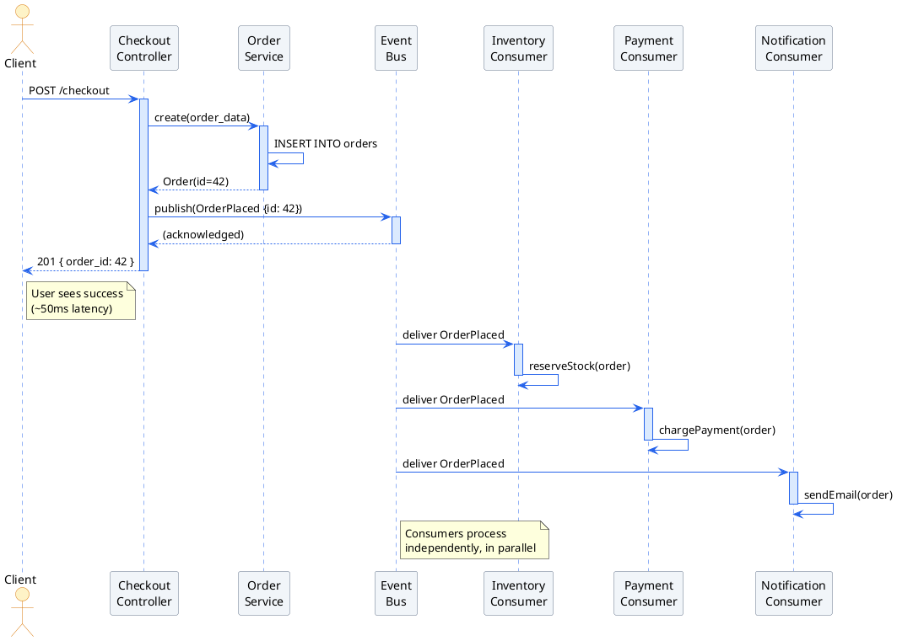
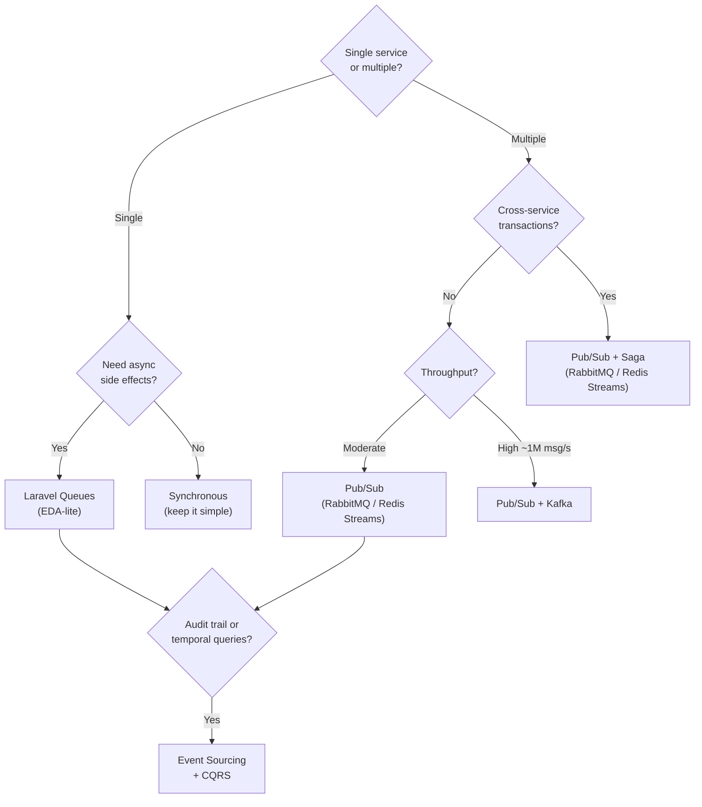

<section lang="en">

## Why Event-Driven Architecture?

Every web developer starts with the same mental model: a client sends a request, the server processes it, and the client gets a response. This is the **synchronous request-response** pattern: simple, intuitive, and the foundation of HTTP. For a single monolith handling a few dozen requests per minute, it works perfectly.

The cracks appear as the system grows. Consider an e-commerce checkout flow:

```php
<?php
// A synchronous checkout: each step blocks the next

class CheckoutController
{
    public function checkout(Request $request): JsonResponse
    {
        $order = $this->orderService->create($request->all());
        $this->inventoryService->reserveStock($order);
        $this->paymentService->charge($order);
        $this->notificationService->sendConfirmation($order);
        $this->analyticsService->trackPurchase($order);

        return response()->json(['order_id' => $order->id]);
    }
}
```

This code has a hidden problem: every bullet point is a failure point. If `notificationService->sendConfirmation()` times out after three seconds, the user has already been charged but sees an error page. If `analyticsService` is under maintenance, the entire checkout fails, even though analytics has nothing to do with completing a purchase.

**Event-Driven Architecture (EDA)** replaces this tight chain with **fire-and-forget events**. The core operation writes its result, publishes an event, and immediately responds to the user. Everything else happens asynchronously, in its own time, with its own retry logic:

```php
<?php
// An event-driven checkout: fire and forget

class CheckoutController
{
    public function checkout(Request $request): JsonResponse
    {
        $order = $this->orderService->create($request->all());

        event(new OrderPlaced($order));  // <-- the only side effect

        return response()->json(['order_id' => $order->id]);
    }
}
```

The difference is fundamental. The synchronous version **pushes** work downstream and waits. The event-driven version **publishes** a fact and moves on. Downstream consumers subscribe to that fact and react independently.

### Sync vs Async: A Side-by-Side Comparison

| Dimension | Synchronous (Request-Response) | Event-Driven (Publish-Subscribe) |
|---|---|---|
| **Coupling** | Caller knows the callee's API, URL, and contract | Producer knows only the event name and payload shape |
| **Temporal** | Caller blocks until every callee responds | Producer fires and continues; consumers process when ready |
| **Failure propagation** | One slow service slows or breaks the entire chain | Consumer failures are isolated; events queue up for retry |
| **Adding a consumer** | Modify the caller's code to add a new dependency | Subscribe to the event; no change to the producer |
| **Observability** | Traced in a single request waterfall (easier to debug) | Traced across async boundaries (requires correlation IDs) |
| **Complexity** | Low to moderate | Higher (broker, DLQ, schema evolution, eventual consistency) |

The rule of thumb: **if the caller does not need the answer to continue, publish an event.** If the caller needs an answer (e.g., "is this course full?"), use synchronous communication, and add a circuit breaker.

</section>

<section lang="id">

## Mengapa Arsitektur Event-Driven?

Setiap pengembang web memulai dengan model mental yang sama: klien mengirim request, server memprosesnya, dan klien menerima respons. Ini adalah pola **synchronous request-response**: sederhana, intuitif, dan merupakan fondasi HTTP. Untuk monolit tunggal yang menangani beberapa lusin request per menit, ini bekerja dengan sempurna.

Retakan mulai muncul seiring pertumbuhan sistem. Pertimbangkan alur checkout e-commerce:

```php
<?php
// Checkout sinkron: setiap langkah memblokir langkah berikutnya

class CheckoutController
{
    public function checkout(Request $request): JsonResponse
    {
        $order = $this->orderService->create($request->all());
        $this->inventoryService->reserveStock($order);
        $this->paymentService->charge($order);
        $this->notificationService->sendConfirmation($order);
        $this->analyticsService->trackPurchase($order);

        return response()->json(['order_id' => $order->id]);
    }
}
```

Kode ini memiliki masalah tersembunyi: setiap langkah adalah titik kegagalan. Jika `notificationService->sendConfirmation()` timeout setelah tiga detik, pengguna sudah ditagih tetapi melihat halaman error. Jika `analyticsService` sedang maintenance, seluruh checkout gagal, padahal analytics tidak ada hubungannya dengan menyelesaikan pembelian.

**Arsitektur Event-Driven (EDA)** menggantikan rantai ketat ini dengan **event fire-and-forget**. Operasi inti menulis hasilnya, mempublikasikan event, dan segera merespons ke pengguna. Semua yang lain terjadi secara asinkron, dalam waktunya sendiri, dengan logika retry-nya sendiri:

```php
<?php
// Checkout event-driven: fire and forget

class CheckoutController
{
    public function checkout(Request $request): JsonResponse
    {
        $order = $this->orderService->create($request->all());

        event(new OrderPlaced($order));  // <-- satu-satunya side effect

        return response()->json(['order_id' => $order->id]);
    }
}
```

Perbedaannya fundamental. Versi sinkron **mendorong** pekerjaan ke downstream dan menunggu. Versi event-driven **mempublikasikan** fakta dan melanjutkan. Downstream consumer berlangganan fakta tersebut dan bereaksi secara independen.

### Sync vs Async: Perbandingan Berdampingan

| Dimensi | Sinkron (Request-Response) | Event-Driven (Publish-Subscribe) |
|---|---|---|
| **Coupling** | Caller tahu API, URL, dan kontrak callee | Producer hanya tahu nama event dan bentuk payload |
| **Temporal** | Caller memblokir sampai setiap callee merespons | Producer mengirim dan melanjutkan; consumer memproses saat siap |
| **Propagasi kegagalan** | Satu layanan lambat memperlambat atau merusak seluruh rantai | Kegagalan consumer terisolasi; event mengantre untuk retry |
| **Menambah consumer** | Ubah kode caller untuk menambah dependensi baru | Berlangganan ke event; tidak ada perubahan pada producer |
| **Observabilitas** | Dilacak dalam satu waterfall request (lebih mudah di-debug) | Dilacak melintasi batas asinkron (memerlukan correlation ID) |
| **Kompleksitas** | Rendah hingga sedang | Lebih tinggi (broker, DLQ, evolusi schema, eventual consistency) |

Aturan praktis: **jika caller tidak membutuhkan jawaban untuk melanjutkan, publikasikan event.** Jika caller membutuhkan jawaban (misalnya, "apakah mata kuliah ini penuh?"), gunakan komunikasi sinkron, dan tambahkan circuit breaker.

</section>

<figure class="my-10 text-center" role="figure">



<figcaption class="mt-3 text-sm text-neutral-500">
  <span lang="en">Figure: Sequence diagram comparing synchronous request handling (left of the vertical gap) with asynchronous event-driven processing (right). The controller returns immediately after publishing the event; consumers process independently and in parallel.</span>
  <span lang="id">Gambar: Diagram sequence yang membandingkan penanganan request sinkron (sebelah kiri celah vertikal) dengan pemrosesan event-driven asinkron (sebelah kanan). Controller kembali segera setelah mempublikasikan event; consumer memproses secara independen dan paralel.</span>
</figcaption>
</figure>

---

<section lang="en">

## Core Concepts: Events, Producers, Consumers, and Channels

An event-driven system has four building blocks. Understanding them is the difference between a working EDA and an accidental distributed monolith.

### Events: Facts That Happened

An event is **an immutable record of something that occurred in the past**. It is not a command ("please charge this card"), not a request ("can you send an email?"), and not a question ("is this course full?"). It is a statement of fact:

```php
<?php

class StudentEnrolled
{
    public function __construct(
        public readonly string $enrollmentId,
        public readonly string $studentId,
        public readonly string $courseId,
        public readonly string $timestamp,
        public readonly string $correlationId,
    ) {}

    public static function fromEnrollment(Enrollment $enrollment, string $correlationId): self
    {
        return new self(
            enrollmentId:  $enrollment->id,
            studentId:     $enrollment->student_id,
            courseId:      $enrollment->course_id,
            timestamp:     now()->toIso8601String(),
            correlationId: $correlationId,
        );
    }
}
```

Naming conventions matter. Events should be named in **past tense**: `StudentEnrolled`, not `StudentEnrolls` or `EnrollStudent`. The past tense signals immutability: this event describes something that already happened and cannot be undone. If a consumer fails, it does not cancel the fact that the student enrolled; it just means the consumer has not yet reacted to it.

### Producers: Services That Publish Facts

A producer (or publisher) is any code that detects a domain event and publishes it. The producer's sole responsibility is: **atomically persist the state change AND publish the event.** If the database write succeeds but the event never publishes, the system is in an inconsistent state.

In a transactional context (like a relational database), the pattern is:

```php
<?php

class EnrolmentService
{
    public function __construct(
        private PDO $db,
        private EventBus $eventBus,
    ) {}

    public function enrol(int $studentId, int $courseId, string $correlationId): Enrolment
    {
        $this->db->beginTransaction();

        try {
            $stmt = $this->db->prepare(
                'INSERT INTO enrolments (student_id, course_id, status, created_at)
                 VALUES (?, ?, "confirmed", NOW())'
            );
            $stmt->execute([$studentId, $courseId]);
            $id = $this->db->lastInsertId();

            $event = new StudentEnrolled(
                enrollmentId:  (string) $id,
                studentId:     (string) $studentId,
                courseId:      (string) $courseId,
                timestamp:     date('c'),
                correlationId: $correlationId,
            );

            $this->eventBus->publish('student.enrolled', $event);

            $this->db->commit();
        } catch (\Throwable $e) {
            $this->db->rollBack();
            throw $e;
        }

        return Enrolment::find($id);
    }
}
```

The key: both the INSERT and the publish happen **inside the same database transaction**. If the publish throws, the INSERT is rolled back. This is the **transactional outbox pattern** in its simplest form.

### Consumers: Services That React to Facts

A consumer listens for specific event types and executes side effects. A single event can (and usually does) have multiple consumers, each reacting in a different way:

```php
<?php

// Consumer 1: Send a welcome email when a student enrolls
class SendWelcomeEmail
{
    public function handle(StudentEnrolled $event): void
    {
        $student = Student::find($event->studentId);
        $course  = Course::find($event->courseId);

        Mail::to($student->email)->send(
            new CourseWelcomeMail($student, $course)
        );
    }
}

// Consumer 2: Update the course occupancy counter
class UpdateCourseOccupancy
{
    public function handle(StudentEnrolled $event): void
    {
        CourseOccupancy::increment($event->courseId);
    }
}

// Consumer 3: Create an invoice (if the course is paid)
class CreateInvoice
{
    public function handle(StudentEnrolled $event): void
    {
        $course = Course::find($event->courseId);

        if (!$course->isPaid()) {
            return;  // Free course, no invoice needed
        }

        Invoice::create([
            'student_id'    => $event->studentId,
            'course_id'     => $event->courseId,
            'reference_id'  => $event->enrollmentId,
            'amount'        => $course->price,
            'status'        => 'pending',
        ]);
    }
}
```

Each consumer is decoupled from the others. If `SendWelcomeEmail` fails, `UpdateCourseOccupancy` and `CreateInvoice` still run. If you later add a fourth consumer (`LogToAuditTrail`), you do not touch the producer or any existing consumer.

### Channels and Event Buses

A **channel** (or topic, or exchange) is a named destination where events are published. Producers publish to a channel; consumers subscribe to channels they care about.

| Concept | RabbitMQ | Redis Streams | Laravel Events |
|---|---|---|---|
| **Channel** | Exchange + routing key | Stream key | Event class name |
| **Producer** | `basic_publish()` | `XADD` | `event(new Foo(...))` |
| **Consumer** | `basic_consume()` | `XREADGROUP` | Listener class |
| **Persistence** | Queues (optional durable) | Streams (append-only log) | In-memory (sync) |
| **Broker required** | Yes | Yes (Redis) | No |

</section>

<section lang="id">

## Konsep Inti: Events, Producers, Consumers, dan Channels

Sistem event-driven memiliki empat blok bangunan. Memahaminya adalah perbedaan antara EDA yang berfungsi dan distributed monolith yang tidak disengaja.

### Events: Fakta yang Telah Terjadi

Event adalah **catatan immutable tentang sesuatu yang terjadi di masa lalu**. Ia bukan perintah ("tolong charge kartu ini"), bukan request ("bisakah kamu mengirim email?"), dan bukan pertanyaan ("apakah mata kuliah ini penuh?"). Ia adalah pernyataan fakta:

```php
<?php

class StudentEnrolled
{
    public function __construct(
        public readonly string $enrollmentId,
        public readonly string $studentId,
        public readonly string $courseId,
        public readonly string $timestamp,
        public readonly string $correlationId,
    ) {}

    public static function fromEnrollment(Enrollment $enrollment, string $correlationId): self
    {
        return new self(
            enrollmentId:  $enrollment->id,
            studentId:     $enrollment->student_id,
            courseId:      $enrollment->course_id,
            timestamp:     now()->toIso8601String(),
            correlationId: $correlationId,
        );
    }
}
```

Konvensi penamaan itu penting. Event harus dinamai dalam **past tense**: `StudentEnrolled`, bukan `StudentEnrolls` atau `EnrollStudent`. Past tense menandakan immutability: event ini menggambarkan sesuatu yang sudah terjadi dan tidak dapat dibatalkan. Jika consumer gagal, itu tidak membatalkan fakta bahwa mahasiswa telah mendaftar; itu hanya berarti consumer belum bereaksi terhadapnya.

### Producers: Layanan yang Mempublikasikan Fakta

Producer (atau publisher) adalah kode apa pun yang mendeteksi domain event dan mempublikasikannya. Tanggung jawab tunggal producer adalah: **secara atomik menyimpan perubahan state DAN mempublikasikan event.** Jika penulisan database berhasil tetapi event tidak pernah dipublikasikan, sistem berada dalam state tidak konsisten.

Dalam konteks transaksional (seperti database relasional), polanya adalah:

```php
<?php

class EnrolmentService
{
    public function __construct(
        private PDO $db,
        private EventBus $eventBus,
    ) {}

    public function enrol(int $studentId, int $courseId, string $correlationId): Enrolment
    {
        $this->db->beginTransaction();

        try {
            $stmt = $this->db->prepare(
                'INSERT INTO enrolments (student_id, course_id, status, created_at)
                 VALUES (?, ?, "confirmed", NOW())'
            );
            $stmt->execute([$studentId, $courseId]);
            $id = $this->db->lastInsertId();

            $event = new StudentEnrolled(
                enrollmentId:  (string) $id,
                studentId:     (string) $studentId,
                courseId:      (string) $courseId,
                timestamp:     date('c'),
                correlationId: $correlationId,
            );

            $this->eventBus->publish('student.enrolled', $event);

            $this->db->commit();
        } catch (\Throwable $e) {
            $this->db->rollBack();
            throw $e;
        }

        return Enrolment::find($id);
    }
}
```

Kuncinya: baik INSERT maupun publish terjadi **di dalam transaksi database yang sama**. Jika publish melempar exception, INSERT di-rollback. Ini adalah **pola transactional outbox** dalam bentuk paling sederhana.

### Consumers: Layanan yang Bereaksi terhadap Fakta

Consumer mendengarkan tipe event tertentu dan menjalankan side effect. Satu event dapat (dan biasanya) memiliki banyak consumer, masing-masing bereaksi dengan cara berbeda:

```php
<?php

// Consumer 1: Kirim email selamat datang ketika mahasiswa mendaftar
class SendWelcomeEmail
{
    public function handle(StudentEnrolled $event): void
    {
        $student = Student::find($event->studentId);
        $course  = Course::find($event->courseId);

        Mail::to($student->email)->send(
            new CourseWelcomeMail($student, $course)
        );
    }
}

// Consumer 2: Perbarui penghitung okupansi mata kuliah
class UpdateCourseOccupancy
{
    public function handle(StudentEnrolled $event): void
    {
        CourseOccupancy::increment($event->courseId);
    }
}

// Consumer 3: Buat invoice (jika mata kuliah berbayar)
class CreateInvoice
{
    public function handle(StudentEnrolled $event): void
    {
        $course = Course::find($event->courseId);

        if (!$course->isPaid()) {
            return;  // Mata kuliah gratis, tidak perlu invoice
        }

        Invoice::create([
            'student_id'    => $event->studentId,
            'course_id'     => $event->courseId,
            'reference_id'  => $event->enrollmentId,
            'amount'        => $course->price,
            'status'        => 'pending',
        ]);
    }
}
```

Setiap consumer terdecouple dari yang lain. Jika `SendWelcomeEmail` gagal, `UpdateCourseOccupancy` dan `CreateInvoice` tetap berjalan. Jika nanti Anda menambahkan consumer keempat (`LogToAuditTrail`), Anda tidak menyentuh producer atau consumer yang sudah ada.

### Channels dan Event Bus

**Channel** (atau topic, atau exchange) adalah tujuan bernama di mana event dipublikasikan. Producer mempublikasikan ke channel; consumer berlangganan ke channel yang mereka pedulikan.

| Konsep | RabbitMQ | Redis Streams | Laravel Events |
|---|---|---|---|
| **Channel** | Exchange + routing key | Stream key | Nama kelas Event |
| **Producer** | `basic_publish()` | `XADD` | `event(new Foo(...))` |
| **Consumer** | `basic_consume()` | `XREADGROUP` | Kelas Listener |
| **Persistence** | Queue (opsional durable) | Stream (append-only log) | In-memory (sinkron) |
| **Broker diperlukan** | Ya | Ya (Redis) | Tidak |

</section>

---

<section lang="en">

## Common Patterns: Pub/Sub, Event Sourcing, CQRS, and Saga

EDA has four patterns that solve different classes of problems. You do not need all of them on day one, but understanding what each pattern is for prevents you from reaching for the wrong tool.

### Pub/Sub (Publish-Subscribe)

The pattern we have been describing: a producer publishes an event to a channel, and zero or more consumers subscribe and react independently. This is the **entry-level EDA pattern**, the one you start with.

**When to use:** Any time a single action should trigger multiple side effects that can happen independently. Sending a welcome email, updating a counter, and logging an audit trail after enrolment are all Pub/Sub.

**What it gives you:** The ability to add side effects without modifying the core business logic. Adding an `SmsNotification` consumer next month means creating one new class and subscribing it to `student.enrolled`.

### Event Sourcing

Instead of storing the current state (the student's enrolment status), you store the **sequence of events** that led to that state. The current state is derived by replaying the event log.

```
Event Log for Student #42:
  [2026-01-15] StudentEnrolled(course=Algorithms)
  [2026-02-01] StudentEnrolled(course=Calculus)
  [2026-03-10] EnrolmentDropped(course=Algorithms)

Current state → Student #42 is enrolled in: [Calculus]
```

**When to use:** When you need a full, auditable history of every state change (accounting, compliance, version control systems). Also when you need to answer "what was the state at time T?" questions.

**Trade-off:** Event logs grow unbounded. Eventually you need snapshots, periodic summaries of state at a point in time, so you do not replay every event since the beginning of time.

### CQRS (Command Query Responsibility Segregation)

Split operations into **commands** (which change state and produce events) and **queries** (which read state from materialised views built from events).

```
                    ┌──────────┐
    POST /enrol  -> │ Command  │ -> Event -> Event Store
                    │  Model   │
                    └──────────┘
                                        ↓
                    ┌──────────┐    ┌──────────┐
  GET /enrolments <-│  Query   │ <- │ Material │
                    │  Model   │    │  Views   │
                    └──────────┘    └──────────┘
```

**When to use:** When your read and write workloads have very different shapes. A write might touch three tables with strict consistency; a read might join eight tables for a dashboard. CQRS lets you optimise each side independently.

**Common pairing:** CQRS is often (but not always) used alongside Event Sourcing. The events from the command side populate the query-side materialised views.

### Saga: Distributed Transactions

A saga coordinates a business transaction that spans multiple services using a chain of events and compensating actions. If any step fails, the saga executes compensating actions to undo the work of previous steps.

**Example: Course Enrolment Saga**

```
Step 1: Reserve seat in course       → Success
Step 2: Charge payment               → Success
Step 3: Finalise enrolment           → FAILS (course was archived between steps 1 and 3)

Compensating actions:
  ← Refund payment (undo step 2)
  ← Release seat (undo step 1)
```

**When to use:** When a business transaction must atomically succeed or fail across multiple services that each own their own database. There is no ACID transaction spanning the services, so the saga provides **eventual consistency**: the system may be temporarily inconsistent but converges to a valid state.

**Important:** Compensating actions are not the same as database rollbacks. A refund is a new business transaction, not a magical undo. It can also fail, which is why sagas need their own retry and dead-letter logic.

</section>

<section lang="id">

## Pola Umum: Pub/Sub, Event Sourcing, CQRS, dan Saga

EDA memiliki empat pola yang menyelesaikan kelas masalah yang berbeda. Anda tidak membutuhkan semuanya di hari pertama, tetapi memahami untuk apa setiap pola mencegah Anda menggunakan alat yang salah.

### Pub/Sub (Publish-Subscribe)

Pola yang telah kita jelaskan: producer mempublikasikan event ke channel, dan nol atau lebih consumer berlangganan dan bereaksi secara independen. Ini adalah **pola EDA entry-level**, yang Anda mulai dengannya.

**Kapan digunakan:** Setiap kali satu aksi harus memicu beberapa side effect yang dapat terjadi secara independen. Mengirim email selamat datang, memperbarui penghitung, dan mencatat audit trail setelah pendaftaran semuanya adalah Pub/Sub.

**Apa yang diberikannya:** Kemampuan untuk menambahkan side effect tanpa memodifikasi logika bisnis inti. Menambahkan consumer `SmsNotification` bulan depan berarti membuat satu kelas baru dan berlangganan ke `student.enrolled`.

### Event Sourcing

Alih-alih menyimpan state saat ini (status pendaftaran mahasiswa), Anda menyimpan **urutan event** yang mengarah ke state tersebut. State saat ini diturunkan dengan memutar ulang event log.

```
Event Log untuk Mahasiswa #42:
  [2026-01-15] StudentEnrolled(course=Algoritma)
  [2026-02-01] StudentEnrolled(course=Kalkulus)
  [2026-03-10] EnrolmentDropped(course=Algoritma)

State saat ini → Mahasiswa #42 terdaftar di: [Kalkulus]
```

**Kapan digunakan:** Ketika Anda membutuhkan riwayat lengkap yang dapat diaudit dari setiap perubahan state (akuntansi, kepatuhan, sistem version control). Juga ketika Anda perlu menjawab pertanyaan "apa state pada waktu T?".

**Trade-off:** Event log tumbuh tanpa batas. Akhirnya Anda memerlukan **snapshots**, ringkasan state periodik pada titik waktu tertentu, sehingga Anda tidak perlu memutar ulang setiap event sejak awal waktu.

### CQRS (Command Query Responsibility Segregation)

Pisahkan operasi menjadi **commands** (yang mengubah state dan menghasilkan event) dan **queries** (yang membaca state dari materialised view yang dibangun dari event).

```
                    ┌──────────┐
    POST /enrol  -> │ Command  │ -> Event -> Event Store
                    │  Model   │
                    └──────────┘
                                        ↓
                    ┌──────────┐    ┌──────────┐
  GET /enrolments <-│  Query   │ <- │ Material │
                    │  Model   │    │  Views   │
                    └──────────┘    └──────────┘
```

**Kapan digunakan:** Ketika beban kerja baca dan tulis Anda memiliki bentuk yang sangat berbeda. Write mungkin menyentuh tiga tabel dengan konsistensi ketat; read mungkin menggabungkan delapan tabel untuk dashboard. CQRS memungkinkan Anda mengoptimalkan setiap sisi secara independen.

**Pasangan umum:** CQRS sering (tetapi tidak selalu) digunakan bersama Event Sourcing. Event dari sisi command mengisi materialised view di sisi query.

### Saga: Transaksi Terdistribusi

Saga mengoordinasikan transaksi bisnis yang mencakup beberapa layanan menggunakan rantai event dan compensating action. Jika ada langkah yang gagal, saga menjalankan compensating action untuk membatalkan pekerjaan langkah sebelumnya.

**Contoh: Saga Pendaftaran Mata Kuliah**

```
Langkah 1: Reservasi kursi di mata kuliah  → Berhasil
Langkah 2: Charge pembayaran                → Berhasil
Langkah 3: Finalisasi pendaftaran           → GAGAL (mata kuliah diarsipkan antara langkah 1 dan 3)

Compensating action:
  ← Refund pembayaran (batalkan langkah 2)
  ← Lepaskan kursi (batalkan langkah 1)
```

**Kapan digunakan:** Ketika transaksi bisnis harus secara atomik berhasil atau gagal di beberapa layanan yang masing-masing memiliki database sendiri. Tidak ada transaksi ACID yang mencakup layanan-layanan tersebut, sehingga saga menyediakan **eventual consistency**: sistem mungkin sementara tidak konsisten tetapi konvergen ke state yang valid.

**Penting:** Compensating action tidak sama dengan database rollback. Refund adalah transaksi bisnis baru, bukan undo ajaib. Ia juga bisa gagal, itulah sebabnya saga memerlukan logika retry dan dead-letter sendiri.

</section>

---

<section lang="en">

## Event Payload Design and Versioning

An event payload is the contract between producer and consumer. Getting it wrong early means every consumer breaks when you fix it.

### What Belongs in an Event

A common mistake is putting too much data in an event: the full student record, the full course record, the current weather. This creates coupling: if the student schema changes, the event schema must change, and every consumer must be updated.

**Include:** identifiers, timestamps, and the minimum data consumers need to decide whether to act.

```php
<?php

// Good event: identifiers + decision data
class StudentEnrolled
{
    public function __construct(
        public readonly string $enrollmentId,
        public readonly string $studentId,
        public readonly string $courseId,
        public readonly string $courseName,    // For notification templates
        public readonly bool   $isPaidCourse,  // For billing decisions
        public readonly string $studentEmail,  // For email delivery (avoids API call)
        public readonly string $timestamp,
        public readonly string $correlationId,
    ) {}
}

// Bad event: entire entity graphs
class StudentEnrolled
{
    public function __construct(
        public readonly Student $student,      // <-- Consumer now couples to Student schema
        public readonly Course $course,        // <-- Consumer now couples to Course schema
        public readonly array $prerequisites,  // <-- Why does every consumer need this?
    ) {}
}
```

The rule: include enough data that the consumer can act without calling the producer's API, but not so much that the consumer couples to the producer's internal schema. For data the consumer genuinely needs that changes over time (like `student_name`), the consumer should either call the API at processing time or maintain a local materialised view from events.

### Schema Versioning

Events evolve. A field is added (`discountApplied`), a field is deprecated (`legacyCourseCode`), a field changes type (`amount` goes from `int` to `float`). There are three strategies:

| Strategy | How It Works | Producer Cost | Consumer Cost |
|---|---|---|---|
| **Always compatible (preferred)** | Add new fields with defaults; never remove or rename fields | Low | None; old consumers ignore new fields |
| **Versioned events** | Publish `StudentEnrolled.v2` alongside `StudentEnrolled.v1` | Medium: publish both | Consumers migrate at their own pace |
| **Upcast on consume** | Producer publishes the latest version; a middleware transforms old events for old consumers | Low | High: every consumer needs the upcaster |

**Always start with always-compatible.** For Laravel:

```php
<?php

// v1: original event
class StudentEnrolled
{
    public function __construct(
        public readonly string $studentId,
        public readonly string $courseId,
    ) {}
}

// v2: add a field with a default, old consumers still work
class StudentEnrolled
{
    public function __construct(
        public readonly string $studentId,
        public readonly string $courseId,
        public readonly bool $isPaidCourse = false,   // new field, safe default
        public readonly ?string $couponCode = null,    // new field, nullable
    ) {}
}
```

</section>

<section lang="id">

## Desain Payload Event dan Versioning

Payload event adalah kontrak antara producer dan consumer. Salah mendesainnya di awal berarti setiap consumer rusak saat Anda memperbaikinya.

### Apa yang Harus Ada di Dalam Event

Kesalahan umum adalah memasukkan terlalu banyak data ke dalam event: record mahasiswa lengkap, record mata kuliah lengkap, cuaca saat ini. Ini menciptakan coupling: jika schema mahasiswa berubah, schema event harus berubah, dan setiap consumer harus diperbarui.

**Sertakan:** identifier, timestamp, dan data minimum yang dibutuhkan consumer untuk memutuskan apakah akan bertindak.

```php
<?php

// Event yang baik: identifier + data keputusan
class StudentEnrolled
{
    public function __construct(
        public readonly string $enrollmentId,
        public readonly string $studentId,
        public readonly string $courseId,
        public readonly string $courseName,    // Untuk template notifikasi
        public readonly bool   $isPaidCourse,  // Untuk keputusan billing
        public readonly string $studentEmail,  // Untuk pengiriman email (hindari panggilan API)
        public readonly string $timestamp,
        public readonly string $correlationId,
    ) {}
}

// Event yang buruk: seluruh graf entitas
class StudentEnrolled
{
    public function __construct(
        public readonly Student $student,      // <-- Consumer sekarang terikat ke schema Student
        public readonly Course $course,        // <-- Consumer sekarang terikat ke schema Course
        public readonly array $prerequisites,  // <-- Mengapa setiap consumer butuh ini?
    ) {}
}
```

Aturannya: sertakan cukup data agar consumer dapat bertindak tanpa memanggil API producer, tetapi jangan terlalu banyak sehingga consumer terikat ke schema internal producer. Untuk data yang benar-benar dibutuhkan consumer yang berubah seiring waktu (seperti `student_name`), consumer harus memanggil API saat pemrosesan atau memelihara materialised view lokal dari event.

### Schema Versioning

Event berevolusi. Field ditambahkan (`discountApplied`), field didepresiasi (`legacyCourseCode`), field berubah tipe (`amount` dari `int` ke `float`). Ada tiga strategi:

| Strategi | Cara Kerja | Biaya Producer | Biaya Consumer |
|---|---|---|---|
| **Always compatible (disarankan)** | Tambah field baru dengan default; jangan pernah hapus atau ganti nama field | Rendah | Tidak ada; consumer lama mengabaikan field baru |
| **Versioned events** | Publikasikan `StudentEnrolled.v2` bersama `StudentEnrolled.v1` | Sedang: publikasikan keduanya | Consumer bermigrasi dengan kecepatan sendiri |
| **Upcast on consume** | Producer mempublikasikan versi terbaru; middleware mentransformasi event lama untuk consumer lama | Rendah | Tinggi: setiap consumer butuh upcaster |

**Selalu mulai dengan always-compatible.** Untuk Laravel:

```php
<?php

// v1: event asli
class StudentEnrolled
{
    public function __construct(
        public readonly string $studentId,
        public readonly string $courseId,
    ) {}
}

// v2: tambah field dengan default, consumer lama tetap berfungsi
class StudentEnrolled
{
    public function __construct(
        public readonly string $studentId,
        public readonly string $courseId,
        public readonly bool $isPaidCourse = false,   // field baru, default aman
        public readonly ?string $couponCode = null,    // field baru, nullable
    ) {}
}
```

</section>

---

<section lang="en">

## PHP Implementation Part 1: Laravel Events and Listeners

Laravel provides the simplest entry point into EDA. Its event system is in-process and synchronous by default, perfect for a monolith that wants to move toward event-driven thinking without adopting a message broker.

### Defining an Event

```php
<?php

// app/Events/StudentEnrolled.php
namespace App\Events;

use App\Models\Enrolment;
use Illuminate\Foundation\Events\Dispatchable;
use Illuminate\Queue\SerializesModels;

class StudentEnrolled
{
    use Dispatchable, SerializesModels;

    public function __construct(
        public readonly Enrolment $enrolment,
        public readonly string $correlationId,
    ) {}
}
```

The `Dispatchable` trait provides the static `::dispatch()` method and the `event()` helper. `SerializesModels` ensures the Eloquent model is re-fetched from the database when the event is processed on a queue, preventing stale data.

### Creating Listeners

```php
<?php

// app/Listeners/SendEnrolmentConfirmation.php
namespace App\Listeners;

use App\Events\StudentEnrolled;
use App\Mail\EnrolmentConfirmation;
use Illuminate\Support\Facades\Mail;

class SendEnrolmentConfirmation
{
    public function handle(StudentEnrolled $event): void
    {
        $student = $event->enrolment->student;
        $course  = $event->enrolment->course;

        Mail::to($student)->queue(
            new EnrolmentConfirmation($student, $course)
        );
    }
}
```

```php
<?php

// app/Listeners/UpdateCourseOccupancy.php
namespace App\Listeners;

use App\Events\StudentEnrolled;
use App\Models\CourseOccupancy;

class UpdateCourseOccupancy
{
    public function handle(StudentEnrolled $event): void
    {
        CourseOccupancy::where('course_id', $event->enrolment->course_id)
            ->increment('confirmed_count');
    }
}
```

### Registering Listeners

In `app/Providers/EventServiceProvider.php`:

```php
<?php

namespace App\Providers;

use App\Events\StudentEnrolled;
use App\Listeners\SendEnrolmentConfirmation;
use App\Listeners\UpdateCourseOccupancy;
use Illuminate\Foundation\Support\Providers\EventServiceProvider as ServiceProvider;

class EventServiceProvider extends ServiceProvider
{
    protected $listen = [
        StudentEnrolled::class => [
            SendEnrolmentConfirmation::class,
            UpdateCourseOccupancy::class,
        ],
    ];
}
```

### Dispatching from the Service Layer

```php
<?php

// app/Services/EnrolmentService.php
namespace App\Services;

use App\Events\StudentEnrolled;
use App\Models\Course;
use App\Models\Enrolment;
use App\Models\Student;
use Illuminate\Support\Facades\DB;
use Illuminate\Support\Str;

class EnrolmentService
{
    public function enrol(Student $student, Course $course): Enrolment
    {
        return DB::transaction(function () use ($student, $course) {
            $enrolment = Enrolment::create([
                'student_id' => $student->id,
                'course_id'  => $course->id,
                'status'     => 'confirmed',
            ]);

            StudentEnrolled::dispatch($enrolment, (string) Str::uuid());

            return $enrolment;
        });
    }
}
```

In this configuration, `SendEnrolmentConfirmation` and `UpdateCourseOccupancy` run **synchronously** inside the same process. The user waits for the email to be queued before seeing a response. This is fine for a monolith with fast listeners, but if a listener is slow (e.g., generating a PDF certificate), it should be queued.

### Moving Listeners to a Queue

To run a listener asynchronously, implement `ShouldQueue`:

```php
<?php

namespace App\Listeners;

use App\Events\StudentEnrolled;
use Illuminate\Contracts\Queue\ShouldQueue;

class GenerateCertificate implements ShouldQueue
{
    public string $queue = 'certificates';          // Specific queue name
    public int $tries = 3;                          // Retry up to 3 times
    public int $backoff = 60;                       // Wait 60s between retries

    public function handle(StudentEnrolled $event): void
    {
        // Slow work: generate a PDF certificate
        $pdf = CertificateGenerator::forEnrolment($event->enrolment);
        $pdf->store('certificates/' . $event->enrolment->id . '.pdf');
    }

    public function failed(StudentEnrolled $event, \Throwable $e): void
    {
        Log::error('Certificate generation failed', [
            'enrolment_id' => $event->enrolment->id,
            'error'        => $e->getMessage(),
        ]);
    }
}
```

When `ShouldQueue` is implemented, Laravel serialises the event and pushes it to the configured queue driver (Redis, database, SQS, Beanstalkd). The listener runs in a separate `php artisan queue:work` process.

</section>

<section lang="id">

## Implementasi PHP Bagian 1: Laravel Events dan Listeners

Laravel menyediakan titik masuk paling sederhana ke EDA. Sistem event-nya bersifat in-process dan sinkron secara default, cocok untuk monolit yang ingin beralih ke pemikiran event-driven tanpa mengadopsi message broker.

### Mendefinisikan Event

```php
<?php

// app/Events/StudentEnrolled.php
namespace App\Events;

use App\Models\Enrolment;
use Illuminate\Foundation\Events\Dispatchable;
use Illuminate\Queue\SerializesModels;

class StudentEnrolled
{
    use Dispatchable, SerializesModels;

    public function __construct(
        public readonly Enrolment $enrolment,
        public readonly string $correlationId,
    ) {}
}
```

Trait `Dispatchable` menyediakan metode statis `::dispatch()` dan helper `event()`. `SerializesModels` memastikan model Eloquent di-fetch ulang dari database saat event diproses di queue, mencegah data usang.

### Membuat Listener

```php
<?php

// app/Listeners/SendEnrolmentConfirmation.php
namespace App\Listeners;

use App\Events\StudentEnrolled;
use App\Mail\EnrolmentConfirmation;
use Illuminate\Support\Facades\Mail;

class SendEnrolmentConfirmation
{
    public function handle(StudentEnrolled $event): void
    {
        $student = $event->enrolment->student;
        $course  = $event->enrolment->course;

        Mail::to($student)->queue(
            new EnrolmentConfirmation($student, $course)
        );
    }
}
```

```php
<?php

// app/Listeners/UpdateCourseOccupancy.php
namespace App\Listeners;

use App\Events\StudentEnrolled;
use App\Models\CourseOccupancy;

class UpdateCourseOccupancy
{
    public function handle(StudentEnrolled $event): void
    {
        CourseOccupancy::where('course_id', $event->enrolment->course_id)
            ->increment('confirmed_count');
    }
}
```

### Mendaftarkan Listener

Di `app/Providers/EventServiceProvider.php`:

```php
<?php

namespace App\Providers;

use App\Events\StudentEnrolled;
use App\Listeners\SendEnrolmentConfirmation;
use App\Listeners\UpdateCourseOccupancy;
use Illuminate\Foundation\Support\Providers\EventServiceProvider as ServiceProvider;

class EventServiceProvider extends ServiceProvider
{
    protected $listen = [
        StudentEnrolled::class => [
            SendEnrolmentConfirmation::class,
            UpdateCourseOccupancy::class,
        ],
    ];
}
```

### Dispatch dari Service Layer

```php
<?php

// app/Services/EnrolmentService.php
namespace App\Services;

use App\Events\StudentEnrolled;
use App\Models\Course;
use App\Models\Enrolment;
use App\Models\Student;
use Illuminate\Support\Facades\DB;
use Illuminate\Support\Str;

class EnrolmentService
{
    public function enrol(Student $student, Course $course): Enrolment
    {
        return DB::transaction(function () use ($student, $course) {
            $enrolment = Enrolment::create([
                'student_id' => $student->id,
                'course_id'  => $course->id,
                'status'     => 'confirmed',
            ]);

            StudentEnrolled::dispatch($enrolment, (string) Str::uuid());

            return $enrolment;
        });
    }
}
```

Dalam konfigurasi ini, `SendEnrolmentConfirmation` dan `UpdateCourseOccupancy` berjalan **secara sinkron** di dalam proses yang sama. Pengguna menunggu email diantrekan sebelum melihat respons. Ini baik untuk monolit dengan listener cepat, tetapi jika listener lambat (misalnya, menghasilkan sertifikat PDF), ia harus diantrekan.

### Memindahkan Listener ke Queue

Untuk menjalankan listener secara asinkron, implementasikan `ShouldQueue`:

```php
<?php

namespace App\Listeners;

use App\Events\StudentEnrolled;
use Illuminate\Contracts\Queue\ShouldQueue;

class GenerateCertificate implements ShouldQueue
{
    public string $queue = 'certificates';          // Nama queue spesifik
    public int $tries = 3;                          // Retry hingga 3 kali
    public int $backoff = 60;                       // Tunggu 60 detik antar retry

    public function handle(StudentEnrolled $event): void
    {
        // Pekerjaan lambat: menghasilkan sertifikat PDF
        $pdf = CertificateGenerator::forEnrolment($event->enrolment);
        $pdf->store('certificates/' . $event->enrolment->id . '.pdf');
    }

    public function failed(StudentEnrolled $event, \Throwable $e): void
    {
        Log::error('Generasi sertifikat gagal', [
            'enrolment_id' => $event->enrolment->id,
            'error'        => $e->getMessage(),
        ]);
    }
}
```

Ketika `ShouldQueue` diimplementasikan, Laravel menserialisasi event dan mendorongnya ke queue driver yang dikonfigurasi (Redis, database, SQS, Beanstalkd). Listener berjalan di proses `php artisan queue:work` yang terpisah.

</section>

---

<section lang="en">

## PHP Implementation Part 2: RabbitMQ with PHP

Laravel's built-in queue system covers many use cases, but when you need cross-service communication, fine-grained routing, or explicit event persistence, a dedicated message broker is the right choice. RabbitMQ is the most widely deployed open-source message broker in the PHP ecosystem.

### Installation

```bash
composer require php-amqplib/php-amqplib
```

### Producer: Publishing Events to RabbitMQ

```php
<?php

use PhpAmqpLib\Connection\AMQPStreamConnection;
use PhpAmqpLib\Message\AMQPMessage;

class RabbitMQEventBus
{
    private AMQPStreamConnection $connection;
    private \PhpAmqpLib\Channel\AMQPChannel $channel;

    public function __construct(
        string $host = 'localhost',
        int $port = 5672,
        string $user = 'guest',
        string $password = 'guest',
    ) {
        $this->connection = new AMQPStreamConnection($host, $port, $user, $password);
        $this->channel = $this->connection->channel();

        // Declare a topic exchange: enables flexible routing with wildcards
        $this->channel->exchange_declare(
            'campus_events',     // Exchange name
            'topic',             // Type: topic (routing-key-based)
            false,               // Passive: do not check if exists on broker
            true,                // Durable: survive broker restarts
            false                // Auto-delete: do not delete when unused
        );
    }

    public function publish(string $routingKey, array|object $event): void
    {
        $payload = is_object($event) ? json_encode($event) : json_encode($event);

        $msg = new AMQPMessage($payload, [
            'content_type'  => 'application/json',
            'delivery_mode' => AMQPMessage::DELIVERY_MODE_PERSISTENT, // Survive broker restart
            'message_id'    => bin2hex(random_bytes(16)),
            'timestamp'     => time(),
            'app_id'        => 'enrolment-service',
        ]);

        $this->channel->basic_publish(
            $msg,
            'campus_events',        // Exchange
            $routingKey             // Routing key (e.g., 'student.enrolled')
        );
    }

    public function __destruct()
    {
        $this->channel->close();
        $this->connection->close();
    }
}
```

Usage in the enrolment service:

```php
<?php

$eventBus = new RabbitMQEventBus('rabbitmq', 5672);

$eventBus->publish('student.enrolled', [
    'enrollment_id'  => $enrolment->id,
    'student_id'     => $student->id,
    'course_id'      => $course->id,
    'course_name'    => $course->name,
    'student_email'  => $student->email,
    'timestamp'      => date('c'),
    'correlation_id' => $correlationId,
]);
```

### Consumer: Subscribing to Events

```php
<?php

use PhpAmqpLib\Connection\AMQPStreamConnection;
use PhpAmqpLib\Message\AMQPMessage;

class RabbitMQEventConsumer
{
    private AMQPStreamConnection $connection;
    private \PhpAmqpLib\Channel\AMQPChannel $channel;

    public function __construct(
        string $host = 'localhost',
        int $port = 5672,
        string $user = 'guest',
        string $password = 'guest',
    ) {
        $this->connection = new AMQPStreamConnection($host, $port, $user, $password);
        $this->channel = $this->connection->channel();

        $this->channel->exchange_declare('campus_events', 'topic', false, true, false);

        // Each consumer declares its own queue
        list($queueName, ,) = $this->channel->queue_declare(
            '',         // Let RabbitMQ generate a unique name
            false,      // Passive
            true,       // Durable
            false,      // Exclusive
            false       // Auto-delete
        );
    }

    /**
     * Bind to a routing key pattern.
     *
     * Examples:
     *   'student.enrolled': exact match
     *   'student.*'       : all student events
     *   '#'               : all events (catch-all)
     */
    public function subscribe(string $routingKey, callable $handler): void
    {
        $this->channel->queue_bind(
            $this->queueName,
            'campus_events',
            $routingKey
        );

        $this->channel->basic_consume(
            $this->queueName,
            '',         // Consumer tag (auto-generated)
            false,      // No local
            false,      // No ack (manual acknowledgement)
            false,      // Exclusive
            false,      // No wait
            function (AMQPMessage $msg) use ($handler) {
                try {
                    $data = json_decode($msg->getBody(), true, 512, JSON_THROW_ON_ERROR);
                    $handler($data);

                    // Acknowledge that the message was processed successfully
                    $msg->ack();
                } catch (\Throwable $e) {
                    // Reject and requeue for another attempt
                    $msg->nack(true);
                    throw $e;
                }
            }
        );
    }

    public function listen(): void
    {
        while ($this->channel->is_consuming()) {
            $this->channel->wait();
        }
    }
}
```

A concrete consumer, the billing service listening for new enrolments:

```php
<?php

$consumer = new RabbitMQEventConsumer('rabbitmq', 5672);

$consumer->subscribe('student.enrolled', function (array $event): void {
    $course = Course::find($event['course_id']);

    if (!$course || !$course->isPaid) {
        return;  // Free course, nothing to bill
    }

    $invoice = Invoice::create([
        'student_id'   => $event['student_id'],
        'course_id'    => $event['course_id'],
        'reference_id' => $event['enrollment_id'],
        'amount'       => $course->price,
        'status'       => 'pending',
    ]);

    echo "Invoice #{$invoice->id} created for enrolment {$event['enrollment_id']}\n";
});

echo "Billing consumer listening for student.enrolled events...\n";
$consumer->listen();
```

### Topic Exchange Routing in Practice

RabbitMQ's topic exchange uses dot-separated routing keys with two wildcards:

| Routing Key Pattern | Matches |
|---|---|
| `student.enrolled` | Only the exact `student.enrolled` event |
| `student.*` | `student.enrolled`, `student.dropped`, `student.updated` (but **not** `student.enrolled.math`) |
| `student.#` | Everything starting with `student.`, including `student.enrolled.math.101` |
| `#` | Every event on the exchange (catch-all audit logger) |

This lets you design granular routing: the notification service subscribes to `#` (every event), while the billing service subscribes only to `student.enrolled` and `student.dropped`.

</section>

<section lang="id">

## Implementasi PHP Bagian 2: RabbitMQ dengan PHP

Sistem queue bawaan Laravel mencakup banyak kasus penggunaan, tetapi ketika Anda membutuhkan komunikasi lintas layanan, routing granular, atau persistensi event eksplisit, message broker khusus adalah pilihan yang tepat. RabbitMQ adalah message broker open-source yang paling banyak digunakan di ekosistem PHP.

### Instalasi

```bash
composer require php-amqplib/php-amqplib
```

### Producer: Mempublikasikan Event ke RabbitMQ

```php
<?php

use PhpAmqpLib\Connection\AMQPStreamConnection;
use PhpAmqpLib\Message\AMQPMessage;

class RabbitMQEventBus
{
    private AMQPStreamConnection $connection;
    private \PhpAmqpLib\Channel\AMQPChannel $channel;

    public function __construct(
        string $host = 'localhost',
        int $port = 5672,
        string $user = 'guest',
        string $password = 'guest',
    ) {
        $this->connection = new AMQPStreamConnection($host, $port, $user, $password);
        $this->channel = $this->connection->channel();

        // Deklarasikan topic exchange: memungkinkan routing fleksibel dengan wildcard
        $this->channel->exchange_declare(
            'campus_events',     // Nama exchange
            'topic',             // Tipe: topic (berbasis routing-key)
            false,               // Passive: jangan periksa apakah ada di broker
            true,                // Durable: bertahan saat broker restart
            false                // Auto-delete: jangan hapus saat tidak digunakan
        );
    }

    public function publish(string $routingKey, array|object $event): void
    {
        $payload = is_object($event) ? json_encode($event) : json_encode($event);

        $msg = new AMQPMessage($payload, [
            'content_type'  => 'application/json',
            'delivery_mode' => AMQPMessage::DELIVERY_MODE_PERSISTENT, // Bertahan saat broker restart
            'message_id'    => bin2hex(random_bytes(16)),
            'timestamp'     => time(),
            'app_id'        => 'enrolment-service',
        ]);

        $this->channel->basic_publish(
            $msg,
            'campus_events',        // Exchange
            $routingKey             // Routing key (misal: 'student.enrolled')
        );
    }

    public function __destruct()
    {
        $this->channel->close();
        $this->connection->close();
    }
}
```

Penggunaan di enrolment service:

```php
<?php

$eventBus = new RabbitMQEventBus('rabbitmq', 5672);

$eventBus->publish('student.enrolled', [
    'enrollment_id'  => $enrolment->id,
    'student_id'     => $student->id,
    'course_id'      => $course->id,
    'course_name'    => $course->name,
    'student_email'  => $student->email,
    'timestamp'      => date('c'),
    'correlation_id' => $correlationId,
]);
```

### Consumer: Berlangganan ke Event

```php
<?php

use PhpAmqpLib\Connection\AMQPStreamConnection;
use PhpAmqpLib\Message\AMQPMessage;

class RabbitMQEventConsumer
{
    private AMQPStreamConnection $connection;
    private \PhpAmqpLib\Channel\AMQPChannel $channel;

    public function __construct(
        string $host = 'localhost',
        int $port = 5672,
        string $user = 'guest',
        string $password = 'guest',
    ) {
        $this->connection = new AMQPStreamConnection($host, $port, $user, $password);
        $this->channel = $this->connection->channel();

        $this->channel->exchange_declare('campus_events', 'topic', false, true, false);

        // Setiap consumer mendeklarasikan queue-nya sendiri
        list($queueName, ,) = $this->channel->queue_declare(
            '',         // Biarkan RabbitMQ menghasilkan nama unik
            false,      // Passive
            true,       // Durable
            false,      // Exclusive
            false       // Auto-delete
        );
    }

    /**
     * Bind ke pola routing key.
     *
     * Contoh:
     *   'student.enrolled': cocok persis
     *   'student.*'       : semua event mahasiswa
     *   '#'               : semua event (catch-all)
     */
    public function subscribe(string $routingKey, callable $handler): void
    {
        $this->channel->queue_bind(
            $this->queueName,
            'campus_events',
            $routingKey
        );

        $this->channel->basic_consume(
            $this->queueName,
            '',         // Consumer tag (auto-generated)
            false,      // No local
            false,      // No ack (acknowledgement manual)
            false,      // Exclusive
            false,      // No wait
            function (AMQPMessage $msg) use ($handler) {
                try {
                    $data = json_decode($msg->getBody(), true, 512, JSON_THROW_ON_ERROR);
                    $handler($data);

                    // Akui bahwa pesan telah diproses dengan sukses
                    $msg->ack();
                } catch (\Throwable $e) {
                    // Tolak dan requeue untuk percobaan lain
                    $msg->nack(true);
                    throw $e;
                }
            }
        );
    }

    public function listen(): void
    {
        while ($this->channel->is_consuming()) {
            $this->channel->wait();
        }
    }
}
```

Consumer konkret, billing service mendengarkan pendaftaran baru:

```php
<?php

$consumer = new RabbitMQEventConsumer('rabbitmq', 5672);

$consumer->subscribe('student.enrolled', function (array $event): void {
    $course = Course::find($event['course_id']);

    if (!$course || !$course->isPaid) {
        return;  // Mata kuliah gratis, tidak ada yang ditagih
    }

    $invoice = Invoice::create([
        'student_id'   => $event['student_id'],
        'course_id'    => $event['course_id'],
        'reference_id' => $event['enrollment_id'],
        'amount'       => $course->price,
        'status'       => 'pending',
    ]);

    echo "Invoice #{$invoice->id} dibuat untuk pendaftaran {$event['enrollment_id']}\n";
});

echo "Billing consumer mendengarkan event student.enrolled...\n";
$consumer->listen();
```

### Topic Exchange Routing dalam Praktik

Topic exchange RabbitMQ menggunakan routing key yang dipisahkan titik dengan dua wildcard:

| Pola Routing Key | Mencocokkan |
|---|---|
| `student.enrolled` | Hanya event `student.enrolled` yang persis |
| `student.*` | `student.enrolled`, `student.dropped`, `student.updated` (tetapi **bukan** `student.enrolled.math`) |
| `student.#` | Semua yang dimulai dengan `student.`, termasuk `student.enrolled.math.101` |
| `#` | Setiap event di exchange (catch-all audit logger) |

Ini memungkinkan Anda mendesain routing granular: notification service berlangganan ke `#` (setiap event), sementara billing service hanya berlangganan ke `student.enrolled` dan `student.dropped`.

</section>

---

<section lang="en">

## PHP Implementation Part 3: Redis Streams

Redis Streams provide an append-only log data structure that is simpler to operate than RabbitMQ (no separate broker process; Redis is likely already in your stack) while offering consumer groups, message acknowledgement, and replay capability.

### Producer: Publishing to a Redis Stream

```php
<?php

class RedisStreamEventBus
{
    public function __construct(
        private \Redis $redis,
        private string $streamKey = 'campus:events',
    ) {}

    public function publish(string $eventType, array $payload): string
    {
        $message = [
            'event_type'    => $eventType,
            'payload'       => json_encode($payload),
            'occurred_at'   => date('c'),
            'correlation_id' => $payload['correlation_id'] ?? bin2hex(random_bytes(16)),
        ];

        // XADD returns the ID of the newly appended entry
        $messageId = $this->redis->xAdd($this->streamKey, '*', $message);

        // Trim the stream to keep only the last 100,000 messages
        $this->redis->xTrim($this->streamKey, 100000, true);

        return $messageId;
    }
}
```

Usage:

```php
<?php

$redis = new Redis();
$redis->connect('redis', 6379);

$eventBus = new RedisStreamEventBus($redis);

$messageId = $eventBus->publish('student.enrolled', [
    'enrollment_id'  => $enrolment->id,
    'student_id'     => $student->id,
    'course_id'      => $course->id,
    'student_email'  => $student->email,
    'correlation_id' => $correlationId,
]);

echo "Event published: {$messageId}\n";
```

### Consumer Group: Reliable Multi-Consumer Processing

Redis Streams support **consumer groups**, where multiple consumers share the work of processing a stream. Each message is delivered to exactly one consumer in the group. If a consumer crashes before acknowledging, the message is reclaimed by another consumer after a timeout.

```php
<?php

class RedisStreamConsumer
{
    private string $streamKey;
    private string $groupName;
    private string $consumerName;

    public function __construct(
        private \Redis $redis,
        string $streamKey,
        string $groupName,
        string $consumerName,
    ) {
        $this->streamKey   = $streamKey;
        $this->groupName   = $groupName;
        $this->consumerName = $consumerName;

        // Create the consumer group if it does not exist
        // '0' means start from the beginning of the stream
        // '$' would mean start from now (ignore history)
        $this->redis->xGroup('CREATE', $streamKey, $groupName, '0', true);
    }

    /**
     * Process pending messages (ones that were delivered but never acknowledged).
     * Call this on startup to recover from crashes.
     */
    public function claimStaleMessages(int $idleTimeoutMs, callable $handler): int
    {
        $claimed = 0;

        // XAUTOCLAIM automatically finds and reassigns messages idle longer than the timeout
        $result = $this->redis->xAUTOCLAIM(
            $this->streamKey,
            $this->groupName,
            $this->consumerName,
            $idleTimeoutMs,
            '0-0',   // Start from the smallest possible ID
            100      // Batch size
        );

        foreach ($result['messages'] ?? [] as $id => $message) {
            $this->processMessage($id, $message, $handler);
            $claimed++;
        }

        return $claimed;
    }

    public function listen(callable $handler): void
    {
        while (true) {
            // Read new messages (blocking read with 5-second timeout)
            $messages = $this->redis->xReadGroup(
                $this->groupName,
                $this->consumerName,
                [$this->streamKey => '>'],  // '>' means only new messages
                1,                          // Max 1 message per read
                5000                        // Block for 5 seconds
            );

            if (!$messages) {
                continue;
            }

            foreach ($messages[$this->streamKey] ?? [] as $id => $fields) {
                $this->processMessage($id, $fields, $handler);
            }
        }
    }

    private function processMessage(string $id, array $fields, callable $handler): void
    {
        try {
            $eventType = $fields['event_type'] ?? 'unknown';
            $payload   = json_decode($fields['payload'] ?? '{}', true, 512, JSON_THROW_ON_ERROR);

            $handler($eventType, $payload, $id);

            // Acknowledge successful processing
            $this->redis->xAck($this->streamKey, $this->groupName, [$id]);
        } catch (\Throwable $e) {
            // Do not acknowledge: the message stays pending
            // and will be reclaimed by claimStaleMessages on next startup
            error_log("Failed to process message {$id}: {$e->getMessage()}");
        }
    }
}
```

Running the consumer:

```php
<?php

$redis = new Redis();
$redis->connect('redis', 6379);

$consumer = new RedisStreamConsumer(
    redis:        $redis,
    streamKey:    'campus:events',
    groupName:    'billing-service',
    consumerName: gethostname() . '-' . getmypid(),
);

// Recover stale messages (idle for more than 60 seconds)
$claimed = $consumer->claimStaleMessages(60000, function (string $eventType, array $payload, string $id): void {
    echo "Recovered: {$eventType} (id: {$id})\n";
    handleEvent($eventType, $payload);
});

echo "Claimed {$claimed} stale messages. Listening for new events...\n";

$consumer->listen(function (string $eventType, array $payload, string $id): void {
    echo "Processing: {$eventType} (id: {$id})\n";
    handleEvent($eventType, $payload);
});
```

</section>

<section lang="id">

## Implementasi PHP Bagian 3: Redis Streams

Redis Streams menyediakan struktur data log append-only yang lebih sederhana untuk dioperasikan daripada RabbitMQ (tidak ada proses broker terpisah; Redis kemungkinan sudah ada di stack Anda) sambil menawarkan consumer group, acknowledgement pesan, dan kemampuan replay.

### Producer: Mempublikasikan ke Redis Stream

```php
<?php

class RedisStreamEventBus
{
    public function __construct(
        private \Redis $redis,
        private string $streamKey = 'campus:events',
    ) {}

    public function publish(string $eventType, array $payload): string
    {
        $message = [
            'event_type'    => $eventType,
            'payload'       => json_encode($payload),
            'occurred_at'   => date('c'),
            'correlation_id' => $payload['correlation_id'] ?? bin2hex(random_bytes(16)),
        ];

        // XADD mengembalikan ID dari entri yang baru ditambahkan
        $messageId = $this->redis->xAdd($this->streamKey, '*', $message);

        // Pangkas stream untuk menyimpan hanya 100.000 pesan terakhir
        $this->redis->xTrim($this->streamKey, 100000, true);

        return $messageId;
    }
}
```

Penggunaan:

```php
<?php

$redis = new Redis();
$redis->connect('redis', 6379);

$eventBus = new RedisStreamEventBus($redis);

$messageId = $eventBus->publish('student.enrolled', [
    'enrollment_id'  => $enrolment->id,
    'student_id'     => $student->id,
    'course_id'      => $course->id,
    'student_email'  => $student->email,
    'correlation_id' => $correlationId,
]);

echo "Event dipublikasikan: {$messageId}\n";
```

### Consumer Group: Pemrosesan Multi-Consumer yang Andal

Redis Streams mendukung **consumer group**, di mana beberapa consumer berbagi pekerjaan memproses stream. Setiap pesan dikirim ke tepat satu consumer dalam grup. Jika consumer crash sebelum mengakui, pesan direklaim oleh consumer lain setelah timeout.

```php
<?php

class RedisStreamConsumer
{
    private string $streamKey;
    private string $groupName;
    private string $consumerName;

    public function __construct(
        private \Redis $redis,
        string $streamKey,
        string $groupName,
        string $consumerName,
    ) {
        $this->streamKey   = $streamKey;
        $this->groupName   = $groupName;
        $this->consumerName = $consumerName;

        // Buat consumer group jika belum ada
        // '0' berarti mulai dari awal stream
        // '$' berarti mulai dari sekarang (abaikan riwayat)
        $this->redis->xGroup('CREATE', $streamKey, $groupName, '0', true);
    }

    /**
     * Proses pesan pending (yang sudah dikirim tapi belum pernah diakui).
     * Panggil ini saat startup untuk pulih dari crash.
     */
    public function claimStaleMessages(int $idleTimeoutMs, callable $handler): int
    {
        $claimed = 0;

        // XAUTOCLAIM secara otomatis menemukan dan menugaskan ulang pesan
        // yang idle lebih lama dari timeout
        $result = $this->redis->xAUTOCLAIM(
            $this->streamKey,
            $this->groupName,
            $this->consumerName,
            $idleTimeoutMs,
            '0-0',   // Mulai dari ID terkecil yang mungkin
            100      // Ukuran batch
        );

        foreach ($result['messages'] ?? [] as $id => $message) {
            $this->processMessage($id, $message, $handler);
            $claimed++;
        }

        return $claimed;
    }

    public function listen(callable $handler): void
    {
        while (true) {
            // Baca pesan baru (blocking read dengan timeout 5 detik)
            $messages = $this->redis->xReadGroup(
                $this->groupName,
                $this->consumerName,
                [$this->streamKey => '>'],  // '>' berarti hanya pesan baru
                1,                          // Maks 1 pesan per read
                5000                        // Blokir selama 5 detik
            );

            if (!$messages) {
                continue;
            }

            foreach ($messages[$this->streamKey] ?? [] as $id => $fields) {
                $this->processMessage($id, $fields, $handler);
            }
        }
    }

    private function processMessage(string $id, array $fields, callable $handler): void
    {
        try {
            $eventType = $fields['event_type'] ?? 'unknown';
            $payload   = json_decode($fields['payload'] ?? '{}', true, 512, JSON_THROW_ON_ERROR);

            $handler($eventType, $payload, $id);

            // Akui pemrosesan berhasil
            $this->redis->xAck($this->streamKey, $this->groupName, [$id]);
        } catch (\Throwable $e) {
            // Jangan akui: pesan tetap pending
            // dan akan direklaim oleh claimStaleMessages saat startup berikutnya
            error_log("Gagal memproses pesan {$id}: {$e->getMessage()}");
        }
    }
}
```

Menjalankan consumer:

```php
<?php

$redis = new Redis();
$redis->connect('redis', 6379);

$consumer = new RedisStreamConsumer(
    redis:        $redis,
    streamKey:    'campus:events',
    groupName:    'billing-service',
    consumerName: gethostname() . '-' . getmypid(),
);

// Pulihkan pesan stale (idle lebih dari 60 detik)
$claimed = $consumer->claimStaleMessages(60000, function (string $eventType, array $payload, string $id): void {
    echo "Dipulihkan: {$eventType} (id: {$id})\n";
    handleEvent($eventType, $payload);
});

echo "Diklaim {$claimed} pesan stale. Mendengarkan event baru...\n";

$consumer->listen(function (string $eventType, array $payload, string $id): void {
    echo "Memproses: {$eventType} (id: {$id})\n";
    handleEvent($eventType, $payload);
});
```

</section>

---

<section lang="en">

## Reliability Patterns: Idempotency, Retries, and Dead-Letter Queues

EDA introduces failure modes that synchronous code does not have: duplicate deliveries, poison messages, and silent consumer failures. Three patterns solve each of these.

### Idempotency: Handling Duplicate Messages

Most message brokers guarantee **at-least-once** delivery, not exactly-once. Your consumer may receive the same event twice. If it does, processing it twice must produce the same outcome as processing it once.

The standard approach is **idempotency keys**, a unique identifier stored alongside each processed event:

```php
<?php

class IdempotentConsumer
{
    public function __construct(
        private PDO $db
    ) {}

    public function handleIfNotProcessed(string $eventId, callable $handler): bool
    {
        // Atomically check and insert: prevents race conditions
        $stmt = $this->db->prepare(
            'INSERT IGNORE INTO processed_events (event_id, processed_at) VALUES (?, NOW())'
        );
        $stmt->execute([$eventId]);

        if ($stmt->rowCount() === 0) {
            // Event was already processed, skip
            echo "Skipping duplicate event: {$eventId}\n";
            return false;
        }

        $handler();
        return true;
    }
}
```

The `processed_events` table:

```sql
CREATE TABLE processed_events (
    event_id VARCHAR(255) PRIMARY KEY,
    processed_at DATETIME NOT NULL,
    INDEX idx_processed_at (processed_at)
);

-- Periodic cleanup: delete events older than 30 days
-- DELETE FROM processed_events WHERE processed_at < NOW() - INTERVAL 30 DAY;
```

The `INSERT IGNORE` is critical: it serialises concurrent processing of the same event ID. Only one consumer wins the INSERT; the others see `rowCount() === 0` and skip.

### Retry with Exponential Backoff

Transient failures (network timeouts, temporary database unavailability, external API rate limits) should be retried, not abandoned. The key is **exponential backoff**: increasing the wait time between retries to avoid overwhelming a recovering system.

```php
<?php

class RetryableConsumer
{
    private const MAX_RETRIES = 5;
    private const BASE_DELAY_MS = 1000; // 1 second

    public function processWithRetry(callable $handler, string $eventId): void
    {
        for ($attempt = 0; $attempt < self::MAX_RETRIES; $attempt++) {
            try {
                $handler();
                return;  // Success
            } catch (\Throwable $e) {
                if ($this->isTransient($e) && $attempt < self::MAX_RETRIES - 1) {
                    $delay = self::BASE_DELAY_MS * pow(2, $attempt);
                    $jitter = random_int(0, (int) ($delay * 0.1));  // ±10% jitter
                    $totalDelay = $delay + $jitter;

                    echo "Attempt {$attempt} failed: {$e->getMessage()}. "
                       . "Retrying in {$totalDelay}ms...\n";

                    usleep($totalDelay * 1000);  // microseconds
                    continue;
                }

                // Non-transient or exhausted retries: escalate to DLQ
                throw $e;
            }
        }
    }

    private function isTransient(\Throwable $e): bool
    {
        // Retry only recoverable errors
        return $e instanceof \PDOException && str_contains($e->getMessage(), 'gone away')
            || $e instanceof \GuzzleHttp\Exception\ConnectException
            || $e instanceof \GuzzleHttp\Exception\ServerException && $e->getCode() === 429;
    }
}
```

### Dead-Letter Queue (DLQ)

When a message has been retried to exhaustion or encounters a non-transient failure (invalid payload, business rule violation), it should be moved to a **dead-letter queue** for human inspection, never silently dropped.

**Laravel Queue DLQ pattern:**

```php
<?php

namespace App\Jobs;

use Illuminate\Bus\Queueable;
use Illuminate\Contracts\Queue\ShouldQueue;
use Illuminate\Foundation\Bus\Dispatchable;
use Illuminate\Queue\InteractsWithQueue;
use Illuminate\Queue\SerializesModels;

class ProcessStudentEnrolled implements ShouldQueue
{
    use Dispatchable, InteractsWithQueue, Queueable, SerializesModels;

    public int $tries = 3;
    public int $backoff = [10, 60, 300];  // 10s, 1min, 5min: explicit backoff values

    public function __construct(
        public array $eventPayload
    ) {}

    public function handle(): void
    {
        // Business logic here
    }

    public function failed(\Throwable $e): void
    {
        // This runs AFTER all retries are exhausted.
        // Laravel automatically moves the failed job to the 'failed_jobs' table
        // (when queue:failed table migration is run and queue:failed is configured).

        \App\Models\FailedEvent::create([
            'event_type'   => 'student.enrolled',
            'payload'      => json_encode($this->eventPayload),
            'error'        => $e->getMessage(),
            'failed_at'    => now(),
        ]);
    }
}
```

**Manual DLQ with RabbitMQ:**

```php
<?php

class RabbitMQDeadLetterConsumer
{
    public function __construct(
        private \PhpAmqpLib\Channel\AMQPChannel $channel,
        private string $primaryQueue = 'student.enrolled',
        private string $dlxExchange = 'dead_letter',
    ) {}

    public function subscribeWithDLQ(callable $handler, int $maxRetries = 3): void
    {
        // Declare the dead-letter exchange
        $this->channel->exchange_declare($this->dlxExchange, 'direct', false, true, false);

        // Declare the primary queue with a dead-letter exchange configuration
        $this->channel->queue_declare($this->primaryQueue, false, true, false, false, false, [
            'x-dead-letter-exchange' => ['S', $this->dlxExchange],
            'x-dead-letter-routing-key' => ['S', $this->primaryQueue . '.dlq'],
        ]);

        // Declare the dead-letter queue itself
        $dlqName = $this->primaryQueue . '.dlq';
        $this->channel->queue_declare($dlqName, false, true, false, false);
        $this->channel->queue_bind($dlqName, $this->dlxExchange, $dlqName);

        $this->channel->basic_consume(
            $this->primaryQueue,
            '',
            false,
            false,  // No ack, manual
            false,
            false,
            function (AMQPMessage $msg) use ($handler, $maxRetries) {
                try {
                    $retryCount = $this->getRetryCount($msg);
                    $data = json_decode($msg->getBody(), true, 512, JSON_THROW_ON_ERROR);
                    $handler($data);
                    $msg->ack();
                } catch (\Throwable $e) {
                    $retryCount = $this->getRetryCount($msg);
                    if ($retryCount >= $maxRetries) {
                        // Exhausted retries: reject without requeue → goes to DLQ
                        echo "Max retries ({$maxRetries}) reached. Sending to DLQ.\n";
                        $msg->reject(false);  // false = do NOT requeue
                    } else {
                        $retryCount++;
                        // Re-publish with incremented retry count
                        $this->channel->basic_publish(
                            new AMQPMessage($msg->getBody(), array_merge(
                                $msg->get_properties(),
                                ['application_headers' => new \PhpAmqpLib\Wire\AMQPTable([
                                    'x-retry-count' => $retryCount,
                                ])]
                            )),
                            '',
                            $this->primaryQueue
                        );
                        $msg->ack();  // Ack original, re-published copy handles the retry
                    }
                }
            }
        );
    }

    private function getRetryCount(AMQPMessage $msg): int
    {
        $headers = $msg->get_properties()['application_headers'] ?? null;
        if ($headers instanceof \PhpAmqpLib\Wire\AMQPTable) {
            return $headers->getNativeData()['x-retry-count'] ?? 0;
        }
        return 0;
    }
}
```

</section>

<section lang="id">

## Pola Keandalan: Idempotensi, Retry, dan Dead-Letter Queue

EDA memperkenalkan mode kegagalan yang tidak dimiliki kode sinkron: pengiriman duplikat, poison message, dan kegagalan consumer diam-diam. Tiga pola menyelesaikan masing-masing ini.

### Idempotensi: Menangani Pesan Duplikat

Sebagian besar message broker menjamin pengiriman **at-least-once**, bukan exactly-once. Consumer Anda mungkin menerima event yang sama dua kali. Jika itu terjadi, memprosesnya dua kali harus menghasilkan hasil yang sama dengan memprosesnya sekali.

Pendekatan standar adalah **kunci idempotensi**, identifier unik yang disimpan bersama setiap event yang diproses:

```php
<?php

class IdempotentConsumer
{
    public function __construct(
        private PDO $db
    ) {}

    public function handleIfNotProcessed(string $eventId, callable $handler): bool
    {
        // Periksa dan sisipkan secara atomik: mencegah race condition
        $stmt = $this->db->prepare(
            'INSERT IGNORE INTO processed_events (event_id, processed_at) VALUES (?, NOW())'
        );
        $stmt->execute([$eventId]);

        if ($stmt->rowCount() === 0) {
            // Event sudah diproses, lewati
            echo "Melewatkan event duplikat: {$eventId}\n";
            return false;
        }

        $handler();
        return true;
    }
}
```

Tabel `processed_events`:

```sql
CREATE TABLE processed_events (
    event_id VARCHAR(255) PRIMARY KEY,
    processed_at DATETIME NOT NULL,
    INDEX idx_processed_at (processed_at)
);

-- Pembersihan berkala: hapus event lebih lama dari 30 hari
-- DELETE FROM processed_events WHERE processed_at < NOW() - INTERVAL 30 DAY;
```

`INSERT IGNORE` sangat penting: ini menserialisasi pemrosesan konkuren dari ID event yang sama. Hanya satu consumer yang berhasil INSERT; yang lain melihat `rowCount() === 0` dan melewatkan.

### Retry dengan Exponential Backoff

Kegagalan sementara (timeout jaringan, ketidaktersediaan database sementara, rate limit API eksternal) harus dicoba ulang, bukan ditinggalkan. Kuncinya adalah **exponential backoff**: meningkatkan waktu tunggu antara percobaan ulang untuk menghindari membanjiri sistem yang sedang pulih.

```php
<?php

class RetryableConsumer
{
    private const MAX_RETRIES = 5;
    private const BASE_DELAY_MS = 1000; // 1 detik

    public function processWithRetry(callable $handler, string $eventId): void
    {
        for ($attempt = 0; $attempt < self::MAX_RETRIES; $attempt++) {
            try {
                $handler();
                return;  // Berhasil
            } catch (\Throwable $e) {
                if ($this->isTransient($e) && $attempt < self::MAX_RETRIES - 1) {
                    $delay = self::BASE_DELAY_MS * pow(2, $attempt);
                    $jitter = random_int(0, (int) ($delay * 0.1));  // ±10% jitter
                    $totalDelay = $delay + $jitter;

                    echo "Percobaan {$attempt} gagal: {$e->getMessage()}. "
                       . "Mencoba lagi dalam {$totalDelay}ms...\n";

                    usleep($totalDelay * 1000);  // mikrodetik
                    continue;
                }

                // Non-transient atau retry habis: eskalasi ke DLQ
                throw $e;
            }
        }
    }

    private function isTransient(\Throwable $e): bool
    {
        // Retry hanya error yang dapat dipulihkan
        return $e instanceof \PDOException && str_contains($e->getMessage(), 'gone away')
            || $e instanceof \GuzzleHttp\Exception\ConnectException
            || $e instanceof \GuzzleHttp\Exception\ServerException && $e->getCode() === 429;
    }
}
```

### Dead-Letter Queue (DLQ)

Ketika pesan telah dicoba ulang hingga habis atau mengalami kegagalan non-transient (payload tidak valid, pelanggaran aturan bisnis), pesan harus dipindahkan ke **dead-letter queue** untuk inspeksi manusia, jangan pernah dibuang diam-diam.

**Pola Laravel Queue DLQ:**

```php
<?php

namespace App\Jobs;

use Illuminate\Bus\Queueable;
use Illuminate\Contracts\Queue\ShouldQueue;
use Illuminate\Foundation\Bus\Dispatchable;
use Illuminate\Queue\InteractsWithQueue;
use Illuminate\Queue\SerializesModels;

class ProcessStudentEnrolled implements ShouldQueue
{
    use Dispatchable, InteractsWithQueue, Queueable, SerializesModels;

    public int $tries = 3;
    public int $backoff = [10, 60, 300];  // 10dtk, 1mnt, 5mnt: nilai backoff eksplisit

    public function __construct(
        public array $eventPayload
    ) {}

    public function handle(): void
    {
        // Logika bisnis di sini
    }

    public function failed(\Throwable $e): void
    {
        // Ini berjalan SETELAH semua retry habis.
        // Laravel secara otomatis memindahkan job yang gagal ke tabel 'failed_jobs'
        // (ketika migrasi queue:failed table dijalankan dan queue:failed dikonfigurasi).

        \App\Models\FailedEvent::create([
            'event_type'   => 'student.enrolled',
            'payload'      => json_encode($this->eventPayload),
            'error'        => $e->getMessage(),
            'failed_at'    => now(),
        ]);
    }
}
```

**DLQ manual dengan RabbitMQ:**

```php
<?php

class RabbitMQDeadLetterConsumer
{
    public function __construct(
        private \PhpAmqpLib\Channel\AMQPChannel $channel,
        private string $primaryQueue = 'student.enrolled',
        private string $dlxExchange = 'dead_letter',
    ) {}

    public function subscribeWithDLQ(callable $handler, int $maxRetries = 3): void
    {
        // Deklarasikan dead-letter exchange
        $this->channel->exchange_declare($this->dlxExchange, 'direct', false, true, false);

        // Deklarasikan queue utama dengan konfigurasi dead-letter exchange
        $this->channel->queue_declare($this->primaryQueue, false, true, false, false, false, [
            'x-dead-letter-exchange' => ['S', $this->dlxExchange],
            'x-dead-letter-routing-key' => ['S', $this->primaryQueue . '.dlq'],
        ]);

        // Deklarasikan dead-letter queue itu sendiri
        $dlqName = $this->primaryQueue . '.dlq';
        $this->channel->queue_declare($dlqName, false, true, false, false);
        $this->channel->queue_bind($dlqName, $this->dlxExchange, $dlqName);

        $this->channel->basic_consume(
            $this->primaryQueue,
            '',
            false,
            false,  // No ack, manual
            false,
            false,
            function (AMQPMessage $msg) use ($handler, $maxRetries) {
                try {
                    $retryCount = $this->getRetryCount($msg);
                    $data = json_decode($msg->getBody(), true, 512, JSON_THROW_ON_ERROR);
                    $handler($data);
                    $msg->ack();
                } catch (\Throwable $e) {
                    $retryCount = $this->getRetryCount($msg);
                    if ($retryCount >= $maxRetries) {
                        // Retry habis: reject tanpa requeue → masuk ke DLQ
                        echo "Maks retry ({$maxRetries}) tercapai. Mengirim ke DLQ.\n";
                        $msg->reject(false);  // false = JANGAN requeue
                    } else {
                        $retryCount++;
                        // Publikasikan ulang dengan hitungan retry yang bertambah
                        $this->channel->basic_publish(
                            new AMQPMessage($msg->getBody(), array_merge(
                                $msg->get_properties(),
                                ['application_headers' => new \PhpAmqpLib\Wire\AMQPTable([
                                    'x-retry-count' => $retryCount,
                                ])]
                            )),
                            '',
                            $this->primaryQueue
                        );
                        $msg->ack();  // Ack asli, salinan yang dipublikasikan ulang menangani retry
                    }
                }
            }
        );
    }

    private function getRetryCount(AMQPMessage $msg): int
    {
        $headers = $msg->get_properties()['application_headers'] ?? null;
        if ($headers instanceof \PhpAmqpLib\Wire\AMQPTable) {
            return $headers->getNativeData()['x-retry-count'] ?? 0;
        }
        return 0;
    }
}
```

</section>

---

<section lang="en">

## When to Use EDA (and When Not To)

### Decision Framework

| Situation | Recommendation |
|---|---|
| **Single monolith, single team, simple domain** | Keep it synchronous. EDA adds complexity with no payoff. Laravel's built-in event system is enough to get started with event-driven thinking without a broker. |
| **Monolith with background jobs (emails, PDF generation)** | Use Laravel Queues. This is EDA-lite: fire-and-forget for non-critical side effects, still synchronous for the main flow. |
| **Multiple services, few dependencies between them** | Pub/Sub with RabbitMQ or Redis Streams. Services publish domain events; consumers react. Keep the event payload minimal. |
| **Multiple services, cross-service business transactions** | Pub/Sub + Saga. Each step publishes an event; a saga orchestrator listens and triggers compensating actions on failure. |
| **Audit trail, compliance, or temporal query requirements** | Event Sourcing + CQRS. The event log is the source of truth; materialised views serve queries. |
| **High-throughput event processing (millions/second)** | Apache Kafka. Its partitioned log is purpose-built for throughput and replay at scale. Redis Streams can handle moderate loads (~100k msg/s). |

### Observability in Event-Driven Systems

Synchronous debugging tools (`dd()`, stack traces, request waterfall charts) do not work across async boundaries. Three practices compensate:

1. **Correlation IDs.** Generate a UUID at the entry point of every request and thread it through every event, log entry, and API call. This lets you trace a single user action across services and time.

2. **Structured logging.** Every log entry should include `correlation_id`, `event_type`, `service_name`, and `message_id`. When a consumer fails, search for the correlation ID to find the originating request.

3. **Event replay.** With Redis Streams or Kafka, you can replay events from a point in time to rebuild state or test new consumer logic against production data. This is impossible with traditional point-to-point message queues.

### Common Anti-Patterns

| Anti-Pattern | What It Looks Like | Fix |
|---|---|---|
| **Event as command** | `ChargeStudentCard` event: it demands action, it does not state a fact | Rename to `StudentEnrolled`; the billing consumer decides whether to charge |
| **Fat events** | The event contains the full student, course, and instructor records | Include only IDs + the minimum data consumers need to decide whether to act |
| **Sync wrapper** | Consumer immediately calls the producer's API to get data that should have been in the event | Include the necessary data in the event payload, or maintain a local materialised view |
| **Fire and forget (literally)** | No DLQ, no retry, no monitoring; events disappear into the void on failure | Always configure a DLQ. Monitor queue depth. Alert on DLQ backlog. |
| **Over-engineered early** | A 2-person team deploying Kafka, schema registry, and CQRS for a CRUD app | Start with Laravel Queues. Add a broker only when you have cross-service boundaries. |

</section>

<section lang="id">

## Kapan Menggunakan EDA (dan Kapan Tidak)

### Kerangka Keputusan

| Situasi | Rekomendasi |
|---|---|
| **Monolit tunggal, tim tunggal, domain sederhana** | Tetap sinkron. EDA menambah kompleksitas tanpa hasil. Sistem event bawaan Laravel cukup untuk memulai pemikiran event-driven tanpa broker. |
| **Monolit dengan background job (email, generasi PDF)** | Gunakan Laravel Queues. Ini adalah EDA-lite: fire-and-forget untuk side effect non-kritis, tetap sinkron untuk alur utama. |
| **Beberapa layanan, sedikit dependensi di antaranya** | Pub/Sub dengan RabbitMQ atau Redis Streams. Layanan mempublikasikan domain event; consumer bereaksi. Jaga payload event minimal. |
| **Beberapa layanan, transaksi bisnis lintas layanan** | Pub/Sub + Saga. Setiap langkah mempublikasikan event; saga orchestrator mendengarkan dan memicu compensating action saat gagal. |
| **Kebutuhan audit trail, kepatuhan, atau query temporal** | Event Sourcing + CQRS. Event log adalah source of truth; materialised view melayani query. |
| **Pemrosesan event throughput tinggi (jutaan/detik)** | Apache Kafka. Partitioned log-nya dirancang khusus untuk throughput dan replay pada skala besar. Redis Streams dapat menangani beban sedang (~100rb msg/dtk). |

### Observabilitas dalam Sistem Event-Driven

Alat debugging sinkron (`dd()`, stack trace, grafik waterfall request) tidak berfungsi melintasi batas asinkron. Tiga praktik mengkompensasi:

1. **Correlation ID.** Hasilkan UUID di titik masuk setiap request dan teruskan melalui setiap event, entri log, dan panggilan API. Ini memungkinkan Anda melacak satu aksi pengguna melintasi layanan dan waktu.

2. **Structured logging.** Setiap entri log harus mencakup `correlation_id`, `event_type`, `service_name`, dan `message_id`. Ketika consumer gagal, cari correlation ID untuk menemukan request asal.

3. **Event replay.** Dengan Redis Streams atau Kafka, Anda dapat memutar ulang event dari titik waktu tertentu untuk membangun ulang state atau menguji logika consumer baru terhadap data produksi. Ini tidak mungkin dengan message queue point-to-point tradisional.

### Anti-Pattern Umum

| Anti-Pattern | Seperti Apa | Perbaikan |
|---|---|---|
| **Event sebagai command** | Event `ChargeStudentCard`: ia menuntut aksi, bukan menyatakan fakta | Ganti nama menjadi `StudentEnrolled`; billing consumer memutuskan apakah akan menagih |
| **Fat events** | Event berisi record lengkap mahasiswa, mata kuliah, dan instruktur | Sertakan hanya ID + data minimum yang dibutuhkan consumer untuk memutuskan bertindak |
| **Sync wrapper** | Consumer segera memanggil API producer untuk mendapatkan data yang seharusnya ada di event | Sertakan data yang diperlukan di payload event, atau pelihara materialised view lokal |
| **Fire and forget (harfiah)** | Tidak ada DLQ, tidak ada retry, tidak ada monitoring; event menghilang begitu saja saat gagal | Selalu konfigurasikan DLQ. Monitor kedalaman queue. Beri peringatan pada backlog DLQ. |
| **Over-engineered sejak awal** | Tim 2 orang menerapkan Kafka, schema registry, dan CQRS untuk aplikasi CRUD | Mulai dengan Laravel Queues. Tambahkan broker hanya ketika Anda memiliki batas lintas layanan. |

</section>

<figure class="my-10 text-center" role="figure">



<figcaption class="mt-3 text-sm text-neutral-500">
  <span lang="en">Figure: Decision flowchart for choosing the right EDA pattern based on system characteristics</span>
  <span lang="id">Gambar: Diagram alur keputusan untuk memilih pola EDA yang tepat berdasarkan karakteristik sistem</span>
</figcaption>
</figure>

---

<section lang="en">

## Summary

1. **Event-Driven Architecture replaces synchronous call chains with fire-and-forget events.** The producer publishes a fact (past-tense event) and moves on; consumers react independently.

2. **The four building blocks are Events, Producers, Consumers, and Channels.** Events are immutable facts. Producers atomically persist state and publish. Consumers subscribe and execute side effects. Channels route events from producers to consumers.

3. **Start with Laravel Events for in-process EDA.** They require zero infrastructure and teach event-driven thinking. Move to Laravel Queues (`ShouldQueue`) when listeners become slow.

4. **RabbitMQ is the production-grade broker for cross-service Pub/Sub.** Topic exchanges enable flexible routing with wildcards (`student.*`, `#`). Durability and persistence ensure events survive broker restarts.

5. **Redis Streams offer a lighter alternative** with consumer groups, message acknowledgement, and stale-message recovery via `XAUTOCLAIM`. Good choice when Redis is already in your stack.

6. **Three reliability patterns are non-negotiable:** Idempotency (INSERT IGNORE on `processed_events`), retry with exponential backoff and jitter, and dead-letter queues for messages that cannot be processed. Never silently drop events.

7. **Event payload design determines your coupling surface.** Include identifiers and decision data; exclude full entity graphs. Version with additive, always-compatible changes.

8. **The Saga pattern coordinates distributed transactions** across services using a chain of events and compensating actions. Sagas provide eventual consistency: the system converges to a valid state.

</section>

<section lang="id">

## Ringkasan

1. **Arsitektur Event-Driven menggantikan rantai panggilan sinkron dengan event fire-and-forget.** Producer mempublikasikan fakta (event past-tense) dan melanjutkan; consumer bereaksi secara independen.

2. **Empat blok bangunan adalah Events, Producers, Consumers, dan Channels.** Events adalah fakta immutable. Producer secara atomik menyimpan state dan mempublikasikan. Consumer berlangganan dan menjalankan side effect. Channels merutekan event dari producer ke consumer.

3. **Mulai dengan Laravel Events untuk EDA dalam proses.** Mereka memerlukan nol infrastruktur dan mengajarkan pemikiran event-driven. Pindah ke Laravel Queues (`ShouldQueue`) ketika listener menjadi lambat.

4. **RabbitMQ adalah broker production-grade untuk Pub/Sub lintas layanan.** Topic exchange memungkinkan routing fleksibel dengan wildcard (`student.*`, `#`). Durability dan persistence memastikan event bertahan saat broker restart.

5. **Redis Streams menawarkan alternatif yang lebih ringan** dengan consumer group, acknowledgement pesan, dan pemulihan pesan stale via `XAUTOCLAIM`. Pilihan baik ketika Redis sudah ada di stack Anda.

6. **Tiga pola keandalan tidak bisa ditawar:** Idempotensi (INSERT IGNORE pada `processed_events`), retry dengan exponential backoff dan jitter, dan dead-letter queue untuk pesan yang tidak dapat diproses. Jangan pernah membuang event diam-diam.

7. **Desain payload event menentukan permukaan coupling Anda.** Sertakan identifier dan data keputusan; hindari graf entitas lengkap. Versioning dengan perubahan aditif yang always-compatible.

8. **Pola Saga mengoordinasikan transaksi terdistribusi** di seluruh layanan menggunakan rantai event dan compensating action. Saga menyediakan eventual consistency: sistem konvergen ke state yang valid.

</section>

---

<section lang="en">

## Exercises

1. **Identify sync-to-async candidates.** Take an existing controller in your project that chains multiple service calls. List which calls the user needs a response from and which can be fire-and-forget. Refactor the latter into events.

2. **Implement idempotency.** Write a consumer that processes an event and stores the event ID in a `processed_events` table. Test it by dispatching the same event twice and verifying the consumer logic runs exactly once.

3. **Design a Saga.** Draft the events and compensating actions for a "student course transfer" saga: drop from course A, enrol in course B. If enrolment in B fails, re-enrol in A. What happens if the re-enrolment also fails?

4. **Set up RabbitMQ locally.** Use Docker Compose to start RabbitMQ with the management plugin. Write a PHP producer and consumer that communicate over a topic exchange. Test with multiple consumers on different routing keys.

5. **Build a dead-letter queue workflow.** Create a consumer that deliberately throws on malformed payloads. Configure a DLQ. Verify that after N retries the message lands in the DLQ and can be inspected.

</section>

<section lang="id">

## Latihan

1. **Identifikasi kandidat sync-to-async.** Ambil controller yang ada di proyek Anda yang merangkai beberapa panggilan service. Daftar panggilan mana yang membutuhkan respons dari pengguna dan mana yang bisa fire-and-forget. Refactor yang terakhir menjadi event.

2. **Implementasikan idempotensi.** Tulis consumer yang memproses event dan menyimpan event ID di tabel `processed_events`. Uji dengan mengirim event yang sama dua kali dan verifikasi logika consumer berjalan tepat satu kali.

3. **Desain Saga.** Buat draft event dan compensating action untuk saga "transfer mata kuliah mahasiswa": drop dari mata kuliah A, daftar di mata kuliah B. Jika pendaftaran di B gagal, daftar ulang di A. Apa yang terjadi jika pendaftaran ulang juga gagal?

4. **Siapkan RabbitMQ secara lokal.** Gunakan Docker Compose untuk menjalankan RabbitMQ dengan plugin manajemen. Tulis producer dan consumer PHP yang berkomunikasi melalui topic exchange. Uji dengan beberapa consumer pada routing key yang berbeda.

5. **Bangun alur kerja dead-letter queue.** Buat consumer yang sengaja melempar exception pada payload yang salah format. Konfigurasikan DLQ. Verifikasi bahwa setelah N kali retry, pesan mendarat di DLQ dan dapat diinspeksi.

</section>

---

<section lang="en">

## Further Reading

- [Laravel Events Documentation](https://laravel.com/docs/11.x/events): Official guide to Laravel's event system, including `ShouldQueue`, broadcasting, and event subscribers.
- [Laravel Queues Documentation](https://laravel.com/docs/11.x/queues): Job dispatch, worker supervision, failed job handling, and queue configuration.
- [RabbitMQ Tutorials (PHP)](https://www.rabbitmq.com/tutorials/tutorial-one-php): Official step-by-step guides covering work queues, pub/sub, routing, topics, and RPC.
- [Redis Streams Introduction](https://redis.io/docs/latest/develop/data-types/streams/): Redis official documentation on streams, consumer groups, and `XAUTOCLAIM`.
- [Enterprise Integration Patterns](https://www.enterpriseintegrationpatterns.com/): The canonical reference for messaging patterns (Gregor Hohpe, Bobby Woolf).
- [Building Microservices (Sam Newman)](https://samnewman.io/books/building_microservices_2nd_edition/): Chapters 4–5 cover integration patterns and event-driven collaboration in depth.
- [Designing Event-Driven Systems (Ben Stopford)](https://www.confluent.io/designing-event-driven-systems/): Free e-book focused on Kafka, but the conceptual chapters apply to any EDA implementation.

</section>

<section lang="id">

## Bacaan Lebih Lanjut

- [Dokumentasi Laravel Events](https://laravel.com/docs/11.x/events): Panduan resmi sistem event Laravel, termasuk `ShouldQueue`, broadcasting, dan subscriber event.
- [Dokumentasi Laravel Queues](https://laravel.com/docs/11.x/queues): Dispatch job, supervisi worker, penanganan job gagal, dan konfigurasi queue.
- [Tutorial RabbitMQ (PHP)](https://www.rabbitmq.com/tutorials/tutorial-one-php): Panduan langkah demi langkah resmi yang mencakup work queue, pub/sub, routing, topics, dan RPC.
- [Pengenalan Redis Streams](https://redis.io/docs/latest/develop/data-types/streams/): Dokumentasi resmi Redis tentang streams, consumer group, dan `XAUTOCLAIM`.
- [Enterprise Integration Patterns](https://www.enterpriseintegrationpatterns.com/): Referensi kanonis untuk pola messaging (Gregor Hohpe, Bobby Woolf).
- [Building Microservices (Sam Newman)](https://samnewman.io/books/building_microservices_2nd_edition/): Bab 4–5 mencakup pola integrasi dan kolaborasi event-driven secara mendalam.
- [Designing Event-Driven Systems (Ben Stopford)](https://www.confluent.io/designing-event-driven-systems/): E-book gratis yang berfokus pada Kafka, tetapi bab konseptualnya berlaku untuk implementasi EDA apa pun.

</section>

---

<blockquote>
  <span lang="en">**What to Read Next:** [Microservices Architecture Fundamentals with PHP](/blog/microservices-architecture-fundamentals): learn how event-driven patterns fit into a broader microservices decomposition strategy, including service boundaries, data ownership, and contract testing. If you have not yet covered synchronous separation patterns, start with [MVC/MVVM Architecture Fundamentals with PHP](/blog/mvc-mvvm-architecture-fundamentals-php).</span>
  <span lang="id">**Yang Harus Dibaca Selanjutnya:** [Dasar-Dasar Arsitektur Microservices dengan PHP](/blog/microservices-architecture-fundamentals): pelajari bagaimana pola event-driven cocok dalam strategi dekomposisi microservices yang lebih luas, termasuk batas layanan, kepemilikan data, dan contract testing. Jika Anda belum membahas pola pemisahan sinkron, mulai dengan [Dasar-Dasar Arsitektur MVC/MVVM dengan PHP](/blog/mvc-mvvm-architecture-fundamentals-php).</span>
</blockquote>
