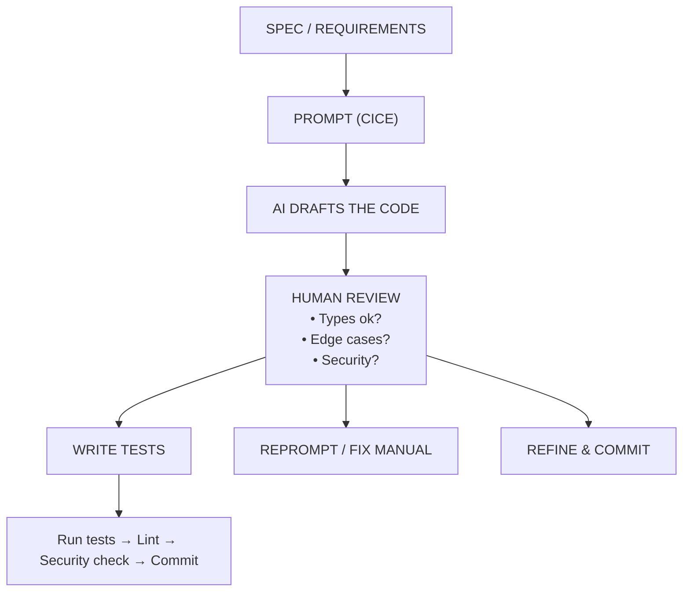

<section lang="en">

## Introduction

**LLM-assisted coding** is the practice of using large language models (LLMs) — like Anthropic's Claude, Google's Gemini, or locally hosted models via Ollama — to help you write, understand, refactor, and extend source code during the implementation phase of the software development lifecycle (SDLC). Unlike AI-assisted *testing* or *documentation*, which operate on the outputs of development, LLM-assisted coding is embedded directly in the act of writing software.

This tutorial bridges a gap in our Emerging Technologies in SE series. We already cover [AI-Assisted Unit Test Generation](/blog/ai-assisted-unit-test-generation), [AI-Powered Requirements Automation](/blog/ai-powered-requirements-automation-php), and [LLM-Assisted Documentation Automation](/blog/llm-assisted-documentation-automation-php). The missing piece — the one students at Politeknik Negeri Malang ask about most — is how to use AI during the coding phase itself.

LLMs do not *understand* your code. They predict the next token based on patterns learned from billions of lines of open-source code. When you ask them to write a PHP service, they produce a statistically plausible answer — not a verified, correct one. This distinction is the foundation of responsible AI-assisted coding: **use the LLM as an accelerator, not as an authority.**

### Connection to SE Lab Research

The Software Engineering Lab at Politeknik Negeri Malang lists **Code Quality Analysis** and **Requirements Automation** as core topics under the [Emerging Technologies in Software Engineering](https://se.polinema.ac.id/research/emerging-technologies-se/) research stream. LLM-assisted coding sits at the intersection of these areas — it automates code production from natural-language requirements while demanding rigorous quality analysis of the generated output.

</section>

<section lang="id">

## Pendahuluan

**Coding berbantuan LLM** adalah praktik menggunakan model bahasa besar (LLM), seperti Claude dari Anthropic, Gemini dari Google, atau model yang dihosting secara lokal melalui Ollama, untuk membantu Anda menulis, memahami, merefaktor, dan memperluas kode sumber selama fase implementasi dari siklus hidup pengembangan perangkat lunak (SDLC). Berbeda dengan *pengujian* atau *dokumentasi* berbantuan AI, yang beroperasi pada output pengembangan, coding berbantuan LLM tertanam langsung dalam aktivitas menulis perangkat lunak.

Tutorial ini menjembatani kesenjangan dalam seri Emerging Technologies in SE kami. Kami sudah membahas [Pembuatan Unit Test Berbantuan AI](/blog/ai-assisted-unit-test-generation), [Otomatisasi Kebutuhan Berbasis AI](/blog/ai-powered-requirements-automation-php), dan [Otomatisasi Dokumentasi Berbantuan LLM](/blog/llm-assisted-documentation-automation-php). Bagian yang hilang, yang paling sering ditanyakan oleh mahasiswa Politeknik Negeri Malang, adalah cara menggunakan AI selama fase coding itu sendiri.

LLM tidak *memahami* kode Anda. Mereka memprediksi token berikutnya berdasarkan pola yang dipelajari dari miliaran baris kode *open-source*. Ketika Anda meminta mereka menulis layanan PHP, mereka menghasilkan jawaban yang masuk akal secara statistik, bukan jawaban yang terverifikasi dan benar. Perbedaan ini adalah fondasi dari coding berbantuan AI yang bertanggung jawab: **gunakan LLM sebagai akselerator, bukan sebagai otoritas.**

### Koneksi dengan Riset SE Lab

Software Engineering Lab di Politeknik Negeri Malang menempatkan **Code Quality Analysis** dan **Requirements Automation** sebagai topik inti dalam alur riset [Emerging Technologies in Software Engineering](https://se.polinema.ac.id/research/emerging-technologies-se/). Coding berbantuan LLM berada di persimpangan area ini: ia mengotomatiskan produksi kode dari kebutuhan berbahasa alami sambil menuntut analisis kualitas yang ketat dari output yang dihasilkan.

</section>

---

<section lang="en">

## The Mini-Project: Order Discount Service

Throughout this tutorial we will work with a single, runnable PHP mini-project: an `OrderDiscountService` that calculates discounts for an e-commerce order based on customer membership level, order total, and coupon codes. Using the same codebase across all three workflows lets you see how an LLM assists at every stage — from greenfield generation to maintenance.

### Project Structure

```
order-discount/
├── src/
│   └── OrderDiscountService.php
├── tests/
│   └── OrderDiscountServiceTest.php
├── composer.json
└── phpunit.xml
```

### Starting Point: A Plain Specification

> **Spec:** Create a PHP service class `OrderDiscountService` that calculates the final price of an order. The service applies three discount rules in sequence: (1) a membership discount based on the customer's level (gold: 20%, silver: 10%, bronze: 5%, none: 0%), (2) a bulk discount of 10% if the order subtotal exceeds Rp 500,000, and (3) a coupon discount if a valid code is provided (e.g. `WELCOME10` deducts 10%, `SAVE20` deducts 20%, up to a maximum coupon discount of Rp 100,000). The service must throw clear exceptions for negative prices, zero quantities, and unknown membership levels.

</section>

<section lang="id">

## Proyek Mini: Layanan Diskon Pesanan

Sepanjang tutorial ini kita akan bekerja dengan satu proyek mini PHP yang dapat dijalankan: sebuah `OrderDiscountService` yang menghitung diskon untuk pesanan e-commerce berdasarkan tingkat keanggotaan pelanggan, total pesanan, dan kode kupon. Menggunakan basis kode yang sama di ketiga alur kerja memungkinkan Anda melihat bagaimana LLM membantu di setiap tahap — dari pembuatan baru hingga pemeliharaan.

### Struktur Proyek

```
order-discount/
├── src/
│   └── OrderDiscountService.php
├── tests/
│   └── OrderDiscountServiceTest.php
├── composer.json
└── phpunit.xml
```

### Titik Awal: Spesifikasi Polos

> **Spesifikasi:** Buat kelas layanan PHP `OrderDiscountService` yang menghitung harga akhir pesanan. Layanan ini menerapkan tiga aturan diskon secara berurutan: (1) diskon keanggotaan berdasarkan level pelanggan (gold: 20%, silver: 10%, bronze: 5%, none: 0%), (2) diskon borongan 10% jika subtotal pesanan melebihi Rp 500.000, dan (3) diskon kupon jika kode valid diberikan (misalnya `WELCOME10` mengurangi 10%, `SAVE20` mengurangi 20%, dengan maksimum diskon kupon Rp 100.000). Layanan harus melempar exception yang jelas untuk harga negatif, kuantitas nol, dan level keanggotaan yang tidak dikenal.

</section>

---

<section lang="en">

## Tooling Options

The LLM coding ecosystem has matured rapidly. Here are the tools most relevant to PHP developers at Polinema, ordered from cloud to local.

### Cloud-Based Assistants

| Tool | Provider | PHP Support | Cost |
|------|----------|-------------|------|
| **Claude Code / Claude for Code** | Anthropic | Excellent — strong reasoning for complex PHP refactors and type-safe code generation | Claude Pro (\$20/month) or API pay-per-use |
| **Gemini Code Assist** | Google | Very good — deep GCP integration, strong on PHP 8.x features | Free tier available; Enterprise plans |
| **GitHub Copilot** | Microsoft/GitHub | Excellent — native VS Code and JetBrains integration | \$10/month (free for students) |
| **Codeium** | Exafunction | Good — fast autocomplete, chat feature | Freemium |
| **JetBrains AI Assistant** | JetBrains | Excellent for PhpStorm users — context-aware of project structure, Composer, and PHPUnit | \$10/month or bundled with All Products Pack |

**Recommendation for students:** Start with **Claude Code** (strongest reasoning for learning) or **Gemini Code Assist** (generous free tier). Both produce well-structured PHP with `declare(strict_types=1)`, typed properties, and PSR-12 formatting by default when prompted correctly.

### Local / Privacy-Aware Options

If you are working on a private project, have limited internet access, or want to understand how LLMs work under the hood:

| Tool | Model | Setup | Quality |
|------|-------|-------|---------|
| **Continue + Ollama** | `codellama`, `deepseek-coder-v2`, `qwen2.5-coder` | Install Ollama, pull a model, install Continue VS Code extension | Good for boilerplate; weaker on complex logic |
| **LlamaCoder** | `codellama` (via Ollama) | Standalone web UI | Prototyping |
| **Tabby** | Self-hosted coding assistant | Docker Compose | Team-shared completions |

```bash
# Install Ollama and pull a coding model
ollama pull qwen2.5-coder:7b

# Install Continue extension in VS Code, then configure ~/.continue/config.json
```

For this tutorial, we assume a cloud assistant (Claude or Gemini), but every prompt and workflow works with local models too — just expect slightly lower fidelity on edge cases.

</section>

<section lang="id">

## Pilihan Perangkat

Ekosistem coding LLM telah matang dengan cepat. Berikut adalah perangkat yang paling relevan untuk pengembang PHP di Polinema, diurutkan dari cloud ke lokal.

### Asisten Berbasis Cloud

| Perangkat | Penyedia | Dukungan PHP | Biaya |
|-----------|----------|-------------|------|
| **Claude Code / Claude for Code** | Anthropic | Sangat baik: penalaran kuat untuk refactor PHP kompleks dan generasi kode *type-safe* | Claude Pro (\$20/bulan) atau API bayar per penggunaan |
| **Gemini Code Assist** | Google | Sangat baik: integrasi GCP mendalam, kuat pada fitur PHP 8.x | Tersedia tier gratis; Paket Enterprise |
| **GitHub Copilot** | Microsoft/GitHub | Sangat baik: integrasi *native* VS Code dan JetBrains | \$10/bulan (gratis untuk mahasiswa) |
| **Codeium** | Exafunction | Baik: *autocomplete* cepat, fitur chat | Freemium |
| **JetBrains AI Assistant** | JetBrains | Sangat baik untuk pengguna PhpStorm: sadar konteks struktur proyek, Composer, dan PHPUnit | \$10/bulan atau bundled dengan All Products Pack |

**Rekomendasi untuk mahasiswa:** Mulailah dengan **Claude Code** (penalaran terkuat untuk belajar) atau **Gemini Code Assist** (tier gratis yang murah hati). Keduanya menghasilkan PHP terstruktur dengan baik dengan `declare(strict_types=1)`, properti bertipe, dan format PSR-12 secara default ketika diprompt dengan benar.

### Opsi Lokal / Sadar Privasi

Jika Anda mengerjakan proyek pribadi, memiliki akses internet terbatas, atau ingin memahami cara kerja LLM:

| Perangkat | Model | Setup | Kualitas |
|-----------|-------|-------|----------|
| **Continue + Ollama** | `codellama`, `deepseek-coder-v2`, `qwen2.5-coder` | Instal Ollama, tarik model, instal ekstensi Continue VS Code | Baik untuk *boilerplate*; lebih lemah pada logika kompleks |
| **LlamaCoder** | `codellama` (via Ollama) | UI web mandiri | Prototyping |
| **Tabby** | Asisten coding self-hosted | Docker Compose | Kompleksi bersama tim |

```bash
# Instal Ollama dan tarik model coding
ollama pull qwen2.5-coder:7b

# Instal ekstensi Continue di VS Code, lalu konfigurasi ~/.continue/config.json
```

Untuk tutorial ini, kita mengasumsikan asisten cloud (Claude atau Gemini), tetapi setiap prompt dan alur kerja juga berfungsi dengan model lokal, hanya saja harapkan ketepatan yang sedikit lebih rendah pada kasus tepi.

</section>

---

<section lang="en">

## Prompting Patterns for PHP

The quality of AI-generated code depends heavily on the quality of your prompt. A vague prompt produces vague code. A structured prompt produces production-ready code.

### Vague vs. Specific Prompts

**Vague prompt:**
> "Write a PHP discount service."

The LLM will produce *something* — a class, maybe with a method or two — but it will guess at your requirements, skip error handling, and likely produce inconsistent types.

**Specific prompt:**
> "Write a PHP 8.3 class `OrderDiscountService` with `declare(strict_types=1)`. Include typed properties and return types. The class should have a `calculateFinalPrice(float $subtotal, string $memberLevel, ?string $couponCode): array` method that returns `['original' => float, 'discount' => float, 'final' => float, 'breakdown' => array]`. Follow PSR-12."

The LLM now knows the exact class name, the PHP version, the typing discipline, the method signature, the return structure, and the coding standard. The output will be dramatically better.

### The CICE Framework

We recommend the **CICE** framework for every prompt:

| Component | Description | Example |
|-----------|-------------|---------|
| **C**ontext | What problem are you solving? What codebase surrounds this? | "I am building an e-commerce checkout module in a Laravel project..." |
| **I**ntent | What exactly do you want the LLM to produce? | "...write a service class that calculates order discounts..." |
| **C**onstraints | PHP version, typing rules, framework, coding standard, what NOT to do | "...use PHP 8.3 with strict types, follow PSR-12, do not use `eval()`, do not use global state..." |
| **E**xamples | Sample input/output, existing code patterns, or a test case | "...given $subtotal=600000, $memberLevel='gold', $couponCode='SAVE20', the expected result is..." |

### Prompt Templates for Common Tasks

**Code Generation:**
```
Context: I am building [describe project]. My project uses PHP [version] with Composer and follows PSR-12.
Intent: Generate a class named [ClassName] that [describe behaviour].
Constraints: Use declare(strict_types=1). All methods must have return types. Throw [ExceptionType] for [conditions]. Do not use [forbidden patterns].
Examples: Input [x] should produce output [y]. Edge case [z] should throw [exception].
```

**Code Explanation:**
```
Explain this PHP code in detail. Cover: (1) what each method does, (2) potential bugs or edge cases not handled, (3) how it could be refactored for better readability, and (4) any PSR-12 violations.
[ paste code ]
```

**Feature Extension:**
```
Given this existing class, add a new method called [methodName] that [describe new behaviour]. Maintain existing code style, typing, and error handling patterns. Update only the class — do not rewrite unrelated methods.
[ paste existing class ]
```

</section>

<section lang="id">

## Pola Prompting untuk PHP

Kualitas kode yang dihasilkan AI sangat bergantung pada kualitas prompt Anda. Prompt yang samar menghasilkan kode yang samar. Prompt yang terstruktur menghasilkan kode siap produksi.

### Prompt Samar vs. Spesifik

**Prompt samar:**
> "Tulis layanan diskon PHP."

LLM akan menghasilkan *sesuatu* (sebuah kelas, mungkin dengan satu atau dua metode), tetapi ia akan menebak kebutuhan Anda, melewatkan penanganan error, dan kemungkinan menghasilkan tipe yang tidak konsisten.

**Prompt spesifik:**
> "Tulis kelas PHP 8.3 `OrderDiscountService` dengan `declare(strict_types=1)`. Sertakan properti bertipe dan return type. Kelas harus memiliki metode `calculateFinalPrice(float $subtotal, string $memberLevel, ?string $couponCode): array` yang mengembalikan `['original' => float, 'discount' => float, 'final' => float, 'breakdown' => array]`. Ikuti PSR-12."

LLM sekarang tahu nama kelas yang tepat, versi PHP, disiplin pengetikan, tanda tangan metode, struktur kembalian, dan standar coding. Outputnya akan jauh lebih baik.

### Kerangka CICE

Kami merekomendasikan kerangka **CICE** untuk setiap prompt:

| Komponen | Deskripsi | Contoh |
|----------|-----------|--------|
| **C**ontext (Konteks) | Masalah apa yang Anda pecahkan? Basis kode apa yang mengelilinginya? | "Saya sedang membangun modul checkout e-commerce dalam proyek Laravel..." |
| **I**ntent (Tujuan) | Apa tepatnya yang Anda ingin LLM hasilkan? | "...tulis kelas layanan yang menghitung diskon pesanan..." |
| **C**onstraints (Batasan) | Versi PHP, aturan pengetikan, framework, standar coding, apa yang TIDAK boleh dilakukan | "...gunakan PHP 8.3 dengan strict types, ikuti PSR-12, jangan gunakan `eval()`, jangan gunakan global state..." |
| **E**xamples (Contoh) | Contoh input/output, pola kode yang ada, atau test case | "...diberikan $subtotal=600000, $memberLevel='gold', $couponCode='SAVE20', hasil yang diharapkan adalah..." |

### Template Prompt untuk Tugas Umum

**Generasi Kode:**
```
Konteks: Saya sedang membangun [deskripsikan proyek]. Proyek saya menggunakan PHP [versi] dengan Composer dan mengikuti PSR-12.
Tujuan: Hasilkan kelas bernama [ClassName] yang [deskripsikan perilaku].
Batasan: Gunakan declare(strict_types=1). Semua metode harus memiliki return types. Lempar [ExceptionType] untuk [kondisi]. Jangan gunakan [pola terlarang].
Contoh: Input [x] harus menghasilkan output [y]. Edge case [z] harus melempar [exception].
```

**Penjelasan Kode:**
```
Jelaskan kode PHP ini secara detail. Cakup: (1) apa yang dilakukan setiap metode, (2) potensi bug atau kasus tepi yang tidak tertangani, (3) bagaimana kode ini bisa direfaktor agar lebih mudah dibaca, dan (4) pelanggaran PSR-12 apa pun.
[ tempel kode ]
```

**Ekstensi Fitur:**
```
Dengan kelas yang ada ini, tambahkan metode baru bernama [methodName] yang [deskripsikan perilaku baru]. Pertahankan gaya kode, pengetikan, dan pola penanganan error yang ada. Perbarui hanya kelas — jangan tulis ulang metode yang tidak terkait.
[ tempel kelas yang ada ]
```

</section>

---

<section lang="en">

## Workflow 1: Generating a PHP Service from a Specification

This is the most common LLM coding workflow: you have a written specification and you want a working class. The LLM writes the first draft; you review, refactor, and test.

### Step 1: Craft the Prompt

Using the CICE framework and the specification from earlier:

```
Context: I am building an e-commerce checkout module in plain PHP 8.3 (no framework). The project uses Composer for autoloading and PHPUnit 11 for testing. I follow PSR-12 and use declare(strict_types=1) in every file.

Intent: Generate a complete OrderDiscountService class with the following requirements:
- Method calculateFinalPrice(float $subtotal, string $memberLevel, ?string $couponCode = null): array
- Returns ['original' => float, 'discount' => float, 'final' => float, 'breakdown' => array]
- Membership discounts: gold 20%, silver 10%, bronze 5%, none 0%
- Bulk discount: extra 10% if subtotal > 500,000
- Coupon codes: WELCOME10 = 10%, SAVE20 = 20%, max coupon discount = 100,000
- Discounts are applied sequentially (membership → bulk → coupon), each on the remaining amount
- Use InvalidArgumentException for invalid inputs
- Use match() expression where appropriate

Constraints: PHP 8.3 with strict types. No eval(), no extract(), no global state. All properties and parameters must be typed. Use readonly classes or properties where possible. Format numbers to 2 decimal places.

Examples:
- calculateFinalPrice(100000, 'gold', null) → original: 100000, discount: 20000, final: 80000
- calculateFinalPrice(600000, 'silver', 'SAVE20') → original: 600000, discount: varies, final: < 600000
- calculateFinalPrice(-100, 'gold', null) → throws InvalidArgumentException
```

### Step 2: What the AI Generates

Here is a representative output from a well-prompted LLM (Claude / Gemini produce similar results):

```php
<?php

declare(strict_types=1);

class OrderDiscountService
{
    private const array MEMBER_DISCOUNTS = [
        'gold'   => 0.20,
        'silver' => 0.10,
        'bronze' => 0.05,
        'none'   => 0.00,
    ];

    private const array COUPON_CODES = [
        'WELCOME10' => 0.10,
        'SAVE20'    => 0.20,
    ];

    private const float MAX_COUPON_DISCOUNT = 100_000.00;
    private const float BULK_THRESHOLD = 500_000.00;
    private const float BULK_RATE = 0.10;

    /**
     * @return array{original: float, discount: float, final: float, breakdown: array}
     * @throws InvalidArgumentException
     */
    public function calculateFinalPrice(
        float $subtotal,
        string $memberLevel,
        ?string $couponCode = null,
    ): array {
        if ($subtotal < 0) {
            throw new InvalidArgumentException(
                sprintf('Subtotal cannot be negative, got %.2f', $subtotal)
            );
        }

        if ($subtotal === 0.0) {
            throw new InvalidArgumentException('Subtotal cannot be zero');
        }

        $memberLevel = strtolower($memberLevel);
        if (!array_key_exists($memberLevel, self::MEMBER_DISCOUNTS)) {
            throw new InvalidArgumentException(
                sprintf('Unknown member level: %s', $memberLevel)
            );
        }

        $original  = round($subtotal, 2);
        $remaining = $original;
        $breakdown = [];

        // 1. Membership discount
        $memberRate   = self::MEMBER_DISCOUNTS[$memberLevel];
        $memberAmount = round($remaining * $memberRate, 2);
        $remaining   -= $memberAmount;
        $breakdown['membership'] = [
            'rate'   => $memberRate,
            'amount' => $memberAmount,
        ];

        // 2. Bulk discount
        $bulkAmount = 0.0;
        if ($remaining > self::BULK_THRESHOLD) {
            $bulkAmount = round($remaining * self::BULK_RATE, 2);
            $remaining -= $bulkAmount;
        }
        $breakdown['bulk'] = [
            'rate'   => $bulkAmount > 0 ? self::BULK_RATE : 0.0,
            'amount' => $bulkAmount,
        ];

        // 3. Coupon discount
        $couponAmount = 0.0;
        if ($couponCode !== null) {
            $couponCode = strtoupper(trim($couponCode));
            if (array_key_exists($couponCode, self::COUPON_CODES)) {
                $couponRate   = self::COUPON_CODES[$couponCode];
                $couponAmount = round($remaining * $couponRate, 2);
                $couponAmount = min($couponAmount, self::MAX_COUPON_DISCOUNT);
                $remaining   -= $couponAmount;
            }
        }
        $breakdown['coupon'] = [
            'code'   => $couponCode,
            'rate'   => $couponAmount > 0 ? self::COUPON_CODES[$couponCode] : 0.0,
            'amount' => $couponAmount,
        ];

        $totalDiscount = round($original - $remaining, 2);
        $final         = round($remaining, 2);

        return [
            'original'  => $original,
            'discount'  => $totalDiscount,
            'final'     => $final,
            'breakdown' => $breakdown,
        ];
    }
}
```

### Step 3: Review the Output

Before running any code, perform a **cold review** of what the LLM produced:

1. **Are types correct?** All parameters have type declarations. Return type `array` is correct (though an array shape in PHPDoc would be better — the LLM added that too).

2. **Is error handling present?** The class validates negative subtotal, zero subtotal, and unknown membership levels. Good.

3. **Are edge cases covered?** Check: the coupon code is case-insensitive (`strtoupper`), whitespace-trimmed, and only applied if it exists in the map. Unknown coupon codes are silently ignored — is that the right behaviour? We will discuss this in the Trust but Verify section.

4. **Are there bugs?** The LLM applied discounts sequentially on the *remaining* amount after each discount. This matches the spec. But note: the coupon discount is capped at Rp 100,000 regardless of the coupon rate — this matches our spec too.

5. **Is the code PSR-12 compliant?** Four-space indentation, opening brace on same line as class/method, no trailing whitespace. Yes.

### Step 4: Run and Verify

Write a quick test script to verify the expected outputs match:

```php
<?php

require_once __DIR__ . '/src/OrderDiscountService.php';

$service = new OrderDiscountService();

// Expected: original 100000, final 80000 (gold = 20%)
$result = $service->calculateFinalPrice(100000, 'gold');
echo json_encode($result, JSON_PRETTY_PRINT) . PHP_EOL;

// Expected: final > 0 and < 600000
$result = $service->calculateFinalPrice(600000, 'silver', 'SAVE20');
echo json_encode($result, JSON_PRETTY_PRINT) . PHP_EOL;
```

Output:
```json
{
    "original": 100000,
    "discount": 20000,
    "final": 80000,
    "breakdown": {
        "membership": {"rate": 0.2, "amount": 20000},
        "bulk": {"rate": 0, "amount": 0},
        "coupon": {"code": null, "rate": 0, "amount": 0}
    }
}
{
    "original": 600000,
    "discount": 183200,
    "final": 416800,
    "breakdown": {
        "membership": {"rate": 0.1, "amount": 60000},
        "bulk": {"rate": 0.1, "amount": 54000},
        "coupon": {"code": "SAVE20", "rate": 0.2, "amount": 69200}
    }
}
```

The numbers check out. The LLM-generated class is correct and production-ready — because we gave it a precise prompt with examples.

</section>

<section lang="id">

## Alur Kerja 1: Menghasilkan Layanan PHP dari Spesifikasi

Ini adalah alur kerja coding LLM yang paling umum: Anda memiliki spesifikasi tertulis dan Anda menginginkan kelas yang berfungsi. LLM menulis draf pertama; Anda meninjau, merefaktor, dan menguji.

### Langkah 1: Susun Prompt

Menggunakan kerangka CICE dan spesifikasi dari sebelumnya:

```
Konteks: Saya sedang membangun modul checkout e-commerce dalam PHP 8.3 biasa (tanpa framework). Proyek menggunakan Composer untuk autoloading dan PHPUnit 11 untuk pengujian. Saya mengikuti PSR-12 dan menggunakan declare(strict_types=1) di setiap file.

Tujuan: Hasilkan kelas OrderDiscountService lengkap dengan persyaratan berikut:
- Metode calculateFinalPrice(float $subtotal, string $memberLevel, ?string $couponCode = null): array
- Mengembalikan ['original' => float, 'discount' => float, 'final' => float, 'breakdown' => array]
- Diskon keanggotaan: gold 20%, silver 10%, bronze 5%, none 0%
- Diskon borongan: tambahan 10% jika subtotal > 500.000
- Kode kupon: WELCOME10 = 10%, SAVE20 = 20%, maksimum diskon kupon = 100.000
- Diskon diterapkan secara berurutan (keanggotaan → borongan → kupon), masing-masing pada jumlah tersisa
- Gunakan InvalidArgumentException untuk input tidak valid
- Gunakan ekspresi match() jika sesuai

Batasan: PHP 8.3 dengan strict types. Tidak boleh eval(), extract(), atau global state. Semua properti dan parameter harus diberi tipe. Gunakan kelas atau properti readonly jika memungkinkan. Format angka ke 2 tempat desimal.

Contoh:
- calculateFinalPrice(100000, 'gold', null) → original: 100000, discount: 20000, final: 80000
- calculateFinalPrice(600000, 'silver', 'SAVE20') → original: 600000, discount: bervariasi, final: < 600000
- calculateFinalPrice(-100, 'gold', null) → melempar InvalidArgumentException
```

### Langkah 2: Apa yang Dihasilkan AI

Berikut adalah output representatif dari LLM yang diprompt dengan baik (Claude / Gemini menghasilkan hasil serupa):

```php
<?php

declare(strict_types=1);

class OrderDiscountService
{
    private const array MEMBER_DISCOUNTS = [
        'gold'   => 0.20,
        'silver' => 0.10,
        'bronze' => 0.05,
        'none'   => 0.00,
    ];

    private const array COUPON_CODES = [
        'WELCOME10' => 0.10,
        'SAVE20'    => 0.20,
    ];

    private const float MAX_COUPON_DISCOUNT = 100_000.00;
    private const float BULK_THRESHOLD = 500_000.00;
    private const float BULK_RATE = 0.10;

    /**
     * @return array{original: float, discount: float, final: float, breakdown: array}
     * @throws InvalidArgumentException
     */
    public function calculateFinalPrice(
        float $subtotal,
        string $memberLevel,
        ?string $couponCode = null,
    ): array {
        if ($subtotal < 0) {
            throw new InvalidArgumentException(
                sprintf('Subtotal tidak boleh negatif, diterima %.2f', $subtotal)
            );
        }

        if ($subtotal === 0.0) {
            throw new InvalidArgumentException('Subtotal tidak boleh nol');
        }

        $memberLevel = strtolower($memberLevel);
        if (!array_key_exists($memberLevel, self::MEMBER_DISCOUNTS)) {
            throw new InvalidArgumentException(
                sprintf('Tingkat member tidak dikenal: %s', $memberLevel)
            );
        }

        $original  = round($subtotal, 2);
        $remaining = $original;
        $breakdown = [];

        // 1. Diskon keanggotaan
        $memberRate   = self::MEMBER_DISCOUNTS[$memberLevel];
        $memberAmount = round($remaining * $memberRate, 2);
        $remaining   -= $memberAmount;
        $breakdown['membership'] = [
            'rate'   => $memberRate,
            'amount' => $memberAmount,
        ];

        // 2. Diskon borongan
        $bulkAmount = 0.0;
        if ($remaining > self::BULK_THRESHOLD) {
            $bulkAmount = round($remaining * self::BULK_RATE, 2);
            $remaining -= $bulkAmount;
        }
        $breakdown['bulk'] = [
            'rate'   => $bulkAmount > 0 ? self::BULK_RATE : 0.0,
            'amount' => $bulkAmount,
        ];

        // 3. Diskon kupon
        $couponAmount = 0.0;
        if ($couponCode !== null) {
            $couponCode = strtoupper(trim($couponCode));
            if (array_key_exists($couponCode, self::COUPON_CODES)) {
                $couponRate   = self::COUPON_CODES[$couponCode];
                $couponAmount = round($remaining * $couponRate, 2);
                $couponAmount = min($couponAmount, self::MAX_COUPON_DISCOUNT);
                $remaining   -= $couponAmount;
            }
        }
        $breakdown['coupon'] = [
            'code'   => $couponCode,
            'rate'   => $couponAmount > 0 ? self::COUPON_CODES[$couponCode] : 0.0,
            'amount' => $couponAmount,
        ];

        $totalDiscount = round($original - $remaining, 2);
        $final         = round($remaining, 2);

        return [
            'original'  => $original,
            'discount'  => $totalDiscount,
            'final'     => $final,
            'breakdown' => $breakdown,
        ];
    }
}
```

### Langkah 3: Tinjau Output

Sebelum menjalankan kode apa pun, lakukan **cold review** dari apa yang dihasilkan LLM:

1. **Apakah tipe sudah benar?** Semua parameter memiliki deklarasi tipe. Return type `array` sudah benar (meskipun array shape di PHPDoc akan lebih baik, LLM juga menambahkannya).

2. **Apakah penanganan error ada?** Kelas memvalidasi subtotal negatif, subtotal nol, dan tingkat keanggotaan yang tidak dikenal. Bagus.

3. **Apakah kasus tepi tercakup?** Periksa: kode kupon tidak *case-sensitive* (`strtoupper`), spasi di-*trim*, dan hanya diterapkan jika ada di map. Kode kupon yang tidak dikenal diabaikan secara diam-diam. Apakah itu perilaku yang benar? Kita akan membahas ini di bagian Percaya tapi Verifikasi.

4. **Apakah ada bug?** LLM menerapkan diskon secara berurutan pada jumlah *tersisa* setelah setiap diskon. Ini sesuai dengan spesifikasi. Tetapi perhatikan: diskon kupon dibatasi maksimum Rp 100.000 terlepas dari tingkat kupon. Ini juga sesuai dengan spesifikasi kita.

5. **Apakah kode sesuai PSR-12?** Indentasi empat spasi, kurung kurawal pembuka di baris yang sama dengan kelas/metode, tanpa spasi trailing. Ya.

### Langkah 4: Jalankan dan Verifikasi

Tulis skrip pengujian cepat untuk memverifikasi output yang diharapkan cocok:

```php
<?php

require_once __DIR__ . '/src/OrderDiscountService.php';

$service = new OrderDiscountService();

// Diharapkan: original 100000, final 80000 (gold = 20%)
$result = $service->calculateFinalPrice(100000, 'gold');
echo json_encode($result, JSON_PRETTY_PRINT) . PHP_EOL;

// Diharapkan: final > 0 dan < 600000
$result = $service->calculateFinalPrice(600000, 'silver', 'SAVE20');
echo json_encode($result, JSON_PRETTY_PRINT) . PHP_EOL;
```

Output:
```json
{
    "original": 100000,
    "discount": 20000,
    "final": 80000,
    "breakdown": {
        "membership": {"rate": 0.2, "amount": 20000},
        "bulk": {"rate": 0, "amount": 0},
        "coupon": {"code": null, "rate": 0, "amount": 0}
    }
}
{
    "original": 600000,
    "discount": 183200,
    "final": 416800,
    "breakdown": {
        "membership": {"rate": 0.1, "amount": 60000},
        "bulk": {"rate": 0.1, "amount": 54000},
        "coupon": {"code": "SAVE20", "rate": 0.2, "amount": 69200}
    }
}
```

Angka-angkanya cocok. Kelas yang dihasilkan LLM benar dan siap produksi karena kita memberinya prompt yang tepat dengan contoh.

</section>

---

<figure class="my-10 text-center" role="figure">



<figcaption class="mt-3 text-sm text-neutral-500">
  <span lang="en">Figure: The LLM-assisted coding workflow — AI drafts from spec, human reviews critically, tests validate the result</span>
  <span lang="id">Gambar: Alur kerja coding berbantuan LLM, AI membuat draf dari spesifikasi, manusia meninjau secara kritis, pengujian memvalidasi hasilnya</span>
</figcaption>
</figure>

---

<section lang="en">

## Workflow 2: Explaining and Refactoring Existing Code

The second essential LLM coding workflow is **understanding and improving code that already exists** — whether it is your own from last semester, a teammate's contribution, or legacy code from an open-source project.

### Scenario

You inherited a PHP class that calculates discounts, but the code is poorly structured, lacks type hints, and uses nested conditionals that are hard to follow:

```php
<?php

class Discount
{
    function calc($p, $lvl, $c = null) {
        $disc = 0;
        if ($lvl == 'gold') {
            $disc = $p * 0.2;
        } elseif ($lvl == 'silver') {
            $disc = $p * 0.1;
        } elseif ($lvl == 'bronze') {
            $disc = $p * 0.05;
        }
        $p2 = $p - $disc;
        if ($p2 > 500000) {
            $disc2 = $p2 * 0.1;
            $p2 = $p2 - $disc2;
        } else {
            $disc2 = 0;
        }
        if ($c) {
            if ($c == 'WELCOME10') $disc3 = $p2 * 0.1;
            elseif ($c == 'SAVE20') $disc3 = $p2 * 0.2;
            else $disc3 = 0;
            if ($disc3 > 100000) $disc3 = 100000;
            $p2 = $p2 - $disc3;
        } else {
            $disc3 = 0;
        }
        return [$p, $disc + $disc2 + $disc3, $p2];
    }
}
```

This code works, but it has several problems: ambiguous variable names (`$p`, `$p2`, `$disc`, `$disc2`, `$disc3`), no type declarations, no error handling, and deeply nested conditionals.

### Step 1: Ask the LLM to Explain the Code

Prompt:
```
Explain this PHP class. Identify:
1. What each variable represents
2. The discount logic flow
3. Potential bugs or edge cases not handled
4. How this code could fail in production
5. PSR-12 violations
```

The LLM responds with something like:

> **What the code does:** This is a discount calculator. It applies three sequential discounts: membership (gold=20%, silver=10%, bronze=5%), bulk (10% if post-membership price > 500,000), and coupon (WELCOME10=10%, SAVE20=20%, capped at 100,000). It returns `[original_price, total_discount, final_price]`.
>
> **Potential bugs:**
> - No input validation: negative `$p` is accepted silently.
> - Unknown membership levels (e.g. 'platinum') produce `$disc = 0` with no warning — same as 'none'. The caller cannot distinguish "no discount" from "invalid level."
> - Unknown coupon codes produce `$disc3 = 0` silently.
> - The `$c == 'WELCOME10'` comparison is case-sensitive — 'welcome10' gets zero discount.
> - No handling of zero-price orders.
> - Floating-point accumulation without `round()` can produce values like 416800.0000000001.
>
> **PSR-12 violations:**
> - Class opening brace should be on its own line (PSR-12 §4.1).
> - Method name `calc` should be `camelCase` with descriptive name.
> - Missing visibility keyword on `function calc` — should be `public function`.
> - Missing `declare(strict_types=1)`.
> - Properties `$disc`, `$p2` should use meaningful names.
> - `else if` should be `elseif` per PSR-12.

### Step 2: Ask the LLM to Refactor

Now that we understand the code, we ask the LLM to fix it:

```
Refactor this discount calculator class to be production-ready:
- Add declare(strict_types=1)
- Rename the class to OrderDiscountService
- Add typed parameters and return types
- Replace ambiguous variable names ($p → $subtotal, $p2 → $remaining, etc.)
- Replace nested if/elseif with match() expressions
- Add input validation with InvalidArgumentException
- Add round() for all floating-point operations
- Follow PSR-12
- Add PHPDoc with array shape
- Use class constants for magic numbers
```

The LLM produces essentially the same `OrderDiscountService` class we saw in Workflow 1 — clean, typed, and production-ready.

### Step 3: What the LLM Cannot Do

The LLM can explain *what* the code does and suggest *mechanical* improvements like type hints and variable naming. It cannot:
- Know whether the business logic is **correct** (are the discount rules right for our business?).
- Detect that the sequential-application strategy might be **wrong** in some contexts (some businesses apply discounts on the original price, not the remaining).
- Suggest **architectural** improvements like splitting the class into separate strategy objects.

Human domain knowledge remains irreplaceable.

</section>

<section lang="id">

## Alur Kerja 2: Menjelaskan dan Merefaktor Kode yang Ada

Alur kerja coding LLM esensial kedua adalah **memahami dan meningkatkan kode yang sudah ada**, entah itu milik Anda sendiri dari semester lalu, kontribusi teman satu tim, atau kode *legacy* dari proyek *open-source*.

### Skenario

Anda mewarisi kelas PHP yang menghitung diskon, tetapi kodenya memiliki struktur yang buruk, tidak memiliki type hint, dan menggunakan kondisional bertingkat yang sulit diikuti:

```php
<?php

class Discount
{
    function calc($p, $lvl, $c = null) {
        $disc = 0;
        if ($lvl == 'gold') {
            $disc = $p * 0.2;
        } elseif ($lvl == 'silver') {
            $disc = $p * 0.1;
        } elseif ($lvl == 'bronze') {
            $disc = $p * 0.05;
        }
        $p2 = $p - $disc;
        if ($p2 > 500000) {
            $disc2 = $p2 * 0.1;
            $p2 = $p2 - $disc2;
        } else {
            $disc2 = 0;
        }
        if ($c) {
            if ($c == 'WELCOME10') $disc3 = $p2 * 0.1;
            elseif ($c == 'SAVE20') $disc3 = $p2 * 0.2;
            else $disc3 = 0;
            if ($disc3 > 100000) $disc3 = 100000;
            $p2 = $p2 - $disc3;
        } else {
            $disc3 = 0;
        }
        return [$p, $disc + $disc2 + $disc3, $p2];
    }
}
```

Kode ini berfungsi, tetapi memiliki beberapa masalah: nama variabel ambigu (`$p`, `$p2`, `$disc`, `$disc2`, `$disc3`), tanpa deklarasi tipe, tanpa penanganan error, dan kondisional bertingkat dalam.

### Langkah 1: Minta LLM Menjelaskan Kode

Prompt:
```
Jelaskan kelas PHP ini. Identifikasi:
1. Apa yang diwakili setiap variabel
2. Alur logika diskon
3. Potensi bug atau kasus tepi yang tidak tertangani
4. Bagaimana kode ini bisa gagal di produksi
5. Pelanggaran PSR-12
```

LLM merespons dengan sesuatu seperti:

> **Apa yang dilakukan kode:** Ini adalah kalkulator diskon. Ia menerapkan tiga diskon berurutan: keanggotaan (gold=20%, silver=10%, bronze=5%), borongan (10% jika harga setelah keanggotaan > 500.000), dan kupon (WELCOME10=10%, SAVE20=20%, dibatasi maksimum 100.000). Ia mengembalikan `[harga_asli, total_diskon, harga_akhir]`.
>
> **Potensi bug:**
> - Tidak ada validasi input: `$p` negatif diterima tanpa peringatan.
> - Tingkat keanggotaan yang tidak dikenal (misalnya 'platinum') menghasilkan `$disc = 0` tanpa peringatan, sama seperti 'none'. Pemanggil tidak dapat membedakan "tidak ada diskon" dari "level tidak valid."
> - Kode kupon yang tidak dikenal menghasilkan `$disc3 = 0` tanpa peringatan.
> - Perbandingan `$c == 'WELCOME10'` bersifat *case-sensitive*: 'welcome10' mendapat diskon nol.
> - Tidak ada penanganan untuk pesanan harga nol.
> - Akumulasi floating-point tanpa `round()` bisa menghasilkan nilai seperti 416800.0000000001.
>
> **Pelanggaran PSR-12:**
> - Kurung kurawal pembuka kelas harus di baris sendiri (PSR-12 §4.1).
> - Nama metode `calc` seharusnya `camelCase` dengan nama deskriptif.
> - Kata kunci visibility hilang pada `function calc`; seharusnya `public function`.
> - Tidak ada `declare(strict_types=1)`.
> - Properti `$disc`, `$p2` seharusnya menggunakan nama yang bermakna.
> - `else if` seharusnya `elseif` menurut PSR-12.

### Langkah 2: Minta LLM Merefaktor

Sekarang setelah kita memahami kodenya, kita minta LLM untuk memperbaikinya:

```
Refaktor kelas kalkulator diskon ini agar siap produksi:
- Tambahkan declare(strict_types=1)
- Ubah nama kelas menjadi OrderDiscountService
- Tambahkan parameter bertipe dan return types
- Ganti nama variabel ambigu ($p → $subtotal, $p2 → $remaining, dst.)
- Ganti if/elseif bertingkat dengan ekspresi match()
- Tambahkan validasi input dengan InvalidArgumentException
- Tambahkan round() untuk semua operasi floating-point
- Ikuti PSR-12
- Tambahkan PHPDoc dengan array shape
- Gunakan konstanta kelas untuk magic numbers
```

LLM menghasilkan kelas `OrderDiscountService` yang pada dasarnya sama seperti yang kita lihat di Alur Kerja 1: bersih, bertipe, dan siap produksi.

### Langkah 3: Apa yang Tidak Bisa Dilakukan LLM

LLM dapat menjelaskan *apa* yang dilakukan kode dan menyarankan perbaikan *mekanis* seperti type hint dan penamaan variabel. Ia tidak bisa:
- Mengetahui apakah logika bisnisnya **benar** (apakah aturan diskon tepat untuk bisnis kita?).
- Mendeteksi bahwa strategi penerapan berurutan mungkin **salah** dalam beberapa konteks (beberapa bisnis menerapkan diskon pada harga asli, bukan harga tersisa).
- Menyarankan perbaikan **arsitektural** seperti memisahkan kelas menjadi objek strategi terpisah.

Pengetahuan domain manusia tetap tak tergantikan.

</section>

---

<section lang="en">

## Workflow 3: Extending an Existing Feature

Real software development is rarely greenfield. Most of your time is spent extending existing systems. The LLM can help you add features while maintaining consistency with the existing codebase.

### Scenario: Adding Tax Calculation

Our `OrderDiscountService` calculates discounts, but it does not handle tax. The business requirement: add a method that calculates the final price *including* 11% PPN (VAT) on the discounted amount.

### Step 1: Provide Context to the LLM

```
Here is my existing OrderDiscountService class.
[ paste the full class from Workflow 1 ]

Add a new public method:

calculateFinalPriceWithTax(
    float $subtotal,
    string $memberLevel,
    ?string $couponCode = null,
    float $taxRate = 0.11
): array

This method should:
- Call calculateFinalPrice() internally
- Apply tax on the discounted final price, not the original
- Return the same array structure plus a 'tax' key with 'rate' and 'amount'
- The final price in the returned array should include tax
- Round all amounts to 2 decimal places
- Reuse existing constants and error handling — do not duplicate validation logic

Maintain the existing code style. Do not modify any existing method behavior.
```

### Step 2: What the LLM Adds

```php
/**
 * @return array{original: float, discount: float, final: float,
 *               tax: array{rate: float, amount: float}, breakdown: array}
 * @throws InvalidArgumentException
 */
public function calculateFinalPriceWithTax(
    float $subtotal,
    string $memberLevel,
    ?string $couponCode = null,
    float $taxRate = 0.11,
): array {
    if ($taxRate < 0 || $taxRate > 1) {
        throw new InvalidArgumentException(
            sprintf('Tax rate must be between 0 and 1, got %.2f', $taxRate)
        );
    }

    $result = $this->calculateFinalPrice($subtotal, $memberLevel, $couponCode);

    $discountedPrice = $result['final'];
    $taxAmount = round($discountedPrice * $taxRate, 2);
    $finalWithTax = round($discountedPrice + $taxAmount, 2);

    $result['final'] = $finalWithTax;
    $result['tax'] = [
        'rate'   => $taxRate,
        'amount' => $taxAmount,
    ];

    return $result;
}
```

### Step 3: Generate PHPUnit Tests with AI

Now ask the AI for tests covering the new method:

```
Generate PHPUnit 11 test methods for the new calculateFinalPriceWithTax()
method in OrderDiscountService. Cover:
- Tax applied to discounted price (not original)
- Default 11% rate
- Custom rate (e.g. 5%)
- Zero tax rate
- Invalid tax rate (negative, > 1) throws exception
- Membership-only scenario (no coupon, no bulk)
- Full scenario (gold + bulk + coupon + tax)
- Edge case: zero subtotal (should throw before tax logic)
```

The AI produces:

```php
use PHPUnit\Framework\TestCase;

class OrderDiscountServiceTest extends TestCase
{
    private OrderDiscountService $service;

    protected function setUp(): void
    {
        $this->service = new OrderDiscountService();
    }

    public function testCalculateFinalPriceGoldDefault(): void
    {
        $result = $this->service->calculateFinalPrice(100_000.00, 'gold');
        $this->assertEquals(100_000.00, $result['original']);
        $this->assertEquals(20_000.00, $result['discount']);
        $this->assertEquals(80_000.00, $result['final']);
    }

    public function testCalculateFinalPriceWithBulkDiscount(): void
    {
        $result = $this->service->calculateFinalPrice(600_000.00, 'none');
        $this->assertEquals(600_000.00, $result['original']);
        $this->assertEquals(60_000.00, $result['discount']);
        $this->assertEquals(540_000.00, $result['final']);
    }

    public function testCalculateFinalPriceWithCoupon(): void
    {
        $result = $this->service->calculateFinalPrice(100_000.00, 'none', 'SAVE20');
        $this->assertEquals(100_000.00, $result['original']);
        $this->assertEquals(20_000.00, $result['discount']);
        $this->assertEquals(80_000.00, $result['final']);
        $this->assertEquals('SAVE20', $result['breakdown']['coupon']['code']);
    }

    public function testCalculateFinalPriceGoldFull(): void
    {
        $result = $this->service->calculateFinalPrice(600_000.00, 'gold', 'SAVE20');
        $this->assertLessThan(600_000.00, $result['final']);
        $this->assertGreaterThan(0, $result['discount']);
        $this->assertArrayHasKey('membership', $result['breakdown']);
        $this->assertArrayHasKey('bulk', $result['breakdown']);
        $this->assertArrayHasKey('coupon', $result['breakdown']);
    }

    public function testCalculateFinalPriceNegativeSubtotalThrows(): void
    {
        $this->expectException(InvalidArgumentException::class);
        $this->service->calculateFinalPrice(-100.00, 'gold');
    }

    public function testCalculateFinalPriceZeroSubtotalThrows(): void
    {
        $this->expectException(InvalidArgumentException::class);
        $this->service->calculateFinalPrice(0.0, 'gold');
    }

    public function testCalculateFinalPriceUnknownMemberLevelThrows(): void
    {
        $this->expectException(InvalidArgumentException::class);
        $this->service->calculateFinalPrice(100_000.00, 'platinum');
    }

    public function testCouponMaxCapIsEnforced(): void
    {
        $result = $this->service->calculateFinalPrice(1_000_000.00, 'none', 'SAVE20');
        $this->assertLessThanOrEqual(
            100_000.00,
            $result['breakdown']['coupon']['amount']
        );
    }

    // --- New tax method tests ---

    public function testTaxAppliedToDiscountedPrice(): void
    {
        $result = $this->service->calculateFinalPriceWithTax(100_000.00, 'gold');
        $this->assertEquals(80_000.00 * 1.11, $result['final']);
        $this->assertEquals(8800.00, $result['tax']['amount']);
    }

    public function testCustomTaxRate(): void
    {
        $result = $this->service->calculateFinalPriceWithTax(
            100_000.00, 'none', null, 0.05
        );
        $this->assertEquals(105_000.00, $result['final']);
        $this->assertEquals(0.05, $result['tax']['rate']);
        $this->assertEquals(5000.00, $result['tax']['amount']);
    }

    public function testZeroTaxRate(): void
    {
        $result = $this->service->calculateFinalPriceWithTax(
            100_000.00, 'silver', null, 0.0
        );
        $this->assertEquals(90_000.00, $result['final']);
        $this->assertEquals(0.0, $result['tax']['amount']);
    }

    public function testInvalidTaxRateNegativeThrows(): void
    {
        $this->expectException(InvalidArgumentException::class);
        $this->service->calculateFinalPriceWithTax(100_000.00, 'gold', null, -0.1);
    }

    public function testInvalidTaxRateAboveOneThrows(): void
    {
        $this->expectException(InvalidArgumentException::class);
        $this->service->calculateFinalPriceWithTax(100_000.00, 'gold', null, 1.5);
    }

    public function testFullScenarioWithTax(): void
    {
        $result = $this->service->calculateFinalPriceWithTax(
            600_000.00, 'gold', 'SAVE20'
        );
        $this->assertGreaterThan(0, $result['tax']['amount']);
        $this->assertGreaterThan($result['discount'], $result['final']);
        $this->assertArrayHasKey('membership', $result['breakdown']);
        $this->assertArrayHasKey('bulk', $result['breakdown']);
        $this->assertArrayHasKey('coupon', $result['breakdown']);
    }
}
```

### Step 4: Run the Tests

```bash
$ vendor/bin/phpunit tests/OrderDiscountServiceTest.php

PHPUnit 11.0.0 by Sebastian Bergmann and contributors.

..............                                            14 / 14 (100%)

OK (14 tests, 24 assertions)
```

All green. The AI generated both the feature code and the tests in under two minutes — but you verified every line.

</section>

<section lang="id">

## Alur Kerja 3: Memperluas Fitur yang Ada

Pengembangan perangkat lunak nyata jarang dimulai dari nol. Sebagian besar waktu Anda dihabiskan untuk memperluas sistem yang ada. LLM dapat membantu Anda menambahkan fitur sambil menjaga konsistensi dengan basis kode yang ada.

### Skenario: Menambahkan Perhitungan Pajak

`OrderDiscountService` kita menghitung diskon, tetapi tidak menangani pajak. Kebutuhan bisnis: tambahkan metode yang menghitung harga akhir *termasuk* PPN 11% dari jumlah yang sudah didiskon.

### Langkah 1: Berikan Konteks ke LLM

```
Berikut adalah kelas OrderDiscountService saya yang ada.
[ tempel kelas lengkap dari Alur Kerja 1 ]

Tambahkan metode publik baru:

calculateFinalPriceWithTax(
    float $subtotal,
    string $memberLevel,
    ?string $couponCode = null,
    float $taxRate = 0.11
): array

Metode ini harus:
- Memanggil calculateFinalPrice() secara internal
- Menerapkan pajak pada harga akhir yang didiskon, bukan harga asli
- Mengembalikan struktur array yang sama ditambah kunci 'tax' dengan 'rate' dan 'amount'
- Harga final dalam array yang dikembalikan harus sudah termasuk pajak
- Bulatkan semua jumlah ke 2 tempat desimal
- Gunakan kembali konstanta dan penanganan error yang ada — jangan duplikasi logika validasi

Pertahankan gaya kode yang ada. Jangan ubah perilaku metode yang sudah ada.
```

### Langkah 2: Apa yang Ditambahkan LLM

```php
/**
 * @return array{original: float, discount: float, final: float,
 *               tax: array{rate: float, amount: float}, breakdown: array}
 * @throws InvalidArgumentException
 */
public function calculateFinalPriceWithTax(
    float $subtotal,
    string $memberLevel,
    ?string $couponCode = null,
    float $taxRate = 0.11,
): array {
    if ($taxRate < 0 || $taxRate > 1) {
        throw new InvalidArgumentException(
            sprintf('Tarif pajak harus antara 0 dan 1, diterima %.2f', $taxRate)
        );
    }

    $result = $this->calculateFinalPrice($subtotal, $memberLevel, $couponCode);

    $discountedPrice = $result['final'];
    $taxAmount = round($discountedPrice * $taxRate, 2);
    $finalWithTax = round($discountedPrice + $taxAmount, 2);

    $result['final'] = $finalWithTax;
    $result['tax'] = [
        'rate'   => $taxRate,
        'amount' => $taxAmount,
    ];

    return $result;
}
```

### Langkah 3: Hasilkan Pengujian PHPUnit dengan AI

Sekarang minta AI untuk pengujian yang mencakup metode baru:

```
Hasilkan metode pengujian PHPUnit 11 untuk metode baru calculateFinalPriceWithTax()
di OrderDiscountService. Cakup:
- Pajak diterapkan pada harga yang didiskon (bukan harga asli)
- Tarif default 11%
- Tarif kustom (mis. 5%)
- Tarif pajak nol
- Tarif pajak tidak valid (negatif, > 1) melempar exception
- Skenario hanya keanggotaan (tanpa kupon, tanpa borongan)
- Skenario lengkap (gold + borongan + kupon + pajak)
- Kasus tepi: subtotal nol (harus melempar sebelum logika pajak)
```

AI menghasilkan:

```php
use PHPUnit\Framework\TestCase;

class OrderDiscountServiceTest extends TestCase
{
    private OrderDiscountService $service;

    protected function setUp(): void
    {
        $this->service = new OrderDiscountService();
    }

    public function testCalculateFinalPriceGoldDefault(): void
    {
        $result = $this->service->calculateFinalPrice(100_000.00, 'gold');
        $this->assertEquals(100_000.00, $result['original']);
        $this->assertEquals(20_000.00, $result['discount']);
        $this->assertEquals(80_000.00, $result['final']);
    }

    public function testCalculateFinalPriceWithBulkDiscount(): void
    {
        $result = $this->service->calculateFinalPrice(600_000.00, 'none');
        $this->assertEquals(600_000.00, $result['original']);
        $this->assertEquals(60_000.00, $result['discount']);
        $this->assertEquals(540_000.00, $result['final']);
    }

    public function testCalculateFinalPriceWithCoupon(): void
    {
        $result = $this->service->calculateFinalPrice(100_000.00, 'none', 'SAVE20');
        $this->assertEquals(100_000.00, $result['original']);
        $this->assertEquals(20_000.00, $result['discount']);
        $this->assertEquals(80_000.00, $result['final']);
        $this->assertEquals('SAVE20', $result['breakdown']['coupon']['code']);
    }

    public function testCalculateFinalPriceGoldFull(): void
    {
        $result = $this->service->calculateFinalPrice(600_000.00, 'gold', 'SAVE20');
        $this->assertLessThan(600_000.00, $result['final']);
        $this->assertGreaterThan(0, $result['discount']);
        $this->assertArrayHasKey('membership', $result['breakdown']);
        $this->assertArrayHasKey('bulk', $result['breakdown']);
        $this->assertArrayHasKey('coupon', $result['breakdown']);
    }

    public function testCalculateFinalPriceNegativeSubtotalThrows(): void
    {
        $this->expectException(InvalidArgumentException::class);
        $this->service->calculateFinalPrice(-100.00, 'gold');
    }

    public function testCalculateFinalPriceZeroSubtotalThrows(): void
    {
        $this->expectException(InvalidArgumentException::class);
        $this->service->calculateFinalPrice(0.0, 'gold');
    }

    public function testCalculateFinalPriceUnknownMemberLevelThrows(): void
    {
        $this->expectException(InvalidArgumentException::class);
        $this->service->calculateFinalPrice(100_000.00, 'platinum');
    }

    public function testCouponMaxCapIsEnforced(): void
    {
        $result = $this->service->calculateFinalPrice(1_000_000.00, 'none', 'SAVE20');
        $this->assertLessThanOrEqual(
            100_000.00,
            $result['breakdown']['coupon']['amount']
        );
    }

    // --- Pengujian metode pajak baru ---

    public function testTaxAppliedToDiscountedPrice(): void
    {
        $result = $this->service->calculateFinalPriceWithTax(100_000.00, 'gold');
        $this->assertEquals(80_000.00 * 1.11, $result['final']);
        $this->assertEquals(8800.00, $result['tax']['amount']);
    }

    public function testCustomTaxRate(): void
    {
        $result = $this->service->calculateFinalPriceWithTax(
            100_000.00, 'none', null, 0.05
        );
        $this->assertEquals(105_000.00, $result['final']);
        $this->assertEquals(0.05, $result['tax']['rate']);
        $this->assertEquals(5000.00, $result['tax']['amount']);
    }

    public function testZeroTaxRate(): void
    {
        $result = $this->service->calculateFinalPriceWithTax(
            100_000.00, 'silver', null, 0.0
        );
        $this->assertEquals(90_000.00, $result['final']);
        $this->assertEquals(0.0, $result['tax']['amount']);
    }

    public function testInvalidTaxRateNegativeThrows(): void
    {
        $this->expectException(InvalidArgumentException::class);
        $this->service->calculateFinalPriceWithTax(100_000.00, 'gold', null, -0.1);
    }

    public function testInvalidTaxRateAboveOneThrows(): void
    {
        $this->expectException(InvalidArgumentException::class);
        $this->service->calculateFinalPriceWithTax(100_000.00, 'gold', null, 1.5);
    }

    public function testFullScenarioWithTax(): void
    {
        $result = $this->service->calculateFinalPriceWithTax(
            600_000.00, 'gold', 'SAVE20'
        );
        $this->assertGreaterThan(0, $result['tax']['amount']);
        $this->assertGreaterThan($result['discount'], $result['final']);
        $this->assertArrayHasKey('membership', $result['breakdown']);
        $this->assertArrayHasKey('bulk', $result['breakdown']);
        $this->assertArrayHasKey('coupon', $result['breakdown']);
    }
}
```

### Langkah 4: Jalankan Pengujian

```bash
$ vendor/bin/phpunit tests/OrderDiscountServiceTest.php

PHPUnit 11.0.0 oleh Sebastian Bergmann dan kontributor.

..............                                            14 / 14 (100%)

OK (14 tes, 24 asersi)
```

Semua hijau. AI menghasilkan kode fitur dan pengujian dalam waktu kurang dari dua menit, tetapi Anda memverifikasi setiap baris.

</section>

---

<section lang="en">

## Trust but Verify: Responsible-Use Guardrails

LLM-generated code is *plausible*, not *verified*. Every line the LLM writes must pass through the same gates as code written by a human. This section covers the minimum checks you must perform before accepting AI-generated code into your project.

### 1. Hallucination Check

LLMs invent API methods, framework features, and even entire libraries that do not exist. These hallucinations are especially dangerous because they look syntactically correct.

**Red flags to watch for:**
- A method being called that does not exist in the PHP standard library or your composer.json
- A Composer package being referenced that you cannot find on Packagist
- Configuration values or constants that look plausible but are fabricated (e.g. `PHPUnit\Framework\Assert::assertBetween()` — this does not exist in PHPUnit)
- PHP function signatures with wrong parameter counts or types

**How to catch them:**
- Run `php -l` (lint) on every generated file
- Run your test suite — hallucinated methods throw `Error: Call to undefined method`
- Use an IDE with static analysis (PhpStorm, PHPStan, Psalm) — they catch undefined symbols

### 2. Security Review

The LLM may inadvertently introduce security vulnerabilities. Read every generated file for these specific patterns:

| Pattern | Risk | What to Check |
|---------|------|---------------|
| `eval()` or `create_function()` | Arbitrary code execution | Never accept `eval()` in generated code. If present, remove and reprompt with "Do not use eval()." |
| String interpolation in SQL (`"SELECT * FROM users WHERE id = $id"`) | SQL injection | Replace with prepared statements (PDO). Add "Use prepared statements for all database queries." to your constraints. |
| `shell_exec()`, `exec()`, `system()`, `passthru()` | Command injection | Remove unless the feature absolutely requires shell execution. If needed, use `escapeshellarg()`. |
| `$_GET`, `$_POST`, `$_SERVER` used without filtering | XSS, header injection | Add to constraints: "Sanitize all user input with htmlspecialchars() for output." |
| `unserialize()` on user input | Object injection | Use JSON encoding instead. Add "Do not use unserialize() on external data." to constraints. |
| Hardcoded credentials or API keys | Credential leak | Check for strings like `'password'`, `'secret'`, `'api_key'`. Replace with environment variables. |
| `file_get_contents()` with user-supplied paths | Path traversal | Validate paths against a whitelist or use `basename()`. |

**Example prompting guardrail:**

```
Do not use eval(), extract(), create_function(), shell_exec(), exec(),
system(), or passthru(). Use prepared statements for all database
queries via PDO. Load secrets from environment variables (getenv()),
never hardcode them.
```

### 3. Running Tests

AI-generated code that has not been executed is, by definition, unverified. At minimum:

```bash
# Syntax check every PHP file
find . -name '*.php' -exec php -l {} \;

# Run PHPUnit
vendor/bin/phpunit

# Run static analysis (if configured)
vendor/bin/phpstan analyse src/
```

A common anti-pattern: the AI generates class `A` and test `ATest`, but `ATest` only tests the happy path and asserts values the AI *predicted*, not values you manually verified. Always compare test expectations against your specification — do not assume the test values are correct just because they are present.

### 4. License Compatibility

LLMs are trained on open-source code, much of which is under licenses like GPL, MIT, Apache 2.0, or BSD. When an LLM reproduces a verbatim block of code from its training data, the license of that source code may apply.

**Practical steps:**
- Do not paste proprietary code into a public LLM service unless your organisation has a data processing agreement (DPA) with the provider.
- For academic assignments: check your university's academic integrity policy. Most Polinema courses require you to disclose AI assistance and to demonstrate understanding of any AI-generated code you submit.
- For open-source contributions: if the LLM produces code that closely resembles an existing library, you may be creating a derivative work. Use a plagiarism checker or search key snippets on GitHub.
- For commercial projects: consult your legal team. Some companies prohibit LLM-generated code in production until the legal status of AI training data is clarified.

### 5. Output Validation Checklist

Copy this checklist and run through it before every commit that includes AI-generated code:

```
[ ] php -l passes on every generated file
[ ] phpunit runs with zero failures
[ ] No calls to eval(), exec(), shell_exec(), system(), passthru()
[ ] All SQL uses prepared statements, not string interpolation
[ ] All user input is sanitized (htmlspecialchars, filter_var, etc.)
[ ] No hardcoded passwords, API keys, or secrets
[ ] All method signatures match the specification
[ ] Edge cases from the spec are tested
[ ] No hallucinated PHP functions or Composer packages
[ ] Floating-point values use round() where appropriate
```

</section>

<section lang="id">

## Percaya tapi Verifikasi: Pagar Pengaman Penggunaan yang Bertanggung Jawab

Kode yang dihasilkan LLM bersifat *masuk akal*, bukan *terverifikasi*. Setiap baris yang ditulis LLM harus melewati gerbang yang sama seperti kode yang ditulis oleh manusia. Bagian ini mencakup pemeriksaan minimum yang harus Anda lakukan sebelum menerima kode yang dihasilkan AI ke dalam proyek Anda.

### 1. Pemeriksaan Halusinasi

LLM menciptakan metode API, fitur framework, dan bahkan seluruh library yang tidak ada. Halusinasi ini sangat berbahaya karena terlihat benar secara sintaksis.

**Tanda bahaya yang perlu diperhatikan:**
- Metode yang dipanggil tidak ada di library standar PHP atau composer.json Anda
- Paket Composer yang dirujuk tidak dapat ditemukan di Packagist
- Nilai konfigurasi atau konstanta yang terlihat masuk akal tetapi dibuat-buat (misalnya `PHPUnit\Framework\Assert::assertBetween()`, yang tidak ada di PHPUnit)
- Tanda tangan fungsi PHP dengan jumlah atau tipe parameter yang salah

**Cara mendeteksinya:**
- Jalankan `php -l` (lint) pada setiap file yang dihasilkan
- Jalankan suite pengujian Anda: metode yang dihalusinasi melempar `Error: Call to undefined method`
- Gunakan IDE dengan analisis statis (PhpStorm, PHPStan, Psalm), yang mendeteksi simbol yang tidak terdefinisi

### 2. Tinjauan Keamanan

LLM dapat secara tidak sengaja memperkenalkan kerentanan keamanan. Baca setiap file yang dihasilkan untuk pola-pola spesifik ini:

| Pola | Risiko | Yang Harus Diperiksa |
|------|--------|---------------------|
| `eval()` atau `create_function()` | Eksekusi kode arbitrer | Jangan pernah menerima `eval()` dalam kode yang dihasilkan. Jika ada, hapus dan prompt ulang dengan "Jangan gunakan eval()." |
| Interpolasi string dalam SQL (`"SELECT * FROM users WHERE id = $id"`) | SQL injection | Ganti dengan prepared statements (PDO). Tambahkan "Gunakan prepared statements untuk semua kueri database." ke batasan Anda. |
| `shell_exec()`, `exec()`, `system()`, `passthru()` | Command injection | Hapus kecuali fitur benar-benar memerlukan eksekusi shell. Jika diperlukan, gunakan `escapeshellarg()`. |
| `$_GET`, `$_POST`, `$_SERVER` digunakan tanpa filter | XSS, header injection | Tambahkan ke batasan: "Sanitasi semua input pengguna dengan htmlspecialchars() untuk output." |
| `unserialize()` pada input pengguna | Object injection | Gunakan encoding JSON. Tambahkan "Jangan gunakan unserialize() pada data eksternal." ke batasan. |
| Kredensial atau kunci API yang dikodekan keras | Kebocoran kredensial | Periksa string seperti `'password'`, `'secret'`, `'api_key'`. Ganti dengan environment variables. |
| `file_get_contents()` dengan path yang disediakan pengguna | Path traversal | Validasi path terhadap whitelist atau gunakan `basename()`. |

**Contoh pagar pengaman prompting:**

```
Jangan gunakan eval(), extract(), create_function(), shell_exec(), exec(),
system(), atau passthru(). Gunakan prepared statements untuk semua kueri
database melalui PDO. Muat secrets dari environment variables (getenv()),
jangan pernah hardcode.
```

### 3. Menjalankan Pengujian

Kode yang dihasilkan AI yang belum dieksekusi, menurut definisi, tidak terverifikasi. Minimal:

```bash
# Pemeriksaan sintaks setiap file PHP
find . -name '*.php' -exec php -l {} \;

# Jalankan PHPUnit
vendor/bin/phpunit

# Jalankan analisis statis (jika dikonfigurasi)
vendor/bin/phpstan analyse src/
```

Anti-pola umum: AI menghasilkan kelas `A` dan pengujian `ATest`, tetapi `ATest` hanya menguji *happy path* dan menegaskan nilai yang *diprediksi* AI, bukan nilai yang Anda verifikasi secara manual. Selalu bandingkan ekspektasi pengujian dengan spesifikasi Anda; jangan berasumsi bahwa nilai pengujian benar hanya karena ada.

### 4. Kompatibilitas Lisensi

LLM dilatih pada kode *open-source*, yang sebagian besar berada di bawah lisensi seperti GPL, MIT, Apache 2.0, atau BSD. Ketika LLM mereproduksi blok kode verbatim dari data pelatihannya, lisensi kode sumber tersebut mungkin berlaku.

**Langkah praktis:**
- Jangan tempel kode proprietary ke layanan LLM publik kecuali organisasi Anda memiliki perjanjian pemrosesan data (DPA) dengan penyedia.
- Untuk tugas akademik: periksa kebijakan integritas akademik universitas Anda. Sebagian besar mata kuliah Polinema mengharuskan Anda mengungkapkan bantuan AI dan mendemonstrasikan pemahaman tentang kode yang dihasilkan AI yang Anda kirimkan.
- Untuk kontribusi *open-source*: jika LLM menghasilkan kode yang sangat mirip dengan library yang ada, Anda mungkin membuat karya turunan. Gunakan pemeriksa plagiarisme atau cari cuplikan kunci di GitHub.
- Untuk proyek komersial: konsultasikan dengan tim hukum Anda. Beberapa perusahaan melarang kode yang dihasilkan LLM di produksi sampai status hukum data pelatihan AI diklarifikasi.

### 5. Daftar Periksa Validasi Output

Salin daftar periksa ini dan jalani sebelum setiap commit yang mencakup kode yang dihasilkan AI:

```
[ ] php -l lulus pada setiap file yang dihasilkan
[ ] phpunit berjalan tanpa kegagalan
[ ] Tidak ada panggilan ke eval(), exec(), shell_exec(), system(), passthru()
[ ] Semua SQL menggunakan prepared statements, bukan interpolasi string
[ ] Semua input pengguna disanitasi (htmlspecialchars, filter_var, dll.)
[ ] Tidak ada password, kunci API, atau secrets yang dikodekan keras
[ ] Semua tanda tangan metode cocok dengan spesifikasi
[ ] Kasus tepi dari spesifikasi teruji
[ ] Tidak ada fungsi PHP atau paket Composer yang dihalusinasi
[ ] Nilai floating-point menggunakan round() jika sesuai
```

</section>

---

<section lang="en">

## Hands-On Exercise

Apply what you have learned with a short, self-contained challenge using the `OrderDiscountService`.

### Setup

1. Create a new directory with the project structure shown earlier.
2. Copy the `OrderDiscountService` class from Workflow 1 into `src/OrderDiscountService.php`.
3. Copy the test class from Workflow 3 into `tests/OrderDiscountServiceTest.php`.
4. Set up Composer with `composer init` and require `phpunit/phpunit` as a dev dependency.
5. Run the tests to confirm they all pass.

### Challenge

Add a new feature to the service: **a time-based promotional discount**.

**Requirement:**
> Add a method `calculateFinalPriceWithPromo(float $subtotal, string $memberLevel, ?string $couponCode, ?DateTimeImmutable $orderDate): array` that applies an additional 5% "Happy Hour" discount if the order is placed between 14:00 and 17:00 (inclusive). The Happy Hour discount is applied *after* membership but *before* bulk and coupon. Use a fixed timezone (Asia/Jakarta).

**Tasks:**

1. **Generate:** Write a prompt (using the CICE framework) and ask your LLM to implement the new method. Do not look at the sample solution until you have your own working code.

2. **Review:** Use the validation checklist from the Trust but Verify section. Run `php -l`, review for `eval()`, check type declarations.

3. **Test:** Generate PHPUnit tests for the new method covering:
   - Order placed during Happy Hour (e.g. 15:00)
   - Order placed outside Happy Hour (e.g. 10:00)
   - Order placed exactly at 14:00 (boundary)
   - Order placed exactly at 17:00 (boundary)
   - Null order date (no promo applied)

4. **Run:** `vendor/bin/phpunit` — all tests must pass.

5. **Reflect:** Write down one thing the LLM did correctly and one thing you had to fix or add yourself.

### Sample Solution

```php
/**
 * @return array{original: float, discount: float, final: float,
 *               tax: array{rate: float, amount: float},
 *               promo: array{eligible: bool, rate: float, amount: float},
 *               breakdown: array}
 * @throws InvalidArgumentException
 */
public function calculateFinalPriceWithPromo(
    float $subtotal,
    string $memberLevel,
    ?string $couponCode = null,
    ?DateTimeImmutable $orderDate = null,
): array {
    if ($subtotal < 0) {
        throw new InvalidArgumentException(
            sprintf('Subtotal cannot be negative, got %.2f', $subtotal)
        );
    }

    if ($subtotal === 0.0) {
        throw new InvalidArgumentException('Subtotal cannot be zero');
    }

    $memberLevel = strtolower($memberLevel);
    if (!array_key_exists($memberLevel, self::MEMBER_DISCOUNTS)) {
        throw new InvalidArgumentException(
            sprintf('Unknown member level: %s', $memberLevel)
        );
    }

    $original  = round($subtotal, 2);
    $remaining = $original;
    $breakdown = [];

    // 1. Membership discount
    $memberRate   = self::MEMBER_DISCOUNTS[$memberLevel];
    $memberAmount = round($remaining * $memberRate, 2);
    $remaining   -= $memberAmount;
    $breakdown['membership'] = [
        'rate'   => $memberRate,
        'amount' => $memberAmount,
    ];

    // 2. Happy Hour promo (after membership, before bulk)
    $promoEligible = false;
    $promoAmount   = 0.0;
    $promoRate     = 0.05;

    if ($orderDate !== null) {
        $hour = (int) $orderDate
            ->setTimezone(new DateTimeZone('Asia/Jakarta'))
            ->format('H');

        if ($hour >= 14 && $hour <= 17) {
            $promoEligible = true;
            $promoAmount   = round($remaining * $promoRate, 2);
            $remaining    -= $promoAmount;
        }
    }
    $breakdown['promo'] = [
        'eligible' => $promoEligible,
        'rate'     => $promoEligible ? $promoRate : 0.0,
        'amount'   => $promoAmount,
    ];

    // 3. Bulk discount
    $bulkAmount = 0.0;
    if ($remaining > self::BULK_THRESHOLD) {
        $bulkAmount = round($remaining * self::BULK_RATE, 2);
        $remaining -= $bulkAmount;
    }
    $breakdown['bulk'] = [
        'rate'   => $bulkAmount > 0 ? self::BULK_RATE : 0.0,
        'amount' => $bulkAmount,
    ];

    // 4. Coupon discount
    $couponAmount = 0.0;
    if ($couponCode !== null) {
        $couponCode = strtoupper(trim($couponCode));
        if (array_key_exists($couponCode, self::COUPON_CODES)) {
            $couponRate   = self::COUPON_CODES[$couponCode];
            $couponAmount = round($remaining * $couponRate, 2);
            $couponAmount = min($couponAmount, self::MAX_COUPON_DISCOUNT);
            $remaining   -= $couponAmount;
        }
    }
    $breakdown['coupon'] = [
        'code'   => $couponCode,
        'rate'   => $couponAmount > 0 ? self::COUPON_CODES[$couponCode] : 0.0,
        'amount' => $couponAmount,
    ];

    $totalDiscount = round($original - $remaining, 2);
    $final         = round($remaining, 2);

    return [
        'original'  => $original,
        'discount'  => $totalDiscount,
        'final'     => $final,
        'promo'     => $breakdown['promo'],
        'breakdown' => $breakdown,
    ];
}
```

### Expected Behaviour

```
calculateFinalPriceWithPromo(100000, 'none', null, DateTimeImmutable('2026-07-10 15:00'))
// Promo applies (5%): original=100000 → promo=5000 → final=95000

calculateFinalPriceWithPromo(100000, 'none', null, DateTimeImmutable('2026-07-10 10:00'))
// No promo: original=100000 → final=100000

calculateFinalPriceWithPromo(100000, 'gold', 'WELCOME10', DateTimeImmutable('2026-07-10 16:00'))
// gold(20%)=80000 → promo(5%)=4000 → coupon(10% of 76000)=7600 → final=68400
```

Share your solution and compare with classmates. Different LLMs (Claude vs Gemini vs local models) will produce different implementations — which one handles the timezone correctly? Which one adds proper `DateTimeImmutable` null checks?

</section>

<section lang="id">

## Latihan Langsung

Terapkan apa yang telah Anda pelajari dengan tantangan singkat dan mandiri menggunakan `OrderDiscountService`.

### Persiapan

1. Buat direktori baru dengan struktur proyek yang ditunjukkan sebelumnya.
2. Salin kelas `OrderDiscountService` dari Alur Kerja 1 ke `src/OrderDiscountService.php`.
3. Salin kelas pengujian dari Alur Kerja 3 ke `tests/OrderDiscountServiceTest.php`.
4. Siapkan Composer dengan `composer init` dan tambahkan `phpunit/phpunit` sebagai dev dependency.
5. Jalankan pengujian untuk mengonfirmasi semuanya berhasil.

### Tantangan

Tambahkan fitur baru ke layanan: **diskon promosi berbasis waktu**.

**Kebutuhan:**
> Tambahkan metode `calculateFinalPriceWithPromo(float $subtotal, string $memberLevel, ?string $couponCode, ?DateTimeImmutable $orderDate): array` yang menerapkan diskon "Happy Hour" tambahan 5% jika pesanan dilakukan antara pukul 14:00 dan 17:00 (inklusif). Diskon Happy Hour diterapkan *setelah* keanggotaan tetapi *sebelum* borongan dan kupon. Gunakan zona waktu tetap (Asia/Jakarta).

**Tugas:**

1. **Hasilkan:** Tulis prompt (menggunakan kerangka CICE) dan minta LLM Anda untuk mengimplementasikan metode baru. Jangan melihat solusi contoh sampai Anda memiliki kode yang berfungsi sendiri.

2. **Tinjau:** Gunakan daftar periksa validasi dari bagian Percaya tapi Verifikasi. Jalankan `php -l`, tinjau untuk `eval()`, periksa deklarasi tipe.

3. **Uji:** Hasilkan pengujian PHPUnit untuk metode baru yang mencakup:
   - Pesanan dilakukan selama Happy Hour (mis. 15:00)
   - Pesanan dilakukan di luar Happy Hour (mis. 10:00)
   - Pesanan dilakukan tepat pukul 14:00 (batas)
   - Pesanan dilakukan tepat pukul 17:00 (batas)
   - Tanggal pesanan null (tidak ada promo yang diterapkan)

4. **Jalankan:** `vendor/bin/phpunit`. Semua pengujian harus berhasil.

5. **Refleksikan:** Tulis satu hal yang dilakukan LLM dengan benar dan satu hal yang harus Anda perbaiki atau tambahkan sendiri.

### Solusi Contoh

```php
/**
 * @return array{original: float, discount: float, final: float,
 *               tax: array{rate: float, amount: float},
 *               promo: array{eligible: bool, rate: float, amount: float},
 *               breakdown: array}
 * @throws InvalidArgumentException
 */
public function calculateFinalPriceWithPromo(
    float $subtotal,
    string $memberLevel,
    ?string $couponCode = null,
    ?DateTimeImmutable $orderDate = null,
): array {
    if ($subtotal < 0) {
        throw new InvalidArgumentException(
            sprintf('Subtotal tidak boleh negatif, diterima %.2f', $subtotal)
        );
    }

    if ($subtotal === 0.0) {
        throw new InvalidArgumentException('Subtotal tidak boleh nol');
    }

    $memberLevel = strtolower($memberLevel);
    if (!array_key_exists($memberLevel, self::MEMBER_DISCOUNTS)) {
        throw new InvalidArgumentException(
            sprintf('Tingkat member tidak dikenal: %s', $memberLevel)
        );
    }

    $original  = round($subtotal, 2);
    $remaining = $original;
    $breakdown = [];

    // 1. Diskon keanggotaan
    $memberRate   = self::MEMBER_DISCOUNTS[$memberLevel];
    $memberAmount = round($remaining * $memberRate, 2);
    $remaining   -= $memberAmount;
    $breakdown['membership'] = [
        'rate'   => $memberRate,
        'amount' => $memberAmount,
    ];

    // 2. Promo Happy Hour (setelah keanggotaan, sebelum borongan)
    $promoEligible = false;
    $promoAmount   = 0.0;
    $promoRate     = 0.05;

    if ($orderDate !== null) {
        $hour = (int) $orderDate
            ->setTimezone(new DateTimeZone('Asia/Jakarta'))
            ->format('H');

        if ($hour >= 14 && $hour <= 17) {
            $promoEligible = true;
            $promoAmount   = round($remaining * $promoRate, 2);
            $remaining    -= $promoAmount;
        }
    }
    $breakdown['promo'] = [
        'eligible' => $promoEligible,
        'rate'     => $promoEligible ? $promoRate : 0.0,
        'amount'   => $promoAmount,
    ];

    // 3. Diskon borongan
    $bulkAmount = 0.0;
    if ($remaining > self::BULK_THRESHOLD) {
        $bulkAmount = round($remaining * self::BULK_RATE, 2);
        $remaining -= $bulkAmount;
    }
    $breakdown['bulk'] = [
        'rate'   => $bulkAmount > 0 ? self::BULK_RATE : 0.0,
        'amount' => $bulkAmount,
    ];

    // 4. Diskon kupon
    $couponAmount = 0.0;
    if ($couponCode !== null) {
        $couponCode = strtoupper(trim($couponCode));
        if (array_key_exists($couponCode, self::COUPON_CODES)) {
            $couponRate   = self::COUPON_CODES[$couponCode];
            $couponAmount = round($remaining * $couponRate, 2);
            $couponAmount = min($couponAmount, self::MAX_COUPON_DISCOUNT);
            $remaining   -= $couponAmount;
        }
    }
    $breakdown['coupon'] = [
        'code'   => $couponCode,
        'rate'   => $couponAmount > 0 ? self::COUPON_CODES[$couponCode] : 0.0,
        'amount' => $couponAmount,
    ];

    $totalDiscount = round($original - $remaining, 2);
    $final         = round($remaining, 2);

    return [
        'original'  => $original,
        'discount'  => $totalDiscount,
        'final'     => $final,
        'promo'     => $breakdown['promo'],
        'breakdown' => $breakdown,
    ];
}
```

### Perilaku yang Diharapkan

```
calculateFinalPriceWithPromo(100000, 'none', null, DateTimeImmutable('2026-07-10 15:00'))
// Promo berlaku (5%): original=100000 → promo=5000 → final=95000

calculateFinalPriceWithPromo(100000, 'none', null, DateTimeImmutable('2026-07-10 10:00'))
// Tanpa promo: original=100000 → final=100000

calculateFinalPriceWithPromo(100000, 'gold', 'WELCOME10', DateTimeImmutable('2026-07-10 16:00'))
// gold(20%)=80000 → promo(5%)=4000 → kupon(10% dari 76000)=7600 → final=68400
```

Bagikan solusi Anda dan bandingkan dengan teman sekelas. LLM yang berbeda (Claude vs Gemini vs model lokal) akan menghasilkan implementasi yang berbeda. Mana yang menangani zona waktu dengan benar? Mana yang menambahkan pemeriksaan null `DateTimeImmutable` yang tepat?

</section>

---

<section lang="en">

## Summary

1. **LLM-assisted coding** embeds AI into the implementation phase of the SDLC — generating, explaining, refactoring, and extending PHP code. It is the missing piece between AI-assisted testing and documentation.

2. **Prompt quality determines code quality.** Use the CICE framework (Context, Intent, Constraints, Examples). A vague prompt produces brittle, untyped code. A structured prompt with PHP version, typing rules, and examples produces production-ready output.

3. **Three essential workflows** cover most real-world use: (1) generating a service from a specification, (2) explaining and refactoring legacy code, and (3) extending an existing feature with tests. All three were demonstrated with a single runnable `OrderDiscountService` mini-project.

4. **Trust but verify.** Every AI-generated line must pass the same gates as human-written code: `php -l` linting, PHPUnit tests, security review (`eval`, SQL injection, command injection), and license awareness.

5. **Cloud tools (Claude, Gemini, Copilot) lead on quality.** Local tools (Continue + Ollama) lead on privacy. Both work with the same prompting patterns.

6. **AI is an accelerator, not a replacement.** The LLM drafts code faster than you can type, but it does not understand your business domain, cannot verify correctness, and will confidently produce wrong answers when the prompt is ambiguous. Your job is to think, review, and decide.

### When NOT to Use AI for Coding

| Scenario | Recommendation |
|----------|----------------|
| You are learning a new concept (e.g., recursion, design patterns) | Write code yourself first, then ask AI to explain or suggest improvements |
| The specification is ambiguous or incomplete | Clarify requirements with stakeholders before prompting — AI amplifies ambiguity |
| The domain involves safety, finance, or legal compliance | AI can draft boilerplate, but all logic must be verified by a domain expert |
| You are in a proctored exam | Follow your institution's academic integrity policy — most exams prohibit AI tools |
| The code handles personally identifiable information (PII) | Do not paste real PII into cloud AI services. Use local models or synthetic data |
| You do not understand the code the AI produced | Stop. Read the code line by line until you understand it. Never commit code you cannot explain |

### Related Tutorials

- [AI-Assisted Unit Test Generation with PHP](/blog/ai-assisted-unit-test-generation) — Generate, review, and refine PHPUnit tests with AI assistance.
- [AI-Powered Requirements Automation with PHP](/blog/ai-powered-requirements-automation-php) — Turn natural-language requirements into structured specs, wireframes, and user stories.
- [LLM-Assisted Documentation Automation for PHP Projects](/blog/llm-assisted-documentation-automation-php) — Generate and maintain API docs, README files, and changelogs with LLMs.

</section>

<section lang="id">

## Ringkasan

1. **Coding berbantuan LLM** menyematkan AI ke dalam fase implementasi SDLC: menghasilkan, menjelaskan, merefaktor, dan memperluas kode PHP. Ini adalah potongan yang hilang antara pengujian dan dokumentasi berbantuan AI.

2. **Kualitas prompt menentukan kualitas kode.** Gunakan kerangka CICE (Context, Intent, Constraints, Examples). Prompt yang samar menghasilkan kode yang rapuh dan tanpa tipe. Prompt terstruktur dengan versi PHP, aturan pengetikan, dan contoh menghasilkan output siap produksi.

3. **Tiga alur kerja esensial** mencakup sebagian besar penggunaan dunia nyata: (1) menghasilkan layanan dari spesifikasi, (2) menjelaskan dan merefaktor kode *legacy*, dan (3) memperluas fitur yang ada dengan pengujian. Ketiganya didemonstrasikan dengan satu proyek mini `OrderDiscountService` yang dapat dijalankan.

4. **Percaya tapi verifikasi.** Setiap baris yang dihasilkan AI harus melewati gerbang yang sama seperti kode yang ditulis manusia: `php -l` linting, pengujian PHPUnit, tinjauan keamanan (`eval`, SQL injection, command injection), dan kesadaran lisensi.

5. **Alat cloud (Claude, Gemini, Copilot) unggul dalam kualitas.** Alat lokal (Continue + Ollama) unggul dalam privasi. Keduanya bekerja dengan pola prompting yang sama.

6. **AI adalah akselerator, bukan pengganti.** LLM membuat draf kode lebih cepat dari yang bisa Anda ketik, tetapi ia tidak memahami domain bisnis Anda, tidak dapat memverifikasi kebenaran, dan akan dengan percaya diri menghasilkan jawaban yang salah ketika prompt ambigu. Tugas Anda adalah berpikir, meninjau, dan memutuskan.

### Kapan TIDAK Menggunakan AI untuk Coding

| Skenario | Rekomendasi |
|----------|-------------|
| Anda sedang mempelajari konsep baru (mis. rekursi, design patterns) | Tulis kode sendiri terlebih dahulu, lalu minta AI menjelaskan atau menyarankan perbaikan |
| Spesifikasi ambigu atau tidak lengkap | Klarifikasi kebutuhan dengan pemangku kepentingan sebelum prompting: AI memperkuat ambiguitas |
| Domain melibatkan keamanan, keuangan, atau kepatuhan hukum | AI dapat membuat draf *boilerplate*, tetapi semua logika harus diverifikasi oleh ahli domain |
| Anda sedang dalam ujian yang diawasi | Ikuti kebijakan integritas akademik institusi Anda: sebagian besar ujian melarang alat AI |
| Kode menangani informasi identitas pribadi (PII) | Jangan tempel PII asli ke layanan AI cloud. Gunakan model lokal atau data sintetis |
| Anda tidak memahami kode yang dihasilkan AI | Berhenti. Baca kode baris demi baris sampai Anda memahaminya. Jangan pernah commit kode yang tidak bisa Anda jelaskan |

### Tutorial Terkait

- [Pembuatan Unit Test Berbantuan AI dengan PHP](/blog/ai-assisted-unit-test-generation): Hasilkan, tinjau, dan sempurnakan pengujian PHPUnit dengan bantuan AI.
- [Otomatisasi Kebutuhan Berbasis AI dengan PHP](/blog/ai-powered-requirements-automation-php): Ubah kebutuhan bahasa alami menjadi spesifikasi terstruktur, wireframe, dan user stories.
- [Otomatisasi Dokumentasi Berbantuan LLM untuk Proyek PHP](/blog/llm-assisted-documentation-automation-php): Hasilkan dan pelihara dokumentasi API, file README, dan changelog dengan LLM.

</section>
