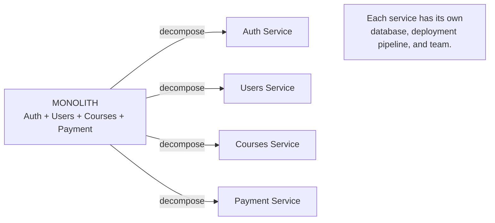
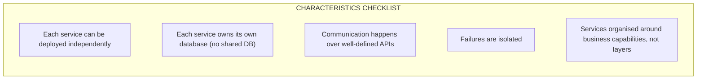
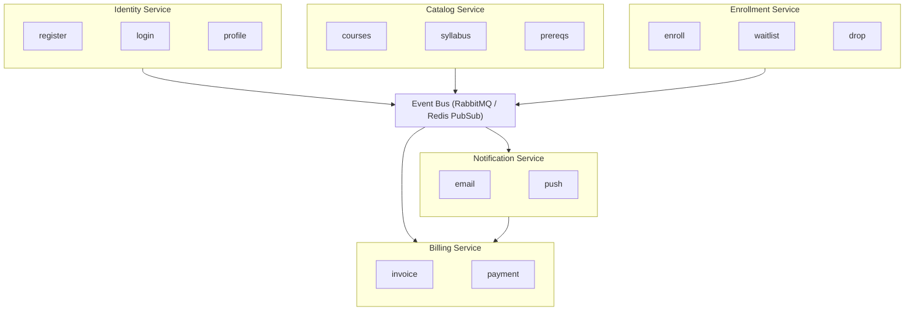

<section lang="en">

## Why Microservices?

Most web applications start as a **monolith** — a single codebase that handles HTTP requests, business logic, database access, and everything in between. For small teams and simple domains this is the right choice. But as the application grows, familiar pain points emerge:

| Monolith Pain Point | What It Feels Like |
|---|---|
| **Tight coupling** | Changing the billing module accidentally breaks user registration. |
| **Slow deployments** | A one-line CSS fix must wait for the entire test suite and deployment pipeline. |
| **Scaling friction** | One CPU-intensive endpoint forces you to scale the entire application — database included. |
| **Team coordination overhead** | Five teams work on the same codebase; merge conflicts and coordination slow everyone down. |
| **Technology lock-in** | The whole system uses one language, one framework, one database. Experimenting is impossible without a rewrite. |

**Microservices** are an architectural style where an application is composed of small, independently deployable services. Each service owns a specific business capability, exposes a well-defined API, and can be developed, deployed, and scaled independently.

The three problems microservices address directly:

1. **Organisational scaling.** When you have multiple teams, independent deployability means each team can ship changes without waiting for "integration week."
2. **Technical scaling.** Services that handle high traffic or heavy computation can be scaled horizontally without scaling the entire system.
3. **Change velocity.** Small, focused codebases are easier to understand, modify, and rewrite — which makes teams faster over time.

</section>

<section lang="id">

## Mengapa Microservices?

Sebagian besar aplikasi web dimulai sebagai **monolit** — satu basis kode yang menangani HTTP request, logika bisnis, akses database, dan lainnya. Untuk tim kecil dan domain sederhana, ini adalah pilihan yang tepat. Tetapi seiring pertumbuhan aplikasi, titik-titik masalah (pain points) yang familiar mulai muncul:

| Pain Point Monolit | Rasanya Seperti Apa |
|---|---|
| **Tight coupling** | Mengubah modul billing secara tidak sengaja merusak registrasi pengguna. |
| **Deployment lambat** | Perbaikan CSS satu baris harus menunggu seluruh test suite dan pipeline deployment. |
| **Scaling friction** | Satu endpoint yang boros CPU memaksa Anda menskalakan seluruh aplikasi — termasuk database. |
| **Overhead koordinasi tim** | Lima tim bekerja pada basis kode yang sama; merge conflict dan koordinasi memperlambat semua orang. |
| **Technology lock-in** | Seluruh sistem menggunakan satu bahasa, satu framework, satu database. Bereksperimen tidak mungkin tanpa rewrite. |

**Microservices** adalah gaya arsitektur di mana aplikasi terdiri dari layanan-layanan kecil yang dapat dideploy secara independen. Setiap layanan memiliki kapabilitas bisnis tertentu, mengekspos API yang terdefinisi dengan baik, dan dapat dikembangkan, dideploy, serta diskalakan secara independen.

Tiga masalah yang langsung dihadapi oleh microservices:

1. **Penskalaan organisasi.** Ketika Anda memiliki banyak tim, deployability independen berarti setiap tim dapat mengirim perubahan tanpa menunggu "minggu integrasi."
2. **Penskalaan teknis.** Layanan yang menangani traffic tinggi atau komputasi berat dapat diskalakan secara horizontal tanpa menskalakan seluruh sistem.
3. **Kecepatan perubahan.** Basis kode yang kecil dan fokus lebih mudah dipahami, dimodifikasi, dan ditulis ulang — yang membuat tim lebih cepat dari waktu ke waktu.

</section>

<figure class="my-10 text-center" role="figure">



<figcaption class="mt-3 text-sm text-neutral-500">
  <span lang="en">Figure: Decomposing a monolith into independent microservices</span>
  <span lang="id">Gambar: Mendekomposisi monolit menjadi microservices independen</span>
</figcaption>
</figure>

---

<section lang="en">

## Core Characteristics of Microservices

A microservices architecture is defined by a handful of non-negotiable characteristics. If you violate these, you do not have microservices — you have a distributed monolith, which combines the worst of both worlds.

### 1. Independently Deployable

Each service can be deployed to production without coordinating with other services. A change to the Payment Service should never require the Courses Service team to schedule a joint deployment. This independence is what enables multiple teams to ship at their own pace.

### 2. Decentralised Data Ownership

Each service owns its own database (or schema / set of tables). Services do **not** share databases. If the Users Service needs payment status, it does not write a SQL JOIN against the Payments database — it calls the Payments Service API.

**Why this matters:** Shared databases create a hidden coupling that is worse than code-level coupling. The Payments team cannot change their schema without coordinating with every team that queries their tables. This defeats the entire purpose of independent deployability.

### 3. Inter-Service Communication

Services communicate through well-defined APIs — most commonly HTTP REST, gRPC, or asynchronous messaging (message queues, event streams). Internal implementation details are hidden behind the API contract.

### 4. Failure Isolation

A failure in the Recommendations Service should not take down the entire platform. Circuit breakers, timeouts, retries, and graceful degradation are first-class concerns. The system must be designed to be **resilient**, not just reliable.

### 5. Organised Around Business Capabilities

Microservices are not split by technical layer (controllers, models, views). They are split by **business capability**. A cross-functional team owns the entire service — from UI to database — for one bounded context.

</section>

<section lang="id">

## Karakteristik Inti Microservices

Arsitektur microservices didefinisikan oleh beberapa karakteristik yang tidak bisa ditawar. Jika Anda melanggar ini, Anda tidak memiliki microservices — Anda memiliki distributed monolith, yang menggabungkan yang terburuk dari kedua dunia.

### 1. Dapat Dideploy Secara Independen

Setiap layanan dapat dideploy ke production tanpa berkoordinasi dengan layanan lain. Perubahan pada Payment Service seharusnya tidak mengharuskan tim Courses Service untuk menjadwalkan deployment bersama. Independensi inilah yang memungkinkan banyak tim untuk meluncurkan perubahan dengan kecepatan masing-masing.

### 2. Kepemilikan Data Terdesentralisasi

Setiap layanan memiliki database-nya sendiri (atau schema / set tabel). Layanan **tidak** berbagi database. Jika Users Service membutuhkan status pembayaran, ia tidak menulis SQL JOIN terhadap database Payments — ia memanggil API Payments Service.

**Mengapa ini penting:** Shared database menciptakan coupling tersembunyi yang lebih buruk daripada coupling level kode. Tim Payments tidak dapat mengubah schema mereka tanpa berkoordinasi dengan setiap tim yang melakukan query ke tabel mereka. Ini menggagalkan seluruh tujuan deployability independen.

### 3. Komunikasi Antar Layanan

Layanan berkomunikasi melalui API yang terdefinisi dengan baik — paling umum HTTP REST, gRPC, atau asynchronous messaging (message queue, event stream). Detail implementasi internal disembunyikan di balik kontrak API.

### 4. Isolasi Kegagalan

Kegagalan di Recommendations Service seharusnya tidak menjatuhkan seluruh platform. Circuit breaker, timeout, retry, dan graceful degradation adalah perhatian utama. Sistem harus dirancang untuk **resilient**, bukan hanya reliable.

### 5. Diorganisasikan Berdasarkan Kapabilitas Bisnis

Microservices tidak dipisahkan berdasarkan layer teknis (controller, model, view). Mereka dipisahkan berdasarkan **kapabilitas bisnis**. Tim cross-functional memiliki seluruh layanan — dari UI hingga database — untuk satu bounded context.

</section>

<figure class="my-10 text-center" role="figure">



<figcaption class="mt-3 text-sm text-neutral-500">
  <span lang="en">Figure: The five core characteristics of microservices</span>
  <span lang="id">Gambar: Lima karakteristik inti microservices</span>
</figcaption>
</figure>

---

<section lang="en">

## When NOT to Use Microservices

Microservices are not a silver bullet. They introduce significant operational complexity. Before adopting them, consider the following counter-indicators:

### The Distributed Big Ball of Mud

The worst architectural outcome is not a monolith — it is a **distributed big ball of mud**: dozens of services that share databases, have no clear API contracts, and are deployed together as a single "release train." This combines the complexity of distributed systems with the inflexibility of a monolith. Avoid this at all costs.

### Team Size and Organisational Maturity

> "If you can't build a well-structured monolith, what makes you think you can build well-structured microservices?" — Simon Brown

The rule of thumb: **start with a monolith, split when you must.** A single team of 3-5 developers should almost certainly build a monolith first. Microservices make sense when:

- You have three or more autonomous teams that need to ship independently.
- The monolith's build and test times are measurably slowing down delivery (think 30+ minute CI pipelines).
- Different parts of the system have fundamentally different scaling or technology requirements.

### When a Monolith Works Better

| Scenario | Recommendation |
|---|---|
| Early-stage product with evolving domain model | Monolith. You do not yet know where the boundaries are. |
| Team of fewer than 10 developers | Monolith. The coordination overhead of microservices outweighs the benefits. |
| Simple CRUD application without complex domain logic | Monolith. Microservices add complexity with no payoff. |
| Strong consistency requirements across entities | Monolith or careful Saga patterns. Distributed transactions are hard. |
| Limited operational maturity (no container orchestration, no CI/CD) | Monolith. You need solid DevOps foundations before microservices. |

### Transition Triggers

You know it is time to consider extracting microservices when:

1. Different modules need different deployment cadences (e.g., payments changes monthly, courses changes weekly).
2. Specific modules need to scale independently (e.g., a reporting module under heavy read load).
3. Teams are stepping on each other's changes in the same codebase.
4. You need to adopt a different technology stack for a specific business capability.

</section>

<section lang="id">

## Kapan TIDAK Menggunakan Microservices

Microservices bukanlah silver bullet. Mereka memperkenalkan kompleksitas operasional yang signifikan. Sebelum mengadopsinya, pertimbangkan kontra-indikator berikut:

### Distributed Big Ball of Mud

Hasil arsitektur terburuk bukanlah monolit — melainkan **distributed big ball of mud**: puluhan layanan yang berbagi database, tidak memiliki kontrak API yang jelas, dan dideploy bersama sebagai satu "release train." Ini menggabungkan kompleksitas sistem terdistribusi dengan ketidakfleksibelan monolit. Hindari ini dengan segala cara.

### Ukuran Tim dan Kematangan Organisasi

> "Jika Anda tidak bisa membangun monolit yang terstruktur dengan baik, apa yang membuat Anda berpikir bisa membangun microservices yang terstruktur dengan baik?" — Simon Brown

Aturan praktisnya: **mulai dengan monolit, pisahkan ketika harus.** Satu tim beranggotakan 3-5 developer hampir pasti harus membangun monolit terlebih dahulu. Microservices masuk akal ketika:

- Anda memiliki tiga atau lebih tim otonom yang perlu mengirim perubahan secara independen.
- Waktu build dan test monolit secara terukur memperlambat delivery (bayangkan CI pipeline 30+ menit).
- Bagian sistem yang berbeda memiliki kebutuhan scaling atau teknologi yang berbeda secara fundamental.

### Ketika Monolit Bekerja Lebih Baik

| Skenario | Rekomendasi |
|---|---|
| Produk tahap awal dengan model domain yang terus berkembang | Monolit. Anda belum tahu di mana batas-batasnya. |
| Tim kurang dari 10 developer | Monolit. Overhead koordinasi microservices lebih besar daripada manfaatnya. |
| Aplikasi CRUD sederhana tanpa logika domain yang kompleks | Monolit. Microservices menambah kompleksitas tanpa hasil. |
| Persyaratan konsistensi kuat antar entitas | Monolit atau pola Saga yang hati-hati. Transaksi terdistribusi itu sulit. |
| Kematangan operasional terbatas (tanpa container orchestration, tanpa CI/CD) | Monolit. Anda butuh fondasi DevOps yang solid sebelum microservices. |

### Pemicu Transisi

Anda tahu saatnya mempertimbangkan untuk mengekstrak microservices ketika:

1. Modul yang berbeda membutuhkan irama deployment yang berbeda (misalnya, perubahan payments bulanan, courses mingguan).
2. Modul spesifik perlu diskalakan secara independen (misalnya, modul pelaporan dengan beban baca berat).
3. Tim saling menginjak perubahan satu sama lain dalam basis kode yang sama.
4. Anda perlu mengadopsi stack teknologi yang berbeda untuk kapabilitas bisnis tertentu.

</section>

---

<section lang="en">

## Designing Service Boundaries with Domain-Driven Design

The hardest question in microservices is: **Where do I draw the lines?** Randomly splitting a monolith along technical layers produces services that are tightly coupled at the data level — the distributed monolith anti-pattern.

**Domain-Driven Design (DDD)** provides a structured way to identify boundaries through **Bounded Contexts**. A bounded context is a logical boundary within which a particular domain model applies. Each bounded context becomes a candidate microservice.

### Example: An EdTech Campus System

Imagine an EdTech platform for Politeknik Negeri Malang. A naive approach would split by entity: `UserService`, `CourseService`, `EnrollmentService`, `PaymentService`. But these entities are deeply interconnected — enrollment depends on both users and courses, payments depend on enrollment — so splitting by entity creates a chatty service mesh with no real independence.

A DDD-informed decomposition groups related behaviours into bounded contexts:

| Bounded Context | Responsibilities | Candidate Service |
|---|---|---|
| **Identity & Access** | User registration, login, roles (student, lecturer, admin), profile | `IdentityService` |
| **Course Catalog** | Course creation, curriculum management, prerequisites | `CatalogService` |
| **Enrollment** | Student registration for courses, waitlists, enrollment rules | `EnrollmentService` |
| **Billing & Payment** | Invoice generation, payment processing, financial reporting | `BillingService` |
| **Notification** | Email, push, and in-app notifications triggered by events in other contexts | `NotificationService` |

Each bounded context has its own ubiquitous language. In the Enrollment context, "Student" means an enrollee with academic history. In the Billing context, "Student" means a payer with an invoice history. These are different models of the same real-world entity, and they *should* be different — that is the point.

</section>

<section lang="id">

## Merancang Batas Layanan dengan Domain-Driven Design

Pertanyaan tersulit dalam microservices adalah: **Di mana saya menarik garisnya?** Memisahkan monolit secara acak berdasarkan layer teknis menghasilkan layanan yang tightly coupled pada level data — anti-pattern distributed monolith.

**Domain-Driven Design (DDD)** menyediakan cara terstruktur untuk mengidentifikasi batasan melalui **Bounded Contexts**. Bounded context adalah batas logis di mana model domain tertentu berlaku. Setiap bounded context menjadi kandidat microservice.

### Contoh: Sistem Kampus EdTech

Bayangkan platform EdTech untuk Politeknik Negeri Malang. Pendekatan naif akan memisahkan berdasarkan entitas: `UserService`, `CourseService`, `EnrollmentService`, `PaymentService`. Tetapi entitas-entitas ini saling terhubung secara mendalam — enrollment bergantung pada users dan courses, payments bergantung pada enrollment — jadi memisahkan berdasarkan entitas menciptakan service mesh yang terlalu banyak obrolan tanpa independensi yang nyata.

Dekomposisi yang diinformasikan DDD mengelompokkan perilaku terkait ke dalam bounded contexts:

| Bounded Context | Tanggung Jawab | Kandidat Layanan |
|---|---|---|
| **Identity & Access** | Registrasi pengguna, login, peran (mahasiswa, dosen, admin), profil | `IdentityService` |
| **Course Catalog** | Pembuatan course, manajemen kurikulum, prasyarat | `CatalogService` |
| **Enrollment** | Pendaftaran mahasiswa ke course, waitlist, aturan enrollment | `EnrollmentService` |
| **Billing & Payment** | Pembuatan invoice, pemrosesan pembayaran, pelaporan keuangan | `BillingService` |
| **Notification** | Notifikasi email, push, dan in-app yang dipicu oleh event dari context lain | `NotificationService` |

Setiap bounded context memiliki ubiquitous language-nya sendiri. Dalam context Enrollment, "Student" berarti pendaftar dengan riwayat akademik. Dalam context Billing, "Student" berarti pembayar dengan riwayat invoice. Ini adalah model yang berbeda dari entitas dunia nyata yang sama, dan mereka *seharusnya* berbeda — itulah intinya.

</section>

<figure class="my-10 text-center" role="figure">



<figcaption class="mt-3 text-sm text-neutral-500">
  <span lang="en">Figure: Bounded contexts connected through an event bus — asynchronous, loosely coupled</span>
  <span lang="id">Gambar: Bounded contexts terhubung melalui event bus — asinkron, loosely coupled</span>
</figcaption>
</figure>

---

<section lang="en">

## Communication Patterns

Once you have identified your services, the next question is: **how do they talk to each other?** There are two broad categories of inter-service communication.

### Synchronous (Request-Response)

Service A sends an HTTP request to Service B and waits for the response. This is the simplest pattern and the one most PHP developers know.

**Protocols:** REST (JSON over HTTP), gRPC (Protocol Buffers over HTTP/2)

**When to use:** When you need an immediate answer to continue processing — e.g., the Enrollment Service must verify that a course exists before enrolling a student.

**Risks:** Temporal coupling. If the Catalog Service is down, the Enrollment Service also fails. This is where **circuit breakers** and **timeouts** become essential.

```php
<?php
// Synchronous call from EnrollmentService to CatalogService
// Using GuzzleHTTP with timeout and retry

use GuzzleHttp\Client;
use GuzzleHttp\Exception\GuzzleException;

class CatalogServiceClient
{
    private Client $http;

    public function __construct(string $catalogServiceUrl)
    {
        $this->http = new Client([
            'base_uri' => $catalogServiceUrl,
            'timeout'  => 3.0,
        ]);
    }

    public function courseExists(string $courseId): bool
    {
        try {
            $response = $this->http->get("/api/courses/{$courseId}");
            return $response->getStatusCode() === 200;
        } catch (GuzzleException $e) {
            throw new \RuntimeException(
                "Catalog service unavailable: {$e->getMessage()}",
                previous: $e
            );
        }
    }
}
```

### Asynchronous (Event-Driven)

Service A publishes an event to a message broker. Service B (and C, D, ...) consume the event and react to it. Neither knows about the other.

**Protocols:** Message queues (RabbitMQ, Amazon SQS), event streams (Apache Kafka, Redis Streams)

**When to use:** When the sender does not need an immediate response, or when multiple services need to react to the same event. Example: `StudentEnrolled` event triggers the Billing Service to create an invoice and the Notification Service to send a welcome email.

**Benefits:** Temporal decoupling. If the Billing Service is down, events queue up and are processed when it recovers. No cascading failures.

```php
<?php
// Asynchronous: EnrollmentService publishes an event

class EnrollmentService
{
    private PDO $db;
    private \PhpAmqpLib\Channel\AMQPChannel $channel;

    public function enroll(string $studentId, string $courseId): array
    {
        $this->db->beginTransaction();
        try {
            $stmt = $this->db->prepare(
                'INSERT INTO enrollments (student_id, course_id) VALUES (?, ?)'
            );
            $stmt->execute([$studentId, $courseId]);
            $enrollmentId = $this->db->lastInsertId();

            $this->publishEvent('student.enrolled', [
                'enrollment_id' => $enrollmentId,
                'student_id'    => $studentId,
                'course_id'     => $courseId,
                'timestamp'     => date('c'),
            ]);

            $this->db->commit();

            return ['id' => $enrollmentId, 'status' => 'enrolled'];
        } catch (\Throwable $e) {
            $this->db->rollBack();
            throw $e;
        }
    }

    private function publishEvent(string $routingKey, array $payload): void
    {
        $msg = new \PhpAmqpLib\Message\AMQPMessage(
            json_encode($payload),
            ['delivery_mode' => \PhpAmqpLib\Message\AMQPMessage::DELIVERY_MODE_PERSISTENT]
        );
        $this->channel->basic_publish($msg, 'campus_events', $routingKey);
    }
}
```

### Choosing a Pattern

| Criterion | Synchronous (REST/gRPC) | Asynchronous (Events) |
|---|---|---|
| Response needed immediately | Yes | No |
| Temporal coupling | High (caller blocks) | Low (decoupled in time) |
| Complexity | Lower (simple HTTP) | Higher (broker, DLQ, ordering) |
| Multiple consumers | No (1:1) | Yes (1:N — fan-out) |
| Typical PHP libraries | Guzzle, Symfony HttpClient | php-amqplib, Enqueue, Laravel Queues |

Most real-world systems use a **hybrid**: synchronous for queries that need immediate answers, asynchronous for side effects and cross-service reactions.

</section>

<section lang="id">

## Pola Komunikasi

Setelah Anda mengidentifikasi layanan-layanan Anda, pertanyaan berikutnya adalah: **bagaimana mereka berbicara satu sama lain?** Ada dua kategori besar komunikasi antar layanan.

### Sinkron (Request-Response)

Service A mengirim request HTTP ke Service B dan menunggu respons. Ini adalah pola paling sederhana dan yang paling dikenal oleh developer PHP.

**Protokol:** REST (JSON melalui HTTP), gRPC (Protocol Buffers melalui HTTP/2)

**Kapan digunakan:** Ketika Anda membutuhkan jawaban segera untuk melanjutkan pemrosesan — misalnya, Enrollment Service harus memverifikasi bahwa course ada sebelum mendaftarkan mahasiswa.

**Risiko:** Temporal coupling. Jika Catalog Service down, Enrollment Service juga gagal. Di sinilah **circuit breaker** dan **timeout** menjadi penting.

```php
<?php
// Panggilan sinkron dari EnrollmentService ke CatalogService
// Menggunakan GuzzleHTTP dengan timeout dan retry

use GuzzleHttp\Client;
use GuzzleHttp\Exception\GuzzleException;

class CatalogServiceClient
{
    private Client $http;

    public function __construct(string $catalogServiceUrl)
    {
        $this->http = new Client([
            'base_uri' => $catalogServiceUrl,
            'timeout'  => 3.0,
        ]);
    }

    public function courseExists(string $courseId): bool
    {
        try {
            $response = $this->http->get("/api/courses/{$courseId}");
            return $response->getStatusCode() === 200;
        } catch (GuzzleException $e) {
            throw new \RuntimeException(
                "Catalog service tidak tersedia: {$e->getMessage()}",
                previous: $e
            );
        }
    }
}
```

### Asinkron (Event-Driven)

Service A mempublikasikan event ke message broker. Service B (dan C, D, ...) mengonsumsi event dan bereaksi terhadapnya. Tidak ada yang tahu tentang yang lain.

**Protokol:** Message queue (RabbitMQ, Amazon SQS), event stream (Apache Kafka, Redis Streams)

**Kapan digunakan:** Ketika pengirim tidak membutuhkan respons segera, atau ketika beberapa layanan perlu bereaksi terhadap event yang sama. Contoh: Event `StudentEnrolled` memicu Billing Service untuk membuat invoice dan Notification Service untuk mengirim email selamat datang.

**Manfaat:** Temporal decoupling. Jika Billing Service down, event mengantre dan diproses saat pulih. Tidak ada cascading failure.

```php
<?php
// Asinkron: EnrollmentService mempublikasikan event

class EnrollmentService
{
    private PDO $db;
    private \PhpAmqpLib\Channel\AMQPChannel $channel;

    public function enroll(string $studentId, string $courseId): array
    {
        $this->db->beginTransaction();
        try {
            $stmt = $this->db->prepare(
                'INSERT INTO enrollments (student_id, course_id) VALUES (?, ?)'
            );
            $stmt->execute([$studentId, $courseId]);
            $enrollmentId = $this->db->lastInsertId();

            $this->publishEvent('student.enrolled', [
                'enrollment_id' => $enrollmentId,
                'student_id'    => $studentId,
                'course_id'     => $courseId,
                'timestamp'     => date('c'),
            ]);

            $this->db->commit();

            return ['id' => $enrollmentId, 'status' => 'enrolled'];
        } catch (\Throwable $e) {
            $this->db->rollBack();
            throw $e;
        }
    }

    private function publishEvent(string $routingKey, array $payload): void
    {
        $msg = new \PhpAmqpLib\Message\AMQPMessage(
            json_encode($payload),
            ['delivery_mode' => \PhpAmqpLib\Message\AMQPMessage::DELIVERY_MODE_PERSISTENT]
        );
        $this->channel->basic_publish($msg, 'campus_events', $routingKey);
    }
}
```

### Memilih Pola

| Kriteria | Sinkron (REST/gRPC) | Asinkron (Event) |
|---|---|---|
| Respons dibutuhkan segera | Ya | Tidak |
| Temporal coupling | Tinggi (caller memblokir) | Rendah (terpisah dalam waktu) |
| Kompleksitas | Lebih rendah (HTTP sederhana) | Lebih tinggi (broker, DLQ, ordering) |
| Multiple consumers | Tidak (1:1) | Ya (1:N — fan-out) |
| Library PHP yang umum | Guzzle, Symfony HttpClient | php-amqplib, Enqueue, Laravel Queues |

Sebagian besar sistem dunia nyata menggunakan **hybrid**: sinkron untuk query yang membutuhkan jawaban segera, asinkron untuk side effect dan reaksi lintas layanan.

</section>

---

<section lang="en">

## A Minimal PHP Example: Splitting a Monolith

Let us walk through a concrete example. We start with a small monolith that handles both student profiles and course enrollment in a single codebase, then extract them into two lightweight services using **Slim Framework** — a popular PHP micro-framework well-suited to building focused microservices.

### Step 1: The Monolith (Before)

```php
<?php
// monolith/public/index.php — handles everything in one file

require __DIR__ . '/../vendor/autoload.php';

use Slim\Factory\AppFactory;

$app = AppFactory::create();

// Shared database connection
$pdo = new PDO('mysql:host=localhost;dbname=campus', 'root', '');

// Student profile endpoints
$app->get('/api/students/{id}', function ($request, $response, $args) use ($pdo) {
    $stmt = $pdo->prepare('SELECT id, name, email, nim FROM students WHERE id = ?');
    $stmt->execute([$args['id']]);
    $student = $stmt->fetch(PDO::FETCH_ASSOC);

    if (!$student) {
        return $response->withStatus(404);
    }

    $response->getBody()->write(json_encode($student));
    return $response->withHeader('Content-Type', 'application/json');
});

// Enrollment endpoints — same database, same codebase
$app->post('/api/enrollments', function ($request, $response) use ($pdo) {
    $data = json_decode($request->getBody(), true);

    $stmt = $pdo->prepare(
        'INSERT INTO enrollments (student_id, course_id) VALUES (?, ?)'
    );
    $stmt->execute([$data['student_id'], $data['course_id']]);
    $id = $pdo->lastInsertId();

    $response->getBody()->write(json_encode(['id' => $id, 'status' => 'enrolled']));
    return $response->withHeader('Content-Type', 'application/json')->withStatus(201);
});

$app->run();
```

Problems: one database, one deployment unit, changes to enrollment logic risk breaking student profiles.

### Step 2: Extract Services

**Student Service** (`student-service/public/index.php`):

```php
<?php
// student-service/public/index.php
// Owns the "students" table in its own database

require __DIR__ . '/../vendor/autoload.php';

use Slim\Factory\AppFactory;

$app = AppFactory::create();
$pdo = new PDO('mysql:host=student-db;dbname=students', 'root', '');

$app->get('/api/students/{id}', function ($request, $response, $args) use ($pdo) {
    $stmt = $pdo->prepare('SELECT id, name, email, nim FROM students WHERE id = ?');
    $stmt->execute([$args['id']]);
    $student = $stmt->fetch(PDO::FETCH_ASSOC);

    if (!$student) {
        return $response->withStatus(404)
            ->withHeader('Content-Type', 'application/json');
    }

    $response->getBody()->write(json_encode($student));
    return $response->withHeader('Content-Type', 'application/json');
});

$app->get('/health', function ($request, $response) {
    $response->getBody()->write(json_encode(['status' => 'ok']));
    return $response->withHeader('Content-Type', 'application/json');
});

$app->run();
```

**Enrollment Service** (`enrollment-service/public/index.php`):

```php
<?php
// enrollment-service/public/index.php
// Owns the "enrollments" table in its own database
// Communicates with Student Service via HTTP

require __DIR__ . '/../vendor/autoload.php';

use Slim\Factory\AppFactory;
use GuzzleHttp\Client;

$app = AppFactory::create();
$pdo = new PDO('mysql:host=enrollment-db;dbname=enrollments', 'root', '');
$studentClient = new Client([
    'base_uri' => getenv('STUDENT_SERVICE_URL') ?: 'http://student-service',
    'timeout'  => 2.0,
]);

$app->post('/api/enrollments', function ($request, $response) use ($pdo, $studentClient) {
    $data = json_decode($request->getBody(), true);

    // Verify student exists via HTTP call
    try {
        $studentResponse = $studentClient->get("/api/students/{$data['student_id']}");
        if ($studentResponse->getStatusCode() !== 200) {
            $response->getBody()->write(json_encode([
                'error' => 'Student not found',
            ]));
            return $response->withStatus(400)
                ->withHeader('Content-Type', 'application/json');
        }
    } catch (\Exception $e) {
        $response->getBody()->write(json_encode([
            'error' => 'Student service unavailable',
        ]));
        return $response->withStatus(502)
            ->withHeader('Content-Type', 'application/json');
    }

    // Create enrollment in local database
    $stmt = $pdo->prepare(
        'INSERT INTO enrollments (student_id, course_id) VALUES (?, ?)'
    );
    $stmt->execute([$data['student_id'], $data['course_id']]);
    $id = $pdo->lastInsertId();

    $response->getBody()->write(json_encode([
        'id' => (int) $id,
        'student_id' => $data['student_id'],
        'course_id' => $data['course_id'],
        'status' => 'enrolled',
    ]));
    return $response->withHeader('Content-Type', 'application/json')->withStatus(201);
});

$app->run();
```

Each service now has its own database, its own deployment unit, and communicates through a defined API.

### Step 3: Contract Tests

Contract tests verify that the API contract between services holds. When the Student Service changes its response format, the Enrollment Service team should know *before* deployment.

```php
<?php
// tests/Contract/StudentServiceContractTest.php
// Run against the actual Student Service (or a stub)

use PHPUnit\Framework\TestCase;
use GuzzleHttp\Client;

class StudentServiceContractTest extends TestCase
{
    private Client $http;

    protected function setUp(): void
    {
        $this->http = new Client([
            'base_uri' => getenv('STUDENT_SERVICE_URL') ?: 'http://localhost:8081',
        ]);
    }

    public function testGetStudentReturnsExpectedJsonSchema(): void
    {
        // Assumes a test student with ID 1 has been seeded
        $response = $this->http->get('/api/students/1');

        $this->assertEquals(200, $response->getStatusCode());

        $body = json_decode($response->getBody(), true);

        $this->assertIsArray($body);
        $this->assertArrayHasKey('id', $body);
        $this->assertIsInt($body['id']);
        $this->assertArrayHasKey('name', $body);
        $this->assertIsString($body['name']);
        $this->assertArrayHasKey('email', $body);
        $this->assertArrayHasKey('nim', $body);
    }

    public function testHealthEndpointReturnsOk(): void
    {
        $response = $this->http->get('/health');

        $this->assertEquals(200, $response->getStatusCode());

        $body = json_decode($response->getBody(), true);
        $this->assertEquals('ok', $body['status']);
    }

    public function testNonExistentStudentReturns404(): void
    {
        try {
            $this->http->get('/api/students/99999');
            $this->fail('Expected 404 but got a different response');
        } catch (\GuzzleHttp\Exception\ClientException $e) {
            $this->assertEquals(404, $e->getResponse()->getStatusCode());
        }
    }
}
```

Contract tests are lightweight — they only verify the shape of the API, not internal business logic. They can run in CI without requiring the full microservice graph to be deployed.

</section>

<section lang="id">

## Contoh PHP Minimal: Memisahkan Monolit

Mari kita telusuri contoh konkret. Kita mulai dengan monolit kecil yang menangani profil mahasiswa dan enrollment course dalam satu basis kode, lalu mengekstraknya menjadi dua layanan ringan menggunakan **Slim Framework** — micro-framework PHP populer yang cocok untuk membangun microservices yang fokus.

### Langkah 1: Monolit (Sebelum)

```php
<?php
// monolith/public/index.php — menangani semuanya dalam satu file

require __DIR__ . '/../vendor/autoload.php';

use Slim\Factory\AppFactory;

$app = AppFactory::create();

// Koneksi database bersama
$pdo = new PDO('mysql:host=localhost;dbname=campus', 'root', '');

// Endpoint profil mahasiswa
$app->get('/api/students/{id}', function ($request, $response, $args) use ($pdo) {
    $stmt = $pdo->prepare('SELECT id, name, email, nim FROM students WHERE id = ?');
    $stmt->execute([$args['id']]);
    $student = $stmt->fetch(PDO::FETCH_ASSOC);

    if (!$student) {
        return $response->withStatus(404);
    }

    $response->getBody()->write(json_encode($student));
    return $response->withHeader('Content-Type', 'application/json');
});

// Endpoint enrollment — database sama, basis kode sama
$app->post('/api/enrollments', function ($request, $response) use ($pdo) {
    $data = json_decode($request->getBody(), true);

    $stmt = $pdo->prepare(
        'INSERT INTO enrollments (student_id, course_id) VALUES (?, ?)'
    );
    $stmt->execute([$data['student_id'], $data['course_id']]);
    $id = $pdo->lastInsertId();

    $response->getBody()->write(json_encode(['id' => $id, 'status' => 'enrolled']));
    return $response->withHeader('Content-Type', 'application/json')->withStatus(201);
});

$app->run();
```

Masalah: satu database, satu unit deployment, perubahan pada logika enrollment berisiko merusak profil mahasiswa.

### Langkah 2: Ekstrak Layanan

**Student Service** (`student-service/public/index.php`):

```php
<?php
// student-service/public/index.php
// Memiliki tabel "students" di database sendiri

require __DIR__ . '/../vendor/autoload.php';

use Slim\Factory\AppFactory;

$app = AppFactory::create();
$pdo = new PDO('mysql:host=student-db;dbname=students', 'root', '');

$app->get('/api/students/{id}', function ($request, $response, $args) use ($pdo) {
    $stmt = $pdo->prepare('SELECT id, name, email, nim FROM students WHERE id = ?');
    $stmt->execute([$args['id']]);
    $student = $stmt->fetch(PDO::FETCH_ASSOC);

    if (!$student) {
        return $response->withStatus(404)
            ->withHeader('Content-Type', 'application/json');
    }

    $response->getBody()->write(json_encode($student));
    return $response->withHeader('Content-Type', 'application/json');
});

$app->get('/health', function ($request, $response) {
    $response->getBody()->write(json_encode(['status' => 'ok']));
    return $response->withHeader('Content-Type', 'application/json');
});

$app->run();
```

**Enrollment Service** (`enrollment-service/public/index.php`):

```php
<?php
// enrollment-service/public/index.php
// Memiliki tabel "enrollments" di database sendiri
// Berkomunikasi dengan Student Service melalui HTTP

require __DIR__ . '/../vendor/autoload.php';

use Slim\Factory\AppFactory;
use GuzzleHttp\Client;

$app = AppFactory::create();
$pdo = new PDO('mysql:host=enrollment-db;dbname=enrollments', 'root', '');
$studentClient = new Client([
    'base_uri' => getenv('STUDENT_SERVICE_URL') ?: 'http://student-service',
    'timeout'  => 2.0,
]);

$app->post('/api/enrollments', function ($request, $response) use ($pdo, $studentClient) {
    $data = json_decode($request->getBody(), true);

    // Verifikasi mahasiswa ada melalui panggilan HTTP
    try {
        $studentResponse = $studentClient->get("/api/students/{$data['student_id']}");
        if ($studentResponse->getStatusCode() !== 200) {
            $response->getBody()->write(json_encode([
                'error' => 'Mahasiswa tidak ditemukan',
            ]));
            return $response->withStatus(400)
                ->withHeader('Content-Type', 'application/json');
        }
    } catch (\Exception $e) {
        $response->getBody()->write(json_encode([
            'error' => 'Student service tidak tersedia',
        ]));
        return $response->withStatus(502)
            ->withHeader('Content-Type', 'application/json');
    }

    // Buat enrollment di database lokal
    $stmt = $pdo->prepare(
        'INSERT INTO enrollments (student_id, course_id) VALUES (?, ?)'
    );
    $stmt->execute([$data['student_id'], $data['course_id']]);
    $id = $pdo->lastInsertId();

    $response->getBody()->write(json_encode([
        'id' => (int) $id,
        'student_id' => $data['student_id'],
        'course_id' => $data['course_id'],
        'status' => 'enrolled',
    ]));
    return $response->withHeader('Content-Type', 'application/json')->withStatus(201);
});

$app->run();
```

Setiap layanan sekarang memiliki database sendiri, unit deployment sendiri, dan berkomunikasi melalui API yang terdefinisi.

### Langkah 3: Contract Test

Contract test memverifikasi bahwa kontrak API antar layanan terjaga. Ketika Student Service mengubah format responsnya, tim Enrollment Service seharusnya tahu *sebelum* deployment.

```php
<?php
// tests/Contract/StudentServiceContractTest.php
// Dijalankan terhadap Student Service yang sebenarnya (atau stub)

use PHPUnit\Framework\TestCase;
use GuzzleHttp\Client;

class StudentServiceContractTest extends TestCase
{
    private Client $http;

    protected function setUp(): void
    {
        $this->http = new Client([
            'base_uri' => getenv('STUDENT_SERVICE_URL') ?: 'http://localhost:8081',
        ]);
    }

    public function testGetStudentReturnsExpectedJsonSchema(): void
    {
        // Asumsikan test student dengan ID 1 sudah di-seed
        $response = $this->http->get('/api/students/1');

        $this->assertEquals(200, $response->getStatusCode());

        $body = json_decode($response->getBody(), true);

        $this->assertIsArray($body);
        $this->assertArrayHasKey('id', $body);
        $this->assertIsInt($body['id']);
        $this->assertArrayHasKey('name', $body);
        $this->assertIsString($body['name']);
        $this->assertArrayHasKey('email', $body);
        $this->assertArrayHasKey('nim', $body);
    }

    public function testHealthEndpointReturnsOk(): void
    {
        $response = $this->http->get('/health');

        $this->assertEquals(200, $response->getStatusCode());

        $body = json_decode($response->getBody(), true);
        $this->assertEquals('ok', $body['status']);
    }

    public function testNonExistentStudentReturns404(): void
    {
        try {
            $this->http->get('/api/students/99999');
            $this->fail('Mengharapkan 404 tetapi mendapat respons berbeda');
        } catch (\GuzzleHttp\Exception\ClientException $e) {
            $this->assertEquals(404, $e->getResponse()->getStatusCode());
        }
    }
}
```

Contract test bersifat ringan — mereka hanya memverifikasi bentuk API, bukan logika bisnis internal. Mereka dapat berjalan di CI tanpa mengharuskan seluruh graf microservice dideploy.

</section>

---

<section lang="en">

## Data Ownership & the Database-per-Service Pattern

### Why Shared Databases Are the Enemy

A shared database is the single most common reason microservice adoptions fail. Here is why:

```sql
-- NEVER do this: cross-service JOIN from the Enrollment Service
SELECT e.id, e.course_id, s.name, s.email
FROM enrollments e
JOIN students.student_db.students s ON e.student_id = s.id;
```

This query creates an invisible, unversioned dependency between the Enrollment Service and the Student Service's *internal schema*. If the Student Service team renames the `students` table or changes a column type, the Enrollment Service breaks silently — and the Student Service team has no way to know.

### How to Handle Cross-Service Queries

There are three correct approaches to getting data owned by another service:

| Approach | Description | Example |
|---|---|---|
| **API Composition** | Call the owning service's API and compose the result locally | Enrollment Service calls `GET /api/students/batch` with an array of IDs |
| **Materialised View** | Subscribe to events from the owning service and maintain a read-only local copy of the data you need | Billing Service listens for `StudentUpdated` events and stores `student_name` locally for invoice display |
| **CQRS** | Separate read models from write models. Write models own the data; read models are populated from events | A `StudentSearchView` service subscribes to events from Identity and Enrollment to power a combined search page |

```php
<?php
// API Composition approach in Enrollment Service

class EnrollmentController
{
    private PDO $db;
    private Client $studentClient;

    public function listEnrollmentsWithStudentNames(): array
    {
        $enrollments = $this->db->query(
            'SELECT id, student_id, course_id, created_at FROM enrollments'
        )->fetchAll(PDO::FETCH_ASSOC);

        $studentIds = array_unique(array_column($enrollments, 'student_id'));
        $students = $this->fetchStudents($studentIds);

        // Compose locally — no cross-service DB JOIN
        $result = [];
        foreach ($enrollments as $enrollment) {
            $result[] = [
                'id'            => $enrollment['id'],
                'course_id'     => $enrollment['course_id'],
                'created_at'    => $enrollment['created_at'],
                'student_name'  => $students[$enrollment['student_id']]['name'] ?? 'Unknown',
                'student_email' => $students[$enrollment['student_id']]['email'] ?? 'N/A',
            ];
        }

        return $result;
    }

    private function fetchStudents(array $ids): array
    {
        try {
            $response = $this->studentClient->post('/api/students/batch', [
                'json' => ['ids' => $ids],
            ]);
            $data = json_decode($response->getBody(), true);
            $indexed = [];
            foreach ($data['students'] as $student) {
                $indexed[$student['id']] = $student;
            }
            return $indexed;
        } catch (\Exception $e) {
            return [];
        }
    }
}
```

### Principle

> **Each service is the sole owner of its data.** Any other service that needs that data must ask — through the API, not through the database.

</section>

<section lang="id">

## Kepemilikan Data & Pola Database-per-Service

### Mengapa Shared Database Adalah Musuh

Shared database adalah alasan tunggal paling umum kegagalan adopsi microservices. Inilah mengapa:

```sql
-- JANGAN PERNAH melakukan ini: JOIN lintas layanan dari Enrollment Service
SELECT e.id, e.course_id, s.name, s.email
FROM enrollments e
JOIN students.student_db.students s ON e.student_id = s.id;
```

Query ini menciptakan dependensi tak terlihat dan tanpa versi antara Enrollment Service dan *schema internal* Student Service. Jika tim Student Service mengganti nama tabel `students` atau mengubah tipe kolom, Enrollment Service rusak secara diam-diam — dan tim Student Service tidak memiliki cara untuk mengetahuinya.

### Cara Menangani Query Lintas Layanan

Ada tiga pendekatan yang benar untuk mendapatkan data yang dimiliki oleh layanan lain:

| Pendekatan | Deskripsi | Contoh |
|---|---|---|
| **API Composition** | Panggil API layanan pemilik dan komposisikan hasilnya secara lokal | Enrollment Service memanggil `GET /api/students/batch` dengan array ID |
| **Materialised View** | Subscribe ke event dari layanan pemilik dan simpan salinan read-only lokal dari data yang Anda butuhkan | Billing Service mendengarkan event `StudentUpdated` dan menyimpan `student_name` secara lokal untuk tampilan invoice |
| **CQRS** | Pisahkan read model dari write model. Write model memiliki data; read model diisi dari event | `StudentSearchView` service subscribe ke event dari Identity dan Enrollment untuk mendukung halaman pencarian gabungan |

```php
<?php
// Pendekatan API Composition di Enrollment Service

class EnrollmentController
{
    private PDO $db;
    private Client $studentClient;

    public function listEnrollmentsWithStudentNames(): array
    {
        $enrollments = $this->db->query(
            'SELECT id, student_id, course_id, created_at FROM enrollments'
        )->fetchAll(PDO::FETCH_ASSOC);

        $studentIds = array_unique(array_column($enrollments, 'student_id'));
        $students = $this->fetchStudents($studentIds);

        // Komposisi secara lokal — tidak ada JOIN DB lintas layanan
        $result = [];
        foreach ($enrollments as $enrollment) {
            $result[] = [
                'id'            => $enrollment['id'],
                'course_id'     => $enrollment['course_id'],
                'created_at'    => $enrollment['created_at'],
                'student_name'  => $students[$enrollment['student_id']]['name'] ?? 'Tidak Dikenal',
                'student_email' => $students[$enrollment['student_id']]['email'] ?? 'N/A',
            ];
        }

        return $result;
    }

    private function fetchStudents(array $ids): array
    {
        try {
            $response = $this->studentClient->post('/api/students/batch', [
                'json' => ['ids' => $ids],
            ]);
            $data = json_decode($response->getBody(), true);
            $indexed = [];
            foreach ($data['students'] as $student) {
                $indexed[$student['id']] = $student;
            }
            return $indexed;
        } catch (\Exception $e) {
            return [];
        }
    }
}
```

### Prinsip

> **Setiap layanan adalah pemilik tunggal datanya.** Layanan lain yang membutuhkan data tersebut harus meminta — melalui API, bukan melalui database.

</section>

---

<section lang="en">

## Deployment & Observability Basics

Microservices multiply the number of moving parts. What was one application becomes N applications, each with its own deployment, configuration, logging, and monitoring. Without operational discipline, this becomes unmanageable.

### Containerisation

Each service should run in its own container. A minimal `Dockerfile` for a Slim-based PHP service:

```dockerfile
FROM php:8.3-cli-alpine

RUN docker-php-ext-install pdo pdo_mysql

COPY . /var/www

WORKDIR /var/www

RUN curl -sS https://getcomposer.org/installer | php -- --install-dir=/usr/local/bin --filename=composer
RUN composer install --no-dev --optimize-autoloader

EXPOSE 8080

CMD ["php", "-S", "0.0.0.0:8080", "-t", "public"]
```

A minimal `docker-compose.yml` to orchestrate the student and enrollment services:

```yaml
version: '3.8'
services:
  student-service:
    build: ./student-service
    ports:
      - "8081:8080"
    environment:
      DB_HOST: student-db
    depends_on:
      - student-db

  student-db:
    image: mysql:8.0
    environment:
      MYSQL_ROOT_PASSWORD: secret
      MYSQL_DATABASE: students

  enrollment-service:
    build: ./enrollment-service
    ports:
      - "8082:8080"
    environment:
      DB_HOST: enrollment-db
      STUDENT_SERVICE_URL: http://student-service:8080
    depends_on:
      - enrollment-db
      - student-service

  enrollment-db:
    image: mysql:8.0
    environment:
      MYSQL_ROOT_PASSWORD: secret
      MYSQL_DATABASE: enrollments
```

### Health Checks

Every service must expose a `/health` endpoint that reports its own status and the status of its critical dependencies:

```php
<?php
// Minimal health check endpoint
$app->get('/health', function ($request, $response) use ($pdo, $studentClient) {
    $status = ['status' => 'ok', 'checks' => []];

    try {
        $pdo->query('SELECT 1');
        $status['checks']['database'] = 'ok';
    } catch (\Exception $e) {
        $status['checks']['database'] = 'error';
        $status['status'] = 'degraded';
    }

    try {
        $studentClient->get('/health');
        $status['checks']['student_service'] = 'ok';
    } catch (\Exception $e) {
        $status['checks']['student_service'] = 'error';
        $status['status'] = 'degraded';
    }

    $response->getBody()->write(json_encode($status));
    return $response->withHeader('Content-Type', 'application/json');
});
```

Orchestrators (Docker Compose, Kubernetes) use health checks to decide whether to restart a container or route traffic to it.

### Centralised Logging

When a request spans three services, you cannot debug by SSH-ing into each container and running `tail -f`. Logs must be aggregated. In PHP, structure your logs as JSON so log aggregators can parse them:

```php
<?php

class JsonLogger
{
    private string $serviceName;

    public function __construct(string $serviceName)
    {
        $this->serviceName = $serviceName;
    }

    public function info(string $message, array $context = []): void
    {
        $this->log('INFO', $message, $context);
    }

    public function error(string $message, array $context = []): void
    {
        $this->log('ERROR', $message, $context);
    }

    private function log(string $level, string $message, array $context): void
    {
        echo json_encode([
            'timestamp'    => date('c'),
            'level'        => $level,
            'service'      => $this->serviceName,
            'message'      => $message,
            'correlationId' => $context['correlation_id'] ?? 'N/A',
            'context'      => $context,
        ]) . "\n";
    }
}

$logger = new JsonLogger('enrollment-service');
$logger->info('Enrollment created', [
    'student_id'    => 'S123',
    'course_id'     => 'C456',
    'correlation_id' => 'req-abc-123',
]);
// Output: {"timestamp":"2026-06-28T10:00:00+07:00","level":"INFO","service":"enrollment-service","message":"Enrollment created","correlationId":"req-abc-123","context":{"student_id":"S123","course_id":"C456","correlation_id":"req-abc-123"}}
```

Tools like **ELK Stack** (Elasticsearch, Logstash, Kibana) or **Grafana Loki** consume JSON logs and let you search across all services by `correlation_id`.

### Metrics

Use a library like `promphp/prometheus_client_php` to expose a `/metrics` endpoint with counters and histograms:

```php
<?php
use Prometheus\CollectorRegistry;
use Prometheus\RenderTextFormat;
use Prometheus\Storage\InMemory;

$registry = new CollectorRegistry(new InMemory());
$enrollmentCounter = $registry->getOrRegisterCounter(
    'enrollment', 'total', 'Total enrollments', ['status']
);

// In the enrollment handler:
$enrollmentCounter->inc(['success']);

// Metrics endpoint:
$app->get('/metrics', function ($request, $response) use ($registry) {
    $renderer = new RenderTextFormat();
    $result = $renderer->render($registry->getMetricFamilySamples());
    $response->getBody()->write($result);
    return $response->withHeader('Content-Type', RenderTextFormat::MIME_TYPE);
});
```

Prometheus scrapes `/metrics` from each service and Grafana renders dashboards. You can see in real time: which service is erroring, which endpoint is slow, and whether the system as a whole is healthy.

</section>

<section lang="id">

## Dasar-Dasar Deployment & Observability

Microservices melipatgandakan jumlah komponen yang bergerak. Yang tadinya satu aplikasi menjadi N aplikasi, masing-masing dengan deployment, konfigurasi, logging, dan monitoring sendiri. Tanpa disiplin operasional, ini menjadi tidak terkelola.

### Containerisation

Setiap layanan seharusnya berjalan di container-nya sendiri. `Dockerfile` minimal untuk layanan PHP berbasis Slim:

```dockerfile
FROM php:8.3-cli-alpine

RUN docker-php-ext-install pdo pdo_mysql

COPY . /var/www

WORKDIR /var/www

RUN curl -sS https://getcomposer.org/installer | php -- --install-dir=/usr/local/bin --filename=composer
RUN composer install --no-dev --optimize-autoloader

EXPOSE 8080

CMD ["php", "-S", "0.0.0.0:8080", "-t", "public"]
```

`docker-compose.yml` minimal untuk mengorkestrasi student dan enrollment service:

```yaml
version: '3.8'
services:
  student-service:
    build: ./student-service
    ports:
      - "8081:8080"
    environment:
      DB_HOST: student-db
    depends_on:
      - student-db

  student-db:
    image: mysql:8.0
    environment:
      MYSQL_ROOT_PASSWORD: secret
      MYSQL_DATABASE: students

  enrollment-service:
    build: ./enrollment-service
    ports:
      - "8082:8080"
    environment:
      DB_HOST: enrollment-db
      STUDENT_SERVICE_URL: http://student-service:8080
    depends_on:
      - enrollment-db
      - student-service

  enrollment-db:
    image: mysql:8.0
    environment:
      MYSQL_ROOT_PASSWORD: secret
      MYSQL_DATABASE: enrollments
```

### Health Check

Setiap layanan harus mengekspos endpoint `/health` yang melaporkan statusnya sendiri dan status dependensi kritisnya:

```php
<?php
// Endpoint health check minimal
$app->get('/health', function ($request, $response) use ($pdo, $studentClient) {
    $status = ['status' => 'ok', 'checks' => []];

    try {
        $pdo->query('SELECT 1');
        $status['checks']['database'] = 'ok';
    } catch (\Exception $e) {
        $status['checks']['database'] = 'error';
        $status['status'] = 'degraded';
    }

    try {
        $studentClient->get('/health');
        $status['checks']['student_service'] = 'ok';
    } catch (\Exception $e) {
        $status['checks']['student_service'] = 'error';
        $status['status'] = 'degraded';
    }

    $response->getBody()->write(json_encode($status));
    return $response->withHeader('Content-Type', 'application/json');
});
```

Orkestrator (Docker Compose, Kubernetes) menggunakan health check untuk memutuskan apakah akan merestart container atau mengarahkan traffic ke sana.

### Logging Terpusat

Ketika sebuah request melintasi tiga layanan, Anda tidak bisa debug dengan SSH ke setiap container dan menjalankan `tail -f`. Log harus diagregasi. Di PHP, strukturlah log Anda sebagai JSON agar log aggregator dapat memparsingnya:

```php
<?php

class JsonLogger
{
    private string $serviceName;

    public function __construct(string $serviceName)
    {
        $this->serviceName = $serviceName;
    }

    public function info(string $message, array $context = []): void
    {
        $this->log('INFO', $message, $context);
    }

    public function error(string $message, array $context = []): void
    {
        $this->log('ERROR', $message, $context);
    }

    private function log(string $level, string $message, array $context): void
    {
        echo json_encode([
            'timestamp'     => date('c'),
            'level'         => $level,
            'service'       => $this->serviceName,
            'message'       => $message,
            'correlationId' => $context['correlation_id'] ?? 'N/A',
            'context'       => $context,
        ]) . "\n";
    }
}

$logger = new JsonLogger('enrollment-service');
$logger->info('Enrollment dibuat', [
    'student_id'    => 'S123',
    'course_id'     => 'C456',
    'correlation_id' => 'req-abc-123',
]);
// Output: {"timestamp":"2026-06-28T10:00:00+07:00","level":"INFO","service":"enrollment-service","message":"Enrollment dibuat","correlationId":"req-abc-123","context":{"student_id":"S123","course_id":"C456","correlation_id":"req-abc-123"}}
```

Tools seperti **ELK Stack** (Elasticsearch, Logstash, Kibana) atau **Grafana Loki** mengonsumsi log JSON dan memungkinkan Anda mencari di semua layanan berdasarkan `correlation_id`.

### Metrics

Gunakan library seperti `promphp/prometheus_client_php` untuk mengekspos endpoint `/metrics` dengan counter dan histogram:

```php
<?php
use Prometheus\CollectorRegistry;
use Prometheus\RenderTextFormat;
use Prometheus\Storage\InMemory;

$registry = new CollectorRegistry(new InMemory());
$enrollmentCounter = $registry->getOrRegisterCounter(
    'enrollment', 'total', 'Total enrollments', ['status']
);

// Di handler enrollment:
$enrollmentCounter->inc(['success']);

// Endpoint metrics:
$app->get('/metrics', function ($request, $response) use ($registry) {
    $renderer = new RenderTextFormat();
    $result = $renderer->render($registry->getMetricFamilySamples());
    $response->getBody()->write($result);
    return $response->withHeader('Content-Type', RenderTextFormat::MIME_TYPE);
});
```

Prometheus mengambil data `/metrics` dari setiap layanan dan Grafana merender dashboard. Anda dapat melihat secara real time: layanan mana yang error, endpoint mana yang lambat, dan apakah sistem secara keseluruhan sehat.

</section>

---

<section lang="en">

## Summary

1. **Microservices decompose a monolith** into independently deployable services organised around business capabilities.
2. **Do not start with microservices.** Build a well-structured monolith first and extract services when team size, scaling needs, or deployment friction demand it.
3. **Domain-Driven Design** provides a structured way to identify service boundaries. Split by bounded context, not by entity.
4. **Communication** can be synchronous (REST/gRPC) for queries that need immediate answers, or asynchronous (events/messaging) for side effects and cross-service reactions.
5. **Each service owns its database.** No shared databases. Cross-service data access happens through API composition, materialised views, or CQRS — never through cross-database JOINs.
6. **Contract tests** verify that API contracts hold between services without requiring the full system to be deployed.
7. **Operational maturity is a prerequisite.** Containers, health checks, centralised logging, and metrics are not optional in a microservice environment.

> "Microservices are not a technology choice. They are an organisational choice. If your organisation cannot handle independent teams shipping independently, microservices will not help you." — Sam Newman

## Further Reading

- **[Building Microservices (2nd Edition)](https://samnewman.io/books/building_microservices_2nd_edition/)** by Sam Newman — The canonical book on microservice architecture.
- **[Domain-Driven Design](https://www.domainlanguage.com/ddd/)** by Eric Evans — The foundational text on DDD and bounded contexts.
- **[Monolith to Microservices](https://samnewman.io/books/monolith-to-microservices/)** by Sam Newman — Practical patterns for extracting services from an existing monolith.
- **[Microservices Patterns](https://microservices.io/patterns/)** by Chris Richardson — A comprehensive pattern catalogue with code examples.
- **[Clean Code Principles with PHP](/blog/clean-code-principles)** — Write maintainable PHP code before worrying about architecture.
- **[Test-Driven Development with PHP](/blog/test-driven-development)** — Ensure your microservices remain testable from day one.
- **[PHP: The Right Way](https://phptherightway.com/)** — PHP best practices, including dependency injection and HTTP clients.

</section>

<section lang="id">

## Ringkasan

1. **Microservices mendekomposisi monolit** menjadi layanan-layanan yang dapat dideploy secara independen dan diorganisasikan berdasarkan kapabilitas bisnis.
2. **Jangan memulai dengan microservices.** Bangun monolit yang terstruktur dengan baik terlebih dahulu dan ekstrak layanan ketika ukuran tim, kebutuhan scaling, atau friksi deployment menuntutnya.
3. **Domain-Driven Design** menyediakan cara terstruktur untuk mengidentifikasi batas layanan. Pisahkan berdasarkan bounded context, bukan berdasarkan entitas.
4. **Komunikasi** bisa sinkron (REST/gRPC) untuk query yang membutuhkan jawaban segera, atau asinkron (event/messaging) untuk side effect dan reaksi lintas layanan.
5. **Setiap layanan memiliki database-nya sendiri.** Tidak ada shared database. Akses data lintas layanan terjadi melalui API composition, materialised view, atau CQRS — tidak pernah melalui JOIN antar database.
6. **Contract test** memverifikasi bahwa kontrak API terjaga antar layanan tanpa mengharuskan seluruh sistem dideploy.
7. **Kematangan operasional adalah prasyarat.** Container, health check, logging terpusat, dan metrics bukanlah opsional di lingkungan microservice.

> "Microservices bukanlah pilihan teknologi. Mereka adalah pilihan organisasi. Jika organisasi Anda tidak dapat menangani tim independen yang mengirim secara independen, microservices tidak akan membantu Anda." — Sam Newman

## Bacaan Selanjutnya

- **[Building Microservices (Edisi ke-2)](https://samnewman.io/books/building_microservices_2nd_edition/)** oleh Sam Newman — Buku kanonik tentang arsitektur microservice.
- **[Domain-Driven Design](https://www.domainlanguage.com/ddd/)** oleh Eric Evans — Teks dasar tentang DDD dan bounded context.
- **[Monolith to Microservices](https://samnewman.io/books/monolith-to-microservices/)** oleh Sam Newman — Pola praktis untuk mengekstrak layanan dari monolit yang sudah ada.
- **[Microservices Patterns](https://microservices.io/patterns/)** oleh Chris Richardson — Katalog pola komprehensif dengan contoh kode.
- **[Prinsip Clean Code dengan PHP](/blog/clean-code-principles)** — Tulis kode PHP yang mudah dipelihara sebelum mengkhawatirkan arsitektur.
- **[Test-Driven Development dengan PHP](/blog/test-driven-development)** — Pastikan microservices Anda tetap dapat diuji sejak hari pertama.
- **[PHP: The Right Way](https://phptherightway.com/)** — Praktik terbaik PHP, termasuk dependency injection dan HTTP client.

</section>
