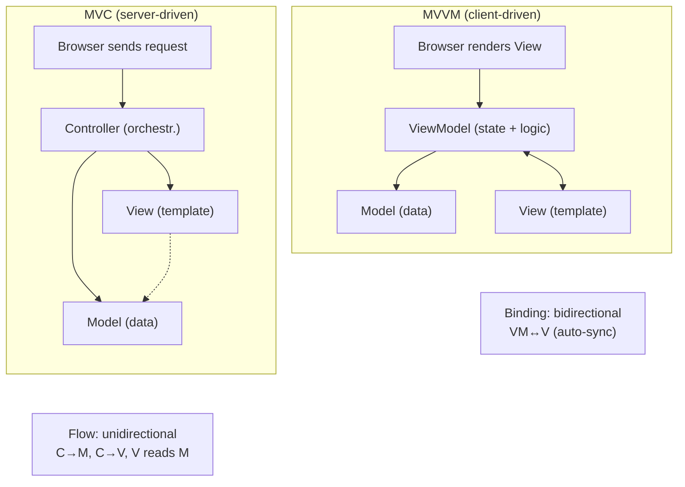

<section lang="en">

## Why Separation of Concerns Matters

Every web application starts the same way: a single PHP file that reads from `$_GET`, queries the database, loops over rows, and echoes HTML. It works for a week. Then the lecturer asks for a new filter on the enrolment list, and suddenly you are scrolling through 800 lines of intertwined SQL, HTML, and business logic trying not to break anything.

**Separation of concerns** is the practice of dividing code into distinct layers, each with a single responsibility. When the presentation layer changes (e.g., a new CSS framework), the business rules stay untouched. When a business rule changes (e.g., "maximum enrolment capacity is now 40 instead of 30"), the HTML templates do not need to be touched.

Two separation patterns dominate web development today:

| Pattern | Separation Axis | Most Common In |
|---|---|---|
| **MVC** (Model-View-Controller) | Three layers: data, presentation, request handling | Server-rendered frameworks (Laravel, Rails, Django, Spring) |
| **MVVM** (Model-View-ViewModel) | Two active layers + a data-binding bridge | Client-side frameworks (Vue, Angular, React with hooks) and XAML platforms |

This tutorial walks through both patterns using the same concrete domain — a student-course enrolment module — so you can compare them side by side and decide which fits your next project.

</section>

<section lang="id">

## Mengapa Separation of Concerns Itu Penting

Setiap aplikasi web dimulai dengan cara yang sama: satu file PHP yang membaca dari `$_GET`, menjalankan query database, melakukan loop pada baris, dan menampilkan HTML. Ini berfungsi selama satu minggu. Kemudian dosen meminta filter baru pada daftar pendaftaran, dan tiba-tiba Anda menggulir 800 baris SQL, HTML, dan logika bisnis yang saling terkait sambil berusaha tidak merusak apa pun.

**Separation of concerns** adalah praktik membagi kode menjadi lapisan-lapisan berbeda, masing-masing dengan satu tanggung jawab. Ketika lapisan presentasi berubah (misalnya, framework CSS baru), aturan bisnis tetap tidak tersentuh. Ketika aturan bisnis berubah (misalnya, "kapasitas maksimum pendaftaran sekarang 40, bukan 30"), template HTML tidak perlu disentuh.

Dua pola pemisahan mendominasi pengembangan web saat ini:

| Pola | Sumbu Pemisahan | Paling Umum Di |
|---|---|---|
| **MVC** (Model-View-Controller) | Tiga lapisan: data, presentasi, penanganan request | Framework server-rendered (Laravel, Rails, Django, Spring) |
| **MVVM** (Model-View-ViewModel) | Dua lapisan aktif + jembatan data-binding | Framework sisi klien (Vue, Angular, React dengan hooks) dan platform XAML |

Tutorial ini membahas kedua pola menggunakan domain konkret yang sama — modul pendaftaran mata kuliah — sehingga Anda dapat membandingkannya secara berdampingan dan memutuskan mana yang cocok untuk proyek Anda berikutnya.

</section>

<figure class="my-10 text-center" role="figure">

<figcaption class="mt-3 text-sm text-neutral-500">
  <span lang="en">Figure: Architectural comparison between MVC (server-driven) and MVVM (client-driven with data binding)</span>
  <span lang="id">Gambar: Perbandingan arsitektur antara MVC (server-driven) dan MVVM (client-driven dengan data binding)</span>
</figcaption>
</figure>

---

<section lang="en">

## What Is MVC? Model, View, Controller

MVC divides an application into three interconnected components. The **Model** owns the data and the business rules. The **View** renders the output — HTML, JSON, or a PDF. The **Controller** receives the HTTP request, asks the Model for data, and chooses which View to render.

The golden rule: **the Model never knows about the View or the Controller.** It is a pure PHP object that can run from a command line, a queue worker, or a test suite with zero knowledge of HTTP.

### A Spaghetti Enrolment Page (Before MVC)

Imagine `enrol.php` — a single file that does everything:

```php
<?php
// enrol.php — a single-file nightmare

$db = new PDO('mysql:host=localhost;dbname=campus', 'root', '');

$studentId = $_GET['student_id'] ?? null;
$courseId  = $_GET['course_id']  ?? null;

if (!$studentId || !$courseId) {
    echo '<p style="color:red;">Missing parameters.</p>';
    exit;
}

$stmt = $db->prepare('SELECT * FROM students WHERE id = ?');
$stmt->execute([$studentId]);
$student = $stmt->fetch();

$stmt = $db->prepare('SELECT * FROM courses WHERE id = ?');
$stmt->execute([$courseId]);
$course = $stmt->fetch();

if (!$student || !$course) {
    echo '<p style="color:red;">Student or course not found.</p>';
    exit;
}

$stmt = $db->prepare(
    'SELECT COUNT(*) FROM enrolments WHERE course_id = ? AND status = "confirmed"'
);
$stmt->execute([$courseId]);
$enrolmentCount = (int) $stmt->fetchColumn();

if ($enrolmentCount >= $course['max_capacity']) {
    echo '<p style="color:red;">Course is full.</p>';
    exit;
}

$stmt = $db->prepare(
    'SELECT COUNT(*) FROM enrolments WHERE student_id = ? AND course_id = ?'
);
$stmt->execute([$studentId, $courseId]);
if ($stmt->fetchColumn() > 0) {
    echo '<p style="color:red;">Already enrolled.</p>';
    exit;
}

$db->prepare(
    'INSERT INTO enrolments (student_id, course_id, status, created_at) VALUES (?, ?, "confirmed", NOW())'
)->execute([$studentId, $courseId]);

echo '<h1>Enrolment Confirmed</h1>';
echo '<p>' . htmlspecialchars($student['name']) . ' has been enrolled in '
    . htmlspecialchars($course['name']) . '.</p>';
echo '<a href="/courses.php">Back to courses</a>';
```

This file mixes SQL, business rules, HTML, and routing. Adding a REST API endpoint would mean copying the business logic into another file. Adding email notifications means injecting `mail()` calls between the INSERT and the echo. Changing the database from MySQL to PostgreSQL means touching every query.

### Refactoring Into MVC

Let us extract three layers from the spaghetti.

#### Model — Pure Business Logic

The Model is the heart. It knows the rules: a student cannot enrol twice in the same course, and a course cannot exceed its capacity.

```php
<?php

class Student
{
    public function __construct(
        public readonly int $id,
        public readonly string $name,
        public readonly string $nim,
    ) {}
}

class Course
{
    /** @param Course[] $prerequisites */
    public function __construct(
        public readonly int $id,
        public readonly string $name,
        public readonly int $maxCapacity,
        public readonly array $prerequisites = [],
    ) {}
}

class EnrolmentService
{
    public function __construct(
        private PDO $db
    ) {}

    public function enrol(Student $student, Course $course): EnrolmentResult
    {
        if ($this->alreadyEnrolled($student->id, $course->id)) {
            return new EnrolmentResult(false, 'Student is already enrolled in this course.');
        }

        if ($this->isFull($course)) {
            return new EnrolmentResult(false, 'Course has reached maximum capacity.');
        }

        $this->db->prepare(
            'INSERT INTO enrolments (student_id, course_id, status, created_at)
             VALUES (?, ?, "confirmed", NOW())'
        )->execute([$student->id, $course->id]);

        return new EnrolmentResult(true, 'Enrolment confirmed.');
    }

    private function alreadyEnrolled(int $studentId, int $courseId): bool
    {
        $stmt = $this->db->prepare(
            'SELECT COUNT(*) FROM enrolments WHERE student_id = ? AND course_id = ?'
        );
        $stmt->execute([$studentId, $courseId]);
        return $stmt->fetchColumn() > 0;
    }

    private function isFull(Course $course): bool
    {
        $stmt = $this->db->prepare(
            'SELECT COUNT(*) FROM enrolments WHERE course_id = ? AND status = "confirmed"'
        );
        $stmt->execute([$course->id]);
        return (int) $stmt->fetchColumn() >= $course->maxCapacity;
    }

    /** @return array<int, array<string, mixed>> */
    public function getEnrolmentsByStudent(int $studentId): array
    {
        $stmt = $this->db->prepare(
            'SELECT e.*, c.name AS course_name
             FROM enrolments e
             JOIN courses c ON c.id = e.course_id
             WHERE e.student_id = ?
             ORDER BY e.created_at DESC'
        );
        $stmt->execute([$studentId]);
        return $stmt->fetchAll(PDO::FETCH_ASSOC);
    }
}

class EnrolmentResult
{
    public function __construct(
        public readonly bool $success,
        public readonly string $message,
    ) {}
}
```

Notice: no HTML, no `$_GET`, no `echo`. The Model is a pure PHP class. You can unit-test `EnrolmentService::enrol()` without a browser — inject a SQLite in-memory PDO and assert that the second enrolment attempt returns `false`.

#### Controller — The Traffic Cop

The Controller translates HTTP concerns into domain calls and decides what View to return.

```php
<?php

class EnrolmentController
{
    public function __construct(
        private EnrolmentService $enrolmentService,
    ) {}

    public function create(): void
    {
        $studentId = (int) ($_GET['student_id'] ?? 0);
        $courseId  = (int) ($_GET['course_id']  ?? 0);

        if ($studentId === 0 || $courseId === 0) {
            $this->render('error', ['message' => 'Missing required parameters.']);
            return;
        }

        $student = $this->findStudent($studentId);
        $course  = $this->findCourse($courseId);

        if (!$student || !$course) {
            $this->render('error', ['message' => 'Student or course not found.']);
            return;
        }

        $result = $this->enrolmentService->enrol($student, $course);

        if (!$result->success) {
            $this->render('error', ['message' => $result->message]);
            return;
        }

        $this->render('enrolment-confirmed', [
            'studentName' => $student->name,
            'courseName'  => $course->name,
        ]);
    }

    public function list(): void
    {
        $studentId = (int) ($_GET['student_id'] ?? 0);

        if ($studentId === 0) {
            $this->render('error', ['message' => 'Missing student ID.']);
            return;
        }

        $enrolments = $this->enrolmentService->getEnrolmentsByStudent($studentId);

        $this->render('enrolment-list', [
            'enrolments' => $enrolments,
        ]);
    }

    private function render(string $view, array $data): void
    {
        extract($data);
        require __DIR__ . "/../views/{$view}.php";
    }

    private function findStudent(int $id): ?Student
    {
        $db = new PDO('mysql:host=localhost;dbname=campus', 'root', '');
        $stmt = $db->prepare('SELECT id, name, nim FROM students WHERE id = ?');
        $stmt->execute([$id]);
        $row = $stmt->fetch(PDO::FETCH_ASSOC);
        return $row ? new Student((int) $row['id'], $row['name'], $row['nim']) : null;
    }

    private function findCourse(int $id): ?Course
    {
        $db = new PDO('mysql:host=localhost;dbname=campus', 'root', '');
        $stmt = $db->prepare('SELECT id, name, max_capacity FROM courses WHERE id = ?');
        $stmt->execute([$id]);
        $row = $stmt->fetch(PDO::FETCH_ASSOC);
        return $row ? new Course((int) $row['id'], $row['name'], (int) $row['max_capacity']) : null;
    }
}
```

The Controller's responsibilities are narrow: validate input, call the Model, pass data to the View. If the team decides to add a REST API, you write a new `ApiEnrolmentController` that reuses the same `EnrolmentService` but returns JSON instead of rendering PHP templates.

#### View — Pure Presentation

```php
<!-- views/enrolment-confirmed.php -->
<!DOCTYPE html>
<html lang="en">
<head>
    <meta charset="UTF-8">
    <title>Enrolment Confirmed</title>
    <link rel="stylesheet" href="/css/app.css">
</head>
<body>
    <main>
        <h1>Enrolment Confirmed</h1>
        <p>
            <strong><?= htmlspecialchars($studentName) ?></strong>
            has been enrolled in
            <strong><?= htmlspecialchars($courseName) ?></strong>.
        </p>
        <a href="/courses.php">Back to courses</a>
    </main>
</body>
</html>
```

You can hand this file to a designer who knows zero PHP beyond `<?= $var ?>`. They can restyle the entire page without touching a line of business logic.

### MVC in Laravel

Laravel bakes MVC into its structure. Here is the same enrolment module in idiomatic Laravel 11:

**Model (Eloquent + business logic via a Service class):**

```php
<?php

// app/Models/Student.php
namespace App\Models;

use Illuminate\Database\Eloquent\Model;
use Illuminate\Database\Eloquent\Relations\HasMany;

class Student extends Model
{
    protected $fillable = ['name', 'nim'];

    public function enrolments(): HasMany
    {
        return $this->hasMany(Enrolment::class);
    }
}
```

```php
<?php

// app/Models/Course.php
namespace App\Models;

use Illuminate\Database\Eloquent\Model;

class Course extends Model
{
    protected $fillable = ['name', 'code', 'max_capacity'];

    public function isFull(): bool
    {
        return $this->enrolments()->confirmed()->count() >= $this->max_capacity;
    }

    public function enrolments()
    {
        return $this->hasMany(Enrolment::class);
    }
}
```

```php
<?php

// app/Models/Enrolment.php
namespace App\Models;

use Illuminate\Database\Eloquent\Model;
use Illuminate\Database\Eloquent\Builder;

class Enrolment extends Model
{
    protected $fillable = ['student_id', 'course_id', 'status'];

    public function scopeConfirmed(Builder $query): Builder
    {
        return $query->where('status', 'confirmed');
    }

    public function student()
    {
        return $this->belongsTo(Student::class);
    }

    public function course()
    {
        return $this->belongsTo(Course::class);
    }
}
```

```php
<?php

// app/Services/EnrolmentService.php
namespace App\Services;

use App\Models\Student;
use App\Models\Course;
use App\Models\Enrolment;
use DomainException;

class EnrolmentService
{
    public function enrol(Student $student, Course $course): Enrolment
    {
        if ($student->enrolments()->where('course_id', $course->id)->exists()) {
            throw new DomainException('Student is already enrolled in this course.');
        }

        if ($course->isFull()) {
            throw new DomainException('Course has reached maximum capacity.');
        }

        return Enrolment::create([
            'student_id' => $student->id,
            'course_id'  => $course->id,
            'status'     => 'confirmed',
        ]);
    }
}
```

**Controller (thin — delegates to the Service):**

```php
<?php

// app/Http/Controllers/EnrolmentController.php
namespace App\Http\Controllers;

use App\Models\Student;
use App\Models\Course;
use App\Services\EnrolmentService;
use Illuminate\Http\RedirectResponse;
use Illuminate\Http\Request;
use Illuminate\View\View;

class EnrolmentController extends Controller
{
    public function __construct(
        private EnrolmentService $enrolmentService
    ) {}

    public function create(Request $request): RedirectResponse
    {
        $validated = $request->validate([
            'student_id' => 'required|exists:students,id',
            'course_id'  => 'required|exists:courses,id',
        ]);

        $student = Student::findOrFail($validated['student_id']);
        $course  = Course::findOrFail($validated['course_id']);

        try {
            $enrolment = $this->enrolmentService->enrol($student, $course);
        } catch (DomainException $e) {
            return back()->with('error', $e->getMessage());
        }

        return redirect()
            ->route('enrolments.index')
            ->with('success', "{$student->name} enrolled in {$course->name}.");
    }

    public function index(Request $request): View
    {
        $student = Student::with('enrolments.course')->findOrFail($request->student_id);

        return view('enrolments.list', [
            'student'    => $student,
            'enrolments' => $student->enrolments,
        ]);
    }
}
```

**View (Blade template):**

```blade
{{-- resources/views/enrolments/list.blade.php --}}
@extends('layouts.app')

@section('title', 'My Enrolments')

@section('content')
    <h1>Enrolments for {{ $student->name }}</h1>

    @if (session('success'))
        <div class="alert alert-success">{{ session('success') }}</div>
    @endif

    @if ($enrolments->isEmpty())
        <p>No enrolments yet.</p>
    @else
        <table>
            <thead>
                <tr>
                    <th>Course</th>
                    <th>Status</th>
                    <th>Date</th>
                </tr>
            </thead>
            <tbody>
                @foreach ($enrolments as $enrolment)
                    <tr>
                        <td>{{ $enrolment->course->name }}</td>
                        <td>{{ $enrolment->status }}</td>
                        <td>{{ $enrolment->created_at->format('d M Y') }}</td>
                    </tr>
                @endforeach
            </tbody>
        </table>
    @endif
@endsection
```

The Laravel router connects URL to Controller:

```php
// routes/web.php
Route::get('/enrolments', [EnrolmentController::class, 'index'])->name('enrolments.index');
Route::post('/enrolments', [EnrolmentController::class, 'create'])->name('enrolments.create');
```

**What MVC gives you:**
- The designer edits `enrolments/list.blade.php` without fear of breaking enrolment rules.
- The back-end developer adds a `cancel()` method to `EnrolmentService` and a new Controller action — the View stays unchanged.
- You write a unit test for `EnrolmentService` that runs in milliseconds, no HTTP server needed.

</section>

<section lang="id">

## Apa Itu MVC? Model, View, Controller

MVC membagi aplikasi menjadi tiga komponen yang saling terhubung. **Model** memiliki data dan aturan bisnis. **View** merender output — HTML, JSON, atau PDF. **Controller** menerima HTTP request, meminta data dari Model, dan memilih View mana yang akan dirender.

Aturan emas: **Model tidak pernah tahu tentang View atau Controller.** Ia adalah objek PHP murni yang dapat dijalankan dari command line, queue worker, atau test suite tanpa pengetahuan tentang HTTP.

### Halaman Pendaftaran Spaghetti (Sebelum MVC)

Bayangkan `enrol.php` — satu file yang melakukan segalanya:

```php
<?php
// enrol.php — nightmare satu file

$db = new PDO('mysql:host=localhost;dbname=campus', 'root', '');

$studentId = $_GET['student_id'] ?? null;
$courseId  = $_GET['course_id']  ?? null;

if (!$studentId || !$courseId) {
    echo '<p style="color:red;">Parameter tidak lengkap.</p>';
    exit;
}

$stmt = $db->prepare('SELECT * FROM students WHERE id = ?');
$stmt->execute([$studentId]);
$student = $stmt->fetch();

$stmt = $db->prepare('SELECT * FROM courses WHERE id = ?');
$stmt->execute([$courseId]);
$course = $stmt->fetch();

if (!$student || !$course) {
    echo '<p style="color:red;">Mahasiswa atau mata kuliah tidak ditemukan.</p>';
    exit;
}

$stmt = $db->prepare(
    'SELECT COUNT(*) FROM enrolments WHERE course_id = ? AND status = "confirmed"'
);
$stmt->execute([$courseId]);
$enrolmentCount = (int) $stmt->fetchColumn();

if ($enrolmentCount >= $course['max_capacity']) {
    echo '<p style="color:red;">Mata kuliah penuh.</p>';
    exit;
}

$stmt = $db->prepare(
    'SELECT COUNT(*) FROM enrolments WHERE student_id = ? AND course_id = ?'
);
$stmt->execute([$studentId, $courseId]);
if ($stmt->fetchColumn() > 0) {
    echo '<p style="color:red;">Sudah terdaftar.</p>';
    exit;
}

$db->prepare(
    'INSERT INTO enrolments (student_id, course_id, status, created_at) VALUES (?, ?, "confirmed", NOW())'
)->execute([$studentId, $courseId]);

echo '<h1>Pendaftaran Dikonfirmasi</h1>';
echo '<p>' . htmlspecialchars($student['name']) . ' telah terdaftar di '
    . htmlspecialchars($course['name']) . '.</p>';
echo '<a href="/courses.php">Kembali ke daftar mata kuliah</a>';
```

File ini mencampur SQL, aturan bisnis, HTML, dan routing. Menambahkan endpoint REST API berarti menyalin logika bisnis ke file lain. Menambahkan notifikasi email berarti menyuntikkan panggilan `mail()` di antara INSERT dan echo. Mengganti database dari MySQL ke PostgreSQL berarti menyentuh setiap query.

### Refactoring Menjadi MVC

Mari kita ekstrak tiga lapisan dari spaghetti.

#### Model — Logika Bisnis Murni

Model adalah jantungnya. Ia mengetahui aturan: mahasiswa tidak dapat mendaftar dua kali di mata kuliah yang sama, dan mata kuliah tidak dapat melebihi kapasitasnya.

```php
<?php

class Student
{
    public function __construct(
        public readonly int $id,
        public readonly string $name,
        public readonly string $nim,
    ) {}
}

class Course
{
    /** @param Course[] $prerequisites */
    public function __construct(
        public readonly int $id,
        public readonly string $name,
        public readonly int $maxCapacity,
        public readonly array $prerequisites = [],
    ) {}
}

class EnrolmentService
{
    public function __construct(
        private PDO $db
    ) {}

    public function enrol(Student $student, Course $course): EnrolmentResult
    {
        if ($this->alreadyEnrolled($student->id, $course->id)) {
            return new EnrolmentResult(false, 'Mahasiswa sudah terdaftar di mata kuliah ini.');
        }

        if ($this->isFull($course)) {
            return new EnrolmentResult(false, 'Mata kuliah telah mencapai kapasitas maksimum.');
        }

        $this->db->prepare(
            'INSERT INTO enrolments (student_id, course_id, status, created_at)
             VALUES (?, ?, "confirmed", NOW())'
        )->execute([$student->id, $course->id]);

        return new EnrolmentResult(true, 'Pendaftaran dikonfirmasi.');
    }

    private function alreadyEnrolled(int $studentId, int $courseId): bool
    {
        $stmt = $this->db->prepare(
            'SELECT COUNT(*) FROM enrolments WHERE student_id = ? AND course_id = ?'
        );
        $stmt->execute([$studentId, $courseId]);
        return $stmt->fetchColumn() > 0;
    }

    private function isFull(Course $course): bool
    {
        $stmt = $this->db->prepare(
            'SELECT COUNT(*) FROM enrolments WHERE course_id = ? AND status = "confirmed"'
        );
        $stmt->execute([$course->id]);
        return (int) $stmt->fetchColumn() >= $course->maxCapacity;
    }

    /** @return array<int, array<string, mixed>> */
    public function getEnrolmentsByStudent(int $studentId): array
    {
        $stmt = $this->db->prepare(
            'SELECT e.*, c.name AS course_name
             FROM enrolments e
             JOIN courses c ON c.id = e.course_id
             WHERE e.student_id = ?
             ORDER BY e.created_at DESC'
        );
        $stmt->execute([$studentId]);
        return $stmt->fetchAll(PDO::FETCH_ASSOC);
    }
}

class EnrolmentResult
{
    public function __construct(
        public readonly bool $success,
        public readonly string $message,
    ) {}
}
```

Perhatikan: tidak ada HTML, tidak ada `$_GET`, tidak ada `echo`. Model adalah kelas PHP murni. Anda dapat melakukan unit-test `EnrolmentService::enrol()` tanpa browser — injeksi PDO SQLite in-memory dan asertikan bahwa percobaan pendaftaran kedua mengembalikan `false`.

#### Controller — Polisi Lalu Lintas

Controller menerjemahkan urusan HTTP menjadi panggilan domain dan memutuskan View apa yang akan dikembalikan.

```php
<?php

class EnrolmentController
{
    public function __construct(
        private EnrolmentService $enrolmentService,
    ) {}

    public function create(): void
    {
        $studentId = (int) ($_GET['student_id'] ?? 0);
        $courseId  = (int) ($_GET['course_id']  ?? 0);

        if ($studentId === 0 || $courseId === 0) {
            $this->render('error', ['message' => 'Parameter yang diperlukan tidak lengkap.']);
            return;
        }

        $student = $this->findStudent($studentId);
        $course  = $this->findCourse($courseId);

        if (!$student || !$course) {
            $this->render('error', ['message' => 'Mahasiswa atau mata kuliah tidak ditemukan.']);
            return;
        }

        $result = $this->enrolmentService->enrol($student, $course);

        if (!$result->success) {
            $this->render('error', ['message' => $result->message]);
            return;
        }

        $this->render('enrolment-confirmed', [
            'studentName' => $student->name,
            'courseName'  => $course->name,
        ]);
    }

    public function list(): void
    {
        $studentId = (int) ($_GET['student_id'] ?? 0);

        if ($studentId === 0) {
            $this->render('error', ['message' => 'ID mahasiswa tidak ada.']);
            return;
        }

        $enrolments = $this->enrolmentService->getEnrolmentsByStudent($studentId);

        $this->render('enrolment-list', [
            'enrolments' => $enrolments,
        ]);
    }

    private function render(string $view, array $data): void
    {
        extract($data);
        require __DIR__ . "/../views/{$view}.php";
    }

    private function findStudent(int $id): ?Student
    {
        $db = new PDO('mysql:host=localhost;dbname=campus', 'root', '');
        $stmt = $db->prepare('SELECT id, name, nim FROM students WHERE id = ?');
        $stmt->execute([$id]);
        $row = $stmt->fetch(PDO::FETCH_ASSOC);
        return $row ? new Student((int) $row['id'], $row['name'], $row['nim']) : null;
    }

    private function findCourse(int $id): ?Course
    {
        $db = new PDO('mysql:host=localhost;dbname=campus', 'root', '');
        $stmt = $db->prepare('SELECT id, name, max_capacity FROM courses WHERE id = ?');
        $stmt->execute([$id]);
        $row = $stmt->fetch(PDO::FETCH_ASSOC);
        return $row ? new Course((int) $row['id'], $row['name'], (int) $row['max_capacity']) : null;
    }
}
```

Tanggung jawab Controller sempit: validasi input, panggil Model, teruskan data ke View. Jika tim memutuskan untuk menambahkan REST API, Anda menulis `ApiEnrolmentController` baru yang menggunakan kembali `EnrolmentService` yang sama tetapi mengembalikan JSON alih-alih merender template PHP.

#### View — Presentasi Murni

```php
<!-- views/enrolment-confirmed.php -->
<!DOCTYPE html>
<html lang="id">
<head>
    <meta charset="UTF-8">
    <title>Pendaftaran Dikonfirmasi</title>
    <link rel="stylesheet" href="/css/app.css">
</head>
<body>
    <main>
        <h1>Pendaftaran Dikonfirmasi</h1>
        <p>
            <strong><?= htmlspecialchars($studentName) ?></strong>
            telah terdaftar di
            <strong><?= htmlspecialchars($courseName) ?></strong>.
        </p>
        <a href="/courses.php">Kembali ke daftar mata kuliah</a>
    </main>
</body>
</html>
```

Anda dapat menyerahkan file ini kepada desainer yang hanya tahu PHP sebatas `<?= $var ?>`. Mereka dapat mengubah gaya seluruh halaman tanpa menyentuh satu baris logika bisnis pun.

### MVC di Laravel

Laravel memanggang MVC ke dalam strukturnya. Berikut modul pendaftaran yang sama dalam Laravel 11 idiomatik:

**Model (Eloquent + logika bisnis melalui kelas Service):**

```php
<?php

// app/Models/Student.php
namespace App\Models;

use Illuminate\Database\Eloquent\Model;
use Illuminate\Database\Eloquent\Relations\HasMany;

class Student extends Model
{
    protected $fillable = ['name', 'nim'];

    public function enrolments(): HasMany
    {
        return $this->hasMany(Enrolment::class);
    }
}
```

```php
<?php

// app/Models/Course.php
namespace App\Models;

use Illuminate\Database\Eloquent\Model;

class Course extends Model
{
    protected $fillable = ['name', 'code', 'max_capacity'];

    public function isFull(): bool
    {
        return $this->enrolments()->confirmed()->count() >= $this->max_capacity;
    }

    public function enrolments()
    {
        return $this->hasMany(Enrolment::class);
    }
}
```

```php
<?php

// app/Models/Enrolment.php
namespace App\Models;

use Illuminate\Database\Eloquent\Model;
use Illuminate\Database\Eloquent\Builder;

class Enrolment extends Model
{
    protected $fillable = ['student_id', 'course_id', 'status'];

    public function scopeConfirmed(Builder $query): Builder
    {
        return $query->where('status', 'confirmed');
    }

    public function student()
    {
        return $this->belongsTo(Student::class);
    }

    public function course()
    {
        return $this->belongsTo(Course::class);
    }
}
```

```php
<?php

// app/Services/EnrolmentService.php
namespace App\Services;

use App\Models\Student;
use App\Models\Course;
use App\Models\Enrolment;
use DomainException;

class EnrolmentService
{
    public function enrol(Student $student, Course $course): Enrolment
    {
        if ($student->enrolments()->where('course_id', $course->id)->exists()) {
            throw new DomainException('Mahasiswa sudah terdaftar di mata kuliah ini.');
        }

        if ($course->isFull()) {
            throw new DomainException('Mata kuliah telah mencapai kapasitas maksimum.');
        }

        return Enrolment::create([
            'student_id' => $student->id,
            'course_id'  => $course->id,
            'status'     => 'confirmed',
        ]);
    }
}
```

**Controller (tipis — mendelegasikan ke Service):**

```php
<?php

// app/Http/Controllers/EnrolmentController.php
namespace App\Http\Controllers;

use App\Models\Student;
use App\Models\Course;
use App\Services\EnrolmentService;
use Illuminate\Http\RedirectResponse;
use Illuminate\Http\Request;
use Illuminate\View\View;

class EnrolmentController extends Controller
{
    public function __construct(
        private EnrolmentService $enrolmentService
    ) {}

    public function create(Request $request): RedirectResponse
    {
        $validated = $request->validate([
            'student_id' => 'required|exists:students,id',
            'course_id'  => 'required|exists:courses,id',
        ]);

        $student = Student::findOrFail($validated['student_id']);
        $course  = Course::findOrFail($validated['course_id']);

        try {
            $enrolment = $this->enrolmentService->enrol($student, $course);
        } catch (DomainException $e) {
            return back()->with('error', $e->getMessage());
        }

        return redirect()
            ->route('enrolments.index')
            ->with('success', "{$student->name} terdaftar di {$course->name}.");
    }

    public function index(Request $request): View
    {
        $student = Student::with('enrolments.course')->findOrFail($request->student_id);

        return view('enrolments.list', [
            'student'    => $student,
            'enrolments' => $student->enrolments,
        ]);
    }
}
```

**View (Blade template):**

```blade
{{-- resources/views/enrolments/list.blade.php --}}
@extends('layouts.app')

@section('title', 'Pendaftaran Saya')

@section('content')
    <h1>Pendaftaran untuk {{ $student->name }}</h1>

    @if (session('success'))
        <div class="alert alert-success">{{ session('success') }}</div>
    @endif

    @if ($enrolments->isEmpty())
        <p>Belum ada pendaftaran.</p>
    @else
        <table>
            <thead>
                <tr>
                    <th>Mata Kuliah</th>
                    <th>Status</th>
                    <th>Tanggal</th>
                </tr>
            </thead>
            <tbody>
                @foreach ($enrolments as $enrolment)
                    <tr>
                        <td>{{ $enrolment->course->name }}</td>
                        <td>{{ $enrolment->status }}</td>
                        <td>{{ $enrolment->created_at->format('d M Y') }}</td>
                    </tr>
                @endforeach
            </tbody>
        </table>
    @endif
@endsection
```

Router Laravel menghubungkan URL ke Controller:

```php
// routes/web.php
Route::get('/enrolments', [EnrolmentController::class, 'index'])->name('enrolments.index');
Route::post('/enrolments', [EnrolmentController::class, 'create'])->name('enrolments.create');
```

**Apa yang diberikan MVC kepada Anda:**
- Desainer mengedit `enrolments/list.blade.php` tanpa takut merusak aturan pendaftaran.
- Back-end developer menambahkan metode `cancel()` ke `EnrolmentService` dan aksi Controller baru — View tetap tidak berubah.
- Anda menulis unit test untuk `EnrolmentService` yang berjalan dalam milidetik, tanpa memerlukan server HTTP.

</section>

---

<section lang="en">

## What Is MVVM? Model, View, ViewModel

MVVM was introduced by Microsoft for WPF/Silverlight and later adopted by client-side JavaScript frameworks. The key difference from MVC is the **ViewModel** — a layer that sits between the Model and the View, exposing data and commands in a way the View can bind to directly.

| Role | MVC | MVVM |
|---|---|---|
| **Model** | Data + business rules (same in both) | Data + business rules (same in both) |
| **View** | Passive template; rendered by Controller | Active UI; binds to ViewModel, re-renders on state change |
| **Controller / ViewModel** | Controller receives HTTP requests, calls Model, picks View | ViewModel exposes reactive state + methods; no HTTP awareness |

The ViewModel does **not** know about the DOM. It exposes plain JavaScript/PHP objects and methods. The framework's data-binding system keeps the View in sync automatically.

### MVVM with a PHP Backend and Vue.js Frontend

The PHP/Laravel backend serves a REST API (or uses Inertia.js for server-driven SPA). The Vue.js frontend consumes the API and manages UI state through a ViewModel.

#### Backend: Laravel API (Model stays the same)

```php
<?php

// routes/api.php
use App\Http\Controllers\Api\EnrolmentApiController;

Route::get('/students/{student}/enrolments', [EnrolmentApiController::class, 'index']);
Route::post('/enrolments', [EnrolmentApiController::class, 'store']);
Route::delete('/enrolments/{enrolment}', [EnrolmentApiController::class, 'destroy']);
```

```php
<?php

// app/Http/Controllers/Api/EnrolmentApiController.php
namespace App\Http\Controllers\Api;

use App\Http\Controllers\Controller;
use App\Http\Resources\EnrolmentResource;
use App\Models\Student;
use App\Models\Course;
use App\Services\EnrolmentService;
use DomainException;
use Illuminate\Http\JsonResponse;
use Illuminate\Http\Request;

class EnrolmentApiController extends Controller
{
    public function __construct(
        private EnrolmentService $enrolmentService
    ) {}

    public function store(Request $request): JsonResponse
    {
        $validated = $request->validate([
            'student_id' => 'required|exists:students,id',
            'course_id'  => 'required|exists:courses,id',
        ]);

        try {
            $enrolment = $this->enrolmentService->enrol(
                Student::findOrFail($validated['student_id']),
                Course::findOrFail($validated['course_id'])
            );
        } catch (DomainException $e) {
            return response()->json(['message' => $e->getMessage()], 422);
        }

        return (new EnrolmentResource($enrolment))
            ->response()
            ->setStatusCode(201);
    }

    public function index(Student $student): JsonResponse
    {
        $enrolments = $student->enrolments()->with('course')->latest()->get();

        return EnrolmentResource::collection($enrolments)->response();
    }
}
```

```php
<?php

// app/Http/Resources/EnrolmentResource.php
namespace App\Http\Resources;

use Illuminate\Http\Request;
use Illuminate\Http\Resources\Json\JsonResource;

class EnrolmentResource extends JsonResource
{
    /** @return array<string, mixed> */
    public function toArray(Request $request): array
    {
        return [
            'id'         => $this->id,
            'status'     => $this->status,
            'created_at' => $this->created_at->toIso8601String(),
            'course'     => [
                'id'   => $this->course->id,
                'name' => $this->course->name,
                'code' => $this->course->code,
            ],
        ];
    }
}
```

The backend is **exactly the same `EnrolmentService`** from the MVC version. The only differences are a JSON API controller and API resource classes. The Model does not change.

#### Frontend: Vue 3 ViewModel (Composition API)

The Vue component acts as the ViewModel. It holds reactive state (`ref`, `reactive`), exposes computed properties, and defines methods that the template binds to.

```vue
<template>
  <div class="enrolment-manager">
    <h1>Enrolments for {{ student.name }}</h1>

    <!-- Success / error feedback -->
    <div v-if="feedback.message" :class="feedback.type">
      {{ feedback.message }}
    </div>

    <!-- Course selector -->
    <div class="enrolment-form">
      <select v-model="selectedCourseId">
        <option :value="null" disabled>Select a course...</option>
        <option
          v-for="course in availableCourses"
          :key="course.id"
          :value="course.id"
          :disabled="isAlreadyEnrolled(course.id) || isCourseFull(course)"
        >
          {{ course.name }} ({{ course.code }})
          <template v-if="isCourseFull(course)">— Full</template>
          <template v-else-if="isAlreadyEnrolled(course.id)">— Enrolled</template>
        </option>
      </select>

      <button
        @click="enrol"
        :disabled="!selectedCourseId || submitting"
      >
        {{ submitting ? 'Enrolling...' : 'Enrol' }}
      </button>
    </div>

    <!-- Enrolment list -->
    <table v-if="enrolments.length">
      <thead>
        <tr>
          <th>Course</th>
          <th>Status</th>
          <th>Date</th>
          <th></th>
        </tr>
      </thead>
      <tbody>
        <tr v-for="e in enrolments" :key="e.id">
          <td>{{ e.course.name }}</td>
          <td>
            <span :class="'status-' + e.status">{{ e.status }}</span>
          </td>
          <td>{{ formatDate(e.created_at) }}</td>
          <td>
            <button @click="cancelEnrolment(e.id)" v-if="e.status === 'confirmed'">
              Cancel
            </button>
          </td>
        </tr>
      </tbody>
    </table>

    <p v-else>No enrolments yet.</p>
  </div>
</template>

<script setup>
import { ref, computed, onMounted } from 'vue'

// ─── Props (data passed from the parent/server) ───
const props = defineProps({
  student: { type: Object, required: true },
})

// ─── Reactive state (the ViewModel) ───
const enrolments = ref([])
const availableCourses = ref([])
const selectedCourseId = ref(null)
const submitting = ref(false)
const feedback = ref({ message: '', type: '' })

// ─── Computed properties ───
const isAlreadyEnrolled = (courseId) => {
  return enrolments.value.some(e => e.course.id === courseId)
}

const isCourseFull = (course) => {
  const confirmedCount = enrolments.value.filter(
    e => e.course.id === course.id && e.status === 'confirmed'
  ).length
  return confirmedCount >= course.max_capacity
}

// ─── Methods (actions the View can trigger) ───
const fetchEnrolments = async () => {
  const res = await fetch(`/api/students/${props.student.id}/enrolments`)
  const data = await res.json()
  enrolments.value = data.data
}

const fetchCourses = async () => {
  const res = await fetch('/api/courses')
  const data = await res.json()
  availableCourses.value = data.data
}

const enrol = async () => {
  submitting.value = true
  feedback.value = { message: '', type: '' }

  try {
    const res = await fetch('/api/enrolments', {
      method: 'POST',
      headers: { 'Content-Type': 'application/json', 'Accept': 'application/json' },
      body: JSON.stringify({
        student_id: props.student.id,
        course_id: selectedCourseId.value,
      }),
    })

    const data = await res.json()

    if (!res.ok) {
      feedback.value = { message: data.message, type: 'error' }
      return
    }

    enrolments.value.push(data.data)
    selectedCourseId.value = null
    feedback.value = { message: 'Enrolment confirmed.', type: 'success' }
  } finally {
    submitting.value = false
  }
}

const cancelEnrolment = async (enrolmentId) => {
  const res = await fetch(`/api/enrolments/${enrolmentId}`, { method: 'DELETE' })
  if (res.ok) {
    enrolments.value = enrolments.value.filter(e => e.id !== enrolmentId)
  }
}

const formatDate = (iso) => new Date(iso).toLocaleDateString('en-GB', {
  day: '2-digit', month: 'short', year: 'numeric'
})

// ─── Lifecycle: fetch data when component mounts ───
onMounted(() => {
  fetchEnrolments()
  fetchCourses()
})
</script>
```

### How MVVM Binding Works Here

1. `enrolments` is a `ref([])` — Vue tracks every change to this array.
2. The template uses `v-for="e in enrolments"`. When `enrolments.value.push(...)` runs inside `enrol()`, Vue detects the mutation and re-renders the table row **automatically**.
3. `selectedCourseId` is bound to the `<select>` via `v-model`. When the user picks a course, Vue updates the variable and re-evaluates the `:disabled` bindings.
4. `submitting` disables the button while the API call is in flight — set to `true`, Vue adds the `disabled` attribute; set to `false`, Vue removes it.

The ViewModel never touches `document.querySelector()` or `innerHTML`. All DOM manipulation is declarative.

### Alternative: Laravel Livewire (MVVM on the Server)

Laravel Livewire brings the MVVM reactivity model to the server side, eliminating the need for a separate JavaScript frontend:

```php
<?php

// app/Livewire/EnrolmentManager.php
namespace App\Livewire;

use App\Models\Student;
use App\Models\Course;
use App\Models\Enrolment;
use App\Services\EnrolmentService;
use Livewire\Component;

class EnrolmentManager extends Component
{
    public Student $student;

    public ?int $selectedCourseId = null;

    public bool $submitting = false;

    public string $feedbackMessage = '';

    public string $feedbackType = '';

    public function enrol(EnrolmentService $service): void
    {
        $this->submitting = true;
        $this->feedbackMessage = '';

        if (!$this->selectedCourseId) {
            $this->feedbackMessage = 'Please select a course.';
            $this->feedbackType = 'error';
            $this->submitting = false;
            return;
        }

        try {
            $service->enrol(
                $this->student,
                Course::findOrFail($this->selectedCourseId)
            );
        } catch (\DomainException $e) {
            $this->feedbackMessage = $e->getMessage();
            $this->feedbackType = 'error';
            $this->submitting = false;
            return;
        }

        $this->selectedCourseId = null;
        $this->feedbackMessage = 'Enrolment confirmed.';
        $this->feedbackType = 'success';
        $this->submitting = false;
    }

    public function cancel(int $enrolmentId): void
    {
        Enrolment::findOrFail($enrolmentId)->delete();
    }

    public function render()
    {
        $enrolments = $this->student->enrolments()->with('course')->latest()->get();
        $courses = Course::withCount(['enrolments as confirmed_count' => fn ($q) =>
            $q->where('status', 'confirmed')
        ])->get();

        return view('livewire.enrolment-manager', [
            'enrolments' => $enrolments,
            'courses'    => $courses,
        ]);
    }
}
```

```blade
{{-- resources/views/livewire/enrolment-manager.blade.php --}}
<div>
    <h1>Enrolments for {{ $student->name }}</h1>

    @if ($feedbackMessage)
        <div class="{{ $feedbackType === 'error' ? 'alert-error' : 'alert-success' }}">
            {{ $feedbackMessage }}
        </div>
    @endif

    <div>
        <select wire:model="selectedCourseId">
            <option value="">Select a course...</option>
            @foreach ($courses as $course)
                <option value="{{ $course->id }}"
                    disabled="{{ $student->enrolments->contains('course_id', $course->id) || $course->confirmed_count >= $course->max_capacity }}">
                    {{ $course->name }} ({{ $course->code }})
                </option>
            @endforeach
        </select>

        <button wire:click="enrol" wire:loading.attr="disabled">
            <span wire:loading.remove>Enrol</span>
            <span wire:loading>Enrolling...</span>
        </button>
    </div>

    <table>
        <thead>
            <tr>
                <th>Course</th>
                <th>Status</th>
                <th>Date</th>
                <th></th>
            </tr>
        </thead>
        <tbody>
            @foreach ($enrolments as $enrolment)
                <tr>
                    <td>{{ $enrolment->course->name }}</td>
                    <td>{{ $enrolment->status }}</td>
                    <td>{{ $enrolment->created_at->format('d M Y') }}</td>
                    <td>
                        @if ($enrolment->status === 'confirmed')
                            <button wire:click="cancel({{ $enrolment->id }})">Cancel</button>
                        @endif
                    </td>
                </tr>
            @endforeach
        </tbody>
    </table>
</div>
```

Livewire tracks `wire:model` bindings and `wire:click` handlers, re-rendering the component on the server after each interaction and sending only the changed HTML to the browser. The mental model is MVVM — but the ViewModel lives on the server, not in the browser.

</section>

<section lang="id">

## Apa Itu MVVM? Model, View, ViewModel

MVVM diperkenalkan oleh Microsoft untuk WPF/Silverlight dan kemudian diadopsi oleh framework JavaScript sisi klien. Perbedaan utama dari MVC adalah **ViewModel** — lapisan yang berada di antara Model dan View, mengekspos data dan perintah dengan cara yang dapat diikat langsung oleh View.

| Peran | MVC | MVVM |
|---|---|---|
| **Model** | Data + aturan bisnis (sama di keduanya) | Data + aturan bisnis (sama di keduanya) |
| **View** | Template pasif; dirender oleh Controller | UI aktif; mengikat ke ViewModel, me-render ulang saat state berubah |
| **Controller / ViewModel** | Controller menerima HTTP request, memanggil Model, memilih View | ViewModel mengekspos state reaktif + metode; tidak sadar HTTP |

ViewModel **tidak** tahu tentang DOM. Ia mengekspos objek dan metode JavaScript/PHP biasa. Sistem data-binding framework menjaga View tetap sinkron secara otomatis.

### MVVM dengan Backend PHP dan Frontend Vue.js

Backend PHP/Laravel menyajikan REST API (atau menggunakan Inertia.js untuk SPA berbasis server). Frontend Vue.js mengonsumsi API dan mengelola state UI melalui ViewModel.

#### Backend: Laravel API (Model tetap sama)

```php
<?php

// routes/api.php
use App\Http\Controllers\Api\EnrolmentApiController;

Route::get('/students/{student}/enrolments', [EnrolmentApiController::class, 'index']);
Route::post('/enrolments', [EnrolmentApiController::class, 'store']);
Route::delete('/enrolments/{enrolment}', [EnrolmentApiController::class, 'destroy']);
```

```php
<?php

// app/Http/Controllers/Api/EnrolmentApiController.php
namespace App\Http\Controllers\Api;

use App\Http\Controllers\Controller;
use App\Http\Resources\EnrolmentResource;
use App\Models\Student;
use App\Models\Course;
use App\Services\EnrolmentService;
use DomainException;
use Illuminate\Http\JsonResponse;
use Illuminate\Http\Request;

class EnrolmentApiController extends Controller
{
    public function __construct(
        private EnrolmentService $enrolmentService
    ) {}

    public function store(Request $request): JsonResponse
    {
        $validated = $request->validate([
            'student_id' => 'required|exists:students,id',
            'course_id'  => 'required|exists:courses,id',
        ]);

        try {
            $enrolment = $this->enrolmentService->enrol(
                Student::findOrFail($validated['student_id']),
                Course::findOrFail($validated['course_id'])
            );
        } catch (DomainException $e) {
            return response()->json(['message' => $e->getMessage()], 422);
        }

        return (new EnrolmentResource($enrolment))
            ->response()
            ->setStatusCode(201);
    }

    public function index(Student $student): JsonResponse
    {
        $enrolments = $student->enrolments()->with('course')->latest()->get();

        return EnrolmentResource::collection($enrolments)->response();
    }
}
```

```php
<?php

// app/Http/Resources/EnrolmentResource.php
namespace App\Http\Resources;

use Illuminate\Http\Request;
use Illuminate\Http\Resources\Json\JsonResource;

class EnrolmentResource extends JsonResource
{
    /** @return array<string, mixed> */
    public function toArray(Request $request): array
    {
        return [
            'id'         => $this->id,
            'status'     => $this->status,
            'created_at' => $this->created_at->toIso8601String(),
            'course'     => [
                'id'   => $this->course->id,
                'name' => $this->course->name,
                'code' => $this->course->code,
            ],
        ];
    }
}
```

Backend menggunakan **`EnrolmentService` yang persis sama** dari versi MVC. Satu-satunya perbedaan adalah API controller JSON dan kelas API resource. Model tidak berubah.

#### Frontend: Vue 3 ViewModel (Composition API)

Komponen Vue bertindak sebagai ViewModel. Ia menyimpan state reaktif (`ref`, `reactive`), mengekspos computed property, dan mendefinisikan metode yang diikat oleh template.

```vue
<template>
  <div class="enrolment-manager">
    <h1>Pendaftaran untuk {{ student.name }}</h1>

    <!-- Feedback sukses / error -->
    <div v-if="feedback.message" :class="feedback.type">
      {{ feedback.message }}
    </div>

    <!-- Pemilih mata kuliah -->
    <div class="enrolment-form">
      <select v-model="selectedCourseId">
        <option :value="null" disabled>Pilih mata kuliah...</option>
        <option
          v-for="course in availableCourses"
          :key="course.id"
          :value="course.id"
          :disabled="isAlreadyEnrolled(course.id) || isCourseFull(course)"
        >
          {{ course.name }} ({{ course.code }})
          <template v-if="isCourseFull(course)">— Penuh</template>
          <template v-else-if="isAlreadyEnrolled(course.id)">— Terdaftar</template>
        </option>
      </select>

      <button
        @click="enrol"
        :disabled="!selectedCourseId || submitting"
      >
        {{ submitting ? 'Mendaftarkan...' : 'Daftar' }}
      </button>
    </div>

    <!-- Daftar pendaftaran -->
    <table v-if="enrolments.length">
      <thead>
        <tr>
          <th>Mata Kuliah</th>
          <th>Status</th>
          <th>Tanggal</th>
          <th></th>
        </tr>
      </thead>
      <tbody>
        <tr v-for="e in enrolments" :key="e.id">
          <td>{{ e.course.name }}</td>
          <td>
            <span :class="'status-' + e.status">{{ e.status }}</span>
          </td>
          <td>{{ formatDate(e.created_at) }}</td>
          <td>
            <button @click="cancelEnrolment(e.id)" v-if="e.status === 'confirmed'">
              Batal
            </button>
          </td>
        </tr>
      </tbody>
    </table>

    <p v-else>Belum ada pendaftaran.</p>
  </div>
</template>

<script setup>
import { ref, computed, onMounted } from 'vue'

// ─── Props (data yang diteruskan dari parent/server) ───
const props = defineProps({
  student: { type: Object, required: true },
})

// ─── State reaktif (ViewModel) ───
const enrolments = ref([])
const availableCourses = ref([])
const selectedCourseId = ref(null)
const submitting = ref(false)
const feedback = ref({ message: '', type: '' })

// ─── Computed properties ───
const isAlreadyEnrolled = (courseId) => {
  return enrolments.value.some(e => e.course.id === courseId)
}

const isCourseFull = (course) => {
  const confirmedCount = enrolments.value.filter(
    e => e.course.id === course.id && e.status === 'confirmed'
  ).length
  return confirmedCount >= course.max_capacity
}

// ─── Metode (aksi yang dapat dipicu oleh View) ───
const fetchEnrolments = async () => {
  const res = await fetch(`/api/students/${props.student.id}/enrolments`)
  const data = await res.json()
  enrolments.value = data.data
}

const fetchCourses = async () => {
  const res = await fetch('/api/courses')
  const data = await res.json()
  availableCourses.value = data.data
}

const enrol = async () => {
  submitting.value = true
  feedback.value = { message: '', type: '' }

  try {
    const res = await fetch('/api/enrolments', {
      method: 'POST',
      headers: { 'Content-Type': 'application/json', 'Accept': 'application/json' },
      body: JSON.stringify({
        student_id: props.student.id,
        course_id: selectedCourseId.value,
      }),
    })

    const data = await res.json()

    if (!res.ok) {
      feedback.value = { message: data.message, type: 'error' }
      return
    }

    enrolments.value.push(data.data)
    selectedCourseId.value = null
    feedback.value = { message: 'Pendaftaran dikonfirmasi.', type: 'success' }
  } finally {
    submitting.value = false
  }
}

const cancelEnrolment = async (enrolmentId) => {
  const res = await fetch(`/api/enrolments/${enrolmentId}`, { method: 'DELETE' })
  if (res.ok) {
    enrolments.value = enrolments.value.filter(e => e.id !== enrolmentId)
  }
}

const formatDate = (iso) => new Date(iso).toLocaleDateString('id-ID', {
  day: '2-digit', month: 'short', year: 'numeric'
})

// ─── Lifecycle: ambil data saat komponen dimuat ───
onMounted(() => {
  fetchEnrolments()
  fetchCourses()
})
</script>
```

### Bagaimana MVVM Binding Bekerja Di Sini

1. `enrolments` adalah `ref([])` — Vue melacak setiap perubahan pada array ini.
2. Template menggunakan `v-for="e in enrolments"`. Ketika `enrolments.value.push(...)` berjalan di dalam `enrol()`, Vue mendeteksi mutasi dan me-render ulang baris tabel **secara otomatis**.
3. `selectedCourseId` diikat ke `<select>` melalui `v-model`. Ketika pengguna memilih mata kuliah, Vue memperbarui variabel dan mengevaluasi ulang binding `:disabled`.
4. `submitting` menonaktifkan tombol saat panggilan API sedang berlangsung — diatur ke `true`, Vue menambahkan atribut `disabled`; diatur ke `false`, Vue menghapusnya.

ViewModel tidak pernah menyentuh `document.querySelector()` atau `innerHTML`. Semua manipulasi DOM bersifat deklaratif.

### Alternatif: Laravel Livewire (MVVM di Server)

Laravel Livewire membawa model reaktivitas MVVM ke sisi server, menghilangkan kebutuhan frontend JavaScript terpisah:

```php
<?php

// app/Livewire/EnrolmentManager.php
namespace App\Livewire;

use App\Models\Student;
use App\Models\Course;
use App\Models\Enrolment;
use App\Services\EnrolmentService;
use Livewire\Component;

class EnrolmentManager extends Component
{
    public Student $student;

    public ?int $selectedCourseId = null;

    public bool $submitting = false;

    public string $feedbackMessage = '';

    public string $feedbackType = '';

    public function enrol(EnrolmentService $service): void
    {
        $this->submitting = true;
        $this->feedbackMessage = '';

        if (!$this->selectedCourseId) {
            $this->feedbackMessage = 'Silakan pilih mata kuliah.';
            $this->feedbackType = 'error';
            $this->submitting = false;
            return;
        }

        try {
            $service->enrol(
                $this->student,
                Course::findOrFail($this->selectedCourseId)
            );
        } catch (\DomainException $e) {
            $this->feedbackMessage = $e->getMessage();
            $this->feedbackType = 'error';
            $this->submitting = false;
            return;
        }

        $this->selectedCourseId = null;
        $this->feedbackMessage = 'Pendaftaran dikonfirmasi.';
        $this->feedbackType = 'success';
        $this->submitting = false;
    }

    public function cancel(int $enrolmentId): void
    {
        Enrolment::findOrFail($enrolmentId)->delete();
    }

    public function render()
    {
        $enrolments = $this->student->enrolments()->with('course')->latest()->get();
        $courses = Course::withCount(['enrolments as confirmed_count' => fn ($q) =>
            $q->where('status', 'confirmed')
        ])->get();

        return view('livewire.enrolment-manager', [
            'enrolments' => $enrolments,
            'courses'    => $courses,
        ]);
    }
}
```

```blade
{{-- resources/views/livewire/enrolment-manager.blade.php --}}
<div>
    <h1>Pendaftaran untuk {{ $student->name }}</h1>

    @if ($feedbackMessage)
        <div class="{{ $feedbackType === 'error' ? 'alert-error' : 'alert-success' }}">
            {{ $feedbackMessage }}
        </div>
    @endif

    <div>
        <select wire:model="selectedCourseId">
            <option value="">Pilih mata kuliah...</option>
            @foreach ($courses as $course)
                <option value="{{ $course->id }}"
                    disabled="{{ $student->enrolments->contains('course_id', $course->id) || $course->confirmed_count >= $course->max_capacity }}">
                    {{ $course->name }} ({{ $course->code }})
                </option>
            @endforeach
        </select>

        <button wire:click="enrol" wire:loading.attr="disabled">
            <span wire:loading.remove>Daftar</span>
            <span wire:loading>Mendaftarkan...</span>
        </button>
    </div>

    <table>
        <thead>
            <tr>
                <th>Mata Kuliah</th>
                <th>Status</th>
                <th>Tanggal</th>
                <th></th>
            </tr>
        </thead>
        <tbody>
            @foreach ($enrolments as $enrolment)
                <tr>
                    <td>{{ $enrolment->course->name }}</td>
                    <td>{{ $enrolment->status }}</td>
                    <td>{{ $enrolment->created_at->format('d M Y') }}</td>
                    <td>
                        @if ($enrolment->status === 'confirmed')
                            <button wire:click="cancel({{ $enrolment->id }})">Batal</button>
                        @endif
                    </td>
                </tr>
            @endforeach
        </tbody>
    </table>
</div>
```

Livewire melacak binding `wire:model` dan handler `wire:click`, me-render ulang komponen di server setelah setiap interaksi dan hanya mengirimkan HTML yang berubah ke browser. Model mentalnya adalah MVVM — tetapi ViewModel berada di server, bukan di browser.

</section>

---

<section lang="en">

## MVC vs. MVVM: Comparison, Trade-offs, and When to Choose Each

### Side-by-Side Comparison

| Dimension | MVC (Laravel) | MVVM (Vue + Laravel API) | MVVM (Livewire) |
|---|---|---|---|
| **Where rendering happens** | Server (Blade → HTML) | Browser (Vue → DOM) | Server (Livewire → HTML diffs) |
| **Who owns UI state** | Server; each request starts fresh | Browser; state survives between interactions | Server; persisted between Livewire round-trips |
| **Page navigation** | Full-page reloads (or Turbo/Hotwire for partial) | Client-side routing, no full-page reloads | Server-driven but feels SPA-like |
| **Interactivity ceiling** | Moderate — good for forms and CRUD | High — drag-and-drop, real-time charts, complex UIs | Moderate — good for forms, modals, data tables |
| **Data binding** | Manual: set variables in Controller, read in Blade | Automatic, two-way (`v-model`) | Automatic, server-round-trip (`wire:model`) |
| **SEO friendliness** | Excellent — fully rendered HTML from server | Requires SSR (Nuxt) or pre-rendering for SEO | Excellent — server-rendered HTML by default |
| **Initial page load** | Fast — only the needed HTML | Slower — JS bundle must download, parse, then fetch API data | Moderate — initial HTML rendered on server |
| **Testing** | HTTP feature tests + unit tests for Service classes | Component tests (Vitest) + E2E (Cypress/Playwright) | Livewire component tests + unit tests |
| **Learning curve** | Low for PHP developers — same language everywhere | Higher — need JavaScript, Vue, state management | Low-Medium — PHP only, but learn Livewire's lifecycle |
| **Offline support** | None without Service Workers | Can work offline (PWA) | None without Service Workers |
| **Best for** | Content-heavy sites, admin panels, SEO-critical pages | Highly interactive dashboards, real-time apps, PWAs | Interactive CRUD without a JS framework; rapid prototyping |

### Trade-offs

**When MVC shines:**
- Your team is primarily PHP developers. Adding a JavaScript framework doubles the technology surface.
- SEO matters. Server-rendered Blade templates are fully indexable without extra tooling.
- Pages are mostly read-heavy with simple forms. The interactivity ceiling of server-rendered MVC is higher than most people think — especially with tools like Turbo Laravel or Unpoly.
- Development speed. Blade + Livewire or Blade + Alpine.js gives you 80% of the interactivity of a SPA with 20% of the complexity.

**When MVVM (Vue SPA) shines:**
- The UI has complex client-side state — multi-step wizards, drag-and-drop scheduling, real-time dashboards.
- You are building a mobile app later and want to reuse the same API.
- The team has strong JavaScript skills and the appetite for maintaining a separate frontend codebase.
- Offline-first or PWA requirements exist.

**When Livewire MVVM shines:**
- You want Vue-like reactivity without leaving PHP.
- The application is form-heavy with moderate interactivity (modals, dependent dropdowns, inline validation).
- Prototyping speed is critical — Livewire eliminates the API layer between frontend and backend.
- The team is comfortable with Blade and wants incremental adoption (add Livewire to one component at a time).

### A Practical Decision Framework

| Question | If Yes | If No |
|---|---|---|
| Does the page need to work without JavaScript? | MVC (Blade) | Continue |
| Does the UI need drag-and-drop or real-time charts? | MVVM (Vue) | Continue |
| Is the team PHP-only? | MVC (Blade) or MVVM (Livewire) | Continue |
| Do you need offline/PWA support? | MVVM (Vue) | Continue |
| Is this an admin panel or internal tool? | MVVM (Livewire) or MVC (Blade) | MVVM (Vue) |

**The hybrid reality:** Most production Laravel applications use a mix. Blade for the public-facing marketing pages (SEO, fast load), Livewire for admin panels (rapid development), and Vue components embedded in Blade for specific high-interactivity widgets (a calendar scheduler inside an otherwise Blade-rendered page). You do not need to choose one pattern exclusively.

</section>

<section lang="id">

## MVC vs. MVVM: Perbandingan, Trade-off, dan Kapan Memilih Masing-Masing

### Perbandingan Berdampingan

| Dimensi | MVC (Laravel) | MVVM (Vue + Laravel API) | MVVM (Livewire) |
|---|---|---|---|
| **Di mana rendering terjadi** | Server (Blade → HTML) | Browser (Vue → DOM) | Server (Livewire → HTML diffs) |
| **Siapa yang memiliki state UI** | Server; setiap request dimulai dari awal | Browser; state bertahan antar interaksi | Server; dipertahankan antar round-trip Livewire |
| **Navigasi halaman** | Reload halaman penuh (atau Turbo/Hotwire untuk parsial) | Client-side routing, tanpa reload halaman penuh | Berbasis server tetapi terasa seperti SPA |
| **Batas interaktivitas** | Sedang — baik untuk form dan CRUD | Tinggi — drag-and-drop, grafik real-time, UI kompleks | Sedang — baik untuk form, modal, tabel data |
| **Data binding** | Manual: atur variabel di Controller, baca di Blade | Otomatis, dua arah (`v-model`) | Otomatis, server-round-trip (`wire:model`) |
| **Keramahan SEO** | Sangat baik — HTML yang sepenuhnya dirender dari server | Memerlukan SSR (Nuxt) atau pre-rendering untuk SEO | Sangat baik — HTML dirender server secara default |
| **Waktu muat awal** | Cepat — hanya HTML yang dibutuhkan | Lebih lambat — JS bundle harus diunduh, di-parse, lalu fetch data API | Sedang — HTML awal dirender di server |
| **Pengujian** | HTTP feature test + unit test untuk kelas Service | Component test (Vitest) + E2E (Cypress/Playwright) | Livewire component test + unit test |
| **Kurva pembelajaran** | Rendah untuk pengembang PHP — bahasa yang sama di mana-mana | Lebih tinggi — perlu JavaScript, Vue, manajemen state | Rendah-Sedang — hanya PHP, tetapi pelajari lifecycle Livewire |
| **Dukungan offline** | Tidak ada tanpa Service Workers | Dapat bekerja offline (PWA) | Tidak ada tanpa Service Workers |
| **Terbaik untuk** | Situs dengan banyak konten, panel admin, halaman yang kritis SEO | Dashboard sangat interaktif, aplikasi real-time, PWA | CRUD interaktif tanpa framework JS; prototyping cepat |

### Trade-off

**Kapan MVC bersinar:**
- Tim Anda sebagian besar adalah pengembang PHP. Menambahkan framework JavaScript melipatgandakan permukaan teknologi.
- SEO penting. Template Blade yang dirender server sepenuhnya dapat diindeks tanpa alat tambahan.
- Halaman sebagian besar bersifat read-heavy dengan form sederhana. Batas interaktivitas MVC yang dirender server lebih tinggi dari yang dipikirkan kebanyakan orang — terutama dengan alat seperti Turbo Laravel atau Unpoly.
- Kecepatan pengembangan. Blade + Livewire atau Blade + Alpine.js memberi Anda 80% interaktivitas SPA dengan 20% kompleksitas.

**Kapan MVVM (Vue SPA) bersinar:**
- UI memiliki state sisi klien yang kompleks — wizard multi-langkah, penjadwalan drag-and-drop, dashboard real-time.
- Anda akan membangun aplikasi mobile nantinya dan ingin menggunakan kembali API yang sama.
- Tim memiliki keterampilan JavaScript yang kuat dan selera untuk memelihara basis kode frontend terpisah.
- Persyaratan offline-first atau PWA ada.

**Kapan Livewire MVVM bersinar:**
- Anda menginginkan reaktivitas seperti Vue tanpa meninggalkan PHP.
- Aplikasi berbasis form dengan interaktivitas sedang (modal, dropdown dependen, validasi inline).
- Kecepatan prototyping sangat penting — Livewire menghilangkan lapisan API antara frontend dan backend.
- Tim nyaman dengan Blade dan menginginkan adopsi inkremental (tambahkan Livewire ke satu komponen pada satu waktu).

### Kerangka Keputusan Praktis

| Pertanyaan | Jika Ya | Jika Tidak |
|---|---|---|
| Apakah halaman perlu bekerja tanpa JavaScript? | MVC (Blade) | Lanjutkan |
| Apakah UI memerlukan drag-and-drop atau grafik real-time? | MVVM (Vue) | Lanjutkan |
| Apakah tim hanya PHP? | MVC (Blade) atau MVVM (Livewire) | Lanjutkan |
| Apakah Anda memerlukan dukungan offline/PWA? | MVVM (Vue) | Lanjutkan |
| Apakah ini panel admin atau alat internal? | MVVM (Livewire) atau MVC (Blade) | MVVM (Vue) |

**Realitas hybrid:** Sebagian besar aplikasi Laravel produksi menggunakan campuran. Blade untuk halaman marketing yang menghadap publik (SEO, muat cepat), Livewire untuk panel admin (pengembangan cepat), dan komponen Vue yang disematkan di Blade untuk widget interaktivitas tinggi tertentu (penjadwal kalender di dalam halaman yang dirender Blade). Anda tidak perlu memilih satu pola secara eksklusif.

</section>

---

<section lang="en">

## Common Pitfalls and How to Avoid Them

### 1. The Fat Controller (MVC)

The most common MVC anti-pattern. The controller grows until it holds business logic, validation rules, query building, email sending, and file processing — everything except the View.

**Symptom:** Your `EnrolmentController::create()` method is 200 lines long.

**Fix — Move logic down the stack:**

```php
// ❌ Fat controller: business rules live inside controller actions
class EnrolmentController extends Controller
{
    public function create(Request $request)
    {
        // 150 lines of validation, capacity checks,
        // prerequisite checks, audit logging, email sending...
    }
}

// ✅ Thin controller: delegates everything
class EnrolmentController extends Controller
{
    public function create(EnrolmentRequest $request, EnrolmentService $service)
    {
        $result = $service->enrol(
            $request->student(),
            $request->course()
        );

        EnrolmentConfirmed::dispatch($result->enrolment);

        return redirect()->back()->with('success', 'Enrolment confirmed.');
    }
}
```

**Heuristic:** If a controller action exceeds 10–15 lines, ask yourself what belongs in a Service, a Form Request, a Job, or the Model itself.

### 2. The Anemic Model (MVC and MVVM)

The opposite of the Fat Controller. Models become empty property bags with no behaviour. All logic lives in Service classes, and the Model degenerates into a dumb data transfer object.

```php
// ❌ Anemic model: data bag with zero behaviour
class Course extends Model
{
    protected $fillable = ['name', 'code', 'max_capacity'];
    // Nothing else. All logic is in EnrolmentService.
}

// ✅ Rich model: encapsulates its own rules
class Course extends Model
{
    protected $fillable = ['name', 'code', 'max_capacity'];

    public function isFull(): bool
    {
        return $this->enrolments()->confirmed()->count() >= $this->max_capacity;
    }

    public function availableSeats(): int
    {
        return max(0, $this->max_capacity - $this->enrolments()->confirmed()->count());
    }
}
```

**Heuristic:** If a method operates on a single model's data (e.g., `isFull()` only reads `Course` properties), put it on the Model. Use Services for operations that span multiple models or touch external systems.

### 3. The Leaky ViewModel (MVVM)

A ViewModel that imports DOM utilities, directly manipulates `document.querySelector()`, or contains routing logic.

```js
// ❌ Leaky ViewModel: knows about the DOM
const enrol = async () => {
  const btn = document.querySelector('#enrol-btn')
  btn.disabled = true
  btn.textContent = 'Enrolling...'
  // ... API call ...
  document.querySelector('#enrol-list').innerHTML = newHtml
  btn.disabled = false
}

// ✅ Clean ViewModel: declarative state, zero DOM access
const submitting = ref(false)
const enrolments = ref([])

const enrol = async () => {
  submitting.value = true
  // ... API call ...
  enrolments.value.push(newEnrolment)
  submitting.value = false
}
```

**Heuristic:** If your ViewModel file imports anything DOM-related (`document`, `window.location`, `$refs` for raw manipulation), you are leaking concerns. Vue's template directives (`v-if`, `v-for`, `v-model`, `v-show`, `:class`) cover 99% of DOM needs declaratively.

### 4. God ViewModel (MVVM)

A single Vue component / Livewire component that manages too many concerns — enrolment, course catalogue browsing, notifications, payment integration, all in one file.

**Fix:** Compose smaller ViewModels. An `EnrolmentManager` component should manage only enrolment. Move course browsing into `<CourseCatalog>`, notifications into `<NotificationBell>`, and have them communicate through props, events, or a shared store (Pinia for Vue):

```vue
<!-- ✅ Composed: each component owns one concern -->
<template>
  <div>
    <NotificationBell :student-id="student.id" />
    <CourseCatalog @course-selected="onCourseSelected" />
    <EnrolmentList :student-id="student.id" />
  </div>
</template>
```

### 5. Ignoring the "No Framework in the Model" Rule (MVC)

Laravel's Eloquent is powerful, but if your `EnrolmentService` can only run inside a Laravel application, you have coupled your domain to the framework. This makes testing harder and prevents reuse in CLI scripts or queue workers without booting the full framework.

```php
// ❌ Framework-dependent domain logic
class EnrolmentService
{
    public function enrol($studentId, $courseId)
    {
        if (Enrolment::where('student_id', $studentId)
            ->where('course_id', $courseId)->exists()) {
            throw new \Exception('Already enrolled.');
        }
        // ...
    }
}

// ✅ Framework-agnostic interface
interface EnrolmentRepository
{
    public function exists(StudentId $studentId, CourseId $courseId): bool;
    public function save(Enrolment $enrolment): void;
    public function countConfirmed(CourseId $courseId): int;
}

class EnrolmentService
{
    public function __construct(private EnrolmentRepository $repo) {}

    public function enrol(Student $student, Course $course): Enrolment
    {
        if ($this->repo->exists($student->id(), $course->id())) {
            throw new DomainException('Already enrolled.');
        }
        // ...
    }
}
```

You can then provide an Eloquent-based implementation of `EnrolmentRepository` for production and an in-memory implementation for tests.

</section>

<section lang="id">

## Jebakan Umum dan Cara Menghindarinya

### 1. Fat Controller (MVC)

Anti-pola MVC yang paling umum. Controller tumbuh hingga berisi logika bisnis, aturan validasi, pembangunan query, pengiriman email, dan pemrosesan file — semuanya kecuali View.

**Gejala:** Metode `EnrolmentController::create()` Anda sepanjang 200 baris.

**Perbaikan — Pindahkan logika ke bawah tumpukan:**

```php
// ❌ Fat controller: aturan bisnis ada di dalam aksi controller
class EnrolmentController extends Controller
{
    public function create(Request $request)
    {
        // 150 baris validasi, pemeriksaan kapasitas,
        // pemeriksaan prasyarat, audit logging, pengiriman email...
    }
}

// ✅ Thin controller: mendelegasikan semuanya
class EnrolmentController extends Controller
{
    public function create(EnrolmentRequest $request, EnrolmentService $service)
    {
        $result = $service->enrol(
            $request->student(),
            $request->course()
        );

        EnrolmentConfirmed::dispatch($result->enrolment);

        return redirect()->back()->with('success', 'Pendaftaran dikonfirmasi.');
    }
}
```

**Heuristik:** Jika aksi controller melebihi 10–15 baris, tanyakan pada diri sendiri apa yang seharusnya ada di Service, Form Request, Job, atau Model itu sendiri.

### 2. Anemic Model (MVC dan MVVM)

Kebalikan dari Fat Controller. Model menjadi properti kosong tanpa perilaku. Semua logika ada di kelas Service, dan Model merosot menjadi data transfer object yang bodoh.

```php
// ❌ Anemic model: data bag tanpa perilaku
class Course extends Model
{
    protected $fillable = ['name', 'code', 'max_capacity'];
    // Tidak ada yang lain. Semua logika ada di EnrolmentService.
}

// ✅ Rich model: mengenkapsulasi aturannya sendiri
class Course extends Model
{
    protected $fillable = ['name', 'code', 'max_capacity'];

    public function isFull(): bool
    {
        return $this->enrolments()->confirmed()->count() >= $this->max_capacity;
    }

    public function availableSeats(): int
    {
        return max(0, $this->max_capacity - $this->enrolments()->confirmed()->count());
    }
}
```

**Heuristik:** Jika sebuah metode beroperasi pada data model tunggal (misalnya, `isFull()` hanya membaca properti `Course`), letakkan di Model. Gunakan Service untuk operasi yang mencakup beberapa model atau menyentuh sistem eksternal.

### 3. ViewModel yang Bocor (MVVM)

ViewModel yang mengimpor utilitas DOM, langsung memanipulasi `document.querySelector()`, atau berisi logika routing.

```js
// ❌ ViewModel bocor: tahu tentang DOM
const enrol = async () => {
  const btn = document.querySelector('#enrol-btn')
  btn.disabled = true
  btn.textContent = 'Mendaftarkan...'
  // ... panggilan API ...
  document.querySelector('#enrol-list').innerHTML = newHtml
  btn.disabled = false
}

// ✅ ViewModel bersih: state deklaratif, nol akses DOM
const submitting = ref(false)
const enrolments = ref([])

const enrol = async () => {
  submitting.value = true
  // ... panggilan API ...
  enrolments.value.push(newEnrolment)
  submitting.value = false
}
```

**Heuristik:** Jika file ViewModel Anda mengimpor apa pun yang terkait DOM (`document`, `window.location`, `$refs` untuk manipulasi mentah), Anda membocorkan concern. Directive template Vue (`v-if`, `v-for`, `v-model`, `v-show`, `:class`) mencakup 99% kebutuhan DOM secara deklaratif.

### 4. God ViewModel (MVVM)

Satu komponen Vue / komponen Livewire yang mengelola terlalu banyak concern — pendaftaran, penjelajahan katalog mata kuliah, notifikasi, integrasi pembayaran, semuanya dalam satu file.

**Perbaikan:** Komposisikan ViewModel yang lebih kecil. Komponen `EnrolmentManager` seharusnya hanya mengelola pendaftaran. Pindahkan penjelajahan mata kuliah ke `<CourseCatalog>`, notifikasi ke `<NotificationBell>`, dan biarkan mereka berkomunikasi melalui props, event, atau shared store (Pinia untuk Vue):

```vue
<!-- ✅ Dikomposisi: setiap komponen memiliki satu concern -->
<template>
  <div>
    <NotificationBell :student-id="student.id" />
    <CourseCatalog @course-selected="onCourseSelected" />
    <EnrolmentList :student-id="student.id" />
  </div>
</template>
```

### 5. Mengabaikan Aturan "Tidak Ada Framework di Model" (MVC)

Eloquent Laravel sangat kuat, tetapi jika `EnrolmentService` Anda hanya dapat berjalan di dalam aplikasi Laravel, Anda telah menggabungkan domain Anda ke framework. Ini membuat pengujian lebih sulit dan mencegah penggunaan kembali di skrip CLI atau queue worker tanpa mem-boot framework penuh.

```php
// ❌ Logika domain yang bergantung pada framework
class EnrolmentService
{
    public function enrol($studentId, $courseId)
    {
        if (Enrolment::where('student_id', $studentId)
            ->where('course_id', $courseId)->exists()) {
            throw new \Exception('Sudah terdaftar.');
        }
        // ...
    }
}

// ✅ Interface yang tidak bergantung pada framework
interface EnrolmentRepository
{
    public function exists(StudentId $studentId, CourseId $courseId): bool;
    public function save(Enrolment $enrolment): void;
    public function countConfirmed(CourseId $courseId): int;
}

class EnrolmentService
{
    public function __construct(private EnrolmentRepository $repo) {}

    public function enrol(Student $student, Course $course): Enrolment
    {
        if ($this->repo->exists($student->id(), $course->id())) {
            throw new DomainException('Sudah terdaftar.');
        }
        // ...
    }
}
```

Anda kemudian dapat menyediakan implementasi `EnrolmentRepository` berbasis Eloquent untuk produksi dan implementasi dalam memori untuk pengujian.

</section>

---

<section lang="en">

## Hands-on Exercises

Try these exercises to solidify your understanding. Each exercise builds on the enrolment domain from this tutorial.

### Exercise 1: Identify the Layer (5 minutes)

For each code snippet, identify which layer it belongs to: **Model**, **View**, **Controller**, or **ViewModel**.

| Snippet | Your Answer |
|---|---|
| `SELECT COUNT(*) FROM enrolments WHERE course_id = ?` | ? |
| `<h1>{{ $student->name }}</h1>` | ? |
| `return redirect()->route('enrolments.index')` | ? |
| `const isFull = computed(() => confirmedCount.value >= maxCapacity)` | ? |
| `if ($course->isFull()) { throw new DomainException(...); }` | ? |
| `$request->validate(['student_id' => 'required'])` | ? |

<details>
<summary>Answers (click to reveal)</summary>

| Snippet | Layer |
|---|---|
| `SELECT COUNT(*) FROM enrolments WHERE course_id = ?` | **Model** (data access logic; should live inside a Repository) |
| `<h1>{{ $student->name }}</h1>` | **View** (Blade template) |
| `return redirect()->route('enrolments.index')` | **Controller** (HTTP redirect is a controller concern) |
| `const isFull = computed(...)` | **ViewModel** (Vue reactive computed property) |
| `if ($course->isFull()) { throw ... }` | **Model** (business rule) |
| `$request->validate([...])` | **Controller** (HTTP input validation) |

</details>

### Exercise 2: Refactor Spaghetti into MVC (15 minutes)

Below is a single-file PHP script for displaying a list of enrolments. Refactor it into three separate files: a Model class, a Controller class, and a View template. Write your answer in a code editor, then compare with the sample solution.

**Starting code:**

```php
<?php
// list.php — refactor this into MVC

$db = new PDO('mysql:host=localhost;dbname=campus', 'root', '');
$studentId = $_GET['student_id'] ?? null;

if (!$studentId) {
    echo '<p>Missing student ID.</p>';
    exit;
}

$stmt = $db->prepare('SELECT name, nim FROM students WHERE id = ?');
$stmt->execute([$studentId]);
$student = $stmt->fetch();

if (!$student) {
    echo '<p>Student not found.</p>';
    exit;
}

$stmt = $db->prepare(
    'SELECT e.status, e.created_at, c.name AS course_name
     FROM enrolments e
     JOIN courses c ON c.id = e.course_id
     WHERE e.student_id = ?
     ORDER BY e.created_at DESC'
);
$stmt->execute([$studentId]);
$enrolments = $stmt->fetchAll();
?>

<!DOCTYPE html>
<html>
<head><title>My Enrolments</title></head>
<body>
    <h1>Enrolments for <?= htmlspecialchars($student['name']) ?></h1>
    <?php if (empty($enrolments)): ?>
        <p>No enrolments.</p>
    <?php else: ?>
        <ul>
            <?php foreach ($enrolments as $e): ?>
                <li><?= htmlspecialchars($e['course_name']) ?> — <?= $e['status'] ?></li>
            <?php endforeach; ?>
        </ul>
    <?php endif; ?>
</body>
</html>
```

<details>
<summary>Sample solution (click to reveal)</summary>

**Model (`EnrolmentRepository.php`):**

```php
<?php

class EnrolmentRepository
{
    public function __construct(private PDO $db) {}

    public function findStudent(int $id): ?array
    {
        $stmt = $this->db->prepare('SELECT name, nim FROM students WHERE id = ?');
        $stmt->execute([$id]);
        $row = $stmt->fetch(PDO::FETCH_ASSOC);
        return $row ?: null;
    }

    public function getEnrolmentsByStudent(int $studentId): array
    {
        $stmt = $this->db->prepare(
            'SELECT e.status, e.created_at, c.name AS course_name
             FROM enrolments e
             JOIN courses c ON c.id = e.course_id
             WHERE e.student_id = ?
             ORDER BY e.created_at DESC'
        );
        $stmt->execute([$studentId]);
        return $stmt->fetchAll(PDO::FETCH_ASSOC);
    }
}
```

**Controller (`EnrolmentListController.php`):**

```php
<?php

class EnrolmentListController
{
    public function __construct(private EnrolmentRepository $repo) {}

    public function show(): void
    {
        $studentId = (int) ($_GET['student_id'] ?? 0);

        if ($studentId === 0) {
            $this->render('error', ['message' => 'Missing student ID.']);
            return;
        }

        $student = $this->repo->findStudent($studentId);

        if (!$student) {
            $this->render('error', ['message' => 'Student not found.']);
            return;
        }

        $enrolments = $this->repo->getEnrolmentsByStudent($studentId);

        $this->render('enrolment-list', [
            'student'    => $student,
            'enrolments' => $enrolments,
        ]);
    }

    private function render(string $view, array $data): void
    {
        extract($data);
        require __DIR__ . "/views/{$view}.php";
    }
}
```

**View (`views/enrolment-list.php`):**

```php
<!DOCTYPE html>
<html>
<head><title>My Enrolments</title></head>
<body>
    <h1>Enrolments for <?= htmlspecialchars($student['name']) ?></h1>
    <?php if (empty($enrolments)): ?>
        <p>No enrolments.</p>
    <?php else: ?>
        <ul>
            <?php foreach ($enrolments as $e): ?>
                <li><?= htmlspecialchars($e['course_name']) ?> — <?= htmlspecialchars($e['status']) ?></li>
            <?php endforeach; ?>
        </ul>
    <?php endif; ?>
</body>
</html>
```
</details>

### Exercise 3: Add a New Feature to Both Patterns (20 minutes)

The enrolment system needs a new feature: **a course waiting list.** When a course is full, students can join a waiting list. If a seat opens (another student cancels), the first student on the waiting list is automatically enrolled.

1. **MVC task:** Add a `waitlist()` method to `EnrolmentService` and a corresponding Controller action. The Model should enforce that a student cannot join the waiting list if seats are available (they should enrol directly instead).

2. **MVVM task:** Add a "Join Waiting List" button to the Vue component. The button should only appear when `isCourseFull(course)` returns `true` and the student is not already on the waiting list. The button should call a `waitlist(courseId)` method that hits `POST /api/waitlist`.

Think about: where does the waitlist logic live? What invariants must hold? How does the UI know when to show the waiting-list button vs the enrol button?

<details>
<summary>Hints (click to reveal)</summary>

- **MVC invariant:** `if (!$course->isFull())` → enrol directly, do not allow waitlisting. `if ($course->isFull())` → allow waitlisting.
- **MVVM reactive logic:** Create a `computed` property `showWaitlistButton(courseId)` that returns `true` when `isCourseFull(course) && !isAlreadyWaitlisted(courseId) && !isAlreadyEnrolled(courseId)`.
- The Model (`EnrolmentService` / `WaitlistService`) should be the same class regardless of whether the Controller returns HTML or JSON. MVVM does not change the business rules — only the delivery mechanism.
</details>

### Exercise 4: Identify the Anti-Pattern (10 minutes)

Read each scenario and name the anti-pattern from this tutorial.

| Scenario | Anti-Pattern |
|---|---|
| A controller's `store()` method validates input, checks capacity, sends three emails, updates an audit log, generates a PDF certificate, and finally calls `Enrolment::create()`. | ? |
| A `Course` class has only `$fillable` and no methods. `CourseService` has 25 methods that all operate on `Course` data. | ? |
| A Vue component imports `document.getElementById()` and directly toggles CSS classes in its `setup()` function. | ? |
| A single `Dashboard.vue` component manages student list, course catalogue, enrolment wizard, notifications, payment history, and timetable display — all in 800 lines. | ? |

<details>
<summary>Answers (click to reveal)</summary>

| Scenario | Anti-Pattern |
|---|---|
| Controller does everything | **Fat Controller** — move business logic to Services, side effects to Jobs (queued email/PDF) |
| Course class with no behaviour | **Anemic Model** — move `Course`-specific logic (capacity checks, prerequisite lookups) into the Model |
| Direct DOM manipulation in Vue | **Leaky ViewModel** — use Vue directives (`:class`, `v-if`) and reactive state instead |
| One component manages everything | **God ViewModel** — split into smaller composable components communicating via props/events |

</details>

</section>

<section lang="id">

## Latihan Praktik

Cobalah latihan ini untuk memperkuat pemahaman Anda. Setiap latihan dibangun di atas domain pendaftaran dari tutorial ini.

### Latihan 1: Identifikasi Lapisan (5 menit)

Untuk setiap potongan kode, identifikasi lapisan mana yang dimilikinya: **Model**, **View**, **Controller**, atau **ViewModel**.

| Potongan Kode | Jawaban Anda |
|---|---|
| `SELECT COUNT(*) FROM enrolments WHERE course_id = ?` | ? |
| `<h1>{{ $student->name }}</h1>` | ? |
| `return redirect()->route('enrolments.index')` | ? |
| `const isFull = computed(() => confirmedCount.value >= maxCapacity)` | ? |
| `if ($course->isFull()) { throw new DomainException(...); }` | ? |
| `$request->validate(['student_id' => 'required'])` | ? |

<details>
<summary>Jawaban (klik untuk mengungkapkan)</summary>

| Potongan Kode | Lapisan |
|---|---|
| `SELECT COUNT(*) FROM enrolments WHERE course_id = ?` | **Model** (logika akses data; seharusnya ada di dalam Repository) |
| `<h1>{{ $student->name }}</h1>` | **View** (template Blade) |
| `return redirect()->route('enrolments.index')` | **Controller** (HTTP redirect adalah concern controller) |
| `const isFull = computed(...)` | **ViewModel** (computed property reaktif Vue) |
| `if ($course->isFull()) { throw ... }` | **Model** (aturan bisnis) |
| `$request->validate([...])` | **Controller** (validasi input HTTP) |

</details>

### Latihan 2: Refactor Spaghetti Menjadi MVC (15 menit)

Di bawah ini adalah script PHP file tunggal untuk menampilkan daftar pendaftaran. Refactor menjadi tiga file terpisah: kelas Model, kelas Controller, dan template View. Tulis jawaban Anda di editor kode, lalu bandingkan dengan solusi contoh.

**Kode awal:**

```php
<?php
// list.php — refactor ini menjadi MVC

$db = new PDO('mysql:host=localhost;dbname=campus', 'root', '');
$studentId = $_GET['student_id'] ?? null;

if (!$studentId) {
    echo '<p>ID mahasiswa tidak ada.</p>';
    exit;
}

$stmt = $db->prepare('SELECT name, nim FROM students WHERE id = ?');
$stmt->execute([$studentId]);
$student = $stmt->fetch();

if (!$student) {
    echo '<p>Mahasiswa tidak ditemukan.</p>';
    exit;
}

$stmt = $db->prepare(
    'SELECT e.status, e.created_at, c.name AS course_name
     FROM enrolments e
     JOIN courses c ON c.id = e.course_id
     WHERE e.student_id = ?
     ORDER BY e.created_at DESC'
);
$stmt->execute([$studentId]);
$enrolments = $stmt->fetchAll();
?>

<!DOCTYPE html>
<html>
<head><title>Pendaftaran Saya</title></head>
<body>
    <h1>Pendaftaran untuk <?= htmlspecialchars($student['name']) ?></h1>
    <?php if (empty($enrolments)): ?>
        <p>Tidak ada pendaftaran.</p>
    <?php else: ?>
        <ul>
            <?php foreach ($enrolments as $e): ?>
                <li><?= htmlspecialchars($e['course_name']) ?> — <?= htmlspecialchars($e['status']) ?></li>
            <?php endforeach; ?>
        </ul>
    <?php endif; ?>
</body>
</html>
```

<details>
<summary>Solusi contoh (klik untuk mengungkapkan)</summary>

**Model (`EnrolmentRepository.php`):**

```php
<?php

class EnrolmentRepository
{
    public function __construct(private PDO $db) {}

    public function findStudent(int $id): ?array
    {
        $stmt = $this->db->prepare('SELECT name, nim FROM students WHERE id = ?');
        $stmt->execute([$id]);
        $row = $stmt->fetch(PDO::FETCH_ASSOC);
        return $row ?: null;
    }

    public function getEnrolmentsByStudent(int $studentId): array
    {
        $stmt = $this->db->prepare(
            'SELECT e.status, e.created_at, c.name AS course_name
             FROM enrolments e
             JOIN courses c ON c.id = e.course_id
             WHERE e.student_id = ?
             ORDER BY e.created_at DESC'
        );
        $stmt->execute([$studentId]);
        return $stmt->fetchAll(PDO::FETCH_ASSOC);
    }
}
```

**Controller (`EnrolmentListController.php`):**

```php
<?php

class EnrolmentListController
{
    public function __construct(private EnrolmentRepository $repo) {}

    public function show(): void
    {
        $studentId = (int) ($_GET['student_id'] ?? 0);

        if ($studentId === 0) {
            $this->render('error', ['message' => 'ID mahasiswa tidak ada.']);
            return;
        }

        $student = $this->repo->findStudent($studentId);

        if (!$student) {
            $this->render('error', ['message' => 'Mahasiswa tidak ditemukan.']);
            return;
        }

        $enrolments = $this->repo->getEnrolmentsByStudent($studentId);

        $this->render('enrolment-list', [
            'student'    => $student,
            'enrolments' => $enrolments,
        ]);
    }

    private function render(string $view, array $data): void
    {
        extract($data);
        require __DIR__ . "/views/{$view}.php";
    }
}
```

**View (`views/enrolment-list.php`):**

```php
<!DOCTYPE html>
<html>
<head><title>Pendaftaran Saya</title></head>
<body>
    <h1>Pendaftaran untuk <?= htmlspecialchars($student['name']) ?></h1>
    <?php if (empty($enrolments)): ?>
        <p>Tidak ada pendaftaran.</p>
    <?php else: ?>
        <ul>
            <?php foreach ($enrolments as $e): ?>
                <li><?= htmlspecialchars($e['course_name']) ?> — <?= htmlspecialchars($e['status']) ?></li>
            <?php endforeach; ?>
        </ul>
    <?php endif; ?>
</body>
</html>
```
</details>

### Latihan 3: Tambahkan Fitur Baru ke Kedua Pola (20 menit)

Sistem pendaftaran membutuhkan fitur baru: **daftar tunggu mata kuliah.** Ketika mata kuliah penuh, mahasiswa dapat bergabung dengan daftar tunggu. Jika kursi terbuka (mahasiswa lain membatalkan), mahasiswa pertama dalam daftar tunggu secara otomatis didaftarkan.

1. **Tugas MVC:** Tambahkan metode `waitlist()` ke `EnrolmentService` dan aksi Controller yang sesuai. Model harus menegakkan bahwa mahasiswa tidak dapat bergabung dengan daftar tunggu jika kursi tersedia (mereka harus mendaftar langsung).

2. **Tugas MVVM:** Tambahkan tombol "Gabung Daftar Tunggu" ke komponen Vue. Tombol hanya boleh muncul ketika `isCourseFull(course)` mengembalikan `true` dan mahasiswa belum ada di daftar tunggu. Tombol harus memanggil metode `waitlist(courseId)` yang melakukan `POST /api/waitlist`.

Pikirkan: di mana logika daftar tunggu berada? Invarian apa yang harus dipertahankan? Bagaimana UI tahu kapan menampilkan tombol daftar tunggu vs tombol daftar?

<details>
<summary>Petunjuk (klik untuk mengungkapkan)</summary>

- **Invarian MVC:** `if (!$course->isFull())` → daftar langsung, jangan izinkan daftar tunggu. `if ($course->isFull())` → izinkan daftar tunggu.
- **Logika reaktif MVVM:** Buat `computed` property `showWaitlistButton(courseId)` yang mengembalikan `true` ketika `isCourseFull(course) && !isAlreadyWaitlisted(courseId) && !isAlreadyEnrolled(courseId)`.
- Model (`EnrolmentService` / `WaitlistService`) harus menjadi kelas yang sama terlepas dari apakah Controller mengembalikan HTML atau JSON. MVVM tidak mengubah aturan bisnis — hanya mekanisme pengirimannya.
</details>

### Latihan 4: Identifikasi Anti-Pola (10 menit)

Baca setiap skenario dan sebutkan anti-pola dari tutorial ini.

| Skenario | Anti-Pola |
|---|---|
| Metode `store()` controller memvalidasi input, memeriksa kapasitas, mengirim tiga email, memperbarui log audit, menghasilkan sertifikat PDF, dan akhirnya memanggil `Enrolment::create()`. | ? |
| Kelas `Course` hanya memiliki `$fillable` dan tidak ada metode. `CourseService` memiliki 25 metode yang semuanya beroperasi pada data `Course`. | ? |
| Komponen Vue mengimpor `document.getElementById()` dan langsung mengganti kelas CSS di fungsi `setup()`-nya. | ? |
| Satu komponen `Dashboard.vue` mengelola daftar mahasiswa, katalog mata kuliah, wizard pendaftaran, notifikasi, riwayat pembayaran, dan tampilan jadwal — semuanya dalam 800 baris. | ? |

<details>
<summary>Jawaban (klik untuk mengungkapkan)</summary>

| Skenario | Anti-Pola |
|---|---|
| Controller melakukan segalanya | **Fat Controller** — pindahkan logika bisnis ke Service, efek samping ke Job (email/PDF antrian) |
| Kelas Course tanpa perilaku | **Anemic Model** — pindahkan logika spesifik `Course` (pemeriksaan kapasitas, pencarian prasyarat) ke dalam Model |
| Manipulasi DOM langsung di Vue | **Leaky ViewModel** — gunakan direktif Vue (`:class`, `v-if`) dan state reaktif sebagai gantinya |
| Satu komponen mengelola segalanya | **God ViewModel** — pisahkan menjadi komponen yang lebih kecil dan dapat dikomposisi yang berkomunikasi melalui props/event |

</details>

</section>

---

<section lang="en">

## Conclusion and Further Reading

You now understand the two dominant separation patterns in modern web development:

- **MVC** separates server-side concerns into Model (data + rules), View (presentation), and Controller (request orchestration). It excels in content-heavy, SEO-critical applications and keeps PHP teams productive without learning a second language.

- **MVVM** adds a ViewModel layer that bridges Model and View through data binding. It shines in highly interactive UIs and can be implemented on the client (Vue.js + Laravel API) or on the server (Laravel Livewire).

Both patterns share the same foundation: **business rules belong in the Model, never in the template or the request handler.** Whether you render Blade on the server or bind a Vue component in the browser, the `EnrolmentService::enrol()` call should be identical.

### Where to Go Next

The SE Methodologies & Architecture stream covers several topics that build on this tutorial:

| Tutorial | What It Covers | How It Connects |
|---|---|---|
| [Clean Code Principles with PHP](/blog/clean-code-principles) | Meaningful names, small functions, SOLID | Apply these principles inside your Models and Services to keep them maintainable. |
| [Design Patterns with PHP](/blog/design-patterns-with-php) | Strategy, Observer, Factory Method | MVC itself is a compound of several design patterns (Observer for binding, Strategy for View resolution). |
| [Test-Driven Development with PHP](/blog/test-driven-development) | Red-green-refactor, PHPUnit | Test your `EnrolmentService` without a browser — the Model layer is the easiest to TDD. |
| [Microservices Architecture Fundamentals with PHP](/blog/microservices-architecture-fundamentals) | Service decomposition, API gateways | Each microservice internally uses MVC or MVVM. Understanding separation patterns is a prerequisite for service design. |
| [Domain-Driven Design Fundamentals with PHP](/blog/domain-driven-design-fundamentals-php) | Ubiquitous Language, Bounded Contexts, Aggregates | DDD's tactical patterns (Entity, Repository, Domain Service) fit naturally into the Model layer of MVC/MVVM. |

### Key Takeaways

1. **The Model is the non-negotiable centre.** Protect it from framework dependencies, HTTP concerns, and DOM manipulation.
2. **Choose the pattern that fits the interactivity level, not the one that is trending.** A server-rendered Blade page with Alpine.js often delivers more value per hour than a full Vue SPA.
3. **Controllers and ViewModels should be thin.** If you cannot describe what a controller action does in one sentence, it is doing too much.
4. **Both patterns can coexist.** The best Laravel applications use Blade for public pages, Livewire for admin panels, and embedded Vue components for high-interactivity widgets — all sharing the same Model layer.

</section>

<section lang="id">

## Kesimpulan dan Bacaan Lebih Lanjut

Anda sekarang memahami dua pola pemisahan dominan dalam pengembangan web modern:

- **MVC** memisahkan concern sisi server menjadi Model (data + aturan), View (presentasi), dan Controller (orkestrasi request). Ia unggul dalam aplikasi dengan banyak konten dan kritis SEO serta menjaga tim PHP tetap produktif tanpa mempelajari bahasa kedua.

- **MVVM** menambahkan lapisan ViewModel yang menjembatani Model dan View melalui data binding. Ia bersinar di UI yang sangat interaktif dan dapat diimplementasikan di klien (Vue.js + Laravel API) atau di server (Laravel Livewire).

Kedua pola berbagi fondasi yang sama: **aturan bisnis berada di Model, tidak pernah di template atau penangan request.** Baik Anda merender Blade di server atau mengikat komponen Vue di browser, panggilan `EnrolmentService::enrol()` harus identik.

### Ke Mana Selanjutnya

Stream Metodologi & Arsitektur SE mencakup beberapa topik yang dibangun di atas tutorial ini:

| Tutorial | Apa yang Dibahas | Bagaimana Kaitannya |
|---|---|---|
| [Prinsip Clean Code dengan PHP](/blog/clean-code-principles) | Penamaan bermakna, fungsi kecil, SOLID | Terapkan prinsip-prinsip ini di dalam Model dan Service Anda untuk menjaganya tetap dapat dipelihara. |
| [Design Patterns dengan PHP](/blog/design-patterns-with-php) | Strategy, Observer, Factory Method | MVC sendiri adalah gabungan dari beberapa design pattern (Observer untuk binding, Strategy untuk resolusi View). |
| [Test-Driven Development dengan PHP](/blog/test-driven-development) | Red-green-refactor, PHPUnit | Uji `EnrolmentService` Anda tanpa browser — lapisan Model adalah yang paling mudah untuk TDD. |
| [Dasar-Dasar Arsitektur Microservices dengan PHP](/blog/microservices-architecture-fundamentals) | Dekomposisi layanan, API gateway | Setiap microservice secara internal menggunakan MVC atau MVVM. Memahami pola pemisahan adalah prasyarat untuk desain layanan. |
| [Dasar-Dasar Domain-Driven Design dengan PHP](/blog/domain-driven-design-fundamentals-php) | Ubiquitous Language, Bounded Contexts, Aggregates | Pola taktis DDD (Entity, Repository, Domain Service) cocok secara alami ke dalam lapisan Model MVC/MVVM. |

### Poin-Poin Penting

1. **Model adalah pusat yang tidak dapat dinegosiasikan.** Lindungi dari dependensi framework, concern HTTP, dan manipulasi DOM.
2. **Pilih pola yang sesuai dengan tingkat interaktivitas, bukan yang sedang tren.** Halaman Blade yang dirender server dengan Alpine.js sering memberikan lebih banyak nilai per jam daripada SPA Vue penuh.
3. **Controller dan ViewModel harus tipis.** Jika Anda tidak dapat mendeskripsikan apa yang dilakukan aksi controller dalam satu kalimat, ia melakukan terlalu banyak.
4. **Kedua pola dapat hidup berdampingan.** Aplikasi Laravel terbaik menggunakan Blade untuk halaman publik, Livewire untuk panel admin, dan komponen Vue yang disematkan untuk widget interaktivitas tinggi — semuanya berbagi lapisan Model yang sama.

</section>
