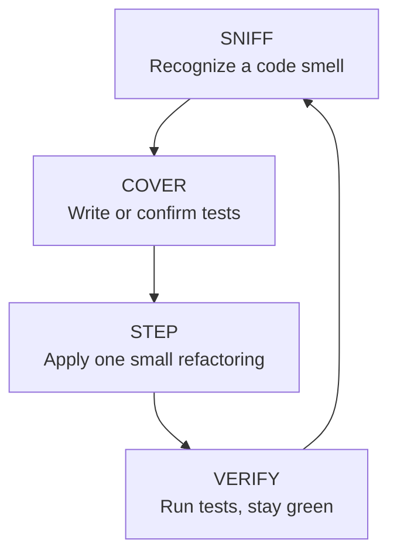

<section lang="en">

## What Is Refactoring?

**Refactoring** is the disciplined process of changing the internal structure of code *without changing its external behaviour*. The program produces exactly the same output before and after. What changes is the shape of the code: how it is named, how it is split into methods and classes, and how those pieces depend on each other.

The key insight is the word "working". Refactoring is not debugging, and it is not adding features. You refactor code that already passes its tests. You are making it easier to understand, cheaper to change, and safer to extend, all while the tests stay green.

Martin Fowler, whose book *Refactoring* gave the field its shared vocabulary, puts it simply:

> Refactoring is the process of changing a software system in such a way that it does not alter the external behavior of the code yet improves its internal structure.

Refactoring is the third step of the **Red, Green, Refactor** cycle you already know from TDD:

```
RED (write a failing test) → GREEN (make it pass) → REFACTOR (improve the design)
```

Without refactoring, the cycle is incomplete. Tests get you correctness; refactoring gets you a codebase that can survive the next change.

### When to Refactor (and When Not To)

Refactor when:

- You are about to add a feature, but the current design makes the feature hard to add. **Refactor first, then add.**
- You have just made a test pass and the code is duplicated or unclear. **Refactor while the context is fresh.**
- You keep changing the same class for different reasons. **Refactor to separate the reasons.**
- You are fixing a bug and the surrounding code is so tangled that the bug is hard to isolate. **Refactor to make the fix safe.**

Do not refactor when:

- The code is broken and has no tests. **Fix it first, or write tests first.** Refactoring without a safety net is risky.
- The code will be thrown away soon. Refactoring throwaway prototypes is wasted effort.
- You have a hard deadline and the change is tiny and low-risk. Ship the fix, then schedule the cleanup.
- You are tempted to redesign the entire system at once. Refactoring is a series of small steps, not a rewrite.

</section>

<section lang="id">

## Apa Itu Refactoring?

**Refactoring** adalah proses disiplin untuk mengubah struktur internal kode *tanpa mengubah perilaku luarnya*. Program menghasilkan keluaran yang persis sama sebelum dan sesudahnya. Yang berubah adalah bentuk kodenya: bagaimana penamaannya, bagaimana ia dipecah menjadi metode dan kelas, dan bagaimana bagian-bagian itu saling bergantung.

Kata kuncinya adalah "berfungsi". Refactoring bukanlah debugging, dan bukan menambah fitur. Anda merefaktor kode yang sudah lulus pengujiannya. Anda membuatnya lebih mudah dipahami, lebih murah untuk diubah, dan lebih aman untuk diperluas, sementara pengujian tetap hijau.

Martin Fowler, yang bukunya *Refactoring* memberi bidang ini kosakata bersama, menyatakannya secara sederhana:

> Refactoring adalah proses mengubah sistem perangkat lunak sedemikian rupa sehingga tidak mengubah perilaku eksternal kode namun memperbaiki struktur internalnya.

Refactoring adalah langkah ketiga dari siklus **Red, Green, Refactor** yang sudah Anda kenal dari TDD:

```
RED (tulis pengujian yang gagal) → GREEN (buat berhasil) → REFACTOR (perbaiki desain)
```

Tanpa refactoring, siklus itu tidak lengkap. Pengujian memberi Anda kebenaran; refactoring memberi Anda codebase yang mampu bertahan menghadapi perubahan berikutnya.

### Kapan Melakukan Refactoring (dan Kapan Tidak)

Lakukan refactoring ketika:

- Anda akan menambah fitur, tetapi desain saat ini membuat fitur itu sulit ditambahkan. **Refactor dulu, lalu tambahkan.**
- Anda baru saja membuat pengujian berhasil dan kodenya duplikat atau tidak jelas. **Refactor selagi konteksnya masih segar.**
- Anda terus mengubah kelas yang sama untuk alasan yang berbeda. **Refactor untuk memisahkan alasan-alasan itu.**
- Anda memperbaiki bug dan kode di sekitarnya begitu kusut sehingga bug sulit diisolasi. **Refactor agar perbaikan menjadi aman.**

Jangan refactor ketika:

- Kode rusak dan tidak memiliki pengujian. **Perbaiki dulu, atau tulis pengujian dulu.** Refactoring tanpa jaring pengaman itu berisiko.
- Kode akan segera dibuang. Merefaktor prototipe sekali pakai adalah usaha yang sia-sia.
- Anda memiliki tenggat waktu ketat dan perubahannya kecil serta berisiko rendah. Kirim perbaikannya, lalu jadwalkan pembersihannya.
- Anda tergoda untuk mendesain ulang seluruh sistem sekaligus. Refactoring adalah serangkaian langkah kecil, bukan penulisan ulang.

</section>

<figure class="my-10 text-center" role="figure">



<figcaption class="mt-3 text-sm text-neutral-500">
  <span lang="en">Figure: The refactoring loop, recognize a smell, cover with tests, apply a small change, verify</span>
  <span lang="id">Gambar: Lingkaran refactoring, kenali smell, lindungi dengan pengujian, terapkan perubahan kecil, verifikasi</span>
</figcaption>
</figure>

---

<section lang="en">

## A Practical Code Smell Catalog

A **code smell** is a surface symptom that usually points to a deeper design problem. Smells are not bugs; the code runs fine. But a smell is a warning that the code will be hard to understand, test, or change. Think of them as the check-engine light on a car: the car still drives, but ignoring the light for long enough gets expensive.

Below are the nine smells you will meet most often in student and lab projects. Each has a one-line definition and a pointer to the refactoring that usually fixes it.

| Code Smell | What It Looks Like | Typical Fix |
|---|---|---|
| **Long Method** | A method that goes on for dozens of lines doing several distinct jobs. | Extract Method |
| **Large Class** | A class with many fields and many responsibilities, too many reasons to change. | Extract Class |
| **Primitive Obsession** | Using raw strings, ints, and arrays for concepts that deserve their own type (money, email, grade). | Introduce Parameter Object / Replace Primitive with Class |
| **Feature Envy** | A method uses another class's data more than its own. | Move Method |
| **Duplicate Code** | The same or near-same logic copy-pasted in several places. | Extract Method / Pull Up |
| **Shotgun Surgery** | One small change forces you to edit many different classes. | Move Method / Move Field |
| **Divergent Change** | One class changes for several unrelated reasons. | Extract Class |
| **Data Clumps** | The same group of fields always appears together and travels together. | Introduce Parameter Object |
| **Temporary Field** | A field that is only used in certain situations, making the object state confusing. | Extract Class / Introduce Null Object |

You will notice a pattern: most smells are fixed by the same small handful of refactorings. That is the good news. Learn these refactorings well and you can clean up almost anything you find.

</section>

<section lang="id">

## Katalog Code Smell Praktis

**Code smell** adalah gejala permukaan yang biasanya menunjuk ke masalah desain yang lebih dalam. Smell bukanlah bug; kodenya berjalan dengan baik. Namun smell adalah peringatan bahwa kode akan sulit dipahami, diuji, atau diubah. Anggap saja seperti lampu indikator mesin di mobil: mobilnya masih bisa jalan, tetapi mengabaikan lampu itu terlalu lama akan menjadi mahal.

Berikut sembilan smell yang paling sering Anda temui dalam proyek mahasiswa dan lab. Masing-masing memiliki definisi satu kalimat dan penunjuk ke refactoring yang biasanya memperbaikinya.

| Code Smell | Seperti Apa Wujudnya | Perbaikan Umum |
|---|---|---|
| **Long Method** | Metode yang berlanjut puluhan baris dan mengerjakan beberapa tugas berbeda. | Extract Method |
| **Large Class** | Kelas dengan banyak field dan banyak tanggung jawab, terlalu banyak alasan untuk berubah. | Extract Class |
| **Primitive Obsession** | Menggunakan string, integer, dan array mentah untuk konsep yang layak punya tipe sendiri (uang, email, nilai). | Introduce Parameter Object / Replace Primitive with Class |
| **Feature Envy** | Sebuah metode menggunakan data kelas lain lebih banyak daripada datanya sendiri. | Move Method |
| **Duplicate Code** | Logika yang sama atau hampir sama disalin-tempel di beberapa tempat. | Extract Method / Pull Up |
| **Shotgun Surgery** | Satu perubahan kecil memaksa Anda mengedit banyak kelas berbeda. | Move Method / Move Field |
| **Divergent Change** | Satu kelas berubah karena beberapa alasan yang tidak saling terkait. | Extract Class |
| **Data Clumps** | Sekelompok field yang sama selalu muncul dan berpindah bersama-sama. | Introduce Parameter Object |
| **Temporary Field** | Field yang hanya dipakai pada situasi tertentu, membuat state objek membingungkan. | Extract Class / Introduce Null Object |

Anda akan melihat sebuah pola: sebagian besar smell diperbaiki oleh segelintir refactoring yang sama. Itulah kabar baiknya. Kuasai refactoring ini dengan baik dan Anda dapat membersihkan hampir semua hal yang Anda temukan.

</section>

---

<section lang="en">

## Refactoring Mechanics in PHP

This section is the core of the tutorial: five refactorings, each with a runnable PHP **before** and **after** snippet. Read them as recipes. Each one has a clear trigger, a mechanical set of steps, and a measurable improvement.

### 1. Extract Method (fixes Long Method)

A method is too long when you cannot explain what it does in one short sentence, or when you have to scroll to see it all. Extract the pieces into well-named methods.

**Before:**

```php
<?php

class OrderReport
{
    public function printInvoice(array $order): string
    {
        $subtotal = 0;
        foreach ($order['items'] as $item) {
            $subtotal += $item['price'] * $item['quantity'];
        }

        $tax = $subtotal * 0.11;
        $total = $subtotal + $tax;

        $lines = [];
        foreach ($order['items'] as $item) {
            $lines[] = $item['name']
                . ' x' . $item['quantity']
                . ' = ' . number_format($item['price'] * $item['quantity'], 2);
        }

        return 'Invoice for ' . $order['customer'] . PHP_EOL
            . implode(PHP_EOL, $lines) . PHP_EOL
            . 'Subtotal: ' . number_format($subtotal, 2)
            . ', Tax: ' . number_format($tax, 2)
            . ', Total: ' . number_format($total, 2);
    }
}
```

The method calculates amounts, renders line items, and formats the summary, three jobs in one. **After:**

```php
<?php

class OrderReport
{
    public function printInvoice(array $order): string
    {
        $amounts = $this->calculateAmounts($order['items']);

        return $this->renderHeader($order['customer']) . PHP_EOL
            . $this->renderLines($order['items']) . PHP_EOL
            . $this->renderSummary($amounts);
    }

    private function calculateAmounts(array $items): array
    {
        $subtotal = 0;
        foreach ($items as $item) {
            $subtotal += $item['price'] * $item['quantity'];
        }

        $tax = $subtotal * 0.11;

        return [
            'subtotal' => $subtotal,
            'tax' => $tax,
            'total' => $subtotal + $tax,
        ];
    }

    private function renderHeader(string $customer): string
    {
        return 'Invoice for ' . $customer;
    }

    private function renderLines(array $items): string
    {
        $lines = [];
        foreach ($items as $item) {
            $lines[] = $item['name']
                . ' x' . $item['quantity']
                . ' = ' . number_format($item['price'] * $item['quantity'], 2);
        }

        return implode(PHP_EOL, $lines);
    }

    private function renderSummary(array $amounts): string
    {
        return 'Subtotal: ' . number_format($amounts['subtotal'], 2)
            . ', Tax: ' . number_format($amounts['tax'], 2)
            . ', Total: ' . number_format($amounts['total'], 2);
    }
}
```

Each extracted method now has a single, nameable purpose, and the main method reads like an outline.

### 2. Introduce Parameter Object (fixes Data Clumps)

When the same group of values always travels together, group them into a single object. This also fixes **Primitive Obsession** and makes long parameter lists readable.

**Before:**

```php
<?php

class ReservationService
{
    public function createReservation(
        string $guestName,
        string $guestEmail,
        string $guestPhone,
        string $roomType,
        string $checkIn,
        string $checkOut
    ): Reservation {
        $this->validate($guestName, $guestEmail, $guestPhone, $roomType, $checkIn, $checkOut);

        return $this->persist($guestName, $guestEmail, $guestPhone, $roomType, $checkIn, $checkOut);
    }

    // ... validate() and persist() repeat the same six parameters.
}
```

Six parameters, and every helper method repeats them. **After:**

```php
<?php

class ReservationRequest
{
    public function __construct(
        public string $guestName,
        public string $guestEmail,
        public string $guestPhone,
        public string $roomType,
        public string $checkIn,
        public string $checkOut,
    ) {}
}

class ReservationService
{
    public function createReservation(ReservationRequest $request): Reservation
    {
        $this->validate($request);

        return $this->persist($request);
    }

    private function validate(ReservationRequest $request): void
    {
        // validation logic uses $request->guestName, $request->checkIn, and so on.
    }

    private function persist(ReservationRequest $request): Reservation
    {
        // persistence logic uses the request object.
    }
}
```

The parameter object becomes a natural home for the validation rules that used to be scattered.

### 3. Replace Conditional with Polymorphism (fixes type-code switches)

A `switch` or long `if` chain on a type code is a signal that behaviour belongs in the types themselves. Replace the conditional with a small class hierarchy.

**Before:**

```php
<?php

class ShippingCostCalculator
{
    public function calculate(Order $order): float
    {
        switch ($order->shippingMethod) {
            case 'standard':
                return $order->weight * 0.5;
            case 'express':
                return $order->weight * 1.5 + 5;
            case 'same_day':
                return 20;
            default:
                throw new InvalidArgumentException('Unknown shipping method: ' . $order->shippingMethod);
        }
    }
}
```

Every new shipping method forces you to reopen this method. **After:**

```php
<?php

interface ShippingMethod
{
    public function cost(Order $order): float;
}

class StandardShipping implements ShippingMethod
{
    public function cost(Order $order): float
    {
        return $order->weight * 0.5;
    }
}

class ExpressShipping implements ShippingMethod
{
    public function cost(Order $order): float
    {
        return $order->weight * 1.5 + 5;
    }
}

class SameDayShipping implements ShippingMethod
{
    public function cost(Order $order): float
    {
        return 20;
    }
}

class ShippingCostCalculator
{
    public function calculate(Order $order): float
    {
        return $order->shippingMethod->cost($order);
    }
}
```

Adding a new shipping method is now additive: you add a class, you never edit existing working code.

### 4. Move Method (fixes Feature Envy)

When a method keeps reaching into another class's data, that method probably belongs on the other class. Move it there.

**Before:**

```php
<?php

class Order
{
    public array $items;

    public function __construct(array $items)
    {
        $this->items = $items;
    }
}

class Invoice
{
    public function calculateTotal(Order $order): float
    {
        $total = 0;
        foreach ($order->items as $item) {
            $total += $item['price'] * $item['quantity'];
        }

        return $total;
    }
}
```

`Invoice::calculateTotal` spends its whole body inspecting `Order`. It is envious of `Order`'s data. **After:**

```php
<?php

class Order
{
    private array $items;

    public function __construct(array $items)
    {
        $this->items = $items;
    }

    public function total(): float
    {
        $total = 0;
        foreach ($this->items as $item) {
            $total += $item['price'] * $item['quantity'];
        }

        return $total;
    }
}

class Invoice
{
    public function calculateTotal(Order $order): float
    {
        return $order->total();
    }
}
```

The total now lives with the data it depends on, and `Invoice` no longer pokes at `Order`'s internals.

### 5. Decompose Conditional (fixes unreadable conditions)

A complex boolean expression is hard to read and impossible to reuse. Give the condition a name by extracting it into a method.

**Before:**

```php
<?php

class DiscountEngine
{
    public function discountFor(Customer $customer, float $total): float
    {
        if ($customer->yearsAsMember > 5 && $total > 100 && !$customer->hasOutstandingBalance) {
            return 0.15;
        }

        if ($customer->yearsAsMember > 1 && $total > 50) {
            return 0.10;
        }

        return 0.0;
    }
}
```

The reader has to parse the business rule every time. **After:**

```php
<?php

class DiscountEngine
{
    public function discountFor(Customer $customer, float $total): float
    {
        if ($this->isEligibleForPremiumDiscount($customer, $total)) {
            return 0.15;
        }

        if ($this->isEligibleForStandardDiscount($customer, $total)) {
            return 0.10;
        }

        return 0.0;
    }

    private function isEligibleForPremiumDiscount(Customer $customer, float $total): bool
    {
        return $customer->yearsAsMember > 5
            && $total > 100
            && !$customer->hasOutstandingBalance;
    }

    private function isEligibleForStandardDiscount(Customer $customer, float $total): bool
    {
        return $customer->yearsAsMember > 1 && $total > 50;
    }
}
```

The rules now have names, and the same rule can be reused and unit-tested in isolation.

</section>

<section lang="id">

## Mekanika Refactoring di PHP

Bagian ini adalah inti tutorial: lima refactoring, masing-masing dengan cuplikan PHP **before** dan **after** yang dapat dijalankan. Baca sebagai resep. Masing-masing memiliki pemicu yang jelas, serangkaian langkah mekanis, dan perbaikan yang terukur.

### 1. Extract Method (memperbaiki Long Method)

Sebuah metode terlalu panjang ketika Anda tidak dapat menjelaskan apa yang dilakukannya dalam satu kalimat singkat, atau ketika Anda harus menggulir untuk melihat semuanya. Ekstrak bagian-bagiannya menjadi metode yang dinamai dengan baik.

**Before:**

```php
<?php

class OrderReport
{
    public function printInvoice(array $order): string
    {
        $subtotal = 0;
        foreach ($order['items'] as $item) {
            $subtotal += $item['price'] * $item['quantity'];
        }

        $tax = $subtotal * 0.11;
        $total = $subtotal + $tax;

        $lines = [];
        foreach ($order['items'] as $item) {
            $lines[] = $item['name']
                . ' x' . $item['quantity']
                . ' = ' . number_format($item['price'] * $item['quantity'], 2);
        }

        return 'Invoice for ' . $order['customer'] . PHP_EOL
            . implode(PHP_EOL, $lines) . PHP_EOL
            . 'Subtotal: ' . number_format($subtotal, 2)
            . ', Tax: ' . number_format($tax, 2)
            . ', Total: ' . number_format($total, 2);
    }
}
```

Metode ini menghitung nominal, merender item baris, dan memformat ringkasan, tiga pekerjaan dalam satu. **After:**

```php
<?php

class OrderReport
{
    public function printInvoice(array $order): string
    {
        $amounts = $this->calculateAmounts($order['items']);

        return $this->renderHeader($order['customer']) . PHP_EOL
            . $this->renderLines($order['items']) . PHP_EOL
            . $this->renderSummary($amounts);
    }

    private function calculateAmounts(array $items): array
    {
        $subtotal = 0;
        foreach ($items as $item) {
            $subtotal += $item['price'] * $item['quantity'];
        }

        $tax = $subtotal * 0.11;

        return [
            'subtotal' => $subtotal,
            'tax' => $tax,
            'total' => $subtotal + $tax,
        ];
    }

    private function renderHeader(string $customer): string
    {
        return 'Invoice for ' . $customer;
    }

    private function renderLines(array $items): string
    {
        $lines = [];
        foreach ($items as $item) {
            $lines[] = $item['name']
                . ' x' . $item['quantity']
                . ' = ' . number_format($item['price'] * $item['quantity'], 2);
        }

        return implode(PHP_EOL, $lines);
    }

    private function renderSummary(array $amounts): string
    {
        return 'Subtotal: ' . number_format($amounts['subtotal'], 2)
            . ', Tax: ' . number_format($amounts['tax'], 2)
            . ', Total: ' . number_format($amounts['total'], 2);
    }
}
```

Setiap metode yang diekstrak kini memiliki satu tujuan yang dapat diberi nama, dan metode utama terbaca seperti kerangka.

### 2. Introduce Parameter Object (memperbaiki Data Clumps)

Ketika sekelompok nilai yang sama selalu bepergian bersama, kelompokkan menjadi satu objek. Ini juga memperbaiki **Primitive Obsession** dan membuat daftar parameter yang panjang menjadi mudah dibaca.

**Before:**

```php
<?php

class ReservationService
{
    public function createReservation(
        string $guestName,
        string $guestEmail,
        string $guestPhone,
        string $roomType,
        string $checkIn,
        string $checkOut
    ): Reservation {
        $this->validate($guestName, $guestEmail, $guestPhone, $roomType, $checkIn, $checkOut);

        return $this->persist($guestName, $guestEmail, $guestPhone, $roomType, $checkIn, $checkOut);
    }

    // ... validate() and persist() mengulang enam parameter yang sama.
}
```

Enam parameter, dan setiap metode pembantu mengulanginya. **After:**

```php
<?php

class ReservationRequest
{
    public function __construct(
        public string $guestName,
        public string $guestEmail,
        public string $guestPhone,
        public string $roomType,
        public string $checkIn,
        public string $checkOut,
    ) {}
}

class ReservationService
{
    public function createReservation(ReservationRequest $request): Reservation
    {
        $this->validate($request);

        return $this->persist($request);
    }

    private function validate(ReservationRequest $request): void
    {
        // logika validasi menggunakan $request->guestName, $request->checkIn, dan seterusnya.
    }

    private function persist(ReservationRequest $request): Reservation
    {
        // logika persistensi menggunakan objek request.
    }
}
```

Objek parameter menjadi rumah alami bagi aturan validasi yang tadinya tersebar.

### 3. Replace Conditional with Polymorphism (memperbaiki switch kode tipe)

Rantai `switch` atau `if` panjang pada kode tipe adalah sinyal bahwa perilaku seharusnya tinggal di dalam tipe itu sendiri. Ganti kondisional dengan hierarki kelas kecil.

**Before:**

```php
<?php

class ShippingCostCalculator
{
    public function calculate(Order $order): float
    {
        switch ($order->shippingMethod) {
            case 'standard':
                return $order->weight * 0.5;
            case 'express':
                return $order->weight * 1.5 + 5;
            case 'same_day':
                return 20;
            default:
                throw new InvalidArgumentException('Unknown shipping method: ' . $order->shippingMethod);
        }
    }
}
```

Setiap metode pengiriman baru memaksa Anda membuka kembali metode ini. **After:**

```php
<?php

interface ShippingMethod
{
    public function cost(Order $order): float;
}

class StandardShipping implements ShippingMethod
{
    public function cost(Order $order): float
    {
        return $order->weight * 0.5;
    }
}

class ExpressShipping implements ShippingMethod
{
    public function cost(Order $order): float
    {
        return $order->weight * 1.5 + 5;
    }
}

class SameDayShipping implements ShippingMethod
{
    public function cost(Order $order): float
    {
        return 20;
    }
}

class ShippingCostCalculator
{
    public function calculate(Order $order): float
    {
        return $order->shippingMethod->cost($order);
    }
}
```

Menambah metode pengiriman baru kini bersifat aditif: Anda menambah kelas, tidak pernah mengedit kode yang sudah berfungsi.

### 4. Move Method (memperbaiki Feature Envy)

Ketika sebuah metode terus meraih data kelas lain, metode itu mungkin seharusnya berada di kelas lain. Pindahkan ke sana.

**Before:**

```php
<?php

class Order
{
    public array $items;

    public function __construct(array $items)
    {
        $this->items = $items;
    }
}

class Invoice
{
    public function calculateTotal(Order $order): float
    {
        $total = 0;
        foreach ($order->items as $item) {
            $total += $item['price'] * $item['quantity'];
        }

        return $total;
    }
}
```

`Invoice::calculateTotal` menghabiskan seluruh badannya memeriksa `Order`. Ia iri terhadap data `Order`. **After:**

```php
<?php

class Order
{
    private array $items;

    public function __construct(array $items)
    {
        $this->items = $items;
    }

    public function total(): float
    {
        $total = 0;
        foreach ($this->items as $item) {
            $total += $item['price'] * $item['quantity'];
        }

        return $total;
    }
}

class Invoice
{
    public function calculateTotal(Order $order): float
    {
        return $order->total();
    }
}
```

Total kini tinggal bersama data yang diandalkannya, dan `Invoice` tidak lagi mengintip bagian dalam `Order`.

### 5. Decompose Conditional (memperbaiki kondisi yang sulit dibaca)

Ekspresi boolean yang kompleks sulit dibaca dan mustahil digunakan ulang. Beri nama pada kondisi itu dengan mengekstraknya menjadi metode.

**Before:**

```php
<?php

class DiscountEngine
{
    public function discountFor(Customer $customer, float $total): float
    {
        if ($customer->yearsAsMember > 5 && $total > 100 && !$customer->hasOutstandingBalance) {
            return 0.15;
        }

        if ($customer->yearsAsMember > 1 && $total > 50) {
            return 0.10;
        }

        return 0.0;
    }
}
```

Pembaca harus menafsirkan aturan bisnis setiap kali. **After:**

```php
<?php

class DiscountEngine
{
    public function discountFor(Customer $customer, float $total): float
    {
        if ($this->isEligibleForPremiumDiscount($customer, $total)) {
            return 0.15;
        }

        if ($this->isEligibleForStandardDiscount($customer, $total)) {
            return 0.10;
        }

        return 0.0;
    }

    private function isEligibleForPremiumDiscount(Customer $customer, float $total): bool
    {
        return $customer->yearsAsMember > 5
            && $total > 100
            && !$customer->hasOutstandingBalance;
    }

    private function isEligibleForStandardDiscount(Customer $customer, float $total): bool
    {
        return $customer->yearsAsMember > 1 && $total > 50;
    }
}
```

Aturan-aturannya kini memiliki nama, dan aturan yang sama dapat dipakai ulang serta diuji unit secara terpisah.

</section>

---

<section lang="en">

## Worked Example: Refactoring a Grade Calculator

Let us walk through a complete refactoring, the kind you will actually do in a student project. Here is a grade calculator that a student wrote in a hurry. It works, but it is full of smells: **Long Method**, **Primitive Obsession**, and **Magic Numbers**.

**Before:**

```php
<?php

class GradeCalculator
{
    public function calc(array $student): string
    {
        $s = 0;
        foreach ($student['assignments'] as $a) {
            $s += $a[0] * $a[1];
        }
        $total = $s * 0.6;
        $total += $student['midterm'] * 0.2;
        $total += $student['final'] * 0.2;

        if ($total >= 85) {
            return 'A';
        }
        if ($total >= 75) {
            return 'B';
        }
        if ($total >= 65) {
            return 'C';
        }
        if ($total >= 50) {
            return 'D';
        }

        return 'E';
    }
}
```

Every single number here is unexplained: `0.6`, `0.2`, `85`, `75`, `65`, `50`. The `$a[0]` and `$a[1]` are meaningless. The whole grade scale is buried inside one long method.

Refactor it in small steps, running tests after each one.

**Step 1: Extract Method for the weighted score.** Give the calculation a name and constants:

```php
<?php

class GradeCalculator
{
    private const ASSIGNMENT_WEIGHT = 0.6;
    private const MIDTERM_WEIGHT = 0.2;
    private const FINAL_WEIGHT = 0.2;

    public function calc(array $student): string
    {
        $total = $this->weightedScore($student);

        return $this->gradeForScore($total);
    }

    private function weightedScore(array $student): float
    {
        $assignmentScore = 0;
        foreach ($student['assignments'] as $assignment) {
            $assignmentScore += $assignment[0] * $assignment[1];
        }

        return $assignmentScore * self::ASSIGNMENT_WEIGHT
            + $student['midterm'] * self::MIDTERM_WEIGHT
            + $student['final'] * self::FINAL_WEIGHT;
    }

    private function gradeForScore(float $score): string
    {
        if ($score >= 85) {
            return 'A';
        }
        if ($score >= 75) {
            return 'B';
        }
        if ($score >= 65) {
            return 'C';
        }
        if ($score >= 50) {
            return 'D';
        }

        return 'E';
    }
}
```

**Step 2: Replace the grade thresholds with a data-driven lookup.** The grade scale is really a list of (threshold, grade) pairs. Model it as data so it is easy to read and change:

```php
<?php

class GradeCalculator
{
    private const ASSIGNMENT_WEIGHT = 0.6;
    private const MIDTERM_WEIGHT = 0.2;
    private const FINAL_WEIGHT = 0.2;

    private const GRADE_SCALE = [
        [85, 'A'],
        [75, 'B'],
        [65, 'C'],
        [50, 'D'],
    ];

    public function calc(array $student): string
    {
        return $this->gradeForScore($this->weightedScore($student));
    }

    private function weightedScore(array $student): float
    {
        $assignmentScore = 0;
        foreach ($student['assignments'] as $assignment) {
            $assignmentScore += $assignment[0] * $assignment[1];
        }

        return $assignmentScore * self::ASSIGNMENT_WEIGHT
            + $student['midterm'] * self::MIDTERM_WEIGHT
            + $student['final'] * self::FINAL_WEIGHT;
    }

    private function gradeForScore(float $score): string
    {
        foreach (self::GRADE_SCALE as [$threshold, $grade]) {
            if ($score >= $threshold) {
                return $grade;
            }
        }

        return 'E';
    }
}
```

Now the behaviour is identical, but the *why* of every number is named. Adding a new grade band, or changing a weight, touches one obvious place. This is what refactoring means in practice: many tiny, behaviour-preserving steps that compound into clarity.

</section>

<section lang="id">

## Contoh Kerja: Merefaktor Kalkulator Nilai

Mari kita telusuri refactoring lengkap, jenis yang benar-benar akan Anda lakukan dalam proyek mahasiswa. Berikut kalkulator nilai yang ditulis seorang mahasiswa dengan terburu-buru. Ia berfungsi, tetapi penuh smell: **Long Method**, **Primitive Obsession**, dan **Magic Number**.

**Before:**

```php
<?php

class GradeCalculator
{
    public function calc(array $student): string
    {
        $s = 0;
        foreach ($student['assignments'] as $a) {
            $s += $a[0] * $a[1];
        }
        $total = $s * 0.6;
        $total += $student['midterm'] * 0.2;
        $total += $student['final'] * 0.2;

        if ($total >= 85) {
            return 'A';
        }
        if ($total >= 75) {
            return 'B';
        }
        if ($total >= 65) {
            return 'C';
        }
        if ($total >= 50) {
            return 'D';
        }

        return 'E';
    }
}
```

Setiap angka di sini tidak dijelaskan: `0.6`, `0.2`, `85`, `75`, `65`, `50`. `$a[0]` dan `$a[1]` tidak bermakna. Seluruh skala nilai terkubur di dalam satu metode panjang.

Refactor dalam langkah-langkah kecil, jalankan pengujian setelah setiap langkah.

**Langkah 1: Extract Method untuk skor berbobot.** Beri nama pada perhitungannya dan jadikan konstanta:

```php
<?php

class GradeCalculator
{
    private const ASSIGNMENT_WEIGHT = 0.6;
    private const MIDTERM_WEIGHT = 0.2;
    private const FINAL_WEIGHT = 0.2;

    public function calc(array $student): string
    {
        $total = $this->weightedScore($student);

        return $this->gradeForScore($total);
    }

    private function weightedScore(array $student): float
    {
        $assignmentScore = 0;
        foreach ($student['assignments'] as $assignment) {
            $assignmentScore += $assignment[0] * $assignment[1];
        }

        return $assignmentScore * self::ASSIGNMENT_WEIGHT
            + $student['midterm'] * self::MIDTERM_WEIGHT
            + $student['final'] * self::FINAL_WEIGHT;
    }

    private function gradeForScore(float $score): string
    {
        if ($score >= 85) {
            return 'A';
        }
        if ($score >= 75) {
            return 'B';
        }
        if ($score >= 65) {
            return 'C';
        }
        if ($score >= 50) {
            return 'D';
        }

        return 'E';
    }
}
```

**Langkah 2: Ganti ambang nilai dengan pencarian berbasis data.** Skala nilai sebenarnya adalah daftar pasangan (ambang, nilai). Modelkan sebagai data agar mudah dibaca dan diubah:

```php
<?php

class GradeCalculator
{
    private const ASSIGNMENT_WEIGHT = 0.6;
    private const MIDTERM_WEIGHT = 0.2;
    private const FINAL_WEIGHT = 0.2;

    private const GRADE_SCALE = [
        [85, 'A'],
        [75, 'B'],
        [65, 'C'],
        [50, 'D'],
    ];

    public function calc(array $student): string
    {
        return $this->gradeForScore($this->weightedScore($student));
    }

    private function weightedScore(array $student): float
    {
        $assignmentScore = 0;
        foreach ($student['assignments'] as $assignment) {
            $assignmentScore += $assignment[0] * $assignment[1];
        }

        return $assignmentScore * self::ASSIGNMENT_WEIGHT
            + $student['midterm'] * self::MIDTERM_WEIGHT
            + $student['final'] * self::FINAL_WEIGHT;
    }

    private function gradeForScore(float $score): string
    {
        foreach (self::GRADE_SCALE as [$threshold, $grade]) {
            if ($score >= $threshold) {
                return $grade;
            }
        }

        return 'E';
    }
}
```

Kini perilakunya identik, tetapi *alasan* setiap angka diberi nama. Menambah pita nilai baru, atau mengubah bobot, hanya menyentuh satu tempat yang jelas. Inilah arti refactoring dalam praktik: banyak langkah kecil yang menjaga perilaku dan berakumulasi menjadi kejelasan.

</section>

---

<section lang="en">

## Refactoring Safely

Refactoring is risky only when you do it blindly. A safe refactoring is a loop: **cover, change, verify, commit.**

### 1. The Safety Net: Tests

The single most important rule of refactoring is this: **never refactor code without tests.** Tests are what let you prove, mechanically, that behaviour did not change. If a class has no tests, write characterization tests first: tests that record what the current code does, ugly as it is. Then refactor.

For PHP, [PHPUnit](https://phpunit.de/) is the standard. If you are new to it, the [Test-Driven Development with PHP](/blog/test-driven-development) tutorial walks through the whole red-green-refactor rhythm.

### 2. Static Analysis: PHPStan and Psalm

Before you even run the code, static analyzers catch type errors, dead code, and suspicious constructs. Add one to your project and let it run in CI:

```bash
composer require --dev phpstan/phpstan
vendor/bin/phpstan analyse src --level=5
```

[Psalm](https://psalm.dev/) is a comparable alternative. Start at a low level and raise it as you clean up. Static analysis turns many refactorings from "hope it still works" into "provably still typesafe".

### 3. Tiny Commits

Refactor in the smallest commits you can make. Each commit should do exactly one thing: rename a variable, extract a method, move a field. This has two benefits. First, if something breaks, `git bisect` or a simple revert isolates the culprit instantly. Second, reviewers can understand a diff that does one thing far faster than a diff that does forty.

A good refactoring commit message reads like a recipe: "Extract `calculateAmounts` from `OrderReport::printInvoice`."

### 4. Mechanical Steps Only

A true refactoring is a sequence of mechanical steps, each reversible. Rename, extract, inline, move. If a step requires you to *think* about whether behaviour changed, you are not refactoring; you are redesigning. Do those separately.

</section>

<section lang="id">

## Refactoring dengan Aman

Refactoring hanya berisiko jika dilakukan secara membabi buta. Refactoring yang aman adalah sebuah lingkaran: **lindungi, ubah, verifikasi, commit.**

### 1. Jaring Pengaman: Pengujian

Aturan terpenting dalam refactoring adalah ini: **jangan pernah merefaktor kode tanpa pengujian.** Pengujian adalah yang memungkinkan Anda membuktikan, secara mekanis, bahwa perilaku tidak berubah. Jika sebuah kelas tidak memiliki pengujian, tulis *characterization test* terlebih dahulu: pengujian yang merekam apa yang dilakukan kode saat ini, sejelek apa pun itu. Lalu refactor.

Untuk PHP, [PHPUnit](https://phpunit.de/) adalah standarnya. Jika Anda baru mengenalnya, tutorial [Test-Driven Development dengan PHP](/blog/test-driven-development) memandu seluruh ritme red-green-refactor.

### 2. Analisis Statis: PHPStan dan Psalm

Bahkan sebelum menjalankan kode, penganalisis statis menangkap kesalahan tipe, kode mati, dan konstruksi mencurigakan. Tambahkan satu ke proyek Anda dan biarkan berjalan di CI:

```bash
composer require --dev phpstan/phpstan
vendor/bin/phpstan analyse src --level=5
```

[Psalm](https://psalm.dev/) adalah alternatif yang sebanding. Mulai dari level rendah dan naikkan seiring pembersihan Anda. Analisis statis mengubah banyak refactoring dari "semoga masih berfungsi" menjadi "terbukti masih typesafe".

### 3. Commit Kecil

Refactor dalam commit sekecil mungkin. Setiap commit harus melakukan tepat satu hal: mengganti nama variabel, mengekstrak metode, memindahkan field. Ini punya dua manfaat. Pertama, jika ada yang rusak, `git bisect` atau revert sederhana langsung mengisolasi penyebabnya. Kedua, reviewer dapat memahami diff yang melakukan satu hal jauh lebih cepat daripada diff yang melakukan empat puluh hal.

Pesan commit refactoring yang baik terbaca seperti resep: "Ekstrak `calculateAmounts` dari `OrderReport::printInvoice`."

### 4. Hanya Langkah Mekanis

Refactoring sejati adalah rangkaian langkah mekanis, masing-masing dapat dibalik. Rename, extract, inline, move. Jika sebuah langkah mengharuskan Anda *berpikir* apakah perilaku berubah, Anda tidak sedang merefaktor; Anda sedang mendesain ulang. Lakukan keduanya secara terpisah.

</section>

---

<section lang="en">

## Common Mistakes

Refactoring is a skill, and like any skill it has predictable failure modes. Here are the ones to avoid.

### 1. Refactoring Without Tests

This is the cardinal sin. Changing structure with no way to verify behaviour is how "I just cleaned it up a bit" turns into a weekend of debugging. If tests are missing, write characterization tests first. Never refactor blind.

### 2. "Refactoring" That Changes Behaviour

If the output changed, you did not refactor; you rewrote. Many teams smuggle new features into a "refactor" commit and then wonder why the regression is hard to find. Keep behaviour changes in separate commits, clearly labelled.

### 3. Premature Abstraction

Not every `switch` needs a class hierarchy, and not every two-line duplication needs a helper. The rule of three applies: wait until you see a pattern *three* times before you abstract it. Abstracting too early produces speculative interfaces that no one needs and everyone must maintain.

### 4. One Big Bang Refactor

Trying to fix every smell at once, in a single massive change, is a rewrite in disguise. It is slow to review, hard to reason about, and nearly impossible to roll back cleanly. Refactor in small, safe, verifiable steps.

### 5. Fixing Smells in Code You Will Not Keep

Do not spend hours cleaning code that is about to be deleted or rewritten. Refactoring pays back over the future life of the code. If the future is short, the payback is not worth the risk.

### 6. Ignoring the Test Cycle Mid-Refactor

Run the full suite after *each* small step, not just at the end. A failing test twenty minutes after the change is far harder to diagnose than one caught immediately.

</section>

<section lang="id">

## Kesalahan Umum

Refactoring adalah keterampilan, dan seperti keterampilan apa pun ia memiliki pola kegagalan yang dapat diprediksi. Berikut yang harus dihindari.

### 1. Refactoring Tanpa Pengujian

Ini adalah dosa utama. Mengubah struktur tanpa cara untuk memverifikasi perilaku adalah bagaimana "saya cuma merapikan sedikit" berubah menjadi akhir pekan penuh debugging. Jika pengujian tidak ada, tulis characterization test terlebih dahulu. Jangan pernah merefaktor dalam keadaan buta.

### 2. "Refactoring" yang Mengubah Perilaku

Jika keluarannya berubah, Anda tidak merefaktor; Anda menulis ulang. Banyak tim menyelundupkan fitur baru ke dalam commit "refactor" lalu bingung mengapa regresinya sulit ditemukan. Simpan perubahan perilaku di commit terpisah, dengan label yang jelas.

### 3. Abstraksi Prematur

Tidak setiap `switch` butuh hierarki kelas, dan tidak setiap duplikasi dua baris butuh helper. Aturan tiga berlaku: tunggu sampai Anda melihat sebuah pola *tiga* kali sebelum mengabstraksinya. Abstraksi yang terlalu dini menghasilkan antarmuka spekulatif yang tidak dibutuhkan siapa pun namun harus dipelihara semua orang.

### 4. Satu Refactor Besar Sekaligus

Mencoba memperbaiki semua smell sekaligus, dalam satu perubahan masif, adalah penulisan ulang yang tersamar. Ia lambat direview, sulit dinalar, dan nyaris mustahil di-rollback dengan bersih. Refactor dalam langkah kecil, aman, dan dapat diverifikasi.

### 5. Memperbaiki Smell pada Kode yang Tidak Akan Dipertahankan

Jangan habiskan berjam-jam membersihkan kode yang akan segera dihapus atau ditulis ulang. Refactoring terbayar sepanjang masa hidup kode di masa depan. Jika masa depannya pendek, bayarannya tidak sebanding dengan risikonya.

### 6. Mengabaikan Siklus Pengujian di Tengah Refactor

Jalankan seluruh suite setelah *setiap* langkah kecil, bukan hanya di akhir. Pengujian yang gagal dua puluh menit setelah perubahan jauh lebih sulit didiagnosis daripada yang langsung tertangkap.

</section>

---

<section lang="en">

## Hands-On Exercise: The Smelly InvoiceProcessor

Now it is your turn. Below is a deliberately smelly `InvoiceProcessor` class. It works, but it suffers from **Long Method**, **Duplicate Code**, **Primitive Obsession**, **Data Clumps**, and **Feature Envy**.

**Your task:** refactor it without changing its behaviour, in small steps, applying at least four of the refactorings from this tutorial. Write (or imagine) the tests that pin the current behaviour first.

```php
<?php

class InvoiceProcessor
{
    public function process(string $customerName, string $customerEmail, string $customerAddress, array $items): array
    {
        $subtotal = 0;
        foreach ($items as $item) {
            $subtotal += $item['price'] * $item['qty'];
        }

        $discount = 0;
        if ($subtotal > 500) {
            $discount = $subtotal * 0.10;
        } else if ($subtotal > 200) {
            $discount = $subtotal * 0.05;
        }

        $taxable = $subtotal - $discount;
        $tax = $taxable * 0.11;
        $total = $taxable + $tax;

        $lines = '';
        foreach ($items as $item) {
            $lines .= $item['name'] . ' x' . $item['qty'] . ' = ' . number_format($item['price'] * $item['qty'], 2) . "\n";
        }

        $summary = "Subtotal: " . number_format($subtotal, 2)
            . ", Discount: " . number_format($discount, 2)
            . ", Tax: " . number_format($tax, 2)
            . ", Total: " . number_format($total, 2);

        // A completely unrelated job: sending a receipt email.
        $subject = "Your invoice, " . $customerName;
        $body = $summary . "\n\n" . $lines;
        $this->sendEmail($customerEmail, $subject, $body);

        return [
            'customer' => [
                'name' => $customerName,
                'email' => $customerEmail,
                'address' => $customerAddress,
            ],
            'lines' => $lines,
            'summary' => $summary,
            'total' => $total,
        ];
    }

    private function sendEmail(string $to, string $subject, string $body): void
    {
        // Pretend this sends a real email.
    }
}
```

**Hints:**

- The `customerName`, `customerEmail`, `customerAddress` parameters travel together. What refactoring handles that?
- `subtotal`, `discount`, `tax`, and `total` are computed together. What belongs in their own object?
- The receipt-email logic has nothing to do with calculating an invoice. Where should it go?
- The discount rules are buried. How can you give them names?

**Suggested refactorings to try:** Introduce Parameter Object, Extract Method, Move Method, Decompose Conditional, and Extract Class.

There is no single correct answer. The goal is to end with a class whose methods read like plain English and whose behaviour is exactly the same as when you started.

</section>

<section lang="id">

## Latihan Langsung: InvoiceProcessor yang Bau

Sekarang giliran Anda. Berikut adalah kelas `InvoiceProcessor` yang sengaja dibuat berantakan. Ia berfungsi, tetapi menderita **Long Method**, **Duplicate Code**, **Primitive Obsession**, **Data Clumps**, dan **Feature Envy**.

**Tugas Anda:** refactor tanpa mengubah perilakunya, dalam langkah-langkah kecil, menerapkan setidaknya empat refactoring dari tutorial ini. Tulis (atau bayangkan) pengujian yang mengunci perilaku saat ini terlebih dahulu.

```php
<?php

class InvoiceProcessor
{
    public function process(string $customerName, string $customerEmail, string $customerAddress, array $items): array
    {
        $subtotal = 0;
        foreach ($items as $item) {
            $subtotal += $item['price'] * $item['qty'];
        }

        $discount = 0;
        if ($subtotal > 500) {
            $discount = $subtotal * 0.10;
        } else if ($subtotal > 200) {
            $discount = $subtotal * 0.05;
        }

        $taxable = $subtotal - $discount;
        $tax = $taxable * 0.11;
        $total = $taxable + $tax;

        $lines = '';
        foreach ($items as $item) {
            $lines .= $item['name'] . ' x' . $item['qty'] . ' = ' . number_format($item['price'] * $item['qty'], 2) . "\n";
        }

        $summary = "Subtotal: " . number_format($subtotal, 2)
            . ", Discount: " . number_format($discount, 2)
            . ", Tax: " . number_format($tax, 2)
            . ", Total: " . number_format($total, 2);

        // Pekerjaan yang sama sekali tidak terkait: mengirim email tanda terima.
        $subject = "Your invoice, " . $customerName;
        $body = $summary . "\n\n" . $lines;
        $this->sendEmail($customerEmail, $subject, $body);

        return [
            'customer' => [
                'name' => $customerName,
                'email' => $customerEmail,
                'address' => $customerAddress,
            ],
            'lines' => $lines,
            'summary' => $summary,
            'total' => $total,
        ];
    }

    private function sendEmail(string $to, string $subject, string $body): void
    {
        // Anggap ini mengirim email sungguhan.
    }
}
```

**Petunjuk:**

- Parameter `customerName`, `customerEmail`, `customerAddress` bepergian bersama. Refactoring apa yang menanganinya?
- `subtotal`, `discount`, `tax`, dan `total` dihitung bersama. Apa yang seharusnya ada di objeknya sendiri?
- Logika email tanda terima tidak ada hubungannya dengan menghitung faktur. Ke mana seharusnya ia pergi?
- Aturan diskon terkubur. Bagaimana Anda memberi nama padanya?

**Refactoring yang disarankan untuk dicoba:** Introduce Parameter Object, Extract Method, Move Method, Decompose Conditional, dan Extract Class.

Tidak ada satu jawaban yang benar. Tujuannya adalah berakhir dengan kelas yang metodenya terbaca seperti bahasa Inggris sederhana dan perilakunya persis sama seperti saat Anda memulai.

</section>

---

<section lang="en">

## Code Smell Quick Reference

Keep this table handy during code reviews. When you spot a smell, look at the right-hand column for the refactoring to reach for.

| Smell | Ask Yourself | Reach For |
|---|---|---|
| Long Method | Can I summarize this method in one sentence? | Extract Method |
| Large Class | Does this class have more than one reason to change? | Extract Class |
| Primitive Obsession | Am I using strings/ints/arrays for a real concept? | Replace Primitive with Class |
| Feature Envy | Does this method use another object more than itself? | Move Method |
| Duplicate Code | Did I copy-paste this logic elsewhere? | Extract Method / Pull Up |
| Shotgun Surgery | Does one change force edits in many files? | Move Method / Move Field |
| Divergent Change | Does this class change for unrelated reasons? | Extract Class |
| Data Clumps | Do these fields always appear together? | Introduce Parameter Object |
| Temporary Field | Is this field meaningless most of the time? | Extract Class / Introduce Null Object |

**Checklist for every refactoring:**

- [ ] There are tests, and they pass before I start.
- [ ] I am changing one thing at a time.
- [ ] I run the full suite after each step.
- [ ] Behaviour is unchanged: same inputs, same outputs.
- [ ] I commit each small step separately.
- [ ] Static analysis (PHPStan/Psalm) reports no new errors.

</section>

<section lang="id">

## Referensi Cepat Code Smell

Simpan tabel ini selama code review. Ketika Anda melihat sebuah smell, lihat kolom paling kanan untuk refactoring yang perlu diambil.

| Smell | Tanyakan pada Diri Anda | Ambil |
|---|---|---|
| Long Method | Bisakah saya merangkum metode ini dalam satu kalimat? | Extract Method |
| Large Class | Apakah kelas ini punya lebih dari satu alasan untuk berubah? | Extract Class |
| Primitive Obsession | Apakah saya memakai string/integer/array untuk konsep nyata? | Replace Primitive with Class |
| Feature Envy | Apakah metode ini memakai objek lain lebih banyak daripada dirinya? | Move Method |
| Duplicate Code | Apakah saya menyalin-tempel logika ini di tempat lain? | Extract Method / Pull Up |
| Shotgun Surgery | Apakah satu perubahan memaksa edit di banyak file? | Move Method / Move Field |
| Divergent Change | Apakah kelas ini berubah karena alasan yang tidak terkait? | Extract Class |
| Data Clumps | Apakah field-field ini selalu muncul bersama? | Introduce Parameter Object |
| Temporary Field | Apakah field ini tak bermakna di sebagian besar waktu? | Extract Class / Introduce Null Object |

**Daftar periksa untuk setiap refactoring:**

- [ ] Ada pengujian, dan semuanya lulus sebelum saya mulai.
- [ ] Saya mengubah satu hal dalam satu waktu.
- [ ] Saya menjalankan seluruh suite setelah setiap langkah.
- [ ] Perilaku tidak berubah: input sama, output sama.
- [ ] Saya commit setiap langkah kecil secara terpisah.
- [ ] Analisis statis (PHPStan/Psalm) tidak melaporkan kesalahan baru.

</section>

---

<section lang="en">

## Summary

1. **Refactoring changes structure, not behaviour.** If the output changed, you rewrote, not refactored.
2. **Code smells are symptoms, not bugs.** They warn you that future changes will be painful.
3. **Learn a small set of refactorings well:** Extract Method, Introduce Parameter Object, Replace Conditional with Polymorphism, Move Method, and Decompose Conditional cover most of what you will meet.
4. **The loop is always the same:** cover with tests, apply one small change, run tests, commit.
5. **Never refactor without tests.** Characterization tests first, then cleanup.
6. **Avoid premature abstraction and big-bang rewrites.** Small, reversible, verifiable steps win.

Refactoring closes the loop that the rest of the curriculum opens. Clean Code teaches you to write it well from the start; SOLID gives you the design principles; TDD gives you the safety net. Refactoring is the skill you use when the code has already drifted.

</section>

<section lang="id">

## Ringkasan

1. **Refactoring mengubah struktur, bukan perilaku.** Jika keluarannya berubah, Anda menulis ulang, bukan merefaktor.
2. **Code smell adalah gejala, bukan bug.** Ia memperingatkan bahwa perubahan di masa depan akan menyakitkan.
3. **Kuasai sekumpulan kecil refactoring dengan baik:** Extract Method, Introduce Parameter Object, Replace Conditional with Polymorphism, Move Method, dan Decompose Conditional mencakup sebagian besar yang akan Anda temui.
4. **Lingkarannya selalu sama:** lindungi dengan pengujian, terapkan satu perubahan kecil, jalankan pengujian, commit.
5. **Jangan pernah merefaktor tanpa pengujian.** Characterization test dulu, lalu pembersihan.
6. **Hindari abstraksi prematur dan penulisan ulang besar.** Langkah kecil, dapat dibalik, dan dapat diverifikasi adalah pemenangnya.

Refactoring menutup lingkaran yang dibuka oleh sisa kurikulum. Clean Code mengajari Anda menulis dengan baik sejak awal; SOLID memberi Anda prinsip desain; TDD memberi Anda jaring pengaman. Refactoring adalah keterampilan yang Anda pakai ketika kode sudah terlanjur melenceng.

</section>

---

<section lang="en">

## Further Reading

This tutorial sits between the "design well" and "write well" corners of the SE Lab curriculum. Continue with:

- **[Clean Code Principles with PHP](/blog/clean-code-principles)**: Meaningful naming, small functions, and the habits that make code smell obvious.
- **[SOLID Principles Fundamentals with PHP](/blog/solid-principles-fundamentals-php)**: The design principles that tell you *where* the code should end up after you refactor.
- **[Test-Driven Development with PHP](/blog/test-driven-development)**: The red-green-refactor cycle and the safety net that makes refactoring safe.
- **[Design Patterns with PHP](/blog/design-patterns-with-php)**: Strategy and friends, the destinations you often arrive at after Replace Conditional with Polymorphism.

### External References

- **[Refactoring](https://martinfowler.com/books/refactoring.html)** by Martin Fowler: The canonical catalog of refactorings and the source of the shared vocabulary.
- **[Refactoring Guru](https://refactoring.guru/refactoring)**: A free, illustrated catalog of smells and refactorings with code examples.
- **[PHPStan](https://phpstan.org/)** and **[Psalm](https://psalm.dev/)**: Static analysis tools that make refactoring provably safe.

</section>

<section lang="id">

## Bacaan Lebih Lanjut

Tutorial ini berada di antara sudut "desain dengan baik" dan "tulis dengan baik" pada kurikulum SE Lab. Lanjutkan dengan:

- **[Prinsip Clean Code dengan PHP](/blog/clean-code-principles)**: Penamaan bermakna, fungsi kecil, dan kebiasaan yang membuat code smell terlihat jelas.
- **[Dasar-Dasar Prinsip SOLID dengan PHP](/blog/solid-principles-fundamentals-php)**: Prinsip desain yang memberi tahu Anda *ke mana* kode seharusnya berakhir setelah Anda merefaktor.
- **[Test-Driven Development dengan PHP](/blog/test-driven-development)**: Siklus red-green-refactor dan jaring pengaman yang membuat refactoring aman.
- **[Design Patterns dengan PHP](/blog/design-patterns-with-php)**: Strategy dan kawan-kawan, tujuan yang sering Anda capai setelah Replace Conditional with Polymorphism.

### Referensi Eksternal

- **[Refactoring](https://martinfowler.com/books/refactoring.html)** oleh Martin Fowler: Katalog kanonis refactoring dan sumber kosakata bersama.
- **[Refactoring Guru](https://refactoring.guru/refactoring)**: Katalog bergambar gratis tentang smell dan refactoring dengan contoh kode.
- **[PHPStan](https://phpstan.org/)** dan **[Psalm](https://psalm.dev/)**: Alat analisis statis yang membuat refactoring terbukti aman.

</section>
