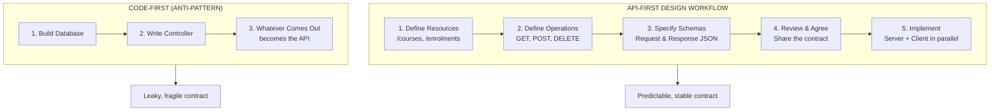
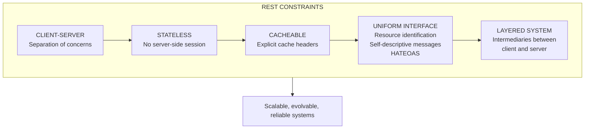

<section lang="en">

## What Is an API and Why Design It First?

An **Application Programming Interface (API)** is a contract between two pieces of software. It says: "If you send me this request, I will send you this response." The "RESTful" part — REpresentational State Transfer — is a set of architectural constraints that make that contract predictable, scalable, and easy to understand.

**Why design the API first?** Most students build the database schema first, then the controller, and the API emerges from whatever the controller happens to return. This is **code-first** development. The alternative is **API-first**: design the contract before writing a single line of code.

| Approach | What Happens | Result |
|---|---|---|
| **Code-first** | Write the controller, then document what it returns | The API reflects implementation details (column names, ORM quirks). Consumers are tightly coupled to internals. |
| **API-first** | Design the request/response shapes, agree on them, then implement | The API reflects the *domain model*, not the database. Consumers are decoupled from internals. |

An API that leaks database column names (`created_at`, `pivot.user_role`) forces every mobile app, frontend, and third-party integration to change when you rename a column. An API designed from the consumer's perspective uses domain names (`registeredAt`, `role`) that remain stable even when the implementation changes.

**The API-first workflow** works like this:

1. Define the resources (nouns: `/courses`, `/enrolments`)
2. Define the operations on those resources (verbs: `GET`, `POST`, `DELETE`)
3. Specify request and response schemas (what JSON fields go in and out)
4. Share the specification for review *before* coding
5. Implement the server and client in parallel

This is the same principle behind **Design by Contract**: define the interface first, verify that both sides satisfy it, and you catch mismatches before they reach production.

</section>

<section lang="id">

## Apa Itu API dan Mengapa Merancangnya Terlebih Dahulu?

**Application Programming Interface (API)** adalah kontrak antara dua bagian perangkat lunak. Ia mengatakan: "Jika Anda mengirim saya permintaan ini, saya akan mengirim Anda respons ini." Bagian "RESTful" — REpresentational State Transfer — adalah seperangkat batasan arsitektur yang membuat kontrak tersebut dapat diprediksi, skalabel, dan mudah dipahami.

**Mengapa merancang API terlebih dahulu?** Sebagian besar mahasiswa membangun skema database terlebih dahulu, lalu controller, dan API muncul dari apa pun yang dikembalikan controller. Ini adalah pengembangan **code-first**. Alternatifnya adalah **API-first**: rancang kontrak sebelum menulis satu baris kode pun.

| Pendekatan | Yang Terjadi | Hasilnya |
|---|---|---|
| **Code-first** | Tulis controller, lalu dokumentasikan apa yang dikembalikannya | API mencerminkan detail implementasi (nama kolom, keanehan ORM). Konsumen sangat terikat dengan internal. |
| **API-first** | Rancang bentuk request/response, sepakati, lalu implementasikan | API mencerminkan *domain model*, bukan database. Konsumen terlepas dari internal. |

API yang membocorkan nama kolom database (`created_at`, `pivot.user_role`) memaksa setiap aplikasi mobile, frontend, dan integrasi pihak ketiga untuk berubah ketika Anda mengganti nama kolom. API yang dirancang dari perspektif konsumen menggunakan nama domain (`registeredAt`, `role`) yang tetap stabil bahkan ketika implementasi berubah.

**Alur kerja API-first** bekerja seperti ini:

1. Tentukan resource (kata benda: `/courses`, `/enrolments`)
2. Tentukan operasi pada resource tersebut (kata kerja: `GET`, `POST`, `DELETE`)
3. Spesifikasikan skema request dan response (field JSON apa yang masuk dan keluar)
4. Bagikan spesifikasi untuk ditinjau *sebelum* coding
5. Implementasikan server dan client secara paralel

Ini adalah prinsip yang sama di balik **Design by Contract**: definisikan antarmuka terlebih dahulu, verifikasi bahwa kedua sisi memenuhinya, dan Anda menangkap ketidakcocokan sebelum mencapai produksi.

</section>

<figure class="my-10 text-center" role="figure">



<figcaption class="mt-3 text-sm text-neutral-500">
  <span lang="en">Figure: API-first design vs code-first development</span>
  <span lang="id">Gambar: Perancangan API-first vs pengembangan code-first</span>
</figcaption>
</figure>

---

<section lang="en">

## REST Constraints in Plain Terms

Roy Fielding defined REST in his 2000 doctoral dissertation. It is not a protocol (like HTTP), not a format (like JSON), and not a standard (like SOAP). It is an **architectural style** — a set of constraints that, when followed, produce systems with specific desirable properties.

### 1. Client-Server

The client (mobile app, browser, another service) and the server (your PHP application) are separate concerns. The client owns the UI and user experience. The server owns the data and business logic. They communicate only through the API.

**Why it matters:** You can rewrite the frontend from Vue to React without touching a single line of backend code. You can migrate the database from MySQL to PostgreSQL without changing the mobile app.

### 2. Stateless

Each request from the client to the server must contain **all** the information needed to understand and process it. The server does not store client session state between requests.

**What stateless means in practice:**

- ❌ "Remember that I authenticated two requests ago." — The server must receive credentials on every request.
- ✅ Every request carries an `Authorization: Bearer <token>` header.
- ❌ "Give me the next page — you know which one I am on." — The server must receive the page number explicitly.
- ✅ `GET /courses?page=3&per_page=20`

**Why it matters:** Stateless services scale horizontally. Any instance of your application can handle any request because there is no sticky session pinning a user to a specific server.

### 3. Cacheable

Responses must explicitly declare whether they can be cached and for how long. The `Cache-Control` header tells intermediaries (browsers, CDNs, proxies) how to treat the response.

```
Cache-Control: public, max-age=3600   # Cache for 1 hour
Cache-Control: no-cache               # Always revalidate
Cache-Control: no-store               # Never store (banking, health data)
```

**Why it matters:** A cached list of courses served from a CDN near the user's location is faster and cheaper than hitting your PHP server on every request.

### 4. Uniform Interface

This is the most distinctive REST constraint and has four sub-constraints:

| Sub-constraint | Meaning | Example |
|---|---|---|
| **Resource identification** | Every resource has a URI | `/courses/42` identifies course 42 |
| **Manipulation through representations** | The client sends a representation of the desired state | `PUT /courses/42` with `{"name": "New Name"}` |
| **Self-descriptive messages** | The response contains enough information to process it | `Content-Type: application/json` tells the client how to parse the body |
| **HATEOAS** | Responses include links to related resources | `{"_links": {"enrolments": "/courses/42/enrolments"}}` |

### 5. Layered System

The client cannot tell whether it is connected directly to the application server, to a load balancer, or to a caching proxy. Layers sit between the client and the server, each providing a specific function (caching, authentication, rate limiting, logging).

**Why it matters:** You can insert a rate limiter between your API and the internet, or add a caching layer, without changing the client or the server.

</section>

<section lang="id">

## Batasan REST dalam Bahasa Sederhana

Roy Fielding mendefinisikan REST dalam disertasi doktoralnya tahun 2000. REST bukanlah protokol (seperti HTTP), bukan format (seperti JSON), dan bukan standar (seperti SOAP). REST adalah **gaya arsitektur** — seperangkat batasan yang, ketika diikuti, menghasilkan sistem dengan properti spesifik yang diinginkan.

### 1. Client-Server

Client (aplikasi mobile, browser, layanan lain) dan server (aplikasi PHP Anda) adalah urusan yang terpisah. Client memiliki UI dan pengalaman pengguna. Server memiliki data dan logika bisnis. Mereka berkomunikasi hanya melalui API.

**Mengapa ini penting:** Anda dapat menulis ulang frontend dari Vue ke React tanpa menyentuh satu baris kode backend pun. Anda dapat memigrasikan database dari MySQL ke PostgreSQL tanpa mengubah aplikasi mobile.

### 2. Stateless

Setiap request dari client ke server harus berisi **semua** informasi yang dibutuhkan untuk memahami dan memprosesnya. Server tidak menyimpan state sesi client di antara request.

**Apa arti stateless dalam praktik:**

- ❌ "Ingat bahwa saya sudah autentikasi dua request yang lalu." — Server harus menerima kredensial pada setiap request.
- ✅ Setiap request membawa header `Authorization: Bearer <token>`.
- ❌ "Berikan saya halaman berikutnya — Anda tahu saya sedang di halaman mana." — Server harus menerima nomor halaman secara eksplisit.
- ✅ `GET /courses?page=3&per_page=20`

**Mengapa ini penting:** Layanan stateless dapat diskalakan secara horizontal. Instance aplikasi mana pun dapat menangani request apa pun karena tidak ada sticky session yang mengikat pengguna ke server tertentu.

### 3. Cacheable

Response harus secara eksplisit menyatakan apakah mereka dapat di-cache dan untuk berapa lama. Header `Cache-Control` memberi tahu perantara (browser, CDN, proxy) bagaimana memperlakukan response.

```
Cache-Control: public, max-age=3600   # Cache selama 1 jam
Cache-Control: no-cache               # Selalu validasi ulang
Cache-Control: no-store               # Jangan pernah simpan (data perbankan, kesehatan)
```

**Mengapa ini penting:** Daftar mata kuliah yang di-cache yang dilayani dari CDN dekat lokasi pengguna lebih cepat dan lebih murah daripada mengenai server PHP Anda pada setiap request.

### 4. Uniform Interface

Ini adalah batasan REST yang paling khas dan memiliki empat sub-batasan:

| Sub-batasan | Arti | Contoh |
|---|---|---|
| **Identifikasi resource** | Setiap resource memiliki URI | `/courses/42` mengidentifikasi mata kuliah 42 |
| **Manipulasi melalui representasi** | Client mengirim representasi dari state yang diinginkan | `PUT /courses/42` dengan `{"name": "Nama Baru"}` |
| **Pesan self-descriptive** | Response berisi informasi yang cukup untuk memprosesnya | `Content-Type: application/json` memberi tahu client cara mengurai body |
| **HATEOAS** | Response menyertakan tautan ke resource terkait | `{"_links": {"enrolments": "/courses/42/enrolments"}}` |

### 5. Layered System

Client tidak dapat membedakan apakah ia terhubung langsung ke server aplikasi, ke load balancer, atau ke caching proxy. Lapisan berada di antara client dan server, masing-masing menyediakan fungsi spesifik (caching, autentikasi, rate limiting, logging).

**Mengapa ini penting:** Anda dapat menyisipkan rate limiter antara API Anda dan internet, atau menambahkan lapisan caching, tanpa mengubah client atau server.

</section>

<figure class="my-10 text-center" role="figure">



<figcaption class="mt-3 text-sm text-neutral-500">
  <span lang="en">Figure: The five core REST constraints defined by Roy Fielding</span>
  <span lang="id">Gambar: Lima batasan inti REST yang didefinisikan oleh Roy Fielding</span>
</figcaption>
</figure>

---

<section lang="en">

## Resource Modelling

REST APIs model the application domain as a collection of **resources**. A resource is any named piece of information: a course, a student, an enrolment, a payment receipt. Resources are nouns — never verbs.

### Nouns, Not Verbs

| ❌ Wrong | ✅ Correct | Reasoning |
|---|---|---|
| `/getAllCourses` | `GET /courses` | The HTTP method already says "get." The URI names the resource. |
| `/createEnrolment` | `POST /enrolments` | The HTTP method already says "create." |
| `/deleteStudent/5` | `DELETE /students/5` | The HTTP method already says "delete." |
| `/searchCourses?q=math` | `GET /courses?q=math` | Searching is reading, and reading is `GET`. |

### Singleton vs Collection Resources

| URI Pattern | Type | Example |
|---|---|---|
| `/courses` | Collection | List all courses or create a new course |
| `/courses/42` | Singleton | A specific course identified by ID |
| `/courses/42/enrolments` | Sub-collection | Enrolments belonging to course 42 |
| `/courses/42/enrolments/7` | Sub-singleton | A specific enrolment on course 42 |

### URI Design Rules

1. **Use plural nouns for collections.** `/courses`, not `/course`. Consistency is more important than grammatical correctness.
2. **Use kebab-case for multi-word resources.** `/course-materials`, not `/courseMaterials` or `/course_materials`.
3. **Nest resources to express ownership, but limit depth to two levels.** `/courses/42/enrolments` is fine. `/courses/42/enrolments/7/payments/3/receipts` is not.
4. **Do not include file extensions.** `/courses/42`, not `/courses/42.json`. The `Accept` header handles format negotiation.
5. **Do not include trailing slashes.** `/courses` and `/courses/42` — never `/courses/` or `/courses/42/`.

### Modelling a Course Registration Domain

Let us model the resources for a course registration system:

| Resource | URI | Operations |
|---|---|---|
| Courses | `/courses` | `GET` (list), `POST` (create) |
| Single course | `/courses/{id}` | `GET` (view), `PUT` (update), `DELETE` (remove) |
| Students | `/students` | `GET` (list), `POST` (register) |
| Single student | `/students/{id}` | `GET` (view), `PUT` (update) |
| Enrolments | `/enrolments` | `GET` (list), `POST` (enrol) |
| Single enrolment | `/enrolments/{id}` | `GET` (view), `DELETE` (cancel) |
| Course enrolments | `/courses/{id}/enrolments` | `GET` (list enrolees) |
| Student enrolments | `/students/{id}/enrolments` | `GET` (student's schedule) |

Both `/courses/{id}/enrolments` and `/students/{id}/enrolments` return enrolments, but filtered by a different parent. This is intentional — they represent the same data from two different perspectives, and both are valid RESTful resources.

</section>

<section lang="id">

## Pemodelan Resource

REST API memodelkan domain aplikasi sebagai kumpulan **resource**. Resource adalah setiap bagian informasi yang bernama: mata kuliah, mahasiswa, pendaftaran, tanda terima pembayaran. Resource adalah kata benda — tidak pernah kata kerja.

### Kata Benda, Bukan Kata Kerja

| ❌ Salah | ✅ Benar | Alasan |
|---|---|---|
| `/getAllCourses` | `GET /courses` | HTTP method sudah mengatakan "ambil." URI menamai resource-nya. |
| `/createEnrolment` | `POST /enrolments` | HTTP method sudah mengatakan "buat." |
| `/deleteStudent/5` | `DELETE /students/5` | HTTP method sudah mengatakan "hapus." |
| `/searchCourses?q=math` | `GET /courses?q=math` | Mencari adalah membaca, dan membaca adalah `GET`. |

### Resource Singleton vs Collection

| Pola URI | Tipe | Contoh |
|---|---|---|
| `/courses` | Collection | Daftar semua mata kuliah atau buat mata kuliah baru |
| `/courses/42` | Singleton | Mata kuliah spesifik yang diidentifikasi oleh ID |
| `/courses/42/enrolments` | Sub-collection | Pendaftaran milik mata kuliah 42 |
| `/courses/42/enrolments/7` | Sub-singleton | Pendaftaran spesifik pada mata kuliah 42 |

### Aturan Perancangan URI

1. **Gunakan kata benda jamak untuk collections.** `/courses`, bukan `/course`. Konsistensi lebih penting daripada kebenaran tata bahasa.
2. **Gunakan kebab-case untuk resource multi-kata.** `/course-materials`, bukan `/courseMaterials` atau `/course_materials`.
3. **Sarang resource untuk mengekspresikan kepemilikan, tetapi batasi kedalaman hingga dua level.** `/courses/42/enrolments` bagus. `/courses/42/enrolments/7/payments/3/receipts` tidak.
4. **Jangan sertakan ekstensi file.** `/courses/42`, bukan `/courses/42.json`. Header `Accept` menangani negosiasi format.
5. **Jangan sertakan trailing slash.** `/courses` dan `/courses/42` — jangan pernah `/courses/` atau `/courses/42/`.

### Memodelkan Domain Registrasi Mata Kuliah

Mari kita modelkan resource untuk sistem registrasi mata kuliah:

| Resource | URI | Operasi |
|---|---|---|
| Mata kuliah | `/courses` | `GET` (list), `POST` (buat) |
| Satu mata kuliah | `/courses/{id}` | `GET` (lihat), `PUT` (perbarui), `DELETE` (hapus) |
| Mahasiswa | `/students` | `GET` (list), `POST` (daftar) |
| Satu mahasiswa | `/students/{id}` | `GET` (lihat), `PUT` (perbarui) |
| Pendaftaran | `/enrolments` | `GET` (list), `POST` (daftar) |
| Satu pendaftaran | `/enrolments/{id}` | `GET` (lihat), `DELETE` (batal) |
| Pendaftaran mata kuliah | `/courses/{id}/enrolments` | `GET` (list peserta) |
| Pendaftaran mahasiswa | `/students/{id}/enrolments` | `GET` (jadwal mahasiswa) |

Baik `/courses/{id}/enrolments` maupun `/students/{id}/enrolments` mengembalikan pendaftaran, tetapi difilter berdasarkan parent yang berbeda. Ini disengaja — keduanya merepresentasikan data yang sama dari dua perspektif berbeda, dan keduanya adalah resource RESTful yang valid.

</section>

---

<section lang="en">

## HTTP Verbs and Idempotency

REST APIs use HTTP methods (verbs) to express the intent of a request. Choosing the right method is not pedantry — it is how caches, proxies, and retry mechanisms know what they can safely do with your request.

### The Primary HTTP Methods

| Method | Purpose | Safe | Idempotent | Example |
|---|---|---|---|---|
| `GET` | Retrieve a resource | ✅ | ✅ | `GET /courses/42` |
| `POST` | Create a new resource | ❌ | ❌ | `POST /courses` |
| `PUT` | Replace a resource (full update) | ❌ | ✅ | `PUT /courses/42` |
| `PATCH` | Partially update a resource | ❌ | ❌ | `PATCH /courses/42` |
| `DELETE` | Remove a resource | ❌ | ✅ | `DELETE /courses/42` |

### Safe vs Idempotent

A **safe** method does not modify the resource. `GET` is safe — calling it 100 times produces the same server state as calling it once (assuming no other requests interleave). Safe methods can be called by crawlers, previews, and link unfurling services without side effects.

An **idempotent** method produces the same result whether called once or ten times. `PUT` is idempotent: sending `PUT /courses/42 {"name": "Calculus"}` ten times results in one course named "Calculus." `DELETE` is idempotent: the first call removes the resource; subsequent calls return 404 but do not change anything else.

**`POST` is neither safe nor idempotent.** Two identical `POST /enrolments` requests create two enrolments. This is why browsers warn you before refreshing a page that resulted from a `POST` — refreshing re-sends the `POST` and creates a duplicate.

### Why Idempotency Matters

When a network timeout causes the client to retry a request, the server must handle it correctly:

- **Idempotent method (`PUT`, `DELETE`):** Retrying is safe. Apply it again.
- **Non-idempotent method (`POST`):** Retrying may create a duplicate. The client must implement an **idempotency key** — a unique value sent in a header like `Idempotency-Key: abc-123`. The server checks whether it has already processed a request with that key and returns the original result instead of creating a duplicate.

### Laravel Route Definitions

Here is how you define RESTful routes in Laravel:

```php
// routes/api.php

use App\Http\Controllers\Api\CourseController;
use App\Http\Controllers\Api\EnrolmentController;
use Illuminate\Support\Facades\Route;

// Collection routes — no {id} parameter
Route::get('/courses', [CourseController::class, 'index']);    // List
Route::post('/courses', [CourseController::class, 'store']);    // Create

// Singleton routes — with {id} parameter
Route::get('/courses/{id}', [CourseController::class, 'show']);    // Read
Route::put('/courses/{id}', [CourseController::class, 'update']);  // Full update
Route::patch('/courses/{id}', [CourseController::class, 'update']); // Partial update
Route::delete('/courses/{id}', [CourseController::class, 'destroy']); // Delete

// Nested resource: enrolments under a course
Route::get('/courses/{courseId}/enrolments', [EnrolmentController::class, 'index']);
Route::post('/courses/{courseId}/enrolments', [EnrolmentController::class, 'store']);

// Enrolments as a top-level resource
Route::get('/enrolments/{id}', [EnrolmentController::class, 'show']);
Route::delete('/enrolments/{id}', [EnrolmentController::class, 'destroy']);
```

**Laravel tip:** Use `Route::apiResource()` for standard CRUD endpoints. It generates all six standard routes in one line:

```php
Route::apiResource('courses', CourseController::class);
// Generates: GET /courses, POST /courses, GET /courses/{course}, PUT /courses/{course}, PATCH /courses/{course}, DELETE /courses/{course}
```

For nested resources, Laravel provides nested resource routing:

```php
Route::apiResource('courses.enrolments', EnrolmentController::class);
// Generates: GET /courses/{course}/enrolments, POST /courses/{course}/enrolments, etc.
```

</section>

<section lang="id">

## HTTP Verb dan Idempotensi

REST API menggunakan HTTP method (verb) untuk mengekspresikan maksud dari sebuah request. Memilih method yang tepat bukanlah kepedantikan — ini adalah bagaimana cache, proxy, dan mekanisme retry mengetahui apa yang dapat mereka lakukan dengan aman terhadap request Anda.

### HTTP Method Utama

| Method | Tujuan | Safe | Idempotent | Contoh |
|---|---|---|---|---|
| `GET` | Mengambil resource | ✅ | ✅ | `GET /courses/42` |
| `POST` | Membuat resource baru | ❌ | ❌ | `POST /courses` |
| `PUT` | Mengganti resource (update penuh) | ❌ | ✅ | `PUT /courses/42` |
| `PATCH` | Memperbarui sebagian resource | ❌ | ❌ | `PATCH /courses/42` |
| `DELETE` | Menghapus resource | ❌ | ✅ | `DELETE /courses/42` |

### Safe vs Idempotent

Method **safe** tidak memodifikasi resource. `GET` bersifat safe — memanggilnya 100 kali menghasilkan state server yang sama dengan memanggilnya sekali (dengan asumsi tidak ada request lain yang menyela). Method safe dapat dipanggil oleh crawler, preview, dan layanan link unfurling tanpa efek samping.

Method **idempotent** menghasilkan hasil yang sama baik dipanggil sekali maupun sepuluh kali. `PUT` bersifat idempotent: mengirim `PUT /courses/42 {"name": "Kalkulus"}` sepuluh kali menghasilkan satu mata kuliah bernama "Kalkulus." `DELETE` bersifat idempotent: panggilan pertama menghapus resource; panggilan berikutnya mengembalikan 404 tetapi tidak mengubah apa pun lagi.

**`POST` tidak safe dan tidak idempotent.** Dua request `POST /enrolments` yang identik membuat dua pendaftaran. Inilah sebabnya browser memperingatkan Anda sebelum me-refresh halaman yang dihasilkan dari `POST` — me-refresh akan mengirim ulang `POST` dan membuat duplikat.

### Mengapa Idempotensi Penting

Ketika timeout jaringan menyebabkan client mencoba ulang request, server harus menanganinya dengan benar:

- **Method idempotent (`PUT`, `DELETE`):** Mencoba ulang aman. Terapkan lagi.
- **Method non-idempotent (`POST`):** Mencoba ulang dapat membuat duplikat. Client harus mengimplementasikan **idempotency key** — nilai unik yang dikirim dalam header seperti `Idempotency-Key: abc-123`. Server memeriksa apakah sudah memproses request dengan key tersebut dan mengembalikan hasil asli alih-alih membuat duplikat.

### Definisi Route Laravel

Berikut adalah cara mendefinisikan route RESTful di Laravel:

```php
// routes/api.php

use App\Http\Controllers\Api\CourseController;
use App\Http\Controllers\Api\EnrolmentController;
use Illuminate\Support\Facades\Route;

// Route collection — tanpa parameter {id}
Route::get('/courses', [CourseController::class, 'index']);     // List
Route::post('/courses', [CourseController::class, 'store']);    // Buat

// Route singleton — dengan parameter {id}
Route::get('/courses/{id}', [CourseController::class, 'show']);    // Baca
Route::put('/courses/{id}', [CourseController::class, 'update']);  // Update penuh
Route::patch('/courses/{id}', [CourseController::class, 'update']); // Update sebagian
Route::delete('/courses/{id}', [CourseController::class, 'destroy']); // Hapus

// Nested resource: pendaftaran di bawah mata kuliah
Route::get('/courses/{courseId}/enrolments', [EnrolmentController::class, 'index']);
Route::post('/courses/{courseId}/enrolments', [EnrolmentController::class, 'store']);

// Pendaftaran sebagai resource top-level
Route::get('/enrolments/{id}', [EnrolmentController::class, 'show']);
Route::delete('/enrolments/{id}', [EnrolmentController::class, 'destroy']);
```

**Tips Laravel:** Gunakan `Route::apiResource()` untuk endpoint CRUD standar. Ia menghasilkan keenam route standar dalam satu baris:

```php
Route::apiResource('courses', CourseController::class);
// Menghasilkan: GET /courses, POST /courses, GET /courses/{course}, PUT /courses/{course}, PATCH /courses/{course}, DELETE /courses/{course}
```

Untuk resource bersarang, Laravel menyediakan nested resource routing:

```php
Route::apiResource('courses.enrolments', EnrolmentController::class);
// Menghasilkan: GET /courses/{course}/enrolments, POST /courses/{course}/enrolments, dll.
```

</section>

---

<section lang="en">

## Status Codes and Error Responses

HTTP status codes tell the client what happened with their request — at a glance, without parsing the body. Using the correct status code is one of the simplest and highest-impact improvements you can make to an API.

### The Three Families

| Range | Family | Meaning |
|---|---|---|
| `2xx` | Success | The request was received, understood, and accepted. |
| `4xx` | Client Error | The client made a mistake (bad input, unauthenticated, forbidden, not found). |
| `5xx` | Server Error | The server failed to fulfil a valid request (database down, bug, timeout). |

### The Codes You Actually Need

You do not need to memorise all 60+ HTTP status codes. These twelve cover virtually every REST API scenario:

| Code | Constant | When to Use |
|---|---|---|
| `200` | OK | `GET`, `PUT`, `PATCH` succeeded. |
| `201` | Created | `POST` succeeded and a resource was created. Always include a `Location` header pointing to the new resource. |
| `204` | No Content | `DELETE` succeeded. There is no body. |
| `400` | Bad Request | The request body is malformed or fails validation. Include details of *which* fields failed. |
| `401` | Unauthorized | The request lacks valid authentication credentials. |
| `403` | Forbidden | The credentials are valid but the user does not have access to this resource. |
| `404` | Not Found | The requested resource does not exist. |
| `409` | Conflict | The request conflicts with the current state (e.g., duplicate enrolment). |
| `422` | Unprocessable Entity | Validation failed — the syntax is correct but the semantics are wrong (e.g., `age: -5`). |
| `429` | Too Many Requests | Rate limit exceeded. Include a `Retry-After` header. |
| `500` | Internal Server Error | Something unexpected went wrong on the server. |
| `503` | Service Unavailable | The server is temporarily down for maintenance or overloaded. |

### A Consistent Error Envelope

Every error response should share the same structure so that clients write a single error handler. Here is the recommended shape:

```json
{
    "error": {
        "code": "VALIDATION_FAILED",
        "message": "The given data was invalid.",
        "details": [
            {
                "field": "nim",
                "message": "The nim field is required."
            },
            {
                "field": "course_id",
                "message": "The selected course_id is invalid."
            }
        ]
    }
}
```

**Rules for a good error envelope:**

1. `code` is a machine-readable, snake_case identifier. Clients can `switch` on it.
2. `message` is a human-readable summary for developers and logs.
3. `details` is an array of field-level errors when applicable (`400`/`422`).

### Implementing a Consistent Error Response in Laravel

Laravel's `app/Exceptions/Handler.php` is the single place to centralise error formatting:

```php
// app/Exceptions/Handler.php

namespace App\Exceptions;

use Illuminate\Auth\AuthenticationException;
use Illuminate\Database\Eloquent\ModelNotFoundException;
use Illuminate\Foundation\Exceptions\Handler as ExceptionHandler;
use Illuminate\Validation\ValidationException;
use Symfony\Component\HttpKernel\Exception\NotFoundHttpException;
use Throwable;

class Handler extends ExceptionHandler
{
    public function register(): void
    {
        $this->renderable(function (ValidationException $e) {
            return response()->json([
                'error' => [
                    'code' => 'VALIDATION_FAILED',
                    'message' => 'The given data was invalid.',
                    'details' => collect($e->errors())
                        ->map(fn($messages, $field) => [
                            'field' => $field,
                            'message' => $messages[0],
                        ])
                        ->values()
                        ->toArray(),
                ],
            ], 422);
        });

        $this->renderable(function (ModelNotFoundException|NotFoundHttpException $e) {
            return response()->json([
                'error' => [
                    'code' => 'RESOURCE_NOT_FOUND',
                    'message' => 'The requested resource was not found.',
                    'details' => [],
                ],
            ], 404);
        });

        $this->renderable(function (AuthenticationException $e) {
            return response()->json([
                'error' => [
                    'code' => 'UNAUTHENTICATED',
                    'message' => 'Valid authentication credentials are required.',
                    'details' => [],
                ],
            ], 401);
        });

        $this->renderable(function (Throwable $e) {
            if (app()->environment('production')) {
                return response()->json([
                    'error' => [
                        'code' => 'INTERNAL_ERROR',
                        'message' => 'An unexpected error occurred.',
                        'details' => [],
                    ],
                ], 500);
            }
        });
    }
}
```

**Key decisions in this handler:**

- `ModelNotFoundException` and `NotFoundHttpException` both produce a `404` with a consistent envelope.
- Validation errors return `422` with field-level details — clients can highlight the specific form fields that failed.
- In production, unhandled exceptions return a generic `500` message. In development, you get the full stack trace (Laravel's default behaviour).
- Authentication errors (`401`) are separate from authorisation errors. You would add a similar handler for `AuthorizationException` returning `403`.

</section>

<section lang="id">

## Status Code dan Respons Error

HTTP status code memberi tahu client apa yang terjadi dengan request mereka — sekilas, tanpa mengurai body. Menggunakan status code yang benar adalah salah satu peningkatan paling sederhana dan berdampak tertinggi yang dapat Anda lakukan pada sebuah API.

### Tiga Keluarga

| Rentang | Keluarga | Arti |
|---|---|---|
| `2xx` | Sukses | Request telah diterima, dipahami, dan diterima. |
| `4xx` | Client Error | Client membuat kesalahan (input buruk, tidak terautentikasi, dilarang, tidak ditemukan). |
| `5xx` | Server Error | Server gagal memenuhi request yang valid (database mati, bug, timeout). |

### Kode yang Benar-Benar Anda Butuhkan

Anda tidak perlu menghafal semua 60+ HTTP status code. Dua belas kode ini mencakup hampir setiap skenario REST API:

| Kode | Konstanta | Kapan Digunakan |
|---|---|---|
| `200` | OK | `GET`, `PUT`, `PATCH` berhasil. |
| `201` | Created | `POST` berhasil dan resource telah dibuat. Selalu sertakan header `Location` yang menunjuk ke resource baru. |
| `204` | No Content | `DELETE` berhasil. Tidak ada body. |
| `400` | Bad Request | Body request salah format atau gagal validasi. Sertakan detail field *mana* yang gagal. |
| `401` | Unauthorized | Request tidak memiliki kredensial autentikasi yang valid. |
| `403` | Forbidden | Kredensial valid tetapi pengguna tidak memiliki akses ke resource ini. |
| `404` | Not Found | Resource yang diminta tidak ada. |
| `409` | Conflict | Request konflik dengan state saat ini (misalnya, pendaftaran duplikat). |
| `422` | Unprocessable Entity | Validasi gagal — sintaks benar tetapi semantiknya salah (misalnya, `age: -5`). |
| `429` | Too Many Requests | Rate limit terlampaui. Sertakan header `Retry-After`. |
| `500` | Internal Server Error | Sesuatu yang tidak terduga salah di server. |
| `503` | Service Unavailable | Server sementara tidak tersedia untuk pemeliharaan atau kelebihan beban. |

### Amplop Error yang Konsisten

Setiap respons error harus memiliki struktur yang sama sehingga client menulis satu penangan error. Berikut adalah bentuk yang direkomendasikan:

```json
{
    "error": {
        "code": "VALIDATION_FAILED",
        "message": "Data yang diberikan tidak valid.",
        "details": [
            {
                "field": "nim",
                "message": "Field nim wajib diisi."
            },
            {
                "field": "course_id",
                "message": "course_id yang dipilih tidak valid."
            }
        ]
    }
}
```

**Aturan untuk amplop error yang baik:**

1. `code` adalah identifier snake_case yang dapat dibaca mesin. Client dapat melakukan `switch` padanya.
2. `message` adalah ringkasan yang dapat dibaca manusia untuk pengembang dan log.
3. `details` adalah array kesalahan tingkat field jika berlaku (`400`/`422`).

### Mengimplementasikan Respons Error yang Konsisten di Laravel

`app/Exceptions/Handler.php` Laravel adalah satu-satunya tempat untuk menyentralisasi format error:

```php
// app/Exceptions/Handler.php

namespace App\Exceptions;

use Illuminate\Auth\AuthenticationException;
use Illuminate\Database\Eloquent\ModelNotFoundException;
use Illuminate\Foundation\Exceptions\Handler as ExceptionHandler;
use Illuminate\Validation\ValidationException;
use Symfony\Component\HttpKernel\Exception\NotFoundHttpException;
use Throwable;

class Handler extends ExceptionHandler
{
    public function register(): void
    {
        $this->renderable(function (ValidationException $e) {
            return response()->json([
                'error' => [
                    'code' => 'VALIDATION_FAILED',
                    'message' => 'Data yang diberikan tidak valid.',
                    'details' => collect($e->errors())
                        ->map(fn($messages, $field) => [
                            'field' => $field,
                            'message' => $messages[0],
                        ])
                        ->values()
                        ->toArray(),
                ],
            ], 422);
        });

        $this->renderable(function (ModelNotFoundException|NotFoundHttpException $e) {
            return response()->json([
                'error' => [
                    'code' => 'RESOURCE_NOT_FOUND',
                    'message' => 'Resource yang diminta tidak ditemukan.',
                    'details' => [],
                ],
            ], 404);
        });

        $this->renderable(function (AuthenticationException $e) {
            return response()->json([
                'error' => [
                    'code' => 'UNAUTHENTICATED',
                    'message' => 'Diperlukan kredensial autentikasi yang valid.',
                    'details' => [],
                ],
            ], 401);
        });

        $this->renderable(function (Throwable $e) {
            if (app()->environment('production')) {
                return response()->json([
                    'error' => [
                        'code' => 'INTERNAL_ERROR',
                        'message' => 'Terjadi kesalahan yang tidak terduga.',
                        'details' => [],
                    ],
                ], 500);
            }
        });
    }
}
```

**Keputusan kunci dalam handler ini:**

- `ModelNotFoundException` dan `NotFoundHttpException` keduanya menghasilkan `404` dengan amplop yang konsisten.
- Error validasi mengembalikan `422` dengan detail tingkat field — client dapat menyorot field form spesifik yang gagal.
- Di production, exception yang tidak tertangani mengembalikan pesan `500` generik. Di development, Anda mendapatkan stack trace lengkap (perilaku default Laravel).
- Error autentikasi (`401`) terpisah dari error otorisasi. Anda akan menambahkan handler serupa untuk `AuthorizationException` yang mengembalikan `403`.

</section>

---

<section lang="en">

## Request/Response Formats and Versioning

### JSON Conventions

REST APIs overwhelmingly use JSON. Consistency in how you name keys, format dates, and structure responses is more important than the specific convention you choose — but you must choose one and stick to it.

| Convention | Recommendation | Example |
|---|---|---|
| **Key casing** | `camelCase` | `"courseName": "Calculus I"` |
| **Dates** | ISO 8601 (`YYYY-MM-DDTHH:MM:SS±HH:MM`) | `"createdAt": "2026-07-27T09:00:00+07:00"` |
| **IDs** | Strings (even if numeric internally) | `"id": "42"` |
| **Boolean** | `true`/`false`, not `1`/`0` or `"yes"`/`"no"` | `"isActive": true` |
| **Empty values** | `null` for absent data, empty array `[]` for empty collections | `"prerequisite": null` |
| **Envelopes** | Wrap collections in an object with `data` + `meta` | `{"data": [...], "meta": {...}}` |

### API Versioning

APIs change over time. Versioning lets you introduce breaking changes without breaking existing clients.

**Three common strategies:**

| Strategy | How It Works | Pros | Cons |
|---|---|---|---|
| **URI versioning** | `/api/v1/courses` | Simplest to understand and test. Visible in logs. | Couples version to URL. |
| **Header versioning** | `Accept: application/vnd.sepolinema.v1+json` | Clean URIs. Can version per resource type. | Harder to test in browser. Invisible in logs. |
| **Query parameter** | `/api/courses?version=1` | Easy to test. | Pollutes resource namespace. Easy to forget. |

**Recommendation for learning projects:** Use **URI versioning** (`/api/v1/`). It is the simplest to implement, test with `curl`, and debug. For larger projects, header versioning scales better.

### Laravel Implementation

Prefix all v1 routes with `/api/v1`:

```php
// routes/api.php

Route::prefix('v1')->group(function () {
    Route::apiResource('courses', \App\Http\Controllers\Api\V1\CourseController::class);
    Route::apiResource('students', \App\Http\Controllers\Api\V1\StudentController::class);
    Route::apiResource('enrolments', \App\Http\Controllers\Api\V1\EnrolmentController::class);
});
```

When you need to introduce breaking changes, create a `v2` prefix and a new set of controllers. Both versions run side by side until all clients migrate.

### JSON Response Helpers in Laravel

Laravel provides expressive helpers for JSON responses. Consistent use of these reduces boilerplate and enforces a uniform shape:

```php
use Illuminate\Http\JsonResponse;

// Success — 200
return response()->json(['data' => $course]);

// Created — 201 with Location header
return response()->json(['data' => $course], 201)
    ->header('Location', url("/api/v1/courses/{$course->id}"));

// No Content — 204 (no body)
return response()->noContent();

// Validation error — 422
return response()->json([
    'error' => [
        'code' => 'VALIDATION_FAILED',
        'message' => 'The given data was invalid.',
        'details' => [['field' => 'name', 'message' => 'The name field is required.']],
    ],
], 422);
```

</section>

<section lang="id">

## Format Request/Response dan Versioning

### Konvensi JSON

REST API sebagian besar menggunakan JSON. Konsistensi dalam cara Anda menamai key, memformat tanggal, dan menyusun respons lebih penting daripada konvensi spesifik yang Anda pilih — tetapi Anda harus memilih satu dan patuh padanya.

| Konvensi | Rekomendasi | Contoh |
|---|---|---|
| **Kapitalisasi key** | `camelCase` | `"courseName": "Kalkulus I"` |
| **Tanggal** | ISO 8601 (`YYYY-MM-DDTHH:MM:SS±HH:MM`) | `"createdAt": "2026-07-27T09:00:00+07:00"` |
| **ID** | String (meskipun secara internal numerik) | `"id": "42"` |
| **Boolean** | `true`/`false`, bukan `1`/`0` atau `"yes"`/`"no"` | `"isActive": true` |
| **Nilai kosong** | `null` untuk data yang tidak ada, array kosong `[]` untuk collection kosong | `"prerequisite": null` |
| **Envelope** | Bungkus collection dalam objek dengan `data` + `meta` | `{"data": [...], "meta": {...}}` |

### API Versioning

API berubah seiring waktu. Versioning memungkinkan Anda memperkenalkan breaking changes tanpa merusak client yang sudah ada.

**Tiga strategi umum:**

| Strategi | Cara Kerja | Kelebihan | Kekurangan |
|---|---|---|---|
| **URI versioning** | `/api/v1/courses` | Paling sederhana untuk dipahami dan diuji. Terlihat di log. | Menggabungkan versi dengan URL. |
| **Header versioning** | `Accept: application/vnd.sepolinema.v1+json` | URI bersih. Dapat mengelola versi per tipe resource. | Lebih sulit diuji di browser. Tidak terlihat di log. |
| **Query parameter** | `/api/courses?version=1` | Mudah diuji. | Mengotori namespace resource. Mudah dilupakan. |

**Rekomendasi untuk proyek pembelajaran:** Gunakan **URI versioning** (`/api/v1/`). Ini paling sederhana untuk diimplementasikan, diuji dengan `curl`, dan di-debug. Untuk proyek yang lebih besar, header versioning lebih skalabel.

### Implementasi Laravel

Awali semua route v1 dengan `/api/v1`:

```php
// routes/api.php

Route::prefix('v1')->group(function () {
    Route::apiResource('courses', \App\Http\Controllers\Api\V1\CourseController::class);
    Route::apiResource('students', \App\Http\Controllers\Api\V1\StudentController::class);
    Route::apiResource('enrolments', \App\Http\Controllers\Api\V1\EnrolmentController::class);
});
```

Ketika Anda perlu memperkenalkan breaking changes, buat prefix `v2` dan set controller baru. Kedua versi berjalan berdampingan hingga semua client bermigrasi.

### Helper JSON Response di Laravel

Laravel menyediakan helper ekspresif untuk response JSON. Penggunaan yang konsisten mengurangi boilerplate dan menegakkan bentuk yang seragam:

```php
use Illuminate\Http\JsonResponse;

// Sukses — 200
return response()->json(['data' => $course]);

// Created — 201 dengan Location header
return response()->json(['data' => $course], 201)
    ->header('Location', url("/api/v1/courses/{$course->id}"));

// No Content — 204 (tanpa body)
return response()->noContent();

// Error validasi — 422
return response()->json([
    'error' => [
        'code' => 'VALIDATION_FAILED',
        'message' => 'Data yang diberikan tidak valid.',
        'details' => [['field' => 'name', 'message' => 'Field nama wajib diisi.']],
    ],
], 422);
```

</section>

---

<section lang="en">

## Pagination, Filtering, and Sorting

When a collection endpoint returns data, it must support pagination. Returning 10,000 records in a single response consumes memory, bandwidth, and time — on both the server and the client.

### Offset Pagination

The simplest form: the client says "give me page N with M items per page."

```
GET /api/v1/courses?page=2&per_page=20
```

Response:

```json
{
    "data": [
        { "id": "21", "name": "Linear Algebra" },
        { "id": "22", "name": "Discrete Mathematics" }
    ],
    "meta": {
        "currentPage": 2,
        "perPage": 20,
        "total": 150,
        "lastPage": 8
    },
    "links": {
        "first": "/api/v1/courses?page=1",
        "prev": "/api/v1/courses?page=1",
        "next": "/api/v1/courses?page=3",
        "last": "/api/v1/courses?page=8"
    }
}
```

**Laravel makes pagination trivial:**

```php
public function index(): JsonResponse
{
    $courses = Course::query()
        ->orderBy('name')
        ->paginate(20);

    return response()->json([
        'data' => $courses->items(),
        'meta' => [
            'currentPage' => $courses->currentPage(),
            'perPage' => $courses->perPage(),
            'total' => $courses->total(),
            'lastPage' => $courses->lastPage(),
        ],
        'links' => [
            'first' => $courses->url(1),
            'prev' => $courses->previousPageUrl(),
            'next' => $courses->nextPageUrl(),
            'last' => $courses->url($courses->lastPage()),
        ],
    ]);
}
```

### Filtering

Use query parameters to filter collections. The parameter names should match the resource's attributes:

```
GET /api/v1/courses?semester=4&isActive=true
```

**Laravel implementation using query scopes:**

```php
public function index(Request $request): JsonResponse
{
    $courses = Course::query()
        ->when($request->has('semester'), fn($q) => $q->where('semester', $request->semester))
        ->when($request->has('isActive'), fn($q) => $q->where('is_active', $request->boolean('isActive')))
        ->when($request->has('q'), fn($q) => $q->where('name', 'like', '%' . $request->q . '%'))
        ->paginate(20);

    return response()->json([/* ... */]);
}
```

The `when()` method conditionally applies a filter only when the query parameter is present and non-empty. This avoids a cascade of `if` statements.

### Sorting

```
GET /api/v1/courses?sort=name&order=asc
GET /api/v1/courses?sort=credits&order=desc
```

```php
$sortField = in_array($request->get('sort'), ['name', 'credits', 'created_at'])
    ? $request->get('sort')
    : 'name';

$sortOrder = $request->get('order') === 'desc' ? 'desc' : 'asc';

$courses = Course::query()
    ->orderBy($sortField, $sortOrder)
    ->paginate(20);
```

**Security note:** Never pass raw user input directly to `orderBy`. Always validate against a whitelist of allowed columns. Otherwise, an attacker can sort by any column in your database and potentially infer data they should not see.

### Combined Example

```
GET /api/v1/courses?semester=4&sort=credits&order=desc&page=1&per_page=10
```

This reads: "Give me semester-4 courses, sorted by credits descending, first page, 10 items per page." Every parameter is optional, semantic, and self-documenting.

</section>

<section lang="id">

## Pagination, Filtering, dan Sorting

Ketika endpoint collection mengembalikan data, ia harus mendukung pagination. Mengembalikan 10.000 record dalam satu response mengonsumsi memori, bandwidth, dan waktu — baik di server maupun client.

### Offset Pagination

Bentuk paling sederhana: client mengatakan "berikan saya halaman N dengan M item per halaman."

```
GET /api/v1/courses?page=2&per_page=20
```

Response:

```json
{
    "data": [
        { "id": "21", "name": "Aljabar Linear" },
        { "id": "22", "name": "Matematika Diskrit" }
    ],
    "meta": {
        "currentPage": 2,
        "perPage": 20,
        "total": 150,
        "lastPage": 8
    },
    "links": {
        "first": "/api/v1/courses?page=1",
        "prev": "/api/v1/courses?page=1",
        "next": "/api/v1/courses?page=3",
        "last": "/api/v1/courses?page=8"
    }
}
```

**Laravel membuat pagination menjadi sederhana:**

```php
public function index(): JsonResponse
{
    $courses = Course::query()
        ->orderBy('name')
        ->paginate(20);

    return response()->json([
        'data' => $courses->items(),
        'meta' => [
            'currentPage' => $courses->currentPage(),
            'perPage' => $courses->perPage(),
            'total' => $courses->total(),
            'lastPage' => $courses->lastPage(),
        ],
        'links' => [
            'first' => $courses->url(1),
            'prev' => $courses->previousPageUrl(),
            'next' => $courses->nextPageUrl(),
            'last' => $courses->url($courses->lastPage()),
        ],
    ]);
}
```

### Filtering

Gunakan query parameter untuk memfilter collection. Nama parameter harus cocok dengan atribut resource:

```
GET /api/v1/courses?semester=4&isActive=true
```

**Implementasi Laravel menggunakan query scope:**

```php
public function index(Request $request): JsonResponse
{
    $courses = Course::query()
        ->when($request->has('semester'), fn($q) => $q->where('semester', $request->semester))
        ->when($request->has('isActive'), fn($q) => $q->where('is_active', $request->boolean('isActive')))
        ->when($request->has('q'), fn($q) => $q->where('name', 'like', '%' . $request->q . '%'))
        ->paginate(20);

    return response()->json([/* ... */]);
}
```

Method `when()` secara kondisional menerapkan filter hanya ketika query parameter ada dan tidak kosong. Ini menghindari kaskade statement `if`.

### Sorting

```
GET /api/v1/courses?sort=name&order=asc
GET /api/v1/courses?sort=credits&order=desc
```

```php
$sortField = in_array($request->get('sort'), ['name', 'credits', 'created_at'])
    ? $request->get('sort')
    : 'name';

$sortOrder = $request->get('order') === 'desc' ? 'desc' : 'asc';

$courses = Course::query()
    ->orderBy($sortField, $sortOrder)
    ->paginate(20);
```

**Catatan keamanan:** Jangan pernah meneruskan input pengguna mentah langsung ke `orderBy`. Selalu validasi terhadap whitelist kolom yang diizinkan. Jika tidak, penyerang dapat mengurutkan berdasarkan kolom apa pun di database Anda dan berpotensi menyimpulkan data yang seharusnya tidak mereka lihat.

### Contoh Gabungan

```
GET /api/v1/courses?semester=4&sort=credits&order=desc&page=1&per_page=10
```

Ini berarti: "Berikan saya mata kuliah semester 4, diurutkan berdasarkan SKS menurun, halaman pertama, 10 item per halaman." Setiap parameter bersifat opsional, semantik, dan mendokumentasikan dirinya sendiri.

</section>

---

<section lang="en">

## Authentication Basics

An API that exposes private data — student records, enrolment history, grades — must authenticate every request. REST's stateless constraint means you cannot rely on server-side sessions. Every request must carry its own credentials.

### API Keys vs JWT

| Mechanism | How It Works | Best For |
|---|---|---|
| **API Key** | A long random string sent in a header. The server looks it up in a database. | Server-to-server communication, internal services, simple scripts. |
| **JWT (JSON Web Token)** | A signed token containing user identity and claims. The server verifies the signature; no database lookup needed. | User-facing APIs, mobile apps, single-page applications. |

### Where Tokens Live

- ✅ `Authorization: Bearer <token>` header — the standard. Works with every HTTP client.
- ❌ Query parameter (`?token=abc123`) — leaks tokens into server logs, browser history, and referrer headers.
- ❌ Cookie — acceptable for browser-based apps but not truly RESTful (cookies are state).
- ❌ Request body — `GET` and `DELETE` requests have no body.

### Laravel Sanctum for API Tokens

Laravel Sanctum provides a lightweight token-based authentication system ideal for SPAs and mobile apps:

```bash
composer require laravel/sanctum
php artisan vendor:publish --provider="Laravel\Sanctum\SanctumServiceProvider"
php artisan migrate
```

Add the `HasApiTokens` trait to your `User` model:

```php
// app/Models/User.php

namespace App\Models;

use Illuminate\Foundation\Auth\User as Authenticatable;
use Laravel\Sanctum\HasApiTokens;

class User extends Authenticatable
{
    use HasApiTokens;
}
```

Issue a token on login:

```php
// app/Http/Controllers/Api/V1/AuthController.php

namespace App\Http\Controllers\Api\V1;

use App\Http\Controllers\Controller;
use App\Models\User;
use Illuminate\Http\JsonResponse;
use Illuminate\Http\Request;
use Illuminate\Support\Facades\Hash;
use Illuminate\Validation\ValidationException;

class AuthController extends Controller
{
    public function login(Request $request): JsonResponse
    {
        $request->validate([
            'email' => 'required|email',
            'password' => 'required',
        ]);

        $user = User::where('email', $request->email)->first();

        if (! $user || ! Hash::check($request->password, $user->password)) {
            throw ValidationException::withMessages([
                'email' => ['The provided credentials are incorrect.'],
            ]);
        }

        $token = $user->createToken('api-token')->plainTextToken;

        return response()->json([
            'data' => [
                'token' => $token,
                'tokenType' => 'Bearer',
            ],
        ]);
    }

    public function logout(Request $request): JsonResponse
    {
        $request->user()->currentAccessToken()->delete();

        return response()->noContent();
    }
}
```

Protect routes with the `auth:sanctum` middleware:

```php
// routes/api.php

Route::prefix('v1')->group(function () {
    Route::post('/login', [AuthController::class, 'login']);

    Route::middleware('auth:sanctum')->group(function () {
        Route::post('/logout', [AuthController::class, 'logout']);
        Route::apiResource('courses', CourseController::class)->except(['index', 'show']);
        Route::apiResource('enrolments', EnrolmentController::class);
    });

    // Public read access
    Route::apiResource('courses', CourseController::class)->only(['index', 'show']);
});
```

This configuration:
- Allows anyone to list and view courses without authentication.
- Requires authentication for creating, updating, or deleting courses.
- Requires authentication for all enrolment operations.
- Issues tokens on login and revokes them on logout.

</section>

<section lang="id">

## Dasar-Dasar Autentikasi

API yang mengekspos data pribadi — catatan mahasiswa, riwayat pendaftaran, nilai — harus mengautentikasi setiap request. Batasan stateless REST berarti Anda tidak dapat mengandalkan sesi sisi server. Setiap request harus membawa kredensialnya sendiri.

### API Key vs JWT

| Mekanisme | Cara Kerja | Cocok Untuk |
|---|---|---|
| **API Key** | String acak panjang yang dikirim dalam header. Server mencarinya di database. | Komunikasi server-ke-server, layanan internal, skrip sederhana. |
| **JWT (JSON Web Token)** | Token yang ditandatangani berisi identitas pengguna dan klaim. Server memverifikasi tanda tangan; tidak perlu pencarian database. | API yang menghadap pengguna, aplikasi mobile, single-page application. |

### Di Mana Token Berada

- ✅ Header `Authorization: Bearer <token>` — standar. Bekerja dengan setiap HTTP client.
- ❌ Query parameter (`?token=abc123`) — membocorkan token ke log server, riwayat browser, dan header referrer.
- ❌ Cookie — dapat diterima untuk aplikasi berbasis browser tetapi tidak benar-benar RESTful (cookie adalah state).
- ❌ Body request — request `GET` dan `DELETE` tidak memiliki body.

### Laravel Sanctum untuk Token API

Laravel Sanctum menyediakan sistem autentikasi berbasis token yang ringan, ideal untuk SPA dan aplikasi mobile:

```bash
composer require laravel/sanctum
php artisan vendor:publish --provider="Laravel\Sanctum\SanctumServiceProvider"
php artisan migrate
```

Tambahkan trait `HasApiTokens` ke model `User` Anda:

```php
// app/Models/User.php

namespace App\Models;

use Illuminate\Foundation\Auth\User as Authenticatable;
use Laravel\Sanctum\HasApiTokens;

class User extends Authenticatable
{
    use HasApiTokens;
}
```

Terbitkan token saat login:

```php
// app/Http/Controllers/Api/V1/AuthController.php

namespace App\Http\Controllers\Api\V1;

use App\Http\Controllers\Controller;
use App\Models\User;
use Illuminate\Http\JsonResponse;
use Illuminate\Http\Request;
use Illuminate\Support\Facades\Hash;
use Illuminate\Validation\ValidationException;

class AuthController extends Controller
{
    public function login(Request $request): JsonResponse
    {
        $request->validate([
            'email' => 'required|email',
            'password' => 'required',
        ]);

        $user = User::where('email', $request->email)->first();

        if (! $user || ! Hash::check($request->password, $user->password)) {
            throw ValidationException::withMessages([
                'email' => ['Kredensial yang diberikan salah.'],
            ]);
        }

        $token = $user->createToken('api-token')->plainTextToken;

        return response()->json([
            'data' => [
                'token' => $token,
                'tokenType' => 'Bearer',
            ],
        ]);
    }

    public function logout(Request $request): JsonResponse
    {
        $request->user()->currentAccessToken()->delete();

        return response()->noContent();
    }
}
```

Lindungi route dengan middleware `auth:sanctum`:

```php
// routes/api.php

Route::prefix('v1')->group(function () {
    Route::post('/login', [AuthController::class, 'login']);

    Route::middleware('auth:sanctum')->group(function () {
        Route::post('/logout', [AuthController::class, 'logout']);
        Route::apiResource('courses', CourseController::class)->except(['index', 'show']);
        Route::apiResource('enrolments', EnrolmentController::class);
    });

    // Akses baca publik
    Route::apiResource('courses', CourseController::class)->only(['index', 'show']);
});
```

Konfigurasi ini:
- Mengizinkan siapa pun untuk melihat daftar dan detail mata kuliah tanpa autentikasi.
- Memerlukan autentikasi untuk membuat, memperbarui, atau menghapus mata kuliah.
- Memerlukan autentikasi untuk semua operasi pendaftaran.
- Menerbitkan token saat login dan mencabutnya saat logout.

</section>

---

<section lang="en">

## Hands-On: Build a Course Registration API with Laravel

Enough theory. Let us build a working API for a university course registration system. The API supports three resources: **students**, **courses**, and **enrolments**. A student enrols in a course, and the system prevents duplicate enrolment.

### Step 1: Create the Laravel Project

```bash
composer create-project laravel/laravel course-registration-api
cd course-registration-api
composer require laravel/sanctum
php artisan install:api
```

### Step 2: Create Models and Migrations

**Course migration:**

```bash
php artisan make:model Course -m
```

```php
// database/migrations/xxxx_xx_xx_create_courses_table.php

Schema::create('courses', function (Blueprint $table) {
    $table->id();
    $table->string('code')->unique();        // e.g., "TI4C3"
    $table->string('name');                   // e.g., "Web Programming"
    $table->unsignedTinyInteger('credits');   // SKS (1–6)
    $table->unsignedTinyInteger('semester');  // 1–8
    $table->boolean('is_active')->default(true);
    $table->timestamps();
});
```

**Course model:**

```php
// app/Models/Course.php

namespace App\Models;

use Illuminate\Database\Eloquent\Model;

class Course extends Model
{
    protected $fillable = ['code', 'name', 'credits', 'semester', 'is_active'];

    protected function casts(): array
    {
        return [
            'is_active' => 'boolean',
            'credits' => 'integer',
            'semester' => 'integer',
        ];
    }

    public function enrolments()
    {
        return $this->hasMany(Enrolment::class);
    }
}
```

**Student migration:**

```bash
php artisan make:model Student -m
```

```php
// database/migrations/xxxx_xx_xx_create_students_table.php

Schema::create('students', function (Blueprint $table) {
    $table->id();
    $table->string('nim')->unique();         // Student ID number
    $table->string('name');
    $table->string('study_program');          // e.g., "D-IV Teknik Informatika"
    $table->timestamps();
});
```

**Student model:**

```php
// app/Models/Student.php

namespace App\Models;

use Illuminate\Database\Eloquent\Model;

class Student extends Model
{
    protected $fillable = ['nim', 'name', 'study_program'];

    public function enrolments()
    {
        return $this->hasMany(Enrolment::class);
    }
}
```

**Enrolment migration:**

```bash
php artisan make:model Enrolment -m
```

```php
// database/migrations/xxxx_xx_xx_create_enrolments_table.php

Schema::create('enrolments', function (Blueprint $table) {
    $table->id();
    $table->foreignId('student_id')->constrained()->cascadeOnDelete();
    $table->foreignId('course_id')->constrained()->cascadeOnDelete();
    $table->timestamps();

    // Prevent duplicate enrolment
    $table->unique(['student_id', 'course_id']);
});
```

**Enrolment model:**

```php
// app/Models/Enrolment.php

namespace App\Models;

use Illuminate\Database\Eloquent\Model;

class Enrolment extends Model
{
    protected $fillable = ['student_id', 'course_id'];

    public function student()
    {
        return $this->belongsTo(Student::class);
    }

    public function course()
    {
        return $this->belongsTo(Course::class);
    }
}
```

### Step 3: Create FormRequest Validation Classes

```bash
php artisan make:request StoreCourseRequest
php artisan make:request UpdateCourseRequest
php artisan make:request StoreEnrolmentRequest
```

```php
// app/Http/Requests/StoreCourseRequest.php

namespace App\Http\Requests;

use Illuminate\Foundation\Http\FormRequest;

class StoreCourseRequest extends FormRequest
{
    public function rules(): array
    {
        return [
            'code' => 'required|string|max:10|unique:courses,code',
            'name' => 'required|string|max:255',
            'credits' => 'required|integer|min:1|max:6',
            'semester' => 'required|integer|min:1|max:8',
            'is_active' => 'boolean',
        ];
    }
}
```

```php
// app/Http/Requests/StoreEnrolmentRequest.php

namespace App\Http\Requests;

use Illuminate\Foundation\Http\FormRequest;

class StoreEnrolmentRequest extends FormRequest
{
    public function rules(): array
    {
        return [
            'student_id' => 'required|exists:students,id',
            'course_id' => 'required|exists:courses,id',
        ];
    }

    public function messages(): array
    {
        return [
            'student_id.exists' => 'Student not found.',
            'course_id.exists' => 'Course not found.',
        ];
    }
}
```

Run the migrations:

```bash
php artisan migrate
```

### Step 4: Create the Controllers

```bash
php artisan make:controller Api/V1/CourseController
php artisan make:controller Api/V1/EnrolmentController
```

```php
// app/Http/Controllers/Api/V1/CourseController.php

namespace App\Http\Controllers\Api\V1;

use App\Http\Controllers\Controller;
use App\Http\Requests\StoreCourseRequest;
use App\Http\Requests\UpdateCourseRequest;
use App\Models\Course;
use Illuminate\Http\JsonResponse;
use Illuminate\Http\Request;

class CourseController extends Controller
{
    public function index(Request $request): JsonResponse
    {
        $courses = Course::query()
            ->when($request->has('semester'), fn($q) => $q->where('semester', $request->semester))
            ->when($request->has('is_active'), fn($q) => $q->where('is_active', $request->boolean('is_active')))
            ->when($request->has('q'), fn($q) => $q->where('name', 'like', '%' . $request->q . '%'))
            ->orderBy('name')
            ->paginate($request->integer('per_page', 20));

        return response()->json([
            'data' => $courses->items(),
            'meta' => [
                'currentPage' => $courses->currentPage(),
                'perPage' => $courses->perPage(),
                'total' => $courses->total(),
                'lastPage' => $courses->lastPage(),
            ],
        ]);
    }

    public function store(StoreCourseRequest $request): JsonResponse
    {
        $course = Course::create($request->validated());

        return response()->json(['data' => $course], 201)
            ->header('Location', url("/api/v1/courses/{$course->id}"));
    }

    public function show(Course $course): JsonResponse
    {
        return response()->json(['data' => $course]);
    }

    public function update(UpdateCourseRequest $request, Course $course): JsonResponse
    {
        $course->update($request->validated());

        return response()->json(['data' => $course]);
    }

    public function destroy(Course $course): JsonResponse
    {
        $course->delete();

        return response()->noContent();
    }
}
```

```php
// app/Http/Controllers/Api/V1/EnrolmentController.php

namespace App\Http\Controllers\Api\V1;

use App\Http\Controllers\Controller;
use App\Http\Requests\StoreEnrolmentRequest;
use App\Models\Enrolment;
use Illuminate\Http\JsonResponse;
use Illuminate\Http\Request;
use Illuminate\Validation\ValidationException;

class EnrolmentController extends Controller
{
    public function index(Request $request): JsonResponse
    {
        $enrolments = Enrolment::query()
            ->with(['student:id,nim,name', 'course:id,code,name,credits'])
            ->when($request->has('student_id'), fn($q) => $q->where('student_id', $request->student_id))
            ->when($request->has('course_id'), fn($q) => $q->where('course_id', $request->course_id))
            ->latest()
            ->paginate($request->integer('per_page', 20));

        return response()->json([
            'data' => $enrolments->items(),
            'meta' => [
                'currentPage' => $enrolments->currentPage(),
                'perPage' => $enrolments->perPage(),
                'total' => $enrolments->total(),
                'lastPage' => $enrolments->lastPage(),
            ],
        ]);
    }

    public function store(StoreEnrolmentRequest $request): JsonResponse
    {
        $exists = Enrolment::where('student_id', $request->student_id)
            ->where('course_id', $request->course_id)
            ->exists();

        if ($exists) {
            throw ValidationException::withMessages([
                'course_id' => ['Student is already enrolled in this course.'],
            ]);
        }

        $enrolment = Enrolment::create($request->validated());

        return response()->json(['data' => $enrolment->load(['student:id,nim,name', 'course:id,code,name'])], 201)
            ->header('Location', url("/api/v1/enrolments/{$enrolment->id}"));
    }

    public function show(Enrolment $enrolment): JsonResponse
    {
        return response()->json(['data' => $enrolment->load(['student:id,nim,name', 'course:id,code,name,credits'])]);
    }

    public function destroy(Enrolment $enrolment): JsonResponse
    {
        $enrolment->delete();

        return response()->noContent();
    }
}
```

Note how `show()` and `store()` use `load()` to eagerly load relationships after the model is created or retrieved. Laravel's route model binding resolves the `{enrolment}` parameter to an `Enrolment` instance automatically, but relationships are not loaded until you ask for them.

### Step 5: Define the Routes

```php
// routes/api.php

use App\Http\Controllers\Api\V1\AuthController;
use App\Http\Controllers\Api\V1\CourseController;
use App\Http\Controllers\Api\V1\EnrolmentController;
use Illuminate\Support\Facades\Route;

Route::prefix('v1')->group(function () {
    // Public: authentication
    Route::post('/login', [AuthController::class, 'login']);

    // Public: read-only course access
    Route::get('/courses', [CourseController::class, 'index']);
    Route::get('/courses/{course}', [CourseController::class, 'show']);

    // Authenticated: everything else
    Route::middleware('auth:sanctum')->group(function () {
        Route::post('/logout', [AuthController::class, 'logout']);

        Route::post('/courses', [CourseController::class, 'store']);
        Route::put('/courses/{course}', [CourseController::class, 'update']);
        Route::patch('/courses/{course}', [CourseController::class, 'update']);
        Route::delete('/courses/{course}', [CourseController::class, 'destroy']);

        Route::apiResource('enrolments', EnrolmentController::class);

        Route::get('/students/{student}/enrolments', [EnrolmentController::class, 'index']);
        Route::get('/courses/{course}/enrolments', [EnrolmentController::class, 'index']);
    });
});
```

### Step 6: Seed Test Data

```bash
php artisan make:seeder CourseRegistrationSeeder
```

```php
// database/seeders/CourseRegistrationSeeder.php

namespace Database\Seeders;

use App\Models\Course;
use App\Models\Student;
use Illuminate\Database\Seeder;

class CourseRegistrationSeeder extends Seeder
{
    public function run(): void
    {
        $student = Student::create([
            'nim' => '2241720001',
            'name' => 'Budi Santoso',
            'study_program' => 'D-IV Teknik Informatika',
        ]);

        $courses = [
            ['code' => 'TI4C1', 'name' => 'Web Programming', 'credits' => 4, 'semester' => 4],
            ['code' => 'TI4C2', 'name' => 'Mobile Programming', 'credits' => 4, 'semester' => 4],
            ['code' => 'TI4C3', 'name' => 'Software Engineering', 'credits' => 3, 'semester' => 4],
            ['code' => 'TI5C1', 'name' => 'Data Mining', 'credits' => 3, 'semester' => 5],
            ['code' => 'TI5C2', 'name' => 'Cloud Computing', 'credits' => 3, 'semester' => 5],
        ];

        foreach ($courses as $course) {
            Course::create($course);
        }
    }
}
```

```bash
php artisan db:seed --class=CourseRegistrationSeeder
```

### Step 7: Test Your API

Start the development server:

```bash
php artisan serve
```

**Test with curl:**

```bash
# List all courses
curl -s http://localhost:8000/api/v1/courses | python3 -m json.tool

# List only semester-4 courses
curl -s "http://localhost:8000/api/v1/courses?semester=4" | python3 -m json.tool

# View a single course
curl -s http://localhost:8000/api/v1/courses/1 | python3 -m json.tool

# Attempt to create a course without authentication (should return 401)
curl -s -w "\nHTTP %{http_code}\n" -X POST http://localhost:8000/api/v1/courses \
  -H "Content-Type: application/json" \
  -d '{"code":"TI6C1","name":"AI Fundamentals","credits":3,"semester":6}'

# Log in and save the token
TOKEN=$(curl -s -X POST http://localhost:8000/api/v1/login \
  -H "Content-Type: application/json" \
  -d '{"email":"test@example.com","password":"password"}' | \
  python3 -c "import sys,json; print(json.load(sys.stdin)['data']['token'])")

# Create a course (authenticated)
curl -s -X POST http://localhost:8000/api/v1/courses \
  -H "Content-Type: application/json" \
  -H "Authorization: Bearer $TOKEN" \
  -d '{"code":"TI6C1","name":"AI Fundamentals","credits":3,"semester":6}' | \
  python3 -m json.tool

# Enrol the student in a course
curl -s -X POST http://localhost:8000/api/v1/enrolments \
  -H "Content-Type: application/json" \
  -H "Authorization: Bearer $TOKEN" \
  -d '{"student_id":1,"course_id":1}' | \
  python3 -m json.tool

# Attempt duplicate enrolment (should return 422)
curl -s -w "\nHTTP %{http_code}\n" -X POST http://localhost:8000/api/v1/enrolments \
  -H "Content-Type: application/json" \
  -H "Authorization: Bearer $TOKEN" \
  -d '{"student_id":1,"course_id":1}'

# View all enrolments with related data
curl -s http://localhost:8000/api/v1/enrolments \
  -H "Authorization: Bearer $TOKEN" | \
  python3 -m json.tool

# Cancel an enrolment
curl -s -w "\nHTTP %{http_code}\n" -X DELETE \
  http://localhost:8000/api/v1/enrolments/1 \
  -H "Authorization: Bearer $TOKEN"
```

</section>

<section lang="id">

## Praktik: Bangun API Registrasi Mata Kuliah dengan Laravel

Cukup teori. Mari kita bangun API yang berfungsi untuk sistem registrasi mata kuliah universitas. API ini mendukung tiga resource: **students** (mahasiswa), **courses** (mata kuliah), dan **enrolments** (pendaftaran). Seorang mahasiswa mendaftar mata kuliah, dan sistem mencegah pendaftaran ganda.

### Langkah 1: Buat Proyek Laravel

```bash
composer create-project laravel/laravel course-registration-api
cd course-registration-api
composer require laravel/sanctum
php artisan install:api
```

### Langkah 2: Buat Model dan Migration

**Migration Course:**

```bash
php artisan make:model Course -m
```

```php
// database/migrations/xxxx_xx_xx_create_courses_table.php

Schema::create('courses', function (Blueprint $table) {
    $table->id();
    $table->string('code')->unique();        // misalnya, "TI4C3"
    $table->string('name');                   // misalnya, "Pemrograman Web"
    $table->unsignedTinyInteger('credits');   // SKS (1–6)
    $table->unsignedTinyInteger('semester');  // 1–8
    $table->boolean('is_active')->default(true);
    $table->timestamps();
});
```

**Model Course:**

```php
// app/Models/Course.php

namespace App\Models;

use Illuminate\Database\Eloquent\Model;

class Course extends Model
{
    protected $fillable = ['code', 'name', 'credits', 'semester', 'is_active'];

    protected function casts(): array
    {
        return [
            'is_active' => 'boolean',
            'credits' => 'integer',
            'semester' => 'integer',
        ];
    }

    public function enrolments()
    {
        return $this->hasMany(Enrolment::class);
    }
}
```

**Migration Student:**

```bash
php artisan make:model Student -m
```

```php
// database/migrations/xxxx_xx_xx_create_students_table.php

Schema::create('students', function (Blueprint $table) {
    $table->id();
    $table->string('nim')->unique();         // Nomor Induk Mahasiswa
    $table->string('name');
    $table->string('study_program');          // misalnya, "D-IV Teknik Informatika"
    $table->timestamps();
});
```

**Model Student:**

```php
// app/Models/Student.php

namespace App\Models;

use Illuminate\Database\Eloquent\Model;

class Student extends Model
{
    protected $fillable = ['nim', 'name', 'study_program'];

    public function enrolments()
    {
        return $this->hasMany(Enrolment::class);
    }
}
```

**Migration Enrolment:**

```bash
php artisan make:model Enrolment -m
```

```php
// database/migrations/xxxx_xx_xx_create_enrolments_table.php

Schema::create('enrolments', function (Blueprint $table) {
    $table->id();
    $table->foreignId('student_id')->constrained()->cascadeOnDelete();
    $table->foreignId('course_id')->constrained()->cascadeOnDelete();
    $table->timestamps();

    // Mencegah pendaftaran duplikat
    $table->unique(['student_id', 'course_id']);
});
```

**Model Enrolment:**

```php
// app/Models/Enrolment.php

namespace App\Models;

use Illuminate\Database\Eloquent\Model;

class Enrolment extends Model
{
    protected $fillable = ['student_id', 'course_id'];

    public function student()
    {
        return $this->belongsTo(Student::class);
    }

    public function course()
    {
        return $this->belongsTo(Course::class);
    }
}
```

### Langkah 3: Buat Kelas Validasi FormRequest

```bash
php artisan make:request StoreCourseRequest
php artisan make:request UpdateCourseRequest
php artisan make:request StoreEnrolmentRequest
```

```php
// app/Http/Requests/StoreCourseRequest.php

namespace App\Http\Requests;

use Illuminate\Foundation\Http\FormRequest;

class StoreCourseRequest extends FormRequest
{
    public function rules(): array
    {
        return [
            'code' => 'required|string|max:10|unique:courses,code',
            'name' => 'required|string|max:255',
            'credits' => 'required|integer|min:1|max:6',
            'semester' => 'required|integer|min:1|max:8',
            'is_active' => 'boolean',
        ];
    }
}
```

```php
// app/Http/Requests/StoreEnrolmentRequest.php

namespace App\Http\Requests;

use Illuminate\Foundation\Http\FormRequest;

class StoreEnrolmentRequest extends FormRequest
{
    public function rules(): array
    {
        return [
            'student_id' => 'required|exists:students,id',
            'course_id' => 'required|exists:courses,id',
        ];
    }

    public function messages(): array
    {
        return [
            'student_id.exists' => 'Mahasiswa tidak ditemukan.',
            'course_id.exists' => 'Mata kuliah tidak ditemukan.',
        ];
    }
}
```

Jalankan migration:

```bash
php artisan migrate
```

### Langkah 4: Buat Controller

```bash
php artisan make:controller Api/V1/CourseController
php artisan make:controller Api/V1/EnrolmentController
```

```php
// app/Http/Controllers/Api/V1/CourseController.php

namespace App\Http\Controllers\Api\V1;

use App\Http\Controllers\Controller;
use App\Http\Requests\StoreCourseRequest;
use App\Http\Requests\UpdateCourseRequest;
use App\Models\Course;
use Illuminate\Http\JsonResponse;
use Illuminate\Http\Request;

class CourseController extends Controller
{
    public function index(Request $request): JsonResponse
    {
        $courses = Course::query()
            ->when($request->has('semester'), fn($q) => $q->where('semester', $request->semester))
            ->when($request->has('is_active'), fn($q) => $q->where('is_active', $request->boolean('is_active')))
            ->when($request->has('q'), fn($q) => $q->where('name', 'like', '%' . $request->q . '%'))
            ->orderBy('name')
            ->paginate($request->integer('per_page', 20));

        return response()->json([
            'data' => $courses->items(),
            'meta' => [
                'currentPage' => $courses->currentPage(),
                'perPage' => $courses->perPage(),
                'total' => $courses->total(),
                'lastPage' => $courses->lastPage(),
            ],
        ]);
    }

    public function store(StoreCourseRequest $request): JsonResponse
    {
        $course = Course::create($request->validated());

        return response()->json(['data' => $course], 201)
            ->header('Location', url("/api/v1/courses/{$course->id}"));
    }

    public function show(Course $course): JsonResponse
    {
        return response()->json(['data' => $course]);
    }

    public function update(UpdateCourseRequest $request, Course $course): JsonResponse
    {
        $course->update($request->validated());

        return response()->json(['data' => $course]);
    }

    public function destroy(Course $course): JsonResponse
    {
        $course->delete();

        return response()->noContent();
    }
}
```

```php
// app/Http/Controllers/Api/V1/EnrolmentController.php

namespace App\Http\Controllers\Api\V1;

use App\Http\Controllers\Controller;
use App\Http\Requests\StoreEnrolmentRequest;
use App\Models\Enrolment;
use Illuminate\Http\JsonResponse;
use Illuminate\Http\Request;
use Illuminate\Validation\ValidationException;

class EnrolmentController extends Controller
{
    public function index(Request $request): JsonResponse
    {
        $enrolments = Enrolment::query()
            ->with(['student:id,nim,name', 'course:id,code,name,credits'])
            ->when($request->has('student_id'), fn($q) => $q->where('student_id', $request->student_id))
            ->when($request->has('course_id'), fn($q) => $q->where('course_id', $request->course_id))
            ->latest()
            ->paginate($request->integer('per_page', 20));

        return response()->json([
            'data' => $enrolments->items(),
            'meta' => [
                'currentPage' => $enrolments->currentPage(),
                'perPage' => $enrolments->perPage(),
                'total' => $enrolments->total(),
                'lastPage' => $enrolments->lastPage(),
            ],
        ]);
    }

    public function store(StoreEnrolmentRequest $request): JsonResponse
    {
        $exists = Enrolment::where('student_id', $request->student_id)
            ->where('course_id', $request->course_id)
            ->exists();

        if ($exists) {
            throw ValidationException::withMessages([
                'course_id' => ['Mahasiswa sudah terdaftar di mata kuliah ini.'],
            ]);
        }

        $enrolment = Enrolment::create($request->validated());

        return response()->json(['data' => $enrolment->load(['student:id,nim,name', 'course:id,code,name'])], 201)
            ->header('Location', url("/api/v1/enrolments/{$enrolment->id}"));
    }

    public function show(Enrolment $enrolment): JsonResponse
    {
        return response()->json(['data' => $enrolment->load(['student:id,nim,name', 'course:id,code,name,credits'])]);
    }

    public function destroy(Enrolment $enrolment): JsonResponse
    {
        $enrolment->delete();

        return response()->noContent();
    }
}
```

Perhatikan bagaimana `show()` dan `store()` menggunakan `load()` untuk eager load relasi setelah model dibuat atau diambil. Route model binding Laravel secara otomatis menyelesaikan parameter `{enrolment}` menjadi instance `Enrolment`, tetapi relasi tidak dimuat sampai Anda memintanya.

### Langkah 5: Definisikan Route

```php
// routes/api.php

use App\Http\Controllers\Api\V1\AuthController;
use App\Http\Controllers\Api\V1\CourseController;
use App\Http\Controllers\Api\V1\EnrolmentController;
use Illuminate\Support\Facades\Route;

Route::prefix('v1')->group(function () {
    // Publik: autentikasi
    Route::post('/login', [AuthController::class, 'login']);

    // Publik: akses baca mata kuliah
    Route::get('/courses', [CourseController::class, 'index']);
    Route::get('/courses/{course}', [CourseController::class, 'show']);

    // Terautentikasi: semua operasi lainnya
    Route::middleware('auth:sanctum')->group(function () {
        Route::post('/logout', [AuthController::class, 'logout']);

        Route::post('/courses', [CourseController::class, 'store']);
        Route::put('/courses/{course}', [CourseController::class, 'update']);
        Route::patch('/courses/{course}', [CourseController::class, 'update']);
        Route::delete('/courses/{course}', [CourseController::class, 'destroy']);

        Route::apiResource('enrolments', EnrolmentController::class);

        Route::get('/students/{student}/enrolments', [EnrolmentController::class, 'index']);
        Route::get('/courses/{course}/enrolments', [EnrolmentController::class, 'index']);
    });
});
```

### Langkah 6: Seed Data Uji

```bash
php artisan make:seeder CourseRegistrationSeeder
```

```php
// database/seeders/CourseRegistrationSeeder.php

namespace Database\Seeders;

use App\Models\Course;
use App\Models\Student;
use Illuminate\Database\Seeder;

class CourseRegistrationSeeder extends Seeder
{
    public function run(): void
    {
        $student = Student::create([
            'nim' => '2241720001',
            'name' => 'Budi Santoso',
            'study_program' => 'D-IV Teknik Informatika',
        ]);

        $courses = [
            ['code' => 'TI4C1', 'name' => 'Pemrograman Web', 'credits' => 4, 'semester' => 4],
            ['code' => 'TI4C2', 'name' => 'Pemrograman Mobile', 'credits' => 4, 'semester' => 4],
            ['code' => 'TI4C3', 'name' => 'Rekayasa Perangkat Lunak', 'credits' => 3, 'semester' => 4],
            ['code' => 'TI5C1', 'name' => 'Data Mining', 'credits' => 3, 'semester' => 5],
            ['code' => 'TI5C2', 'name' => 'Cloud Computing', 'credits' => 3, 'semester' => 5],
        ];

        foreach ($courses as $course) {
            Course::create($course);
        }
    }
}
```

```bash
php artisan db:seed --class=CourseRegistrationSeeder
```

### Langkah 7: Uji API Anda

Jalankan server development:

```bash
php artisan serve
```

**Uji dengan curl:**

```bash
# Lihat semua mata kuliah
curl -s http://localhost:8000/api/v1/courses | python3 -m json.tool

# Lihat mata kuliah semester 4 saja
curl -s "http://localhost:8000/api/v1/courses?semester=4" | python3 -m json.tool

# Lihat satu mata kuliah
curl -s http://localhost:8000/api/v1/courses/1 | python3 -m json.tool

# Coba buat mata kuliah tanpa autentikasi (seharusnya mengembalikan 401)
curl -s -w "\nHTTP %{http_code}\n" -X POST http://localhost:8000/api/v1/courses \
  -H "Content-Type: application/json" \
  -d '{"code":"TI6C1","name":"Dasar AI","credits":3,"semester":6}'

# Login dan simpan token
TOKEN=$(curl -s -X POST http://localhost:8000/api/v1/login \
  -H "Content-Type: application/json" \
  -d '{"email":"test@example.com","password":"password"}' | \
  python3 -c "import sys,json; print(json.load(sys.stdin)['data']['token'])")

# Buat mata kuliah (terautentikasi)
curl -s -X POST http://localhost:8000/api/v1/courses \
  -H "Content-Type: application/json" \
  -H "Authorization: Bearer $TOKEN" \
  -d '{"code":"TI6C1","name":"Dasar AI","credits":3,"semester":6}' | \
  python3 -m json.tool

# Daftarkan mahasiswa ke mata kuliah
curl -s -X POST http://localhost:8000/api/v1/enrolments \
  -H "Content-Type: application/json" \
  -H "Authorization: Bearer $TOKEN" \
  -d '{"student_id":1,"course_id":1}' | \
  python3 -m json.tool

# Coba pendaftaran duplikat (seharusnya mengembalikan 422)
curl -s -w "\nHTTP %{http_code}\n" -X POST http://localhost:8000/api/v1/enrolments \
  -H "Content-Type: application/json" \
  -H "Authorization: Bearer $TOKEN" \
  -d '{"student_id":1,"course_id":1}'

# Lihat semua pendaftaran dengan data terkait
curl -s http://localhost:8000/api/v1/enrolments \
  -H "Authorization: Bearer $TOKEN" | \
  python3 -m json.tool

# Batalkan pendaftaran
curl -s -w "\nHTTP %{http_code}\n" -X DELETE \
  http://localhost:8000/api/v1/enrolments/1 \
  -H "Authorization: Bearer $TOKEN"
```

</section>

---

<section lang="en">

## Common Anti-Patterns

Even experienced developers make these mistakes. Recognising them in code reviews saves months of refactoring later.

### 1. Verbs in URIs

```http
❌ GET  /api/getCourse?id=42
❌ POST /api/createEnrolment
❌ GET  /api/searchStudents
✅ GET  /api/courses/42
✅ POST /api/enrolments
✅ GET  /api/students?q=budi
```

HTTP methods already express the action. The URI names the resource.

### 2. Returning 200 on Errors

```json
// ❌ Client sees 200 and assumes success, then discovers "error" in the body
HTTP 200 OK
{ "error": "Student not found" }

// ✅ Client immediately knows the request failed
HTTP 404 Not Found
{ "error": { "code": "RESOURCE_NOT_FOUND", "message": "..." } }
```

HTTP clients, proxies, and monitoring tools understand `4xx` and `5xx`. They do not understand `200` with a JSON error message.

### 3. Exposing Internal IDs

```json
// ❌ Leaks sequential database IDs
{ "id": 1, "name": "Budi" }

// ✅ Use UUIDs or an opaque identifier
{ "id": "550e8400-e29b-41d4-a716-446655440000", "name": "Budi" }
```

Sequential IDs let adversaries enumerate your resources (`GET /students/1`, `GET /students/2`...). UUIDs prevent this.

### 4. Deep Nesting

```http
❌ GET /api/courses/1/enrolments/5/payments/2/receipts/3
✅ GET /api/receipts/3?enrolment_id=5
```

Deep nesting makes URIs brittle and implies a rigid hierarchy that may not survive domain changes. Flatten the resources and use query parameters for filtering.

### 5. Ignoring Caching

```http
❌ Every GET /courses response is generated fresh from the database
✅ GET /courses returns Cache-Control: public, max-age=300
```

A course catalogue changes infrequently. Five minutes of caching reduces database load by orders of magnitude when the catalogue page receives even moderate traffic.

### 6. Tunnelling Everything Through POST

```http
❌ POST /api/courses/delete    Body: { "id": 42 }
❌ POST /api/courses/update    Body: { "id": 42, "name": "..." }
✅ DELETE /api/courses/42
✅ PUT /api/courses/42         Body: { "name": "..." }
```

This is a holdover from SOAP/XML-RPC and early AJAX libraries that did not support `PUT` or `DELETE`. All modern HTTP clients support the full method set — use them.

### 7. Inconsistent Response Shapes

```json
// Successful list
{ "courses": [...] }

// Successful single
{ "data": { "id": 1, ... } }

// Error
{ "error": "Not found" }
```

A client must write three different parsers for the same API. Every response — success, list, single, error — should share the same envelope structure so the client writes one.

### 8. Embedding Secrets in Responses

```json
// ❌ Never return password hashes, tokens, or internal config
{ "id": 1, "password": "$2y$10$...", "api_token": "abc123" }

// ✅ Return only what the client needs
{ "id": 1, "name": "Budi", "nim": "2241720001" }
```

Laravel's `$hidden` property on Eloquent models prevents this at the serialisation layer:

```php
class User extends Authenticatable
{
    protected $hidden = ['password', 'remember_token'];
}
```

</section>

<section lang="id">

## Anti-Pattern Umum

Bahkan pengembang berpengalaman pun membuat kesalahan ini. Mengenalinya dalam code review menghemat bulan-bulan refactoring di kemudian hari.

### 1. Kata Kerja di URI

```http
❌ GET  /api/getCourse?id=42
❌ POST /api/createEnrolment
❌ GET  /api/searchStudents
✅ GET  /api/courses/42
✅ POST /api/enrolments
✅ GET  /api/students?q=budi
```

HTTP method sudah mengekspresikan tindakan. URI menamai resource.

### 2. Mengembalikan 200 pada Error

```json
// ❌ Client melihat 200 dan menganggap sukses, lalu menemukan "error" di body
HTTP 200 OK
{ "error": "Mahasiswa tidak ditemukan" }

// ✅ Client segera tahu request gagal
HTTP 404 Not Found
{ "error": { "code": "RESOURCE_NOT_FOUND", "message": "..." } }
```

HTTP client, proxy, dan alat monitoring memahami `4xx` dan `5xx`. Mereka tidak memahami `200` dengan pesan error JSON.

### 3. Mengekspos ID Internal

```json
// ❌ Membocorkan ID database sekuensial
{ "id": 1, "name": "Budi" }

// ✅ Gunakan UUID atau identifier buram
{ "id": "550e8400-e29b-41d4-a716-446655440000", "name": "Budi" }
```

ID sekuensial memungkinkan musuh mengenumerasi resource Anda (`GET /students/1`, `GET /students/2`...). UUID mencegah ini.

### 4. Sarang Terlalu Dalam

```http
❌ GET /api/courses/1/enrolments/5/payments/2/receipts/3
✅ GET /api/receipts/3?enrolment_id=5
```

Sarang yang dalam membuat URI rapuh dan menyiratkan hierarki kaku yang mungkin tidak bertahan dari perubahan domain. Ratakan resource dan gunakan query parameter untuk filtering.

### 5. Mengabaikan Caching

```http
❌ Setiap response GET /courses dihasilkan baru dari database
✅ GET /courses mengembalikan Cache-Control: public, max-age=300
```

Katalog mata kuliah jarang berubah. Lima menit caching mengurangi beban database berkali-kali lipat ketika halaman katalog menerima traffic yang bahkan moderat.

### 6. Men-tunnel Semuanya Melalui POST

```http
❌ POST /api/courses/delete    Body: { "id": 42 }
❌ POST /api/courses/update    Body: { "id": 42, "name": "..." }
✅ DELETE /api/courses/42
✅ PUT /api/courses/42         Body: { "name": "..." }
```

Ini adalah sisa dari SOAP/XML-RPC dan library AJAX awal yang tidak mendukung `PUT` atau `DELETE`. Semua HTTP client modern mendukung set method lengkap — gunakanlah.

### 7. Bentuk Response Tidak Konsisten

```json
// Daftar sukses
{ "courses": [...] }

// Tunggal sukses
{ "data": { "id": 1, ... } }

// Error
{ "error": "Tidak ditemukan" }
```

Client harus menulis tiga parser berbeda untuk API yang sama. Setiap response — sukses, daftar, tunggal, error — harus memiliki struktur amplop yang sama sehingga client menulis satu.

### 8. Menyematkan Rahasia dalam Response

```json
// ❌ Jangan pernah mengembalikan hash password, token, atau konfigurasi internal
{ "id": 1, "password": "$2y$10$...", "api_token": "abc123" }

// ✅ Kembalikan hanya apa yang dibutuhkan client
{ "id": 1, "name": "Budi", "nim": "2241720001" }
```

Properti `$hidden` Laravel pada model Eloquent mencegah ini di lapisan serialisasi:

```php
class User extends Authenticatable
{
    protected $hidden = ['password', 'remember_token'];
}
```

</section>

---

<section lang="en">

## Summary and Practice Exercise

### What We Learned

1. **API-first design** creates a contract before implementation — the API reflects the domain model, not the database schema.
2. **REST's five constraints** — client-server, stateless, cacheable, uniform interface, layered system — are not academic trivia. Each one solves a real engineering problem: scalability, reliability, evolvability.
3. **Resources are nouns, not verbs.** The URI identifies the resource. The HTTP method expresses the action. Never the other way around.
4. **HTTP methods have defined semantics.** `GET` is safe. `PUT` and `DELETE` are idempotent. `POST` is neither. Retry logic, caching, and proxy behaviour depend on these properties.
5. **Consistent error responses matter more than which code you pick.** Every error should have a machine-readable `code`, a human-readable `message`, and where applicable, field-level `details`.
6. **Pagination, filtering, and sorting** make collection endpoints usable. Without them, every client that calls your API must implement its own filtering in memory.
7. **Tokens belong in the `Authorization` header.** Never in URLs. Never in the request body. Sanctum makes this straightforward in Laravel.
8. **Anti-patterns are predictable.** Verbs in URIs, 200 on errors, exposing internal IDs, deep nesting, and embedding secrets in responses — avoid them from the start.

### Practice Exercise: Design a Library API

Design a RESTful API for a university library system. The domain supports the following features:

1. **Books** have a title, author, ISBN, publisher, and publication year. A book can have multiple copies.
2. **Members** are students or lecturers. Each has a unique member ID, name, email, and membership type (`student` or `lecturer`).
3. **Loans** track when a member borrows a specific copy of a book and when they return it. A member can borrow at most 3 books at a time.
4. **Reservations** allow a member to reserve a book that is currently on loan. When the book is returned, the first reservation in the queue is notified.

### Exercise Tasks

1. **Model the resources.** Define the URI for each resource and sub-resource (books, copies, members, loans, reservations). Write them as a table.

2. **Define the operations.** For each resource, list which HTTP methods apply and what they do.

3. **Design the response shape for `GET /books`.** Include pagination metadata and a sample book object. Use `camelCase` key names and ISO 8601 dates.

4. **Design the error response for a failed loan attempt.** A member tries to borrow a book when they already have 3 books checked out. What status code, error code, and message do you return?

5. **Implement the `LoanController` in Laravel.** Write the `store` method that:
   - Validates the request (member must exist, copy must exist and be available)
   - Checks the member's loan limit (max 3 active loans)
   - Creates the loan record
   - Returns the loan with the appropriate `201` status and `Location` header

6. **Write curl commands** to test the following scenarios:
   - Create a new book
   - List all books with pagination
   - Borrow a book copy (authenticated)
   - Attempt to borrow a 4th book (should fail with 409 Conflict)
   - Return a book

Compare your design with a classmate's. Did you choose the same URI patterns? The same status codes? These decisions are not arbitrary — every design choice affects how easy your API is to consume, extend, and maintain.

</section>

<section lang="id">

## Ringkasan dan Latihan Praktik

### Apa yang Telah Kita Pelajari

1. **Desain API-first** membuat kontrak sebelum implementasi — API mencerminkan domain model, bukan skema database.
2. **Lima batasan REST** — client-server, stateless, cacheable, uniform interface, layered system — bukan trivia akademis. Masing-masing menyelesaikan masalah rekayasa nyata: skalabilitas, keandalan, kemampuan berevolusi.
3. **Resource adalah kata benda, bukan kata kerja.** URI mengidentifikasi resource. HTTP method mengekspresikan tindakan. Jangan pernah sebaliknya.
4. **HTTP method memiliki semantik yang terdefinisi.** `GET` bersifat safe. `PUT` dan `DELETE` bersifat idempotent. `POST` bukan keduanya. Logika retry, caching, dan perilaku proxy bergantung pada properti ini.
5. **Response error yang konsisten lebih penting daripada kode mana yang Anda pilih.** Setiap error harus memiliki `code` yang dapat dibaca mesin, `message` yang dapat dibaca manusia, dan jika berlaku, `details` tingkat field.
6. **Pagination, filtering, dan sorting** membuat endpoint collection dapat digunakan. Tanpanya, setiap client yang memanggil API Anda harus mengimplementasikan filtering sendiri di memori.
7. **Token berada di header `Authorization`.** Jangan pernah di URL. Jangan pernah di body request. Sanctum membuat ini mudah di Laravel.
8. **Anti-pattern dapat diprediksi.** Kata kerja di URI, 200 pada error, mengekspos ID internal, sarang terlalu dalam, dan menyematkan rahasia dalam response — hindari sejak awal.

### Latihan Praktik: Rancang API Perpustakaan

Rancang RESTful API untuk sistem perpustakaan universitas. Domain mendukung fitur-fitur berikut:

1. **Buku** memiliki judul, penulis, ISBN, penerbit, dan tahun terbit. Sebuah buku dapat memiliki beberapa salinan.
2. **Anggota** adalah mahasiswa atau dosen. Masing-masing memiliki ID anggota unik, nama, email, dan tipe keanggotaan (`student` atau `lecturer`).
3. **Peminjaman** melacak kapan anggota meminjam salinan spesifik buku dan kapan mereka mengembalikannya. Seorang anggota dapat meminjam maksimal 3 buku sekaligus.
4. **Reservasi** memungkinkan anggota memesan buku yang sedang dipinjam. Ketika buku dikembalikan, reservasi pertama dalam antrian akan diberi tahu.

### Tugas Latihan

1. **Modelkan resource.** Definisikan URI untuk setiap resource dan sub-resource (buku, salinan, anggota, peminjaman, reservasi). Tulis dalam bentuk tabel.

2. **Definisikan operasi.** Untuk setiap resource, daftarkan HTTP method mana yang berlaku dan apa yang mereka lakukan.

3. **Rancang bentuk response untuk `GET /books`.** Sertakan metadata pagination dan objek buku contoh. Gunakan nama key `camelCase` dan tanggal ISO 8601.

4. **Rancang response error untuk upaya peminjaman yang gagal.** Seorang anggota mencoba meminjam buku ketika mereka sudah memiliki 3 buku yang dipinjam. Status code, error code, dan message apa yang Anda kembalikan?

5. **Implementasikan `LoanController` di Laravel.** Tulis method `store` yang:
   - Memvalidasi request (anggota harus ada, salinan harus ada dan tersedia)
   - Memeriksa batas peminjaman anggota (maks 3 peminjaman aktif)
   - Membuat catatan peminjaman
   - Mengembalikan peminjaman dengan status `201` dan header `Location` yang sesuai

6. **Tulis perintah curl** untuk menguji skenario berikut:
   - Membuat buku baru
   - Mendaftar semua buku dengan pagination
   - Meminjam salinan buku (terautentikasi)
   - Mencoba meminjam buku ke-4 (harus gagal dengan 409 Conflict)
   - Mengembalikan buku

Bandingkan desain Anda dengan teman sekelas. Apakah Anda memilih pola URI yang sama? Status code yang sama? Keputusan ini tidak sembarangan — setiap pilihan desain memengaruhi seberapa mudah API Anda untuk dikonsumsi, diperluas, dan dipelihara.

</section>

---

<section lang="en">

## Related Tutorials

- **[Microservices Architecture Fundamentals with PHP](/blog/microservices-architecture-fundamentals)** — RESTful APIs are the communication backbone of microservices. Learn how service boundaries and API design intersect.
- **[LLM-Assisted Documentation Automation for PHP Projects](/blog/llm-assisted-documentation-automation-php)** — Once your API is designed, automate its documentation with Scribe and LLMs so consumers always have accurate specs.
- **[Domain-Driven Design Fundamentals with PHP](/blog/domain-driven-design-fundamentals-php)** — Use DDD to identify bounded contexts and model your API resources around the domain, not the database.
- **[Clean Code Principles with PHP](/blog/clean-code-principles)** — RESTful controller code should be as readable as any other part of your codebase.
- **[Test-Driven Development with PHP](/blog/test-driven-development)** — Write tests for your API endpoints before you implement them. Your curl tests in this tutorial are the first step toward automated API testing.

</section>

<section lang="id">

## Tutorial Terkait

- **[Dasar-Dasar Arsitektur Microservices dengan PHP](/blog/microservices-architecture-fundamentals)** — RESTful API adalah tulang punggung komunikasi microservices. Pelajari bagaimana batas layanan dan desain API saling bersinggungan.
- **[Otomatisasi Dokumentasi Berbantuan LLM untuk Proyek PHP](/blog/llm-assisted-documentation-automation-php)** — Setelah API Anda dirancang, otomatisasi dokumentasinya dengan Scribe dan LLM sehingga konsumen selalu memiliki spesifikasi yang akurat.
- **[Dasar-Dasar Domain-Driven Design dengan PHP](/blog/domain-driven-design-fundamentals-php)** — Gunakan DDD untuk mengidentifikasi bounded context dan memodelkan resource API Anda berdasarkan domain, bukan database.
- **[Prinsip Clean Code dengan PHP](/blog/clean-code-principles)** — Kode controller RESTful harus sama mudah dibacanya seperti bagian lain dari codebase Anda.
- **[Test-Driven Development dengan PHP](/blog/test-driven-development)** — Tulis pengujian untuk endpoint API Anda sebelum mengimplementasikannya. Pengujian curl Anda di tutorial ini adalah langkah pertama menuju pengujian API otomatis.

</section>
