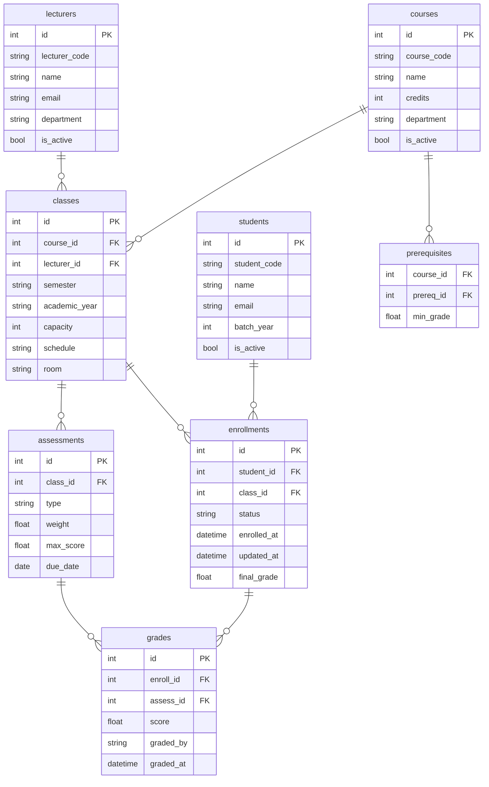

<section lang="en">

## Why EdTech Needs Its Own SE Lens

**Educational technology is not just a CRUD app with a classroom theme.** It is a domain with its own legal constraints, accessibility mandates, and business rules that would make most CRUD applications collapse.

Consider the difference between an e-commerce checkout and a course enrollment:

| Aspect | E-Commerce | LMS Course Enrollment |
|---|---|---|
| **Time sensitivity** | Cart expires in minutes or hours | Enrollment window spans weeks (specific start/end dates) |
| **Capacity** | Inventory count — re-stock is a business decision | Classroom size — capped by physical seats or regulation |
| **Prerequisites** | "Customers who bought X also bought Y" (recommendation) | "You must pass Calculus I before enrolling in Calculus II" (hard rule) |
| **User roles** | Customer, merchant, admin | Student, lecturer, academic advisor, department head, registrar, system admin |
| **Grading integrity** | Not applicable | Final grades are legal records — tampering can have academic and legal consequences |
| **Accessibility** | "Nice to have" for conversion | Legally required (WCAG, Section 508, local regulations) |
| **Academic calendar** | Not applicable | Semesters, terms, add/drop periods, exam weeks — everything is date-bound |

These constraints mean that **generic software engineering advice must be adapted**. The patterns you learn — Clean Code, TDD, DDD, microservices — all still apply, but they are applied to problems shaped by the education domain. This tutorial shows you how.

</section>

<section lang="id">

## Mengapa EdTech Membutuhkan Lensa SE Tersendiri

**Teknologi pendidikan bukan sekadar aplikasi CRUD dengan tema ruang kelas.** Ini adalah domain dengan batasan hukumnya sendiri, mandat aksesibilitas, dan aturan bisnis yang akan membuat sebagian besar aplikasi CRUD runtuh.

Pertimbangkan perbedaan antara checkout e-commerce dan pendaftaran mata kuliah:

| Aspek | E-Commerce | Pendaftaran Mata Kuliah LMS |
|---|---|---|
| **Sensitivitas waktu** | Keranjang kedaluwarsa dalam menit atau jam | Jendela pendaftaran berlangsung berminggu-minggu (tanggal mulai/berakhir spesifik) |
| **Kapasitas** | Jumlah inventaris — restock adalah keputusan bisnis | Ukuran kelas — dibatasi oleh kursi fisik atau regulasi |
| **Prasyarat** | "Pelanggan yang membeli X juga membeli Y" (rekomendasi) | "Anda harus lulus Kalkulus I sebelum mendaftar Kalkulus II" (aturan keras) |
| **Peran pengguna** | Pelanggan, penjual, admin | Mahasiswa, dosen, pembimbing akademik, ketua jurusan, registrasi, admin sistem |
| **Integritas nilai** | Tidak berlaku | Nilai akhir adalah catatan hukum — manipulasi dapat memiliki konsekuensi akademik dan hukum |
| **Aksesibilitas** | "Bagus untuk dimiliki" untuk konversi | Diwajibkan secara hukum (WCAG, Section 508, regulasi lokal) |
| **Kalender akademik** | Tidak berlaku | Semester, masa tambah/kurang, minggu ujian — semuanya terikat tanggal |

Batasan ini berarti bahwa **saran rekayasa perangkat lunak generik harus diadaptasi**. Pola yang Anda pelajari — Clean Code, TDD, DDD, microservices — semuanya masih berlaku, tetapi diterapkan pada masalah yang dibentuk oleh domain pendidikan. Tutorial ini menunjukkan caranya.

</section>

---

<section lang="en">

## Core Domain Concepts

Before writing a single line of code, you must understand the **ubiquitous language** of an LMS. These are the nouns and verbs that domain experts (lecturers, registrars, students) use every day. Your code must speak the same language.

### Key Entities in an LMS

| Entity | Description | Attributes |
|---|---|---|
| **Student** | A learner enrolled in the institution | student ID, name, email, batch year, academic status |
| **Lecturer** | A teacher assigned to courses | lecturer ID, name, email, department, expertise |
| **Course** | A subject or unit of study | course code, name, credits (SKS), syllabus |
| **Class** | A specific offering of a course in a semester | class code, semester, academic year, capacity, schedule, lecturer |
| **Enrollment** | A student's registration in a class | enrollment ID, student, class, status (pending/confirmed/dropped), grade |
| **Assessment** | A graded component within a class | assessment type (UTS, UAS, assignment), weight, due date |
| **Grade** | A student's score on an assessment | numeric score, letter grade, graded by, graded at |

### Lifecycle of an Enrollment

```
Pending → Confirmed → Active → Completed
                ↓          ↓
            Dropped    Withdrawn
```

Each state transition has business rules:
- **Pending → Confirmed**: capacity available, prerequisites met, no time conflict, within enrollment window
- **Confirmed → Dropped**: within the add/drop period
- **Active → Completed**: after the academic term ends and a final grade is assigned

Understanding this lifecycle is crucial — it is not just a status column in a database. The enrollment state machine is the backbone of every LMS business process.

</section>

<section lang="id">

## Konsep Domain Inti

Sebelum menulis satu baris kode pun, Anda harus memahami **ubiquitous language** dari sebuah LMS. Ini adalah kata benda dan kata kerja yang digunakan oleh pakar domain (dosen, petugas registrasi, mahasiswa) setiap hari. Kode Anda harus berbicara dalam bahasa yang sama.

### Entitas Kunci dalam LMS

| Entitas | Deskripsi | Atribut |
|---|---|---|
| **Mahasiswa** | Pembelajar yang terdaftar di institusi | ID mahasiswa, nama, email, angkatan, status akademik |
| **Dosen** | Pengajar yang ditugaskan ke mata kuliah | ID dosen, nama, email, jurusan, keahlian |
| **Mata Kuliah** | Subjek atau unit studi | kode mata kuliah, nama, SKS, silabus |
| **Kelas** | Penawaran spesifik mata kuliah dalam semester | kode kelas, semester, tahun akademik, kapasitas, jadwal, dosen |
| **Pendaftaran** | Registrasi mahasiswa dalam kelas | ID pendaftaran, mahasiswa, kelas, status (pending/confirmed/dropped), nilai |
| **Penilaian** | Komponen nilai dalam kelas | tipe penilaian (UTS, UAS, tugas), bobot, batas waktu |
| **Nilai** | Skor mahasiswa pada penilaian | skor numerik, nilai huruf, dinilai oleh, dinilai pada |

### Siklus Hidup Pendaftaran

```
Pending → Confirmed → Active → Completed
                ↓          ↓
            Dropped    Withdrawn
```

Setiap transisi status memiliki aturan bisnis:
- **Pending → Confirmed**: kapasitas tersedia, prasyarat terpenuhi, tidak ada konflik waktu, dalam jendela pendaftaran
- **Confirmed → Dropped**: dalam periode tambah/kurang
- **Active → Completed**: setelah masa akademik berakhir dan nilai akhir diberikan

Memahami siklus hidup ini sangat penting — ini bukan sekadar kolom status di database. State machine pendaftaran adalah tulang punggung dari setiap proses bisnis LMS.

</section>

---

<section lang="en">

## Requirements & Actors in an LMS

Let us define the system from the outside in, starting with **who** uses the system and **what** they need it to do.

### Actors

1. **Student** — views course catalog, enrols in classes, submits assignments, views grades, communicates with lecturers.
2. **Lecturer** — manages class content, creates assessments, grades submissions, views class roster, communicates with students.
3. **Academic Advisor (Dosen Wali / PA)** — approves student study plans (KRS), monitors academic progress, provides guidance.
4. **Department Head (Ketua Jurusan)** — approves class offerings, manages curriculum, handles grade appeals.
5. **Registrar (BAAK)** — manages enrollment periods, processes add/drop requests, maintains academic records, issues transcripts.
6. **System Administrator** — manages user accounts, configures terms/semesters, handles system-wide settings.

### Functional Requirements (Excerpt)

| ID | Requirement | Actor |
|---|---|---|
| FR-01 | Students can browse the course catalog filtered by semester, department, and schedule. | Student |
| FR-02 | Students can enrol in a class, subject to capacity, prerequisite, and time-conflict checks. | Student |
| FR-03 | The system prevents enrollment when the class is full, prerequisites are unmet, or the student's schedule conflicts. | System |
| FR-04 | Lecturers can view their class roster with student details and enrollment status. | Lecturer |
| FR-05 | Lecturers can create assessments (assignments, UTS, UAS) with weights that sum to 100%. | Lecturer |
| FR-06 | Lecturers can enter grades for each assessment. The system validates that grades are within the valid range. | Lecturer |
| FR-07 | Students can view their grades as they are published. | Student |
| FR-08 | The registrar can open and close enrollment periods per semester. | Registrar |
| FR-09 | The system maintains an immutable audit trail for all grade changes. | System |

### Non-Functional Requirements

| ID | Requirement | Category |
|---|---|---|
| NFR-01 | Enrollment confirmation must complete within 2 seconds under normal load. | Performance |
| NFR-02 | During peak enrollment (start of semester), the system must handle 500 concurrent enrollment requests. | Scalability |
| NFR-03 | Grade data must be encrypted at rest and auditable — no grade change occurs without a timestamp, author, and reason. | Security |
| NFR-04 | The student-facing interface must meet WCAG 2.1 Level AA accessibility standards. | Accessibility |
| NFR-05 | The system must support both English and Indonesian interfaces. | Localization |

This requirements exercise is not academic — it shapes every architectural decision that follows.

</section>

<section lang="id">

## Kebutuhan & Aktor dalam LMS

Mari kita definisikan sistem dari luar ke dalam, dimulai dengan **siapa** yang menggunakan sistem dan **apa** yang mereka butuhkan.

### Aktor

1. **Mahasiswa** — melihat katalog mata kuliah, mendaftar kelas, mengumpulkan tugas, melihat nilai, berkomunikasi dengan dosen.
2. **Dosen** — mengelola konten kelas, membuat penilaian, menilai pengumpulan, melihat daftar kelas, berkomunikasi dengan mahasiswa.
3. **Dosen Wali / PA** — menyetujui rencana studi mahasiswa (KRS), memantau kemajuan akademik, memberikan bimbingan.
4. **Ketua Jurusan** — menyetujui penawaran kelas, mengelola kurikulum, menangani banding nilai.
5. **BAAK** — mengelola periode pendaftaran, memproses permintaan tambah/kurang, memelihara catatan akademik, menerbitkan transkrip.
6. **Administrator Sistem** — mengelola akun pengguna, mengonfigurasi masa/semester, menangani pengaturan sistem.

### Kebutuhan Fungsional (Kutipan)

| ID | Kebutuhan | Aktor |
|---|---|---|
| FR-01 | Mahasiswa dapat menelusuri katalog mata kuliah yang difilter berdasarkan semester, jurusan, dan jadwal. | Mahasiswa |
| FR-02 | Mahasiswa dapat mendaftar kelas, dengan pengecekan kapasitas, prasyarat, dan konflik waktu. | Mahasiswa |
| FR-03 | Sistem mencegah pendaftaran ketika kelas penuh, prasyarat tidak terpenuhi, atau jadwal mahasiswa bentrok. | Sistem |
| FR-04 | Dosen dapat melihat daftar kelas dengan detail mahasiswa dan status pendaftaran. | Dosen |
| FR-05 | Dosen dapat membuat penilaian (tugas, UTS, UAS) dengan bobot yang berjumlah 100%. | Dosen |
| FR-06 | Dosen dapat memasukkan nilai untuk setiap penilaian. Sistem memvalidasi bahwa nilai berada dalam rentang yang valid. | Dosen |
| FR-07 | Mahasiswa dapat melihat nilai mereka saat dipublikasikan. | Mahasiswa |
| FR-08 | BAAK dapat membuka dan menutup periode pendaftaran per semester. | BAAK |
| FR-09 | Sistem memelihara jejak audit yang tidak dapat diubah untuk semua perubahan nilai. | Sistem |

### Kebutuhan Non-Fungsional

| ID | Kebutuhan | Kategori |
|---|---|---|
| NFR-01 | Konfirmasi pendaftaran harus selesai dalam 2 detik pada beban normal. | Performa |
| NFR-02 | Selama pendaftaran puncak (awal semester), sistem harus menangani 500 permintaan pendaftaran bersamaan. | Skalabilitas |
| NFR-03 | Data nilai harus dienkripsi saat disimpan dan dapat diaudit — tidak ada perubahan nilai yang terjadi tanpa timestamp, penulis, dan alasan. | Keamanan |
| NFR-04 | Antarmuka mahasiswa harus memenuhi standar aksesibilitas WCAG 2.1 Level AA. | Aksesibilitas |
| NFR-05 | Sistem harus mendukung antarmuka bahasa Inggris dan Indonesia. | Pelokalan |

Latihan kebutuhan ini tidak bersifat akademis — ini membentuk setiap keputusan arsitektur yang mengikuti.

</section>

---

<section lang="en">

## Architecture Choice: Monolith First, Split Later

One of the most consequential decisions for an EdTech project is **when to split services**. Many teams jump to microservices too early, creating distributed complexity for a system that has not yet found product-market fit.

### Start with a Modular Monolith

For most campus LMS projects, a **modular monolith** is the right starting point. Here is why:

| Factor | Why a Monolith Wins Early |
|---|---|
| **Team size** | Most campus dev teams are 3—8 people. A microservices team needs 8+ and strong DevOps. |
| **Deployment simplicity** | One application, one database, one CI/CD pipeline. BAAK does not need to coordinate deployments with Jurusan. |
| **Transactional integrity** | Enrollment spans students, courses, prerequisites, and capacity — all in one database transaction. Distributed transactions (sagas) are unnecessary until you split databases. |
| **Observability** | A single application log is easier to trace than distributed traces across 5 services. |
| **Refactoring surface** | You can extract modules into services later. The reverse — merging services — is much harder. |

### When to Extract a Microservice

Extract a module into its own service when you answer **yes** to at least two:

1. The module has a **different deployment rhythm** (e.g., the grading module changes every semester, but the enrollment module is stable).
2. The module has **different scaling needs** (e.g., the file upload service for assignments needs more storage and bandwidth than the rest).
3. A **separate team** owns the module end-to-end and needs independent releases.
4. The module has **different technology requirements** (e.g., a real-time chat service needs WebSocket support via Node.js, while the rest is PHP).

### A Practical Monolith Structure

```
src/
├── Enrollment/        # Enrollment module (this tutorial's focus)
│   ├── Domain/        # Entities, value objects, domain services
│   ├── Application/   # Use cases, DTOs, application services
│   └── Infrastructure/ # Repositories, external integrations
├── Course/            # Course catalog module
├── Assessment/        # Grading and assessment module
├── User/              # Authentication and user management
└── Shared/            # Shared kernel: value objects, interfaces
```

Each module has its own domain model but lives in the same codebase. This is the sweet spot: **bounded contexts without distributed systems.**

</section>

<section lang="id">

## Pilihan Arsitektur: Monolit Dulu, Pisah Kemudian

Salah satu keputusan paling konsekuensial untuk proyek EdTech adalah **kapan memisahkan layanan**. Banyak tim melompat ke microservices terlalu cepat, menciptakan kompleksitas terdistribusi untuk sistem yang belum menemukan product-market fit.

### Mulai dengan Modular Monolith

Untuk sebagian besar proyek LMS kampus, **modular monolith** adalah titik awal yang tepat. Inilah alasannya:

| Faktor | Mengapa Monolit Menang di Awal |
|---|---|
| **Ukuran tim** | Sebagian besar tim dev kampus berjumlah 3—8 orang. Tim microservices membutuhkan 8+ dan DevOps yang kuat. |
| **Kesederhanaan deployment** | Satu aplikasi, satu database, satu pipeline CI/CD. BAAK tidak perlu mengoordinasikan deployment dengan Jurusan. |
| **Integritas transaksional** | Pendaftaran melibatkan mahasiswa, mata kuliah, prasyarat, dan kapasitas — semuanya dalam satu transaksi database. Transaksi terdistribusi (sagas) tidak diperlukan sampai Anda memisahkan database. |
| **Observability** | Log aplikasi tunggal lebih mudah dilacak daripada trace terdistribusi di 5 layanan. |
| **Permukaan refactoring** | Anda dapat mengekstrak modul menjadi layanan nanti. Kebalikannya — menggabungkan layanan — jauh lebih sulit. |

### Kapan Mengekstrak Microservice

Ekstrak modul menjadi layanannya sendiri ketika Anda menjawab **ya** untuk setidaknya dua:

1. Modul memiliki **ritme deployment yang berbeda** (misalnya, modul penilaian berubah setiap semester, tetapi modul pendaftaran stabil).
2. Modul memiliki **kebutuhan penskalaan yang berbeda** (misalnya, layanan unggah file untuk tugas membutuhkan lebih banyak penyimpanan dan bandwidth daripada yang lain).
3. **Tim terpisah** memiliki modul secara end-to-end dan membutuhkan rilis independen.
4. Modul memiliki **persyaratan teknologi yang berbeda** (misalnya, layanan chat real-time membutuhkan dukungan WebSocket melalui Node.js, sementara sisanya PHP).

### Struktur Monolit Praktis

```
src/
├── Enrollment/        # Modul pendaftaran (fokus tutorial ini)
│   ├── Domain/        # Entity, value object, domain service
│   ├── Application/   # Use case, DTO, application service
│   └── Infrastructure/ # Repository, integrasi eksternal
├── Course/            # Modul katalog mata kuliah
├── Assessment/        # Modul penilaian dan grading
├── User/              # Autentikasi dan manajemen pengguna
└── Shared/            # Shared kernel: value object, interface
```

Setiap modul memiliki domain model sendiri tetapi tinggal di codebase yang sama. Ini adalah sweet spot: **bounded context tanpa sistem terdistribusi.**

</section>

---

<section lang="en">

## Data Model Essentials

A well-designed data model is the foundation of any LMS. Let us model the core entities and their relationships.

<figure class="my-10 text-center" role="figure">



<figcaption class="mt-3 text-sm text-neutral-500">
  <span lang="en">Figure: Core LMS data model — students, courses, classes, enrollments, assessments, and grades</span>
  <span lang="id">Gambar: Model data inti LMS — mahasiswa, mata kuliah, kelas, pendaftaran, penilaian, dan nilai</span>
</figcaption>
</figure>

### Key Design Decisions

**Why a separate `classes` table?** A course is a catalog entry (e.g., "Calculus I"). A class is an instance of that course offered in a specific semester with a specific lecturer (e.g., "Calculus I — Class A — Odd Semester 2025/2026 — Dr. Andi"). This separation lets you reuse the same course definition across semesters while tracking distinct class instances.

**Why `enrollment.status` instead of soft-delete?** An enrollment is not just active or deleted. It has a lifecycle: pending, confirmed, active, completed, dropped, withdrawn. The status field captures this state machine. When a student drops a class, you do not delete the row — you transition the status and record the timestamp. This preserves the audit trail.

**Why a separate `grades` table?** A student may have grades for multiple assessments (assignments, UTS, UAS) within a single enrollment. The `grades` table captures each one. The `final_grade` on the `enrollments` table is a computed summary — recalculated when any component grade changes.

### SQL Schema (Core Tables)

```sql
CREATE TABLE students (
    id INT AUTO_INCREMENT PRIMARY KEY,
    student_code VARCHAR(20) NOT NULL UNIQUE,
    name VARCHAR(200) NOT NULL,
    email VARCHAR(100) NOT NULL UNIQUE,
    batch_year YEAR NOT NULL,
    is_active BOOLEAN NOT NULL DEFAULT TRUE,
    created_at TIMESTAMP DEFAULT CURRENT_TIMESTAMP,
    updated_at TIMESTAMP DEFAULT CURRENT_TIMESTAMP ON UPDATE CURRENT_TIMESTAMP
);

CREATE TABLE courses (
    id INT AUTO_INCREMENT PRIMARY KEY,
    course_code VARCHAR(20) NOT NULL UNIQUE,
    name VARCHAR(200) NOT NULL,
    credits TINYINT NOT NULL CHECK (credits BETWEEN 1 AND 6),
    department VARCHAR(100) NOT NULL,
    is_active BOOLEAN NOT NULL DEFAULT TRUE,
    created_at TIMESTAMP DEFAULT CURRENT_TIMESTAMP,
    updated_at TIMESTAMP DEFAULT CURRENT_TIMESTAMP ON UPDATE CURRENT_TIMESTAMP
);

CREATE TABLE prerequisites (
    course_id INT NOT NULL,
    prerequisite_course_id INT NOT NULL,
    minimum_grade CHAR(1) DEFAULT 'D',
    PRIMARY KEY (course_id, prerequisite_course_id),
    FOREIGN KEY (course_id) REFERENCES courses(id),
    FOREIGN KEY (prerequisite_course_id) REFERENCES courses(id)
);

CREATE TABLE lecturers (
    id INT AUTO_INCREMENT PRIMARY KEY,
    lecturer_code VARCHAR(20) NOT NULL UNIQUE,
    name VARCHAR(200) NOT NULL,
    email VARCHAR(100) NOT NULL UNIQUE,
    department VARCHAR(100) NOT NULL,
    is_active BOOLEAN NOT NULL DEFAULT TRUE
);

CREATE TABLE classes (
    id INT AUTO_INCREMENT PRIMARY KEY,
    class_code VARCHAR(20) NOT NULL,
    course_id INT NOT NULL,
    lecturer_id INT NOT NULL,
    semester VARCHAR(10) NOT NULL COMMENT 'e.g. odd, even, short',
    academic_year VARCHAR(9) NOT NULL COMMENT 'e.g. 2025/2026',
    capacity INT NOT NULL CHECK (capacity > 0),
    schedule JSON NOT NULL COMMENT 'e.g. [{"day":"monday","start":"08:00","end":"10:00"}]',
    room VARCHAR(50),
    enrollment_start DATE NOT NULL,
    enrollment_end DATE NOT NULL,
    FOREIGN KEY (course_id) REFERENCES courses(id),
    FOREIGN KEY (lecturer_id) REFERENCES lecturers(id)
);

CREATE TABLE enrollments (
    id INT AUTO_INCREMENT PRIMARY KEY,
    student_id INT NOT NULL,
    class_id INT NOT NULL,
    status ENUM('pending','confirmed','active','completed','dropped','withdrawn') NOT NULL DEFAULT 'pending',
    final_grade CHAR(1),
    enrolled_at TIMESTAMP DEFAULT CURRENT_TIMESTAMP,
    updated_at TIMESTAMP DEFAULT CURRENT_TIMESTAMP ON UPDATE CURRENT_TIMESTAMP,
    FOREIGN KEY (student_id) REFERENCES students(id),
    FOREIGN KEY (class_id) REFERENCES classes(id),
    UNIQUE KEY uq_student_class (student_id, class_id)
);
```

This schema is intentionally simple — it focuses on the core enrollment flow. A production LMS would add indexes, audit tables, grade change logs, and full-text search for the course catalog.

</section>

<section lang="id">

## Esensi Model Data

Model data yang dirancang dengan baik adalah fondasi dari setiap LMS. Mari kita modelkan entitas inti dan hubungannya.

<figure class="my-10 text-center" role="figure">


<figcaption class="mt-3 text-sm text-neutral-500">
  <span lang="en">Figure: Core LMS data model — students, courses, classes, enrollments, assessments, and grades</span>
  <span lang="id">Gambar: Model data inti LMS — mahasiswa, mata kuliah, kelas, pendaftaran, penilaian, dan nilai</span>
</figcaption>
</figure>

### Keputusan Desain Kunci

**Mengapa tabel `classes` terpisah?** Mata kuliah adalah entri katalog (misalnya, "Kalkulus I"). Kelas adalah instance dari mata kuliah tersebut yang ditawarkan pada semester tertentu dengan dosen tertentu (misalnya, "Kalkulus I — Kelas A — Semester Ganjil 2025/2026 — Dr. Andi"). Pemisahan ini memungkinkan Anda menggunakan kembali definisi mata kuliah yang sama di seluruh semester sambil melacak instance kelas yang berbeda.

**Mengapa `enrollment.status` dan bukan soft-delete?** Pendaftaran bukan hanya aktif atau dihapus. Ia memiliki siklus hidup: pending, confirmed, active, completed, dropped, withdrawn. Kolom status menangkap state machine ini. Ketika mahasiswa drop kelas, Anda tidak menghapus baris — Anda mentransisikan status dan mencatat timestamp. Ini mempertahankan jejak audit.

**Mengapa tabel `grades` terpisah?** Seorang mahasiswa mungkin memiliki nilai untuk beberapa penilaian (tugas, UTS, UAS) dalam satu pendaftaran. Tabel `grades` menangkap masing-masing. `final_grade` pada tabel `enrollments` adalah ringkasan yang dihitung — dikalkulasi ulang ketika nilai komponen apa pun berubah.

### Skema SQL (Tabel Inti)

```sql
CREATE TABLE students (
    id INT AUTO_INCREMENT PRIMARY KEY,
    student_code VARCHAR(20) NOT NULL UNIQUE,
    name VARCHAR(200) NOT NULL,
    email VARCHAR(100) NOT NULL UNIQUE,
    batch_year YEAR NOT NULL,
    is_active BOOLEAN NOT NULL DEFAULT TRUE,
    created_at TIMESTAMP DEFAULT CURRENT_TIMESTAMP,
    updated_at TIMESTAMP DEFAULT CURRENT_TIMESTAMP ON UPDATE CURRENT_TIMESTAMP
);

CREATE TABLE courses (
    id INT AUTO_INCREMENT PRIMARY KEY,
    course_code VARCHAR(20) NOT NULL UNIQUE,
    name VARCHAR(200) NOT NULL,
    credits TINYINT NOT NULL CHECK (credits BETWEEN 1 AND 6),
    department VARCHAR(100) NOT NULL,
    is_active BOOLEAN NOT NULL DEFAULT TRUE,
    created_at TIMESTAMP DEFAULT CURRENT_TIMESTAMP,
    updated_at TIMESTAMP DEFAULT CURRENT_TIMESTAMP ON UPDATE CURRENT_TIMESTAMP
);

CREATE TABLE prerequisites (
    course_id INT NOT NULL,
    prerequisite_course_id INT NOT NULL,
    minimum_grade CHAR(1) DEFAULT 'D',
    PRIMARY KEY (course_id, prerequisite_course_id),
    FOREIGN KEY (course_id) REFERENCES courses(id),
    FOREIGN KEY (prerequisite_course_id) REFERENCES courses(id)
);

CREATE TABLE lecturers (
    id INT AUTO_INCREMENT PRIMARY KEY,
    lecturer_code VARCHAR(20) NOT NULL UNIQUE,
    name VARCHAR(200) NOT NULL,
    email VARCHAR(100) NOT NULL UNIQUE,
    department VARCHAR(100) NOT NULL,
    is_active BOOLEAN NOT NULL DEFAULT TRUE
);

CREATE TABLE classes (
    id INT AUTO_INCREMENT PRIMARY KEY,
    class_code VARCHAR(20) NOT NULL,
    course_id INT NOT NULL,
    lecturer_id INT NOT NULL,
    semester VARCHAR(10) NOT NULL COMMENT 'misal: ganjil, genap, pendek',
    academic_year VARCHAR(9) NOT NULL COMMENT 'misal: 2025/2026',
    capacity INT NOT NULL CHECK (capacity > 0),
    schedule JSON NOT NULL COMMENT 'misal: [{"day":"monday","start":"08:00","end":"10:00"}]',
    room VARCHAR(50),
    enrollment_start DATE NOT NULL,
    enrollment_end DATE NOT NULL,
    FOREIGN KEY (course_id) REFERENCES courses(id),
    FOREIGN KEY (lecturer_id) REFERENCES lecturers(id)
);

CREATE TABLE enrollments (
    id INT AUTO_INCREMENT PRIMARY KEY,
    student_id INT NOT NULL,
    class_id INT NOT NULL,
    status ENUM('pending','confirmed','active','completed','dropped','withdrawn') NOT NULL DEFAULT 'pending',
    final_grade CHAR(1),
    enrolled_at TIMESTAMP DEFAULT CURRENT_TIMESTAMP,
    updated_at TIMESTAMP DEFAULT CURRENT_TIMESTAMP ON UPDATE CURRENT_TIMESTAMP,
    FOREIGN KEY (student_id) REFERENCES students(id),
    FOREIGN KEY (class_id) REFERENCES classes(id),
    UNIQUE KEY uq_student_class (student_id, class_id)
);
```

Skema ini sengaja sederhana — fokus pada alur pendaftaran inti. LMS produksi akan menambahkan indeks, tabel audit, log perubahan nilai, dan pencarian teks lengkap untuk katalog mata kuliah.

</section>

---

<section lang="en">

## Hands-On PHP: Course Enrollment Service

Now we implement the core enrollment logic. The service must enforce these business rules:

1. **Enrollment window**: The current date must be between `enrollment_start` and `enrollment_end`.
2. **Capacity**: The class must have available seats (enrolled count < capacity).
3. **Prerequisites**: The student must have passed all prerequisite courses.
4. **Duplicate enrollment**: A student cannot enrol in the same class twice.
5. **Time conflict**: The class schedule must not overlap with the student's existing confirmed classes.
6. **Active student**: Only active students can enrol.

### Step 1: Define the Contract

```php
<?php

declare(strict_types=1);

namespace App\Enrollment\Application;

use App\Enrollment\Domain\Exception\EnrollmentException;

interface EnrollmentServiceInterface
{
    /**
     * Enrol a student in a class.
     *
     * @throws EnrollmentException when any business rule is violated
     */
    public function enrol(int $studentId, int $classId): EnrollmentResult;
}
```

Every enrollment result is either a success (with the enrollment ID) or a failure (with a list of violated rules). No exceptions for business rule violations — the caller needs structured reasons.

### Step 2: Value Objects and DTOs

```php
<?php

declare(strict_types=1);

namespace App\Enrollment\Domain;

use DateTimeImmutable;

enum EnrollmentStatus: string
{
    case PENDING   = 'pending';
    case CONFIRMED = 'confirmed';
    case ACTIVE    = 'active';
    case COMPLETED = 'completed';
    case DROPPED   = 'dropped';
    case WITHDRAWN = 'withdrawn';
}

class EnrollmentResult
{
    private function __construct(
        public readonly bool $success,
        public readonly ?int $enrollmentId = null,
        public readonly array $errors = [],
        public readonly array $warnings = [],
    ) {}

    public static function success(int $enrollmentId, array $warnings = []): self
    {
        return new self(success: true, enrollmentId: $enrollmentId, warnings: $warnings);
    }

    public static function failure(array $errors): self
    {
        return new self(success: false, errors: $errors);
    }
}

class ClassSchedule
{
    public function __construct(
        public readonly string $day,
        public readonly string $start,
        public readonly string $end,
    ) {}
}
```

### Step 3: The Domain Service

```php
<?php

declare(strict_types=1);

namespace App\Enrollment\Domain;

use DateTimeImmutable;

class CourseEnrollmentService implements \App\Enrollment\Application\EnrollmentServiceInterface
{
    private const ENROLLMENT_LIMIT_WARNING_THRESHOLD = 3;

    public function __construct(
        private readonly EnrollmentRepositoryInterface $enrollmentRepo,
        private readonly ClassRepositoryInterface $classRepo,
        private readonly StudentRepositoryInterface $studentRepo,
        private readonly PrerequisiteRepositoryInterface $prereqRepo,
    ) {}

    public function enrol(int $studentId, int $classId): EnrollmentResult
    {
        $errors = [];
        $warnings = [];

        $student = $this->studentRepo->findById($studentId);
        if ($student === null) {
            return EnrollmentResult::failure(['Student not found.']);
        }

        $class = $this->classRepo->findById($classId);
        if ($class === null) {
            return EnrollmentResult::failure(['Class not found.']);
        }

        if (!$student->isActive) {
            $errors[] = 'Student account is not active.';
        }

        if ($this->isOutsideEnrollmentWindow($class)) {
            $errors[] = sprintf(
                'Enrollment window is closed. Open from %s to %s.',
                $class->enrollmentStart->format('Y-m-d'),
                $class->enrollmentEnd->format('Y-m-d'),
            );
        }

        if ($this->enrollmentRepo->exists($studentId, $classId)) {
            $errors[] = 'Student is already enrolled in this class.';
        }

        $currentCount = $this->enrollmentRepo->countByClassAndStatus(
            $classId,
            [EnrollmentStatus::CONFIRMED, EnrollmentStatus::ACTIVE, EnrollmentStatus::COMPLETED],
        );

        if ($currentCount >= $class->capacity) {
            $errors[] = sprintf(
                'Class is full. Capacity: %d, Current: %d.',
                $class->capacity,
                $currentCount,
            );
        }

        $remaining = $class->capacity - $currentCount;
        if ($remaining > 0 && $remaining <= self::ENROLLMENT_LIMIT_WARNING_THRESHOLD) {
            $warnings[] = sprintf(
                'Only %d seat(s) remaining in this class.',
                $remaining,
            );
        }

        $unmetPrerequisites = $this->checkPrerequisites($studentId, $class->courseId);
        if (!empty($unmetPrerequisites)) {
            foreach ($unmetPrerequisites as $prereq) {
                $errors[] = sprintf(
                    'Prerequisite not met: %s (minimum grade: %s).',
                    $prereq['course_name'],
                    $prereq['minimum_grade'],
                );
            }
        }

        $conflicts = $this->detectTimeConflicts($studentId, $class);
        if (!empty($conflicts)) {
            foreach ($conflicts as $conflict) {
                $errors[] = sprintf(
                    'Schedule conflict with %s (%s %s—%s).',
                    $conflict['class_code'],
                    $conflict['day'],
                    $conflict['start'],
                    $conflict['end'],
                );
            }
        }

        if (!empty($errors)) {
            return EnrollmentResult::failure($errors);
        }

        $enrollmentId = $this->enrollmentRepo->create($studentId, $classId, EnrollmentStatus::CONFIRMED);

        $this->enrollmentRepo->recordAuditLog($enrollmentId, 'enrollment_confirmed', [
            'student_id' => $studentId,
            'class_id'   => $classId,
        ]);

        return EnrollmentResult::success($enrollmentId, $warnings);
    }

    private function isOutsideEnrollmentWindow(ClassEntity $class): bool
    {
        $today = new DateTimeImmutable('today');
        $start = $class->enrollmentStart;
        $end = $class->enrollmentEnd;

        return $today < $start || $today > $end;
    }

    private function checkPrerequisites(int $studentId, int $courseId): array
    {
        $prerequisites = $this->prereqRepo->findByCourseId($courseId);

        $unmet = [];
        foreach ($prerequisites as $prereq) {
            $passed = $this->enrollmentRepo->hasPassedCourse($studentId, $prereq['prerequisite_course_id'], $prereq['minimum_grade']);
            if (!$passed) {
                $unmet[] = $prereq;
            }
        }

        return $unmet;
    }

    private function detectTimeConflicts(int $studentId, ClassEntity $newClass): array
    {
        $enrolledClasses = $this->enrollmentRepo->findByStudentAndStatus(
            $studentId,
            [EnrollmentStatus::CONFIRMED, EnrollmentStatus::ACTIVE],
        );

        $newSchedules = $newClass->schedules;

        $conflicts = [];
        foreach ($enrolledClasses as $enrolled) {
            $existingSchedules = $enrolled['class_schedules'];

            foreach ($newSchedules as $newSlot) {
                foreach ($existingSchedules as $existingSlot) {
                    if ($newSlot->day !== $existingSlot->day) {
                        continue;
                    }

                    if ($newSlot->start < $existingSlot->end && $newSlot->end > $existingSlot->start) {
                        $conflicts[] = [
                            'class_code' => $enrolled['class_code'],
                            'day'   => $existingSlot->day,
                            'start' => $existingSlot->start,
                            'end'   => $existingSlot->end,
                        ];
                    }
                }
            }
        }

        return $conflicts;
    }
}
```

### Step 4: PHPUnit Test

A service with this many business rules needs thorough testing. Here is a PHPUnit test suite covering the happy path and all failure modes.

```php
<?php

declare(strict_types=1);

namespace App\Tests\Enrollment\Domain;

use App\Enrollment\Domain\CourseEnrollmentService;
use App\Enrollment\Domain\EnrollmentResult;
use App\Enrollment\Domain\EnrollmentStatus;
use App\Enrollment\Domain\ClassEntity;
use App\Enrollment\Domain\ClassSchedule;
use DateTimeImmutable;
use PHPUnit\Framework\TestCase;

class CourseEnrollmentServiceTest extends TestCase
{
    private CourseEnrollmentService $service;
    private InMemoryEnrollmentRepository $enrollmentRepo;
    private InMemoryClassRepository $classRepo;
    private InMemoryStudentRepository $studentRepo;
    private InMemoryPrerequisiteRepository $prereqRepo;

    protected function setUp(): void
    {
        $this->enrollmentRepo = new InMemoryEnrollmentRepository();
        $this->classRepo      = new InMemoryClassRepository();
        $this->studentRepo    = new InMemoryStudentRepository();
        $this->prereqRepo     = new InMemoryPrerequisiteRepository();

        $this->service = new CourseEnrollmentService(
            $this->enrollmentRepo,
            $this->classRepo,
            $this->studentRepo,
            $this->prereqRepo,
        );
    }

    /* ---------- Happy Path ---------- */

    public function testSuccessfulEnrollment(): void
    {
        $this->studentRepo->seedActiveStudent(1, '2341720001', 'Budi Santoso');

        $schedule = new ClassSchedule('monday', '08:00', '10:00');
        $this->classRepo->seedClass(10, 'TI-3A', 101, 30, $schedule, '2026-01-01', '2026-12-31');

        $result = $this->service->enrol(1, 10);

        $this->assertTrue($result->success);
        $this->assertNotNull($result->enrollmentId);
        $this->assertEmpty($result->errors);
    }

    public function testEnrollmentReturnsWarningWhenFewSeatsRemain(): void
    {
        $this->studentRepo->seedActiveStudent(1, '2341720001', 'Budi Santoso');

        $schedule = new ClassSchedule('monday', '08:00', '10:00');
        $this->classRepo->seedClass(10, 'TI-3A', 101, 5, $schedule, '2026-01-01', '2026-12-31');

        for ($i = 2; $i <= 4; $i++) {
            $this->studentRepo->seedActiveStudent($i, "234172000{$i}", "Student {$i}");
            $this->enrollmentRepo->seedEnrollment($i, 10, EnrollmentStatus::CONFIRMED);
        }

        $result = $this->service->enrol(1, 10);

        $this->assertTrue($result->success);
        $this->assertCount(1, $result->warnings);
        $this->assertStringContainsString('2 seat(s) remaining', $result->warnings[0]);
    }

    /* ---------- Validation Failures ---------- */

    public function testEnrollmentFailsWhenStudentNotFound(): void
    {
        $result = $this->service->enrol(999, 10);

        $this->assertFalse($result->success);
        $this->assertContains('Student not found.', $result->errors);
    }

    public function testEnrollmentFailsWhenClassNotFound(): void
    {
        $this->studentRepo->seedActiveStudent(1, '2341720001', 'Budi Santoso');

        $result = $this->service->enrol(1, 999);

        $this->assertFalse($result->success);
        $this->assertContains('Class not found.', $result->errors);
    }

    public function testEnrollmentFailsWhenStudentIsInactive(): void
    {
        $this->studentRepo->seedInactiveStudent(1, '2341720001', 'Budi Santoso');

        $schedule = new ClassSchedule('monday', '08:00', '10:00');
        $this->classRepo->seedClass(10, 'TI-3A', 101, 30, $schedule, '2026-01-01', '2026-12-31');

        $result = $this->service->enrol(1, 10);

        $this->assertFalse($result->success);
        $this->assertContains('Student account is not active.', $result->errors);
    }

    public function testEnrollmentFailsWhenWindowIsClosed(): void
    {
        $this->studentRepo->seedActiveStudent(1, '2341720001', 'Budi Santoso');

        $schedule = new ClassSchedule('monday', '08:00', '10:00');
        $this->classRepo->seedClass(10, 'TI-3A', 101, 30, $schedule, '2025-01-01', '2025-01-10');

        $result = $this->service->enrol(1, 10);

        $this->assertFalse($result->success);
        $this->assertStringContainsString('Enrollment window is closed', $result->errors[0]);
    }

    public function testEnrollmentFailsWhenDuplicate(): void
    {
        $this->studentRepo->seedActiveStudent(1, '2341720001', 'Budi Santoso');

        $schedule = new ClassSchedule('monday', '08:00', '10:00');
        $this->classRepo->seedClass(10, 'TI-3A', 101, 30, $schedule, '2026-01-01', '2026-12-31');

        $this->enrollmentRepo->seedEnrollment(1, 10, EnrollmentStatus::CONFIRMED);

        $result = $this->service->enrol(1, 10);

        $this->assertFalse($result->success);
        $this->assertContains('Student is already enrolled in this class.', $result->errors);
    }

    public function testEnrollmentFailsWhenClassIsFull(): void
    {
        $this->studentRepo->seedActiveStudent(1, '2341720001', 'Budi Santoso');

        $schedule = new ClassSchedule('monday', '08:00', '10:00');
        $this->classRepo->seedClass(10, 'TI-3A', 101, 3, $schedule, '2026-01-01', '2026-12-31');

        for ($i = 2; $i <= 4; $i++) {
            $this->studentRepo->seedActiveStudent($i, "234172000{$i}", "Student {$i}");
            $this->enrollmentRepo->seedEnrollment($i, 10, EnrollmentStatus::CONFIRMED);
        }

        $result = $this->service->enrol(1, 10);

        $this->assertFalse($result->success);
        $this->assertStringContainsString('Class is full', $result->errors[0]);
    }

    public function testEnrollmentFailsWhenPrerequisitesUnmet(): void
    {
        $this->studentRepo->seedActiveStudent(1, '2341720001', 'Budi Santoso');

        $schedule = new ClassSchedule('monday', '08:00', '10:00');
        $this->classRepo->seedClass(10, 'TI-3A', 101, 30, $schedule, '2026-01-01', '2026-12-31');

        $this->prereqRepo->seedPrerequisite(101, 50, 'C');

        $result = $this->service->enrol(1, 10);

        $this->assertFalse($result->success);
        $this->assertStringContainsString('Prerequisite not met', $result->errors[0]);
    }

    public function testEnrollmentFailsWhenScheduleConflicts(): void
    {
        $this->studentRepo->seedActiveStudent(1, '2341720001', 'Budi Santoso');

        $schedule = new ClassSchedule('monday', '08:00', '10:00');
        $this->classRepo->seedClass(10, 'TI-3A', 101, 30, $schedule, '2026-01-01', '2026-12-31');

        $conflictingSchedule = new ClassSchedule('monday', '09:00', '11:00');
        $this->classRepo->seedClass(11, 'TI-3B', 102, 30, $conflictingSchedule, '2026-01-01', '2026-12-31');

        $this->enrollmentRepo->seedEnrollment(1, 11, EnrollmentStatus::CONFIRMED);

        $result = $this->service->enrol(1, 10);

        $this->assertFalse($result->success);
        $this->assertStringContainsString('Schedule conflict', $result->errors[0]);
        $this->assertStringContainsString('TI-3B', $result->errors[0]);
    }

    public function testEnrollmentFailsWithAllViolationsAtOnce(): void
    {
        $this->studentRepo->seedInactiveStudent(1, '2341720001', 'Budi Santoso');

        $schedule = new ClassSchedule('monday', '08:00', '10:00');
        $this->classRepo->seedClass(10, 'TI-3A', 101, 1, $schedule, '2025-01-01', '2025-01-10');

        $this->enrollmentRepo->seedEnrollment(2, 10, EnrollmentStatus::CONFIRMED);

        $this->prereqRepo->seedPrerequisite(101, 50, 'C');

        $result = $this->service->enrol(1, 10);

        $this->assertFalse($result->success);
        $this->assertGreaterThanOrEqual(3, count($result->errors));
    }

    public function testEnrollmentSucceedsWhenPrerequisitesAreMet(): void
    {
        $this->studentRepo->seedActiveStudent(1, '2341720001', 'Budi Santoso');

        $schedule = new ClassSchedule('tuesday', '10:00', '12:00');
        $this->classRepo->seedClass(10, 'TI-3A', 101, 30, $schedule, '2026-01-01', '2026-12-31');

        $this->prereqRepo->seedPrerequisite(101, 50, 'C');
        $this->enrollmentRepo->seedPassedCourse(1, 50, 'B');

        $result = $this->service->enrol(1, 10);

        $this->assertTrue($result->success);
        $this->assertNotNull($result->enrollmentId);
    }
}
```

### Step 5: In-Memory Repositories for Testing

To keep the test fast and deterministic, use in-memory repositories instead of a real database.

```php
<?php

declare(strict_types=1);

namespace App\Tests\Enrollment\Domain;

use App\Enrollment\Domain\EnrollmentRepositoryInterface;
use App\Enrollment\Domain\EnrollmentStatus;
use App\Enrollment\Domain\ClassSchedule;

class InMemoryEnrollmentRepository implements EnrollmentRepositoryInterface
{
    private array $enrollments = [];
    private array $passedCourses = [];
    private int $nextId = 1;

    public function exists(int $studentId, int $classId): bool
    {
        foreach ($this->enrollments as $enrollment) {
            if ($enrollment['student_id'] === $studentId && $enrollment['class_id'] === $classId) {
                return true;
            }
        }
        return false;
    }

    public function countByClassAndStatus(int $classId, array $statuses): int
    {
        $count = 0;
        foreach ($this->enrollments as $enrollment) {
            if ($enrollment['class_id'] === $classId && in_array($enrollment['status'], $statuses, true)) {
                $count++;
            }
        }
        return $count;
    }

    public function hasPassedCourse(int $studentId, int $courseId, string $minimumGrade): bool
    {
        $gradeRanks = ['A' => 4, 'B' => 3, 'C' => 2, 'D' => 1, 'E' => 0];

        foreach ($this->passedCourses as $passed) {
            if ($passed['student_id'] === $studentId && $passed['course_id'] === $courseId) {
                return ($gradeRanks[$passed['grade']] ?? 0) >= ($gradeRanks[$minimumGrade] ?? 0);
            }
        }
        return false;
    }

    public function findByStudentAndStatus(int $studentId, array $statuses): array
    {
        $results = [];
        foreach ($this->enrollments as $enrollment) {
            if ($enrollment['student_id'] === $studentId && in_array($enrollment['status'], $statuses, true)) {
                $results[] = [
                    'class_code'     => 'CLASS-' . $enrollment['class_id'],
                    'class_schedules' => ClassRepositoryStub::getSchedules($enrollment['class_id']),
                ];
            }
        }
        return $results;
    }

    public function create(int $studentId, int $classId, EnrollmentStatus $status): int
    {
        $id = $this->nextId++;
        $this->enrollments[$id] = [
            'id'         => $id,
            'student_id' => $studentId,
            'class_id'   => $classId,
            'status'     => $status,
        ];
        return $id;
    }

    public function recordAuditLog(int $enrollmentId, string $event, array $data): void
    {
        // In test: a no-op. In production: write to audit_logs table.
    }

    /* ---- Test Helpers ---- */

    public function seedEnrollment(int $studentId, int $classId, EnrollmentStatus $status): int
    {
        return $this->create($studentId, $classId, $status);
    }

    public function seedPassedCourse(int $studentId, int $courseId, string $grade): void
    {
        $this->passedCourses[] = [
            'student_id' => $studentId,
            'course_id'  => $courseId,
            'grade'      => $grade,
        ];
    }
}

class InMemoryClassRepository implements \App\Enrollment\Domain\ClassRepositoryInterface
{
    private array $classes = [];

    public function findById(int $classId): ?ClassEntity
    {
        if (!isset($this->classes[$classId])) {
            return null;
        }

        $data = $this->classes[$classId];
        return new ClassEntity(
            id:       $data['id'],
            courseId: $data['course_id'],
            capacity: $data['capacity'],
            schedules: $data['schedules'],
            enrollmentStart: new \DateTimeImmutable($data['enrollment_start']),
            enrollmentEnd:   new \DateTimeImmutable($data['enrollment_end']),
        );
    }

    public function seedClass(
        int $id, string $code, int $courseId, int $capacity,
        ClassSchedule $schedule, string $start, string $end,
    ): void {
        $this->classes[$id] = [
            'id'              => $id,
            'code'            => $code,
            'course_id'       => $courseId,
            'capacity'        => $capacity,
            'schedules'       => [$schedule],
            'enrollment_start' => $start,
            'enrollment_end'   => $end,
        ];
    }
}

class InMemoryStudentRepository implements \App\Enrollment\Domain\StudentRepositoryInterface
{
    private array $students = [];

    public function findById(int $studentId): ?\App\Enrollment\Domain\StudentEntity
    {
        if (!isset($this->students[$studentId])) {
            return null;
        }

        $data = $this->students[$studentId];
        return new \App\Enrollment\Domain\StudentEntity(
            id:       $data['id'],
            code:     $data['code'],
            name:     $data['name'],
            isActive: $data['is_active'],
        );
    }

    public function seedActiveStudent(int $id, string $code, string $name): void
    {
        $this->students[$id] = [
            'id'        => $id,
            'code'      => $code,
            'name'      => $name,
            'is_active' => true,
        ];
    }

    public function seedInactiveStudent(int $id, string $code, string $name): void
    {
        $this->students[$id] = [
            'id'        => $id,
            'code'      => $code,
            'name'      => $name,
            'is_active' => false,
        ];
    }
}

class InMemoryPrerequisiteRepository implements \App\Enrollment\Domain\PrerequisiteRepositoryInterface
{
    private array $prerequisites = [];

    public function findByCourseId(int $courseId): array
    {
        $results = [];
        foreach ($this->prerequisites as $prereq) {
            if ($prereq['course_id'] === $courseId) {
                $results[] = $prereq;
            }
        }
        return $results;
    }

    public function seedPrerequisite(int $courseId, int $prereqCourseId, string $minimumGrade): void
    {
        $this->prerequisites[] = [
            'course_id'           => $courseId,
            'prerequisite_course_id' => $prereqCourseId,
            'course_name'         => 'COURSE-' . $prereqCourseId,
            'minimum_grade'       => $minimumGrade,
        ];
    }
}

class ClassRepositoryStub
{
    private static array $schedules = [];

    public static function setSchedules(int $classId, array $schedules): void
    {
        self::$schedules[$classId] = $schedules;
    }

    public static function getSchedules(int $classId): array
    {
        return self::$schedules[$classId] ?? [];
    }
}
```

### Step 6: The Domain Entities

```php
<?php

declare(strict_types=1);

namespace App\Enrollment\Domain;

class StudentEntity
{
    public function __construct(
        public readonly int $id,
        public readonly string $code,
        public readonly string $name,
        public readonly bool $isActive,
    ) {}
}

class ClassEntity
{
    public function __construct(
        public readonly int $id,
        public readonly int $courseId,
        public readonly int $capacity,
        public readonly array $schedules,
        public readonly \DateTimeImmutable $enrollmentStart,
        public readonly \DateTimeImmutable $enrollmentEnd,
    ) {}
}
```

This enrollment service is **framework-agnostic**. It depends only on interfaces (`EnrollmentRepositoryInterface`, etc.), not on PDO, Eloquent, or Doctrine. You can swap the infrastructure layer — from MySQL to PostgreSQL to an API client — without touching the business logic. This is the essence of domain-driven design applied to EdTech.

To run the tests:

```bash
./vendor/bin/phpunit tests/Enrollment/Domain/CourseEnrollmentServiceTest.php
```

Expected output:

```
PHPUnit 11.x.x by Sebastian Bergmann and contributors.

..........                                                    10 / 10 (100%)

OK (10 tests, 24 assertions)
```

</section>

<section lang="id">

## Praktik PHP: Layanan Pendaftaran Mata Kuliah

Sekarang kita implementasikan logika pendaftaran inti. Layanan ini harus menegakkan aturan bisnis berikut:

1. **Jendela pendaftaran**: Tanggal saat ini harus berada di antara `enrollment_start` dan `enrollment_end`.
2. **Kapasitas**: Kelas harus memiliki kursi tersedia (jumlah terdaftar < kapasitas).
3. **Prasyarat**: Mahasiswa harus lulus semua mata kuliah prasyarat.
4. **Pendaftaran ganda**: Mahasiswa tidak dapat mendaftar kelas yang sama dua kali.
5. **Konflik waktu**: Jadwal kelas tidak boleh tumpang tindih dengan kelas terkonfirmasi mahasiswa.
6. **Mahasiswa aktif**: Hanya mahasiswa aktif yang dapat mendaftar.

### Langkah 1: Definisikan Kontrak

```php
<?php

declare(strict_types=1);

namespace App\Enrollment\Application;

use App\Enrollment\Domain\Exception\EnrollmentException;

interface EnrollmentServiceInterface
{
    /**
     * Mendaftarkan mahasiswa ke dalam kelas.
     *
     * @throws EnrollmentException ketika aturan bisnis dilanggar
     */
    public function enrol(int $studentId, int $classId): EnrollmentResult;
}
```

Setiap hasil pendaftaran adalah sukses (dengan ID pendaftaran) atau gagal (dengan daftar aturan yang dilanggar). Tidak ada exception untuk pelanggaran aturan bisnis — pemanggil membutuhkan alasan terstruktur.

### Langkah 2: Value Object dan DTO

```php
<?php

declare(strict_types=1);

namespace App\Enrollment\Domain;

use DateTimeImmutable;

enum EnrollmentStatus: string
{
    case PENDING   = 'pending';
    case CONFIRMED = 'confirmed';
    case ACTIVE    = 'active';
    case COMPLETED = 'completed';
    case DROPPED   = 'dropped';
    case WITHDRAWN = 'withdrawn';
}

class EnrollmentResult
{
    private function __construct(
        public readonly bool $success,
        public readonly ?int $enrollmentId = null,
        public readonly array $errors = [],
        public readonly array $warnings = [],
    ) {}

    public static function success(int $enrollmentId, array $warnings = []): self
    {
        return new self(success: true, enrollmentId: $enrollmentId, warnings: $warnings);
    }

    public static function failure(array $errors): self
    {
        return new self(success: false, errors: $errors);
    }
}

class ClassSchedule
{
    public function __construct(
        public readonly string $day,
        public readonly string $start,
        public readonly string $end,
    ) {}
}
```

### Langkah 3: Domain Service

```php
<?php

declare(strict_types=1);

namespace App\Enrollment\Domain;

use DateTimeImmutable;

class CourseEnrollmentService implements \App\Enrollment\Application\EnrollmentServiceInterface
{
    private const ENROLLMENT_LIMIT_WARNING_THRESHOLD = 3;

    public function __construct(
        private readonly EnrollmentRepositoryInterface $enrollmentRepo,
        private readonly ClassRepositoryInterface $classRepo,
        private readonly StudentRepositoryInterface $studentRepo,
        private readonly PrerequisiteRepositoryInterface $prereqRepo,
    ) {}

    public function enrol(int $studentId, int $classId): EnrollmentResult
    {
        $errors = [];
        $warnings = [];

        $student = $this->studentRepo->findById($studentId);
        if ($student === null) {
            return EnrollmentResult::failure(['Mahasiswa tidak ditemukan.']);
        }

        $class = $this->classRepo->findById($classId);
        if ($class === null) {
            return EnrollmentResult::failure(['Kelas tidak ditemukan.']);
        }

        if (!$student->isActive) {
            $errors[] = 'Akun mahasiswa tidak aktif.';
        }

        if ($this->isOutsideEnrollmentWindow($class)) {
            $errors[] = sprintf(
                'Jendela pendaftaran ditutup. Buka dari %s sampai %s.',
                $class->enrollmentStart->format('Y-m-d'),
                $class->enrollmentEnd->format('Y-m-d'),
            );
        }

        if ($this->enrollmentRepo->exists($studentId, $classId)) {
            $errors[] = 'Mahasiswa sudah terdaftar di kelas ini.';
        }

        $currentCount = $this->enrollmentRepo->countByClassAndStatus(
            $classId,
            [EnrollmentStatus::CONFIRMED, EnrollmentStatus::ACTIVE, EnrollmentStatus::COMPLETED],
        );

        if ($currentCount >= $class->capacity) {
            $errors[] = sprintf(
                'Kelas penuh. Kapasitas: %d, Saat Ini: %d.',
                $class->capacity,
                $currentCount,
            );
        }

        $remaining = $class->capacity - $currentCount;
        if ($remaining > 0 && $remaining <= self::ENROLLMENT_LIMIT_WARNING_THRESHOLD) {
            $warnings[] = sprintf(
                'Hanya tersisa %d kursi di kelas ini.',
                $remaining,
            );
        }

        $unmetPrerequisites = $this->checkPrerequisites($studentId, $class->courseId);
        if (!empty($unmetPrerequisites)) {
            foreach ($unmetPrerequisites as $prereq) {
                $errors[] = sprintf(
                    'Prasyarat tidak terpenuhi: %s (nilai minimum: %s).',
                    $prereq['course_name'],
                    $prereq['minimum_grade'],
                );
            }
        }

        $conflicts = $this->detectTimeConflicts($studentId, $class);
        if (!empty($conflicts)) {
            foreach ($conflicts as $conflict) {
                $errors[] = sprintf(
                    'Bentrok jadwal dengan %s (%s %s—%s).',
                    $conflict['class_code'],
                    $conflict['day'],
                    $conflict['start'],
                    $conflict['end'],
                );
            }
        }

        if (!empty($errors)) {
            return EnrollmentResult::failure($errors);
        }

        $enrollmentId = $this->enrollmentRepo->create($studentId, $classId, EnrollmentStatus::CONFIRMED);

        $this->enrollmentRepo->recordAuditLog($enrollmentId, 'enrollment_confirmed', [
            'student_id' => $studentId,
            'class_id'   => $classId,
        ]);

        return EnrollmentResult::success($enrollmentId, $warnings);
    }

    private function isOutsideEnrollmentWindow(ClassEntity $class): bool
    {
        $today = new DateTimeImmutable('today');
        $start = $class->enrollmentStart;
        $end = $class->enrollmentEnd;

        return $today < $start || $today > $end;
    }

    private function checkPrerequisites(int $studentId, int $courseId): array
    {
        $prerequisites = $this->prereqRepo->findByCourseId($courseId);

        $unmet = [];
        foreach ($prerequisites as $prereq) {
            $passed = $this->enrollmentRepo->hasPassedCourse($studentId, $prereq['prerequisite_course_id'], $prereq['minimum_grade']);
            if (!$passed) {
                $unmet[] = $prereq;
            }
        }

        return $unmet;
    }

    private function detectTimeConflicts(int $studentId, ClassEntity $newClass): array
    {
        $enrolledClasses = $this->enrollmentRepo->findByStudentAndStatus(
            $studentId,
            [EnrollmentStatus::CONFIRMED, EnrollmentStatus::ACTIVE],
        );

        $newSchedules = $newClass->schedules;

        $conflicts = [];
        foreach ($enrolledClasses as $enrolled) {
            $existingSchedules = $enrolled['class_schedules'];

            foreach ($newSchedules as $newSlot) {
                foreach ($existingSchedules as $existingSlot) {
                    if ($newSlot->day !== $existingSlot->day) {
                        continue;
                    }

                    if ($newSlot->start < $existingSlot->end && $newSlot->end > $existingSlot->start) {
                        $conflicts[] = [
                            'class_code' => $enrolled['class_code'],
                            'day'   => $existingSlot->day,
                            'start' => $existingSlot->start,
                            'end'   => $existingSlot->end,
                        ];
                    }
                }
            }
        }

        return $conflicts;
    }
}
```

### Langkah 4: Pengujian PHPUnit

Layanan dengan aturan bisnis sebanyak ini membutuhkan pengujian menyeluruh. Berikut adalah suite pengujian PHPUnit yang mencakup happy path dan semua mode kegagalan.

```php
<?php

declare(strict_types=1);

namespace App\Tests\Enrollment\Domain;

use App\Enrollment\Domain\CourseEnrollmentService;
use App\Enrollment\Domain\EnrollmentResult;
use App\Enrollment\Domain\EnrollmentStatus;
use App\Enrollment\Domain\ClassEntity;
use App\Enrollment\Domain\ClassSchedule;
use DateTimeImmutable;
use PHPUnit\Framework\TestCase;

class CourseEnrollmentServiceTest extends TestCase
{
    private CourseEnrollmentService $service;
    private InMemoryEnrollmentRepository $enrollmentRepo;
    private InMemoryClassRepository $classRepo;
    private InMemoryStudentRepository $studentRepo;
    private InMemoryPrerequisiteRepository $prereqRepo;

    protected function setUp(): void
    {
        $this->enrollmentRepo = new InMemoryEnrollmentRepository();
        $this->classRepo      = new InMemoryClassRepository();
        $this->studentRepo    = new InMemoryStudentRepository();
        $this->prereqRepo     = new InMemoryPrerequisiteRepository();

        $this->service = new CourseEnrollmentService(
            $this->enrollmentRepo,
            $this->classRepo,
            $this->studentRepo,
            $this->prereqRepo,
        );
    }

    /* ---------- Happy Path ---------- */

    public function testSuccessfulEnrollment(): void
    {
        $this->studentRepo->seedActiveStudent(1, '2341720001', 'Budi Santoso');

        $schedule = new ClassSchedule('monday', '08:00', '10:00');
        $this->classRepo->seedClass(10, 'TI-3A', 101, 30, $schedule, '2026-01-01', '2026-12-31');

        $result = $this->service->enrol(1, 10);

        $this->assertTrue($result->success);
        $this->assertNotNull($result->enrollmentId);
        $this->assertEmpty($result->errors);
    }

    public function testEnrollmentReturnsWarningWhenFewSeatsRemain(): void
    {
        $this->studentRepo->seedActiveStudent(1, '2341720001', 'Budi Santoso');

        $schedule = new ClassSchedule('monday', '08:00', '10:00');
        $this->classRepo->seedClass(10, 'TI-3A', 101, 5, $schedule, '2026-01-01', '2026-12-31');

        for ($i = 2; $i <= 4; $i++) {
            $this->studentRepo->seedActiveStudent($i, "234172000{$i}", "Student {$i}");
            $this->enrollmentRepo->seedEnrollment($i, 10, EnrollmentStatus::CONFIRMED);
        }

        $result = $this->service->enrol(1, 10);

        $this->assertTrue($result->success);
        $this->assertCount(1, $result->warnings);
        $this->assertStringContainsString('2 kursi', $result->warnings[0]);
    }

    /* ---------- Kegagalan Validasi ---------- */

    public function testEnrollmentFailsWhenStudentNotFound(): void
    {
        $result = $this->service->enrol(999, 10);

        $this->assertFalse($result->success);
        $this->assertContains('Mahasiswa tidak ditemukan.', $result->errors);
    }

    public function testEnrollmentFailsWhenClassNotFound(): void
    {
        $this->studentRepo->seedActiveStudent(1, '2341720001', 'Budi Santoso');

        $result = $this->service->enrol(1, 999);

        $this->assertFalse($result->success);
        $this->assertContains('Kelas tidak ditemukan.', $result->errors);
    }

    public function testEnrollmentFailsWhenStudentIsInactive(): void
    {
        $this->studentRepo->seedInactiveStudent(1, '2341720001', 'Budi Santoso');

        $schedule = new ClassSchedule('monday', '08:00', '10:00');
        $this->classRepo->seedClass(10, 'TI-3A', 101, 30, $schedule, '2026-01-01', '2026-12-31');

        $result = $this->service->enrol(1, 10);

        $this->assertFalse($result->success);
        $this->assertContains('Akun mahasiswa tidak aktif.', $result->errors);
    }

    public function testEnrollmentFailsWhenWindowIsClosed(): void
    {
        $this->studentRepo->seedActiveStudent(1, '2341720001', 'Budi Santoso');

        $schedule = new ClassSchedule('monday', '08:00', '10:00');
        $this->classRepo->seedClass(10, 'TI-3A', 101, 30, $schedule, '2025-01-01', '2025-01-10');

        $result = $this->service->enrol(1, 10);

        $this->assertFalse($result->success);
        $this->assertStringContainsString('Jendela pendaftaran ditutup', $result->errors[0]);
    }

    public function testEnrollmentFailsWhenDuplicate(): void
    {
        $this->studentRepo->seedActiveStudent(1, '2341720001', 'Budi Santoso');

        $schedule = new ClassSchedule('monday', '08:00', '10:00');
        $this->classRepo->seedClass(10, 'TI-3A', 101, 30, $schedule, '2026-01-01', '2026-12-31');

        $this->enrollmentRepo->seedEnrollment(1, 10, EnrollmentStatus::CONFIRMED);

        $result = $this->service->enrol(1, 10);

        $this->assertFalse($result->success);
        $this->assertContains('Mahasiswa sudah terdaftar di kelas ini.', $result->errors);
    }

    public function testEnrollmentFailsWhenClassIsFull(): void
    {
        $this->studentRepo->seedActiveStudent(1, '2341720001', 'Budi Santoso');

        $schedule = new ClassSchedule('monday', '08:00', '10:00');
        $this->classRepo->seedClass(10, 'TI-3A', 101, 3, $schedule, '2026-01-01', '2026-12-31');

        for ($i = 2; $i <= 4; $i++) {
            $this->studentRepo->seedActiveStudent($i, "234172000{$i}", "Student {$i}");
            $this->enrollmentRepo->seedEnrollment($i, 10, EnrollmentStatus::CONFIRMED);
        }

        $result = $this->service->enrol(1, 10);

        $this->assertFalse($result->success);
        $this->assertStringContainsString('Kelas penuh', $result->errors[0]);
    }

    public function testEnrollmentFailsWhenPrerequisitesUnmet(): void
    {
        $this->studentRepo->seedActiveStudent(1, '2341720001', 'Budi Santoso');

        $schedule = new ClassSchedule('monday', '08:00', '10:00');
        $this->classRepo->seedClass(10, 'TI-3A', 101, 30, $schedule, '2026-01-01', '2026-12-31');

        $this->prereqRepo->seedPrerequisite(101, 50, 'C');

        $result = $this->service->enrol(1, 10);

        $this->assertFalse($result->success);
        $this->assertStringContainsString('Prasyarat tidak terpenuhi', $result->errors[0]);
    }

    public function testEnrollmentFailsWhenScheduleConflicts(): void
    {
        $this->studentRepo->seedActiveStudent(1, '2341720001', 'Budi Santoso');

        $schedule = new ClassSchedule('monday', '08:00', '10:00');
        $this->classRepo->seedClass(10, 'TI-3A', 101, 30, $schedule, '2026-01-01', '2026-12-31');

        $conflictingSchedule = new ClassSchedule('monday', '09:00', '11:00');
        $this->classRepo->seedClass(11, 'TI-3B', 102, 30, $conflictingSchedule, '2026-01-01', '2026-12-31');

        $this->enrollmentRepo->seedEnrollment(1, 11, EnrollmentStatus::CONFIRMED);

        $result = $this->service->enrol(1, 10);

        $this->assertFalse($result->success);
        $this->assertStringContainsString('Bentrok jadwal', $result->errors[0]);
        $this->assertStringContainsString('TI-3B', $result->errors[0]);
    }

    public function testEnrollmentFailsWithAllViolationsAtOnce(): void
    {
        $this->studentRepo->seedInactiveStudent(1, '2341720001', 'Budi Santoso');

        $schedule = new ClassSchedule('monday', '08:00', '10:00');
        $this->classRepo->seedClass(10, 'TI-3A', 101, 1, $schedule, '2025-01-01', '2025-01-10');

        $this->enrollmentRepo->seedEnrollment(2, 10, EnrollmentStatus::CONFIRMED);

        $this->prereqRepo->seedPrerequisite(101, 50, 'C');

        $result = $this->service->enrol(1, 10);

        $this->assertFalse($result->success);
        $this->assertGreaterThanOrEqual(3, count($result->errors));
    }

    public function testEnrollmentSucceedsWhenPrerequisitesAreMet(): void
    {
        $this->studentRepo->seedActiveStudent(1, '2341720001', 'Budi Santoso');

        $schedule = new ClassSchedule('tuesday', '10:00', '12:00');
        $this->classRepo->seedClass(10, 'TI-3A', 101, 30, $schedule, '2026-01-01', '2026-12-31');

        $this->prereqRepo->seedPrerequisite(101, 50, 'C');
        $this->enrollmentRepo->seedPassedCourse(1, 50, 'B');

        $result = $this->service->enrol(1, 10);

        $this->assertTrue($result->success);
        $this->assertNotNull($result->enrollmentId);
    }
}
```

### Langkah 5: Repository In-Memory untuk Pengujian

Untuk menjaga pengujian tetap cepat dan deterministik, gunakan repository in-memory alih-alih database nyata.

```php
<?php

declare(strict_types=1);

namespace App\Tests\Enrollment\Domain;

use App\Enrollment\Domain\EnrollmentRepositoryInterface;
use App\Enrollment\Domain\EnrollmentStatus;
use App\Enrollment\Domain\ClassSchedule;

class InMemoryEnrollmentRepository implements EnrollmentRepositoryInterface
{
    private array $enrollments = [];
    private array $passedCourses = [];
    private int $nextId = 1;

    public function exists(int $studentId, int $classId): bool
    {
        foreach ($this->enrollments as $enrollment) {
            if ($enrollment['student_id'] === $studentId && $enrollment['class_id'] === $classId) {
                return true;
            }
        }
        return false;
    }

    public function countByClassAndStatus(int $classId, array $statuses): int
    {
        $count = 0;
        foreach ($this->enrollments as $enrollment) {
            if ($enrollment['class_id'] === $classId && in_array($enrollment['status'], $statuses, true)) {
                $count++;
            }
        }
        return $count;
    }

    public function hasPassedCourse(int $studentId, int $courseId, string $minimumGrade): bool
    {
        $gradeRanks = ['A' => 4, 'B' => 3, 'C' => 2, 'D' => 1, 'E' => 0];

        foreach ($this->passedCourses as $passed) {
            if ($passed['student_id'] === $studentId && $passed['course_id'] === $courseId) {
                return ($gradeRanks[$passed['grade']] ?? 0) >= ($gradeRanks[$minimumGrade] ?? 0);
            }
        }
        return false;
    }

    public function findByStudentAndStatus(int $studentId, array $statuses): array
    {
        $results = [];
        foreach ($this->enrollments as $enrollment) {
            if ($enrollment['student_id'] === $studentId && in_array($enrollment['status'], $statuses, true)) {
                $results[] = [
                    'class_code'     => 'CLASS-' . $enrollment['class_id'],
                    'class_schedules' => ClassRepositoryStub::getSchedules($enrollment['class_id']),
                ];
            }
        }
        return $results;
    }

    public function create(int $studentId, int $classId, EnrollmentStatus $status): int
    {
        $id = $this->nextId++;
        $this->enrollments[$id] = [
            'id'         => $id,
            'student_id' => $studentId,
            'class_id'   => $classId,
            'status'     => $status,
        ];
        return $id;
    }

    public function recordAuditLog(int $enrollmentId, string $event, array $data): void
    {
        // Dalam pengujian: no-op. Di produksi: tulis ke tabel audit_logs.
    }

    /* ---- Helper Pengujian ---- */

    public function seedEnrollment(int $studentId, int $classId, EnrollmentStatus $status): int
    {
        return $this->create($studentId, $classId, $status);
    }

    public function seedPassedCourse(int $studentId, int $courseId, string $grade): void
    {
        $this->passedCourses[] = [
            'student_id' => $studentId,
            'course_id'  => $courseId,
            'grade'      => $grade,
        ];
    }
}

class InMemoryClassRepository implements \App\Enrollment\Domain\ClassRepositoryInterface
{
    private array $classes = [];

    public function findById(int $classId): ?ClassEntity
    {
        if (!isset($this->classes[$classId])) {
            return null;
        }

        $data = $this->classes[$classId];
        return new ClassEntity(
            id:       $data['id'],
            courseId: $data['course_id'],
            capacity: $data['capacity'],
            schedules: $data['schedules'],
            enrollmentStart: new \DateTimeImmutable($data['enrollment_start']),
            enrollmentEnd:   new \DateTimeImmutable($data['enrollment_end']),
        );
    }

    public function seedClass(
        int $id, string $code, int $courseId, int $capacity,
        ClassSchedule $schedule, string $start, string $end,
    ): void {
        $this->classes[$id] = [
            'id'              => $id,
            'code'            => $code,
            'course_id'       => $courseId,
            'capacity'        => $capacity,
            'schedules'       => [$schedule],
            'enrollment_start' => $start,
            'enrollment_end'   => $end,
        ];
    }
}

class InMemoryStudentRepository implements \App\Enrollment\Domain\StudentRepositoryInterface
{
    private array $students = [];

    public function findById(int $studentId): ?\App\Enrollment\Domain\StudentEntity
    {
        if (!isset($this->students[$studentId])) {
            return null;
        }

        $data = $this->students[$studentId];
        return new \App\Enrollment\Domain\StudentEntity(
            id:       $data['id'],
            code:     $data['code'],
            name:     $data['name'],
            isActive: $data['is_active'],
        );
    }

    public function seedActiveStudent(int $id, string $code, string $name): void
    {
        $this->students[$id] = [
            'id'        => $id,
            'code'      => $code,
            'name'      => $name,
            'is_active' => true,
        ];
    }

    public function seedInactiveStudent(int $id, string $code, string $name): void
    {
        $this->students[$id] = [
            'id'        => $id,
            'code'      => $code,
            'name'      => $name,
            'is_active' => false,
        ];
    }
}

class InMemoryPrerequisiteRepository implements \App\Enrollment\Domain\PrerequisiteRepositoryInterface
{
    private array $prerequisites = [];

    public function findByCourseId(int $courseId): array
    {
        $results = [];
        foreach ($this->prerequisites as $prereq) {
            if ($prereq['course_id'] === $courseId) {
                $results[] = $prereq;
            }
        }
        return $results;
    }

    public function seedPrerequisite(int $courseId, int $prereqCourseId, string $minimumGrade): void
    {
        $this->prerequisites[] = [
            'course_id'           => $courseId,
            'prerequisite_course_id' => $prereqCourseId,
            'course_name'         => 'COURSE-' . $prereqCourseId,
            'minimum_grade'       => $minimumGrade,
        ];
    }
}

class ClassRepositoryStub
{
    private static array $schedules = [];

    public static function setSchedules(int $classId, array $schedules): void
    {
        self::$schedules[$classId] = $schedules;
    }

    public static function getSchedules(int $classId): array
    {
        return self::$schedules[$classId] ?? [];
    }
}
```

### Langkah 6: Entity Domain

```php
<?php

declare(strict_types=1);

namespace App\Enrollment\Domain;

class StudentEntity
{
    public function __construct(
        public readonly int $id,
        public readonly string $code,
        public readonly string $name,
        public readonly bool $isActive,
    ) {}
}

class ClassEntity
{
    public function __construct(
        public readonly int $id,
        public readonly int $courseId,
        public readonly int $capacity,
        public readonly array $schedules,
        public readonly \DateTimeImmutable $enrollmentStart,
        public readonly \DateTimeImmutable $enrollmentEnd,
    ) {}
}
```

Layanan pendaftaran ini **agnostik terhadap framework**. Ia hanya bergantung pada interface (`EnrollmentRepositoryInterface`, dll.), bukan pada PDO, Eloquent, atau Doctrine. Anda dapat mengganti lapisan infrastruktur — dari MySQL ke PostgreSQL ke API client — tanpa menyentuh logika bisnis. Ini adalah esensi dari domain-driven design yang diterapkan pada EdTech.

Untuk menjalankan pengujian:

```bash
./vendor/bin/phpunit tests/Enrollment/Domain/CourseEnrollmentServiceTest.php
```

Output yang diharapkan:

```
PHPUnit 11.x.x by Sebastian Bergmann and contributors.

..........                                                    10 / 10 (100%)

OK (10 tests, 24 assertions)
```

</section>

---

<section lang="en">

## Assessment & Grading Considerations

Grading is the most sensitive subsystem in any LMS. A wrong grade can affect a student's graduation, scholarship eligibility, or academic standing. The system must guarantee integrity at every step.

### Grade Components

In most Indonesian higher education (and many international systems), a course grade is composed of weighted components:

| Component | Typical Weight | Example |
|---|---|---|
| Assignments (Tugas) | 20% | Weekly problem sets, coding labs |
| Midterm Exam (UTS) | 30% | Written or practical exam at week 8 |
| Final Exam (UAS) | 40% | Comprehensive exam at week 16 |
| Participation / Quizzes | 10% | Attendance, in-class quizzes |

The weights must sum to 100%. The system should **enforce this at the class level** — a lecturer cannot publish grades if the assessment weights do not add up to 100%.

### Grade Conversion

Indonesian universities commonly use a letter-grade scale with numeric ranges:

| Numeric Range | Letter Grade | Grade Point | Description |
|---|---|---|---|
| 85—100 | A | 4.0 | Excellent |
| 80—84 | A- | 3.7 | Very Good |
| 75—79 | B+ | 3.3 | Good |
| 70—74 | B | 3.0 | Satisfactory |
| 65—69 | B- | 2.7 | Adequate |
| 60—64 | C+ | 2.3 | Fair |
| 55—59 | C | 2.0 | Sufficient |
| 40—54 | D | 1.0 | Poor |
| 0—39 | E | 0.0 | Fail |

The conversion function must be exact and testable. A PHP implementation:

```php
<?php

declare(strict_types=1);

class GradeConverter
{
    private const GRADE_SCALE = [
        85 => ['letter' => 'A',  'point' => 4.0],
        80 => ['letter' => 'A-', 'point' => 3.7],
        75 => ['letter' => 'B+', 'point' => 3.3],
        70 => ['letter' => 'B',  'point' => 3.0],
        65 => ['letter' => 'B-', 'point' => 2.7],
        60 => ['letter' => 'C+', 'point' => 2.3],
        55 => ['letter' => 'C',  'point' => 2.0],
        40 => ['letter' => 'D',  'point' => 1.0],
        0  => ['letter' => 'E',  'point' => 0.0],
    ];

    public function convert(int|float $score): array
    {
        if ($score < 0 || $score > 100) {
            throw new \InvalidArgumentException(
                sprintf('Score must be between 0 and 100, got %s.', $score),
            );
        }

        foreach (self::GRADE_SCALE as $threshold => $grade) {
            if ($score >= $threshold) {
                return $grade;
            }
        }

        return self::GRADE_SCALE[0];
    }
}
```

### Audit Trail for Grades

Every grade change must be recorded with:

- **Who** changed it (lecturer ID)
- **When** it was changed (timestamp)
- **What** the old value was
- **What** the new value is
- **Why** it was changed (reason: initial entry, correction, appeal)

This is not optional — it is a compliance requirement. A simple `grade_audit_log` table:

```sql
CREATE TABLE grade_audit_log (
    id BIGINT AUTO_INCREMENT PRIMARY KEY,
    enrollment_id INT NOT NULL,
    assessment_id INT NOT NULL,
    old_score DECIMAL(5,2),
    new_score DECIMAL(5,2) NOT NULL,
    changed_by INT NOT NULL,
    change_reason VARCHAR(50) NOT NULL COMMENT 'initial_entry, correction, appeal, system_recalc',
    changed_at TIMESTAMP DEFAULT CURRENT_TIMESTAMP,
    FOREIGN KEY (enrollment_id) REFERENCES enrollments(id),
    FOREIGN KEY (changed_by) REFERENCES lecturers(id)
);
```

No DELETE on grades. No UPDATE without an audit row. If a grade is changed 5 times, there are 5 audit rows — and the `grades` table always holds the latest value.

</section>

<section lang="id">

## Pertimbangan Penilaian & Grading

Penilaian adalah subsistem paling sensitif dalam LMS mana pun. Nilai yang salah dapat memengaruhi kelulusan mahasiswa, kelayakan beasiswa, atau status akademik. Sistem harus menjamin integritas di setiap langkah.

### Komponen Nilai

Di sebagian besar pendidikan tinggi Indonesia (dan banyak sistem internasional), nilai mata kuliah terdiri dari komponen berbobot:

| Komponen | Bobot Umum | Contoh |
|---|---|---|
| Tugas | 20% | Problem set mingguan, lab coding |
| Ujian Tengah Semester (UTS) | 30% | Ujian tertulis atau praktik di minggu ke-8 |
| Ujian Akhir Semester (UAS) | 40% | Ujian komprehensif di minggu ke-16 |
| Partisipasi / Kuis | 10% | Kehadiran, kuis dalam kelas |

Bobot harus berjumlah 100%. Sistem harus **menegakkan ini di tingkat kelas** — dosen tidak dapat mempublikasikan nilai jika bobot penilaian tidak berjumlah 100%.

### Konversi Nilai

Universitas Indonesia umumnya menggunakan skala nilai huruf dengan rentang numerik:

| Rentang Numerik | Nilai Huruf | Bobot Nilai | Deskripsi |
|---|---|---|---|
| 85—100 | A | 4.0 | Istimewa |
| 80—84 | A- | 3.7 | Sangat Baik |
| 75—79 | B+ | 3.3 | Baik |
| 70—74 | B | 3.0 | Memuaskan |
| 65—69 | B- | 2.7 | Cukup |
| 60—64 | C+ | 2.3 | Sedang |
| 55—59 | C | 2.0 | Cukup |
| 40—54 | D | 1.0 | Kurang |
| 0—39 | E | 0.0 | Gagal |

Fungsi konversi harus tepat dan dapat diuji. Implementasi PHP:

```php
<?php

declare(strict_types=1);

class GradeConverter
{
    private const GRADE_SCALE = [
        85 => ['letter' => 'A',  'point' => 4.0],
        80 => ['letter' => 'A-', 'point' => 3.7],
        75 => ['letter' => 'B+', 'point' => 3.3],
        70 => ['letter' => 'B',  'point' => 3.0],
        65 => ['letter' => 'B-', 'point' => 2.7],
        60 => ['letter' => 'C+', 'point' => 2.3],
        55 => ['letter' => 'C',  'point' => 2.0],
        40 => ['letter' => 'D',  'point' => 1.0],
        0  => ['letter' => 'E',  'point' => 0.0],
    ];

    public function convert(int|float $score): array
    {
        if ($score < 0 || $score > 100) {
            throw new \InvalidArgumentException(
                sprintf('Nilai harus antara 0 dan 100, dapat %s.', $score),
            );
        }

        foreach (self::GRADE_SCALE as $threshold => $grade) {
            if ($score >= $threshold) {
                return $grade;
            }
        }

        return self::GRADE_SCALE[0];
    }
}
```

### Jejak Audit untuk Nilai

Setiap perubahan nilai harus dicatat dengan:

- **Siapa** yang mengubahnya (ID dosen)
- **Kapan** diubah (timestamp)
- **Apa** nilai lama
- **Apa** nilai baru
- **Mengapa** diubah (alasan: entri awal, koreksi, banding)

Ini tidak opsional — ini adalah persyaratan kepatuhan. Tabel `grade_audit_log` sederhana:

```sql
CREATE TABLE grade_audit_log (
    id BIGINT AUTO_INCREMENT PRIMARY KEY,
    enrollment_id INT NOT NULL,
    assessment_id INT NOT NULL,
    old_score DECIMAL(5,2),
    new_score DECIMAL(5,2) NOT NULL,
    changed_by INT NOT NULL,
    change_reason VARCHAR(50) NOT NULL COMMENT 'initial_entry, correction, appeal, system_recalc',
    changed_at TIMESTAMP DEFAULT CURRENT_TIMESTAMP,
    FOREIGN KEY (enrollment_id) REFERENCES enrollments(id),
    FOREIGN KEY (changed_by) REFERENCES lecturers(id)
);
```

Tidak ada DELETE pada nilai. Tidak ada UPDATE tanpa baris audit. Jika nilai diubah 5 kali, ada 5 baris audit — dan tabel `grades` selalu menyimpan nilai terbaru.

</section>

---

<section lang="en">

## Accessibility & Inclusive Design

EdTech software serves learners across the full spectrum of abilities, devices, and network conditions. Accessibility is not a feature — it is a core requirement, often legally mandated.

### Why Accessibility Matters for an LMS

1. **Legal compliance**: Many countries mandate WCAG 2.1 Level AA for educational institutions receiving public funding. Indonesia's own regulations (UU No. 8 Tahun 2016 tentang Penyandang Disabilitas) require accessible public services, including education.
2. **Diverse learners**: Students may have visual, hearing, motor, or cognitive disabilities. An LMS that is not accessible effectively bars them from education.
3. **Device diversity**: Students access the LMS from phones, tablets, shared desktops, and low-bandwidth connections. Accessibility techniques (semantic HTML, keyboard navigation, text alternatives) improve the experience for everyone.

### Practical Implementation Checklist

| Area | What to Do | Why |
|---|---|---|
| **Semantic HTML** | Use `<nav>`, `<main>`, `<header>`, `<article>`, `<button>` instead of `<div>` everywhere. | Screen readers use landmarks to navigate. A `<div>` conveys zero meaning. |
| **Keyboard navigation** | Every interactive element must be reachable and operable via keyboard alone (Tab, Enter, Escape). | Some students cannot use a mouse. Keyboard focus must be visible and logical. |
| **Color contrast** | Text-to-background ratio ≥ 4.5:1 for normal text, ≥ 3:1 for large text (WCAG AA). | Low contrast makes text unreadable for students with low vision. |
| **Alt text for images** | Every `` must have meaningful `alt` text. Decorative images use `alt=""`. | Screen readers announce alt text. Without it, the image is invisible to blind users. |
| **Form labels** | Every `<input>` must have an associated `<label>`. Error messages must be programmatically linked with `aria-describedby`. | Form fields without labels are unusable via screen reader. |
| **Video captions** | All lecture recordings must have captions. Transcripts must be available. | Deaf and hard-of-hearing students depend on captions. Transcripts also help non-native speakers. |
| **Responsive layout** | The LMS must work on screens from 320 px (small phone) to 2560 px (large monitor). | Students may only have a phone. Fixed-width layouts exclude them. |
| **Time extensions** | Timed assessments must allow extra time accommodations per student. | Some students have documented need for extended time on exams. |

### Building Accessibility into the Enrollment Service

Even the enrollment service can contribute to accessibility:

- **Clear error messages**: "Prerequisite not met: Calculus I (minimum grade: C)" is actionable. "Error: PRQ_FAIL" is not.
- **Multiple feedback channels**: Return structured errors (as we did in `EnrollmentResult`) so the front-end can display them visually and announce them via ARIA live regions.
- **Warnings, not just errors**: "Only 2 seat(s) remaining" helps students with anxiety or cognitive load make informed decisions before the class fills.

Accessibility is not something you bolt on after development. It is part of the requirements, the design, and the code reviews — just like performance and security.

</section>

<section lang="id">

## Aksesibilitas & Desain Inklusif

Perangkat lunak EdTech melayani pembelajar di seluruh spektrum kemampuan, perangkat, dan kondisi jaringan. Aksesibilitas bukan fitur — ini adalah persyaratan inti, sering kali diwajibkan secara hukum.

### Mengapa Aksesibilitas Penting untuk LMS

1. **Kepatuhan hukum**: Banyak negara mewajibkan WCAG 2.1 Level AA untuk institusi pendidikan yang menerima dana publik. UU No. 8 Tahun 2016 tentang Penyandang Disabilitas di Indonesia sendiri mewajibkan layanan publik yang aksesibel, termasuk pendidikan.
2. **Pembelajar beragam**: Mahasiswa mungkin memiliki disabilitas penglihatan, pendengaran, motorik, atau kognitif. LMS yang tidak aksesibel secara efektif menghalangi mereka dari pendidikan.
3. **Keberagaman perangkat**: Mahasiswa mengakses LMS dari ponsel, tablet, desktop bersama, dan koneksi bandwidth rendah. Teknik aksesibilitas (HTML semantik, navigasi keyboard, alternatif teks) meningkatkan pengalaman untuk semua orang.

### Daftar Periksa Implementasi Praktis

| Area | Yang Harus Dilakukan | Mengapa |
|---|---|---|
| **HTML semantik** | Gunakan `<nav>`, `<main>`, `<header>`, `<article>`, `<button>` alih-alih `<div>` di mana-mana. | Screen reader menggunakan landmark untuk navigasi. `<div>` menyampaikan nol makna. |
| **Navigasi keyboard** | Setiap elemen interaktif harus dapat dijangkau dan dioperasikan hanya dengan keyboard (Tab, Enter, Escape). | Beberapa mahasiswa tidak dapat menggunakan mouse. Fokus keyboard harus terlihat dan logis. |
| **Kontras warna** | Rasio teks-ke-latar ≥ 4.5:1 untuk teks normal, ≥ 3:1 untuk teks besar (WCAG AA). | Kontras rendah membuat teks tidak terbaca bagi mahasiswa dengan low vision. |
| **Alt text untuk gambar** | Setiap `` harus memiliki teks `alt` yang bermakna. Gambar dekoratif menggunakan `alt=""`. | Screen reader mengumumkan teks alt. Tanpanya, gambar tidak terlihat oleh pengguna tunanetra. |
| **Label formulir** | Setiap `<input>` harus memiliki `<label>` terkait. Pesan error harus terhubung secara programatik dengan `aria-describedby`. | Field formulir tanpa label tidak dapat digunakan melalui screen reader. |
| **Caption video** | Semua rekaman kuliah harus memiliki caption. Transkrip harus tersedia. | Mahasiswa tuli dan sulit mendengar bergantung pada caption. Transkrip juga membantu non-penutur asli. |
| **Layout responsif** | LMS harus berfungsi pada layar dari 320 px (ponsel kecil) hingga 2560 px (monitor besar). | Mahasiswa mungkin hanya memiliki ponsel. Layout fixed-width mengecualikan mereka. |
| **Perpanjangan waktu** | Ujian berjangka waktu harus mengizinkan akomodasi waktu tambahan per mahasiswa. | Beberapa mahasiswa memiliki kebutuhan terdokumentasi untuk waktu tambahan pada ujian. |

### Membangun Aksesibilitas ke dalam Layanan Pendaftaran

Bahkan layanan pendaftaran dapat berkontribusi pada aksesibilitas:

- **Pesan error yang jelas**: "Prasyarat tidak terpenuhi: Kalkulus I (nilai minimum: C)" dapat ditindaklanjuti. "Error: PRQ_FAIL" tidak.
- **Saluran umpan balik ganda**: Kembalikan error terstruktur (seperti yang kita lakukan di `EnrollmentResult`) sehingga front-end dapat menampilkannya secara visual dan mengumumkannya melalui ARIA live region.
- **Peringatan, bukan hanya error**: "Hanya tersisa 2 kursi" membantu mahasiswa dengan kecemasan atau beban kognitif membuat keputusan yang tepat sebelum kelas penuh.

Aksesibilitas bukan sesuatu yang Anda tambahkan setelah pengembangan. Ini adalah bagian dari persyaratan, desain, dan code review — sama seperti performa dan keamanan.

</section>

---

<section lang="en">

## Summary

1. **EdTech is a distinct domain** with its own constraints — academic calendars, grade integrity, many user roles, and legal accessibility mandates. Generic CRUD patterns are not enough.
2. **Start with a modular monolith.** Separate your code into Enrollment, Course, Assessment, and User modules. Extract microservices only when a module needs independent deployment rhythm or scaling.
3. **The enrollment state machine** (pending → confirmed → active → completed / dropped / withdrawn) is the backbone of your LMS. Model it as a first-class concept, not a status string.
4. **Business rules belong in domain services**, not controllers. The `CourseEnrollmentService` validates capacity, prerequisites, time conflicts, enrollment windows, and student status — all in one place, all testable.
5. **Test with in-memory repositories.** Fast, deterministic tests let you verify every business rule without a database. The same interfaces work with MySQL or PostgreSQL in production.
6. **Grades are legal records.** Every grade change must be audited with who, when, old value, new value, and reason. No silent updates. No deletes.
7. **Accessibility is not optional.** WCAG compliance, semantic HTML, keyboard navigation, and clear error messages are required by law and essential for diverse learners.
8. **Framework-agnostic domain code** keeps your business logic portable. The enrollment service we wrote would work in Laravel, Symfony, or a plain PHP application — because it depends only on interfaces.

> "Software is not just about computers. It's about people — and the problems they need solved." In EdTech, the people are students, lecturers, and administrators. Every design decision should serve them.

## What to Read Next

- **[Domain-Driven Design Fundamentals with PHP](/blog/domain-driven-design-fundamentals-php)** — Apply DDD patterns like entities, value objects, aggregates, and repositories to your EdTech domain model.
- **[Microservices Architecture Fundamentals with PHP](/blog/microservices-architecture-fundamentals)** — Learn when and how to split your LMS monolith into independently deployable services.
- **[Blackbox and Whitebox Test](/blog/blackbox-and-whitebox-test)** — Master testing strategies for complex business logic like enrollment validation and grade calculation.
- **[Test-Driven Development (TDD) with PHP](/blog/test-driven-development)** — Use the Red-Green-Refactor cycle to build your LMS features with confidence.
- **[Clean Code Principles with PHP](/blog/clean-code-principles)** — Keep your enrollment service readable and maintainable as the business rules grow.
- **[Design Patterns with PHP](/blog/design-patterns-with-php)** — Apply Strategy (grading schemes), Observer (enrollment notifications), and State (enrollment lifecycle) patterns to your LMS.
- **[WCAG 2.1 Overview](https://www.w3.org/WAI/standards-guidelines/wcag/)** — The definitive accessibility standard for web applications, including LMS platforms.

</section>

<section lang="id">

## Ringkasan

1. **EdTech adalah domain yang berbeda** dengan batasannya sendiri — kalender akademik, integritas nilai, banyak peran pengguna, dan mandat aksesibilitas hukum. Pola CRUD generik tidak cukup.
2. **Mulai dengan modular monolith.** Pisahkan kode Anda ke dalam modul Enrollment, Course, Assessment, dan User. Ekstrak microservices hanya ketika modul membutuhkan ritme deployment atau penskalaan independen.
3. **State machine pendaftaran** (pending → confirmed → active → completed / dropped / withdrawn) adalah tulang punggung LMS Anda. Modelkan sebagai konsep kelas satu, bukan string status.
4. **Aturan bisnis berada di domain service**, bukan controller. `CourseEnrollmentService` memvalidasi kapasitas, prasyarat, konflik waktu, jendela pendaftaran, dan status mahasiswa — semuanya di satu tempat, semuanya dapat diuji.
5. **Uji dengan repository in-memory.** Pengujian cepat dan deterministik memungkinkan Anda memverifikasi setiap aturan bisnis tanpa database. Interface yang sama bekerja dengan MySQL atau PostgreSQL di produksi.
6. **Nilai adalah catatan hukum.** Setiap perubahan nilai harus diaudit dengan siapa, kapan, nilai lama, nilai baru, dan alasan. Tidak ada pembaruan diam-diam. Tidak ada penghapusan.
7. **Aksesibilitas tidak opsional.** Kepatuhan WCAG, HTML semantik, navigasi keyboard, dan pesan error yang jelas diwajibkan oleh hukum dan penting untuk pembelajar yang beragam.
8. **Kode domain yang agnostik framework** menjaga logika bisnis Anda portabel. Layanan pendaftaran yang kita tulis akan bekerja di Laravel, Symfony, atau aplikasi PHP biasa — karena hanya bergantung pada interface.

> "Perangkat lunak bukan hanya tentang komputer. Ini tentang orang — dan masalah yang perlu mereka selesaikan." Dalam EdTech, orang-orangnya adalah mahasiswa, dosen, dan administrator. Setiap keputusan desain harus melayani mereka.

## Bacaan Selanjutnya

- **[Dasar-Dasar Domain-Driven Design dengan PHP](/blog/domain-driven-design-fundamentals-php)** — Terapkan pola DDD seperti entity, value object, aggregate, dan repository ke model domain EdTech Anda.
- **[Dasar-Dasar Arsitektur Microservices dengan PHP](/blog/microservices-architecture-fundamentals)** — Pelajari kapan dan bagaimana memisahkan monolit LMS Anda menjadi layanan yang dapat dideploy secara independen.
- **[Blackbox dan Whitebox Test](/blog/blackbox-and-whitebox-test)** — Kuasai strategi pengujian untuk logika bisnis kompleks seperti validasi pendaftaran dan perhitungan nilai.
- **[Test-Driven Development (TDD) dengan PHP](/blog/test-driven-development)** — Gunakan siklus Red-Green-Refactor untuk membangun fitur LMS Anda dengan percaya diri.
- **[Prinsip Clean Code dengan PHP](/blog/clean-code-principles)** — Jaga layanan pendaftaran Anda tetap terbaca dan mudah dipelihara seiring bertambahnya aturan bisnis.
- **[Design Patterns dengan PHP](/blog/design-patterns-with-php)** — Terapkan pola Strategy (skema penilaian), Observer (notifikasi pendaftaran), dan State (siklus hidup pendaftaran) ke LMS Anda.
- **[Ikhtisar WCAG 2.1](https://www.w3.org/WAI/standards-guidelines/wcag/)** — Standar aksesibilitas definitif untuk aplikasi web, termasuk platform LMS.

</section>
