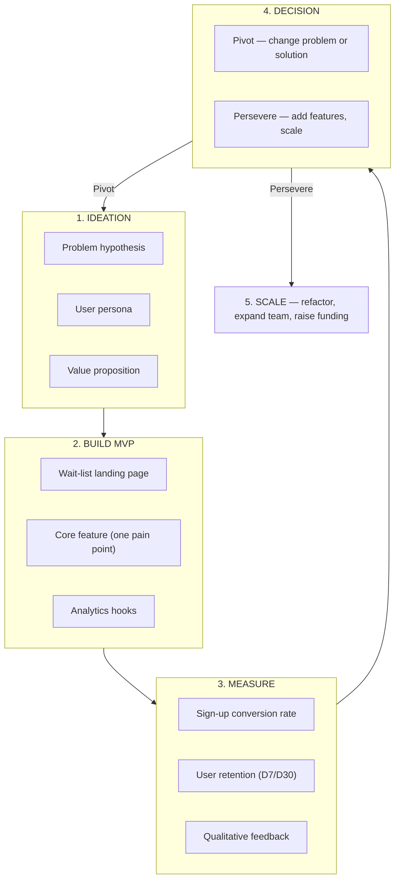

<section lang="en">

## Why Startups Need a Different Engineering Mindset

**Startup software engineering is not just enterprise engineering at a smaller scale.** It is a fundamentally different discipline where the constraints are flipped: instead of optimizing for long-term maintainability first, you optimize for **speed of learning**.

Consider how priorities shift between enterprise and startup contexts:

| Dimension | Enterprise SE | Startup SE |
|---|---|---|
| **Primary goal** | Build correct, maintainable systems | Prove or disprove a hypothesis |
| **Time horizon** | Years (the system must endure) | Weeks (the idea must be validated) |
| **Worst-case failure** | Production outage, data loss, compliance breach | Nobody uses the product (the real failure) |
| **Testing approach** | Comprehensive test suites before release | Critical-path smoke tests; real users are the test suite |
| **Architecture** | Designed for 100x scale from day one | Designed for 100 users; re-architect after traction |
| **Technical debt** | Actively minimized | Strategically incurred and tracked |
| **Deploy frequency** | Scheduled releases (weekly/bi-weekly) | Multiple times per day |
| **User feedback loop** | Months (formal UAT, surveys) | Hours (analytics, direct conversations) |

### The MVP Mindset

An MVP (Minimum Viable Product) is **not** a half-built product. It is the smallest experiment that tests your riskiest assumption. Eric Ries defines it as:

> "That version of a new product which allows a team to collect the maximum amount of validated learning about customers with the least effort."

The key phrase is **validated learning**, not **completed features**. Every line of code you write for an MVP should answer a specific question about your users, your market, or your business model.

### The Build-Measure-Learn Loop

The fundamental cycle of startup engineering:

```
Build ───→ Measure ───→ Learn
  ↑                        │
  └────────────────────────┘
```

1. **Build**: Create the simplest thing that can test your hypothesis.
2. **Measure**: Collect real data — not opinions, not "I would use this" from friends.
3. **Learn**: Decide whether to pivot (change direction) or persevere (double down).

This loop should take **days, not months**. If your build phase takes three months, you are not doing an MVP — you are building a product without evidence that anyone wants it.

</section>

<section lang="id">

## Mengapa Startup Membutuhkan Pola Pikir Rekayasa yang Berbeda

**Rekayasa perangkat lunak startup bukan sekadar rekayasa enterprise dalam skala yang lebih kecil.** Ini adalah disiplin yang berbeda secara fundamental di mana batasannya terbalik: alih-alih mengoptimalkan pemeliharaan jangka panjang terlebih dahulu, Anda mengoptimalkan **kecepatan pembelajaran**.

Pertimbangkan bagaimana prioritas bergeser antara konteks enterprise dan startup:

| Dimensi | SE Enterprise | SE Startup |
|---|---|---|
| **Tujuan utama** | Membangun sistem yang benar dan dapat dipelihara | Membuktikan atau menyanggah hipotesis |
| **Horison waktu** | Bertahun-tahun (sistem harus bertahan) | Berminggu-minggu (ide harus divalidasi) |
| **Kegagalan terburuk** | Gangguan produksi, kehilangan data, pelanggaran kepatuhan | Tidak ada yang menggunakan produk (kegagalan sebenarnya) |
| **Pendekatan pengujian** | Rangkaian pengujian komprehensif sebelum rilis | Smoke test jalur kritis; pengguna nyata adalah rangkaian pengujian |
| **Arsitektur** | Dirancang untuk skala 100x sejak hari pertama | Dirancang untuk 100 pengguna; arsitektur ulang setelah ada traksi |
| **Utang teknis** | Diminimalkan secara aktif | Sengaja diambil dan dilacak |
| **Frekuensi deploy** | Rilis terjadwal (mingguan/dua mingguan) | Beberapa kali per hari |
| **Loop umpan balik pengguna** | Berbulan-bulan (UAT formal, survei) | Jam (analitik, percakapan langsung) |

### Pola Pikir MVP

MVP (Minimum Viable Product) **bukan** produk setengah jadi. MVP adalah eksperimen terkecil yang menguji asumsi paling berisiko Anda. Eric Ries mendefinisikannya sebagai:

> "Versi produk baru yang memungkinkan tim mengumpulkan pembelajaran tervalidasi sebanyak mungkin tentang pelanggan dengan usaha seminimal mungkin."

Kata kuncinya adalah **pembelajaran tervalidasi**, bukan **fitur yang selesai**. Setiap baris kode yang Anda tulis untuk MVP harus menjawab pertanyaan spesifik tentang pengguna, pasar, atau model bisnis Anda.

### Siklus Build-Measure-Learn

Siklus fundamental rekayasa startup:

```
Build ───→ Measure ───→ Learn
  ↑                        │
  └────────────────────────┘
```

1. **Build**: Buat hal paling sederhana yang dapat menguji hipotesis Anda.
2. **Measure**: Kumpulkan data nyata, bukan opini, bukan "saya akan menggunakan ini" dari teman.
3. **Learn**: Putuskan apakah akan pivot (ubah arah) atau persevere (gandakan).

Siklus ini seharusnya memakan waktu **hari, bukan bulan**. Jika fase build Anda memakan waktu tiga bulan, Anda tidak sedang mengerjakan MVP, Anda sedang membangun produk tanpa bukti bahwa ada yang menginginkannya.

</section>

---

<figure class="my-10 text-center" role="figure">



<figcaption class="mt-3 text-sm text-neutral-500">
  <span lang="en">Figure: The startup software engineering lifecycle — from idea to validated product</span>
  <span lang="id">Gambar: Siklus hidup rekayasa perangkat lunak startup — dari ide ke produk tervalidasi</span>
</figcaption>
</figure>

---

<section lang="en">

## Picking the Right Scope for an MVP

The single most common startup mistake is **building too much before learning anything**. Here is a framework for scoping your MVP correctly.

### Step 1: Write Down Your Riskiest Assumption

Every startup idea rests on untested assumptions. Not all assumptions are equally dangerous. Find the one that, if wrong, would make the entire idea fail. Examples:

| Startup Idea | Safe Assumption | Risky Assumption |
|---|---|---|
| "A marketplace for used textbooks at Politeknik" | Students buy textbooks (proven) | Students will list their old books (unproven — requires effort from sellers) |
| "A food delivery app for campus canteens" | People order food (proven) | Canteen vendors will adopt the platform (unproven — requires behavior change) |
| "A peer-to-peer study group matching app" | Students want study groups (proven) | Students will share their schedules and subjects (unproven — privacy concern) |

### Step 2: Define the One-Pain-Point Rule

Your MVP should solve **exactly one pain point** for **exactly one user persona**. Not two. Not "it also does X as a bonus." One.

**Good scope statement:**
> "Help final-year Politeknik students find teammates for their capstone project by matching based on skills and availability."

**Bad scope statement (too broad):**
> "A platform for students to collaborate on projects, find mentors, share resources, and track their academic progress."

The bad statement describes four products. Pick one and strip everything else.

### Step 3: Write User Stories for the MVP Only

User stories for an MVP follow a strict format:

```
As a [specific persona],
I want to [single action],
So that [measurable outcome].
```

For a startup idea validation dashboard:

| Story ID | User Story | Out of MVP? |
|---|---|---|
| US-01 | As a visitor, I want to submit my email to join the wait-list, so that I get notified when the product launches. | No — core |
| US-02 | As a founder, I want to see how many people signed up this week, so that I know if interest is growing. | No — core |
| US-03 | As a founder, I want to know which traffic source brought the most sign-ups, so that I can focus marketing efforts. | Yes — nice to have, but learn through manual analytics first |
| US-04 | As a visitor, I want to refer friends and earn a priority spot, so that the product launches faster for me. | Yes — viral mechanics come after you prove people want the core product |

### The Scoping Litmus Test

For every feature you are tempted to add, ask: **"If I remove this, can I still test my riskiest assumption?"** If the answer is yes, remove it. Features that fail the litmus test go into a backlog labeled **"Post-Validation"** — not **"Sprint 2"**, because there may never be a Sprint 2 if the assumption is false.

</section>

<section lang="id">

## Memilih Cakupan yang Tepat untuk MVP

Kesalahan startup yang paling umum adalah **membangun terlalu banyak sebelum mempelajari apa pun**. Berikut adalah kerangka kerja untuk menentukan cakupan MVP Anda dengan benar.

### Langkah 1: Tuliskan Asumsi Paling Berisiko Anda

Setiap ide startup bertumpu pada asumsi yang belum teruji. Tidak semua asumsi sama berbahayanya. Temukan asumsi yang, jika salah, akan membuat seluruh ide gagal. Contoh:

| Ide Startup | Asumsi Aman | Asumsi Berisiko |
|---|---|---|
| "Marketplace buku bekas di Politeknik" | Mahasiswa membeli buku teks (terbukti) | Mahasiswa akan mendaftarkan buku lama mereka (belum terbukti — memerlukan usaha dari penjual) |
| "Aplikasi pesan-antar makanan untuk kantin kampus" | Orang memesan makanan (terbukti) | Vendor kantin akan mengadopsi platform (belum terbukti — memerlukan perubahan perilaku) |
| "Aplikasi pencocokan kelompok belajar peer-to-peer" | Mahasiswa menginginkan kelompok belajar (terbukti) | Mahasiswa akan membagikan jadwal dan mata kuliah mereka (belum terbukti — masalah privasi) |

### Langkah 2: Terapkan Aturan Satu Pain Point

MVP Anda harus menyelesaikan **tepat satu pain point** untuk **tepat satu persona pengguna**. Bukan dua. Bukan "sekaligus bisa melakukan X sebagai bonus." Satu.

**Pernyataan cakupan yang baik:**
> "Membantu mahasiswa tingkat akhir Politeknik menemukan rekan tim untuk proyek akhir mereka dengan mencocokkan berdasarkan keterampilan dan ketersediaan."

**Pernyataan cakupan yang buruk (terlalu luas):**
> "Platform bagi mahasiswa untuk berkolaborasi dalam proyek, menemukan mentor, berbagi sumber daya, dan melacak kemajuan akademik mereka."

Pernyataan buruk tersebut menggambarkan empat produk. Pilih satu dan hapus yang lainnya.

### Langkah 3: Tulis User Stories Hanya untuk MVP

User stories untuk MVP mengikuti format yang ketat:

```
Sebagai [persona spesifik],
Saya ingin [satu tindakan],
Sehingga [hasil yang terukur].
```

Untuk dashboard validasi ide startup:

| ID Cerita | User Story | Di luar MVP? |
|---|---|---|
| US-01 | Sebagai pengunjung, saya ingin mengirimkan email saya untuk bergabung dengan wait-list, sehingga saya mendapat notifikasi saat produk diluncurkan. | Tidak — inti |
| US-02 | Sebagai founder, saya ingin melihat berapa banyak orang yang mendaftar minggu ini, sehingga saya tahu apakah minat bertumbuh. | Tidak — inti |
| US-03 | Sebagai founder, saya ingin tahu sumber trafik mana yang membawa pendaftaran terbanyak, sehingga saya bisa memfokuskan upaya pemasaran. | Ya — bagus untuk dimiliki, tetapi pelajari melalui analitik manual dulu |
| US-04 | Sebagai pengunjung, saya ingin mereferensikan teman dan mendapatkan tempat prioritas, sehingga produk diluncurkan lebih cepat untuk saya. | Ya — mekanisme viral datang setelah Anda membuktikan orang menginginkan produk inti |

### Uji Litmus Cakupan

Untuk setiap fitur yang tergoda untuk ditambahkan, tanyakan: **"Jika saya menghapus ini, bisakah saya tetap menguji asumsi paling berisiko saya?"** Jika jawabannya ya, hapus. Fitur yang gagal uji litmus masuk ke dalam backlog berlabel **"Post-Validation"** — bukan **"Sprint 2"**, karena mungkin tidak akan pernah ada Sprint 2 jika asumsinya salah.

</section>

---

<section lang="en">

## Architecture for Startup MVPs

### Monolith-First Is Not a Compromise — It Is a Strategy

Startup engineers often feel pressure to design a microservices architecture because "that is what the big companies do." But the companies that use microservices successfully did not start with them. **Amazon started as a monolith. eBay started as a monolith. Twitter started as a monolith.** You should too.

**Why microservices are dangerous for an MVP:**

1. **You do not know your domain boundaries yet.** Splitting a system into services before you understand the domain results in the wrong boundaries, which are exponentially more expensive to fix than in a monolith.
2. **Deployment complexity kills velocity.** Coordinating deployments across 5 services when you have 0 users is a waste of time.
3. **Debugging distributed systems without observability tooling is painful.** Stack traces are your friend; distributed traces require infrastructure.

### The Startup Layered Architecture

For a PHP MVP, use a **layered monolith** — a single deployable unit with clear separation of concerns **inside** the codebase:

```
┌──────────────────────────────┐
│      Presentation Layer      │  ← Blade templates, controllers
├──────────────────────────────┤
│       Application Layer      │  ← Use cases, services, DTOs
├──────────────────────────────┤
│         Domain Layer         │  ← Entities, value objects, business rules
├──────────────────────────────┤
│     Infrastructure Layer     │  ← Database, file storage, email, queues
└──────────────────────────────┘
```

This structure gives you the **code-level isolation** of a well-designed system without the **operational cost** of distributed services. When you need to extract a service later, the domain boundaries are already clear — you are just moving the boundary from a namespace to a network boundary.

### Technology Stack Decision for Startup MVPs

| Component | MVP Choice | Why |
|---|---|---|
| **Language / Framework** | PHP / Laravel | Fastest path from idea to deployed web app; massive ecosystem (authentication, queues, caching already built) |
| **Database** | SQLite (MVP) → MySQL/PostgreSQL (post-traction) | Zero setup, single file, no server process. Migrate when you have real users. |
| **Frontend** | Blade templates + Alpine.js (MVP) → Vue.js/React (post-traction) | Server-rendered pages are faster to build. Add interactivity incrementally with Alpine. |
| **Hosting** | Laravel Forge + $6/month VPS, or Railway / Fly.io | Avoid AWS/GCP complexity. Pick a PaaS that lets you `git push` to deploy. |
| **Queue / Jobs** | Database queue driver (MVP) → Redis (post-traction) | Laravel's database queue works out of the box with zero configuration. |
| **Email** | Mailtrap (dev) → Postmark / Resend (prod) | Transactional email should be someone else's problem until you have paying customers. |
| **File storage** | Local disk (MVP) → S3 (post-traction) | Laravel's filesystem abstraction makes this a one-line config change later. |

### When to Extract a Service

Extract a bounded context into its own service only when **at least two** of these conditions are true:

1. The component has a **different deployment cadence** than the rest of the system (e.g., a search index that updates hourly vs. a web app that deploys multiple times a day).
2. The component needs to **scale independently** (e.g., an image processing pipeline that spikes during uploads).
3. A **separate team** owns the component and needs autonomy over its release cycle.

If none of these are true in your 0-to-1000-user phase, stay monolithic.

</section>

<section lang="id">

## Arsitektur untuk MVP Startup

### Monolith-First Bukanlah Kompromi — Ini Adalah Strategi

Engineer startup sering merasa tertekan untuk merancang arsitektur microservices karena "itulah yang dilakukan perusahaan besar." Tetapi perusahaan yang berhasil menggunakan microservices tidak memulai dengan itu. **Amazon dimulai sebagai monolith. eBay dimulai sebagai monolith. Twitter dimulai sebagai monolith.** Anda juga harus begitu.

**Mengapa microservices berbahaya untuk MVP:**

1. **Anda belum mengetahui batasan domain Anda.** Memecah sistem menjadi layanan sebelum Anda memahami domain menghasilkan batasan yang salah, yang secara eksponensial lebih mahal untuk diperbaiki daripada di monolith.
2. **Kompleksitas deployment membunuh kecepatan.** Mengoordinasikan deployment di 5 layanan ketika Anda memiliki 0 pengguna adalah buang-buang waktu.
3. **Debugging sistem terdistribusi tanpa alat observability menyakitkan.** Stack trace adalah teman Anda; distributed trace memerlukan infrastruktur.

### Arsitektur Berlapis untuk Startup

Untuk MVP PHP, gunakan **monolith berlapis** — satu unit yang dapat di-deploy dengan pemisahan concern yang jelas **di dalam** basis kode:

```
┌──────────────────────────────┐
│      Presentation Layer      │  ← Blade templates, controller
├──────────────────────────────┤
│       Application Layer      │  ← Use case, service, DTO
├──────────────────────────────┤
│         Domain Layer         │  ← Entity, value object, aturan bisnis
├──────────────────────────────┤
│     Infrastructure Layer     │  ← Database, penyimpanan file, email, queue
└──────────────────────────────┘
```

Struktur ini memberi Anda **isolasi tingkat kode** dari sistem yang dirancang dengan baik tanpa **biaya operasional** layanan terdistribusi. Ketika Anda perlu mengekstrak layanan nanti, batasan domain sudah jelas — Anda hanya memindahkan batasan dari namespace ke batasan jaringan.

### Keputusan Technology Stack untuk MVP Startup

| Komponen | Pilihan MVP | Mengapa |
|---|---|---|
| **Bahasa / Framework** | PHP / Laravel | Jalur tercepat dari ide ke aplikasi web yang di-deploy; ekosistem besar (otentikasi, queue, caching sudah tersedia) |
| **Database** | SQLite (MVP) → MySQL/PostgreSQL (setelah traksi) | Nol setup, satu file, tanpa proses server. Migrasi ketika Anda memiliki pengguna nyata. |
| **Frontend** | Blade template + Alpine.js (MVP) → Vue.js/React (setelah traksi) | Halaman server-rendered lebih cepat dibangun. Tambahkan interaktivitas secara bertahap dengan Alpine. |
| **Hosting** | Laravel Forge + VPS $6/bulan, atau Railway / Fly.io | Hindari kompleksitas AWS/GCP. Pilih PaaS yang memungkinkan `git push` untuk deploy. |
| **Queue / Jobs** | Database queue driver (MVP) → Redis (setelah traksi) | Database queue Laravel bekerja langsung tanpa konfigurasi. |
| **Email** | Mailtrap (dev) → Postmark / Resend (prod) | Email transaksional seharusnya menjadi masalah orang lain sampai Anda memiliki pelanggan yang membayar. |
| **Penyimpanan file** | Disk lokal (MVP) → S3 (setelah traksi) | Abstraksi filesystem Laravel membuat ini menjadi perubahan konfigurasi satu baris nanti. |

### Kapan Mengekstrak Layanan

Ekstrak bounded context menjadi layanannya sendiri hanya ketika **setidaknya dua** dari kondisi ini terpenuhi:

1. Komponen memiliki **irama deployment yang berbeda** dari bagian sistem lainnya (misalnya, indeks pencarian yang diperbarui setiap jam vs. aplikasi web yang di-deploy beberapa kali sehari).
2. Komponen perlu **skala secara independen** (misalnya, pipeline pemrosesan gambar yang melonjak saat upload).
3. **Tim terpisah** memiliki komponen tersebut dan membutuhkan otonomi atas siklus rilisnya.

Jika tidak ada yang benar dalam fase 0-hingga-1000-pengguna Anda, tetap monolith.

</section>

---

<section lang="en">

## Building a Startup Dashboard with PHP

Let us build a practical MVP: a **Startup Idea Validation Dashboard**. This dashboard lets founders:

1. **Collect wait-list sign-ups** from a landing page with email validation.
2. **Track sign-up metrics** — total sign-ups, daily/weekly trends, source attribution.
3. **Serve a simple admin panel** to view the data and decide whether to persevere or pivot.

We will use **plain PHP** with a lightweight structure — no framework required for the MVP. The goal is to deploy in an afternoon, not a sprint.

### Project Structure

```
startup-mvp-dashboard/
├── public/
│   ├── index.php          # Landing page with wait-list form
│   ├── admin.php          # Protected dashboard view
│   ├── api/
│   │   ├── subscribe.php  # Wait-list signup endpoint
│   │   └── stats.php      # Dashboard metrics API
│   └── assets/
│       └── style.css
├── src/
│   ├── WaitListService.php  # Business logic for sign-ups
│   ├── MetricsService.php   # Dashboard analytics
│   ├── EmailValidator.php   # Email validation
│   └── Storage.php          # JSON file storage abstraction
├── data/
│   ├── waitlist.json        # Wait-list records (file-based DB)
│   └── analytics.json       # Page view and event data
└── config.php               # Environment and app configuration
```

### Step 1: The Storage Layer

For an MVP, **a JSON file is a valid database**. It requires zero setup, runs anywhere, and you can migrate to SQLite or MySQL with a single adapter swap later.

```php
<?php
// src/Storage.php

class Storage
{
    private string $basePath;

    public function __construct(string $basePath)
    {
        $this->basePath = rtrim($basePath, '/');
        if (!is_dir($this->basePath)) {
            mkdir($this->basePath, 0755, true);
        }
    }

    public function read(string $collection): array
    {
        $path = $this->getPath($collection);
        if (!file_exists($path)) {
            return [];
        }
        $data = json_decode(file_get_contents($path), true);
        return is_array($data) ? $data : [];
    }

    public function write(string $collection, array $data): bool
    {
        $path = $this->getPath($collection);
        return file_put_contents(
            $path,
            json_encode($data, JSON_PRETTY_PRINT | JSON_UNESCAPED_UNICODE),
            LOCK_EX
        ) !== false;
    }

    public function append(string $collection, array $record): bool
    {
        $data = $this->read($collection);
        $data[] = $record;
        return $this->write($collection, $data);
    }

    private function getPath(string $collection): string
    {
        return $this->basePath . '/' . $collection . '.json';
    }
}
```

This abstraction is the key insight: **by coding against an interface (even an implicit one), you decouple your business logic from your infrastructure choice**. When you switch to MySQL in month 3, you only change `Storage` — not your services.

### Step 2: The Wait-List Service

```php
<?php
// src/WaitListService.php

require_once __DIR__ . '/Storage.php';
require_once __DIR__ . '/EmailValidator.php';

class WaitListService
{
    private Storage $storage;
    private EmailValidator $validator;

    public function __construct(Storage $storage, EmailValidator $validator)
    {
        $this->storage = $storage;
        $this->validator = $validator;
    }

    public function subscribe(string $email, string $source = 'direct'): array
    {
        $email = trim(strtolower($email));

        if (!$this->validator->isValid($email)) {
            return [
                'success' => false,
                'error' => 'Please provide a valid email address.',
            ];
        }

        $existing = $this->storage->read('waitlist');

        foreach ($existing as $entry) {
            if ($entry['email'] === $email) {
                return [
                    'success' => true,
                    'message' => 'You are already on the wait-list!',
                    'alreadySubscribed' => true,
                ];
            }
        }

        $record = [
            'id' => uniqid('wl_', true),
            'email' => $email,
            'source' => $source,
            'subscribedAt' => date('Y-m-d H:i:s'),
            'ip' => $_SERVER['REMOTE_ADDR'] ?? 'unknown',
        ];

        $this->storage->append('waitlist', $record);

        return [
            'success' => true,
            'message' => 'You are on the list! We will notify you when we launch.',
            'position' => count($existing) + 1,
        ];
    }

    public function getSignUpCount(): int
    {
        return count($this->storage->read('waitlist'));
    }

    public function getDailyTrend(int $days = 7): array
    {
        $records = $this->storage->read('waitlist');
        $trend = [];

        for ($i = $days - 1; $i >= 0; $i--) {
            $date = date('Y-m-d', strtotime("-{$i} days"));
            $trend[$date] = 0;
        }

        foreach ($records as $record) {
            $date = substr($record['subscribedAt'], 0, 10);
            if (isset($trend[$date])) {
                $trend[$date]++;
            }
        }

        return $trend;
    }

    public function getSourceBreakdown(): array
    {
        $records = $this->storage->read('waitlist');
        $sources = [];

        foreach ($records as $record) {
            $source = $record['source'] ?? 'unknown';
            $sources[$source] = ($sources[$source] ?? 0) + 1;
        }

        arsort($sources);
        return $sources;
    }
}
```

### Step 3: Email Validation

```php
<?php
// src/EmailValidator.php

class EmailValidator
{
    public function isValid(string $email): bool
    {
        if (!filter_var($email, FILTER_VALIDATE_EMAIL)) {
            return false;
        }

        $domain = substr(strrchr($email, '@'), 1);

        $disposableDomains = [
            'mailinator.com', 'guerrillamail.com', '10minutemail.com',
            'tempmail.com', 'throwaway.email', 'yopmail.com',
        ];

        if (in_array($domain, $disposableDomains)) {
            return true; // Allow them for MVP — just flag them later
        }

        return true;
    }
}
```

### Step 4: The API Endpoints

```php
<?php
// public/api/subscribe.php

header('Content-Type: application/json');
header('Access-Control-Allow-Origin: *');
header('Access-Control-Allow-Methods: POST, OPTIONS');
header('Access-Control-Allow-Headers: Content-Type');

if ($_SERVER['REQUEST_METHOD'] === 'OPTIONS') {
    http_response_code(204);
    exit;
}

if ($_SERVER['REQUEST_METHOD'] !== 'POST') {
    http_response_code(405);
    echo json_encode(['success' => false, 'error' => 'Method not allowed']);
    exit;
}

require_once __DIR__ . '/../../src/WaitListService.php';
require_once __DIR__ . '/../../src/Storage.php';
require_once __DIR__ . '/../../src/EmailValidator.php';

$input = json_decode(file_get_contents('php://input'), true);
$email = $input['email'] ?? '';
$source = $input['source'] ?? ($_GET['utm_source'] ?? 'direct');

$storage = new Storage(__DIR__ . '/../../data');
$validator = new EmailValidator();
$service = new WaitListService($storage, $validator);

$result = $service->subscribe($email, $source);
$statusCode = $result['success'] ? 200 : 422;

http_response_code($statusCode);
echo json_encode($result);
```

```php
<?php
// public/api/stats.php

header('Content-Type: application/json');

$apiKey = $_SERVER['HTTP_X_API_KEY'] ?? $_GET['api_key'] ?? '';
$secret = getenv('ADMIN_API_KEY') ?: 'mvp-default-key-change-me';

if ($apiKey !== $secret) {
    http_response_code(401);
    echo json_encode(['error' => 'Unauthorized']);
    exit;
}

require_once __DIR__ . '/../../src/WaitListService.php';
require_once __DIR__ . '/../../src/Storage.php';
require_once __DIR__ . '/../../src/EmailValidator.php';

$storage = new Storage(__DIR__ . '/../../data');
$validator = new EmailValidator();
$service = new WaitListService($storage, $validator);

echo json_encode([
    'totalSignUps' => $service->getSignUpCount(),
    'dailyTrend' => $service->getDailyTrend(7),
    'sourceBreakdown' => $service->getSourceBreakdown(),
    'generatedAt' => date('Y-m-d H:i:s'),
]);
```

### Step 5: The Landing Page

```html
<!-- public/index.php -->
<!DOCTYPE html>
<html lang="en">
<head>
    <meta charset="UTF-8">
    <meta name="viewport" content="width=device-width, initial-scale=1.0">
    <title>Startuply — Find Your Capstone Teammates</title>
    <style>
        * { box-sizing: border-box; margin: 0; padding: 0; }
        body {
            font-family: -apple-system, BlinkMacSystemFont, 'Segoe UI', sans-serif;
            background: linear-gradient(135deg, #667eea 0%, #764ba2 100%);
            min-height: 100vh;
            display: flex;
            align-items: center;
            justify-content: center;
            color: #1a1a2e;
        }
        .card {
            background: #fff;
            border-radius: 16px;
            padding: 48px 40px;
            max-width: 480px;
            width: 90%;
            box-shadow: 0 20px 60px rgba(0,0,0,0.15);
            text-align: center;
        }
        .card h1 { font-size: 1.8rem; margin-bottom: 8px; }
        .card .subtitle { color: #666; margin-bottom: 32px; font-size: 1rem; line-height: 1.6; }
        .form-group { margin-bottom: 16px; text-align: left; }
        .form-group label { display: block; font-weight: 600; margin-bottom: 6px; font-size: 0.9rem; }
        .form-group input {
            width: 100%;
            padding: 12px 16px;
            border: 2px solid #e0e0e0;
            border-radius: 8px;
            font-size: 1rem;
            transition: border-color 0.2s;
        }
        .form-group input:focus { outline: none; border-color: #667eea; }
        button {
            width: 100%;
            padding: 14px;
            background: #667eea;
            color: #fff;
            border: none;
            border-radius: 8px;
            font-size: 1.05rem;
            font-weight: 600;
            cursor: pointer;
            transition: background 0.2s;
        }
        button:hover { background: #5a6fd6; }
        button:disabled { background: #a0a0a0; cursor: not-allowed; }
        .message { margin-top: 16px; padding: 12px; border-radius: 8px; font-size: 0.9rem; display: none; }
        .message.success { background: #e8f5e9; color: #2e7d32; display: block; }
        .message.error { background: #ffebee; color: #c62828; display: block; }
        .counter { margin-top: 24px; font-size: 0.85rem; color: #999; }
    </style>
</head>
<body>
    <div class="card">
        <h1>Startuply</h1>
        <p class="subtitle">
            Find the perfect teammates for your final project. We are launching soon — join the wait-list to get early access.
        </p>
        <form id="waitlist-form">
            <div class="form-group">
                <label for="email">Your email address</label>
                <input type="email" id="email" name="email"
                       placeholder="you@example.com" required>
            </div>
            <button type="submit" id="submit-btn">Join the Wait-List</button>
        </form>
        <div id="message" class="message"></div>
        <div class="counter" id="counter"></div>
    </div>

    <script>
        const form = document.getElementById('waitlist-form');
        const messageEl = document.getElementById('message');
        const submitBtn = document.getElementById('submit-btn');

        form.addEventListener('submit', async (e) => {
            e.preventDefault();
            submitBtn.disabled = true;
            submitBtn.textContent = 'Submitting...';
            messageEl.className = 'message';

            const email = document.getElementById('email').value;
            const source = new URLSearchParams(window.location.search).get('utm_source') || 'direct';

            try {
                const res = await fetch('/api/subscribe.php', {
                    method: 'POST',
                    headers: { 'Content-Type': 'application/json' },
                    body: JSON.stringify({ email, source }),
                });

                const data = await res.json();

                if (data.success) {
                    messageEl.className = 'message success';
                    messageEl.textContent = data.message;
                    form.reset();
                } else {
                    messageEl.className = 'message error';
                    messageEl.textContent = data.error || 'Something went wrong.';
                }
            } catch (err) {
                messageEl.className = 'message error';
                messageEl.textContent = 'Network error. Please try again.';
            } finally {
                submitBtn.disabled = false;
                submitBtn.textContent = 'Join the Wait-List';
            }
        });
    </script>
</body>
</html>
```

### Step 6: The Founder Dashboard

```php
<?php
// public/admin.php

$apiKey = $_GET['api_key'] ?? '';
$secret = getenv('ADMIN_API_KEY') ?: 'mvp-default-key-change-me';

if ($apiKey !== $secret) {
    http_response_code(401);
    echo '<h1>Unauthorized</h1><p>Provide a valid API key to access the dashboard.</p>';
    exit;
}

$statsJson = file_get_contents(__DIR__ . '/api/stats.php?' . http_build_query(['api_key' => $apiKey]));
$stats = json_decode($statsJson, true);

$total = $stats['totalSignUps'] ?? 0;
$daily = $stats['dailyTrend'] ?? [];
$sources = $stats['sourceBreakdown'] ?? [];
?>
<!DOCTYPE html>
<html lang="en">
<head>
    <meta charset="UTF-8">
    <meta name="viewport" content="width=device-width, initial-scale=1.0">
    <title>Startuply — Founder Dashboard</title>
    <style>
        * { box-sizing: border-box; margin: 0; padding: 0; }
        body {
            font-family: -apple-system, BlinkMacSystemFont, 'Segoe UI', sans-serif;
            background: #f5f5f5;
            padding: 40px 20px;
            color: #1a1a2e;
        }
        .container { max-width: 800px; margin: 0 auto; }
        h1 { font-size: 1.6rem; margin-bottom: 24px; }
        .metric-card {
            background: #fff;
            border-radius: 12px;
            padding: 24px;
            margin-bottom: 20px;
            box-shadow: 0 2px 8px rgba(0,0,0,0.06);
        }
        .metric-card h2 { font-size: 0.85rem; color: #888; text-transform: uppercase; letter-spacing: 0.5px; margin-bottom: 8px; }
        .metric-card .value { font-size: 2.4rem; font-weight: 700; color: #667eea; }
        table { width: 100%; border-collapse: collapse; margin-top: 12px; }
        th, td { text-align: left; padding: 10px 12px; border-bottom: 1px solid #f0f0f0; }
        th { font-size: 0.8rem; color: #888; text-transform: uppercase; }
        td { font-size: 0.95rem; }
        .decision-box {
            background: #fff;
            border-radius: 12px;
            padding: 24px;
            box-shadow: 0 2px 8px rgba(0,0,0,0.06);
            text-align: center;
        }
        .decision-box h2 { margin-bottom: 16px; }
    </style>
</head>
<body>
    <div class="container">
        <h1>Startuply — Founder Dashboard</h1>

        <div class="metric-card">
            <h2>Total Wait-List Sign-Ups</h2>
            <div class="value"><?= $total ?></div>
        </div>

        <div class="metric-card">
            <h2>Last 7 Days Trend</h2>
            <table>
                <thead>
                    <tr><th>Date</th><th>Sign-Ups</th></tr>
                </thead>
                <tbody>
                    <?php foreach ($daily as $date => $count): ?>
                    <tr><td><?= htmlspecialchars($date) ?></td><td><?= $count ?></td></tr>
                    <?php endforeach; ?>
                </tbody>
            </table>
        </div>

        <div class="metric-card">
            <h2>Traffic Source Breakdown</h2>
            <table>
                <thead>
                    <tr><th>Source</th><th>Sign-Ups</th></tr>
                </thead>
                <tbody>
                    <?php foreach ($sources as $source => $count): ?>
                    <tr><td><?= htmlspecialchars($source) ?></td><td><?= $count ?></td></tr>
                    <?php endforeach; ?>
                </tbody>
            </table>
        </div>

        <div class="decision-box">
            <h2>Decision Framework</h2>
            <?php if ($total < 20): ?>
                <p><strong>Keep experimenting.</strong> Less than 20 sign-ups means you need more data. Try different channels, messaging, or even a different target persona.</p>
            <?php elseif ($total < 100): ?>
                <p><strong>Promising early signal.</strong> 20-100 sign-ups shows genuine interest. Talk to 5 of them and learn why they signed up before building more.</p>
            <?php else: ?>
                <p><strong>Strong validation.</strong> 100+ sign-ups is statistically meaningful. It is time to build the core feature and start onboarding.</p>
            <?php endif; ?>
        </div>
    </div>
</body>
</html>
```

### How to Run This MVP in 5 Minutes

```bash
# 1. Create the project
mkdir startup-mvp-dashboard && cd startup-mvp-dashboard
mkdir -p public/api src data

# 2. Create all the files shown above (Storage.php, WaitListService.php, etc.)

# 3. Start PHP's built-in server
ADMIN_API_KEY="my-secret-key-2026" php -S localhost:8080 -t public/

# 4. Open the landing page
# http://localhost:8080/

# 5. View the dashboard
# http://localhost:8080/admin.php?api_key=my-secret-key-2026
```

</section>

<section lang="id">

## Membangun Dashboard Startup dengan PHP

Mari bangun MVP praktis: **Dashboard Validasi Ide Startup**. Dashboard ini memungkinkan founder untuk:

1. **Mengumpulkan pendaftaran wait-list** dari landing page dengan validasi email.
2. **Melacak metrik pendaftaran** — total pendaftaran, tren harian/mingguan, atribusi sumber.
3. **Menyajikan panel admin sederhana** untuk melihat data dan memutuskan apakah akan persevere atau pivot.

Kita akan menggunakan **PHP polos** dengan struktur ringan — tidak perlu framework untuk MVP. Tujuannya adalah deploy dalam satu sore, bukan satu sprint.

### Struktur Proyek

```
startup-mvp-dashboard/
├── public/
│   ├── index.php          # Landing page dengan form wait-list
│   ├── admin.php          # Tampilan dashboard yang dilindungi
│   ├── api/
│   │   ├── subscribe.php  # Endpoint pendaftaran wait-list
│   │   └── stats.php      # API metrik dashboard
│   └── assets/
│       └── style.css
├── src/
│   ├── WaitListService.php  # Logika bisnis untuk pendaftaran
│   ├── MetricsService.php   # Analitik dashboard
│   ├── EmailValidator.php   # Validasi email
│   └── Storage.php          # Abstraksi penyimpanan file JSON
├── data/
│   ├── waitlist.json        # Data wait-list (database berbasis file)
│   └── analytics.json       # Data page view dan event
└── config.php               # Konfigurasi environment dan aplikasi
```

### Langkah 1: Lapisan Penyimpanan

Untuk MVP, **file JSON adalah database yang valid**. Tidak memerlukan setup, berjalan di mana saja, dan Anda dapat bermigrasi ke SQLite atau MySQL dengan satu pergantian adapter nanti.

```php
<?php
// src/Storage.php

class Storage
{
    private string $basePath;

    public function __construct(string $basePath)
    {
        $this->basePath = rtrim($basePath, '/');
        if (!is_dir($this->basePath)) {
            mkdir($this->basePath, 0755, true);
        }
    }

    public function read(string $collection): array
    {
        $path = $this->getPath($collection);
        if (!file_exists($path)) {
            return [];
        }
        $data = json_decode(file_get_contents($path), true);
        return is_array($data) ? $data : [];
    }

    public function write(string $collection, array $data): bool
    {
        $path = $this->getPath($collection);
        return file_put_contents(
            $path,
            json_encode($data, JSON_PRETTY_PRINT | JSON_UNESCAPED_UNICODE),
            LOCK_EX
        ) !== false;
    }

    public function append(string $collection, array $record): bool
    {
        $data = $this->read($collection);
        $data[] = $record;
        return $this->write($collection, $data);
    }

    private function getPath(string $collection): string
    {
        return $this->basePath . '/' . $collection . '.json';
    }
}
```

Abstraksi ini adalah wawasan kunci: **dengan menulis kode terhadap antarmuka (bahkan yang implisit), Anda memisahkan logika bisnis dari pilihan infrastruktur**. Ketika Anda beralih ke MySQL di bulan ke-3, Anda hanya mengubah `Storage` — bukan service Anda.

### Langkah 2: Service Wait-List

```php
<?php
// src/WaitListService.php

require_once __DIR__ . '/Storage.php';
require_once __DIR__ . '/EmailValidator.php';

class WaitListService
{
    private Storage $storage;
    private EmailValidator $validator;

    public function __construct(Storage $storage, EmailValidator $validator)
    {
        $this->storage = $storage;
        $this->validator = $validator;
    }

    public function subscribe(string $email, string $source = 'direct'): array
    {
        $email = trim(strtolower($email));

        if (!$this->validator->isValid($email)) {
            return [
                'success' => false,
                'error' => 'Harap berikan alamat email yang valid.',
            ];
        }

        $existing = $this->storage->read('waitlist');

        foreach ($existing as $entry) {
            if ($entry['email'] === $email) {
                return [
                    'success' => true,
                    'message' => 'Anda sudah terdaftar di wait-list!',
                    'alreadySubscribed' => true,
                ];
            }
        }

        $record = [
            'id' => uniqid('wl_', true),
            'email' => $email,
            'source' => $source,
            'subscribedAt' => date('Y-m-d H:i:s'),
            'ip' => $_SERVER['REMOTE_ADDR'] ?? 'unknown',
        ];

        $this->storage->append('waitlist', $record);

        return [
            'success' => true,
            'message' => 'Anda sudah terdaftar! Kami akan memberi tahu saat kami meluncurkan.',
            'position' => count($existing) + 1,
        ];
    }

    public function getSignUpCount(): int
    {
        return count($this->storage->read('waitlist'));
    }

    public function getDailyTrend(int $days = 7): array
    {
        $records = $this->storage->read('waitlist');
        $trend = [];

        for ($i = $days - 1; $i >= 0; $i--) {
            $date = date('Y-m-d', strtotime("-{$i} days"));
            $trend[$date] = 0;
        }

        foreach ($records as $record) {
            $date = substr($record['subscribedAt'], 0, 10);
            if (isset($trend[$date])) {
                $trend[$date]++;
            }
        }

        return $trend;
    }

    public function getSourceBreakdown(): array
    {
        $records = $this->storage->read('waitlist');
        $sources = [];

        foreach ($records as $record) {
            $source = $record['source'] ?? 'unknown';
            $sources[$source] = ($sources[$source] ?? 0) + 1;
        }

        arsort($sources);
        return $sources;
    }
}
```

### Langkah 3: Validasi Email

```php
<?php
// src/EmailValidator.php

class EmailValidator
{
    public function isValid(string $email): bool
    {
        if (!filter_var($email, FILTER_VALIDATE_EMAIL)) {
            return false;
        }

        $domain = substr(strrchr($email, '@'), 1);

        $disposableDomains = [
            'mailinator.com', 'guerrillamail.com', '10minutemail.com',
            'tempmail.com', 'throwaway.email', 'yopmail.com',
        ];

        if (in_array($domain, $disposableDomains)) {
            return true; // Izinkan untuk MVP — tandai saja nanti
        }

        return true;
    }
}
```

### Langkah 4: Endpoint API

```php
<?php
// public/api/subscribe.php

header('Content-Type: application/json');
header('Access-Control-Allow-Origin: *');
header('Access-Control-Allow-Methods: POST, OPTIONS');
header('Access-Control-Allow-Headers: Content-Type');

if ($_SERVER['REQUEST_METHOD'] === 'OPTIONS') {
    http_response_code(204);
    exit;
}

if ($_SERVER['REQUEST_METHOD'] !== 'POST') {
    http_response_code(405);
    echo json_encode(['success' => false, 'error' => 'Method not allowed']);
    exit;
}

require_once __DIR__ . '/../../src/WaitListService.php';
require_once __DIR__ . '/../../src/Storage.php';
require_once __DIR__ . '/../../src/EmailValidator.php';

$input = json_decode(file_get_contents('php://input'), true);
$email = $input['email'] ?? '';
$source = $input['source'] ?? ($_GET['utm_source'] ?? 'direct');

$storage = new Storage(__DIR__ . '/../../data');
$validator = new EmailValidator();
$service = new WaitListService($storage, $validator);

$result = $service->subscribe($email, $source);
$statusCode = $result['success'] ? 200 : 422;

http_response_code($statusCode);
echo json_encode($result);
```

```php
<?php
// public/api/stats.php

header('Content-Type: application/json');

$apiKey = $_SERVER['HTTP_X_API_KEY'] ?? $_GET['api_key'] ?? '';
$secret = getenv('ADMIN_API_KEY') ?: 'mvp-default-key-change-me';

if ($apiKey !== $secret) {
    http_response_code(401);
    echo json_encode(['error' => 'Unauthorized']);
    exit;
}

require_once __DIR__ . '/../../src/WaitListService.php';
require_once __DIR__ . '/../../src/Storage.php';
require_once __DIR__ . '/../../src/EmailValidator.php';

$storage = new Storage(__DIR__ . '/../../data');
$validator = new EmailValidator();
$service = new WaitListService($storage, $validator);

echo json_encode([
    'totalSignUps' => $service->getSignUpCount(),
    'dailyTrend' => $service->getDailyTrend(7),
    'sourceBreakdown' => $service->getSourceBreakdown(),
    'generatedAt' => date('Y-m-d H:i:s'),
]);
```

### Langkah 5: Landing Page

```html
<!-- public/index.php -->
<!DOCTYPE html>
<html lang="id">
<head>
    <meta charset="UTF-8">
    <meta name="viewport" content="width=device-width, initial-scale=1.0">
    <title>Startuply — Temukan Rekan Proyek Akhir</title>
    <style>
        * { box-sizing: border-box; margin: 0; padding: 0; }
        body {
            font-family: -apple-system, BlinkMacSystemFont, 'Segoe UI', sans-serif;
            background: linear-gradient(135deg, #667eea 0%, #764ba2 100%);
            min-height: 100vh;
            display: flex;
            align-items: center;
            justify-content: center;
            color: #1a1a2e;
        }
        .card {
            background: #fff;
            border-radius: 16px;
            padding: 48px 40px;
            max-width: 480px;
            width: 90%;
            box-shadow: 0 20px 60px rgba(0,0,0,0.15);
            text-align: center;
        }
        .card h1 { font-size: 1.8rem; margin-bottom: 8px; }
        .card .subtitle { color: #666; margin-bottom: 32px; font-size: 1rem; line-height: 1.6; }
        .form-group { margin-bottom: 16px; text-align: left; }
        .form-group label { display: block; font-weight: 600; margin-bottom: 6px; font-size: 0.9rem; }
        .form-group input {
            width: 100%;
            padding: 12px 16px;
            border: 2px solid #e0e0e0;
            border-radius: 8px;
            font-size: 1rem;
            transition: border-color 0.2s;
        }
        .form-group input:focus { outline: none; border-color: #667eea; }
        button {
            width: 100%;
            padding: 14px;
            background: #667eea;
            color: #fff;
            border: none;
            border-radius: 8px;
            font-size: 1.05rem;
            font-weight: 600;
            cursor: pointer;
            transition: background 0.2s;
        }
        button:hover { background: #5a6fd6; }
        button:disabled { background: #a0a0a0; cursor: not-allowed; }
        .message { margin-top: 16px; padding: 12px; border-radius: 8px; font-size: 0.9rem; display: none; }
        .message.success { background: #e8f5e9; color: #2e7d32; display: block; }
        .message.error { background: #ffebee; color: #c62828; display: block; }
        .counter { margin-top: 24px; font-size: 0.85rem; color: #999; }
    </style>
</head>
<body>
    <div class="card">
        <h1>Startuply</h1>
        <p class="subtitle">
            Temukan rekan tim yang sempurna untuk proyek akhir Anda. Kami akan segera meluncur — bergabunglah dengan wait-list untuk akses awal.
        </p>
        <form id="waitlist-form">
            <div class="form-group">
                <label for="email">Alamat email Anda</label>
                <input type="email" id="email" name="email"
                       placeholder="anda@contoh.com" required>
            </div>
            <button type="submit" id="submit-btn">Gabung Wait-List</button>
        </form>
        <div id="message" class="message"></div>
        <div class="counter" id="counter"></div>
    </div>

    <script>
        const form = document.getElementById('waitlist-form');
        const messageEl = document.getElementById('message');
        const submitBtn = document.getElementById('submit-btn');

        form.addEventListener('submit', async (e) => {
            e.preventDefault();
            submitBtn.disabled = true;
            submitBtn.textContent = 'Mengirim...';
            messageEl.className = 'message';

            const email = document.getElementById('email').value;
            const source = new URLSearchParams(window.location.search).get('utm_source') || 'direct';

            try {
                const res = await fetch('/api/subscribe.php', {
                    method: 'POST',
                    headers: { 'Content-Type': 'application/json' },
                    body: JSON.stringify({ email, source }),
                });

                const data = await res.json();

                if (data.success) {
                    messageEl.className = 'message success';
                    messageEl.textContent = data.message;
                    form.reset();
                } else {
                    messageEl.className = 'message error';
                    messageEl.textContent = data.error || 'Terjadi kesalahan.';
                }
            } catch (err) {
                messageEl.className = 'message error';
                messageEl.textContent = 'Kesalahan jaringan. Silakan coba lagi.';
            } finally {
                submitBtn.disabled = false;
                submitBtn.textContent = 'Gabung Wait-List';
            }
        });
    </script>
</body>
</html>
```

### Langkah 6: Dashboard Founder

```php
<?php
// public/admin.php

$apiKey = $_GET['api_key'] ?? '';
$secret = getenv('ADMIN_API_KEY') ?: 'mvp-default-key-change-me';

if ($apiKey !== $secret) {
    http_response_code(401);
    echo '<h1>Tidak Diizinkan</h1><p>Berikan API key yang valid untuk mengakses dashboard.</p>';
    exit;
}

$statsJson = file_get_contents(__DIR__ . '/api/stats.php?' . http_build_query(['api_key' => $apiKey]));
$stats = json_decode($statsJson, true);

$total = $stats['totalSignUps'] ?? 0;
$daily = $stats['dailyTrend'] ?? [];
$sources = $stats['sourceBreakdown'] ?? [];
?>
<!DOCTYPE html>
<html lang="id">
<head>
    <meta charset="UTF-8">
    <meta name="viewport" content="width=device-width, initial-scale=1.0">
    <title>Startuply — Dashboard Founder</title>
    <style>
        * { box-sizing: border-box; margin: 0; padding: 0; }
        body {
            font-family: -apple-system, BlinkMacSystemFont, 'Segoe UI', sans-serif;
            background: #f5f5f5;
            padding: 40px 20px;
            color: #1a1a2e;
        }
        .container { max-width: 800px; margin: 0 auto; }
        h1 { font-size: 1.6rem; margin-bottom: 24px; }
        .metric-card {
            background: #fff;
            border-radius: 12px;
            padding: 24px;
            margin-bottom: 20px;
            box-shadow: 0 2px 8px rgba(0,0,0,0.06);
        }
        .metric-card h2 { font-size: 0.85rem; color: #888; text-transform: uppercase; letter-spacing: 0.5px; margin-bottom: 8px; }
        .metric-card .value { font-size: 2.4rem; font-weight: 700; color: #667eea; }
        table { width: 100%; border-collapse: collapse; margin-top: 12px; }
        th, td { text-align: left; padding: 10px 12px; border-bottom: 1px solid #f0f0f0; }
        th { font-size: 0.8rem; color: #888; text-transform: uppercase; }
        td { font-size: 0.95rem; }
        .decision-box {
            background: #fff;
            border-radius: 12px;
            padding: 24px;
            box-shadow: 0 2px 8px rgba(0,0,0,0.06);
            text-align: center;
        }
        .decision-box h2 { margin-bottom: 16px; }
    </style>
</head>
<body>
    <div class="container">
        <h1>Startuply — Dashboard Founder</h1>

        <div class="metric-card">
            <h2>Total Pendaftar Wait-List</h2>
            <div class="value"><?= $total ?></div>
        </div>

        <div class="metric-card">
            <h2>Tren 7 Hari Terakhir</h2>
            <table>
                <thead>
                    <tr><th>Tanggal</th><th>Pendaftar</th></tr>
                </thead>
                <tbody>
                    <?php foreach ($daily as $date => $count): ?>
                    <tr><td><?= htmlspecialchars($date) ?></td><td><?= $count ?></td></tr>
                    <?php endforeach; ?>
                </tbody>
            </table>
        </div>

        <div class="metric-card">
            <h2>Rincian Sumber Trafik</h2>
            <table>
                <thead>
                    <tr><th>Sumber</th><th>Pendaftar</th></tr>
                </thead>
                <tbody>
                    <?php foreach ($sources as $source => $count): ?>
                    <tr><td><?= htmlspecialchars($source) ?></td><td><?= $count ?></td></tr>
                    <?php endforeach; ?>
                </tbody>
            </table>
        </div>

        <div class="decision-box">
            <h2>Kerangka Keputusan</h2>
            <?php if ($total < 20): ?>
                <p><strong>Terus bereksperimen.</strong> Kurang dari 20 pendaftar berarti Anda butuh lebih banyak data. Coba channel, pesan, atau bahkan persona target yang berbeda.</p>
            <?php elseif ($total < 100): ?>
                <p><strong>Sinyal awal yang menjanjikan.</strong> 20-100 pendaftar menunjukkan minat yang tulus. Bicaralah dengan 5 di antaranya dan pelajari mengapa mereka mendaftar sebelum membangun lebih banyak.</p>
            <?php else: ?>
                <p><strong>Validasi yang kuat.</strong> 100+ pendaftar signifikan secara statistik. Saatnya membangun fitur inti dan mulai onboarding.</p>
            <?php endif; ?>
        </div>
    </div>
</body>
</html>
```

### Cara Menjalankan MVP Ini dalam 5 Menit

```bash
# 1. Buat proyek
mkdir startup-mvp-dashboard && cd startup-mvp-dashboard
mkdir -p public/api src data

# 2. Buat semua file yang ditunjukkan di atas (Storage.php, WaitListService.php, dll.)

# 3. Jalankan server bawaan PHP
ADMIN_API_KEY="kunci-rahasia-2026" php -S localhost:8080 -t public/

# 4. Buka landing page
# http://localhost:8080/

# 5. Lihat dashboard
# http://localhost:8080/admin.php?api_key=kunci-rahasia-2026
```

</section>

---

<section lang="en">

## Rapid Validation Techniques

The MVP dashboard you just built collects data. But data alone does not validate a startup idea — you need techniques to **maximize learning per unit of time**.

### Technique 1: Fake-Door Testing

A fake-door test measures intent without building the feature. You present a button or link for a feature that does not yet exist and measure how many people click it.

**Implementation in the dashboard:**

```php
<?php
// Add to public/index.php — a "Pro Plan" button that does not exist yet
?>
<div class="fake-door" style="margin-top: 24px; padding: 20px; background: #f0f4ff; border-radius: 8px;">
    <h3 style="margin-bottom: 8px;">Pro Plan — Advanced Matching</h3>
    <p style="font-size: 0.9rem; color: #555; margin-bottom: 12px;">
        Get AI-powered teammate recommendations based on skills, work style, and project history.
    </p>
    <button id="pro-interest-btn" style="background: #10b981;">
        I'm Interested — $5/month
    </button>
    <p id="pro-feedback" style="font-size: 0.8rem; color: #888; margin-top: 8px; display: none;">
        Thanks! We will let you know when the Pro Plan is available.
    </p>
</div>

<script>
    document.getElementById('pro-interest-btn').addEventListener('click', async function() {
        this.disabled = true;
        this.textContent = 'Recorded!';
        document.getElementById('pro-feedback').style.display = 'block';

        await fetch('/api/subscribe.php', {
            method: 'POST',
            headers: { 'Content-Type': 'application/json' },
            body: JSON.stringify({
                email: 'pro-interest@fake-door.local',
                source: 'fake-door-pro-plan'
            }),
        });
    });
</script>
```

**How to read the results:**
- **< 2% click rate** → People do not value this feature. Do not build it.
- **2–5% click rate** → Mild interest. Talk to 5 clickers before investing.
- **> 5% click rate** → Strong signal. Build a minimal version and charge for it.

### Technique 2: Landing Page A/B Testing

Run two versions of your landing page with different value propositions and measure which one gets more sign-ups. You can implement this trivially with PHP:

```php
<?php
// At the top of public/index.php
session_start();

if (!isset($_SESSION['variant'])) {
    $_SESSION['variant'] = rand(0, 1) === 0 ? 'A' : 'B';
}

$variant = $_SESSION['variant'];
$headline = $variant === 'A'
    ? 'Find Your Perfect Capstone Team'
    : 'Finish Your Final Project Faster';
$subtitle = $variant === 'A'
    ? 'Match with teammates who share your skills and schedule.'
    : '80% of students finish 3 weeks earlier with the right team.';
?>

<!-- Use $headline and $subtitle in your template -->
<input type="hidden" name="variant" value="<?= $variant ?>">
```

Include the variant in the `source` field of the subscription payload so you can compare conversion rates in the dashboard.

### Technique 3: The "Mom Test" Implementation

The Mom Test by Rob Fitzpatrick teaches that **asking people if they would use your product generates false positives**. Instead, you should talk about their past behavior and specific problems — not your solution.

The dashboard can help you operationalize this. After a user signs up, redirect them to a **2-question survey**:

```php
<?php
// Append to subscribe success response
if ($result['success'] && !($result['alreadySubscribed'] ?? false)) {
    $result['redirect'] = '/survey.php?ref=' . urlencode($record['id']);
}
```

The survey asks:

1. **"When was the last time you struggled to find a project teammate? What specifically happened?"** (Past behavior, not opinion)
2. **"What did you do to solve it?"** (Reveals existing alternatives — your real competition is "doing nothing" or "asking in a WhatsApp group")

These qualitative answers are often more valuable than 100 sign-ups because they reveal whether the problem is **real and painful** vs. **mildly annoying**.

</section>

<section lang="id">

## Teknik Validasi Cepat

Dashboard MVP yang baru saja Anda bangun mengumpulkan data. Tetapi data saja tidak memvalidasi ide startup — Anda memerlukan teknik untuk **memaksimalkan pembelajaran per unit waktu**.

### Teknik 1: Fake-Door Testing

Fake-door test mengukur niat tanpa membangun fitur. Anda menyajikan tombol atau tautan untuk fitur yang belum ada dan mengukur berapa banyak orang yang mengkliknya.

**Implementasi di dashboard:**

```php
<?php
// Tambahkan ke public/index.php — tombol "Pro Plan" yang belum ada
?>
<div class="fake-door" style="margin-top: 24px; padding: 20px; background: #f0f4ff; border-radius: 8px;">
    <h3 style="margin-bottom: 8px;">Pro Plan — Pencocokan Lanjutan</h3>
    <p style="font-size: 0.9rem; color: #555; margin-bottom: 12px;">
        Dapatkan rekomendasi rekan tim berbasis AI berdasarkan keterampilan, gaya kerja, dan riwayat proyek.
    </p>
    <button id="pro-interest-btn" style="background: #10b981;">
        Saya Tertarik — Rp75.000/bulan
    </button>
    <p id="pro-feedback" style="font-size: 0.8rem; color: #888; margin-top: 8px; display: none;">
        Terima kasih! Kami akan memberi tahu saat Pro Plan tersedia.
    </p>
</div>

<script>
    document.getElementById('pro-interest-btn').addEventListener('click', async function() {
        this.disabled = true;
        this.textContent = 'Tercatat!';
        document.getElementById('pro-feedback').style.display = 'block';

        await fetch('/api/subscribe.php', {
            method: 'POST',
            headers: { 'Content-Type': 'application/json' },
            body: JSON.stringify({
                email: 'pro-interest@fake-door.local',
                source: 'fake-door-pro-plan'
            }),
        });
    });
</script>
```

**Cara membaca hasilnya:**
- **< 2% tingkat klik** → Orang tidak menghargai fitur ini. Jangan dibangun.
- **2–5% tingkat klik** → Minat ringan. Bicaralah dengan 5 pengklik sebelum berinvestasi.
- **> 5% tingkat klik** → Sinyal kuat. Bangun versi minimal dan kenakan biaya.

### Teknik 2: A/B Testing Landing Page

Jalankan dua versi landing page Anda dengan proposisi nilai yang berbeda dan ukur mana yang mendapat lebih banyak pendaftaran. Anda dapat mengimplementasikannya dengan mudah menggunakan PHP:

```php
<?php
// Di bagian atas public/index.php
session_start();

if (!isset($_SESSION['variant'])) {
    $_SESSION['variant'] = rand(0, 1) === 0 ? 'A' : 'B';
}

$variant = $_SESSION['variant'];
$headline = $variant === 'A'
    ? 'Temukan Tim Proyek Akhir yang Sempurna'
    : 'Selesaikan Proyek Akhir Anda Lebih Cepat';
$subtitle = $variant === 'A'
    ? 'Cocokkan dengan rekan tim yang memiliki keterampilan dan jadwal yang sama.'
    : '80% mahasiswa selesai 3 minggu lebih cepat dengan tim yang tepat.';
?>

<!-- Gunakan $headline dan $subtitle di template Anda -->
<input type="hidden" name="variant" value="<?= $variant ?>">
```

Sertakan varian di field `source` dari payload subscription sehingga Anda dapat membandingkan tingkat konversi di dashboard.

### Teknik 3: Implementasi "Mom Test"

The Mom Test oleh Rob Fitzpatrick mengajarkan bahwa **bertanya kepada orang apakah mereka akan menggunakan produk Anda menghasilkan false positive**. Sebaliknya, Anda harus berbicara tentang perilaku masa lalu dan masalah spesifik mereka — bukan solusi Anda.

Dashboard dapat membantu Anda mengoperasionalkan ini. Setelah pengguna mendaftar, arahkan mereka ke **survei 2 pertanyaan**:

```php
<?php
// Tambahkan ke respons sukses subscribe
if ($result['success'] && !($result['alreadySubscribed'] ?? false)) {
    $result['redirect'] = '/survey.php?ref=' . urlencode($record['id']);
}
```

Survei menanyakan:

1. **"Kapan terakhir kali Anda kesulitan menemukan rekan tim proyek? Apa yang secara spesifik terjadi?"** (Perilaku masa lalu, bukan opini)
2. **"Apa yang Anda lakukan untuk mengatasinya?"** (Mengungkapkan alternatif yang ada — kompetisi nyata Anda adalah "tidak melakukan apa-apa" atau "bertanya di grup WhatsApp")

Jawaban kualitatif ini seringkali lebih berharga daripada 100 pendaftaran karena mengungkapkan apakah masalahnya **nyata dan menyakitkan** vs. **sedikit mengganggu**.

</section>

---

<section lang="en">

## Cheap, Reliable Deployment

An MVP that runs on `localhost` does not validate anything. You need real users. Here is a deployment strategy that costs less than $10/month and takes under an hour to set up.

### The Deployment Pipeline

```
Git Push (main branch)
    │
    ▼
GitHub Actions (lint + simple smoke test)
    │
    ▼
Deploy to VPS via rsync or git pull
    │
    ▼
Health check (curl the landing page and API)
```

### Step 1: The VPS (Virtual Private Server)

Use a $6/month VPS from DigitalOcean, Linode, or Vultr. Do not use AWS EC2 — the console complexity is not worth it for an MVP.

```bash
# After SSH-ing into your VPS
sudo apt update && sudo apt install -y nginx php8.3 php8.3-fpm php8.3-cli php8.3-curl php8.3-mbstring
sudo systemctl enable nginx php8.3-fpm
```

### Step 2: Nginx Configuration

```nginx
# /etc/nginx/sites-available/startup-mvp
server {
    listen 80;
    server_name startuply.se.polinema.ac.id;

    root /var/www/startup-mvp/public;
    index index.php;

    location / {
        try_files $uri $uri/ /index.php?$query_string;
    }

    location ~ \.php$ {
        fastcgi_pass unix:/var/run/php/php8.3-fpm.sock;
        fastcgi_param SCRIPT_FILENAME $document_root$fastcgi_script_name;
        include fastcgi_params;
    }

    # Block direct access to data files
    location /data/ {
        deny all;
    }

    # Block access to source files
    location /src/ {
        deny all;
    }
}
```

```bash
sudo ln -s /etc/nginx/sites-available/startup-mvp /etc/nginx/sites-enabled/
sudo nginx -t && sudo systemctl reload nginx
```

### Step 3: GitHub Actions CI/CD

```yaml
# .github/workflows/deploy-mvp.yml
name: Deploy MVP Dashboard

on:
  push:
    branches: [main]

jobs:
  lint-and-test:
    runs-on: ubuntu-latest
    steps:
      - uses: actions/checkout@v4
      - uses: shivammathur/setup-php@v2
        with:
          php-version: '8.3'
      - run: find . -name '*.php' -exec php -l {} \; | grep -v 'No syntax errors'

  deploy:
    needs: lint-and-test
    runs-on: ubuntu-latest
    steps:
      - uses: actions/checkout@v4
      - name: Deploy via rsync
        uses: burnett01/rsync-deployments@v7
        with:
          switches: -avzr --delete --exclude='.git' --exclude='.github' --exclude='data/'
          path: /
          remote_host: ${{ secrets.VPS_HOST }}
          remote_user: ${{ secrets.VPS_USER }}
          remote_key: ${{ secrets.VPS_SSH_KEY }}
          remote_path: /var/www/startup-mvp/
```

### The Minimal Production Checklist

Before sharing your MVP link publicly, verify these five things:

| # | Check | Command / Action |
|---|---|---|
| 1 | **HTTPS enabled** | `sudo certbot --nginx -d startuply.se.polinema.ac.id` |
| 2 | **Error pages are not showing stack traces** | Set `display_errors = Off` in `php.ini` |
| 3 | **Data files are not publicly accessible** | `curl -I https://startuply.example.com/data/waitlist.json` should return 403 |
| 4 | **Admin panel is protected** | Visit `/admin.php` without an API key — should show 401 |
| 5 | **Sign-up flow works end-to-end** | Sign up yourself, check the dashboard, verify the data |

### Staging Environment — Zero Cost

Use **ngrok** to expose your local server temporarily for testing and demos:

```bash
# Start your local server
ADMIN_API_KEY="test-key" php -S localhost:8080 -t public/

# In another terminal, expose it
ngrok http 8080
```

You now have a public URL you can share with 1–2 people for feedback before deploying to the real server. This is your "staging environment" — no additional VPS needed.

</section>

<section lang="id">

## Deployment Murah dan Andal

MVP yang berjalan di `localhost` tidak memvalidasi apa pun. Anda membutuhkan pengguna nyata. Berikut adalah strategi deployment yang biayanya kurang dari Rp150.000/bulan dan memakan waktu kurang dari satu jam untuk disiapkan.

### Pipeline Deployment

```
Git Push (branch main)
    │
    ▼
GitHub Actions (lint + smoke test sederhana)
    │
    ▼
Deploy ke VPS via rsync atau git pull
    │
    ▼
Health check (curl landing page dan API)
```

### Langkah 1: VPS (Virtual Private Server)

Gunakan VPS seharga $6/bulan dari DigitalOcean, Linode, atau Vultr. Jangan gunakan AWS EC2 — kompleksitas konsolnya tidak sepadan untuk MVP.

```bash
# Setelah SSH ke VPS Anda
sudo apt update && sudo apt install -y nginx php8.3 php8.3-fpm php8.3-cli php8.3-curl php8.3-mbstring
sudo systemctl enable nginx php8.3-fpm
```

### Langkah 2: Konfigurasi Nginx

```nginx
# /etc/nginx/sites-available/startup-mvp
server {
    listen 80;
    server_name startuply.se.polinema.ac.id;

    root /var/www/startup-mvp/public;
    index index.php;

    location / {
        try_files $uri $uri/ /index.php?$query_string;
    }

    location ~ \.php$ {
        fastcgi_pass unix:/var/run/php/php8.3-fpm.sock;
        fastcgi_param SCRIPT_FILENAME $document_root$fastcgi_script_name;
        include fastcgi_params;
    }

    # Blokir akses langsung ke file data
    location /data/ {
        deny all;
    }

    # Blokir akses ke file sumber
    location /src/ {
        deny all;
    }
}
```

```bash
sudo ln -s /etc/nginx/sites-available/startup-mvp /etc/nginx/sites-enabled/
sudo nginx -t && sudo systemctl reload nginx
```

### Langkah 3: CI/CD dengan GitHub Actions

```yaml
# .github/workflows/deploy-mvp.yml
name: Deploy MVP Dashboard

on:
  push:
    branches: [main]

jobs:
  lint-and-test:
    runs-on: ubuntu-latest
    steps:
      - uses: actions/checkout@v4
      - uses: shivammathur/setup-php@v2
        with:
          php-version: '8.3'
      - run: find . -name '*.php' -exec php -l {} \; | grep -v 'No syntax errors'

  deploy:
    needs: lint-and-test
    runs-on: ubuntu-latest
    steps:
      - uses: actions/checkout@v4
      - name: Deploy via rsync
        uses: burnett01/rsync-deployments@v7
        with:
          switches: -avzr --delete --exclude='.git' --exclude='.github' --exclude='data/'
          path: /
          remote_host: ${{ secrets.VPS_HOST }}
          remote_user: ${{ secrets.VPS_USER }}
          remote_key: ${{ secrets.VPS_SSH_KEY }}
          remote_path: /var/www/startup-mvp/
```

### Checklist Produksi Minimal

Sebelum membagikan tautan MVP Anda secara publik, verifikasi lima hal ini:

| # | Pemeriksaan | Perintah / Tindakan |
|---|---|---|
| 1 | **HTTPS aktif** | `sudo certbot --nginx -d startuply.se.polinema.ac.id` |
| 2 | **Halaman error tidak menampilkan stack trace** | Atur `display_errors = Off` di `php.ini` |
| 3 | **File data tidak dapat diakses publik** | `curl -I https://startuply.example.com/data/waitlist.json` harus mengembalikan 403 |
| 4 | **Panel admin terlindungi** | Kunjungi `/admin.php` tanpa API key — harus menampilkan 401 |
| 5 | **Alur pendaftaran berfungsi end-to-end** | Daftarkan diri Anda, periksa dashboard, verifikasi data |

### Staging Environment — Biaya Nol

Gunakan **ngrok** untuk mengekspos server lokal Anda sementara untuk pengujian dan demo:

```bash
# Mulai server lokal
ADMIN_API_KEY="test-key" php -S localhost:8080 -t public/

# Di terminal lain, ekspos
ngrok http 8080
```

Anda sekarang memiliki URL publik yang dapat dibagikan ke 1–2 orang untuk umpan balik sebelum deploy ke server nyata. Ini adalah "staging environment" Anda — tidak perlu VPS tambahan.

</section>

---

<section lang="en">

## Common Pitfalls

Startups fail more often from engineering mistakes than from bad ideas. Here are the pitfalls to avoid, in order of how frequently they kill early-stage products.

### Pitfall 1: Over-Engineering

**Symptom**: You spent three weeks setting up Kubernetes, a message queue, and a microservices mesh for an app with 12 users.

**Why it kills startups**: Every hour spent on infrastructure is an hour not spent on learning whether anyone wants your product. Infrastructure does not validate assumptions.

**The fix**: Deploy on a $6 VPS with `git push`. Use the database queue driver. Use SQLite. Every time you add a technology, write down **what specific user problem it solves**. If the answer is "future scalability," delete the technology.

### Pitfall 2: Premature Scaling

**Symptom**: You designed your database schema for 10 million users. Your API has pagination, rate limiting, and sharding keys. You have 47 sign-ups.

**Why it kills startups**: Premature scaling introduces complexity without value. Complex systems are harder to change, and startups survive by changing fast.

**The fix**: Design for **10x your current usage**, not 1000x. If you have 50 sign-ups, design for 500. When you hit 400, redesign for 4000. The redesign will be better informed because you will actually know your access patterns.

### Pitfall 3: Ignoring Technical Debt Entirely

**Symptom**: Your `subscribe.php` file is 800 lines long. Business logic, HTML, SQL queries, and email sending are in one file. You do not know which part to change when a bug appears.

**Why it kills startups**: The opposite of over-engineering. Technical debt has interest. At first, the interest is small — a few extra minutes per change. But debt compounds. After three months of "move fast and break things," every change takes hours and introduces new bugs.

**The fix**: **Track** technical debt in your issue tracker. Every time you take a shortcut (copy-paste code, skip validation, hardcode a value), add a GitHub Issue labeled `tech-debt`. Once a week, spend one hour paying down the highest-interest debt. This keeps the debt manageable without slowing down validation.

### Pitfall 4: Neglecting User Feedback

**Symptom**: You launched the MVP. 30 people signed up. You immediately started building Feature #2 because your roadmap says so, without talking to any of the 30 people.

**Why it kills startups**: Your roadmap was written **before** you had data. It is a fantasy document. The 30 people who signed up just gave you the most valuable asset a startup has: **a list of people who care enough about the problem to give you their email**. Talk to them.

**The fix**: After any launch, follow this sequence:
1. Email every user who signed up **within 24 hours**. Thank them. Ask one open-ended question about their problem.
2. Schedule 5-minute calls with anyone who replies. Do not pitch. Listen.
3. Update your hypothesis based on what you heard. **Only then** decide what to build next.

### Pitfall 5: Building for Everyone

**Symptom**: Your landing page says "A platform for students, lecturers, and administrators to manage academic collaboration." You are targeting three personas with conflicting needs.

**Why it kills startups**: When you build for everyone, you build for no one. Features that delight one persona annoy another. Your messaging becomes generic. Your conversion rate drops because nobody feels "this is for me."

**The fix**: Pick **one** persona. Write their name on a sticky note. For the next 30 days, every product decision must start with: "Does this help [Persona Name] solve [their specific problem]?" If a feature helps another persona but not the primary one, it goes in the backlog — permanently.

</section>

<section lang="id">

## Jebakan Umum

Startup lebih sering gagal karena kesalahan rekayasa daripada ide yang buruk. Berikut adalah jebakan yang harus dihindari, dalam urutan seberapa sering mereka membunuh produk tahap awal.

### Jebakan 1: Over-Engineering

**Gejala**: Anda menghabiskan tiga minggu menyiapkan Kubernetes, message queue, dan microservices mesh untuk aplikasi dengan 12 pengguna.

**Mengapa membunuh startup**: Setiap jam yang dihabiskan untuk infrastruktur adalah jam yang tidak dihabiskan untuk mempelajari apakah ada yang menginginkan produk Anda. Infrastruktur tidak memvalidasi asumsi.

**Solusi**: Deploy di VPS $6 dengan `git push`. Gunakan database queue driver. Gunakan SQLite. Setiap kali Anda menambahkan teknologi, tuliskan **masalah pengguna spesifik apa yang dipecahkannya**. Jika jawabannya "skalabilitas masa depan," hapus teknologi tersebut.

### Jebakan 2: Premature Scaling

**Gejala**: Anda merancang skema database untuk 10 juta pengguna. API Anda memiliki pagination, rate limiting, dan sharding key. Anda memiliki 47 pendaftar.

**Mengapa membunuh startup**: Premature scaling memperkenalkan kompleksitas tanpa nilai. Sistem yang kompleks lebih sulit diubah, dan startup bertahan dengan berubah cepat.

**Solusi**: Rancang untuk **10x penggunaan saat ini**, bukan 1000x. Jika Anda memiliki 50 pendaftar, rancang untuk 500. Saat Anda mencapai 400, rancang ulang untuk 4000. Perancangan ulang akan lebih terinformasi karena Anda benar-benar akan mengetahui pola akses Anda.

### Jebakan 3: Mengabaikan Utang Teknis Sepenuhnya

**Gejala**: File `subscribe.php` Anda sepanjang 800 baris. Logika bisnis, HTML, query SQL, dan pengiriman email ada dalam satu file. Anda tidak tahu bagian mana yang harus diubah saat bug muncul.

**Mengapa membunuh startup**: Kebalikan dari over-engineering. Utang teknis memiliki bunga. Awalnya, bunganya kecil — beberapa menit ekstra per perubahan. Tapi utang berbunga. Setelah tiga bulan "bergerak cepat dan hancurkan berbagai hal," setiap perubahan memakan waktu berjam-jam dan memperkenalkan bug baru.

**Solusi**: **Lacak** utang teknis di issue tracker Anda. Setiap kali Anda mengambil jalan pintas (copy-paste kode, lewati validasi, hardcode nilai), tambahkan GitHub Issue berlabel `tech-debt`. Seminggu sekali, habiskan satu jam untuk membayar utang dengan bunga tertinggi. Ini menjaga utang tetap terkendali tanpa memperlambat validasi.

### Jebakan 4: Mengabaikan Umpan Balik Pengguna

**Gejala**: Anda meluncurkan MVP. 30 orang mendaftar. Anda segera mulai membangun Fitur #2 karena roadmap Anda mengatakan begitu, tanpa berbicara dengan satu pun dari 30 orang tersebut.

**Mengapa membunuh startup**: Roadmap Anda ditulis **sebelum** Anda memiliki data. Itu adalah dokumen fantasi. 30 orang yang mendaftar baru saja memberi Anda aset paling berharga yang dimiliki startup: **daftar orang yang cukup peduli tentang masalah tersebut untuk memberikan email mereka**. Bicaralah dengan mereka.

**Solusi**: Setelah setiap peluncuran, ikuti urutan ini:
1. Email setiap pengguna yang mendaftar **dalam waktu 24 jam**. Ucapkan terima kasih. Ajukan satu pertanyaan terbuka tentang masalah mereka.
2. Jadwalkan panggilan 5 menit dengan siapa pun yang membalas. Jangan pitch. Dengarkan.
3. Perbarui hipotesis Anda berdasarkan apa yang Anda dengar. **Baru setelah itu** putuskan apa yang akan dibangun selanjutnya.

### Jebakan 5: Membangun untuk Semua Orang

**Gejala**: Landing page Anda mengatakan "Platform untuk mahasiswa, dosen, dan administrator untuk mengelola kolaborasi akademik." Anda menargetkan tiga persona dengan kebutuhan yang saling bertentangan.

**Mengapa membunuh startup**: Ketika Anda membangun untuk semua orang, Anda membangun untuk tidak seorang pun. Fitur yang menyenangkan satu persona mengganggu yang lain. Pesan Anda menjadi generik. Tingkat konversi Anda turun karena tidak ada yang merasa "ini untuk saya."

**Solusi**: Pilih **satu** persona. Tulis namanya di sticky note. Selama 30 hari ke depan, setiap keputusan produk harus dimulai dengan: "Apakah ini membantu [Nama Persona] menyelesaikan [masalah spesifik mereka]?" Jika fitur membantu persona lain tetapi bukan yang utama, fitur itu masuk ke backlog — secara permanen.

</section>

---

<section lang="en">

## From MVP to Product

The transition from MVP to product is the most dangerous phase. The skills that helped you build an MVP fast — cutting corners, ignoring edge cases, hardcoding values — become liabilities. Here is how to navigate the transition intentionally.

### When to Stop Experimenting and Start Building

You know it is time to transition when **at least three** of these signals are true:

| Signal | Metric |
|---|---|
| **Repeat usage** | > 40% of sign-ups return within 7 days |
| **Organic growth** | > 15% of new sign-ups come from referrals (not your marketing) |
| **Willingness to pay** | > 5% of users clicked a paid-plan fake door or explicitly asked about pricing |
| **User complaints are about missing features, not confusion** | Users say "I wish it could do X" not "I do not understand what this does" |
| **You cannot keep up with support requests** | Inbound questions exceed what you can answer in one hour per day |

### The Graduation Playbook

Once you decide to transition, execute these steps **in order** — not all at once:

#### Phase 1: Solidify the Foundation (Week 1–2)

1. **Write tests for the critical path.** The wait-list signup and dashboard are your revenue-generating (or insight-generating) flows. If they break, you are blind. Write at least one integration test per endpoint:

```php
<?php
// tests/WaitListServiceTest.php
use PHPUnit\Framework\TestCase;

class WaitListServiceTest extends TestCase
{
    private Storage $storage;
    private WaitListService $service;
    private string $testDataDir;

    protected function setUp(): void
    {
        $this->testDataDir = sys_get_temp_dir() . '/mvp-test-' . uniqid();
        $this->storage = new Storage($this->testDataDir);
        $this->service = new WaitListService(
            $this->storage,
            new EmailValidator()
        );
    }

    protected function tearDown(): void
    {
        array_map('unlink', glob($this->testDataDir . '/*.json'));
        rmdir($this->testDataDir);
    }

    public function testSubscribeWithValidEmail(): void
    {
        $result = $this->service->subscribe('test@example.com', 'direct');
        $this->assertTrue($result['success']);
        $this->assertEquals(1, $this->service->getSignUpCount());
    }

    public function testSubscribeWithInvalidEmail(): void
    {
        $result = $this->service->subscribe('not-an-email', 'direct');
        $this->assertFalse($result['success']);
        $this->assertEquals(0, $this->service->getSignUpCount());
    }

    public function testDuplicateSubscriptionPrevented(): void
    {
        $this->service->subscribe('test@example.com', 'direct');
        $result = $this->service->subscribe('test@example.com', 'direct');
        $this->assertTrue($result['alreadySubscribed'] ?? false);
        $this->assertEquals(1, $this->service->getSignUpCount());
    }

    public function testDailyTrendAggregation(): void
    {
        $this->service->subscribe('a@example.com', 'direct');
        $this->service->subscribe('b@example.com', 'direct');

        $trend = $this->service->getDailyTrend(7);
        $today = date('Y-m-d');
        $this->assertEquals(2, $trend[$today]);
    }
}
```

2. **Migrate from JSON files to SQLite.** The `Storage` abstraction you built makes this a one-file change. Create a `SqliteStorage` class that implements the same `read`/`write`/`append` methods but uses PDO. Swap the class in your bootstrap. No service code changes.

3. **Add structured logging.** Replace `error_log()` calls with a simple log format:

```php
class Logger
{
    public function info(string $message, array $context = []): void
    {
        $this->log('INFO', $message, $context);
    }

    public function error(string $message, array $context = []): void
    {
        $this->log('ERROR', $message, $context);
    }

    private function log(string $level, string $message, array $context): void
    {
        $entry = json_encode([
            'timestamp' => date('c'),
            'level' => $level,
            'message' => $message,
            'context' => $context,
        ]);
        file_put_contents(__DIR__ . '/../data/app.log', $entry . "\n", FILE_APPEND | LOCK_EX);
    }
}
```

#### Phase 2: Improve Reliability (Week 3–4)

1. **Set up monitoring.** A free UptimeRobot monitor that pings your landing page every 5 minutes and emails you if it is down. That is enough for 0–1000 users.
2. **Add database backups.** For SQLite, this is a cron job: `cp data/app.db data/backups/app-$(date +%Y%m%d).db`. For MySQL, use `mysqldump`.
3. **Implement proper error pages.** Replace the PHP error handler so users never see a stack trace:

```php
set_exception_handler(function (Throwable $e) {
    http_response_code(500);
    (new Logger())->error($e->getMessage(), [
        'file' => $e->getFile(),
        'line' => $e->getLine(),
        'trace' => $e->getTraceAsString(),
    ]);
    echo json_encode(['error' => 'An unexpected error occurred. We have been notified.']);
});
```

#### Phase 3: Evolve the Architecture (When Needed)

Only after Phase 1 and 2 are stable, consider architectural changes:

| When | Change |
|---|---|
| **Single page load takes > 500ms** | Add caching (Redis or file-based) for dashboard queries |
| **JSON/HTML responses are not enough** | Add a proper REST API layer with consistent error formats |
| **One developer's changes keep breaking another's** | Extract domains into separate directories with explicit interfaces |
| **You have a team of 3+ developers** | Adopt a framework (Laravel) with established conventions |
| **You need real-time updates** | Add WebSocket support (Laravel Reverb or Pusher) |

### The Rule of Gradual Evolution

> Do not refactor code that nobody complains about. Do not scale infrastructure that is not under load. Do not add abstractions for problems you do not yet have.

Every architectural evolution should be **pulled** by a real, observed problem — not **pushed** by a blog post about how companies at 1000x your scale operate.

</section>

<section lang="id">

## Dari MVP ke Produk

Transisi dari MVP ke produk adalah fase paling berbahaya. Keterampilan yang membantu Anda membangun MVP dengan cepat — memotong sudut, mengabaikan edge case, hardcode nilai — menjadi liabilitas. Berikut adalah cara menavigasi transisi secara sengaja.

### Kapan Berhenti Bereksperimen dan Mulai Membangun

Anda tahu saatnya untuk bertransisi ketika **setidaknya tiga** dari sinyal ini benar:

| Sinyal | Metrik |
|---|---|
| **Penggunaan berulang** | > 40% pendaftar kembali dalam 7 hari |
| **Pertumbuhan organik** | > 15% pendaftar baru berasal dari referral (bukan pemasaran Anda) |
| **Kesediaan membayar** | > 5% pengguna mengklik fake door paket berbayar atau secara eksplisit bertanya tentang harga |
| **Keluhan pengguna tentang fitur yang hilang, bukan kebingungan** | Pengguna mengatakan "Saya berharap bisa melakukan X" bukan "Saya tidak mengerti apa fungsinya" |
| **Anda tidak bisa mengimbangi permintaan dukungan** | Pertanyaan masuk melebihi apa yang bisa Anda jawab dalam satu jam per hari |

### Playbook Kelulusan

Setelah Anda memutuskan untuk bertransisi, jalankan langkah-langkah ini **secara berurutan** — bukan sekaligus:

#### Fase 1: Perkuat Fondasi (Minggu 1–2)

1. **Tulis pengujian untuk jalur kritis.** Pendaftaran wait-list dan dashboard adalah alur yang menghasilkan pendapatan (atau wawasan) Anda. Jika rusak, Anda buta. Tulis setidaknya satu integration test per endpoint:

```php
<?php
// tests/WaitListServiceTest.php
use PHPUnit\Framework\TestCase;

class WaitListServiceTest extends TestCase
{
    private Storage $storage;
    private WaitListService $service;
    private string $testDataDir;

    protected function setUp(): void
    {
        $this->testDataDir = sys_get_temp_dir() . '/mvp-test-' . uniqid();
        $this->storage = new Storage($this->testDataDir);
        $this->service = new WaitListService(
            $this->storage,
            new EmailValidator()
        );
    }

    protected function tearDown(): void
    {
        array_map('unlink', glob($this->testDataDir . '/*.json'));
        rmdir($this->testDataDir);
    }

    public function testSubscribeWithValidEmail(): void
    {
        $result = $this->service->subscribe('test@example.com', 'direct');
        $this->assertTrue($result['success']);
        $this->assertEquals(1, $this->service->getSignUpCount());
    }

    public function testSubscribeWithInvalidEmail(): void
    {
        $result = $this->service->subscribe('bukan-email', 'direct');
        $this->assertFalse($result['success']);
        $this->assertEquals(0, $this->service->getSignUpCount());
    }

    public function testDuplicateSubscriptionPrevented(): void
    {
        $this->service->subscribe('test@example.com', 'direct');
        $result = $this->service->subscribe('test@example.com', 'direct');
        $this->assertTrue($result['alreadySubscribed'] ?? false);
        $this->assertEquals(1, $this->service->getSignUpCount());
    }

    public function testDailyTrendAggregation(): void
    {
        $this->service->subscribe('a@example.com', 'direct');
        $this->service->subscribe('b@example.com', 'direct');

        $trend = $this->service->getDailyTrend(7);
        $today = date('Y-m-d');
        $this->assertEquals(2, $trend[$today]);
    }
}
```

2. **Migrasi dari file JSON ke SQLite.** Abstraksi `Storage` yang Anda bangun membuat ini menjadi perubahan satu file. Buat kelas `SqliteStorage` yang mengimplementasikan metode `read`/`write`/`append` yang sama tetapi menggunakan PDO. Tukar kelas di bootstrap Anda. Tidak ada perubahan kode service.

3. **Tambahkan logging terstruktur.** Ganti panggilan `error_log()` dengan format log sederhana:

```php
class Logger
{
    public function info(string $message, array $context = []): void
    {
        $this->log('INFO', $message, $context);
    }

    public function error(string $message, array $context = []): void
    {
        $this->log('ERROR', $message, $context);
    }

    private function log(string $level, string $message, array $context): void
    {
        $entry = json_encode([
            'timestamp' => date('c'),
            'level' => $level,
            'message' => $message,
            'context' => $context,
        ]);
        file_put_contents(__DIR__ . '/../data/app.log', $entry . "\n", FILE_APPEND | LOCK_EX);
    }
}
```

#### Fase 2: Tingkatkan Keandalan (Minggu 3–4)

1. **Siapkan pemantauan.** Monitor UptimeRobot gratis yang melakukan ping ke landing page Anda setiap 5 menit dan mengirim email jika down. Itu cukup untuk 0–1000 pengguna.
2. **Tambahkan backup database.** Untuk SQLite, ini adalah cron job: `cp data/app.db data/backups/app-$(date +%Y%m%d).db`. Untuk MySQL, gunakan `mysqldump`.
3. **Implementasikan halaman error yang tepat.** Ganti PHP error handler sehingga pengguna tidak pernah melihat stack trace:

```php
set_exception_handler(function (Throwable $e) {
    http_response_code(500);
    (new Logger())->error($e->getMessage(), [
        'file' => $e->getFile(),
        'line' => $e->getLine(),
        'trace' => $e->getTraceAsString(),
    ]);
    echo json_encode(['error' => 'Terjadi kesalahan tak terduga. Kami telah diberitahu.']);
});
```

#### Fase 3: Evolusi Arsitektur (Saat Dibutuhkan)

Hanya setelah Fase 1 dan 2 stabil, pertimbangkan perubahan arsitektur:

| Kapan | Perubahan |
|---|---|
| **Satu halaman memuat > 500ms** | Tambahkan caching (Redis atau berbasis file) untuk query dashboard |
| **Respons JSON/HTML tidak cukup** | Tambahkan lapisan REST API yang tepat dengan format error yang konsisten |
| **Perubahan satu developer terus merusak milik yang lain** | Ekstrak domain ke direktori terpisah dengan antarmuka eksplisit |
| **Anda memiliki tim 3+ developer** | Adopsi framework (Laravel) dengan konvensi yang mapan |
| **Anda membutuhkan pembaruan real-time** | Tambahkan dukungan WebSocket (Laravel Reverb atau Pusher) |

### Aturan Evolusi Bertahap

> Jangan refactor kode yang tidak dikeluhkan siapa pun. Jangan skalakan infrastruktur yang tidak dalam beban. Jangan tambahkan abstraksi untuk masalah yang belum Anda miliki.

Setiap evolusi arsitektur harus **ditarik** oleh masalah nyata yang teramati — bukan **didorong** oleh posting blog tentang bagaimana perusahaan 1000x skala Anda beroperasi.

</section>

---

<section lang="en">

## What We Learned

1. **Startup engineering is optimized for learning speed, not code perfection.** The build-measure-learn loop should take days, not months. Every line of code should answer a specific question about your users.
2. **Scope your MVP to one pain point for one persona.** Use the riskiest-assumption lens and the litmus test ("Can I still test my assumption without this feature?") to cut ruthlessly.
3. **Monolith-first is a strategy, not a compromise.** Layered architecture inside a single deployable gives you code-level isolation without distributed-systems overhead. Extract services only when scale, team, or deployment cadence demands it.
4. **A JSON file is a valid database for an MVP.** Build with a storage abstraction so you can swap to SQLite or MySQL without changing business logic. The `Storage` class pattern pays for itself in week 3.
5. **Validation is more than collecting emails.** Fake-door tests measure purchase intent. A/B tests optimize messaging. Structured interviews reveal whether the problem is truly painful.
6. **Deploy cheap and fast.** A $6 VPS, nginx, PHP-FPM, and a GitHub Actions CI/CD pipeline is all you need. Use ngrok for zero-cost staging demos.
7. **Avoid the five killers:** over-engineering, premature scaling, ignored technical debt, neglected user feedback, and building for too many personas.
8. **The transition from MVP to product should be data-driven, not calendar-driven.** Wait for repeat usage, organic growth, and willingness-to-pay signals before investing in reliability, testing, and architecture upgrades.

The dashboard you built in this tutorial is a real, runnable tool. Deploy it. Share the link. Talk to the people who sign up. The best SE education for startups is not reading about MVPs — it is shipping one and learning from real users.

</section>

<section lang="id">

## Apa yang Telah Kita Pelajari

1. **Rekayasa startup dioptimalkan untuk kecepatan pembelajaran, bukan kesempurnaan kode.** Siklus build-measure-learn seharusnya memakan waktu hari, bukan bulan. Setiap baris kode harus menjawab pertanyaan spesifik tentang pengguna Anda.
2. **Batasi MVP Anda pada satu pain point untuk satu persona.** Gunakan lensa asumsi paling berisiko dan uji litmus ("Bisakah saya tetap menguji asumsi saya tanpa fitur ini?") untuk memotong tanpa ampun.
3. **Monolith-first adalah strategi, bukan kompromi.** Arsitektur berlapis di dalam satu unit yang dapat di-deploy memberi Anda isolasi tingkat kode tanpa overhead sistem terdistribusi. Ekstrak layanan hanya ketika skala, tim, atau irama deployment menuntutnya.
4. **File JSON adalah database yang valid untuk MVP.** Bangun dengan abstraksi penyimpanan sehingga Anda dapat beralih ke SQLite atau MySQL tanpa mengubah logika bisnis. Pola kelas `Storage` terbayar sendiri di minggu ke-3.
5. **Validasi lebih dari sekadar mengumpulkan email.** Fake-door test mengukur niat membeli. A/B test mengoptimalkan pesan. Wawancara terstruktur mengungkapkan apakah masalahnya benar-benar menyakitkan.
6. **Deploy murah dan cepat.** VPS $6, nginx, PHP-FPM, dan pipeline CI/CD GitHub Actions adalah semua yang Anda butuhkan. Gunakan ngrok untuk demo staging tanpa biaya.
7. **Hindari lima pembunuh:** over-engineering, premature scaling, utang teknis yang diabaikan, umpan balik pengguna yang diabaikan, dan membangun untuk terlalu banyak persona.
8. **Transisi dari MVP ke produk harus didorong oleh data, bukan kalender.** Tunggu sinyal penggunaan berulang, pertumbuhan organik, dan kesediaan membayar sebelum berinvestasi dalam keandalan, pengujian, dan peningkatan arsitektur.

Dashboard yang Anda bangun di tutorial ini adalah alat nyata yang dapat dijalankan. Deploy. Bagikan tautannya. Bicaralah dengan orang yang mendaftar. Pendidikan SE terbaik untuk startup bukanlah membaca tentang MVP — melainkan mengirimkan satu dan belajar dari pengguna nyata.

</section>
