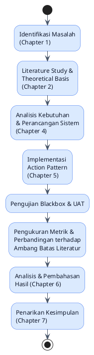
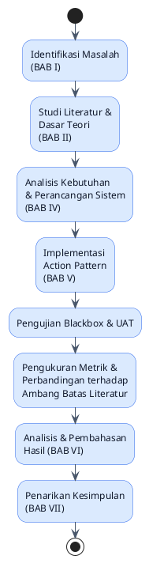

<section lang="en">

## 1. What is Chapter 3: Development Methodology (BAB III: Metodologi Pengembangan)?

**Chapter 3: Development Methodology** turns the questions from **Chapter 1: Introduction (BAB I: Pendahuluan)** into a concrete, executable **plan**. Chapter 1 asked *what* you want to know; Chapter 3 answers *how* you will find out and, just as importantly, *how you will measure it*. A typical Polinema JTI Development Methodology chapter covers these subsections:

| Subsection | Purpose |
|---|---|
| **3.1 Research Flow (Alur Penelitian)** | A visual flow of every research phase, start to finish |
| **3.2 Location and Time of Research (Lokasi dan Waktu Penelitian)** | Where and when the work happens |
| **3.3 Data Collection Method (Metode Pengumpulan Data)** | How you will gather requirements, reference material, and measurement data |
| **3.4 System Development Method (Metode Pengembangan Sistem)** | Which SDLC model you follow to build the system |
| **3.x Analysis** (metrics/instruments) | Precisely what you will measure and with what tools |
| **3.7 Testing (Pengujian)** | How correctness and comparison will be validated |

Get this chapter wrong, and everything downstream suffers: an undefined metric in Chapter 3 cannot be reported credibly in Chapter 6.

</section>

<section lang="id">

## 1. Apa Itu BAB III: Metodologi Pengembangan?

**BAB III (Metodologi Pengembangan)** adalah bab yang mengubah pertanyaan BAB I Anda menjadi **rencana** yang konkret dan dapat dieksekusi. Jika BAB I menanyakan *apa* yang ingin Anda ketahui, BAB III menjawab *bagaimana* Anda akan mengetahuinya, dan, yang krusial, *bagaimana Anda akan mengukurnya*. Bab Metodologi JTI Polinema yang tipikal mencakup:

| Subbab | Tujuan |
|---|---|
| **3.1 Alur Penelitian** | Alur visual dari setiap fase penelitian, dari awal hingga akhir |
| **3.2 Lokasi dan Waktu Penelitian** | Di mana dan kapan pekerjaan dilakukan |
| **3.3 Metode Pengumpulan Data** | Bagaimana Anda mengumpulkan kebutuhan, materi referensi, dan data pengukuran |
| **3.4 Metode Pengembangan Sistem** | Model SDLC mana yang Anda ikuti untuk membangun sistem |
| **3.x Analisis** (metrik/instrumen) | Persis apa yang akan Anda ukur dan dengan *tool* apa |
| **3.7 Pengujian** | Bagaimana kebenaran dan perbandingan akan divalidasi |

Jika penulisan bab ini keliru, semua yang mengikutinya akan terdampak: metrik yang tidak terdefinisi di BAB III tidak dapat dilaporkan secara kredibel di BAB VI.

</section>

---

<section lang="en">

## 2. Why Getting the Methodology Right Matters

### What is it?
The Development Methodology chapter is the operational contract for your project: a defined process, a defined timeline, and defined instruments. It mirrors the same discipline a software team applies before a sprint begins.

### Why does it matter?
- **A defined methodology is the single biggest lever for finishing on time.** Naming your methodology, with explicit phases and a timeline, turns "build a Todo app" into a checklist you can actually track week by week.
- **A defined methodology makes your comparison defensible.** Without a precisely defined metric, such as "cyclomatic complexity, measured with PHPMD, averaged per method", a reviewer cannot tell whether your Chapter 6 numbers mean anything.
- **What you define here becomes your actual research instrument, not just a description of one.** Whatever you specify in this chapter (the tools, the formulas) you must run for real in Chapter 5 and report in Chapter 6. A vague definition here becomes an impossible measurement later.

### When do you use it?
Draft this chapter right after Chapter 2's theory is stable, since your metrics (Section 3.x) must be theoretically justified: cyclomatic complexity is valid *because* of the theory in Chapter 2, Section 2.2.5. Revisit the timeline weekly throughout the semester; treat it as an actual project-tracking tool, not a one-time document.

### Where does it fit?
The outputs of this chapter are used everywhere downstream. Section 3.4 (development method) shapes how Chapter 4 and Chapter 5 are organized. Section 3.x (metrics) defines exactly what Chapter 6 must report. Section 3.7 (testing approach) defines the Blackbox/UAT scenarios detailed in Chapter 4, Section 4.4, and executed in Chapter 5, Section 5.5.

### How do you create one?
1. Draw the Research Flow as a single diagram covering every phase.
2. State the location and time (often just "Laboratorium SE, Polinema, semester genap 2026").
3. Name your data-collection methods: literature study, tool documentation, direct measurement.
4. Choose and justify a development methodology.
5. Define every metric with an exact formula and tool; no metric without a measurement procedure.
6. Describe your testing approach at a methodological level (details belong in Chapter 4).

</section>

<section lang="id">

## 2. Mengapa Menulis Metodologi dengan Benar Itu Penting?

### Apa itu?
Metodologi adalah kontrak operasional untuk proyek Anda: proses yang terdefinisi, linimasa yang terdefinisi, dan instrumen yang terdefinisi, yaitu disiplin yang sama yang diterapkan tim *software* sebelum *sprint* dimulai.

### Mengapa penting?
- **Ini adalah faktor terpenting untuk selesai tepat waktu.** Metodologi yang diberi nama, lengkap dengan fase dan linimasa, mengubah "bangun aplikasi Todo" menjadi daftar periksa yang benar-benar bisa Anda lacak minggu demi minggu.
- **Membuat perbandingan Anda dapat dipertahankan.** Tanpa metrik yang terdefinisi secara presisi ("cyclomatic complexity, diukur dengan PHPMD, dirata-ratakan per method"), peninjau tidak dapat menilai apakah angka BAB VI Anda berarti sesuatu.
- **Digunakan kembali sebagai instrumen Anda, bukan hanya dideskripsikan.** Apa pun yang Anda definisikan di sini (*tool*, formula) harus benar-benar Anda jalankan di BAB V dan laporkan di BAB VI. Definisi yang kabur di sini menjadi pengukuran yang mustahil nanti.

### Kapan digunakan?
Susun segera setelah teori BAB II stabil, karena metrik Anda (3.x) harus dijustifikasi secara teoretis (cyclomatic complexity valid *karena* teori di BAB II Bagian 2.2.5). Tinjau ulang linimasa mingguan sepanjang semester sebagai alat pelacakan yang sesungguhnya bagi proyek Anda, bukan dokumen sekali jadi.

### Di mana tempatnya?
Keluaran Metodologi digunakan di berbagai bagian selanjutnya: 3.4 (metode pengembangan) membentuk bagaimana BAB IV/V diorganisasikan; 3.x (metrik) mendefinisikan persis apa yang harus dilaporkan BAB VI; 3.7 (pendekatan pengujian) mendefinisikan skenario Blackbox/UAT yang dirinci di BAB IV Bagian 4.4 dan dijalankan di BAB V Bagian 5.5.

### Bagaimana membuatnya?
1. Gambar Alur Penelitian sebagai satu diagram yang mencakup setiap fase.
2. Nyatakan lokasi/waktu (seringnya cukup "Laboratorium SE, Polinema, semester genap 2026").
3. Sebutkan metode pengumpulan data Anda (studi literatur, dokumentasi *tool*, pengukuran langsung).
4. Pilih dan justifikasi metode pengembangan.
5. Definisikan setiap metrik dengan formula/*tool* yang persis: tidak ada metrik tanpa prosedur pengukuran.
6. Deskripsikan pendekatan pengujian Anda pada level metodologis (detail masuk ke BAB IV).

</section>

---

<section lang="en">

## 3. Continuing Our Example: Research Flow and Timeline

### 3.1 Research Flow (Alur Penelitian)

### 3.2 Location and Time of Research

State this plainly, for example: *"Penelitian dilakukan secara mandiri menggunakan environment pengembangan lokal, selama semester genap 2026, dari minggu ke-1 hingga minggu ke-16."*

### Suggested Timeline (16-week semester)

| Week | Milestone |
|---|---|
| 1–2 | Finalize Chapter 1: Background (Latar Belakang), Research Questions (Rumusan Masalah), and Scope and Limitations (Batasan Masalah) |
| 3–4 | Literature Study + Theoretical Basis, Chapter 2 |
| 5 | Seminar proposal |
| 6–7 | Analisis Kebutuhan + start Perancangan, Chapter 4 |
| 8–9 | Finish Perancangan: UML diagrams, DB schema, UI wireframes, test scenarios |
| 10–11 | Implementasi Action Pattern, Chapter 5 |
| 12 | Buffer week: review with **advisor** (pembimbing), catch-up slack (freed up by building only one implementation instead of two) |
| 13 | Testing: Blackbox, UAT, metric measurement |
| 14 | Analisis hasil, draft Chapter 6 |
| 15 | Draft Chapter 7: Conclusion and Recommendations (Kesimpulan dan Saran), finalize full manuscript |
| 16 | Thesis defense (Sidang) |

> **Time-boxing tip:** If week 9 arrives and Perancangan is not finished, treat that as your earliest and cheapest signal to revisit Scope and Limitations (Part 1). Cut scope now, not in week 14.

</section>

<section lang="id">

## 3. Melanjutkan Contoh Berkelanjutan Ini: Alur Penelitian dan Linimasa

### 3.1 Alur Penelitian

### 3.2 Lokasi dan Waktu Penelitian

Nyatakan ini secara langsung: mis. *"Penelitian dilakukan secara mandiri menggunakan lingkungan pengembangan lokal, selama semester genap 2026, dari minggu ke-1 hingga minggu ke-16."*

### Linimasa yang Disarankan (semester 16 minggu)

| Minggu | Milestone |
|---|---|
| 1–2 | Finalisasi BAB I (Latar Belakang, Rumusan Masalah, Batasan Masalah) |
| 3–4 | Studi Literatur + Dasar Teori (BAB II) |
| 5 | Seminar proposal |
| 6–7 | Analisis Kebutuhan + mulai Perancangan (BAB IV) |
| 8–9 | Selesaikan Perancangan: diagram UML, skema DB, wireframe UI, skenario pengujian |
| 10–11 | Implementasi Action Pattern (BAB V) |
| 12 | Minggu buffer: tinjauan bersama pembimbing, waktu cadangan (dihemat karena hanya membangun satu implementasi, bukan dua) |
| 13 | Pengujian: Blackbox, UAT, pengukuran metrik |
| 14 | Analisis hasil, draf BAB VI |
| 15 | Draf BAB VII, finalisasi naskah lengkap |
| 16 | Sidang |

> **Tips time-boxing:** jika minggu ke-9 tiba dan Perancangan belum selesai, itu adalah sinyal termurah dan paling awal untuk meninjau ulang Batasan Masalah (Bagian 1): potong ruang lingkup sekarang, bukan di minggu ke-14.

</section>

---

<section lang="en">

## 4. Writing Chapter 3 Section by Section

### 3.3 Data Collection Method (Metode Pengumpulan Data)

Name your actual sources: the literature study (sources from Chapter 2), official framework documentation (Laravel docs), and, specific to a measurement-based project, **direct instrumentation**: running static-analysis tools against your own code.

### 3.4 System Development Method (Metode Pengembangan Sistem)

We use **Prototyping**, a natural fit for a solo, time-boxed **mini thesis** (mini-skripsi) built around a single analyze-design-build-evaluate loop. Prototyping's phases, adapted for a solo student, are:

1. **Requirements Gathering & Analysis**: output from Chapter 1 and Chapter 2 feeds directly into this phase, alongside Chapter 4's Analisis Kebutuhan.
2. **Quick Design**: in Chapter 4, produce UML diagrams, a DB schema, and UI wireframes, just enough design to start building. Refine this iteratively with your advisor acting as the "user" stakeholder.
3. **Build Prototype**: in Chapter 5, build the Action Pattern implementation and test continuously rather than in one block at the end.
4. **Evaluation**: in Chapter 6, run Blackbox/UAT testing plus metric measurement against literature thresholds. If evaluation reveals issues, Prototyping lets you refine the design and rebuild, an honest fit for a scoped mini thesis, unlike a rigid waterfall approach.
5. **Finalize & Document**: final integration, conclusions in Chapter 6, and the write-up in Chapter 7.

Because Prototyping iterates, expect to build more than one version of your prototype as evaluation surfaces gaps. Document each iteration with a compact Iteration Log in Chapter 5 (Section 5.4) rather than a full diagram-and-code narrative per version; Part 5 shows exactly what that log looks like.

Justify your own choice: Waterfall, Scrum/Agile, and RAD are equally valid if you can argue why they fit your project's constraints (team size, timeline, requirement volatility) better than Prototyping does.

### 3.5 Defining Metrics (Research Instrument)

This is the section most projects under-specify. Each metric needs a **name, a formula/tool, and a unit**: nothing vague like "we will measure code quality."

| Metric | Definition | Tool | Unit | Threshold (literature) |
|---|---|---|---|---|
| **Cyclomatic Complexity** | Number of independent linear paths through a method (McCabe) | PHPMD (`codesize` ruleset) | integer per method, reported as average | ≤ 10 per method (McCabe, 1976) |
| **Coupling** | Count of distinct external classes a class directly depends on (CBO-style) | PHPMD (`design` ruleset) / manual review | integer per class, reported as average | single digits as a rule of thumb (no single canonical source); find and cite your own defensible threshold |
| **Lines of Code per Method** | Executable lines within a method body | PHPMD / manual count | LOC, reported as average | ≈ 20 lines or fewer (Martin, *Clean Code*, 2008) |
| **Test Coverage** | Percentage of executable lines exercised by the unit test suite | PHPUnit with Xdebug/PCOV coverage driver | percentage | ≥ 80% (common industry target) |

### 3.7 Testing (Pengujian)

At a methodological level, state that the implementation will be validated with **Black Box Testing** (functional correctness) and **User Acceptance Testing** (whether the end result meets user expectations). The detailed scenario tables belong in Chapter 4, Section 4.4; this section only states the approach and acceptance criteria, for example: "seluruh skenario Blackbox harus lulus; indeks penerimaan UAT ≥ 80%".

</section>

<section lang="id">

## 4. Menulis BAB III Subbab demi Subbab

### 3.3 Metode Pengumpulan Data (Data Collection Method)

Sebutkan sumber Anda yang sebenarnya: studi literatur (sumber BAB II), dokumentasi resmi *framework* (dokumentasi Laravel), dan (spesifik untuk proyek berbasis pengukuran) **instrumentasi langsung**: menjalankan *tool static-analysis* terhadap kode Anda sendiri.

### 3.4 Metode Pengembangan Sistem (System Development Method)

Penelitian ini menggunakan **Prototyping**, cocok secara alami untuk mini-skripsi solo yang *time-boxed*, dibangun di sekitar satu putaran analisis-desain-pembangunan-evaluasi. Fase Prototyping, disesuaikan untuk mahasiswa solo:

1. **Requirements Gathering & Analysis**: output BAB I/II langsung masuk ke sini, bersama Analisis Kebutuhan BAB IV.
2. **Quick Design**: BAB IV: diagram UML, skema DB, wireframe UI, cukup untuk mulai membangun, disempurnakan secara iteratif dengan pembimbing Anda berperan sebagai pemangku kepentingan "pengguna".
3. **Build Prototype**: BAB V: bangun implementasi Action Pattern, uji secara berkelanjutan, bukan dalam satu blok di akhir.
4. **Evaluation**: BAB VI: pengujian Blackbox/UAT ditambah pengukuran metrik terhadap ambang batas literatur. Jika evaluasi mengungkap masalah, Prototyping memungkinkan penyempurnaan desain dan pembangunan ulang, sangat cocok untuk mini-skripsi berskala kecil, tidak seperti waterfall yang kaku.
5. **Finalise & Document**: integrasi akhir, kesimpulan BAB VI, dan BAB VII.

Karena Prototyping bersifat iteratif, Anda perlu bersiap membangun lebih dari satu versi prototipe seiring evaluasi mengungkap kesenjangan. Dokumentasikan ini dengan Log Iterasi ringkas di BAB V (Bagian 5.4), bukan narasi diagram-dan-kode lengkap per versi; Bagian 5 menunjukkan persis seperti apa bentuknya.

Justifikasi pilihan Anda sendiri. Waterfall, Scrum/Agile, dan RAD sama validnya jika Anda berargumen mengapa metode itu lebih cocok dengan kendala proyek Anda (ukuran tim, linimasa, volatilitas kebutuhan).

### 3.5 Mendefinisikan Metrik (Instrumen Penelitian)

Ini adalah bagian yang paling sering kurang spesifik di kebanyakan proyek. Setiap metrik membutuhkan **nama, formula/_tool_, dan satuan**: bukan hal kabur seperti "kami akan mengukur kualitas kode".

| Metrik | Definisi | Tool | Satuan | Ambang Batas (literatur) |
|---|---|---|---|---|
| **Cyclomatic Complexity** | Jumlah jalur linear independen melalui sebuah *method* (McCabe) | PHPMD (ruleset `codesize`) | integer per *method*, dilaporkan sebagai rata-rata | ≤ 10 per *method* (McCabe, 1976) |
| **Coupling** | Jumlah kelas eksternal berbeda yang menjadi dependensi langsung suatu kelas (gaya CBO) | PHPMD (ruleset `design`) / tinjauan manual | integer per kelas, dilaporkan sebagai rata-rata | angka tunggal (*single digit*) sebagai *rule of thumb* (tidak ada sumber kanonik tunggal); temukan dan kutip sumber Anda sendiri yang dapat dipertanggungjawabkan |
| **Lines of Code per Method** | Baris eksekutabel dalam badan sebuah *method* | PHPMD / hitung manual | LOC, dilaporkan sebagai rata-rata | ≈ 20 baris atau kurang (Martin, *Clean Code*, 2008) |
| **Test Coverage** | Persentase baris eksekutabel yang dijalankan oleh *unit test suite* | PHPUnit dengan *coverage driver* Xdebug/PCOV | persentase | ≥ 80% (target umum industri) |

### 3.7 Pengujian

Nyatakan, pada level metodologis: implementasi akan divalidasi dengan **Black Box Testing** (kebenaran fungsional) dan **User Acceptance Testing** (apakah hasil akhir memenuhi ekspektasi pengguna). Tabel skenario detail masuk ke BAB IV Bagian 4.4: bagian ini hanya menyatakan pendekatan dan kriteria penerimaan (mis., "seluruh skenario Blackbox harus lulus; indeks penerimaan UAT ≥ 80%").

</section>

---

<section lang="en">

## 5. Self-Check: Is Your Development Methodology Ready?

1. Does the Research Flow diagram include every phase you will actually go through, with no hidden steps?
2. Does every metric have a name, a formula or tool, and a unit? If you can't say "measured how," it isn't defined yet.
3. Is your chosen SDLC model justified, not just named, for *your* project's constraints?
4. Does your timeline account for review and revision cycles with your advisor, not just "build" time?
5. Would a classmate be able to reproduce your measurement procedure exactly from this chapter alone?

</section>

<section lang="id">

## 5. Periksa Sendiri: Apakah Metodologi Anda Siap?

1. Apakah diagram Alur Penelitian mencakup setiap fase yang benar-benar akan Anda lalui, tanpa langkah tersembunyi?
2. Apakah setiap metrik punya nama, formula atau *tool*, dan satuan? Jika Anda tidak bisa menyebut "diukur bagaimana", berarti belum terdefinisi.
3. Apakah model SDLC yang Anda pilih dijustifikasi (bukan hanya disebutkan) untuk kendala proyek *Anda*?
4. Apakah linimasa Anda memperhitungkan siklus tinjauan/revisi dengan pembimbing, bukan hanya waktu "membangun"?
5. Bisakah teman sekelas mereproduksi prosedur pengukuran Anda persis hanya dari bab ini?

</section>

---

<section lang="en">

## 6. Common Mistakes in Chapter 3

| Mistake | Why It Is Wrong | Correct Approach |
|---|---|---|
| **Research Flow copied from a generic template** | A diagram with steps you won't actually follow is dishonest and confuses your own planning. | Draw your actual phases, specific to your project's build-and-evaluate structure. |
| **"We will measure code quality" with no metric named** | Unmeasurable: a reviewer cannot check your Chapter 6 numbers against anything. | Name each metric explicitly with a formula/tool, as in Section 4. |
| **Choosing a methodology without justification** | "We use Agile" with no reasoning is a name-drop, not a methodological choice. | State why the chosen method fits your team size, timeline, and requirement stability. |
| **No timeline, or a timeline with no buffer** | Without weekly milestones, scope creep (requirements quietly expanding past what was agreed) is invisible until it's too late to correct. | Build a week-by-week table with review checkpoints, and revisit it: this is a living document. |
| **Testing approach only described in Chapter 5, never planned in Chapter 3** | Test scenarios invented after the code is written tend to test what the code *does*, not what it *should* do. | Define acceptance criteria in Chapter 3, Section 3.7, before writing implementation code. |

</section>

<section lang="id">

## 6. Kesalahan Umum dalam BAB III

| Kesalahan | Mengapa Salah | Pendekatan yang Benar |
|---|---|---|
| **Alur Penelitian disalin dari _template_ generik** | Diagram dengan langkah yang tidak benar-benar Anda ikuti tidak jujur dan membingungkan perencanaan Anda sendiri. | Gambar fase Anda yang sebenarnya, spesifik untuk struktur bangun-lalu-evaluasi proyek Anda. |
| **"Kami akan mengukur kualitas kode" tanpa metrik yang disebutkan** | Tidak terukur: peninjau tidak dapat memeriksa angka BAB VI Anda terhadap apa pun. | Sebutkan setiap metrik secara eksplisit dengan formula/*tool*, seperti di Bagian 4. |
| **Memilih metodologi tanpa justifikasi** | "Kami menggunakan Agile" tanpa alasan hanyalah *name-drop*, bukan pilihan metodologis. | Nyatakan mengapa metode yang dipilih cocok dengan ukuran tim, linimasa, dan stabilitas kebutuhan Anda. |
| **Tidak ada linimasa, atau linimasa tanpa buffer** | Tanpa *milestone* mingguan, *scope creep* (fitur yang terus bertambah diam-diam di luar rencana awal) tidak terlihat sampai terlambat untuk dikoreksi. | Buat tabel mingguan dengan *checkpoint* tinjauan, dan tinjau ulang: ini adalah dokumen hidup. |
| **Pendekatan pengujian hanya dideskripsikan di BAB V, tidak pernah direncanakan di BAB III** | Skenario pengujian yang dikarang setelah kode ditulis cenderung menguji apa yang kode *lakukan*, bukan apa yang *seharusnya* dilakukan. | Definisikan kriteria penerimaan di BAB III Bagian 3.7 sebelum menulis kode implementasi. |

</section>

---

<section lang="en">

## 7. What Comes Next?

With a defined process, timeline, and, crucially, precisely defined metrics, we can now design the system itself. Part 4 covers **Chapter 4: System Analysis and Design (BAB IV: Analisis dan Perancangan Sistem)**: requirements analysis and the full UML design (Use Case, Activity, Class, and Sequence diagrams) for our Action Pattern implementation, with Fat Controller kept as an explicitly labeled conceptual contrast. It cross-links to the [UML Mini Series](/blog/uml-series-part-1-introduction-use-case).

</section>

<section lang="id">

## 7. Apa yang Akan Datang Selanjutnya?

Dengan proses, linimasa, dan, yang krusial, metrik yang terdefinisi secara presisi, sistem itu sendiri siap dirancang. Bagian 4 membahas **BAB IV (Analisis dan Perancangan Sistem)**: analisis kebutuhan, dan desain UML lengkap (diagram Use Case, Activity, Class, Sequence) untuk implementasi Action Pattern dalam penelitian ini, dengan Fat Controller dijaga sebagai kontras konseptual yang diberi label jelas, dengan tautan ke [Seri Mini UML](/blog/uml-series-part-1-introduction-use-case).

</section>
