<section lang="en">

## 1. What is BAB IV: Analisis dan Perancangan Sistem (System Analysis and Design)?

**BAB IV** is usually the longest chapter in a JTI Polinema **skripsi** (undergraduate thesis), and for good reason: it is where a vague idea becomes a **buildable blueprint**. It has four subsections:

| Subsection | Purpose |
|---|---|
| **4.1 Analisis Kebutuhan (Requirements Analysis)** | Actors, preconditions, functional requirements (FR), non-functional requirements (NFR) |
| **4.2 Perancangan Sistem (System Design)** | Architecture diagram, Use Case, Activity, Sequence, and Class diagrams |
| **4.3 Perancangan Desain Antarmuka (Interface Design)** | UI wireframes / mockups |
| **4.4 Rancangan Skenario Pengujian (Test Scenario Design)** | Blackbox and UAT test-scenario tables, planned before implementation |

This chapter is pure software engineering: everything you learned in the [UML Mini Series](/blog/uml-series-part-1-introduction-use-case) applies directly here. If you haven't read that series, start there; this part assumes you know how to read a Use Case, Activity, Sequence, and Class diagram, including how it treats login as a precondition rather than a use case, and why CRUD operations should not be modelled as separate use cases.

</section>

<section lang="id">

## 1. Apa Itu BAB IV: Analisis dan Perancangan Sistem?

**BAB IV** biasanya adalah bab terpanjang dalam skripsi JTI Polinema, dan dengan alasan yang jelas: di sinilah ide yang kabur menjadi **cetak biru yang dapat dibangun**. Bab ini memiliki empat subbab:

| Subbab | Tujuan |
|---|---|
| **4.1 Analisis Kebutuhan** | Aktor, prasyarat, kebutuhan fungsional (FR), kebutuhan nonfungsional (NFR) |
| **4.2 Perancangan Sistem** | Diagram arsitektur, Use Case, Activity, Sequence, dan Class |
| **4.3 Perancangan Desain Antarmuka** | Wireframe / mockup UI |
| **4.4 Rancangan Skenario Pengujian** | Tabel skenario pengujian Blackbox dan UAT, direncanakan sebelum implementasi |

Bab ini murni rekayasa perangkat lunak: semua yang Anda pelajari di [Seri Mini UML](/blog/uml-series-part-1-introduction-use-case) berlaku langsung di sini. Jika Anda belum membaca seri itu, mulailah dari sana; bagian ini mengasumsikan Anda tahu cara membaca diagram Use Case, Activity, Sequence, dan Class, termasuk bagaimana seri itu memperlakukan login sebagai prasyarat bukan use case, dan mengapa operasi CRUD tidak boleh dimodelkan sebagai use case terpisah.

</section>

---

<section lang="en">

## 2. Why Getting Analisis dan Perancangan Right Matters

### What is it?
This chapter translates BAB I's scope and BAB III's methodology into diagrams and specifications precise enough that BAB V can be built directly from them, with no ambiguity left to resolve mid-implementation.

### Why does it matter?
- **It is the contract between design and code.** Every class in your Class Diagram should appear in BAB V; if implementation invents classes never designed here, your design was incomplete.
- **It is where the case for Action Pattern becomes visible, not just asserted.** Showing the Fat Controller alternative as a conceptual Class Diagram, side by side with the Action Pattern design you will actually build, makes the structural difference concrete before a single line of code exists.
- **Batasan Masalah (Scope and Limitations) (BAB I) is enforced here.** Anything outside your stated scope should not appear in a single diagram in this chapter; if it does, your scope has silently grown.
- **A stated precondition must be implemented consistently, or it is a self-claim.** If BAB IV declares "User is authenticated" as a precondition, the database schema and code in BAB V must actually scope data to that user; otherwise the precondition is decoration, not a real constraint on the design.
- **Test scenarios planned here (Section 4.4) prevent test-after-the-fact bias.** Defining "what correct behaviour looks like" before writing code keeps your Black Box tests honest.

### When do you use it?
Draft this immediately after BAB III is stable, since architecture and metric decisions in BAB III directly shape what you diagram here.

### Where does it fit?
BAB IV output is consumed entirely by BAB V (Implementasi): every diagram of the implemented design here should map to a corresponding class, method, or view built there. The conceptual Fat Controller diagrams are not built anywhere; they exist only to make BAB VI's later discussion concrete.

### How do you create one?
1. Identify actors, state any preconditions (such as authentication), and turn **Rumusan Masalah (Research Questions)** into functional/non-functional requirements.
2. Draw the system architecture you will actually build, grouped into clear layers rather than a flat chain of boxes.
3. Draw one Use Case Diagram. Group CRUD operations under one use case (e.g. "Manage X"), not one bubble per operation, and keep the behaviour identical to the user regardless of internal architecture. Add a short Use Case Description table (actor, description, precondition, postcondition) for immediate context.
4. Draw one Activity Diagram per use case, elaborating its genuine decision logic within that single diagram (e.g. via a `switch`/`case` fork for a use case that bundles several operations); avoid mechanically producing one diagram per functional requirement, and avoid forcing every branch to repeat the same detail if it would just make the diagram harder to read.
5. Draw a Sequence Diagram contrasting how responsibility flows for a representative scenario.
6. Draw **two** Class Diagrams as the finalisation of the design: one conceptual illustration of the Fat Controller alternative (clearly labelled as not implemented or measured), and one for the Action Pattern design you will actually build and measure. Class comes last because it synthesises everything the Activity and Sequence diagrams established into one static structure, exactly the order the UML Mini Series itself uses (Activity, then Sequence, then Class).
7. Sketch interface wireframes.
8. Write Blackbox and UAT test-scenario tables.

</section>

<section lang="id">

## 2. Mengapa Menulis Analisis dan Perancangan dengan Benar Itu Penting?

### Apa itu?
Bab ini menerjemahkan ruang lingkup BAB I dan metodologi BAB III menjadi diagram dan spesifikasi yang cukup presisi sehingga BAB V dapat dibangun langsung darinya, tanpa menyisakan ambiguitas yang harus diselesaikan di tengah implementasi.

### Mengapa penting?
- **Ini adalah kontrak antara desain dan kode.** Setiap kelas di Class Diagram Anda seharusnya muncul di BAB V; jika implementasi mengarang kelas yang tidak pernah dirancang di sini, desain Anda tidak lengkap.
- **Di sinilah alasan pemilihan Action Pattern menjadi terlihat, bukan sekadar diklaim.** Menampilkan alternatif Fat Controller sebagai Class Diagram konseptual, berdampingan dengan desain Action Pattern yang benar-benar akan Anda bangun, membuat perbedaan struktural menjadi konkret sebelum satu baris kode pun ada.
- **Batasan Masalah (BAB I) ditegakkan di sini.** Apa pun di luar ruang lingkup yang dinyatakan seharusnya tidak muncul di satu pun diagram bab ini; jika muncul, ruang lingkup Anda diam-diam telah berkembang.
- **Prasyarat yang dinyatakan harus diimplementasikan secara konsisten, atau itu hanya klaim sepihak.** Jika BAB IV menyatakan "User terautentikasi" sebagai prasyarat, skema database dan kode di BAB V harus benar-benar membatasi data ke user tersebut; jika tidak, prasyarat itu hanya hiasan, bukan batasan nyata pada desain.
- **Skenario pengujian yang direncanakan di sini (bagian 4.4) mencegah bias pengujian yang dilakukan setelah implementasi.** Mendefinisikan "seperti apa perilaku yang benar" sebelum menulis kode menjaga Black Box test Anda tetap objektif dan valid.

### Kapan digunakan?
Susun segera setelah BAB III stabil, karena keputusan arsitektur dan metrik di BAB III langsung membentuk apa yang Anda gambarkan di sini.

### Di mana tempatnya?
Keluaran BAB IV sepenuhnya digunakan oleh BAB V (Implementasi): setiap diagram desain yang diimplementasikan di sini seharusnya terpetakan ke kelas, method, atau view yang dibangun di sana. Diagram Fat Controller konseptual tidak dibangun di mana pun; diagram itu hanya ada agar pembahasan BAB VI nanti menjadi konkret.

### Bagaimana membuatnya?
1. Identifikasi aktor, nyatakan prasyarat apa pun (seperti autentikasi), dan ubah Rumusan Masalah menjadi kebutuhan fungsional/nonfungsional.
2. Gambar arsitektur sistem yang benar-benar akan Anda bangun, dikelompokkan ke dalam lapisan yang jelas, bukan rantai datar berupa kotak-kotak.
3. Gambar satu Use Case Diagram. Kelompokkan operasi CRUD di bawah satu use case (mis. "Kelola X"), bukan satu oval per operasi, dan jaga perilakunya identik bagi pengguna terlepas dari arsitektur internal. Tambahkan tabel Use Case Description singkat (aktor, deskripsi, prasyarat, pascasyarat) untuk konteks langsung.
4. Gambar satu Activity Diagram per use case, merinci logika keputusan sesungguhnya di dalam satu diagram itu (mis. melalui percabangan `switch`/`case` untuk use case yang menggabungkan beberapa operasi); hindari secara mekanis menghasilkan satu diagram per kebutuhan fungsional, dan hindari memaksa setiap cabang mengulang detail yang sama jika itu hanya akan membuat diagram lebih sulit dibaca.
5. Gambar Sequence Diagram yang mengontraskan bagaimana tanggung jawab mengalir untuk skenario yang representatif.
6. Gambar **dua** Class Diagram sebagai finalisasi desain: satu ilustrasi konseptual alternatif Fat Controller (diberi label jelas sebagai tidak diimplementasikan maupun diukur), dan satu untuk desain Action Pattern yang benar-benar akan Anda bangun dan ukur. Class diletakkan terakhir karena mensintesis semua yang ditetapkan Activity dan Sequence Diagram menjadi satu struktur statis, persis urutan yang digunakan Seri Mini UML sendiri (Activity, lalu Sequence, lalu Class).
7. Sketsa wireframe antarmuka.
8. Tulis tabel skenario pengujian Blackbox dan UAT.

</section>

---

<section lang="en">

## 3. 4.1 Analisis Kebutuhan (Requirements Analysis)

### Identifikasi Aktor

| Actor | Description |
|---|---|
| **User** | The single actor who creates, edits, completes, deletes, and filters their own todos. No admin, no multi-tenant roles: kept minimal per Batasan Masalah (Part 1). |

### Prasyarat (Precondition)

> **User is authenticated.** Every use case below assumes a logged-in User, using Laravel's default authentication scaffolding. Following the same pattern taught in the [UML Mini Series](/blog/uml-series-part-1-introduction-use-case), login is **not** modelled as its own use case: it is a precondition, checked once per request via middleware, not a goal the User pursues for its own sake. Building a full registration/account-management system is outside Batasan Masalah (Part 1); what *is* in scope is making sure every todo is correctly scoped to its owning User, which is why the database schema (BAB V, Section 5.2) includes a `user_id` column and every Action queries only the authenticated User's data.

### Kebutuhan Fungsional (Functional Requirements)

Directly traced from the core functionalities named in Part 1's continuous-example section:

| ID | Requirement |
|---|---|
| **FR-1** | The system shall allow the User to create a new todo with a title and optional description. |
| **FR-2** | The system shall allow the User to edit an existing todo's title/description. |
| **FR-3** | The system shall allow the User to mark a todo as complete. |
| **FR-4** | The system shall allow the User to delete a todo. |
| **FR-5** | The system shall allow the User to filter todos by status (all / active / completed). |

FR-1 through FR-4 are grouped under a single use case, **Manage Todos**, in the design below (Section 4.2); modelling each as its own use case bubble would repeat the CRUD-as-use-case mistake the UML Mini Series warns against.

### Kebutuhan Nonfungsional (Non-Functional Requirements)

> **Common mistake to avoid:** NFRs describe the *system's* quality attributes (performance, usability, compatibility). They are **not** the same as the research metrics defined in BAB III, Section 3.5. Cyclomatic complexity, coupling, and test coverage are your *research instruments* for evaluating the implementation against literature thresholds; they are not requirements the finished system must satisfy on their own. Keep the two lists separate.

| ID | Requirement | Verification Method |
|---|---|---|
| **NFR-1** | The application shall respond to any user action within 1 second under local development conditions. | Measured during Blackbox scenario execution (BAB V, Section 5.5). |
| **NFR-2** | The application shall run on PHP 8.3, Laravel 11, and MySQL 8. | Satisfied by construction; confirmed by the environment declaration (BAB V, Section 5.1). |
| **NFR-3** | The interface shall be usable on both desktop and mobile-width viewports. | Verified via UAT (Section 4.4 below, executed in BAB V, Section 5.5). |

Naming a verification method for every NFR matters: an NFR with no way to check it is an unverifiable claim, not a requirement.

</section>

<section lang="id">

## 3. 4.1 Analisis Kebutuhan

### Identifikasi Aktor

| Aktor | Deskripsi |
|---|---|
| **User** | Satu-satunya aktor yang membuat, mengedit, menyelesaikan, menghapus, dan memfilter todo miliknya sendiri. Tidak ada admin, tidak ada peran multi-tenant: dijaga minimal sesuai Batasan Masalah (Bagian 1). |

### Prasyarat (Precondition)

> **User telah terautentikasi.** Setiap use case di bawah mengasumsikan User yang sudah login, menggunakan scaffolding autentikasi default Laravel. Mengikuti pola yang sama yang diajarkan di [Seri Mini UML](/blog/uml-series-part-1-introduction-use-case), login **tidak** dimodelkan sebagai use case tersendiri: login adalah prasyarat, diperiksa sekali per request melalui middleware, bukan tujuan yang dikejar User demi dirinya sendiri. Membangun sistem registrasi/manajemen akun lengkap berada di luar Batasan Masalah (Bagian 1); yang *ada* dalam ruang lingkup adalah memastikan setiap todo dibatasi dengan benar ke User pemiliknya, itulah mengapa skema database (BAB V, bagian 5.2) menyertakan kolom `user_id` dan setiap Action hanya mengkueri data milik User yang terautentikasi.

### Kebutuhan Fungsional

Ditelusuri langsung dari fungsionalitas inti yang disebutkan di bagian contoh berkelanjutan Bagian 1:

| ID | Kebutuhan |
|---|---|
| **FR-1** | Sistem harus memungkinkan User membuat todo baru dengan judul dan deskripsi opsional. |
| **FR-2** | Sistem harus memungkinkan User mengedit judul/deskripsi todo yang ada. |
| **FR-3** | Sistem harus memungkinkan User menandai todo sebagai selesai. |
| **FR-4** | Sistem harus memungkinkan User menghapus todo. |
| **FR-5** | Sistem harus memungkinkan User memfilter todo berdasarkan status (semua / aktif / selesai). |

FR-1 hingga FR-4 dikelompokkan di bawah satu use case, **Kelola Todo**, dalam desain di bawah (bagian 4.2); memodelkan masing-masing sebagai oval use case tersendiri akan mengulangi kesalahan CRUD-sebagai-use-case yang diperingatkan Seri Mini UML.

### Kebutuhan Nonfungsional

> **Kesalahan umum yang harus dihindari:** NFR mendeskripsikan atribut kualitas *sistem* (performa, usability, kompatibilitas). Ini **bukan** hal yang sama dengan metrik penelitian yang didefinisikan di BAB III, bagian 3.5. Cyclomatic complexity, coupling, dan test coverage adalah *instrumen penelitian* Anda untuk mengevaluasi implementasi terhadap ambang batas literatur; bukan kebutuhan yang harus dipenuhi sistem jadi dengan sendirinya. Jaga kedua daftar tetap terpisah.

| ID | Kebutuhan | Metode Verifikasi |
|---|---|---|
| **NFR-1** | Aplikasi harus merespons setiap aksi pengguna dalam 1 detik pada kondisi pengembangan lokal. | Diukur selama eksekusi skenario Blackbox (BAB V, bagian 5.5). |
| **NFR-2** | Aplikasi harus berjalan pada PHP 8.3, Laravel 11, dan MySQL 8. | Dipenuhi melalui konstruksi; dikonfirmasi oleh deklarasi lingkungan (BAB V, bagian 5.1). |
| **NFR-3** | Antarmuka harus dapat digunakan pada viewport lebar desktop maupun mobile. | Diverifikasi melalui UAT (bagian 4.4 di bawah, dijalankan di BAB V, bagian 5.5). |

Menyebutkan metode verifikasi untuk setiap NFR itu penting: NFR tanpa cara untuk memeriksanya adalah klaim yang tidak dapat diverifikasi, bukan kebutuhan.

</section>

---

<section lang="en">

## 4. 4.2 Perancangan Sistem (System Design)

### Arsitektur Diagram

This is the architecture we actually build, grouped into explicit layers rather than a flat chain of same-styled boxes, so the grouping itself communicates the layered structure.

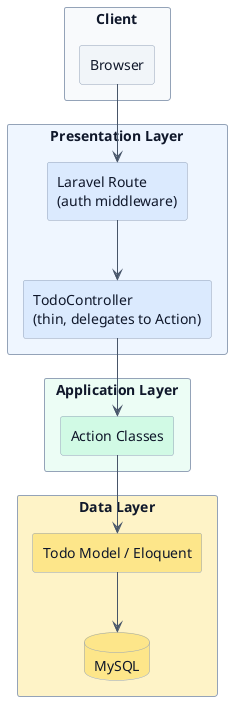

In the conceptual Fat Controller alternative discussed in BAB II, the Application Layer would not exist at all: `TodoController` in the Presentation Layer would call the Model directly, absorbing all validation and business logic itself.

### Use Case Diagram

The behaviour below is identical regardless of internal architecture: a Use Case Diagram describes what the user can do, not how the system is structured internally. Login is not shown as a use case; it is the precondition stated in Section 4.1, and access control (a User can only see and act on their own todos) is enforced by every use case, not a use case in its own right.

```plantuml
@startuml
left to right direction
skinparam backgroundColor #FFFFFF
skinparam actorStyle awesome
skinparam usecase {
  BackgroundColor #dbeafe
  BorderColor #2563eb
  FontColor #0f172a
}
skinparam actor {
  BackgroundColor #f1f5f9
  BorderColor #475569
  FontColor #0f172a
}
skinparam rectangle {
  BackgroundColor #f8fafc
  BorderColor #94a3b8
  FontColor #0f172a
}
skinparam arrow {
  Color #475569
  FontColor #0f172a
}

actor "User" as User

rectangle "Todo Application" {
  usecase "Manage\nTodos" as UC1
  usecase "Filter\nTodos" as UC2
}

User -- UC1
User -- UC2
@enduml
```

**Why only two use cases, not five:** Create, Edit, Complete, and Delete are all facets of one goal, managing one's todo list, so they are grouped under **Manage Todos** and detailed as one Activity Diagram below, exactly the fix the UML Mini Series recommends for the "CRUD as separate use cases" mistake. **Filter Todos** stays separate because it is a distinct goal (organising/viewing), not a mutation of data.

**Why no `<<include>>` or `<<extend>>`:** the original Campus Registration example (UML Mini Series, Part 1) had a genuine mandatory sub-step (Make Payment, included by Enrol in Course) and a genuine optional extension (Manage Registration Period extends Manage Courses). This Todo application, by deliberate design (Batasan Masalah, Part 1), has neither: there is no external mandatory step comparable to payment, and no optional variant of Manage Todos worth its own bubble. Forcing an `<<extend>>` relationship in order to demonstrate the notation would itself repeat the over-modelling mistakes the UML Mini Series warns against. Not every system needs these relationships, and a simple one honestly shouldn't have them.

### Use Case Description

A short description table gives each use case immediate context, without needing the full step-by-step Use Case Scenario technique from the UML Mini Series, Part 2.

| Field | Manage Todos | Filter Todos |
|---|---|---|
| **Actor** | User | User |
| **Description** | Create, edit, complete, and delete the User's own todos | Narrow the visible todo list by status |
| **Precondition** | User is authenticated (Section 4.1) | User is authenticated (Section 4.1) |
| **Postcondition** | The todo list reflects the action taken; data stays scoped to the User | Only todos matching the selected status are shown; underlying data is unchanged |

### Activity Diagram: Manage Todos

One diagram, one use case. A `switch`/`case` fork represents the User's choice of action; each branch gets only as much detail as it needs. Create and Delete carry real decision logic (validation, and a confirm/cancel step), so they are shown in full; Edit follows the identical validation shape as Create, so it is noted rather than redrawn, and Complete has no branching worth showing.

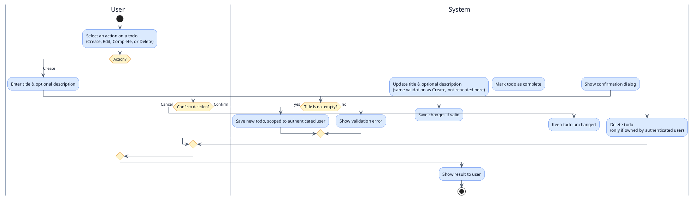

### Activity Diagram: Filter Todos

Filter Todos has no real branching, so its diagram is honestly short: it would be dishonest padding to invent decision logic that does not exist just to make the diagram look more substantial.

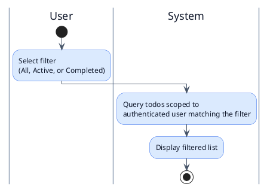

### Sequence Diagram: Create Todo (Fat Controller Illustration vs. Action Pattern Implementation)

Create is the representative scenario for the Sequence Diagram, since it shows the clearest contrast in how far each design delegates responsibility.

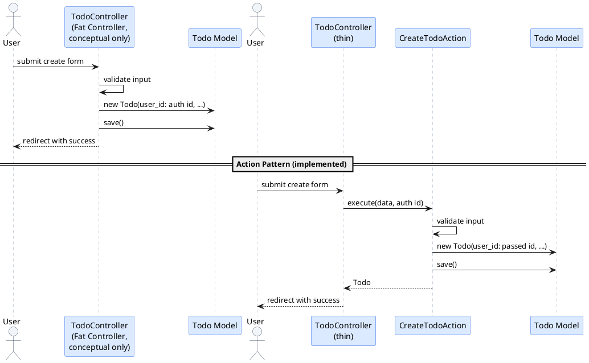

### Class Diagram: Fat Controller (Conceptual Illustration, Not Implemented or Measured)

This is the finalisation of the conceptual alternative: everything the Activity and Sequence diagrams implied about it, synthesised into one static structure. It is never built, tested, or measured.

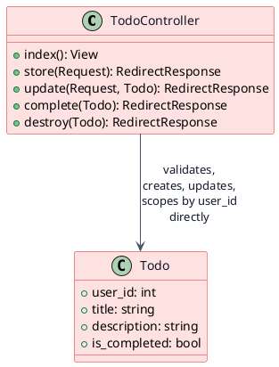

### Class Diagram: Action Pattern (Implemented and Measured)

This is the finalisation of the design we actually build in BAB V and measure in BAB VI: the static structure that the Manage Todos / Filter Todos Activity Diagrams and the Create Todo Sequence Diagram all converge on.

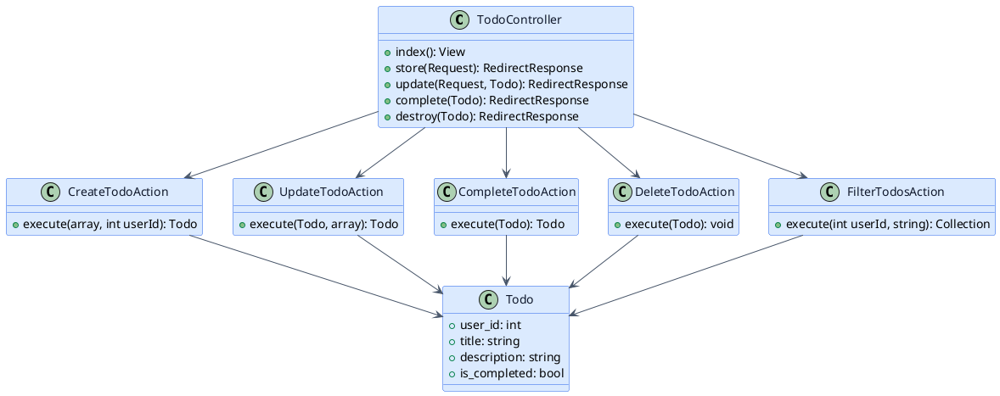

Notice the qualitative difference already visible **before writing a line of code**: the Fat Controller illustration has one class doing everything, including its own ad hoc user-scoping; the Action Pattern design distributes responsibility across five single-purpose classes, each depending on only `Todo`, with the authenticated user's ID passed in explicitly rather than assumed. This is exactly what BAB VI's metrics will later quantify, against literature thresholds rather than against the conceptual illustration directly.

</section>

<section lang="id">

## 4. 4.2 Perancangan Sistem

### Arsitektur Diagram

Ini adalah arsitektur yang benar-benar dibangun oleh penelitian ini, dikelompokkan ke dalam lapisan eksplisit alih-alih rantai datar berisi kotak-kotak bergaya sama, sehingga pengelompokan itu sendiri mengomunikasikan struktur berlapis.

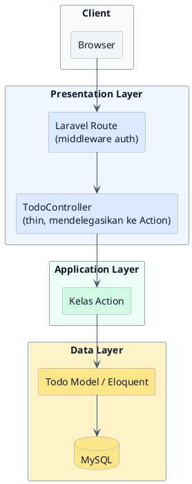

Pada alternatif Fat Controller konseptual yang dibahas di BAB II, Application Layer ini tidak akan ada sama sekali: `TodoController` di Presentation Layer akan memanggil Model secara langsung, menangani sendiri semua validasi dan business logic.

### Use Case Diagram

Perilaku di bawah ini identik terlepas dari arsitektur internal: Use Case Diagram mendeskripsikan apa yang bisa dilakukan pengguna, bukan bagaimana sistem terstruktur secara internal. Login tidak ditampilkan sebagai use case; login adalah prasyarat yang dinyatakan di bagian 4.1, dan kontrol akses (User hanya bisa melihat dan bertindak atas todo miliknya sendiri) ditegakkan oleh setiap use case, bukan use case tersendiri.

```plantuml
@startuml
left to right direction
skinparam backgroundColor #FFFFFF
skinparam actorStyle awesome
skinparam usecase {
  BackgroundColor #dbeafe
  BorderColor #2563eb
  FontColor #0f172a
}
skinparam actor {
  BackgroundColor #f1f5f9
  BorderColor #475569
  FontColor #0f172a
}
skinparam rectangle {
  BackgroundColor #f8fafc
  BorderColor #94a3b8
  FontColor #0f172a
}
skinparam arrow {
  Color #475569
  FontColor #0f172a
}

actor "User" as User

rectangle "Aplikasi Todo" {
  usecase "Kelola\nTodo" as UC1
  usecase "Filter\nTodo" as UC2
}

User -- UC1
User -- UC2
@enduml
```

**Mengapa hanya dua use case, bukan lima:** Buat, Edit, Selesaikan, dan Hapus semuanya adalah segi dari satu tujuan, mengelola daftar todo miliknya sendiri, sehingga dikelompokkan di bawah **Kelola Todo** dan dirinci sebagai satu Activity Diagram di bawah, persis perbaikan yang direkomendasikan Seri Mini UML untuk kesalahan "CRUD sebagai use case terpisah". **Filter Todo** tetap terpisah karena merupakan tujuan yang berbeda (mengorganisasi/melihat), bukan mutasi data.

**Mengapa tidak ada `<<include>>` atau `<<extend>>`:** contoh Sistem Pendaftaran Kampus asli (Seri Mini UML, Bagian 1) memiliki sublangkah wajib sesungguhnya (Lakukan Pembayaran, di-include oleh Daftar Mata Kuliah) dan ekstensi opsional sesungguhnya (Kelola Periode Pendaftaran memperluas Kelola Mata Kuliah). Aplikasi Todo ini, karena desain yang disengaja (Batasan Masalah, Bagian 1), tidak memiliki keduanya: tidak ada langkah wajib eksternal yang sebanding dengan pembayaran, dan tidak ada varian opsional dari Kelola Todo yang layak mendapat oval sendiri. Memaksakan relasi `<<extend>>` demi mendemonstrasikan notasinya akan mengulangi kesalahan over-modelling yang diperingatkan Seri Mini UML. Tidak semua sistem membutuhkan relasi ini, dan sistem sederhana memang sebaiknya tidak memilikinya.

### Use Case Description

Tabel deskripsi singkat memberi setiap use case konteks langsung, tanpa membutuhkan teknik Use Case Scenario langkah-demi-langkah lengkap dari Seri Mini UML, Bagian 2.

| Field | Kelola Todo | Filter Todo |
|---|---|---|
| **Aktor** | User | User |
| **Deskripsi** | Membuat, mengedit, menyelesaikan, dan menghapus todo milik User sendiri | Mempersempit daftar todo yang terlihat berdasarkan status |
| **Prasyarat** | User telah terautentikasi (bagian 4.1) | User telah terautentikasi (bagian 4.1) |
| **Pascasyarat** | Daftar todo mencerminkan aksi yang diambil; data tetap dibatasi ke User | Hanya todo yang cocok dengan status terpilih yang ditampilkan; data yang mendasari tidak berubah |

### Activity Diagram: Kelola Todo

Satu diagram, satu use case. Percabangan `switch`/`case` merepresentasikan pilihan aksi User; setiap cabang mendapat detail sebanyak yang dibutuhkannya saja. Buat dan Hapus memiliki logika keputusan sesungguhnya (validasi, dan langkah konfirmasi/batal), sehingga ditampilkan lengkap; Edit mengikuti bentuk validasi yang identik dengan Buat, sehingga dicatat alih-alih digambar ulang, dan Selesaikan tidak memiliki percabangan yang layak ditampilkan.

### Activity Diagram: Filter Todo

Filter Todo tidak memiliki percabangan sesungguhnya, sehingga diagramnya memang singkat: akan menjadi penambahan yang menyesatkan jika mengarang logika keputusan yang tidak ada hanya agar diagram terlihat lebih substansial.

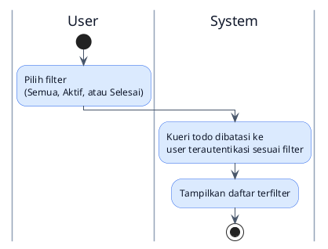

### Sequence Diagram: Buat Todo (Ilustrasi Fat Controller vs. Implementasi Action Pattern)

Buat adalah skenario representatif untuk Sequence Diagram, karena menunjukkan kontras paling jelas seberapa jauh masing-masing desain mendelegasikan tanggung jawab.

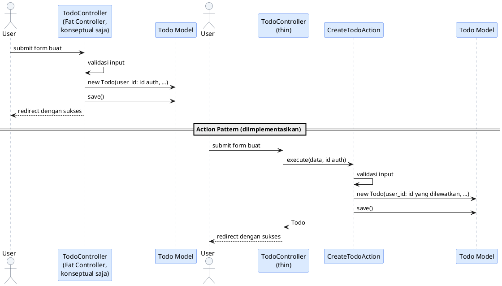

### Class Diagram: Fat Controller (Ilustrasi Konseptual, Tidak Diimplementasikan Maupun Diukur)

Ini adalah finalisasi alternatif konseptual: semua yang disiratkan Activity dan Sequence Diagram tentangnya, disintesis menjadi satu struktur statis. Diagram ini tidak pernah dibangun, diuji, atau diukur.

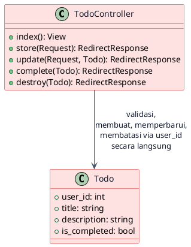

### Class Diagram: Action Pattern (Diimplementasikan dan Diukur)

Ini adalah finalisasi desain yang benar-benar dibangun oleh penelitian ini di BAB V dan diukur di BAB VI: struktur statis tempat Activity Diagram Kelola Todo / Filter Todo dan Sequence Diagram Buat Todo semuanya bermuara.

Perhatikan perbedaan kualitatif yang sudah terlihat **sebelum menulis satu baris kode**: ilustrasi Fat Controller memiliki satu kelas yang melakukan segalanya, termasuk pembatasan user secara ad hoc miliknya sendiri; desain Action Pattern mendistribusikan tanggung jawab ke lima kelas bertujuan tunggal, masing-masing hanya bergantung pada `Todo`, dengan ID user terautentikasi dilewatkan secara eksplisit, bukan diasumsikan. Inilah persis yang akan dikuantifikasi oleh metrik BAB VI nanti, terhadap ambang batas literatur, bukan terhadap ilustrasi konseptual secara langsung.

</section>

---

<section lang="en">

## 5. 4.3 Perancangan Desain Antarmuka (Interface Design)

A skripsi typically includes actual mockup screenshots (Figma, Balsamiq). For this series we describe the wireframe structurally: translate this into a real mockup tool for your own report.

| Screen region | Elements |
|---|---|
| **Header** | App title, filter tabs (All / Active / Completed) |
| **Add form** | Single-line title input, optional description field, "Add" button |
| **Todo list** | One row per todo: checkbox (complete toggle), title, description snippet, Edit and Delete buttons |
| **Delete confirmation** | A confirmation dialog shown before deletion completes (Section 4 above), with Confirm and Cancel actions |
| **Empty state** | "No todos yet, add one above" message when the filtered list is empty |

The interface is a controlled constant, and it does not change between the conceptual Fat Controller illustration and the built Action Pattern implementation, since only the backend structure varies between them.

## 6. 4.4 Rancangan Skenario Pengujian (Test Scenario Design)

Plan test scenarios **before** implementation. These scenarios validate the Action Pattern implementation, the only thing actually built and run.

### Rencana Skenario Blackbox Testing

| ID | Skenario | Expected Result |
|---|---|---|
| **BB-01** | Create a todo with a valid title | Todo appears in the list |
| **BB-02** | Create a todo with an empty title | Validation error shown, no todo created |
| **BB-03** | Edit an existing todo's title | Updated title reflected in the list |
| **BB-04** | Mark a todo as complete | Todo shown as completed (e.g. strikethrough / checked) |
| **BB-05** | Delete a todo and confirm | Todo removed from the list |
| **BB-06** | Delete a todo, then cancel the confirmation | Todo remains in the list, unchanged |
| **BB-07** | Filter by "Active" | Only incomplete todos shown |
| **BB-08** | Filter by "Completed" | Only completed todos shown |
| **BB-09** | Attempt to view or modify another user's todo directly (e.g. via URL manipulation) | Access denied; confirms the authentication precondition (Section 4.1) is actually enforced |

### Rencana Skenario UAT

| ID | Skenario | Kriteria Penerimaan |
|---|---|---|
| **UAT-01** | User adds several todos and manages them end-to-end | User completes the flow without confusion or errors |
| **UAT-02** | User rates ease of use on a 5-point Likert scale | Average score contributes to the acceptance index (target ≥ 80%) |

</section>

<section lang="id">

## 5. 4.3 Perancangan Desain Antarmuka

Skripsi biasanya menyertakan tangkapan layar mockup nyata (Figma, Balsamiq). Untuk seri ini, wireframe dideskripsikan secara struktural: terjemahkan ini ke tool mockup nyata untuk laporan Anda sendiri.

| Wilayah layar | Elemen |
|---|---|
| **Header** | Judul aplikasi, tab filter (Semua / Aktif / Selesai) |
| **Form tambah** | Input judul satu baris, kolom deskripsi opsional, tombol "Tambah" |
| **Daftar todo** | Satu baris per todo: checkbox (toggle selesai), judul, cuplikan deskripsi, tombol Edit dan Hapus |
| **Konfirmasi hapus** | Dialog konfirmasi ditampilkan sebelum penghapusan selesai (Bagian 4 di atas), dengan aksi Konfirmasi dan Batal |
| **Empty state** | Pesan "Belum ada todo, tambahkan di atas" ketika daftar terfilter kosong |

Antarmuka adalah konstanta terkontrol, dan tidak berubah antara ilustrasi konseptual Fat Controller dan implementasi Action Pattern yang dibangun, karena hanya struktur backend yang bervariasi di antara keduanya.

## 6. 4.4 Rancangan Skenario Pengujian

Rencanakan skenario pengujian **sebelum** implementasi. Skenario ini memvalidasi implementasi Action Pattern, satu-satunya hal yang benar-benar dibangun dan dijalankan.

### Rencana Skenario Blackbox Testing

| ID | Skenario | Expected Result |
|---|---|---|
| **BB-01** | Membuat todo dengan judul valid | Todo muncul di daftar |
| **BB-02** | Membuat todo dengan judul kosong | Error validasi ditampilkan, tidak ada todo terbuat |
| **BB-03** | Mengedit judul todo yang ada | Judul terbaru tercermin di daftar |
| **BB-04** | Menandai todo sebagai selesai | Todo ditampilkan selesai (mis. strikethrough / tercentang) |
| **BB-05** | Menghapus todo dan konfirmasi | Todo terhapus dari daftar |
| **BB-06** | Menghapus todo, lalu batalkan konfirmasi | Todo tetap ada di daftar, tidak berubah |
| **BB-07** | Filter berdasarkan "Aktif" | Hanya todo belum selesai ditampilkan |
| **BB-08** | Filter berdasarkan "Selesai" | Hanya todo selesai ditampilkan |
| **BB-09** | Mencoba melihat atau mengubah todo milik user lain secara langsung (mis. via manipulasi URL) | Akses ditolak; mengonfirmasi prasyarat autentikasi (bagian 4.1) benar-benar ditegakkan |

### Rencana Skenario UAT

| ID | Skenario | Kriteria Penerimaan |
|---|---|---|
| **UAT-01** | User menambah beberapa todo dan mengelolanya end-to-end | User menyelesaikan alur tanpa kebingungan atau error |
| **UAT-02** | User menilai kemudahan penggunaan pada skala Likert 5 poin | Skor rata-rata berkontribusi ke indeks penerimaan (target ≥ 80%) |

</section>

---

<section lang="en">

## 7. Common Mistakes in BAB IV

| Mistake | Why It Is Wrong | Correct Approach |
|---|---|---|
| **Modelling CRUD operations as separate use cases** | "Create Todo", "Edit Todo", "Delete Todo" as separate bubbles clutters the diagram and repeats a mistake the UML Mini Series explicitly warns against. | Group them under one use case (e.g. "Manage Todos"), detailed in one Activity Diagram, as in Section 4. |
| **Modelling login as a use case** | Login delivers no standalone goal for the user; it is infrastructure every other use case depends on. | Capture authentication as a precondition in Section 4.1, as done here. |
| **Stating a precondition without implementing it** | Declaring "User is authenticated" but never scoping data to that user in the schema or code is a self-claim: the precondition exists on paper only. | Make sure the precondition has a visible consequence in the design (here, `user_id` on `Todo`) and in the implementation (BAB V). |
| **Cramming every scenario into one diagram just to force a 1:1 use-case-to-diagram mapping** | A single diagram with full detail on every branch of a multi-operation use case can become harder to read than two focused ones, undermining the very clarity diagrams exist to provide. | Keep the 1:1 mapping, but let branches vary in detail: elaborate only the ones with genuine decision logic, and note (rather than redraw) branches that repeat an already-shown shape, as with Edit in Section 4. |
| **Omitting the Fat Controller conceptual contrast entirely** | Without it, the case for choosing Action Pattern rests only on assertion; the reader never sees what the alternative would have looked like. | Include the conceptual Class Diagram, clearly labelled as illustration only, as in Section 4. |
| **Not labelling which diagrams are implemented and which are conceptual** | An examiner cannot tell what was actually built versus what is illustrative, undermining trust in the whole chapter. | Label every diagram explicitly, as done throughout Section 4. |
| **Test scenarios written after implementation** | Post-hoc scenarios tend to match what the code does, hiding bugs instead of catching them. | Finalise Section 4.4 before writing any implementation code (BAB V). |
| **NFRs mixed with research metrics** | Conflates "what the system must do" with "what we are measuring about the code," confusing examiners about your actual contribution. | Keep NFRs (Section 3) and research metrics (BAB III, Section 3.5) in clearly separate lists. |
| **Diagrams that don't match Batasan Masalah** | A diagram showing multi-user or notification features that Batasan Masalah excluded signals uncontrolled scope creep. | Cross-check every diagram element against BAB I, Section 1.3, before finalising. |

</section>

<section lang="id">

## 7. Kesalahan Umum dalam BAB IV

| Kesalahan | Mengapa Salah | Pendekatan yang Benar |
|---|---|---|
| **Memodelkan operasi CRUD sebagai use case terpisah** | "Buat Todo", "Edit Todo", "Hapus Todo" sebagai oval terpisah mengotori diagram dan mengulangi kesalahan yang secara eksplisit diperingatkan Seri Mini UML. | Kelompokkan di bawah satu use case (mis. "Kelola Todo"), dirinci dalam satu Activity Diagram, seperti di Bagian 4. |
| **Memodelkan login sebagai use case** | Login tidak memberikan tujuan mandiri bagi pengguna; login adalah infrastruktur yang dibutuhkan setiap use case lain. | Tangkap autentikasi sebagai prasyarat di bagian 4.1, seperti dilakukan di sini. |
| **Menyatakan prasyarat tanpa mengimplementasikannya** | Menyatakan "User terautentikasi" namun tidak pernah membatasi data ke user tersebut dalam skema atau kode adalah klaim sepihak: prasyarat itu hanya ada di atas kertas. | Pastikan prasyarat memiliki konsekuensi yang terlihat dalam desain (di sini, `user_id` pada `Todo`) dan dalam implementasi (BAB V). |
| **Menjejalkan setiap skenario ke satu diagram hanya untuk memaksakan pemetaan 1:1 use case-ke-diagram** | Satu diagram dengan detail lengkap pada setiap cabang use case multi-operasi bisa menjadi lebih sulit dibaca daripada dua diagram yang fokus, merusak kejelasan yang justru menjadi alasan diagram itu ada. | Pertahankan pemetaan 1:1, tetapi biarkan detail cabang bervariasi: rincikan hanya yang memiliki logika keputusan sesungguhnya, dan catat (alih-alih gambar ulang) cabang yang mengulang bentuk yang sudah ditampilkan, seperti Edit di Bagian 4. |
| **Menghilangkan kontras konseptual Fat Controller sama sekali** | Tanpanya, alasan pemilihan Action Pattern hanya bertumpu pada klaim; pembaca tidak pernah melihat seperti apa alternatifnya. | Sertakan Class Diagram konseptual, diberi label jelas sebagai ilustrasi saja, seperti di Bagian 4. |
| **Tidak memberi label diagram mana yang diimplementasikan dan mana yang konseptual** | Penguji tidak dapat membedakan apa yang benar-benar dibangun versus apa yang ilustratif, merusak kepercayaan pada bab secara keseluruhan. | Beri label eksplisit pada setiap diagram, seperti dilakukan di sepanjang Bagian 4. |
| **Skenario pengujian ditulis setelah implementasi** | Skenario post-hoc cenderung cocok dengan apa yang kode lakukan, menyembunyikan bug alih-alih menangkapnya. | Finalisasi bagian 4.4 sebelum menulis kode implementasi apa pun (BAB V). |
| **NFR bercampur dengan metrik penelitian** | Mencampuradukkan "apa yang harus dilakukan sistem" dengan "apa yang diukur tentang kode," membingungkan penguji tentang kontribusi Anda yang sebenarnya. | Jaga NFR (Bagian 3) dan metrik penelitian (BAB III, bagian 3.5) dalam daftar yang jelas terpisah. |
| **Diagram yang tidak cocok dengan Batasan Masalah** | Diagram yang menunjukkan fitur multi-user atau notifikasi yang dikecualikan Batasan Masalah menandakan scope creep yang tidak terkendali. | Periksa silang setiap elemen diagram terhadap BAB I, bagian 1.3, sebelum finalisasi. |

</section>

---

<section lang="en">

## 8. What Comes Next?

With the design fully worked out (a layered architecture, the consolidated Use Case Diagram with its description table, one Activity Diagram per use case, the Sequence Diagram, and the conceptual-versus-implemented Class Diagrams as the finalisation, plus wireframes and test scenarios), we are ready to build. In Part 5, we cover **BAB V (Implementasi dan Pengujian, Implementation and Testing)**: setting up the environment, implementing the database including the `user_id` scoping designed here, and writing the actual PHP code for the Action Pattern implementation, showing exactly where the low complexity we designed here comes from.

</section>

<section lang="id">

## 8. Apa yang Akan Datang Selanjutnya?

Dengan desain yang tuntas dikerjakan (arsitektur berlapis, Use Case Diagram yang telah dikonsolidasikan beserta tabel deskripsinya, satu Activity Diagram per use case, Sequence Diagram, dan Class Diagram konseptual-versus-diimplementasikan sebagai finalisasi, ditambah wireframe dan skenario pengujian), penelitian ini siap memasuki tahap membangun. Bagian 5 membahas **BAB V (Implementasi dan Pengujian)**: menyiapkan lingkungan, mengimplementasikan database termasuk pembatasan `user_id` yang dirancang di sini, dan menulis kode PHP sesungguhnya untuk implementasi Action Pattern, menunjukkan persis dari mana kompleksitas rendah yang dirancang di sini berasal.

</section>
