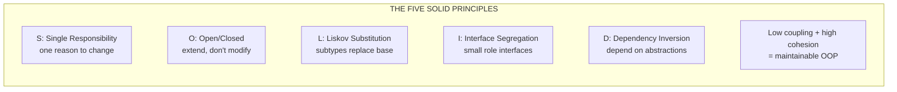

<section lang="en">

## What Is SOLID and Why It Matters

Every codebase starts clean. A student project, a company internal tool, a startup MVP — they all begin with simple classes that do exactly what you expect. Then requirements change. A new payment method appears. A lecturer asks for a different grade calculation. The customer wants a discount applied before tax instead of after.

In rigid code, each of those changes forces you to touch classes that should have nothing to do with the change. You edit a controller to add a payment method and accidentally break the email notification. You fix the email and break the report. The cost of every change grows until the team is afraid to touch anything.

**SOLID** is a set of five object-oriented design principles that, applied together, keep that cost flat. They were collected by Robert C. Martin ("Uncle Bob") in the early 2000s and have since become the shared vocabulary of professional software engineering — the same vocabulary you will meet in code reviews, technical interviews, and every serious PHP framework.

SOLID reduces **coupling** (how much one piece of code depends on another) and increases **cohesion** (how focused a single piece of code is). Low coupling plus high cohesion is the definition of maintainable code.

| Principle | One-Line Summary |
|---|---|
| **S** — Single Responsibility | A class has one reason to change. |
| **O** — Open/Closed | Open for extension, closed for modification. |
| **L** — Liskov Substitution | Subtypes must be replaceable for their base types. |
| **I** — Interface Segregation | Prefer many small interfaces over one fat interface. |
| **D** — Dependency Inversion | Depend on abstractions, not on concrete implementations. |

This tutorial covers all five principles with a consistent template: a **definition**, a **before** snippet that violates the principle, an **after** snippet that fixes it, and a **smell checklist** to spot the violation in your own code. We close with a combined Laravel example that applies several principles at once.

> If you are new to writing readable PHP, start with [Clean Code Principles with PHP](/blog/clean-code-principles) first — SOLID builds directly on it.

</section>

<section lang="id">

## Apa Itu SOLID dan Mengapa Itu Penting

Setiap codebase dimulai dengan bersih. Proyek mahasiswa, alat internal perusahaan, MVP startup — semuanya dimulai dengan kelas-kelas sederhana yang melakukan persis seperti yang Anda harapkan. Lalu kebutuhan berubah. Metode pembayaran baru muncul. Dosen meminta perhitungan nilai yang berbeda. Pelanggan ingin diskon diterapkan sebelum pajak, bukan sesudahnya.

Pada kode yang kaku, setiap perubahan itu memaksa Anda menyentuh kelas-kelas yang seharusnya tidak ada hubungannya dengan perubahan tersebut. Anda mengedit sebuah controller untuk menambahkan metode pembayaran dan tanpa sengaja merusak notifikasi email. Anda memperbaiki email dan merusak laporan. Biaya setiap perubahan terus membesar sampai tim takut menyentuh apa pun.

**SOLID** adalah sekumpulan lima prinsip desain berorientasi objek yang, bila diterapkan bersama-sama, menjaga biaya itu tetap datar. Prinsip-prinsip ini dikumpulkan oleh Robert C. Martin ("Uncle Bob") pada awal 2000-an dan sejak itu menjadi kosakata bersama rekayasa perangkat lunak profesional — kosakata yang sama yang akan Anda temui dalam code review, wawancara teknis, dan setiap framework PHP yang serius.

SOLID mengurangi **coupling** (seberapa besar satu bagian kode bergantung pada bagian lain) dan meningkatkan **cohesion** (seberapa fokus satu bagian kode). Coupling rendah ditambah cohesion tinggi adalah definisi kode yang mudah dipelihara.

| Prinsip | Ringkasan Satu Kalimat |
|---|---|
| **S** — Single Responsibility | Sebuah kelas memiliki satu alasan untuk berubah. |
| **O** — Open/Closed | Terbuka untuk ekstensi, tertutup untuk modifikasi. |
| **L** — Liskov Substitution | Subtype harus dapat menggantikan tipe dasarnya. |
| **I** — Interface Segregation | Lebih baik banyak antarmuka kecil daripada satu antarmuka gemuk. |
| **D** — Dependency Inversion | Bergantung pada abstraksi, bukan pada implementasi konkret. |

Tutorial ini membahas kelima prinsip dengan template yang konsisten: **definisi**, cuplikan **before** yang melanggar prinsip, cuplikan **after** yang memperbaikinya, dan **daftar periksa smell** untuk mengenali pelanggaran dalam kode Anda sendiri. Kita tutup dengan contoh Laravel gabungan yang menerapkan beberapa prinsip sekaligus.

> Jika Anda baru dalam menulis PHP yang mudah dibaca, mulai dari [Prinsip Clean Code dengan PHP](/blog/clean-code-principles) terlebih dahulu — SOLID dibangun langsung di atasnya.

</section>

<figure class="my-10 text-center" role="figure">



<figcaption class="mt-3 text-sm text-neutral-500">
  <span lang="en">Figure: The five SOLID principles and the goal they serve together</span>
  <span lang="id">Gambar: Lima prinsip SOLID dan tujuan yang mereka layani bersama-sama</span>
</figcaption>
</figure>

---

<section lang="en">

## S — Single Responsibility Principle (SRP)

**A class should have only one reason to change.** Every class has a set of stakeholders — the people and requirements that demand changes from it. A class that formats CSV *and* writes files *and* sends emails has three reasons to change: the report format may change, the storage location may change, and the email template may change. Each of those changes risks breaking the other responsibilities.

Notice the phrase "reason to change" rather than "one job". A class can have several methods as long as they all serve the same responsibility. `InvoiceRepository` may have `find`, `save`, and `delete` — one responsibility: persisting invoices.

### Before: A Controller Doing Everything

Fat controllers are the most common SRP violation in PHP. Here is a Laravel-style controller that validates, calculates, persists, and notifies:

```php
<?php

class OrderController extends Controller
{
    public function store(Request $request)
    {
        $request->validate([
            'customer_email' => 'required|email',
            'items'          => 'required|array',
        ]);

        $subtotal = 0;
        foreach ($request->items as $item) {
            $subtotal += $item['price'] * $item['qty'];
        }

        $tax = $subtotal * 0.11;
        $total = $subtotal + $tax;

        $order = new Order();
        $order->customer_email = $request->customer_email;
        $order->subtotal = $subtotal;
        $order->tax = $tax;
        $order->total = $total;
        $order->save();

        $pdf = $this->generateInvoicePdf($order);

        Mail::to($request->customer_email)->send(new OrderConfirmation($order, $pdf));

        return redirect()->route('orders.show', $order);
    }
}
```

This controller has at least four reasons to change: pricing rules, persistence, PDF generation, and notifications. Changing the tax rate forces you to edit the controller; so does changing the email provider.

### After: One Responsibility Per Class

```php
<?php

class OrderController extends Controller
{
    public function __construct(
        private OrderService $orders,
    ) {}

    public function store(Request $request)
    {
        $validated = $request->validate([
            'customer_email' => 'required|email',
            'items'          => 'required|array',
        ]);

        $order = $this->orders->place($validated);

        return redirect()->route('orders.show', $order);
    }
}

class OrderService
{
    public function __construct(
        private PricingCalculator $pricing,
        private OrderRepository $orders,
        private InvoiceGenerator $invoices,
        private OrderNotifier $notifier,
    ) {}

    public function place(array $input): Order
    {
        $amounts = $this->pricing->calculate($input['items']);

        $order = $this->orders->create($input['customer_email'], $amounts);

        $pdf = $this->invoices->generate($order);
        $this->notifier->sendConfirmation($order, $pdf);

        return $order;
    }
}
```

Now the controller only translates HTTP into a domain call. `OrderService` orchestrates the workflow, and each collaborator has a single responsibility. Changing the tax rate touches only `PricingCalculator`; changing the email provider touches only `OrderNotifier`.

### Smells to Spot

- The class or method name contains "and" or "or" (e.g. `validateAndSend`).
- A method is longer than ~30 lines and does several unrelated things.
- A constructor injects many unrelated dependencies (a warning sign beyond roughly five).
- Changing one feature requires editing code you expected to be unrelated.
- Writing a unit test for the class requires mocking too many collaborators.

</section>

<section lang="id">

## S — Single Responsibility Principle (SRP)

**Sebuah kelas seharusnya hanya memiliki satu alasan untuk berubah.** Setiap kelas memiliki sekumpulan *stakeholder* — orang dan kebutuhan yang menuntut perubahan darinya. Kelas yang memformat CSV *dan* menulis file *dan* mengirim email memiliki tiga alasan untuk berubah: format laporan dapat berubah, lokasi penyimpanan dapat berubah, dan template email dapat berubah. Masing-masing perubahan itu berisiko merusak tanggung jawab lainnya.

Perhatikan frasa "alasan untuk berubah" daripada "satu pekerjaan". Sebuah kelas boleh memiliki beberapa metode selama semuanya melayani tanggung jawab yang sama. `InvoiceRepository` boleh memiliki `find`, `save`, dan `delete` — satu tanggung jawab: menyimpan faktur.

### Before: Controller yang Melakukan Segalanya

*Fat controller* adalah pelanggaran SRP yang paling umum di PHP. Berikut controller bergaya Laravel yang memvalidasi, menghitung, menyimpan, dan memberi notifikasi:

```php
<?php

class OrderController extends Controller
{
    public function store(Request $request)
    {
        $request->validate([
            'customer_email' => 'required|email',
            'items'          => 'required|array',
        ]);

        $subtotal = 0;
        foreach ($request->items as $item) {
            $subtotal += $item['price'] * $item['qty'];
        }

        $tax = $subtotal * 0.11;
        $total = $subtotal + $tax;

        $order = new Order();
        $order->customer_email = $request->customer_email;
        $order->subtotal = $subtotal;
        $order->tax = $tax;
        $order->total = $total;
        $order->save();

        $pdf = $this->generateInvoicePdf($order);

        Mail::to($request->customer_email)->send(new OrderConfirmation($order, $pdf));

        return redirect()->route('orders.show', $order);
    }
}
```

Controller ini memiliki setidaknya empat alasan untuk berubah: aturan harga, persistensi, pembuatan PDF, dan notifikasi. Mengubah tarif pajak memaksa Anda mengedit controller; begitu pula mengubah penyedia email.

### After: Satu Tanggung Jawab Per Kelas

```php
<?php

class OrderController extends Controller
{
    public function __construct(
        private OrderService $orders,
    ) {}

    public function store(Request $request)
    {
        $validated = $request->validate([
            'customer_email' => 'required|email',
            'items'          => 'required|array',
        ]);

        $order = $this->orders->place($validated);

        return redirect()->route('orders.show', $order);
    }
}

class OrderService
{
    public function __construct(
        private PricingCalculator $pricing,
        private OrderRepository $orders,
        private InvoiceGenerator $invoices,
        private OrderNotifier $notifier,
    ) {}

    public function place(array $input): Order
    {
        $amounts = $this->pricing->calculate($input['items']);

        $order = $this->orders->create($input['customer_email'], $amounts);

        $pdf = $this->invoices->generate($order);
        $this->notifier->sendConfirmation($order, $pdf);

        return $order;
    }
}
```

Sekarang controller hanya menerjemahkan HTTP menjadi panggilan domain. `OrderService` mengorkestrasi alur kerja, dan setiap kolaborator memiliki satu tanggung jawab. Mengubah tarif pajak hanya menyentuh `PricingCalculator`; mengubah penyedia email hanya menyentuh `OrderNotifier`.

### Smell yang Harus Diperhatikan

- Nama kelas atau metode mengandung "dan" atau "atau" (mis. `validateAndSend`).
- Sebuah metode lebih panjang dari ~30 baris dan melakukan beberapa hal yang tidak terkait.
- Konstruktor menyuntikkan banyak dependensi yang tidak terkait (tanda peringatan jika lebih dari sekitar lima).
- Mengubah satu fitur mengharuskan Anda mengedit kode yang Anda kira tidak terkait.
- Menulis unit test untuk kelas tersebut membutuhkan terlalu banyak kolaborator untuk di-*mock*.

</section>

---

<section lang="en">

## O — Open/Closed Principle (OCP)

**Software entities should be open for extension, but closed for modification.** Once a class is written, tested, and shipped, you should be able to add new behaviour *without* editing its source. The classic way to achieve this in PHP is polymorphism: define an interface, let each variant implement it, and add new variants as new classes rather than new branches.

The most reliable symptom of an OCP violation is a `switch`/`match` statement or an `if`/`elseif` chain that branches on a type code, repeated in several places. Every new case forces you to reopen working code.

### Before: Hard-Coded Branching

```php
<?php

class PaymentProcessor
{
    public function charge(float $amount, string $method): array
    {
        if ($method === 'credit_card') {
            $fee = $amount * 0.025;
            // ... call the credit card API
            return ['method' => 'credit_card', 'total' => $amount + $fee];
        }

        if ($method === 'bank_transfer') {
            $fee = 5000;
            // ... call the bank API
            return ['method' => 'bank_transfer', 'total' => $amount + $fee];
        }

        if ($method === 'e_wallet') {
            $fee = max($amount * 0.015, 2500);
            // ... call the e-wallet API
            return ['method' => 'e_wallet', 'total' => $amount + $fee];
        }

        throw new \InvalidArgumentException("Unknown payment method: {$method}");
    }
}
```

Adding `qris` or `paylater` means editing `charge()` — the exact method that already works and is already tested. The risk of regression grows with every payment method.

### After: Strategy Behind an Interface

```php
<?php

interface PaymentMethod
{
    public function charge(float $amount): PaymentResult;
}

class CreditCardPayment implements PaymentMethod
{
    public function charge(float $amount): PaymentResult
    {
        $fee = $amount * 0.025;
        // ... call the credit card API
        return new PaymentResult('credit_card', $amount + $fee);
    }
}

class BankTransferPayment implements PaymentMethod
{
    private const FEE = 5000;

    public function charge(float $amount): PaymentResult
    {
        // ... call the bank API
        return new PaymentResult('bank_transfer', $amount + self::FEE);
    }
}

class EwalletPayment implements PaymentMethod
{
    private const FEE_RATE = 0.015;
    private const MINIMUM_FEE = 2500;

    public function charge(float $amount): PaymentResult
    {
        $fee = max($amount * self::FEE_RATE, self::MINIMUM_FEE);
        // ... call the e-wallet API
        return new PaymentResult('e_wallet', $amount + $fee);
    }
}

class PaymentProcessor
{
    public function charge(float $amount, PaymentMethod $method): PaymentResult
    {
        return $method->charge($amount);
    }
}
```

Now adding `QrisPayment` is a new class plus a one-line addition to your container/factory wiring. `PaymentProcessor` stays closed for modification but open for extension. The `PaymentMethod` interface and the polymorphism behind it are exactly the Strategy pattern we cover in [Design Patterns with PHP](/blog/design-patterns-with-php).

### Smells to Spot

- `switch`/`match` or `if`/`elseif` branching on a type code or `instanceof`.
- The same branch logic duplicated in more than one place.
- Every new requirement means adding another branch to an existing method.
- Classes are extended just to override one method with a special case.

</section>

<section lang="id">

## O — Open/Closed Principle (OCP)

**Entitas perangkat lunak harus terbuka untuk ekstensi, tetapi tertutup untuk modifikasi.** Begitu sebuah kelas ditulis, diuji, dan dirilis, Anda seharusnya dapat menambahkan perilaku baru *tanpa* mengedit kode sumbernya. Cara klasik untuk mencapai ini di PHP adalah polimorfisme: definisikan antarmuka, biarkan setiap varian mengimplementasikannya, dan tambahkan varian baru sebagai kelas baru, bukan sebagai cabang baru.

Gejala pelanggaran OCP yang paling andal adalah pernyataan `switch`/`match` atau rantai `if`/`elseif` yang bercabang berdasarkan kode tipe, yang diulang di beberapa tempat. Setiap kasus baru memaksa Anda membuka kembali kode yang sudah bekerja.

### Before: Percabangan yang Di-hard-Code

```php
<?php

class PaymentProcessor
{
    public function charge(float $amount, string $method): array
    {
        if ($method === 'credit_card') {
            $fee = $amount * 0.025;
            // ... panggil API kartu kredit
            return ['method' => 'credit_card', 'total' => $amount + $fee];
        }

        if ($method === 'bank_transfer') {
            $fee = 5000;
            // ... panggil API bank
            return ['method' => 'bank_transfer', 'total' => $amount + $fee];
        }

        if ($method === 'e_wallet') {
            $fee = max($amount * 0.015, 2500);
            // ... panggil API e-wallet
            return ['method' => 'e_wallet', 'total' => $amount + $fee];
        }

        throw new \InvalidArgumentException("Metode pembayaran tidak dikenal: {$method}");
    }
}
```

Menambahkan `qris` atau `paylater` berarti mengedit `charge()` — metode yang persis sedang bekerja dan sudah diuji. Risiko regresi tumbuh seiring setiap metode pembayaran baru.

### After: Strategy di Balik Antarmuka

```php
<?php

interface PaymentMethod
{
    public function charge(float $amount): PaymentResult;
}

class CreditCardPayment implements PaymentMethod
{
    public function charge(float $amount): PaymentResult
    {
        $fee = $amount * 0.025;
        // ... panggil API kartu kredit
        return new PaymentResult('credit_card', $amount + $fee);
    }
}

class BankTransferPayment implements PaymentMethod
{
    private const FEE = 5000;

    public function charge(float $amount): PaymentResult
    {
        // ... panggil API bank
        return new PaymentResult('bank_transfer', $amount + self::FEE);
    }
}

class EwalletPayment implements PaymentMethod
{
    private const FEE_RATE = 0.015;
    private const MINIMUM_FEE = 2500;

    public function charge(float $amount): PaymentResult
    {
        $fee = max($amount * self::FEE_RATE, self::MINIMUM_FEE);
        // ... panggil API e-wallet
        return new PaymentResult('e_wallet', $amount + $fee);
    }
}

class PaymentProcessor
{
    public function charge(float $amount, PaymentMethod $method): PaymentResult
    {
        return $method->charge($amount);
    }
}
```

Sekarang menambahkan `QrisPayment` adalah kelas baru plus satu baris tambahan ke wiring container/factory Anda. `PaymentProcessor` tetap tertutup untuk modifikasi tetapi terbuka untuk ekstensi. Antarmuka `PaymentMethod` dan polimorfisme di baliknya adalah persis pola Strategy yang kita bahas di [Design Patterns dengan PHP](/blog/design-patterns-with-php).

### Smell yang Harus Diperhatikan

- Percabangan `switch`/`match` atau `if`/`elseif` berdasarkan kode tipe atau `instanceof`.
- Logika cabang yang sama diduplikasi di lebih dari satu tempat.
- Setiap kebutuhan baru berarti menambahkan cabang lain ke metode yang sudah ada.
- Kelas diperluas hanya untuk meng-*override* satu metode dengan kasus khusus.

</section>

---

<section lang="en">

## L — Liskov Substitution Principle (LSP)

**Subtypes must be substitutable for their base types without breaking the program.** If a function accepts a base type (an interface or parent class), it must work correctly with *any* subtype — no surprises, no special cases. Formally, a subclass may not strengthen preconditions, weaken postconditions, or throw exceptions the caller does not expect.

Inheritance is about an "is-a" relationship, but *is-a* must mean *behaves-like*. The classic counterexample is `Square extends Rectangle`: a square is a rectangle mathematically, but a square's `setWidth` also changes its height, which surprises any code written against `Rectangle`.

### Before: Broken Inheritance

```php
<?php

class Rectangle
{
    public function __construct(
        protected float $width,
        protected float $height,
    ) {}

    public function setWidth(float $width): void
    {
        $this->width = $width;
    }

    public function setHeight(float $height): void
    {
        $this->height = $height;
    }

    public function area(): float
    {
        return $this->width * $this->height;
    }
}

class Square extends Rectangle
{
    public function setWidth(float $width): void
    {
        $this->width = $width;
        $this->height = $width;
    }

    public function setHeight(float $height): void
    {
        $this->width = $height;
        $this->height = $height;
    }
}

function resize(Rectangle $rect): void
{
    $rect->setWidth(4);
    $rect->setHeight(5);

    // The caller assumes area is 20. For a Square it is 25.
    assert($rect->area() === 20.0);
}

resize(new Rectangle(2, 3)); // passes
resize(new Square(2, 2));    // fails — Square is not a Rectangle
```

`Square` violates the contract of `Rectangle`. The caller's assumption (`area() === 20`) breaks, and the only way to fix it is `instanceof` checks — the signature of a broken hierarchy.

### After: Honour the Contract, or Avoid the Hierarchy

```php
<?php

interface Shape
{
    public function area(): float;
}

class Rectangle implements Shape
{
    public function __construct(
        private float $width,
        private float $height,
    ) {}

    public function area(): float
    {
        return $this->width * $this->height;
    }
}

class Square implements Shape
{
    public function __construct(
        private float $side,
    ) {}

    public function area(): float
    {
        return $this->side * $this->side;
    }
}

function totalArea(array $shapes): float
{
    return array_reduce($shapes, fn ($sum, Shape $shape) => $sum + $shape->area(), 0.0);
}

echo totalArea([new Rectangle(4, 5), new Square(3)]); // 29.0, always correct
```

Both shapes implement a truthful `Shape` contract. Neither forces the other to lie about its behaviour, and `totalArea()` works with any future shape (Circle, Triangle) without modification.

### Smells to Spot

- `instanceof` checks on a base type to special-case a subtype.
- A subclass throws an exception the base class does not declare.
- A subclass returns `null` or an empty result where the base returns data.
- A subclass narrows allowed input (e.g. requires a positive number where the base accepts any).
- Methods that "do nothing" or return dummy values to satisfy the parent.

</section>

<section lang="id">

## L — Liskov Substitution Principle (LSP)

**Subtype harus dapat menggantikan tipe dasarnya tanpa merusak program.** Jika sebuah fungsi menerima tipe dasar (antarmuka atau kelas induk), ia harus bekerja dengan benar dengan *subtype apa pun* — tanpa kejutan, tanpa kasus khusus. Secara formal, subclass tidak boleh memperkuat prasyarat, melemahkan pasca-kondisi, atau melempar exception yang tidak diharapkan pemanggil.

Inheritance adalah tentang relasi "adalah" (*is-a*), tetapi *is-a* harus berarti *berperilaku-seperti*. Contoh tandingan klasik adalah `Square extends Rectangle`: persegi adalah persegi panjang secara matematis, tetapi `setWidth` persegi juga mengubah tingginya, yang mengejutkan kode apa pun yang ditulis terhadap `Rectangle`.

### Before: Inheritance yang Rusak

```php
<?php

class Rectangle
{
    public function __construct(
        protected float $width,
        protected float $height,
    ) {}

    public function setWidth(float $width): void
    {
        $this->width = $width;
    }

    public function setHeight(float $height): void
    {
        $this->height = $height;
    }

    public function area(): float
    {
        return $this->width * $this->height;
    }
}

class Square extends Rectangle
{
    public function setWidth(float $width): void
    {
        $this->width = $width;
        $this->height = $width;
    }

    public function setHeight(float $height): void
    {
        $this->width = $height;
        $this->height = $height;
    }
}

function resize(Rectangle $rect): void
{
    $rect->setWidth(4);
    $rect->setHeight(5);

    // Pemanggil mengasumsikan luasnya 20. Untuk Square hasilnya 25.
    assert($rect->area() === 20.0);
}

resize(new Rectangle(2, 3)); // lolos
resize(new Square(2, 2));    // gagal — Square bukanlah Rectangle
```

`Square` melanggar kontrak `Rectangle`. Asumsi pemanggil (`area() === 20`) rusak, dan satu-satunya cara memperbaikinya adalah pemeriksaan `instanceof` — ciri khas hierarki yang rusak.

### After: Hormati Kontrak, atau Hindari Hierarki

```php
<?php

interface Shape
{
    public function area(): float;
}

class Rectangle implements Shape
{
    public function __construct(
        private float $width,
        private float $height,
    ) {}

    public function area(): float
    {
        return $this->width * $this->height;
    }
}

class Square implements Shape
{
    public function __construct(
        private float $side,
    ) {}

    public function area(): float
    {
        return $this->side * $this->side;
    }
}

function totalArea(array $shapes): float
{
    return array_reduce($shapes, fn ($sum, Shape $shape) => $sum + $shape->area(), 0.0);
}

echo totalArea([new Rectangle(4, 5), new Square(3)]); // 29.0, selalu benar
```

Kedua bentuk mengimplementasikan kontrak `Shape` yang jujur. Tidak ada yang dipaksa berbohong tentang perilakunya, dan `totalArea()` bekerja dengan bentuk apa pun di masa depan (Circle, Triangle) tanpa modifikasi.

### Smell yang Harus Diperhatikan

- Pemeriksaan `instanceof` pada tipe dasar untuk mengkhususkan kasus subtype.
- Subclass melempar exception yang tidak dideklarasikan kelas dasarnya.
- Subclass mengembalikan `null` atau hasil kosong ketika kelas dasar mengembalikan data.
- Subclass mempersempit input yang diizinkan (mis. mengharuskan angka positif padahal kelas dasar menerima apa pun).
- Metode yang "tidak melakukan apa pun" atau mengembalikan nilai dummy demi memenuhi induk.

</section>

---

<section lang="en">

## I — Interface Segregation Principle (ISP)

**No client should be forced to depend on methods it does not use.** A "fat" interface — one with many methods — creates a web of unnecessary dependencies. A client that only needs `save()` must still know about `sendEmail()`, `generatePdf()`, and `reconcile()`. When the interface changes for one client, every other client is affected.

In PHP, the fix is *role interfaces*: small, single-purpose interfaces that express exactly what each client needs. A class can implement several of them.

### Before: A Fat Interface

```php
<?php

interface Employee
{
    public function calculateSalary(): float;
    public function writeCode(): void;
    public function attendMeeting(): void;
    public function manageTeam(): void;
    public function cleanOffice(): void;
}

class SoftwareEngineer implements Employee
{
    public function calculateSalary(): float { /* ... */ }
    public function writeCode(): void { /* ... */ }
    public function attendMeeting(): void { /* ... */ }

    public function manageTeam(): void
    {
        throw new \LogicException('Engineers do not manage teams.');
    }

    public function cleanOffice(): void
    {
        throw new \LogicException('Engineers do not clean offices.');
    }
}

class Janitor implements Employee
{
    public function calculateSalary(): float { /* ... */ }

    public function writeCode(): void
    {
        throw new \LogicException('Janitors do not write code.');
    }

    public function attendMeeting(): void
    {
        throw new \LogicException('Janitors do not attend meetings.');
    }

    public function manageTeam(): void
    {
        throw new \LogicException('Janitors do not manage teams.');
    }

    public function cleanOffice(): void { /* ... */ }
}
```

Both classes are forced to implement methods they do not support, so they throw. Every client that uses `Employee` is coupled to all five methods, even if it only cares about one.

### After: Role Interfaces

```php
<?php

interface Payable
{
    public function calculateSalary(): float;
}

interface CodeWriter
{
    public function writeCode(): void;
}

interface MeetingAttendee
{
    public function attendMeeting(): void;
}

interface Manager
{
    public function manageTeam(): void;
}

interface Cleaner
{
    public function cleanOffice(): void;
}

class SoftwareEngineer implements Payable, CodeWriter, MeetingAttendee
{
    public function calculateSalary(): float { /* ... */ }
    public function writeCode(): void { /* ... */ }
    public function attendMeeting(): void { /* ... */ }
}

class Janitor implements Payable, Cleaner
{
    public function calculateSalary(): float { /* ... */ }
    public function cleanOffice(): void { /* ... */ }
}
```

Each class now implements only the roles it actually plays. A payroll system depends on `Payable`, a sprint board depends on `CodeWriter`, and neither knows about the other's concerns.

### Smells to Spot

- Clients throw `\LogicException` or return `null` for methods they are forced to implement.
- Interfaces with more than a handful of methods, most unused by any single client.
- Changing one method in an interface forces unrelated classes to change.
- Fat interfaces are often named after a whole system or a single "God" abstraction (e.g. `SystemService`).

</section>

<section lang="id">

## I — Interface Segregation Principle (ISP)

**Tidak ada klien yang boleh dipaksa bergantung pada metode yang tidak digunakannya.** Antarmuka "gemuk" — yang memiliki banyak metode — menciptakan jaring dependensi yang tidak perlu. Klien yang hanya butuh `save()` tetap harus tahu tentang `sendEmail()`, `generatePdf()`, dan `reconcile()`. Ketika antarmuka berubah untuk satu klien, semua klien lain ikut terdampak.

Di PHP, perbaikannya adalah *role interface*: antarmuka kecil dan bertujuan tunggal yang mengekspresikan persis apa yang dibutuhkan setiap klien. Sebuah kelas dapat mengimplementasikan beberapa di antaranya.

### Before: Antarmuka Gemuk

```php
<?php

interface Employee
{
    public function calculateSalary(): float;
    public function writeCode(): void;
    public function attendMeeting(): void;
    public function manageTeam(): void;
    public function cleanOffice(): void;
}

class SoftwareEngineer implements Employee
{
    public function calculateSalary(): float { /* ... */ }
    public function writeCode(): void { /* ... */ }
    public function attendMeeting(): void { /* ... */ }

    public function manageTeam(): void
    {
        throw new \LogicException('Engineer tidak mengelola tim.');
    }

    public function cleanOffice(): void
    {
        throw new \LogicException('Engineer tidak membersihkan kantor.');
    }
}

class Janitor implements Employee
{
    public function calculateSalary(): float { /* ... */ }

    public function writeCode(): void
    {
        throw new \LogicException('Petugas kebersihan tidak menulis kode.');
    }

    public function attendMeeting(): void
    {
        throw new \LogicException('Petugas kebersihan tidak menghadiri rapat.');
    }

    public function manageTeam(): void
    {
        throw new \LogicException('Petugas kebersihan tidak mengelola tim.');
    }

    public function cleanOffice(): void { /* ... */ }
}
```

Kedua kelas dipaksa mengimplementasikan metode yang tidak mereka dukung, sehingga mereka melempar exception. Setiap klien yang menggunakan `Employee` terikat pada kelima metode, meskipun hanya peduli pada satu.

### After: Role Interface

```php
<?php

interface Payable
{
    public function calculateSalary(): float;
}

interface CodeWriter
{
    public function writeCode(): void;
}

interface MeetingAttendee
{
    public function attendMeeting(): void;
}

interface Manager
{
    public function manageTeam(): void;
}

interface Cleaner
{
    public function cleanOffice(): void;
}

class SoftwareEngineer implements Payable, CodeWriter, MeetingAttendee
{
    public function calculateSalary(): float { /* ... */ }
    public function writeCode(): void { /* ... */ }
    public function attendMeeting(): void { /* ... */ }
}

class Janitor implements Payable, Cleaner
{
    public function calculateSalary(): float { /* ... */ }
    public function cleanOffice(): void { /* ... */ }
}
```

Setiap kelas kini hanya mengimplementasikan peran yang benar-benar dimainkannya. Sistem penggajian bergantung pada `Payable`, papan sprint bergantung pada `CodeWriter`, dan tidak ada yang tahu tentang urusan yang lain.

### Smell yang Harus Diperhatikan

- Klien melempar `\LogicException` atau mengembalikan `null` untuk metode yang terpaksa mereka implementasikan.
- Antarmuka dengan lebih dari segelintir metode, yang sebagian besar tidak digunakan oleh satu klien pun.
- Mengubah satu metode dalam antarmuka memaksa kelas yang tidak terkait untuk ikut berubah.
- Antarmuka gemuk sering dinamai menurut keseluruhan sistem atau abstraksi "God" tunggal (mis. `SystemService`).

</section>

---

<section lang="en">

## D — Dependency Inversion Principle (DIP)

**High-level modules should not depend on low-level modules; both should depend on abstractions.** In other words: depend on interfaces, not on concrete classes. "High-level" means the business logic that decides *what* should happen; "low-level" means the plumbing that decides *how* (a MySQL connection, a mail server, a specific API client).

The mistake to avoid is a high-level class that instantiates its dependencies with `new` or calls a concrete service directly. That welds the policy to a single implementation and makes the policy impossible to test in isolation.

### Before: Hard-Wired Dependencies

```php
<?php

class InvoiceService
{
    public function issue(Order $order): void
    {
        $db = new \PDO('mysql:host=localhost;dbname=store', 'root', '');
        $stmt = $db->prepare('INSERT INTO invoices (order_id, total) VALUES (?, ?)');
        $stmt->execute([$order->id, $order->total]);

        $mailer = new SmtpMailer('smtp.example.com', 587, 'user', 'pass');
        $mailer->send($order->customerEmail, 'Invoice ready', 'Your invoice is attached.');
    }
}
```

`InvoiceService` (high-level policy) is welded to a specific `PDO` connection and a specific `SmtpMailer`. You cannot test `issue()` without a real database and mail server, and you cannot swap either implementation without editing the class.

### After: Depend on Abstractions

```php
<?php

interface InvoiceRepository
{
    public function save(Order $order): void;
}

interface Mailer
{
    public function send(string $to, string $subject, string $body): void;
}

class MysqlInvoiceRepository implements InvoiceRepository
{
    public function __construct(private \PDO $db) {}

    public function save(Order $order): void
    {
        $stmt = $this->db->prepare('INSERT INTO invoices (order_id, total) VALUES (?, ?)');
        $stmt->execute([$order->id, $order->total]);
    }
}

class SmtpMailer implements Mailer
{
    public function send(string $to, string $subject, string $body): void { /* ... */ }
}

class InvoiceService
{
    public function __construct(
        private InvoiceRepository $invoices,
        private Mailer $mailer,
    ) {}

    public function issue(Order $order): void
    {
        $this->invoices->save($order);
        $this->mailer->send($order->customerEmail, 'Invoice ready', 'Your invoice is attached.');
    }
}
```

`InvoiceService` now depends on two interfaces. In production you inject `MysqlInvoiceRepository` and `SmtpMailer`; in tests you inject fakes. In Laravel, the service container performs this wiring automatically when you type-hint an interface that is bound to a concrete class — the framework's *constructor injection* is DIP in action.

### Smells to Spot

- The `new` keyword inside a class to build a collaborator.
- High-level classes importing concrete low-level classes (`use App\Services\SmtpMailer`).
- Static calls to concrete services (`SmtpMailer::send(...)`).
- You must edit the class to swap one implementation for another.
- To mock a dependency in a test, you must subclass the concrete class.

</section>

<section lang="id">

## D — Dependency Inversion Principle (DIP)

**Modul tingkat tinggi tidak boleh bergantung pada modul tingkat rendah; keduanya harus bergantung pada abstraksi.** Dengan kata lain: bergantung pada antarmuka, bukan pada kelas konkret. "Tingkat tinggi" berarti logika bisnis yang memutuskan *apa* yang harus terjadi; "tingkat rendah" berarti perpipaan yang memutuskan *bagaimana* (koneksi MySQL, server email, klien API tertentu).

Kesalahan yang harus dihindari adalah kelas tingkat tinggi yang menginstansiasi dependensinya dengan `new` atau memanggil layanan konkret secara langsung. Itu melekatkan kebijakan ke satu implementasi dan membuat kebijakan mustahil diuji secara terisolasi.

### Before: Dependensi yang Dipaku Langsung

```php
<?php

class InvoiceService
{
    public function issue(Order $order): void
    {
        $db = new \PDO('mysql:host=localhost;dbname=store', 'root', '');
        $stmt = $db->prepare('INSERT INTO invoices (order_id, total) VALUES (?, ?)');
        $stmt->execute([$order->id, $order->total]);

        $mailer = new SmtpMailer('smtp.example.com', 587, 'user', 'pass');
        $mailer->send($order->customerEmail, 'Faktur siap', 'Faktur Anda terlampir.');
    }
}
```

`InvoiceService` (kebijakan tingkat tinggi) terpaku pada koneksi `PDO` tertentu dan `SmtpMailer` tertentu. Anda tidak dapat menguji `issue()` tanpa database dan server email nyata, dan Anda tidak dapat menukar salah satu implementasi tanpa mengedit kelasnya.

### After: Bergantung pada Abstraksi

```php
<?php

interface InvoiceRepository
{
    public function save(Order $order): void;
}

interface Mailer
{
    public function send(string $to, string $subject, string $body): void;
}

class MysqlInvoiceRepository implements InvoiceRepository
{
    public function __construct(private \PDO $db) {}

    public function save(Order $order): void
    {
        $stmt = $this->db->prepare('INSERT INTO invoices (order_id, total) VALUES (?, ?)');
        $stmt->execute([$order->id, $order->total]);
    }
}

class SmtpMailer implements Mailer
{
    public function send(string $to, string $subject, string $body): void { /* ... */ }
}

class InvoiceService
{
    public function __construct(
        private InvoiceRepository $invoices,
        private Mailer $mailer,
    ) {}

    public function issue(Order $order): void
    {
        $this->invoices->save($order);
        $this->mailer->send($order->customerEmail, 'Faktur siap', 'Faktur Anda terlampir.');
    }
}
```

`InvoiceService` kini bergantung pada dua antarmuka. Di produksi Anda menyuntikkan `MysqlInvoiceRepository` dan `SmtpMailer`; di pengujian Anda menyuntikkan objek palsu. Di Laravel, service container melakukan wiring ini secara otomatis ketika Anda memberi type-hint antarmuka yang terikat ke kelas konkret — *constructor injection* framework adalah DIP dalam aksi.

### Smell yang Harus Diperhatikan

- Kata kunci `new` di dalam kelas untuk membangun kolaborator.
- Kelas tingkat tinggi mengimpor kelas tingkat rendah yang konkret (`use App\Services\SmtpMailer`).
- Panggilan statis ke layanan konkret (`SmtpMailer::send(...)`).
- Anda harus mengedit kelas untuk menukar satu implementasi dengan yang lain.
- Untuk meng-*mock* dependensi dalam pengujian, Anda harus men-subclass kelas konkret.

</section>

---

<section lang="en">

## Putting It Together: A Laravel Invoice Module

Let us apply SRP, OCP, and DIP together (with LSP and ISP in the background) to a small **invoice processing** module. The requirement: issue an invoice for an order, calculate tax and any discount, persist it, and notify the customer — while keeping the design open to new tax rules and discount rules.

### The Abstractions (DIP)

First we define small, single-purpose interfaces (ISP) that the business logic will depend on:

```php
<?php

namespace App\Contracts;

use App\Models\Order;
use App\Models\Invoice;

interface TaxCalculator
{
    public function calculate(float $subtotal): float;
}

interface DiscountCalculator
{
    public function calculate(float $subtotal): float;
}

interface InvoiceRepository
{
    public function save(Order $order, float $subtotal, float $tax, float $discount, float $total): Invoice;
}

interface InvoiceNotifier
{
    public function send(Invoice $invoice): void;
}
```

### Concrete Implementations (OCP)

Each rule is its own class. Adding a new tax band or a "student discount" means adding a class — not editing existing code:

```php
<?php

namespace App\Services;

use App\Contracts\TaxCalculator;

class IndonesiaTaxCalculator implements TaxCalculator
{
    private const VAT_RATE = 0.11;

    public function calculate(float $subtotal): float
    {
        return $subtotal * self::VAT_RATE;
    }
}
```

```php
<?php

namespace App\Services;

use App\Contracts\DiscountCalculator;

class LoyaltyDiscountCalculator implements DiscountCalculator
{
    public function __construct(private int $loyaltyYears) {}

    public function calculate(float $subtotal): float
    {
        if ($this->loyaltyYears < 2) {
            return 0.0;
        }

        return $subtotal * min(0.10, 0.02 * $this->loyaltyYears);
    }
}
```

```php
<?php

namespace App\Services;

use App\Contracts\InvoiceRepository;
use App\Contracts\InvoiceNotifier;
use App\Models\Order;
use App\Models\Invoice;

class EloquentInvoiceRepository implements InvoiceRepository
{
    public function save(Order $order, float $subtotal, float $tax, float $discount, float $total): Invoice
    {
        return Invoice::create([
            'order_id'  => $order->id,
            'subtotal'  => $subtotal,
            'tax'       => $tax,
            'discount'  => $discount,
            'total'     => $total,
        ]);
    }
}

class EmailInvoiceNotifier implements InvoiceNotifier
{
    public function send(Invoice $invoice): void
    {
        \Mail::to($invoice->order->customer_email)->send(new \App\Mail\InvoiceMail($invoice));
    }
}
```

### The Orchestrator (SRP)

`InvoiceService` has exactly one responsibility: coordinate the invoicing workflow. It knows the *what*, never the *how*:

```php
<?php

namespace App\Services;

use App\Contracts\TaxCalculator;
use App\Contracts\DiscountCalculator;
use App\Contracts\InvoiceRepository;
use App\Contracts\InvoiceNotifier;
use App\Models\Order;
use App\Models\Invoice;

class InvoiceService
{
    public function __construct(
        private TaxCalculator $tax,
        private DiscountCalculator $discount,
        private InvoiceRepository $invoices,
        private InvoiceNotifier $notifier,
    ) {}

    public function issue(Order $order): Invoice
    {
        $subtotal = $order->subtotal;
        $tax      = $this->tax->calculate($subtotal);
        $discount = $this->discount->calculate($subtotal);
        $total    = $subtotal + $tax - $discount;

        $invoice = $this->invoices->save($order, $subtotal, $tax, $discount, $total);

        $this->notifier->send($invoice);

        return $invoice;
    }
}
```

### Wiring It in the Container

Laravel's service container resolves the interfaces for you. Bind each abstraction once and the container injects the right concrete class everywhere:

```php
<?php

// app/Providers/AppServiceProvider.php

use App\Contracts\TaxCalculator;
use App\Contracts\DiscountCalculator;
use App\Contracts\InvoiceRepository;
use App\Contracts\InvoiceNotifier;
use App\Services\IndonesiaTaxCalculator;
use App\Services\LoyaltyDiscountCalculator;
use App\Services\EloquentInvoiceRepository;
use App\Services\EmailInvoiceNotifier;

public function register(): void
{
    $this->app->bind(TaxCalculator::class, IndonesiaTaxCalculator::class);
    $this->app->bind(DiscountCalculator::class, fn ($app) =>
        new LoyaltyDiscountCalculator(auth()->user()?->loyalty_years ?? 0)
    );
    $this->app->bind(InvoiceRepository::class, EloquentInvoiceRepository::class);
    $this->app->bind(InvoiceNotifier::class, EmailInvoiceNotifier::class);
}
```

### How the Principles Work Together

| Principle | Where It Shows Up |
|---|---|
| **SRP** | `InvoiceService` only coordinates; each rule (tax, discount, persistence, notification) lives in its own class. |
| **OCP** | A new `FlatTaxCalculator` or `StudentDiscountCalculator` is a new class; no existing class changes. |
| **DIP** | `InvoiceService` depends on four interfaces, never on `IndonesiaTaxCalculator` or `EloquentInvoiceRepository`. |
| **ISP** | Four tiny interfaces instead of one fat `InvoiceCollaborator` interface. |
| **LSP** | Any `TaxCalculator` implementation is interchangeable — the service behaves identically regardless of which one the container injects. |

The same design extends naturally to the course-enrolment and report-generation domains you have already seen in the [MVC/MVVM Architecture Fundamentals with PHP](/blog/mvc-mvvm-architecture-fundamentals-php) tutorial.

</section>

<section lang="id">

## Menggabungkan Semuanya: Modul Faktur Laravel

Mari terapkan SRP, OCP, dan DIP bersama-sama (dengan LSP dan ISP di latar belakang) pada modul **pemrosesan faktur** kecil. Kebutuhannya: menerbitkan faktur untuk sebuah pesanan, menghitung pajak dan diskon apa pun, menyimpannya, dan memberi tahu pelanggan — sambil menjaga desain tetap terbuka untuk aturan pajak dan diskon baru.

### Abstraksi (DIP)

Pertama, kita definisikan antarmuka kecil bertujuan tunggal (ISP) yang akan menjadi tempat bergantung logika bisnis:

```php
<?php

namespace App\Contracts;

use App\Models\Order;
use App\Models\Invoice;

interface TaxCalculator
{
    public function calculate(float $subtotal): float;
}

interface DiscountCalculator
{
    public function calculate(float $subtotal): float;
}

interface InvoiceRepository
{
    public function save(Order $order, float $subtotal, float $tax, float $discount, float $total): Invoice;
}

interface InvoiceNotifier
{
    public function send(Invoice $invoice): void;
}
```

### Implementasi Konkret (OCP)

Setiap aturan adalah kelasnya sendiri. Menambahkan golongan pajak baru atau "diskon mahasiswa" berarti menambahkan kelas — bukan mengedit kode yang sudah ada:

```php
<?php

namespace App\Services;

use App\Contracts\TaxCalculator;

class IndonesiaTaxCalculator implements TaxCalculator
{
    private const VAT_RATE = 0.11;

    public function calculate(float $subtotal): float
    {
        return $subtotal * self::VAT_RATE;
    }
}
```

```php
<?php

namespace App\Services;

use App\Contracts\DiscountCalculator;

class LoyaltyDiscountCalculator implements DiscountCalculator
{
    public function __construct(private int $loyaltyYears) {}

    public function calculate(float $subtotal): float
    {
        if ($this->loyaltyYears < 2) {
            return 0.0;
        }

        return $subtotal * min(0.10, 0.02 * $this->loyaltyYears);
    }
}
```

```php
<?php

namespace App\Services;

use App\Contracts\InvoiceRepository;
use App\Contracts\InvoiceNotifier;
use App\Models\Order;
use App\Models\Invoice;

class EloquentInvoiceRepository implements InvoiceRepository
{
    public function save(Order $order, float $subtotal, float $tax, float $discount, float $total): Invoice
    {
        return Invoice::create([
            'order_id'  => $order->id,
            'subtotal'  => $subtotal,
            'tax'       => $tax,
            'discount'  => $discount,
            'total'     => $total,
        ]);
    }
}

class EmailInvoiceNotifier implements InvoiceNotifier
{
    public function send(Invoice $invoice): void
    {
        \Mail::to($invoice->order->customer_email)->send(new \App\Mail\InvoiceMail($invoice));
    }
}
```

### Orkestrator (SRP)

`InvoiceService` memiliki tepat satu tanggung jawab: mengoordinasikan alur kerja faktur. Ia tahu *apa*-nya, tidak pernah *bagaimana*-nya:

```php
<?php

namespace App\Services;

use App\Contracts\TaxCalculator;
use App\Contracts\DiscountCalculator;
use App\Contracts\InvoiceRepository;
use App\Contracts\InvoiceNotifier;
use App\Models\Order;
use App\Models\Invoice;

class InvoiceService
{
    public function __construct(
        private TaxCalculator $tax,
        private DiscountCalculator $discount,
        private InvoiceRepository $invoices,
        private InvoiceNotifier $notifier,
    ) {}

    public function issue(Order $order): Invoice
    {
        $subtotal = $order->subtotal;
        $tax      = $this->tax->calculate($subtotal);
        $discount = $this->discount->calculate($subtotal);
        $total    = $subtotal + $tax - $discount;

        $invoice = $this->invoices->save($order, $subtotal, $tax, $discount, $total);

        $this->notifier->send($invoice);

        return $invoice;
    }
}
```

### Menghubungkannya di Container

Service container Laravel menyelesaikan antarmuka untuk Anda. Ikat setiap abstraksi satu kali dan container menyuntikkan kelas konkret yang tepat di mana pun:

```php
<?php

// app/Providers/AppServiceProvider.php

use App\Contracts\TaxCalculator;
use App\Contracts\DiscountCalculator;
use App\Contracts\InvoiceRepository;
use App\Contracts\InvoiceNotifier;
use App\Services\IndonesiaTaxCalculator;
use App\Services\LoyaltyDiscountCalculator;
use App\Services\EloquentInvoiceRepository;
use App\Services\EmailInvoiceNotifier;

public function register(): void
{
    $this->app->bind(TaxCalculator::class, IndonesiaTaxCalculator::class);
    $this->app->bind(DiscountCalculator::class, fn ($app) =>
        new LoyaltyDiscountCalculator(auth()->user()?->loyalty_years ?? 0)
    );
    $this->app->bind(InvoiceRepository::class, EloquentInvoiceRepository::class);
    $this->app->bind(InvoiceNotifier::class, EmailInvoiceNotifier::class);
}
```

### Bagaimana Prinsip-Prinsip Itu Bekerja Bersama

| Prinsip | Di Mana Ia Muncul |
|---|---|
| **SRP** | `InvoiceService` hanya mengoordinasikan; setiap aturan (pajak, diskon, persistensi, notifikasi) hidup di kelasnya sendiri. |
| **OCP** | `FlatTaxCalculator` atau `StudentDiscountCalculator` baru adalah kelas baru; tidak ada kelas lama yang berubah. |
| **DIP** | `InvoiceService` bergantung pada empat antarmuka, tidak pernah pada `IndonesiaTaxCalculator` atau `EloquentInvoiceRepository`. |
| **ISP** | Empat antarmuka kecil, bukan satu antarmuka `InvoiceCollaborator` yang gemuk. |
| **LSP** | Implementasi `TaxCalculator` apa pun dapat dipertukarkan — service berperilaku identik terlepas dari mana yang disuntikkan container. |

Desain yang sama meluas secara alami ke domain pendaftaran mata kuliah dan pembuatan laporan yang telah Anda lihat di tutorial [Dasar-Dasar Arsitektur MVC/MVVM dengan PHP](/blog/mvc-mvvm-architecture-fundamentals-php).

</section>

---

<section lang="en">

## Common Pitfalls and When to Break the Rules

SOLID is guidance, not law. Applied dogmatically it produces its own kind of mess. Here is how to use it pragmatically.

### Pitfalls

- **Over-engineering.** A one-off `if ($type === 'a')` in a tiny helper does not need an interface and five classes. SOLID pays off when code *changes*; write concrete code first, refactor toward the principles when a real pain point appears.
- **Interface explosion.** ISP taken too far turns every class into a stack of one-method interfaces. Group methods that change for the same reason.
- **Indirection without value.** DIP that wraps a single, stable implementation in an interface adds a seam you will never use. Wait for a second implementation (or a test seam) before abstracting.
- **Inheritance for reuse instead of substitutability.** If a subclass does not honour the parent's contract (LSP), use composition or a shared interface instead.
- **Misreading SRP as "one method".** SRP is about *reasons to change*, not line count. A cohesive class with ten focused methods is fine.

### When to Break the Rules

| Situation | Pragmatic Call |
|---|---|
| A throwaway script or prototype | Skip the ceremony; keep it simple. |
| A stable value object or DTO | No interfaces needed — it has no behaviour to abstract. |
| Performance-critical inner loops | Avoid polymorphic dispatch if it measurably hurts. |
| A single, stable dependency | Constructor injection of a concrete class is acceptable until a second variant exists. |

The litmus test is always the same: **how hard is it to change this later?** If adding a feature means editing one class, you are fine. If it means editing five classes, reach for the relevant principle.

</section>

<section lang="id">

## Kesalahan Umum dan Kapan Melanggar Aturan

SOLID adalah panduan, bukan hukum. Diterapkan secara dogmatis, ia menghasilkan kekacauan jenisnya sendiri. Berikut cara menggunakannya secara pragmatis.

### Kesalahan Umum

- **Over-engineering.** Sebuah `if ($type === 'a')` sekali pakai di helper kecil tidak butuh antarmuka dan lima kelas. SOLID membuahkan hasil ketika kode *berubah*; tulis kode konkret dulu, refactor menuju prinsip ketika titik sakit yang nyata muncul.
- **Ledakan antarmuka.** ISP yang terlalu jauh mengubah setiap kelas menjadi tumpukan antarmuka satu-metode. Kelompokkan metode yang berubah karena alasan yang sama.
- **Indirection tanpa nilai.** DIP yang membungkus satu implementasi stabil dalam antarmuka menambah seam yang tidak akan pernah Anda pakai. Tunggu implementasi kedua (atau seam pengujian) sebelum membuat abstraksi.
- **Inheritance untuk reuse, bukan substitutability.** Jika subclass tidak menghormati kontrak induk (LSP), gunakan komposisi atau antarmuka bersama.
- **Salah membaca SRP sebagai "satu metode".** SRP tentang *alasan untuk berubah*, bukan jumlah baris. Kelas kohesif dengan sepuluh metode yang fokus itu baik-baik saja.

### Kapan Melanggar Aturan

| Situasi | Keputusan Pragmatis |
|---|---|
| Skrip sekali pakai atau prototipe | Lewati seremoni; jaga tetap sederhana. |
| Value object atau DTO yang stabil | Tidak perlu antarmuka — ia tidak punya perilaku untuk diabstraksi. |
| Inner loop yang kritis performa | Hindari dispatch polimorfik jika terukur menyakitkan. |
| Satu dependensi yang stabil | Injeksi konstruktor kelas konkret dapat diterima sampai ada varian kedua. |

Uji lakmusnya selalu sama: **seberapa sulit mengubah ini nanti?** Jika menambah fitur berarti mengedit satu kelas, Anda baik-baik saja. Jika berarti mengedit lima kelas, raih prinsip yang relevan.

</section>

---

<section lang="en">

## Summary Cheat Sheet

| Principle | Definition | Problem It Solves | PHP Smell |
|---|---|---|---|
| **S** — Single Responsibility | One reason to change per class | Classes that break when unrelated features change | Fat controllers/services doing validation, business logic, and I/O |
| **O** — Open/Closed | Open for extension, closed for modification | Every new feature reopens working code | `switch`/`if` chains on type codes |
| **L** — Liskov Substitution | Subtypes replaceable for base types | Broken inheritance hierarchies | `instanceof` special-casing; subclasses that throw |
| **I** — Interface Segregation | Small role interfaces, no fat interfaces | Clients coupled to methods they do not use | Interfaces with methods clients stub out or throw on |
| **D** — Dependency Inversion | Depend on abstractions, not concretions | High-level policy welded to low-level details | `new` inside classes; static calls to concrete services |

**Remember the order of impact:** SRP and DIP do the heaviest lifting in day-to-day PHP. OCP and ISP are natural consequences of getting SRP and DIP right. LSP is the guardrail that keeps your inheritance honest.

</section>

<section lang="id">

## Lembar Contekan Ringkasan

| Prinsip | Definisi | Masalah yang Dipecahkan | Smell PHP |
|---|---|---|---|
| **S** — Single Responsibility | Satu alasan berubah per kelas | Kelas yang rusak saat fitur tak terkait berubah | Fat controller/service yang melakukan validasi, logika bisnis, dan I/O |
| **O** — Open/Closed | Terbuka untuk ekstensi, tertutup untuk modifikasi | Setiap fitur baru membuka kembali kode yang sudah bekerja | Rantai `switch`/`if` pada kode tipe |
| **L** — Liskov Substitution | Subtype dapat menggantikan tipe dasar | Hierarki inheritance yang rusak | Spesialisasi `instanceof`; subclass yang melempar exception |
| **I** — Interface Segregation | Role interface kecil, tanpa antarmuka gemuk | Klien terikat pada metode yang tidak digunakan | Antarmuka dengan metode yang di-stub atau di-throw klien |
| **D** — Dependency Inversion | Bergantung pada abstraksi, bukan konkret | Kebijakan tingkat tinggi terpaku pada detail tingkat rendah | `new` di dalam kelas; panggilan statis ke layanan konkret |

**Ingat urutan dampaknya:** SRP dan DIP melakukan pekerjaan terberat dalam PHP sehari-hari. OCP dan ISP adalah konsekuensi alami dari SRP dan DIP yang benar. LSP adalah pagar pengaman yang menjaga inheritance Anda tetap jujur.

</section>

---

<section lang="en">

## Further Reading

This tutorial anchors the SOLID concepts that appear across the SE Lab curriculum. Continue with:

- **[Clean Code Principles with PHP](/blog/clean-code-principles)** — Meaningful names, small functions, and the habits that make SOLID refactorings natural.
- **[Design Patterns with PHP](/blog/design-patterns-with-php)** — Strategy, Observer, and Factory Method: the patterns you reach for when applying OCP and DIP.
- **[MVC/MVVM Architecture Fundamentals with PHP](/blog/mvc-mvvm-architecture-fundamentals-php)** — Put your SOLID services to work inside a clean Model/Service layer.
- **[Test-Driven Development with PHP](/blog/test-driven-development)** — Use the red-green-refactor cycle to refactor toward SOLID without breaking behaviour.
- **[Domain-Driven Design Fundamentals with PHP](/blog/domain-driven-design-fundamentals-php)** — See SOLID applied to Entities, Repositories, and Domain Services.

### External References

- **[Clean Architecture](https://www.oreilly.com/library/view/clean-architecture-a/9780134494272/)** by Robert C. Martin — The book that ties SOLID, coupling, and cohesion together.
- **[PHP: The Right Way](https://phptherightway.com/)** — Community best practices for idiomatic, modern PHP.
- **[Laravel Service Container](https://laravel.com/docs/container)** — How Laravel implements constructor injection and binding (DIP in practice).

</section>

<section lang="id">

## Bacaan Lebih Lanjut

Tutorial ini menjadi jangkar bagi konsep SOLID yang muncul di seluruh kurikulum SE Lab. Lanjutkan dengan:

- **[Prinsip Clean Code dengan PHP](/blog/clean-code-principles)** — Penamaan bermakna, fungsi kecil, dan kebiasaan yang membuat refactoring SOLID terasa alami.
- **[Design Patterns dengan PHP](/blog/design-patterns-with-php)** — Strategy, Observer, dan Factory Method: pola yang Anda raih saat menerapkan OCP dan DIP.
- **[Dasar-Dasar Arsitektur MVC/MVVM dengan PHP](/blog/mvc-mvvm-architecture-fundamentals-php)** — Terapkan service SOLID Anda di dalam lapisan Model/Service yang bersih.
- **[Test-Driven Development dengan PHP](/blog/test-driven-development)** — Gunakan siklus red-green-refactor untuk merefaktor menuju SOLID tanpa merusak perilaku.
- **[Dasar-Dasar Domain-Driven Design dengan PHP](/blog/domain-driven-design-fundamentals-php)** — Lihat SOLID diterapkan pada Entity, Repository, dan Domain Service.

### Referensi Eksternal

- **[Clean Architecture](https://www.oreilly.com/library/view/clean-architecture-a/9780134494272/)** oleh Robert C. Martin — Buku yang mengikat SOLID, coupling, dan cohesion bersama-sama.
- **[PHP: The Right Way](https://phptherightway.com/)** — Praktik terbaik komunitas untuk PHP modern yang idiomatik.
- **[Laravel Service Container](https://laravel.com/docs/container)** — Bagaimana Laravel mengimplementasikan injeksi konstruktor dan binding (DIP dalam praktik).

</section>
