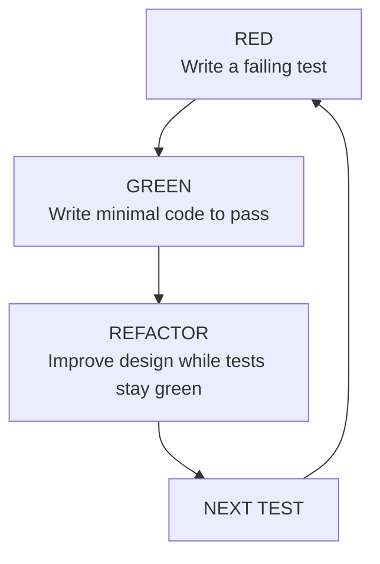

<section lang="en">

## What Is Test-Driven Development?

**Test-Driven Development (TDD)** is a software development practice where you write a failing test *before* you write the production code that makes it pass. It flips the traditional "code first, test later" workflow on its head.

In traditional development, the sequence looks like this:

```
Write code → Write tests → Run tests → Fix bugs
```

In TDD, the sequence is:

```
Write a failing test → Write minimal code → Run tests (all green) → Refactor
```

This small change in order has profound effects on how you design software. Instead of asking "What code should I write?", you ask "What behaviour do I want?" — and then you write exactly enough code to satisfy that behaviour.

**TDD is not a testing technique.** It is a design technique that happens to produce tests as a side effect.

</section>

<section lang="id">

## Apa Itu Test-Driven Development?

**Test-Driven Development (TDD)** adalah praktik pengembangan perangkat lunak di mana Anda menulis pengujian yang gagal *sebelum* Anda menulis kode produksi yang membuatnya berhasil. Praktik ini membalik alur kerja tradisional "kode dulu, uji kemudian".

Dalam pengembangan tradisional, urutannya seperti ini:

```
Tulis kode → Tulis pengujian → Jalankan pengujian → Perbaiki bug
```

Dalam TDD, urutannya adalah:

```
Tulis pengujian yang gagal → Tulis kode minimal → Jalankan pengujian (semua hijau) → Refactor
```

Perubahan kecil dalam urutan ini memiliki efek mendalam pada cara Anda mendesain perangkat lunak. Alih-alih bertanya "Kode apa yang harus saya tulis?", Anda bertanya "Perilaku apa yang saya inginkan?" — lalu Anda menulis kode yang cukup persis untuk memenuhi perilaku tersebut.

**TDD bukanlah teknik pengujian.** TDD adalah teknik desain yang kebetulan menghasilkan pengujian sebagai efek samping.

</section>

<figure class="my-10 text-center" role="figure">



<figcaption class="mt-3 text-sm text-neutral-500">
  <span lang="en">Figure: The TDD cycle — Red, Green, Refactor, repeat</span>
  <span lang="id">Gambar: Siklus TDD — Red, Green, Refactor, ulangi</span>
</figcaption>
</figure>

<section lang="en">

## The TDD Cycle: Red, Green, Refactor

Each iteration of TDD follows three strict phases. You repeat this cycle for every small piece of behaviour you add.

### Phase 1: RED — Write a Failing Test

Start by writing exactly **one test** that describes a behaviour you want. Run it. It must fail. If it passes immediately, you are either testing existing behaviour or the test itself is wrong.

A failing test proves two things:
1. The test actually checks something meaningful.
2. The feature does not exist yet — so you need to build it.

**Rules for the RED phase:**
- Write only one test at a time.
- The test must be specific and unambiguous.
- Run the test and watch it fail.

### Phase 2: GREEN — Write Minimal Code to Pass

Now write the **simplest possible code** that makes the test pass. Do not think about optimisation, edge cases, or elegant design. Your only goal is to turn the test from red to green as quickly as possible.

This constraint forces you to write only the code you actually need — nothing more. It prevents over-engineering and keeps your codebase lean.

**Rules for the GREEN phase:**
- Write the minimum code to make the test pass.
- Do not add extra features or handle edge cases the test does not cover.
- Run *all* tests to confirm nothing broke.

### Phase 3: REFACTOR — Improve Design Without Changing Behaviour

With all tests green, you have a safety net. Now you can improve the code: remove duplication, rename variables, extract methods, simplify logic. The tests guarantee you do not accidentally change behaviour.

**Rules for the REFACTOR phase:**
- Change only the production code (not the tests, unless they are also messy).
- Run tests after every small change.
- Keep tests green at all times.

After refactoring, pick the next behaviour and start the cycle again.

</section>

<section lang="id">

## Siklus TDD: Red, Green, Refactor

Setiap iterasi TDD mengikuti tiga fase yang ketat. Anda mengulangi siklus ini untuk setiap bagian kecil perilaku yang Anda tambahkan.

### Fase 1: RED — Tulis Pengujian yang Gagal

Mulailah dengan menulis **tepat satu pengujian** yang mendeskripsikan perilaku yang Anda inginkan. Jalankan. Ia harus gagal. Jika langsung berhasil, Anda sedang menguji perilaku yang sudah ada atau pengujian itu sendiri salah.

Pengujian yang gagal membuktikan dua hal:
1. Pengujian benar-benar memeriksa sesuatu yang berarti.
2. Fitur belum ada — jadi Anda perlu membangunnya.

**Aturan untuk fase RED:**
- Tulis hanya satu pengujian dalam satu waktu.
- Pengujian harus spesifik dan tidak ambigu.
- Jalankan pengujian dan lihat ia gagal.

### Fase 2: GREEN — Tulis Kode Minimal agar Berhasil

Sekarang tulis **kode paling sederhana yang mungkin** yang membuat pengujian berhasil. Jangan memikirkan optimasi, kasus tepi, atau desain yang elegan. Satu-satunya tujuan Anda adalah mengubah pengujian dari merah menjadi hijau secepat mungkin.

Batasan ini memaksa Anda untuk hanya menulis kode yang benar-benar Anda butuhkan — tidak lebih. Ini mencegah over-engineering dan menjaga basis kode Anda tetap ramping.

**Aturan untuk fase GREEN:**
- Tulis kode minimum untuk membuat pengujian berhasil.
- Jangan menambahkan fitur tambahan atau menangani kasus tepi yang tidak dicakup pengujian.
- Jalankan *semua* pengujian untuk memastikan tidak ada yang rusak.

### Fase 3: REFACTOR — Perbaiki Desain Tanpa Mengubah Perilaku

Dengan semua pengujian hijau, Anda memiliki jaring pengaman. Sekarang Anda dapat memperbaiki kode: menghilangkan duplikasi, mengganti nama variabel, mengekstrak metode, menyederhanakan logika. Pengujian menjamin Anda tidak secara tidak sengaja mengubah perilaku.

**Aturan untuk fase REFACTOR:**
- Ubah hanya kode produksi (bukan pengujian, kecuali jika juga berantakan).
- Jalankan pengujian setelah setiap perubahan kecil.
- Jaga pengujian tetap hijau setiap saat.

Setelah refactoring, pilih perilaku berikutnya dan mulai siklus lagi.

</section>

---

<section lang="en">

## Why TDD Matters

You might wonder: is flipping the order really worth the effort? Here is what TDD gives you beyond just having tests.

### 1. Confidence to Change Code

When you have a suite of fast, reliable tests, you can refactor aggressively. Rename classes, extract interfaces, restructure modules — if the tests still pass, the behaviour is preserved. This is the single biggest productivity boost TDD offers.

### 2. Immediate Design Feedback

If writing a test is painful, your design probably has a problem. Maybe your class has too many dependencies, or your function does too many things. TDD surfaces these design issues early, when they are cheap to fix.

### 3. Regression Safety

Every test you write becomes a permanent guard against that bug returning. Six months later, when a teammate (or your future self) changes something, the test fails and alerts them immediately.

### 4. Living Documentation

Tests describe exactly how the system should behave, in executable code that cannot go out of sync with the implementation. New team members can read the test suite to understand what each component does.

### 5. Smaller, More Focused Units

Because TDD forces you to test one behaviour at a time, it naturally pushes you toward small, single-responsibility classes and functions. Large, tangled code is hard to test — so TDD steers you away from it.

</section>

<section lang="id">

## Mengapa TDD Penting

Anda mungkin bertanya: apakah membalik urutan benar-benar sepadan dengan usahanya? Berikut adalah apa yang TDD berikan kepada Anda di luar sekadar memiliki pengujian.

### 1. Keyakinan untuk Mengubah Kode

Ketika Anda memiliki sekumpulan pengujian yang cepat dan andal, Anda dapat melakukan refactor secara agresif. Ganti nama kelas, ekstrak interface, restrukturisasi modul — jika pengujian masih berhasil, perilaku tetap terjaga. Ini adalah peningkatan produktivitas terbesar yang ditawarkan TDD.

### 2. Umpan Balik Desain Langsung

Jika menulis pengujian terasa menyakitkan, desain Anda mungkin memiliki masalah. Mungkin kelas Anda memiliki terlalu banyak dependensi, atau fungsi Anda melakukan terlalu banyak hal. TDD memunculkan masalah desain ini lebih awal, saat masih murah untuk diperbaiki.

### 3. Keamanan Regresi

Setiap pengujian yang Anda tulis menjadi penjaga permanen terhadap bug yang kembali muncul. Enam bulan kemudian, ketika rekan tim (atau diri Anda di masa depan) mengubah sesuatu, pengujian gagal dan langsung memberi tahu mereka.

### 4. Dokumentasi Hidup

Pengujian mendeskripsikan dengan tepat bagaimana sistem seharusnya berperilaku, dalam kode yang dapat dieksekusi yang tidak bisa lepas sinkron dengan implementasi. Anggota tim baru dapat membaca suite pengujian untuk memahami apa yang dilakukan setiap komponen.

### 5. Unit yang Lebih Kecil dan Lebih Fokus

Karena TDD memaksa Anda menguji satu perilaku dalam satu waktu, secara alami TDD mendorong Anda menuju kelas dan fungsi kecil dengan tanggung jawab tunggal. Kode yang besar dan kusut sulit diuji — jadi TDD menjauhkan Anda darinya.

</section>

---

<section lang="en">

## Hands-On Example: Password Validator

Let us apply the full TDD cycle to a real-world problem. We will build a `PasswordValidator` class that checks whether a password meets security requirements. Our rules:

- Password must be at least 8 characters long.
- Password must contain at least one uppercase letter.
- Password must contain at least one digit.
- Password must not be empty.

We will use **PHPUnit**. If you do not have it installed, run:

```bash
composer require --dev phpunit/phpunit
```

### Setup

Create two files in your project:

```
project/
├── src/
│   └── PasswordValidator.php
├── tests/
│   └── PasswordValidatorTest.php
└── vendor/
```

### Iteration 1: Reject an empty password

**RED — Write a failing test** (`tests/PasswordValidatorTest.php`)

```php
<?php

use PHPUnit\Framework\TestCase;

class PasswordValidatorTest extends TestCase
{
    public function testRejectEmptyPassword(): void
    {
        $validator = new PasswordValidator();
        $this->assertFalse($validator->isValid(''));
    }
}
```

Run it:

```bash
$ vendor/bin/phpunit tests/PasswordValidatorTest.php

Error: Class "PasswordValidator" not found
```

The test fails because the class does not exist yet. That counts as RED.

**GREEN — Write minimal code** (`src/PasswordValidator.php`)

```php
<?php

class PasswordValidator
{
    public function isValid(string $password): bool
    {
        if ($password === '') {
            return false;
        }
        return true;
    }
}
```

Run again:

```bash
$ vendor/bin/phpunit tests/PasswordValidatorTest.php

OK (1 test, 1 assertion)
```

**REFACTOR — Clean up**

The code is already simple. Nothing to refactor yet. Move on.

### Iteration 2: Reject passwords shorter than 8 characters

**RED**

```php
public function testRejectShortPassword(): void
{
    $validator = new PasswordValidator();
    $this->assertFalse($validator->isValid('Ab1'));
}
```

Run: the test fails — `Ab1` passes because our code only rejects empty strings.

**GREEN**

```php
public function isValid(string $password): bool
{
    if ($password === '') {
        return false;
    }
    if (strlen($password) < 8) {
        return false;
    }
    return true;
}
```

Run: both tests pass. GREEN.

**REFACTOR**

We have two `if` blocks checking similar things. Let us combine them:

```php
public function isValid(string $password): bool
{
    return strlen($password) >= 8;
}
```

Run tests: still green. The empty-string check is naturally covered by the length check. Cleaner and more expressive. This is the power of the refactor step — we simplified the code and the tests confirm we did not break anything.

### Iteration 3: Require at least one uppercase letter

**RED**

```php
public function testRejectPasswordWithoutUppercase(): void
{
    $validator = new PasswordValidator();
    $this->assertFalse($validator->isValid('abcdefgh'));
}
```

Run: fails — `abcdefgh` is 8 characters long, so it passes.

**GREEN**

```php
public function isValid(string $password): bool
{
    if (strlen($password) < 8) {
        return false;
    }
    if (!preg_match('/[A-Z]/', $password)) {
        return false;
    }
    return true;
}
```

Run: all three tests pass.

**REFACTOR**

```php
public function isValid(string $password): bool
{
    return strlen($password) >= 8
        && preg_match('/[A-Z]/', $password);
}
```

Shorter, more declarative. Tests stay green.

### Iteration 4: Require at least one digit

**RED**

```php
public function testRejectPasswordWithoutDigit(): void
{
    $validator = new PasswordValidator();
    $this->assertFalse($validator->isValid('Abcdefgh'));
}
```

Run: fails — `Abcdefgh` has an uppercase letter and is long enough.

**GREEN**

```php
public function isValid(string $password): bool
{
    return strlen($password) >= 8
        && preg_match('/[A-Z]/', $password)
        && preg_match('/\d/', $password);
}
```

Run: all four tests pass.

**REFACTOR** — Nothing to improve. The method is clear and concise.

### Iteration 5: Accept a valid password

Let us also verify the happy path. Write a test that asserts a fully valid password returns `true`.

**RED**

```php
public function testAcceptValidPassword(): void
{
    $validator = new PasswordValidator();
    $this->assertTrue($validator->isValid('StrongPass1'));
}
```

Run: it passes immediately. This is not a RED phase — the behaviour already exists from our previous work. Move on or treat this as a documentation test.

### Final Code

**`src/PasswordValidator.php`**

```php
<?php

class PasswordValidator
{
    public function isValid(string $password): bool
    {
        return strlen($password) >= 8
            && preg_match('/[A-Z]/', $password)
            && preg_match('/\d/', $password);
    }
}
```

**`tests/PasswordValidatorTest.php`**

```php
<?php

use PHPUnit\Framework\TestCase;

class PasswordValidatorTest extends TestCase
{
    public function testRejectEmptyPassword(): void
    {
        $validator = new PasswordValidator();
        $this->assertFalse($validator->isValid(''));
    }

    public function testRejectShortPassword(): void
    {
        $validator = new PasswordValidator();
        $this->assertFalse($validator->isValid('Ab1'));
    }

    public function testRejectPasswordWithoutUppercase(): void
    {
        $validator = new PasswordValidator();
        $this->assertFalse($validator->isValid('abcdefgh'));
    }

    public function testRejectPasswordWithoutDigit(): void
    {
        $validator = new PasswordValidator();
        $this->assertFalse($validator->isValid('Abcdefgh'));
    }

    public function testAcceptValidPassword(): void
    {
        $validator = new PasswordValidator();
        $this->assertTrue($validator->isValid('StrongPass1'));
    }
}
```

Run the full suite:

```bash
$ vendor/bin/phpunit tests/PasswordValidatorTest.php

PHPUnit 11.0.0 by Sebastian Bergmann and contributors.

.....                                                    5 / 5 (100%)

Time: 00:00.008, Memory: 6.00 MB

OK (5 tests, 5 assertions)
```

Notice how we never wrote more code than the tests demanded. The class emerged incrementally, guided by one failing test at a time. Every line of production code exists because a test required it.

</section>

<section lang="id">

## Contoh Langsung: Validator Kata Sandi

Mari kita terapkan siklus TDD penuh pada masalah dunia nyata. Kita akan membangun kelas `PasswordValidator` yang memeriksa apakah kata sandi memenuhi persyaratan keamanan. Aturan kita:

- Kata sandi harus minimal 8 karakter.
- Kata sandi harus mengandung setidaknya satu huruf kapital.
- Kata sandi harus mengandung setidaknya satu digit.
- Kata sandi tidak boleh kosong.

Kita akan menggunakan **PHPUnit**. Jika Anda belum menginstalnya, jalankan:

```bash
composer require --dev phpunit/phpunit
```

### Persiapan

Buat dua file di proyek Anda:

```
project/
├── src/
│   └── PasswordValidator.php
├── tests/
│   └── PasswordValidatorTest.php
└── vendor/
```

### Iterasi 1: Tolak kata sandi kosong

**RED — Tulis pengujian yang gagal** (`tests/PasswordValidatorTest.php`)

```php
<?php

use PHPUnit\Framework\TestCase;

class PasswordValidatorTest extends TestCase
{
    public function testRejectEmptyPassword(): void
    {
        $validator = new PasswordValidator();
        $this->assertFalse($validator->isValid(''));
    }
}
```

Jalankan:

```bash
$ vendor/bin/phpunit tests/PasswordValidatorTest.php

Error: Class "PasswordValidator" not found
```

Pengujian gagal karena kelas belum ada. Itu termasuk RED.

**GREEN — Tulis kode minimal** (`src/PasswordValidator.php`)

```php
<?php

class PasswordValidator
{
    public function isValid(string $password): bool
    {
        if ($password === '') {
            return false;
        }
        return true;
    }
}
```

Jalankan lagi:

```bash
$ vendor/bin/phpunit tests/PasswordValidatorTest.php

OK (1 test, 1 assertion)
```

**REFACTOR — Bersihkan**

Kode sudah sederhana. Belum ada yang perlu direfactor. Lanjutkan.

### Iterasi 2: Tolak kata sandi kurang dari 8 karakter

**RED**

```php
public function testRejectShortPassword(): void
{
    $validator = new PasswordValidator();
    $this->assertFalse($validator->isValid('Ab1'));
}
```

Jalankan: pengujian gagal — `Ab1` lolos karena kode kita hanya menolak string kosong.

**GREEN**

```php
public function isValid(string $password): bool
{
    if ($password === '') {
        return false;
    }
    if (strlen($password) < 8) {
        return false;
    }
    return true;
}
```

Jalankan: kedua pengujian berhasil. GREEN.

**REFACTOR**

Kita memiliki dua blok `if` yang memeriksa hal serupa. Mari kita gabungkan:

```php
public function isValid(string $password): bool
{
    return strlen($password) >= 8;
}
```

Jalankan pengujian: tetap hijau. Pemeriksaan string kosong secara alami tercakup oleh pemeriksaan panjang. Lebih bersih dan lebih ekspresif. Inilah kekuatan langkah refactor — kita menyederhanakan kode dan pengujian mengonfirmasi kita tidak merusak apa pun.

### Iterasi 3: Wajibkan setidaknya satu huruf kapital

**RED**

```php
public function testRejectPasswordWithoutUppercase(): void
{
    $validator = new PasswordValidator();
    $this->assertFalse($validator->isValid('abcdefgh'));
}
```

Jalankan: gagal — `abcdefgh` panjangnya 8 karakter, jadi lolos.

**GREEN**

```php
public function isValid(string $password): bool
{
    if (strlen($password) < 8) {
        return false;
    }
    if (!preg_match('/[A-Z]/', $password)) {
        return false;
    }
    return true;
}
```

Jalankan: ketiga pengujian berhasil.

**REFACTOR**

```php
public function isValid(string $password): bool
{
    return strlen($password) >= 8
        && preg_match('/[A-Z]/', $password);
}
```

Lebih pendek, lebih deklaratif. Pengujian tetap hijau.

### Iterasi 4: Wajibkan setidaknya satu digit

**RED**

```php
public function testRejectPasswordWithoutDigit(): void
{
    $validator = new PasswordValidator();
    $this->assertFalse($validator->isValid('Abcdefgh'));
}
```

Jalankan: gagal — `Abcdefgh` memiliki huruf kapital dan cukup panjang.

**GREEN**

```php
public function isValid(string $password): bool
{
    return strlen($password) >= 8
        && preg_match('/[A-Z]/', $password)
        && preg_match('/\d/', $password);
}
```

Jalankan: keempat pengujian berhasil.

**REFACTOR** — Tidak ada yang perlu diperbaiki. Metode sudah jelas dan ringkas.

### Iterasi 5: Terima kata sandi yang valid

Mari kita juga memverifikasi jalur sukses. Tulis pengujian yang menegaskan kata sandi yang sepenuhnya valid mengembalikan `true`.

**RED**

```php
public function testAcceptValidPassword(): void
{
    $validator = new PasswordValidator();
    $this->assertTrue($validator->isValid('StrongPass1'));
}
```

Jalankan: langsung berhasil. Ini bukan fase RED — perilaku sudah ada dari pekerjaan kita sebelumnya. Lanjutkan atau perlakukan ini sebagai pengujian dokumentasi.

### Kode Akhir

**`src/PasswordValidator.php`**

```php
<?php

class PasswordValidator
{
    public function isValid(string $password): bool
    {
        return strlen($password) >= 8
            && preg_match('/[A-Z]/', $password)
            && preg_match('/\d/', $password);
    }
}
```

**`tests/PasswordValidatorTest.php`**

```php
<?php

use PHPUnit\Framework\TestCase;

class PasswordValidatorTest extends TestCase
{
    public function testRejectEmptyPassword(): void
    {
        $validator = new PasswordValidator();
        $this->assertFalse($validator->isValid(''));
    }

    public function testRejectShortPassword(): void
    {
        $validator = new PasswordValidator();
        $this->assertFalse($validator->isValid('Ab1'));
    }

    public function testRejectPasswordWithoutUppercase(): void
    {
        $validator = new PasswordValidator();
        $this->assertFalse($validator->isValid('abcdefgh'));
    }

    public function testRejectPasswordWithoutDigit(): void
    {
        $validator = new PasswordValidator();
        $this->assertFalse($validator->isValid('Abcdefgh'));
    }

    public function testAcceptValidPassword(): void
    {
        $validator = new PasswordValidator();
        $this->assertTrue($validator->isValid('StrongPass1'));
    }
}
```

Jalankan seluruh suite:

```bash
$ vendor/bin/phpunit tests/PasswordValidatorTest.php

PHPUnit 11.0.0 by Sebastian Bergmann and contributors.

.....                                                    5 / 5 (100%)

Time: 00:00.008, Memory: 6.00 MB

OK (5 tests, 5 assertions)
```

Perhatikan bagaimana kita tidak pernah menulis kode lebih dari yang diminta pengujian. Kelas muncul secara bertahap, dipandu oleh satu pengujian yang gagal dalam satu waktu. Setiap baris kode produksi ada karena pengujian memerlukannya.

</section>

---

<section lang="en">

## Common Beginner Mistakes

### 1. Writing Too Many Tests at Once

Beginners often get excited and write ten tests before running any of them. When five fail, they do not know which line of production code to write first. TDD works because the feedback loop is small — one test, one failure, one code change, one green bar.

**Fix:** Write exactly one test. Run it. Watch it fail. Then write code.

### 2. Skipping the Refactor Step

After three or four green cycles, your code accrues duplication and awkward structure. If you never refactor, the design degrades. The refactor step is not optional — it is where the "design" part of Test-Driven *Development* happens.

**Fix:** After every green, ask: "Can I make this code simpler without changing behaviour?" If yes, refactor.

### 3. Testing Implementation Details

Testing that a private method was called or that an internal array has a specific shape creates brittle tests. When you refactor the implementation, these tests break even though the behaviour is correct.

**Fix:** Test *what* the code does, not *how* it does it. If you change the implementation without changing the external behaviour, the tests should still pass.

### 4. Writing Tests That Pass Immediately

If you write a test and it passes without writing any production code, you are not doing TDD. Either the behaviour already exists (write a test for something new) or the test is wrong (it does not actually test the behaviour you think it does).

**Fix:** Always watch your test fail first. A test that never fails is not testing anything new.

### 5. Not Running the Full Suite Often

After making a change in the GREEN phase, run *all* your tests, not just the one you are working on. The new code might break something you wrote two cycles ago.

**Fix:** Run `vendor/bin/phpunit` (without specifying a single test file) frequently. Every green phase should end with a full-suite green.

</section>

<section lang="id">

## Kesalahan Umum Pemula

### 1. Menulis Terlalu Banyak Pengujian Sekaligus

Pemula sering kali bersemangat dan menulis sepuluh pengujian sebelum menjalankan satu pun. Ketika lima gagal, mereka tidak tahu baris kode produksi mana yang harus ditulis terlebih dahulu. TDD bekerja karena umpan baliknya kecil — satu pengujian, satu kegagalan, satu perubahan kode, satu bar hijau.

**Perbaikan:** Tulis tepat satu pengujian. Jalankan. Lihat ia gagal. Lalu tulis kode.

### 2. Melewatkan Langkah Refactor

Setelah tiga atau empat siklus hijau, kode Anda menumpuk duplikasi dan struktur yang canggung. Jika Anda tidak pernah melakukan refactor, desain akan menurun. Langkah refactor tidak opsional — di sinilah bagian "desain" dari Test-Driven *Development* terjadi.

**Perbaikan:** Setelah setiap hijau, tanyakan: "Bisakah saya membuat kode ini lebih sederhana tanpa mengubah perilaku?" Jika ya, lakukan refactor.

### 3. Menguji Detail Implementasi

Menguji bahwa metode privat dipanggil atau bahwa array internal memiliki bentuk tertentu menciptakan pengujian yang rapuh. Ketika Anda merefactor implementasi, pengujian ini rusak meskipun perilakunya benar.

**Perbaikan:** Uji *apa* yang dilakukan kode, bukan *bagaimana* ia melakukannya. Jika Anda mengubah implementasi tanpa mengubah perilaku eksternal, pengujian seharusnya tetap berhasil.

### 4. Menulis Pengujian yang Langsung Berhasil

Jika Anda menulis pengujian dan ia berhasil tanpa menulis kode produksi apa pun, Anda tidak melakukan TDD. Entah perilaku sudah ada (tulis pengujian untuk sesuatu yang baru) atau pengujiannya salah (tidak benar-benar menguji perilaku yang Anda pikirkan).

**Perbaikan:** Selalu lihat pengujian Anda gagal terlebih dahulu. Pengujian yang tidak pernah gagal tidak menguji sesuatu yang baru.

### 5. Tidak Menjalankan Seluruh Suite Secara Rutin

Setelah membuat perubahan di fase GREEN, jalankan *semua* pengujian Anda, bukan hanya yang sedang Anda kerjakan. Kode baru mungkin merusak sesuatu yang Anda tulis dua siklus yang lalu.

**Perbaikan:** Jalankan `vendor/bin/phpunit` (tanpa menentukan file pengujian tunggal) sesering mungkin. Setiap fase green harus diakhiri dengan seluruh suite berwarna hijau.

</section>

---

<section lang="en">

## When to Use TDD (and When Not To)

### Good Candidates for TDD

| Situation | Why TDD fits |
|---|---|
| **Business logic** | Rules, validations, calculations — these have clear inputs and outputs. |
| **API endpoints** | Well-defined request/response contracts make tests easy to write. |
| **Data transformations** | Mapping, filtering, formatting — pure functions with predictable results. |
| **Bug fixes** | Write a test that reproduces the bug, then fix it. The test stays as a regression guard. |
| **Library or package code** | Public interfaces benefit from thorough, behaviour-driven testing. |

### When TDD May Not Be the Best Fit

| Situation | Why TDD struggles |
|---|---|
| **UI layout and styling** | Visual output is better verified by snapshot tests or manual review. |
| **Spike or exploratory code** | When you are learning how something works, writing tests first slows discovery. Write tests after the spike. |
| **Throwaway prototypes** | If the code will be discarded, the test investment is wasted. |
| **Highly stateful integration** | Tests that require complex database or network setup can be slow and brittle. Consider integration tests instead. |
| **Third-party glue code** | Code that only calls external libraries may not benefit from unit-level TDD. |

### A Pragmatic Approach

You do not need to apply TDD to every line of code. The best practitioners use TDD for the parts of the system where correctness matters most — business rules, core algorithms, and public APIs — and use other techniques for the rest. The goal is confidence, not purity.

</section>

<section lang="id">

## Kapan Menggunakan TDD (dan Kapan Tidak)

### Kandidat yang Cocok untuk TDD

| Situasi | Mengapa TDD cocok |
|---|---|
| **Logika bisnis** | Aturan, validasi, kalkulasi — ini memiliki masukan dan keluaran yang jelas. |
| **Endpoint API** | Kontrak request/response yang terdefinisi dengan baik membuat pengujian mudah ditulis. |
| **Transformasi data** | Mapping, filtering, formatting — fungsi murni dengan hasil yang dapat diprediksi. |
| **Perbaikan bug** | Tulis pengujian yang mereproduksi bug, lalu perbaiki. Pengujian tetap sebagai penjaga regresi. |
| **Kode library atau package** | Antarmuka publik mendapat manfaat dari pengujian menyeluruh berbasis perilaku. |

### Ketika TDD Mungkin Bukan Pilihan Terbaik

| Situasi | Mengapa TDD kesulitan |
|---|---|
| **Tata letak dan gaya UI** | Output visual lebih baik diverifikasi oleh snapshot test atau tinjauan manual. |
| **Kode spike atau eksplorasi** | Saat Anda belajar bagaimana sesuatu bekerja, menulis pengujian terlebih dahulu memperlambat penemuan. Tulis pengujian setelah spike. |
| **Prototipe sekali pakai** | Jika kode akan dibuang, investasi pengujian terbuang. |
| **Integrasi yang sangat stateful** | Pengujian yang memerlukan pengaturan database atau jaringan yang kompleks bisa lambat dan rapuh. Pertimbangkan integration test. |
| **Kode penghubung pihak ketiga** | Kode yang hanya memanggil library eksternal mungkin tidak mendapat manfaat dari TDD tingkat unit. |

### Pendekatan Pragmatis

Anda tidak perlu menerapkan TDD pada setiap baris kode. Praktisi terbaik menggunakan TDD untuk bagian sistem di mana kebenaran paling penting — aturan bisnis, algoritma inti, dan API publik — dan menggunakan teknik lain untuk sisanya. Tujuannya adalah keyakinan, bukan kemurnian.

</section>

---

<section lang="en">

## Summary

1. **TDD is a design practice** — you write a failing test, make it pass with minimal code, then refactor.
2. **The cycle is strict:** RED (write a failing test) → GREEN (write minimal code) → REFACTOR (improve design).
3. **TDD brings confidence, design feedback, regression safety, and living documentation.**
4. **Start small:** one test, one behaviour, one code change at a time.
5. **Avoid common pitfalls:** writing too many tests at once, skipping refactor, testing implementation details.
6. **Be pragmatic:** use TDD where correctness matters most. Do not force it on exploratory or throwaway code.

> The true value of TDD is not the tests you write — it is the thinking it forces you to do before you write code.

</section>

<section lang="id">

## Ringkasan

1. **TDD adalah praktik desain** — Anda menulis pengujian yang gagal, membuatnya berhasil dengan kode minimal, lalu melakukan refactor.
2. **Siklusnya ketat:** RED (tulis pengujian yang gagal) → GREEN (tulis kode minimal) → REFACTOR (perbaiki desain).
3. **TDD membawa keyakinan, umpan balik desain, keamanan regresi, dan dokumentasi hidup.**
4. **Mulai dari yang kecil:** satu pengujian, satu perilaku, satu perubahan kode dalam satu waktu.
5. **Hindari jebakan umum:** menulis terlalu banyak pengujian sekaligus, melewatkan refactor, menguji detail implementasi.
6. **Bersikap pragmatis:** gunakan TDD di mana kebenaran paling penting. Jangan paksakan pada kode eksplorasi atau sekali pakai.

> Nilai sejati TDD bukanlah pengujian yang Anda tulis — melainkan cara berpikir yang ia paksakan sebelum Anda menulis kode.

</section>

---

<section lang="en">

## Practice Exercise: Grade Calculator

Now it is your turn. Apply the TDD cycle to build a `GradeCalculator` class that converts a numeric score (0–100) into a letter grade using the following scale:

| Score Range | Grade |
|---|---|
| 90–100 | A |
| 80–89 | B |
| 70–79 | C |
| 60–69 | D |
| Below 60 | E |

**Requirements:**
- Throw an exception for scores below 0 or above 100.
- Write tests one at a time using the RED → GREEN → REFACTOR cycle.
- Cover boundaries: test exactly at 90, 80, 70, 60, 0, and 100.

**Starter test file** (`tests/GradeCalculatorTest.php`):

```php
<?php

use PHPUnit\Framework\TestCase;

class GradeCalculatorTest extends TestCase
{
    public function testGradeAForScore90(): void
    {
        $calc = new GradeCalculator();
        $this->assertEquals('A', $calc->grade(90));
    }
}
```

**Expected behaviour after implementation:**

```
grade(95)  → 'A'
grade(85)  → 'B'
grade(75)  → 'C'
grade(65)  → 'D'
grade(55)  → 'E'
grade(-1)  → throws InvalidArgumentException
grade(101) → throws InvalidArgumentException
```

Try it yourself! Start with the first test, watch it fail, write the minimal code, refactor, and repeat. The goal is not just passing tests — it is experiencing how the design emerges from the TDD rhythm.

</section>

<section lang="id">

## Latihan Praktik: Kalkulator Nilai

Sekarang giliran Anda. Terapkan siklus TDD untuk membangun kelas `GradeCalculator` yang mengonversi skor numerik (0–100) menjadi nilai huruf menggunakan skala berikut:

| Rentang Skor | Nilai |
|---|---|
| 90–100 | A |
| 80–89 | B |
| 70–79 | C |
| 60–69 | D |
| Di bawah 60 | E |

**Persyaratan:**
- Lempar exception untuk skor di bawah 0 atau di atas 100.
- Tulis pengujian satu per satu menggunakan siklus RED → GREEN → REFACTOR.
- Cakup batas: uji tepat di 90, 80, 70, 60, 0, dan 100.

**File pengujian awal** (`tests/GradeCalculatorTest.php`):

```php
<?php

use PHPUnit\Framework\TestCase;

class GradeCalculatorTest extends TestCase
{
    public function testGradeAForScore90(): void
    {
        $calc = new GradeCalculator();
        $this->assertEquals('A', $calc->grade(90));
    }
}
```

**Perilaku yang diharapkan setelah implementasi:**

```
grade(95)  → 'A'
grade(85)  → 'B'
grade(75)  → 'C'
grade(65)  → 'D'
grade(55)  → 'E'
grade(-1)  → melempar InvalidArgumentException
grade(101) → melempar InvalidArgumentException
```

Coba sendiri! Mulai dengan pengujian pertama, lihat ia gagal, tulis kode minimal, refactor, dan ulangi. Tujuannya bukan hanya pengujian yang berhasil — tetapi merasakan bagaimana desain muncul dari ritme TDD.

</section>
