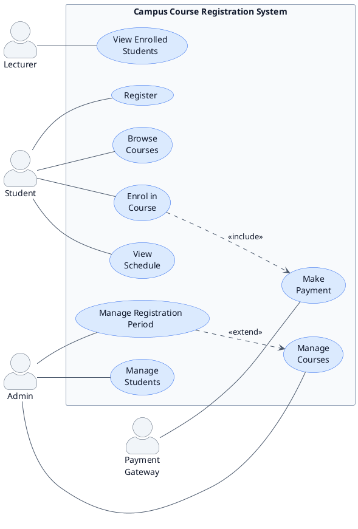
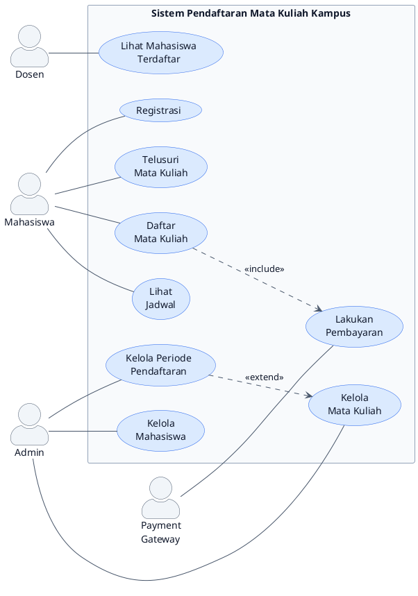

<nav aria-label="Series navigation" class="mb-8 p-4 bg-neutral-50 dark:bg-gray-800 rounded-lg border border-neutral-200 dark:border-gray-700">
  

    UML Mini Series — 5 Parts
    Seri Mini UML — 5 Bagian
  

  <ol class="list-decimal list-inside space-y-1 text-sm">
    <li class="font-bold">
      Part 1: Introduction to UML & Use Case Diagram ← You are here
      Bagian 1: Pengenalan UML & Use Case Diagram ← Anda di sini
    </li>
    <li><a href="/blog/uml-series-part-2-use-case-scenario">Part 2: Use Case Scenario</a></li>
    <li><a href="/blog/uml-series-part-3-activity-diagram">Part 3: Activity Diagram</a></li>
    <li><a href="/blog/uml-series-part-4-sequence-diagram">Part 4: Sequence Diagram</a></li>
    <li><a href="/blog/uml-series-part-5-class-diagram-laravel">Part 5: Class Diagram & Laravel Realization</a></li>
  </ol>
</nav>

<section lang="en">

## 1. What is UML?

**UML (Unified Modeling Language)** is a standardised, general-purpose modeling language used to visualise, specify, construct, and document the artefacts of a software system. Think of UML as the **blueprint language of software engineering** — just as an architect draws floor plans before construction begins, a software engineer draws UML diagrams before writing code.

UML was created in the mid-1990s by Grady Booch, Ivar Jacobson, and James Rumbaugh — collectively known as the "Three Amigos" — and was adopted as an ISO standard in 2005. Today, UML 2.x provides 14 diagram types organised into two broad categories:

| Category | Purpose | Diagram Types |
|---|---|---|
| **Structure Diagrams** | Show the static architecture of the system | Class Diagram, Object Diagram, Component Diagram, Deployment Diagram, Package Diagram, Composite Structure Diagram, Profile Diagram |
| **Behaviour Diagrams** | Show the dynamic behaviour of the system | Use Case Diagram, Activity Diagram, Sequence Diagram, State Machine Diagram, Communication Diagram, Timing Diagram, Interaction Overview Diagram |

In this series we focus on the five most commonly used diagrams in real-world software projects: Use Case Diagram, Use Case Scenario, Activity Diagram, Sequence Diagram, and Class Diagram.

</section>

<section lang="id">

## 1. Apa Itu UML?

**UML (Unified Modeling Language)** adalah bahasa pemodelan standar dan serbaguna yang digunakan untuk memvisualisasikan, menspesifikasikan, membangun, dan mendokumentasikan artefak sistem perangkat lunak. Anggaplah UML sebagai **bahasa blueprint rekayasa perangkat lunak** — seperti halnya seorang arsitek menggambar denah sebelum konstruksi dimulai, seorang software engineer menggambar diagram UML sebelum menulis kode.

UML diciptakan pada pertengahan 1990-an oleh Grady Booch, Ivar Jacobson, dan James Rumbaugh — yang secara kolektif dikenal sebagai "Three Amigos" — dan diadopsi sebagai standar ISO pada tahun 2005. Saat ini, UML 2.x menyediakan 14 tipe diagram yang diorganisasikan ke dalam dua kategori utama:

| Kategori | Tujuan | Tipe Diagram |
|---|---|---|
| **Structure Diagram** | Menunjukkan arsitektur statis sistem | Class Diagram, Object Diagram, Component Diagram, Deployment Diagram, Package Diagram, Composite Structure Diagram, Profile Diagram |
| **Behaviour Diagram** | Menunjukkan perilaku dinamis sistem | Use Case Diagram, Activity Diagram, Sequence Diagram, State Machine Diagram, Communication Diagram, Timing Diagram, Interaction Overview Diagram |

Dalam seri ini kita fokus pada lima diagram yang paling sering digunakan dalam proyek perangkat lunak dunia nyata: Use Case Diagram, Use Case Scenario, Activity Diagram, Sequence Diagram, dan Class Diagram.

</section>

---

<section lang="en">

## 2. Why Use UML?

### What is it?
UML is a visual language that turns abstract system requirements and designs into concrete, shareable diagrams. It bridges the gap between "what the stakeholder wants" and "what the developer builds."

### Why does it matter?
- **Communication.** Diagrams transcend language barriers. A Use Case Diagram drawn in Indonesia is instantly understood by a developer in Germany.
- **Documentation.** UML diagrams serve as living documentation that survives long after the original developers have moved on.
- **Analysis.** Drawing UML forces you to think through edge cases, missing actors, and unclear relationships before writing a single line of code.
- **Design.** Class diagrams and sequence diagrams let you evaluate architectural decisions on paper — where changes cost minutes, not months.

### When do you use it?
Use UML at the **early stages** of a project — during requirements gathering, analysis, and design. UML is most valuable before code is written, not after. That said, reverse-engineering UML from existing code (for documentation) is also common.

### Where does it fit?
UML fits into the **software development lifecycle (SDLC)** at specific phases:
- **Requirements phase:** Use Case Diagram, Use Case Scenario
- **Analysis phase:** Activity Diagram
- **Design phase:** Sequence Diagram, Class Diagram
- **Implementation phase:** Class Diagram (as a reference for code generation)

### How do you create one?
A UML diagram is created by identifying the system boundary, actors, and their interactions, then mapping them onto one of the 14 diagram types. Modern tools — including PlantUML (which we use in this series) — let you write diagrams as text and render them automatically.

</section>

<section lang="id">

## 2. Mengapa Menggunakan UML?

### Apa itu?
UML adalah bahasa visual yang mengubah persyaratan dan desain sistem yang abstrak menjadi diagram konkret yang dapat dibagikan. UML menjembatani kesenjangan antara "apa yang diinginkan stakeholder" dan "apa yang dibangun developer."

### Mengapa penting?
- **Komunikasi.** Diagram melampaui batasan bahasa. Use Case Diagram yang digambar di Indonesia langsung dipahami oleh developer di Jerman.
- **Dokumentasi.** Diagram UML berfungsi sebagai dokumentasi hidup yang bertahan lama setelah developer asli pindah.
- **Analisis.** Menggambar UML memaksa Anda memikirkan kasus-kasus tepi, aktor yang hilang, dan hubungan yang tidak jelas sebelum menulis satu baris kode pun.
- **Desain.** Class diagram dan sequence diagram memungkinkan Anda mengevaluasi keputusan arsitektur di atas kertas — di mana perubahan memakan biaya menit, bukan bulan.

### Kapan digunakan?
Gunakan UML pada **tahap awal** proyek — selama pengumpulan persyaratan, analisis, dan desain. UML paling berharga sebelum kode ditulis, bukan setelahnya. Meskipun demikian, reverse-engineering UML dari kode yang ada (untuk dokumentasi) juga umum dilakukan.

### Di mana tempatnya?
UML cocok dalam **software development lifecycle (SDLC)** pada fase-fase spesifik:
- **Fase persyaratan:** Use Case Diagram, Use Case Scenario
- **Fase analisis:** Activity Diagram
- **Fase desain:** Sequence Diagram, Class Diagram
- **Fase implementasi:** Class Diagram (sebagai referensi untuk code generation)

### Bagaimana membuatnya?
Diagram UML dibuat dengan mengidentifikasi batas sistem, aktor, dan interaksi mereka, kemudian memetakannya ke salah satu dari 14 tipe diagram. Tools modern — termasuk PlantUML (yang kita gunakan dalam seri ini) — memungkinkan Anda menulis diagram sebagai teks dan merendernya secara otomatis.

</section>

---

<section lang="en">

## 3. Introducing Our Continuous Example: Campus Course Registration System

Throughout this five-part series, we will model a single system from start to finish — a **Campus Course Registration System** built with Laravel. This is a realistic application that most students and educators encounter in their academic lives.

### System Description

The system allows students at a polytechnic campus to browse available courses, register for courses each semester, and view their class schedules. Administrators manage the course catalogue, handle student data, and oversee the registration process. Lecturers can view their enrolled students and manage class rosters. A payment gateway integration handles tuition and registration fees.

### Key Actors

| Actor | Description |
|---|---|
| **Student** | Enrols in courses, views schedule, checks grades |
| **Admin** | Manages course catalogue, student records, and registration periods |
| **Lecturer** | Views class roster, manages enrolled students |
| **Payment Gateway** | External system that processes registration payments |

### Core Functionalities

1. **User Registration & Login** — Students and lecturers create accounts and authenticate.
2. **Browse Courses** — Students view the available course catalogue with filters.
3. **Enrol in Course** — Students select courses and confirm enrolment (after payment verification).
4. **View Schedule** — Students see their weekly class schedule.
5. **Manage Courses (Admin)** — Admin creates, updates, and deletes courses.
6. **Manage Students (Admin)** — Admin manages student data and registration status.
7. **View Enrolled Students (Lecturer)** — Lecturer sees the list of students in their courses.

</section>

<section lang="id">

## 3. Memperkenalkan Contoh Berkelanjutan Kita: Sistem Pendaftaran Mata Kuliah Kampus

Sepanjang seri lima bagian ini, kita akan memodelkan satu sistem dari awal hingga akhir — sebuah **Sistem Pendaftaran Mata Kuliah Kampus** yang dibangun dengan Laravel. Ini adalah aplikasi realistis yang sering ditemui mahasiswa dan pengajar dalam kehidupan akademik mereka.

### Deskripsi Sistem

Sistem ini memungkinkan mahasiswa di kampus politeknik untuk menelusuri mata kuliah yang tersedia, mendaftar mata kuliah setiap semester, dan melihat jadwal kelas mereka. Administrator mengelola katalog mata kuliah, menangani data mahasiswa, dan mengawasi proses pendaftaran. Dosen dapat melihat mahasiswa yang terdaftar dan mengelola daftar kelas. Integrasi payment gateway menangani biaya kuliah dan pendaftaran.

### Aktor Utama

| Aktor | Deskripsi |
|---|---|
| **Student (Mahasiswa)** | Mendaftar mata kuliah, melihat jadwal, memeriksa nilai |
| **Admin** | Mengelola katalog mata kuliah, data mahasiswa, dan periode pendaftaran |
| **Lecturer (Dosen)** | Melihat daftar kelas, mengelola mahasiswa yang terdaftar |
| **Payment Gateway** | Sistem eksternal yang memproses pembayaran pendaftaran |

### Fungsionalitas Inti

1. **Registrasi & Login Pengguna** — Mahasiswa dan dosen membuat akun dan melakukan otentikasi.
2. **Telusuri Mata Kuliah** — Mahasiswa melihat katalog mata kuliah yang tersedia dengan filter.
3. **Daftar Mata Kuliah** — Mahasiswa memilih mata kuliah dan mengonfirmasi pendaftaran (setelah verifikasi pembayaran).
4. **Lihat Jadwal** — Mahasiswa melihat jadwal kelas mingguan mereka.
5. **Kelola Mata Kuliah (Admin)** — Admin membuat, memperbarui, dan menghapus mata kuliah.
6. **Kelola Mahasiswa (Admin)** — Admin mengelola data mahasiswa dan status pendaftaran.
7. **Lihat Mahasiswa Terdaftar (Dosen)** — Dosen melihat daftar mahasiswa di mata kuliah mereka.

</section>

---

<section lang="en">

## 4. The Use Case Diagram

### What is it?
A **Use Case Diagram** is a behaviour diagram that shows the interactions between **actors** (users or external systems) and the **system** to achieve specific goals (use cases). It answers the question: *"Who can do what with the system?"*

A use case diagram consists of:
- **Actors:** Stick figures representing users or external systems.
- **Use Cases:** Ovals representing a unit of functionality — a goal the actor wants to achieve.
- **System Boundary:** A rectangle that defines the scope of the system.
- **Relationships:** Lines connecting actors to use cases, plus `<extend>` and `<include>` relationships between use cases.

Use case diagrams give stakeholders a **bird's-eye view** of system functionality without requiring any technical knowledge. They belong in the **Software Requirements Specification (SRS)** and are created first — during the requirements elicitation phase, before any design or coding begins.

### How do you create one?
1. Identify all actors (human users + external systems).
2. Brainstorm every goal (use case) each actor wants to achieve.
3. Draw the system boundary.
4. Connect actors to their use cases.
5. Apply `<include>` for mandatory sub-steps and `<extend>` for optional, conditional behaviours.

### Naming Use Cases with Subject–Predicate–Object (SPO)

A reliable technique for writing good use case names is to start from a full **S–P–O sentence** describing what an actor does, then derive the use case name from the **Predicate + Object** portion:

| Full sentence (S–P–O) | Subject → Actor | Predicate + Object → Use case name |
|---|---|---|
| **Student** *enrols in* **a course** | Student | Enrol in Course |
| **Student** *browses* **available courses** | Student | Browse Courses |
| **Admin** *manages* **the course catalogue** | Admin | Manage Courses |
| **Admin** *manages* **student records* | Admin | Manage Students |
| **Lecturer** *views* **enrolled students* | Lecturer | View Enrolled Students |
| **Payment Gateway** *processes* **a payment* | Payment Gateway | Make Payment |

**Tips for good use case names:**
- Use an **active verb** (*Enrol*, *Browse*, *Manage*) — not a noun (*Enrolment*, *Management*).
- Name the **goal**, not the mechanism — "Make Payment", not "Call Payment API".
- One use case = one goal. If you need two verbs, split it.
- Avoid vague verbs: *Handle*, *Process*, *Do* — they hide the real intent.

</section>

<section lang="id">

## 4. Use Case Diagram

### Apa itu?
**Use Case Diagram** adalah diagram perilaku yang menunjukkan interaksi antara **aktor** (pengguna atau sistem eksternal) dan **sistem** untuk mencapai tujuan tertentu (use case). Diagram ini menjawab pertanyaan: *"Siapa yang dapat melakukan apa dengan sistem?"*

Sebuah use case diagram terdiri dari:
- **Aktor:** Figur stick yang mewakili pengguna atau sistem eksternal.
- **Use Case:** Oval yang mewakili unit fungsionalitas — tujuan yang ingin dicapai aktor.
- **System Boundary:** Persegi panjang yang mendefinisikan ruang lingkup sistem.
- **Relationships:** Garis yang menghubungkan aktor ke use case, ditambah relasi `<extend>` dan `<include>` antar use case.

Use case diagram memberikan pandangan **tingkat tinggi** kepada stakeholder tentang fungsionalitas sistem tanpa memerlukan pengetahuan teknis apa pun. Diagram ini berada di dokumen **Software Requirements Specification (SRS)** dan dibuat pertama kali — selama fase elicitation persyaratan, sebelum desain atau coding dimulai.

### Bagaimana membuatnya?
1. Identifikasi semua aktor (pengguna manusia + sistem eksternal).
2. Brainstorming setiap tujuan (use case) yang ingin dicapai setiap aktor.
3. Gambar batas sistem.
4. Hubungkan aktor ke use case mereka.
5. Terapkan `<include>` untuk sub-langkah wajib dan `<extend>` untuk perilaku opsional dan kondisional.

### Penamaan Use Case dengan Subject–Predicate–Object (SPO)

Teknik yang andal untuk menulis nama use case yang baik adalah mulai dari kalimat **S–P–O** lengkap yang menggambarkan apa yang dilakukan seorang aktor, lalu ambil nama use case dari bagian **Predikat + Objek**:

| Kalimat lengkap (S–P–O) | Subjek → Aktor | Predikat + Objek → Nama use case |
|---|---|---|
| **Mahasiswa** *mendaftar* **mata kuliah** | Mahasiswa | Daftar Mata Kuliah |
| **Mahasiswa** *menelusuri* **mata kuliah yang tersedia** | Mahasiswa | Telusuri Mata Kuliah |
| **Admin** *mengelola* **katalog mata kuliah** | Admin | Kelola Mata Kuliah |
| **Admin** *mengelola* **data mahasiswa* | Admin | Kelola Mahasiswa |
| **Dosen** *melihat* **mahasiswa yang terdaftar* | Dosen | Lihat Mahasiswa Terdaftar |
| **Payment Gateway** *memproses* **pembayaran* | Payment Gateway | Lakukan Pembayaran |

**Tips untuk nama use case yang baik:**
- Gunakan **kata kerja aktif** (*Daftar*, *Telusuri*, *Kelola*) — bukan kata benda (*Pendaftaran*, *Pengelolaan*).
- Namai **tujuan**, bukan mekanismenya — "Lakukan Pembayaran", bukan "Panggil API Pembayaran".
- Satu use case = satu tujuan. Jika butuh dua kata kerja, pisahkan.
- Hindari kata kerja samar: *Tangani*, *Proses*, *Lakukan* — kata-kata itu menyembunyikan maksud sebenarnya.

</section>

---

<section lang="en">

## 5. Use Case Diagram for Campus Course Registration System

Below is the complete use case diagram for our Campus Course Registration System. Note how the Payment Gateway is modelled as an external actor — it lives outside our system boundary.

**Key relationships explained:**

- **`include` (dashed arrow with `<<include>>`):** Enrolling in a course *always* requires payment to be made — this is a mandatory sub-step that runs every time. Note that authentication is *not* modelled as an included use case here; it is captured as a **precondition** in the use case scenario (Part 2), which is the correct place for subfunction-level steps that simply guard access.
- **`extend` (dashed arrow with `<<extend>>`):** Managing a registration period is an *optional* extension of managing courses — you can manage courses without touching registration periods, but the period management builds on it.

</section>

<section lang="id">

## 5. Use Case Diagram untuk Sistem Pendaftaran Mata Kuliah Kampus

Berikut adalah use case diagram lengkap untuk Sistem Pendaftaran Mata Kuliah Kampus kita. Perhatikan bagaimana Payment Gateway dimodelkan sebagai aktor eksternal — ia berada di luar batas sistem kita.

**Hubungan kunci dijelaskan:**

- **`include` (panah putus-putus dengan `<<include>>`):** Mendaftar mata kuliah *selalu* memerlukan pembayaran dilakukan — ini adalah sub-langkah wajib yang selalu berjalan. Perhatikan bahwa otentikasi *tidak* dimodelkan sebagai use case yang di-include di sini; otentikasi ditangkap sebagai **prasyarat** dalam use case scenario (Bagian 2), yang merupakan tempat yang tepat untuk langkah subfunction yang hanya menjaga akses.
- **`extend` (panah putus-putus dengan `<<extend>>`):** Mengelola periode pendaftaran adalah ekstensi *opsional* dari mengelola mata kuliah — Anda dapat mengelola mata kuliah tanpa menyentuh periode pendaftaran, tetapi manajemen periode dibangun di atasnya.

</section>

---

<section lang="en">

## 6. Reading the Use Case Diagram

Let us trace through two complete paths to understand how stakeholders read this diagram:

### Path 1: A Student Enrolling in a Course

1. A **Student** wants to enrol in a course.
2. The Use Case Diagram shows that `Enrol in Course` has one mandatory dependency (`<<include>>`): the student must **make a payment**.
3. Before enrolment, the student must already be **logged in** — authentication is a *precondition* captured in the use case scenario (Part 2), not a step that runs inside this use case.
4. Before enrolment, the student likely **browsed courses** and **registered** for an account.
5. The Payment Gateway external actor processes the actual payment — the system does not handle financial transactions internally.

This single diagram tells the development team: *When building the enrolment feature, authentication is a precondition (handle it at the session/middleware level) and payment is a mandatory sub-step — you need the payment module wired in.*

### Path 2: An Admin Managing the System

1. An **Admin** logs in and can manage three things independently: courses, students, and registration periods.
2. `Manage Registration Period` extends `Manage Courses` — meaning the registration period is a property of a course. You cannot open registration without a course to register for.

</section>

<section lang="id">

## 6. Membaca Use Case Diagram

Mari kita telusuri dua jalur lengkap untuk memahami bagaimana stakeholder membaca diagram ini:

### Jalur 1: Mahasiswa Mendaftar Mata Kuliah

1. Seorang **Mahasiswa** ingin mendaftar mata kuliah.
2. Use Case Diagram menunjukkan bahwa `Daftar Mata Kuliah` memiliki satu dependensi wajib (`<<include>>`): mahasiswa harus **melakukan pembayaran**.
3. Sebelum mendaftar, mahasiswa harus sudah **login** — otentikasi adalah *prasyarat* yang dicatat dalam use case scenario (Bagian 2), bukan langkah yang berjalan di dalam use case ini.
4. Sebelum pendaftaran, mahasiswa kemungkinan **menelusuri mata kuliah** dan **registrasi** untuk akun.
5. Aktor eksternal Payment Gateway memproses pembayaran aktual — sistem tidak menangani transaksi keuangan secara internal.

Diagram tunggal ini memberi tahu tim pengembangan: *Saat membangun fitur pendaftaran, otentikasi adalah prasyarat (tangani di level sesi/middleware) dan pembayaran adalah sub-langkah wajib — Anda perlu modul pembayaran terhubung.*

### Jalur 2: Admin Mengelola Sistem

1. Seorang **Admin** login dan dapat mengelola tiga hal secara independen: mata kuliah, mahasiswa, dan periode pendaftaran.
2. `Kelola Periode Pendaftaran` memperluas `Kelola Mata Kuliah` — artinya periode pendaftaran adalah properti dari mata kuliah. Anda tidak dapat membuka pendaftaran tanpa mata kuliah untuk didaftarkan.

</section>

---

<section lang="en">

## 7. Common Mistakes in Use Case Diagrams

| Mistake | Why It Is Wrong | Correct Approach |
|---|---|---|
| **Modelling Login / authentication as a use case (included everywhere)** | Login is a *subfunction* — it delivers no standalone goal for the user. Pointing `<<include>>` at it from every other use case clutters the diagram and blurs what the system actually does. | Capture "user is authenticated" as a **precondition** in the use case scenario (as Part 2 does). Only model authentication as a use case if account management — creating, resetting, or revoking sessions — is *itself* a stated system goal. |
| **Modelling CRUD as separate use cases** | "Create Course", "Edit Course", "Delete Course" are three separate ovals — this clutters the diagram. | Use one use case: `Manage Courses`. Detail the CRUD operations in the use case scenario (Part 2). |
| **Including the database as an actor** | A database is internal infrastructure, not an actor interacting with the system. | The database is part of the system; it does not appear on a use case diagram. |
| **Too many `<extend>` relationships** | Overusing extend makes the diagram unreadable. Extend is for *optional* behaviour only. | If the behaviour is common, use `<include>`. If it is truly optional (e.g., "Apply Discount Code" during payment), use `<extend>`. |
| **No system boundary** | Without a boundary box, it is unclear what is inside vs. outside the system. | Always draw the system boundary box and label it. |
| **Actors inside the boundary** | Actors are external to the system — they trigger use cases, they are not part of the system. | Place all actors outside the boundary box. |

</section>

<section lang="id">

## 7. Kesalahan Umum dalam Use Case Diagram

| Kesalahan | Mengapa Salah | Pendekatan yang Benar |
|---|---|---|
| **Memodelkan Login / otentikasi sebagai use case (di-include di mana-mana)** | Login adalah *subfunction* — tidak memberikan tujuan mandiri kepada pengguna. Mengarahkan `<<include>>` ke use case Login dari setiap use case lain mengotori diagram dan mengaburkan apa yang sebenarnya dilakukan sistem. | Tangkap "pengguna telah terautentikasi" sebagai **prasyarat** dalam use case scenario (seperti yang dilakukan Bagian 2). Modelkan otentikasi sebagai use case hanya jika manajemen akun — membuat, mereset, atau mencabut sesi — *itu sendiri* merupakan tujuan sistem yang dinyatakan. |
| **Memodelkan CRUD sebagai use case terpisah** | "Buat Mata Kuliah", "Edit Mata Kuliah", "Hapus Mata Kuliah" adalah tiga oval terpisah — ini mengotori diagram. | Gunakan satu use case: `Kelola Mata Kuliah`. Detailkan operasi CRUD dalam use case scenario (Bagian 2). |
| **Memasukkan database sebagai aktor** | Database adalah infrastruktur internal, bukan aktor yang berinteraksi dengan sistem. | Database adalah bagian dari sistem; ia tidak muncul di use case diagram. |
| **Terlalu banyak relasi `<extend>`** | Penggunaan extend yang berlebihan membuat diagram tidak terbaca. Extend hanya untuk perilaku *opsional*. | Jika perilaku umum, gunakan `<include>`. Jika benar-benar opsional (misalnya, "Terapkan Kode Diskon" saat pembayaran), gunakan `<extend>`. |
| **Tidak ada batas sistem** | Tanpa kotak batas, tidak jelas apa yang di dalam vs. di luar sistem. | Selalu gambar kotak batas sistem dan beri label. |
| **Aktor di dalam batas** | Aktor berada di luar sistem — mereka memicu use case, bukan bagian dari sistem. | Tempatkan semua aktor di luar kotak batas. |

</section>

---

<section lang="en">

## 8. What Comes Next?

Now that we have a clear, validated use case diagram, the next logical step is to **zoom into one use case** and describe it in detail. In Part 2, we will write a complete **Use Case Scenario** for the "Enrol in Course" use case — including the main success scenario, alternative flows, preconditions, and postconditions. This scenario becomes the contract that developers, testers, and stakeholders agree on before a single line of code is written.

</section>

<section lang="id">

## 8. Apa yang Akan Datang Selanjutnya?

Sekarang kita memiliki use case diagram yang jelas dan tervalidasi, langkah logis berikutnya adalah **memperbesar satu use case** dan mendeskripsikannya secara detail. Di Bagian 2, kita akan menulis **Use Case Scenario** lengkap untuk use case "Daftar Mata Kuliah" — termasuk skenario sukses utama, alur alternatif, prasyarat, dan pascasyarat. Skenario ini menjadi kontrak yang disepakati oleh developer, tester, dan stakeholder sebelum satu baris kode ditulis.

</section>

---

<nav aria-label="Series navigation" class="mt-8 p-4 bg-neutral-50 dark:bg-gray-800 rounded-lg border border-neutral-200 dark:border-gray-700">
  

    Continue the series:
    Lanjutkan seri:
  

  

    <strong>Next:</strong> <a href="/blog/uml-series-part-2-use-case-scenario">Part 2: Use Case Scenario →</a>
    <strong>Selanjutnya:</strong> <a href="/blog/uml-series-part-2-use-case-scenario">Bagian 2: Use Case Scenario →</a>
  

</nav>
