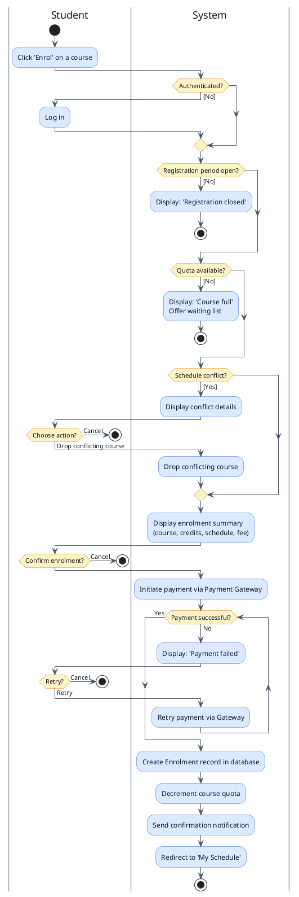
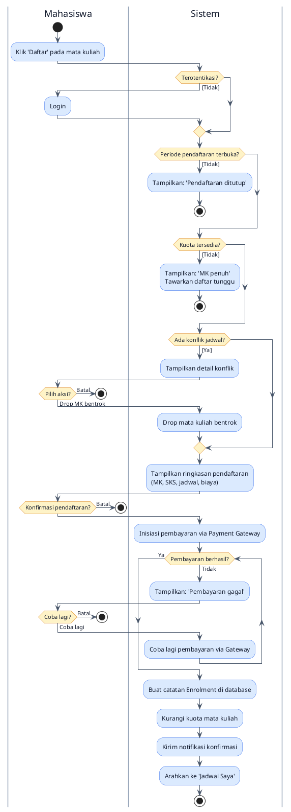

<section lang="en">

## 1. What is an Activity Diagram?

An **Activity Diagram** is a behaviour diagram that models the flow of control from one activity to another. It captures the dynamic aspects of a system by showing the sequence of actions, decisions, and parallel threads that make up a business process or a system workflow.

Think of an activity diagram as a **flowchart on steroids**. It shares the familiar diamond (decision) and rectangle (action) shapes with flowcharts, but adds UML-specific concepts like **swimlanes** (to show who performs each action), **fork/join** nodes (to show parallel execution), and **object flows** (to show data moving between actions).

### Key Elements of an Activity Diagram

| Element | Notation | Purpose |
|---|---|---|
| **Initial Node** | Filled circle | The starting point of the workflow |
| **Action** | Rounded rectangle | A single, atomic step the system or actor performs |
| **Decision Node** | Diamond | A branch point: one input, multiple guarded outputs |
| **Merge Node** | Diamond | Combines multiple incoming flows into one outgoing flow |
| **Fork Node** | Thick horizontal bar | Splits one flow into multiple parallel (concurrent) flows |
| **Join Node** | Thick horizontal bar | Synchronises multiple parallel flows into a single flow |
| **Activity Final Node** | Filled circle with border | The end of the workflow |
| **Swimlane** | Vertical or horizontal partition | Groups actions by the responsible actor or system component |

</section>

<section lang="id">

## 1. Apa Itu Activity Diagram?

**Activity Diagram** adalah diagram perilaku yang memodelkan aliran kontrol dari satu aktivitas ke aktivitas lainnya. Diagram ini menangkap aspek dinamis dari sebuah sistem dengan menunjukkan urutan aksi, keputusan, dan *thread* paralel yang membentuk proses bisnis atau alur kerja sistem.

Anggaplah activity diagram sebagai **flowchart dengan kekuatan tambahan**. Diagram ini berbagi bentuk *diamond* (keputusan) dan persegi panjang (aksi) yang sudah dikenal dari *flowchart*, tetapi menambahkan konsep spesifik UML seperti **swimlanes** (untuk menunjukkan siapa yang melakukan setiap aksi), node **fork/join** (untuk menunjukkan eksekusi paralel), dan **object flow** (untuk menunjukkan data yang bergerak antar aksi).

### Elemen Kunci Activity Diagram

| Elemen | Notasi | Tujuan |
|---|---|---|
| **Initial Node** | Lingkaran terisi | Titik awal alur kerja |
| **Action** | Persegi panjang melengkung | Satu langkah atomik yang dilakukan oleh sistem atau aktor |
| **Decision Node** | Diamond | Titik percabangan: satu input, beberapa output bersyarat |
| **Merge Node** | Diamond | Menggabungkan beberapa aliran masuk menjadi satu aliran keluar |
| **Fork Node** | Garis horizontal tebal | Memisahkan satu aliran menjadi beberapa aliran paralel (konkuren) |
| **Join Node** | Garis horizontal tebal | Menyinkronkan beberapa aliran paralel menjadi satu aliran |
| **Activity Final Node** | Lingkaran terisi dengan batas | Akhir alur kerja |
| **Swimlane** | Partisi vertikal atau horizontal | Mengelompokkan aksi berdasarkan aktor atau komponen sistem yang bertanggung jawab |

</section>

---

<section lang="en">

## 2. Why Use Activity Diagrams?

### What is it?
Activity diagrams visually represent the step-by-step workflow of a business process or a system operation. They answer the question: *"What happens, in what order, and who does it?"*

### Why does it matter?
- **Business process clarity.** Non-technical stakeholders can read activity diagrams. They validate that the proposed workflow matches the real-world process.
- **Uncover missing logic.** Drawing an activity diagram forces you to ask: *"What happens if the payment fails?"* or *"What if the course is full?"*: questions that are easy to overlook in text.
- **Developer handoff.** An activity diagram is a precise specification that a developer can translate directly into controller logic, middleware, and conditional checks.
- **Parallelism visualisation.** Fork and join nodes reveal opportunities for concurrent processing (e.g., sending an email and updating a dashboard in parallel after enrolment).

### When do you use it?
Create an activity diagram during the **analysis phase**, right after the use case scenario is written. The scenario provides the steps; the activity diagram provides the visual flow.

### Where does it fit?
Activity diagrams appear in technical design documents, sprint tickets, and architecture decision records. They are particularly useful when a workflow involves multiple actors or system components.

### How do you create one?
1. Identify the starting point (initial node) and the ending point (final node).
2. Map each step from the use case scenario to an action node.
3. Identify decision points (where the flow can branch) and their guard conditions.
4. Assign each action to a swimlane based on who performs it: the actor or the system.
5. Connect everything with control flow arrows.

</section>

<section lang="id">

## 2. Mengapa Menggunakan Activity Diagram?

### Apa itu?
Activity diagram secara visual merepresentasikan alur kerja langkah demi langkah dari proses bisnis atau operasi sistem. Diagram ini menjawab pertanyaan: *"Apa yang terjadi, dalam urutan apa, dan siapa yang melakukannya?"*

### Mengapa penting?
- **Kejelasan proses bisnis.** *Stakeholder* nonteknis dapat membaca activity diagram. Mereka memvalidasi bahwa alur kerja yang diusulkan sesuai dengan proses dunia nyata.
- **Mengungkap logika yang hilang.** Menggambar activity diagram memaksa Anda bertanya: *"Apa yang terjadi jika pembayaran gagal?"* atau *"Bagaimana jika mata kuliah penuh?"*: pertanyaan yang mudah terlewat dalam teks.
- **Serah terima ke developer.** Activity diagram adalah spesifikasi yang tepat yang dapat diterjemahkan oleh *developer* langsung ke logika *controller*, *middleware*, dan pengecekan kondisional.
- **Visualisasi paralelisme.** Node fork dan join mengungkapkan peluang untuk pemrosesan konkuren (misalnya, mengirim email dan memperbarui *dashboard* secara paralel setelah pendaftaran).

### Kapan digunakan?
Buat activity diagram selama **fase analisis**, tepat setelah use case scenario ditulis. Skenario menyediakan langkah-langkah; activity diagram menyediakan aliran visual.

### Di mana tempatnya?
Activity diagram muncul di dokumen desain teknis, tiket *sprint*, dan catatan keputusan arsitektur. Diagram ini sangat berguna ketika alur kerja melibatkan beberapa aktor atau komponen sistem.

### Bagaimana membuatnya?
1. Identifikasi titik awal (initial node) dan titik akhir (final node).
2. Petakan setiap langkah dari use case scenario ke action node.
3. Identifikasi titik keputusan (di mana aliran dapat bercabang) dan guard condition-nya.
4. Tetapkan setiap aksi ke swimlane berdasarkan siapa yang melakukannya: aktor atau sistem.
5. Hubungkan semuanya dengan panah aliran kontrol.

</section>

---

<section lang="en">

## 3. From Use Case Scenario to Activity Diagram

Recall the **Enrol in Course** use case scenario from Part 2. Let us trace its 13 steps and alternative flows to build the activity diagram.

The main flow:
1. Student clicks "Enrol" on a course
2. System checks authentication
3. System verifies registration period
4. System checks course quota
5. System checks schedule conflicts
6. System displays enrolment summary
7. Student confirms enrolment
8–9. Payment is processed via Payment Gateway
10–11. System creates enrolment and updates quota
12. System sends confirmation
13. Student sees updated schedule

The alternative flows:
- **A:** Registration period closed → show message, return to catalogue
- **B:** Course full → offer waiting list
- **C:** Schedule conflict → show conflict, allow cancel
- **D:** Payment failed → allow retry or cancel

We can now map this text into a visual diagram.

</section>

<section lang="id">

## 3. Dari Use Case Scenario ke Activity Diagram

Ingat skenario use case **Daftar Mata Kuliah** dari Bagian 2. Mari kita telusuri 13 langkah dan alur alternatifnya untuk membangun activity diagram.

Alur utama:
1. Mahasiswa mengklik "Daftar" pada mata kuliah
2. Sistem memeriksa otentikasi
3. Sistem memverifikasi periode pendaftaran
4. Sistem memeriksa kuota mata kuliah
5. Sistem memeriksa konflik jadwal
6. Sistem menampilkan ringkasan pendaftaran
7. Mahasiswa mengonfirmasi pendaftaran
8–9. Pembayaran diproses melalui Payment Gateway
10–11. Sistem membuat pendaftaran dan memperbarui kuota
12. Sistem mengirim konfirmasi
13. Mahasiswa melihat jadwal yang diperbarui

Alur alternatif:
- **A:** Periode pendaftaran tertutup → tampilkan pesan, kembali ke katalog
- **B:** Mata kuliah penuh → tawarkan daftar tunggu
- **C:** Konflik jadwal → tampilkan konflik, izinkan batal
- **D:** Pembayaran gagal → izinkan coba lagi atau batal

Kita sekarang dapat memetakan teks ini ke dalam diagram visual.

</section>

---

<section lang="en">

## 4. Activity Diagram: Enrol in Course

The diagram below models the complete enrolment workflow using two swimlanes (**Student**, left lane, and **System**, right lane) so responsibility for each action is visually clear. Decisions are represented by diamonds, and each branch is labelled with a guard condition in square brackets.

### Reading the Diagram

Follow the arrows from the Start circle. At each diamond, trace one branch based on the guard condition. The diagram shows that:

- **Three validation gates** (authentication, registration period, quota) must be passed before the student sees the summary.
- **Schedule conflict** has a recovery path: the student can drop the conflicting course instead of abandoning enrolment entirely.
- **Payment failure** creates a retry loop: the student can attempt payment multiple times without re-entering all the data.
- **Only after successful payment** does the system commit the enrolment to the database, decrement the quota, and send confirmation. This is a **transactional boundary**: nothing is written until payment succeeds.

</section>

<section lang="id">

## 4. Activity Diagram: Daftar Mata Kuliah

Diagram di bawah memodelkan alur kerja pendaftaran lengkap menggunakan dua swimlane (**Mahasiswa**, *lane* kiri, dan **Sistem**, *lane* kanan) sehingga tanggung jawab setiap aksi terlihat jelas secara visual. Keputusan direpresentasikan oleh *diamond*, dan setiap cabang diberi label dengan guard condition dalam tanda kurung siku.

### Membaca Diagram

Ikuti panah dari lingkaran Mulai. Di setiap *diamond*, telusuri satu cabang berdasarkan guard condition. Diagram menunjukkan bahwa:

- **Tiga gerbang validasi** (otentikasi, periode pendaftaran, kuota) harus dilewati sebelum mahasiswa melihat ringkasan.
- **Konflik jadwal** memiliki jalur pemulihan: mahasiswa dapat *drop* mata kuliah yang bentrok daripada meninggalkan pendaftaran sepenuhnya.
- **Kegagalan pembayaran** menciptakan mekanisme coba lagi (*retry loop*): mahasiswa dapat mencoba pembayaran beberapa kali tanpa memasukkan ulang semua data.
- **Hanya setelah pembayaran berhasil,** sistem melakukan *commit* pendaftaran ke *database*, mengurangi kuota, dan mengirim konfirmasi. Ini adalah **batas transaksional**: tidak ada yang ditulis sampai pembayaran berhasil.

</section>

---

<section lang="en">

## 5. Connecting the Dots: Activity Diagram → Code

The activity diagram directly informs the controller structure in our future Laravel implementation (Part 5). Each decision node becomes an `if` or validation check; each action node becomes a method call or service invocation.

Here is how the decision nodes translate to code logic:

| Diagram Element | Laravel Implementation |
|---|---|
| **Is student authenticated?** | `auth()->check()` or Laravel middleware `auth` |
| **Is registration period open?** | `$course->registration_open` check in a custom validation rule or form request |
| **Is course quota available?** | `$course->available_seats > 0`: checked before the enrolment transaction |
| **Any schedule conflict?** | Query the `enrolments` table for overlapping time slots: `where('student_id', $studentId)->whereHas('course', fn($q) => $q->where('day', $newCourseDay)->where('time_slot', $newCourseTimeSlot))` |
| **Payment successful?** | Check the response from the payment gateway integration (e.g., Midtrans, Xendit) before committing the DB transaction |

The activity diagram thus serves as a **visual checklist** for the developer: every diamond must have a corresponding conditional check in the code, and every path must have a test case.

</section>

<section lang="id">

## 5. Menghubungkan Titik-Titik: Activity Diagram → Kode

Activity diagram secara langsung menginformasikan struktur *controller* dalam implementasi Laravel kita nanti (Bagian 5). Setiap decision node menjadi `if` atau pengecekan validasi; setiap action node menjadi pemanggilan *method* atau *service invocation*.

Berikut adalah cara decision node diterjemahkan ke logika kode:

| Elemen Diagram | Implementasi Laravel |
|---|---|
| **Apakah mahasiswa terotentikasi?** | `auth()->check()` atau *middleware* Laravel `auth` |
| **Apakah periode pendaftaran terbuka?** | `$course->registration_open` dicek dalam *custom validation rule* atau *form request* |
| **Apakah kuota tersedia?** | `$course->available_seats > 0`: dicek sebelum transaksi pendaftaran |
| **Ada konflik jadwal?** | *Query* tabel `enrolments` untuk slot waktu yang tumpang tindih: `where('student_id', $studentId)->whereHas('course', fn($q) => $q->where('day', $newCourseDay)->where('time_slot', $newCourseTimeSlot))` |
| **Pembayaran berhasil?** | Periksa respons dari integrasi *payment gateway* (misalnya, Midtrans, Xendit) sebelum *commit* transaksi DB |

Dengan demikian, activity diagram berfungsi sebagai **checklist visual** untuk *developer*: setiap *diamond* harus memiliki pengecekan kondisional yang sesuai dalam kode, dan setiap jalur harus memiliki *test case*.

</section>

---

<section lang="en">

## 6. Activity Diagram Best Practices

### Keep Swimlanes Meaningful
Use swimlanes to separate actors and system components that have distinct responsibilities. Avoid creating a swimlane for every tiny subsystem: two or three lanes is usually optimal. For "Enrol in Course," two lanes (Student and System) suffice.

### Label Guard Conditions Clearly
Every decision branch must have a guard condition in square brackets: `[Yes]`, `[No]`, `[Quota available]`, `[Payment declined]`. Without labels, the reader must guess what each branch means.

### One Start, One or More Ends
Every activity diagram has exactly one initial node. It can have multiple final nodes: one for each alternative path that terminates the workflow. In our diagram, a `stop` node appears at every early-exit path (registration closed, course full, schedule conflict cancelled, enrolment cancelled, payment retry cancelled), plus a final `stop` at successful enrolment.

### Avoid Overlapping Arrows
In complex diagrams, arrows can cross each other and become unreadable. Use PlantUML's `top to bottom direction` (top-down) or `left to right direction` (left-right) layout directives to minimise crossings. If a diagram becomes too dense, consider splitting it into sub-diagrams.

### Object Nodes (Optional)
For data-intensive workflows, you can add **object nodes** (rectangles) to show what data is passed between actions. For example, an `EnrolmentData` object flows from the summary step to the payment step. We omitted object nodes for clarity, but they are valuable when the data structure matters.

</section>

<section lang="id">

## 6. Praktik Terbaik Activity Diagram

### Jaga Swimlanes Tetap Bermakna
Gunakan swimlanes untuk memisahkan aktor dan komponen sistem yang memiliki tanggung jawab berbeda. Hindari membuat swimlane untuk setiap subsistem kecil: dua atau tiga *lane* biasanya optimal. Untuk "Daftar Mata Kuliah", dua *lane* (Mahasiswa dan Sistem) sudah cukup.

### Beri Label Guard Condition dengan Jelas
Setiap cabang keputusan harus memiliki guard condition dalam tanda kurung siku: `[Ya]`, `[Tidak]`, `[Kuota tersedia]`, `[Pembayaran ditolak]`. Tanpa label, pembaca harus menebak arti setiap cabang.

### Satu Mulai, Satu atau Lebih Selesai
Setiap activity diagram memiliki tepat satu initial node. Diagram dapat memiliki beberapa final node: satu untuk setiap jalur alternatif yang mengakhiri alur kerja. Dalam diagram kita, node `stop` muncul di setiap jalur keluar dini (pendaftaran ditutup, kuota penuh, konflik jadwal dibatalkan, pendaftaran dibatalkan, pembayaran dibatalkan saat coba lagi), ditambah satu `stop` terakhir di pendaftaran berhasil.

### Hindari Panah Tumpang Tindih
Dalam diagram yang kompleks, panah dapat saling bersilangan dan menjadi tidak terbaca. Gunakan direktif layout PlantUML `top to bottom direction` (atas-bawah) atau `left to right direction` (kiri-kanan) untuk meminimalkan persilangan. Jika diagram menjadi terlalu padat, pertimbangkan untuk membaginya menjadi sub-diagram.

### Object Node (Opsional)
Untuk alur kerja yang padat data, Anda dapat menambahkan **object node** (persegi panjang) untuk menunjukkan data apa yang dilewatkan antar aksi. Misalnya, objek `EnrolmentData` mengalir dari langkah ringkasan ke langkah pembayaran. Kami menghilangkan object node demi kejelasan, tetapi object node tetap berharga ketika struktur data penting.

</section>

---

<section lang="en">

## 7. From Activity to Sequence

The activity diagram shows *what* happens and *in what order*. But it does not show *who talks to whom* at the object level. For that, we need a **Sequence Diagram**.

In Part 4, we will zoom into the payment and enrolment section of the activity diagram (steps 8–12 of the main flow) and show the precise messages exchanged between:
- The Student (via the browser)
- The `EnrolmentController`
- The `PaymentGateway` service
- The `Enrolment` and `Course` models
- The database

The sequence diagram reveals the exact method calls, return values, and lifeline durations that the activity diagram abstracts away.

</section>

<section lang="id">

## 7. Dari Activity ke Sequence

Activity diagram menunjukkan *apa* yang terjadi dan *dalam urutan apa*. Tetapi diagram ini tidak menunjukkan *siapa berbicara dengan siapa* di level objek. Untuk itu, kita membutuhkan **Sequence Diagram**.

Di Bagian 4, kita akan memperbesar bagian pembayaran dan pendaftaran dari activity diagram (langkah 8–12 dari alur utama) dan menunjukkan pesan-pesan tepat yang dipertukarkan antara:
- Mahasiswa (melalui browser)
- `EnrolmentController`
- *Service* `PaymentGateway`
- *Model* `Enrolment` dan `Course`
- *Database*

Sequence diagram mengungkapkan pemanggilan *method* yang tepat, nilai balik, dan durasi lifeline yang diabstraksikan oleh activity diagram.

</section>
