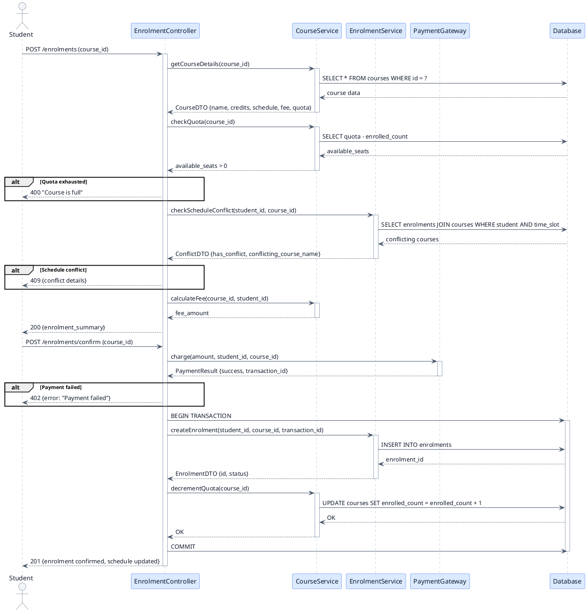
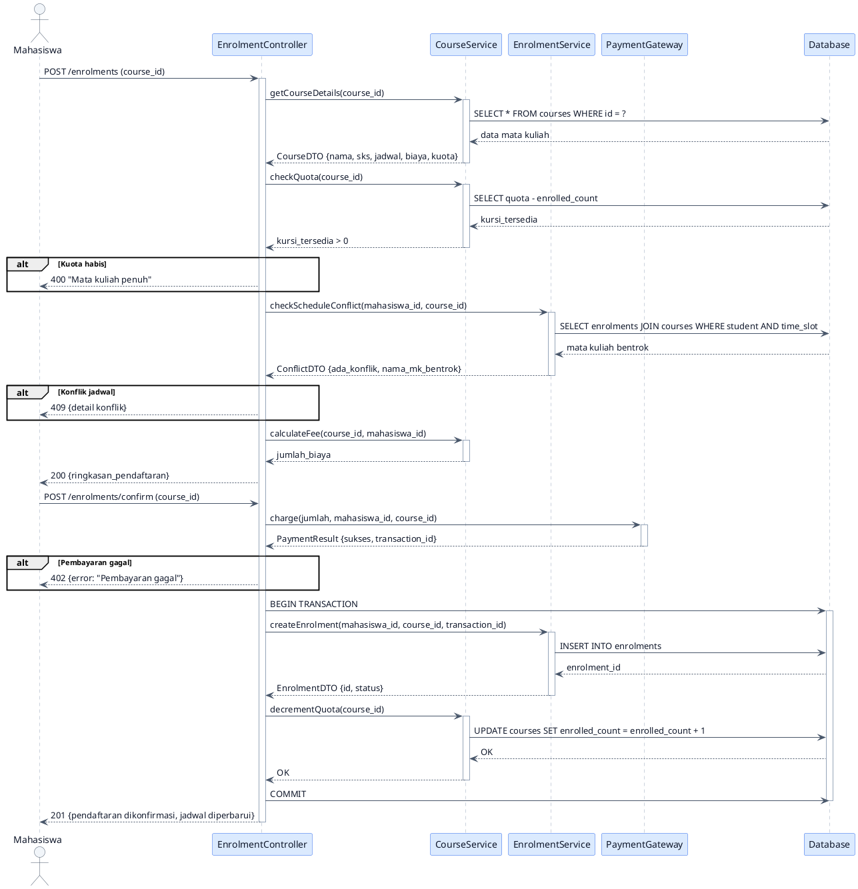

<nav aria-label="Series navigation" class="mb-8 p-4 bg-neutral-50 dark:bg-gray-800 rounded-lg border border-neutral-200 dark:border-gray-700">
  

    UML Mini Series — 5 Parts
    Seri Mini UML — 5 Bagian
  

  <ol class="list-decimal list-inside space-y-1 text-sm">
    <li><a href="/blog/uml-series-part-1-introduction-use-case">Part 1: Introduction to UML & Use Case Diagram</a></li>
    <li><a href="/blog/uml-series-part-2-use-case-scenario">Part 2: Use Case Scenario</a></li>
    <li><a href="/blog/uml-series-part-3-activity-diagram">Part 3: Activity Diagram</a></li>
    <li class="font-bold">
      Part 4: Sequence Diagram ← You are here
      Bagian 4: Sequence Diagram ← Anda di sini
    </li>
    <li><a href="/blog/uml-series-part-5-class-diagram-laravel">Part 5: Class Diagram & Laravel Realization</a></li>
  </ol>
</nav>

<section lang="en">

## 1. What is a Sequence Diagram?

A **Sequence Diagram** is a behaviour diagram that models the interactions between objects over time. It shows **who calls whom, in what order, and with what data** — all arranged on a timeline that reads from top to bottom.

While the Activity Diagram (Part 3) shows the business process flow, the Sequence Diagram shows the **technical object-level interactions** that implement that flow. Together, they answer two different questions:

| Diagram | Question Answered |
|---|---|
| **Activity Diagram** | What happens in the business workflow, and who does it? |
| **Sequence Diagram** | Which objects exchange what messages, and in what sequence? |

### Key Elements of a Sequence Diagram

| Element | Notation | Purpose |
|---|---|---|
| **Lifeline** | Vertical dashed line from an object box | Represents the lifetime of an object during the interaction |
| **Object** | Rectangle at the top of a lifeline | A participant in the interaction (actor, controller, model, service, database) |
| **Synchronous Message** | Solid arrow with filled head | A call that waits for a response (e.g., method call) |
| **Return Message** | Dashed arrow with open head | The response to a synchronous call |
| **Activation Box** | Thin rectangle on a lifeline | Shows the period during which an object is performing an operation |
| **Alt Fragment** | Box labelled "alt" with dashed dividers | Conditional logic — "if/else" (only one operand executes) |
| **Loop Fragment** | Box labelled "loop" | Repeating interaction — "while" or "for each" |

</section>

<section lang="id">

## 1. Apa Itu Sequence Diagram?

**Sequence Diagram** adalah diagram perilaku yang memodelkan interaksi antar objek sepanjang waktu. Diagram ini menunjukkan **siapa memanggil siapa, dalam urutan apa, dan dengan data apa** — semuanya disusun pada timeline yang dibaca dari atas ke bawah.

Sementara Activity Diagram (Bagian 3) menunjukkan alur proses bisnis, Sequence Diagram menunjukkan **interaksi teknis level objek** yang mengimplementasikan alur tersebut. Bersama-sama, keduanya menjawab dua pertanyaan berbeda:

| Diagram | Pertanyaan yang Dijawab |
|---|---|
| **Activity Diagram** | Apa yang terjadi dalam alur kerja bisnis, dan siapa yang melakukannya? |
| **Sequence Diagram** | Objek mana yang bertukar pesan apa, dan dalam urutan apa? |

### Elemen Kunci Sequence Diagram

| Elemen | Notasi | Tujuan |
|---|---|---|
| **Lifeline** | Garis putus-putus vertikal dari kotak objek | Merepresentasikan masa hidup objek selama interaksi |
| **Object** | Persegi panjang di atas lifeline | Partisipan dalam interaksi (aktor, controller, model, service, database) |
| **Synchronous Message** | Panah solid dengan ujung terisi | Panggilan yang menunggu respons (misalnya, pemanggilan method) |
| **Return Message** | Panah putus-putus dengan ujung terbuka | Respons terhadap panggilan sinkron |
| **Activation Box** | Persegi panjang tipis pada lifeline | Menunjukkan periode di mana objek sedang melakukan operasi |
| **Alt Fragment** | Kotak berlabel "alt" dengan pembagi putus-putus | Logika kondisional — "if/else" (hanya satu operan yang dieksekusi) |
| **Loop Fragment** | Kotak berlabel "loop" | Interaksi berulang — "while" atau "for each" |

</section>

---

<section lang="en">

## 2. Why Use Sequence Diagrams? (4W+H)

### What
A sequence diagram captures the dynamic interactions between objects in a specific scenario. It focuses on **time-ordered messages**: method calls, HTTP requests, database queries, and their responses.

### Why
- **Design precision.** A sequence diagram forces you to name every method, parameter, and return type before coding. You cannot hand-wave "then the system processes the payment" — you must specify `PaymentGateway::charge($amount, $studentId, $courseId): PaymentResult`.
- **Discover hidden dependencies.** Drawing lifelines reveals when an object depends on another object it should not know about (violating the Law of Demeter or layered architecture).
- **Concurrency visualisation.** Activation boxes show which operations happen in parallel and which block, making it easy to spot deadlock risks.
- **Code generation.** Many IDEs can generate skeleton code from sequence diagrams. Even without tooling, a sequence diagram is an exact specification for what methods to implement.

### When
Create a sequence diagram during the **design phase**, after the activity diagram and use case scenario are complete. It is the last behavioural diagram before implementation.

### Where
Sequence diagrams live in technical design documents and API specifications. They are especially useful for complex operations involving multiple services or components.

### How
1. Identify the objects (participants) involved in the scenario.
2. Place them as lifelines at the top of the diagram, arranged left to right.
3. Trace the main flow from the use case scenario, converting each step into a message between objects.
4. Add activation boxes to show when each object is busy.
5. Add `alt` fragments for conditional branches and `loop` fragments for repeated interactions.
6. Annotate return messages where the response data matters.

</section>

<section lang="id">

## 2. Mengapa Menggunakan Sequence Diagram? (4W+H)

### What (Apa)
Sequence diagram menangkap interaksi dinamis antar objek dalam skenario tertentu. Diagram ini berfokus pada **pesan terurut waktu**: pemanggilan method, HTTP request, query database, dan responsnya.

### Why (Mengapa)
- **Presisi desain.** Sequence diagram memaksa Anda menamai setiap method, parameter, dan tipe return sebelum coding. Anda tidak bisa mengabaikan "lalu sistem memproses pembayaran" — Anda harus menspesifikasikan `PaymentGateway::charge($amount, $studentId, $courseId): PaymentResult`.
- **Temukan dependensi tersembunyi.** Menggambar lifelines mengungkapkan ketika sebuah objek bergantung pada objek lain yang seharusnya tidak diketahuinya (melanggar Law of Demeter atau arsitektur berlapis).
- **Visualisasi konkurensi.** Activation box menunjukkan operasi mana yang terjadi secara paralel dan mana yang memblokir, memudahkan untuk menemukan risiko deadlock.
- **Code generation.** Banyak IDE dapat menghasilkan kode kerangka dari sequence diagram. Bahkan tanpa tooling, sequence diagram adalah spesifikasi tepat untuk method apa yang harus diimplementasikan.

### When (Kapan)
Buat sequence diagram selama **fase desain**, setelah activity diagram dan use case scenario selesai. Ini adalah diagram perilaku terakhir sebelum implementasi.

### Where (Di Mana)
Sequence diagram berada di dokumen desain teknis dan spesifikasi API. Diagram ini sangat berguna untuk operasi kompleks yang melibatkan beberapa layanan atau komponen.

### How (Bagaimana)
1. Identifikasi objek (partisipan) yang terlibat dalam skenario.
2. Tempatkan mereka sebagai lifelines di bagian atas diagram, disusun dari kiri ke kanan.
3. Telusuri alur utama dari use case scenario, mengonversi setiap langkah menjadi pesan antar objek.
4. Tambahkan activation box untuk menunjukkan kapan setiap objek sibuk.
5. Tambahkan fragmen `alt` untuk cabang kondisional dan fragmen `loop` untuk interaksi berulang.
6. Beri anotasi return message di mana data respons penting.

</section>

---

<section lang="en">

## 3. Participants in the Enrolment Sequence

Recall the **Enrol in Course** use case from Part 2. For the sequence diagram, we focus on steps 6–13 (from enrolment summary to confirmation) because this is where the most interesting object interactions occur.

Here are the participants (lifelines) in our scenario:

| Participant | Type | Role in This Scenario |
|---|---|---|
| **Student** | Actor | Initiates the enrolment via the web browser |
| **EnrolmentController** | Controller | Orchestrates the enrolment workflow — validates input, coordinates services, returns responses |
| **CourseService** | Service | Business logic for course-related operations: checking quota, fetching schedule, computing fees |
| **EnrolmentService** | Service | Business logic for enrolment: checking conflicts, creating enrolment records, updating counts |
| **PaymentGateway** | External Service | Processes the financial transaction — our system does not handle money directly |
| **Database** | Persistence | Stores course, enrolment, and payment records |

### Why These Participants?

In a Laravel application (Part 5), these map directly to:
- **EnrolmentController** → `App\Http\Controllers\EnrolmentController`
- **CourseService** → `App\Services\CourseService`
- **EnrolmentService** → `App\Services\EnrolmentService`
- **PaymentGateway** → `App\Services\PaymentGateway` (or a third-party SDK like Midtrans)
- **Database** → Eloquent models backed by MySQL/PostgreSQL

The separation of `CourseService` and `EnrolmentService` follows the Single Responsibility Principle: course logic (quota, schedule) and enrolment logic (conflicts, registration) change for different reasons.

</section>

<section lang="id">

## 3. Partisipan dalam Sequence Enrolment

Ingat use case **Daftar Mata Kuliah** dari Bagian 2. Untuk sequence diagram, kita fokus pada langkah 6–13 (dari ringkasan pendaftaran hingga konfirmasi) karena di sinilah interaksi objek yang paling menarik terjadi.

Berikut adalah partisipan (lifelines) dalam skenario kita:

| Partisipan | Tipe | Peran dalam Skenario Ini |
|---|---|---|
| **Student (Mahasiswa)** | Aktor | Memulai pendaftaran melalui browser web |
| **EnrolmentController** | Controller | Mengorkestrasi alur kerja pendaftaran — memvalidasi input, mengoordinasikan service, mengembalikan respons |
| **CourseService** | Service | Logika bisnis untuk operasi terkait mata kuliah: memeriksa kuota, mengambil jadwal, menghitung biaya |
| **EnrolmentService** | Service | Logika bisnis untuk pendaftaran: memeriksa konflik, membuat catatan pendaftaran, memperbarui jumlah |
| **PaymentGateway** | Service Eksternal | Memproses transaksi keuangan — sistem kita tidak menangani uang secara langsung |
| **Database** | Persistensi | Menyimpan catatan mata kuliah, pendaftaran, dan pembayaran |

### Mengapa Partisipan Ini?

Dalam aplikasi Laravel (Bagian 5), ini dipetakan langsung ke:
- **EnrolmentController** → `App\Http\Controllers\EnrolmentController`
- **CourseService** → `App\Services\CourseService`
- **EnrolmentService** → `App\Services\EnrolmentService`
- **PaymentGateway** → `App\Services\PaymentGateway` (atau SDK pihak ketiga seperti Midtrans)
- **Database** → Model Eloquent yang didukung MySQL/PostgreSQL

Pemisahan `CourseService` dan `EnrolmentService` mengikuti Single Responsibility Principle: logika mata kuliah (kuota, jadwal) dan logika pendaftaran (konflik, registrasi) berubah untuk alasan yang berbeda.

</section>

---

<section lang="en">

## 4. Sequence Diagram: Enrol in Course (Payment & Creation Flow)

### Reading the Sequence Diagram

Follow the arrows from top to bottom. Each arrow is a message — a method call or an HTTP request. The activation boxes (thin rectangles on the lifelines) show when each object is actively processing.

Key observations:

1. **Sequential validation.** The controller checks quota and schedule conflicts *before* asking for payment. This prevents charging the student for a course they cannot join.

2. **External system boundary.** The `PaymentGateway` is a separate lifeline — the controller calls it, waits for a response, and only proceeds on success. This is a **synchronous boundary** with a timeout risk (which we handle in the implementation with try/catch and configurable timeouts).

3. **Transactional boundary.** The `BEGIN TRANSACTION` → `INSERT` → `UPDATE` → `COMMIT` block ensures that the enrolment record and quota decrement happen atomically. If the quota update fails, the enrolment insert is rolled back.

4. **No direct model access from controller.** The controller never talks to the database directly. It delegates to `CourseService` and `EnrolmentService`, which encapsulate the queries. This is the **Service Layer pattern** — the controller orchestrates, services execute.

</section>

<section lang="id">

## 4. Sequence Diagram: Daftar Mata Kuliah (Alur Pembayaran & Pembuatan)

### Membaca Sequence Diagram

Ikuti panah dari atas ke bawah. Setiap panah adalah pesan — pemanggilan method atau HTTP request. Activation box (persegi panjang tipis pada lifelines) menunjukkan kapan setiap objek sedang aktif memproses.

Observasi kunci:

1. **Validasi berurutan.** Controller memeriksa kuota dan konflik jadwal *sebelum* meminta pembayaran. Ini mencegah menagih mahasiswa untuk mata kuliah yang tidak bisa mereka ikuti.

2. **Batas sistem eksternal.** `PaymentGateway` adalah lifeline terpisah — controller memanggilnya, menunggu respons, dan hanya melanjutkan jika berhasil. Ini adalah **synchronous boundary** dengan risiko timeout (yang kita tangani dalam implementasi dengan try/catch dan timeout yang dapat dikonfigurasi).

3. **Batas transaksional.** Blok `BEGIN TRANSACTION` → `INSERT` → `UPDATE` → `COMMIT` memastikan bahwa catatan pendaftaran dan pengurangan kuota terjadi secara atomik. Jika pembaruan kuota gagal, insert pendaftaran di-rollback.

4. **Tidak ada akses model langsung dari controller.** Controller tidak pernah berbicara langsung ke database. Ia mendelegasikan ke `CourseService` dan `EnrolmentService`, yang mengenkapsulasi query. Ini adalah pola **Service Layer** — controller mengorkestrasi, service mengeksekusi.

</section>

---

<section lang="en">

## 5. Sequence Diagram vs Activity Diagram: When to Use Which

Now that we have both diagrams for the same workflow, let us compare them:

| Aspect | Activity Diagram | Sequence Diagram |
|---|---|---|
| **Focus** | Business process flow | Object-level message exchange |
| **Time representation** | Implicit (top to bottom) | Explicit (lifelines, activation boxes) |
| **Parallelism** | Fork/join nodes | Par fragments |
| **Conditional logic** | Decision/merge nodes | Alt, opt, loop fragments |
| **Actors** | Swimlanes partition by responsibility | Lifelines for every interacting object |
| **Best for** | Stakeholder validation, process documentation | Developer specification, API design |
| **Granularity** | Coarse — "System validates" | Fine — `checkQuota(course_id): bool` |

**Rule of thumb:** If you are explaining a workflow to a product manager, use an activity diagram. If you are explaining the same workflow to a developer who will implement it, use a sequence diagram. In a complete UML model, you create both — the activity diagram for the business view, the sequence diagram for the technical view.

</section>

<section lang="id">

## 5. Sequence Diagram vs Activity Diagram: Kapan Menggunakan yang Mana

Sekarang kita memiliki kedua diagram untuk alur kerja yang sama, mari kita bandingkan:

| Aspek | Activity Diagram | Sequence Diagram |
|---|---|---|
| **Fokus** | Alur proses bisnis | Pertukaran pesan level objek |
| **Representasi waktu** | Implisit (atas ke bawah) | Eksplisit (lifelines, activation box) |
| **Paralelisme** | Node fork/join | Fragmen par |
| **Logika kondisional** | Node decision/merge | Fragmen alt, opt, loop |
| **Aktor** | Swimlanes mempartisi berdasarkan tanggung jawab | Lifelines untuk setiap objek yang berinteraksi |
| **Terbaik untuk** | Validasi stakeholder, dokumentasi proses | Spesifikasi developer, desain API |
| **Granularitas** | Kasar — "Sistem memvalidasi" | Halus — `checkQuota(course_id): bool` |

**Aturan praktis:** Jika Anda menjelaskan alur kerja kepada product manager, gunakan activity diagram. Jika Anda menjelaskan alur kerja yang sama kepada developer yang akan mengimplementasikannya, gunakan sequence diagram. Dalam model UML yang lengkap, Anda membuat keduanya — activity diagram untuk tampilan bisnis, sequence diagram untuk tampilan teknis.

</section>

---

<section lang="en">

## 6. Sequence Diagram Best Practices

### Keep Messages at a Consistent Level of Abstraction
Mix high-level (`processEnrolment`) and low-level (`SELECT * FROM courses`) messages in the same diagram cautiously. Most sequence diagrams work best at a single level — either the HTTP request/response level or the method call level, not both.

### Return Messages Matter When Data Flows
If a return message carries data (e.g., `PaymentResult {success, transaction_id}`), include it. If it only signals completion (`OK`), you can omit it for brevity — but always include it when the data is used in subsequent messages.

### Use Fragments for Conditional Logic
Do not draw three separate diagrams for the success path, the quota-full path, and the payment-failure path. Use `alt` fragments to keep all paths in one diagram. This is what makes the sequence diagram a complete specification.

### Number Your Messages (Optional)
In formal specifications, messages are numbered (`1. getCourseDetails`, `2. checkQuota`, etc.). This helps when referencing specific interactions in documentation or code comments. Mermaid handles this automatically in some configurations.

### Avoid God Lifelines
If one lifeline (usually the controller) receives 15+ messages, consider splitting the diagram into smaller interaction diagrams or delegating responsibilities. A controller that orchestrates too many services might benefit from a **facade** or **orchestrator** service.

</section>

<section lang="id">

## 6. Praktik Terbaik Sequence Diagram

### Jaga Pesan pada Tingkat Abstraksi yang Konsisten
Campur pesan tingkat tinggi (`processEnrolment`) dan tingkat rendah (`SELECT * FROM courses`) dalam diagram yang sama dengan hati-hati. Sebagian besar sequence diagram bekerja paling baik pada satu tingkat — baik tingkat HTTP request/response atau tingkat pemanggilan method, bukan keduanya.

### Return Message Penting Ketika Data Mengalir
Jika return message membawa data (misalnya, `PaymentResult {sukses, transaction_id}`), sertakan. Jika hanya menandakan penyelesaian (`OK`), Anda dapat menghilangkannya untuk keringkasan — tetapi selalu sertakan ketika data digunakan dalam pesan berikutnya.

### Gunakan Fragmen untuk Logika Kondisional
Jangan menggambar tiga diagram terpisah untuk jalur sukses, jalur kuota penuh, dan jalur kegagalan pembayaran. Gunakan fragmen `alt` untuk menyimpan semua jalur dalam satu diagram. Inilah yang membuat sequence diagram menjadi spesifikasi yang lengkap.

### Beri Nomor Pesan Anda (Opsional)
Dalam spesifikasi formal, pesan diberi nomor (`1. getCourseDetails`, `2. checkQuota`, dll.). Ini membantu saat mereferensikan interaksi tertentu dalam dokumentasi atau komentar kode. Mermaid menangani ini secara otomatis dalam beberapa konfigurasi.

### Hindari God Lifeline
Jika satu lifeline (biasanya controller) menerima 15+ pesan, pertimbangkan untuk membagi diagram menjadi diagram interaksi yang lebih kecil atau mendelegasikan tanggung jawab. Controller yang mengorkestrasi terlalu banyak service mungkin mendapat manfaat dari service **facade** atau **orchestrator**.

</section>

---

<section lang="en">

## 7. From Sequence to Class Diagram

The sequence diagram has revealed the methods each object must implement, the parameters they accept, and the data they return. This is the final piece of behavioural specification before we move to **structural design**.

In Part 5, we will take all the objects from this sequence diagram — `Student`, `Course`, `Enrolment`, `Payment`, along with the supporting entities (`Lecturer`, `Admin`, `Schedule`) — and define their **attributes, relationships, and multiplicities** in a Class Diagram. Then we will implement them as Laravel Eloquent models with migrations, and show a complete controller that realises the sequence diagram flow.

</section>

<section lang="id">

## 7. Dari Sequence ke Class Diagram

Sequence diagram telah mengungkapkan method yang harus diimplementasikan setiap objek, parameter yang mereka terima, dan data yang mereka kembalikan. Ini adalah bagian terakhir dari spesifikasi perilaku sebelum kita beralih ke **desain struktural**.

Di Bagian 5, kita akan mengambil semua objek dari sequence diagram ini — `Student`, `Course`, `Enrolment`, `Payment`, bersama dengan entitas pendukung (`Lecturer`, `Admin`, `Schedule`) — dan mendefinisikan **atribut, relasi, dan multiplisitas** mereka dalam Class Diagram. Kemudian kita akan mengimplementasikannya sebagai Laravel Eloquent model dengan migrations, dan menunjukkan controller lengkap yang merealisasikan alur sequence diagram.

</section>

---

<nav aria-label="Series navigation" class="mt-8 p-4 bg-neutral-50 dark:bg-gray-800 rounded-lg border border-neutral-200 dark:border-gray-700">
  

    Continue the series:
    Lanjutkan seri:
  

  

    
      <strong>Previous:</strong> <a href="/blog/uml-series-part-3-activity-diagram">← Part 3: Activity Diagram</a>
      <strong>Sebelumnya:</strong> <a href="/blog/uml-series-part-3-activity-diagram">← Bagian 3: Activity Diagram</a>
    
    
      <strong>Next:</strong> <a href="/blog/uml-series-part-5-class-diagram-laravel">Part 5: Class Diagram & Laravel Realization →</a>
      <strong>Selanjutnya:</strong> <a href="/blog/uml-series-part-5-class-diagram-laravel">Bagian 5: Class Diagram & Laravel Realization →</a>
    
  

</nav>
