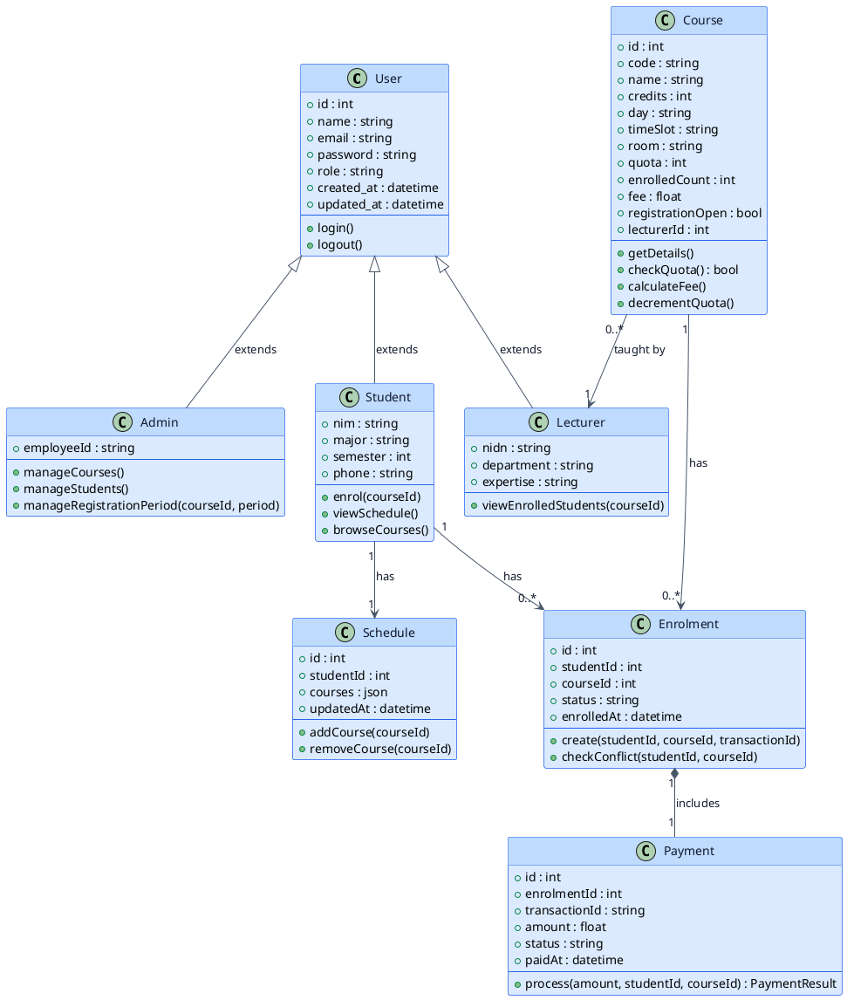

<nav aria-label="Series navigation" class="mb-8 p-4 bg-neutral-50 dark:bg-gray-800 rounded-lg border border-neutral-200 dark:border-gray-700">
  <p class="font-semibold mb-2">
    <span lang="en">UML Mini Series — 5 Parts</span>
    <span lang="id">Seri Mini UML — 5 Bagian</span>
  </p>
  <ol class="list-decimal list-inside space-y-1 text-sm">
    <li><a href="/blog/uml-series-part-1-introduction-use-case">Part 1: Introduction to UML & Use Case Diagram</a></li>
    <li><a href="/blog/uml-series-part-2-use-case-scenario">Part 2: Use Case Scenario</a></li>
    <li><a href="/blog/uml-series-part-3-activity-diagram">Part 3: Activity Diagram</a></li>
    <li><a href="/blog/uml-series-part-4-sequence-diagram">Part 4: Sequence Diagram</a></li>
    <li class="font-bold">
      <span lang="en">Part 5: Class Diagram & Laravel Realization ← You are here</span>
      <span lang="id">Bagian 5: Class Diagram & Realisasi Laravel ← Anda di sini</span>
    </li>
  </ol>
</nav>

<section lang="en">

## 1. What is a Class Diagram?

A **Class Diagram** is a structure diagram that shows the static architecture of a system. It describes the **classes** (or entities) in the system, their **attributes** (properties), **operations** (methods), and the **relationships** between them — inheritance, composition, aggregation, and associations with multiplicity constraints.

While the previous four parts focused on *behaviour* (what the system does), the class diagram focuses on *structure* (what the system is made of). It is the diagram that developers refer to most during implementation — and it maps directly to code.

### Key Elements of a Class Diagram

| Element | Notation | Meaning |
|---|---|---|
| **Class** | Rectangle with three compartments (name, attributes, operations) | A blueprint for objects. Top: class name. Middle: attributes with types. Bottom: methods with parameter and return types. |
| **Association** | Solid line between classes | A semantic relationship. "A Student enrols in a Course." |
| **Multiplicity** | Numbers at association ends (1, 0..*, 1..*) | How many instances participate. "One Student can enrol in 0 or more Courses. One Course can have 0 or more Enrolments." |
| **Aggregation** | Hollow diamond at the whole end | "Has-a" relationship where the part can exist independently. "A Course has a Schedule, but a Schedule can exist without a Course." |
| **Composition** | Filled diamond at the whole end | "Has-a" relationship where the part cannot exist without the whole. "An Enrolment contains a Payment; if the Enrolment is deleted, the Payment is deleted too." |
| **Generalisation** | Hollow triangle arrowhead pointing to the parent | Inheritance. "Student is a type of User." "Lecturer is a type of User." |

</section>

<section lang="id">

## 1. Apa Itu Class Diagram?

**Class Diagram** adalah diagram struktur yang menunjukkan arsitektur statis dari sebuah sistem. Diagram ini mendeskripsikan **kelas** (atau entitas) dalam sistem, **atribut** (properti), **operasi** (method), dan **relasi** di antaranya — inheritance, composition, aggregation, dan association dengan batasan multiplisitas.

Sementara empat bagian sebelumnya berfokus pada *perilaku* (apa yang dilakukan sistem), class diagram berfokus pada *struktur* (dari apa sistem dibuat). Ini adalah diagram yang paling sering dirujuk developer selama implementasi — dan ia dipetakan langsung ke kode.

### Elemen Kunci Class Diagram

| Elemen | Notasi | Makna |
|---|---|---|
| **Class** | Persegi panjang dengan tiga kompartemen (nama, atribut, operasi) | Blueprint untuk objek. Atas: nama kelas. Tengah: atribut dengan tipe. Bawah: method dengan tipe parameter dan return. |
| **Association** | Garis solid antar kelas | Hubungan semantik. "Seorang Student mendaftar di Course." |
| **Multiplicity** | Angka di ujung association (1, 0..*, 1..*) | Berapa banyak instance yang berpartisipasi. "Satu Student dapat mendaftar di 0 atau lebih Course. Satu Course dapat memiliki 0 atau lebih Enrolment." |
| **Aggregation** | Diamond kosong di ujung whole | Hubungan "has-a" di mana bagian dapat eksis secara independen. "Course memiliki Schedule, tetapi Schedule dapat eksis tanpa Course." |
| **Composition** | Diamond terisi di ujung whole | Hubungan "has-a" di mana bagian tidak dapat eksis tanpa whole. "Enrolment berisi Payment; jika Enrolment dihapus, Payment juga dihapus." |
| **Generalisation** | Kepala panah segitiga kosong menunjuk ke parent | Inheritance. "Student adalah tipe dari User." "Lecturer adalah tipe dari User." |

</section>

---

<section lang="en">

## 2. Why Use Class Diagrams?

### What is it?
A class diagram is the structural blueprint of the system. It defines what classes exist, what data they hold, how they relate, and what operations they expose. It answers: *"What are the building blocks, and how do they fit together?"*

### Why does it matter?
- **Code generation.** Class diagrams map nearly 1:1 to object-oriented code. Each class becomes a file; each attribute becomes a property; each association becomes a relationship (foreign key, join table, or reference).
- **Database schema design.** The class diagram's associations with multiplicities directly inform the database schema — one-to-many becomes a foreign key, many-to-many becomes a pivot table.
- **Communication.** A class diagram is the quickest way for a new developer to understand the domain model. In 30 seconds, they can see that `User` has subclasses `Student` and `Lecturer`, that `Enrolment` links `Student` to `Course`, and that `Payment` is part of `Enrolment`.
- **Refactoring safety.** When you know the intended structure, you can spot violations — a direct dependency between two classes that should not know about each other, or a missing class that should exist based on the domain.

### When do you use it?
Create a class diagram during the **design phase**, after the behavioural diagrams (use case, activity, sequence) are complete. It is the last UML diagram before coding begins — and the one that developers reference throughout implementation.

### Where does it fit?
Class diagrams appear in architecture documentation, API documentation, and database design documents. In many teams, they are also embedded in the project README.

### How do you create one?
1. Collect all nouns from the use case scenario and sequence diagram — these are candidate classes.
2. Identify attributes for each class based on the data flowing through messages in the sequence diagram.
3. Identify operations (methods) based on the messages arriving at each lifeline.
4. Define relationships and multiplicities between classes.
5. Apply inheritance where classes share common structure and behaviour.
6. Refine the diagram iteratively — the first draft is never the final model.

</section>

<section lang="id">

## 2. Mengapa Menggunakan Class Diagram?

### Apa itu?
Class diagram adalah blueprint struktural sistem. Diagram ini mendefinisikan kelas apa yang ada, data apa yang mereka simpan, bagaimana mereka berelasi, dan operasi apa yang mereka ekspos. Diagram ini menjawab: *"Apa saja blok bangunannya, dan bagaimana mereka saling cocok?"*

### Mengapa penting?
- **Code generation.** Class diagram dipetakan hampir 1:1 ke kode berorientasi objek. Setiap kelas menjadi file; setiap atribut menjadi properti; setiap association menjadi relasi (foreign key, join table, atau referensi).
- **Desain skema database.** Association class diagram dengan multiplisitas secara langsung menginformasikan skema database — one-to-many menjadi foreign key, many-to-many menjadi pivot table.
- **Komunikasi.** Class diagram adalah cara tercepat bagi developer baru untuk memahami domain model. Dalam 30 detik, mereka dapat melihat bahwa `User` memiliki subclass `Student` dan `Lecturer`, bahwa `Enrolment` menghubungkan `Student` ke `Course`, dan bahwa `Payment` adalah bagian dari `Enrolment`.
- **Keamanan refactoring.** Ketika Anda mengetahui struktur yang dimaksud, Anda dapat menemukan pelanggaran — dependensi langsung antara dua kelas yang seharusnya tidak saling mengenal, atau kelas yang hilang yang seharusnya ada berdasarkan domain.

### Kapan digunakan?
Buat class diagram selama **fase desain**, setelah diagram perilaku (use case, activity, sequence) selesai. Ini adalah diagram UML terakhir sebelum coding dimulai — dan yang dirujuk developer sepanjang implementasi.

### Di mana tempatnya?
Class diagram muncul di dokumentasi arsitektur, dokumentasi API, dan dokumen desain database. Di banyak tim, diagram ini juga disematkan di README proyek.

### Bagaimana membuatnya?
1. Kumpulkan semua kata benda dari use case scenario dan sequence diagram — ini adalah kandidat kelas.
2. Identifikasi atribut untuk setiap kelas berdasarkan data yang mengalir melalui pesan di sequence diagram.
3. Identifikasi operasi (method) berdasarkan pesan yang tiba di setiap lifeline.
4. Definisikan relasi dan multiplisitas antar kelas.
5. Terapkan inheritance di mana kelas berbagi struktur dan perilaku yang sama.
6. Perbaiki diagram secara iteratif — draf pertama bukanlah model akhir.

</section>

---

<section lang="en">

## 3. Class Diagram: Campus Course Registration System

Below is the complete domain model. It captures every class discovered from the previous four parts and defines their attributes, methods, and relationships.



### Relationship Summary

| Relationship | Type | Multiplicity | Meaning |
|---|---|---|---|
| User ← Student | Generalisation (inheritance) | — | Student inherits all User attributes and methods |
| User ← Lecturer | Generalisation | — | Lecturer inherits from User |
| User ← Admin | Generalisation | — | Admin inherits from User |
| Course → Lecturer | Association | 0..* to 1 | Each course is taught by exactly one lecturer; a lecturer can teach many courses |
| Student → Enrolment | Association | 1 to 0..* | A student can have zero or more enrolments |
| Course → Enrolment | Association | 1 to 0..* | A course can have zero or more enrolments (one per student) |
| Enrolment → Payment | Composition | 1 to 1 | Every enrolment has exactly one payment; payment cannot exist without enrolment |
| Student → Schedule | Association | 1 to 1 | Each student has one schedule |

</section>

<section lang="id">

## 3. Class Diagram: Sistem Pendaftaran Mata Kuliah Kampus

Berikut adalah domain model lengkap. Diagram ini menangkap setiap kelas yang ditemukan dari empat bagian sebelumnya dan mendefinisikan atribut, method, dan relasinya.


### Ringkasan Relasi

| Relasi | Tipe | Multiplisitas | Makna |
|---|---|---|---|
| User ← Student | Generalisation (inheritance) | — | Student mewarisi semua atribut dan method User |
| User ← Lecturer | Generalisation | — | Lecturer mewarisi dari User |
| User ← Admin | Generalisation | — | Admin mewarisi dari User |
| Course → Lecturer | Association | 0..* ke 1 | Setiap course diajar oleh tepat satu dosen; seorang dosen dapat mengajar banyak course |
| Student → Enrolment | Association | 1 ke 0..* | Seorang mahasiswa dapat memiliki nol atau lebih pendaftaran |
| Course → Enrolment | Association | 1 ke 0..* | Sebuah course dapat memiliki nol atau lebih pendaftaran (satu per mahasiswa) |
| Enrolment → Payment | Composition | 1 ke 1 | Setiap pendaftaran memiliki tepat satu pembayaran; pembayaran tidak dapat eksis tanpa pendaftaran |
| Student → Schedule | Association | 1 ke 1 | Setiap mahasiswa memiliki satu jadwal |

</section>

---

<section lang="en">

## 4. Laravel Implementation

Now we implement the class diagram as a Laravel application. We will create:

1. **Database Migrations** — the physical schema that realises the class attributes and relationships.
2. **Eloquent Models** — the ORM layer that maps classes to database tables.
3. **Services** — the business logic layer called by the controller in the sequence diagram.
4. **Controller** — the HTTP layer that orchestrates the enrolment workflow.

### 4.1 Laravel Project Setup

```bash
composer create-project laravel/laravel campus-registration
cd campus-registration
php artisan make:model Student -m
php artisan make:model Lecturer -m
php artisan make:model Admin -m
php artisan make:model Course -m
php artisan make:model Enrolment -m
php artisan make:model Payment -m
php artisan make:model Schedule -m
```

### 4.2 Database Migrations

**Users table** (built-in Laravel migration, extended):

```php
<?php
// database/migrations/xxxx_create_users_table.php

use Illuminate\Database\Migrations\Migration;
use Illuminate\Database\Schema\Blueprint;
use Illuminate\Support\Facades\Schema;

return new class extends Migration
{
    public function up(): void
    {
        Schema::create('users', function (Blueprint $table) {
            $table->id();
            $table->string('name');
            $table->string('email')->unique();
            $table->string('password');
            $table->enum('role', ['student', 'lecturer', 'admin'])->default('student');
            $table->timestamps();
        });
    }

    public function down(): void
    {
        Schema::dropIfExists('users');
    }
};
```

**Students table:**

```php
<?php
// database/migrations/xxxx_create_students_table.php

use Illuminate\Database\Migrations\Migration;
use Illuminate\Database\Schema\Blueprint;
use Illuminate\Support\Facades\Schema;

return new class extends Migration
{
    public function up(): void
    {
        Schema::create('students', function (Blueprint $table) {
            $table->id();
            $table->foreignId('user_id')->constrained()->cascadeOnDelete();
            $table->string('nim')->unique();
            $table->string('major');
            $table->integer('semester')->default(1);
            $table->string('phone')->nullable();
            $table->timestamps();
        });
    }

    public function down(): void
    {
        Schema::dropIfExists('students');
    }
};
```

**Courses table:**

```php
<?php
// database/migrations/xxxx_create_courses_table.php

use Illuminate\Database\Migrations\Migration;
use Illuminate\Database\Schema\Blueprint;
use Illuminate\Support\Facades\Schema;

return new class extends Migration
{
    public function up(): void
    {
        Schema::create('courses', function (Blueprint $table) {
            $table->id();
            $table->string('code')->unique();
            $table->string('name');
            $table->integer('credits');
            $table->string('day');
            $table->string('time_slot');
            $table->string('room');
            $table->integer('quota');
            $table->integer('enrolled_count')->default(0);
            $table->decimal('fee', 12, 2);
            $table->boolean('registration_open')->default(true);
            $table->foreignId('lecturer_id')->constrained('lecturers')->cascadeOnDelete();
            $table->timestamps();
        });
    }

    public function down(): void
    {
        Schema::dropIfExists('courses');
    }
};
```

**Enrolments table:**

```php
<?php
// database/migrations/xxxx_create_enrolments_table.php

use Illuminate\Database\Migrations\Migration;
use Illuminate\Database\Schema\Blueprint;
use Illuminate\Support\Facades\Schema;

return new class extends Migration
{
    public function up(): void
    {
        Schema::create('enrolments', function (Blueprint $table) {
            $table->id();
            $table->foreignId('student_id')->constrained('students')->cascadeOnDelete();
            $table->foreignId('course_id')->constrained('courses')->cascadeOnDelete();
            $table->string('status')->default('enrolled');
            $table->string('transaction_id');
            $table->timestamp('enrolled_at');
            $table->timestamps();

            $table->unique(['student_id', 'course_id']);
        });
    }

    public function down(): void
    {
        Schema::dropIfExists('enrolments');
    }
};
```

**Payments table:**

```php
<?php
// database/migrations/xxxx_create_payments_table.php

use Illuminate\Database\Migrations\Migration;
use Illuminate\Database\Schema\Blueprint;
use Illuminate\Support\Facades\Schema;

return new class extends Migration
{
    public function up(): void
    {
        Schema::create('payments', function (Blueprint $table) {
            $table->id();
            $table->foreignId('enrolment_id')->constrained('enrolments')->cascadeOnDelete();
            $table->string('transaction_id')->unique();
            $table->decimal('amount', 12, 2);
            $table->string('status')->default('pending');
            $table->timestamp('paid_at')->nullable();
            $table->timestamps();
        });
    }

    public function down(): void
    {
        Schema::dropIfExists('payments');
    }
};
```

</section>

<section lang="id">

## 4. Implementasi Laravel

Sekarang kita mengimplementasikan class diagram sebagai aplikasi Laravel. Kita akan membuat:

1. **Database Migrations** — skema fisik yang merealisasikan atribut dan relasi kelas.
2. **Eloquent Models** — lapisan ORM yang memetakan kelas ke tabel database.
3. **Services** — lapisan logika bisnis yang dipanggil oleh controller di sequence diagram.
4. **Controller** — lapisan HTTP yang mengorkestrasi alur kerja pendaftaran.

### 4.1 Setup Proyek Laravel

```bash
composer create-project laravel/laravel campus-registration
cd campus-registration
php artisan make:model Student -m
php artisan make:model Lecturer -m
php artisan make:model Admin -m
php artisan make:model Course -m
php artisan make:model Enrolment -m
php artisan make:model Payment -m
php artisan make:model Schedule -m
```

### 4.2 Database Migrations

**Tabel users** (migration bawaan Laravel, diperluas):

```php
<?php
// database/migrations/xxxx_create_users_table.php

use Illuminate\Database\Migrations\Migration;
use Illuminate\Database\Schema\Blueprint;
use Illuminate\Support\Facades\Schema;

return new class extends Migration
{
    public function up(): void
    {
        Schema::create('users', function (Blueprint $table) {
            $table->id();
            $table->string('name');
            $table->string('email')->unique();
            $table->string('password');
            $table->enum('role', ['student', 'lecturer', 'admin'])->default('student');
            $table->timestamps();
        });
    }

    public function down(): void
    {
        Schema::dropIfExists('users');
    }
};
```

**Tabel students:**

```php
<?php
// database/migrations/xxxx_create_students_table.php

use Illuminate\Database\Migrations\Migration;
use Illuminate\Database\Schema\Blueprint;
use Illuminate\Support\Facades\Schema;

return new class extends Migration
{
    public function up(): void
    {
        Schema::create('students', function (Blueprint $table) {
            $table->id();
            $table->foreignId('user_id')->constrained()->cascadeOnDelete();
            $table->string('nim')->unique();
            $table->string('major');
            $table->integer('semester')->default(1);
            $table->string('phone')->nullable();
            $table->timestamps();
        });
    }

    public function down(): void
    {
        Schema::dropIfExists('students');
    }
};
```

**Tabel courses:**

```php
<?php
// database/migrations/xxxx_create_courses_table.php

use Illuminate\Database\Migrations\Migration;
use Illuminate\Database\Schema\Blueprint;
use Illuminate\Support\Facades\Schema;

return new class extends Migration
{
    public function up(): void
    {
        Schema::create('courses', function (Blueprint $table) {
            $table->id();
            $table->string('code')->unique();
            $table->string('name');
            $table->integer('credits');
            $table->string('day');
            $table->string('time_slot');
            $table->string('room');
            $table->integer('quota');
            $table->integer('enrolled_count')->default(0);
            $table->decimal('fee', 12, 2);
            $table->boolean('registration_open')->default(true);
            $table->foreignId('lecturer_id')->constrained('lecturers')->cascadeOnDelete();
            $table->timestamps();
        });
    }

    public function down(): void
    {
        Schema::dropIfExists('courses');
    }
};
```

**Tabel enrolments:**

```php
<?php
// database/migrations/xxxx_create_enrolments_table.php

use Illuminate\Database\Migrations\Migration;
use Illuminate\Database\Schema\Blueprint;
use Illuminate\Support\Facades\Schema;

return new class extends Migration
{
    public function up(): void
    {
        Schema::create('enrolments', function (Blueprint $table) {
            $table->id();
            $table->foreignId('student_id')->constrained('students')->cascadeOnDelete();
            $table->foreignId('course_id')->constrained('courses')->cascadeOnDelete();
            $table->string('status')->default('enrolled');
            $table->string('transaction_id');
            $table->timestamp('enrolled_at');
            $table->timestamps();

            $table->unique(['student_id', 'course_id']);
        });
    }

    public function down(): void
    {
        Schema::dropIfExists('enrolments');
    }
};
```

**Tabel payments:**

```php
<?php
// database/migrations/xxxx_create_payments_table.php

use Illuminate\Database\Migrations\Migration;
use Illuminate\Database\Schema\Blueprint;
use Illuminate\Support\Facades\Schema;

return new class extends Migration
{
    public function up(): void
    {
        Schema::create('payments', function (Blueprint $table) {
            $table->id();
            $table->foreignId('enrolment_id')->constrained('enrolments')->cascadeOnDelete();
            $table->string('transaction_id')->unique();
            $table->decimal('amount', 12, 2);
            $table->string('status')->default('pending');
            $table->timestamp('paid_at')->nullable();
            $table->timestamps();
        });
    }

    public function down(): void
    {
        Schema::dropIfExists('payments');
    }
};
```

</section>

---

<section lang="en">

### 4.3 Eloquent Models

**User model** — already provided by Laravel, add role handling and relationships:

```php
<?php
// app/Models/User.php

namespace App\Models;

use Illuminate\Foundation\Auth\User as Authenticatable;
use Illuminate\Database\Eloquent\Relations\HasOne;

class User extends Authenticatable
{
    protected $fillable = ['name', 'email', 'password', 'role'];

    protected $hidden = ['password', 'remember_token'];

    protected function casts(): array
    {
        return [
            'password' => 'hashed',
        ];
    }

    public function student(): HasOne
    {
        return $this->hasOne(Student::class);
    }

    public function lecturer(): HasOne
    {
        return $this->hasOne(Lecturer::class);
    }

    public function admin(): HasOne
    {
        return $this->hasOne(Admin::class);
    }
}
```

**Student model:**

```php
<?php
// app/Models/Student.php

namespace App\Models;

use Illuminate\Database\Eloquent\Model;
use Illuminate\Database\Eloquent\Relations\BelongsTo;
use Illuminate\Database\Eloquent\Relations\HasMany;
use Illuminate\Database\Eloquent\Relations\HasOne;

class Student extends Model
{
    protected $fillable = ['user_id', 'nim', 'major', 'semester', 'phone'];

    public function user(): BelongsTo
    {
        return $this->belongsTo(User::class);
    }

    public function enrolments(): HasMany
    {
        return $this->hasMany(Enrolment::class);
    }

    public function schedule(): HasOne
    {
        return $this->hasOne(Schedule::class);
    }

    public function enrolledCourses()
    {
        return $this->belongsToMany(Course::class, 'enrolments', 'student_id', 'course_id')
            ->withTimestamps();
    }
}
```

**Course model:**

```php
<?php
// app/Models/Course.php

namespace App\Models;

use Illuminate\Database\Eloquent\Model;
use Illuminate\Database\Eloquent\Relations\BelongsTo;
use Illuminate\Database\Eloquent\Relations\HasMany;

class Course extends Model
{
    protected $fillable = [
        'code', 'name', 'credits', 'day', 'time_slot',
        'room', 'quota', 'enrolled_count', 'fee',
        'registration_open', 'lecturer_id',
    ];

    protected function casts(): array
    {
        return [
            'registration_open' => 'boolean',
            'fee' => 'decimal:2',
            'quota' => 'integer',
            'enrolled_count' => 'integer',
        ];
    }

    public function lecturer(): BelongsTo
    {
        return $this->belongsTo(Lecturer::class);
    }

    public function enrolments(): HasMany
    {
        return $this->hasMany(Enrolment::class);
    }

    public function checkQuota(): bool
    {
        return $this->enrolled_count < $this->quota;
    }

    public function calculateFee(): float
    {
        return $this->fee;
    }

    /** Decrement available quota by recording one more enrolled student. */
    public function decrementQuota(): void
    {
        $this->increment('enrolled_count');
    }
}
```

**Enrolment model:**

```php
<?php
// app/Models/Enrolment.php

namespace App\Models;

use Illuminate\Database\Eloquent\Model;
use Illuminate\Database\Eloquent\Relations\BelongsTo;
use Illuminate\Database\Eloquent\Relations\HasOne;

class Enrolment extends Model
{
    protected $fillable = [
        'student_id', 'course_id', 'status', 'transaction_id', 'enrolled_at',
    ];

    protected function casts(): array
    {
        return [
            'enrolled_at' => 'datetime',
        ];
    }

    public function student(): BelongsTo
    {
        return $this->belongsTo(Student::class);
    }

    public function course(): BelongsTo
    {
        return $this->belongsTo(Course::class);
    }

    public function payment(): HasOne
    {
        return $this->hasOne(Payment::class);
    }

    public static function checkConflict(int $studentId, int $courseId): ?Enrolment
    {
        $newCourse = Course::findOrFail($courseId);

        return self::where('student_id', $studentId)
            ->whereHas('course', function ($query) use ($newCourse) {
                $query->where('day', $newCourse->day)
                    ->where('time_slot', $newCourse->time_slot);
            })
            ->first();
    }
}
```

**Payment model:**

```php
<?php
// app/Models/Payment.php

namespace App\Models;

use Illuminate\Database\Eloquent\Model;
use Illuminate\Database\Eloquent\Relations\BelongsTo;

class Payment extends Model
{
    protected $fillable = [
        'enrolment_id', 'transaction_id', 'amount', 'status', 'paid_at',
    ];

    protected function casts(): array
    {
        return [
            'amount' => 'decimal:2',
            'paid_at' => 'datetime',
        ];
    }

    public function enrolment(): BelongsTo
    {
        return $this->belongsTo(Enrolment::class);
    }
}
```

</section>

<section lang="id">

### 4.3 Eloquent Models

**Model User** — sudah disediakan Laravel, tambahkan penanganan role dan relationships:

```php
<?php
// app/Models/User.php

namespace App\Models;

use Illuminate\Foundation\Auth\User as Authenticatable;
use Illuminate\Database\Eloquent\Relations\HasOne;

class User extends Authenticatable
{
    protected $fillable = ['name', 'email', 'password', 'role'];

    protected $hidden = ['password', 'remember_token'];

    protected function casts(): array
    {
        return [
            'password' => 'hashed',
        ];
    }

    public function student(): HasOne
    {
        return $this->hasOne(Student::class);
    }

    public function lecturer(): HasOne
    {
        return $this->hasOne(Lecturer::class);
    }

    public function admin(): HasOne
    {
        return $this->hasOne(Admin::class);
    }
}
```

**Model Student:**

```php
<?php
// app/Models/Student.php

namespace App\Models;

use Illuminate\Database\Eloquent\Model;
use Illuminate\Database\Eloquent\Relations\BelongsTo;
use Illuminate\Database\Eloquent\Relations\HasMany;
use Illuminate\Database\Eloquent\Relations\HasOne;

class Student extends Model
{
    protected $fillable = ['user_id', 'nim', 'major', 'semester', 'phone'];

    public function user(): BelongsTo
    {
        return $this->belongsTo(User::class);
    }

    public function enrolments(): HasMany
    {
        return $this->hasMany(Enrolment::class);
    }

    public function schedule(): HasOne
    {
        return $this->hasOne(Schedule::class);
    }

    public function enrolledCourses()
    {
        return $this->belongsToMany(Course::class, 'enrolments', 'student_id', 'course_id')
            ->withTimestamps();
    }
}
```

**Model Course:**

```php
<?php
// app/Models/Course.php

namespace App\Models;

use Illuminate\Database\Eloquent\Model;
use Illuminate\Database\Eloquent\Relations\BelongsTo;
use Illuminate\Database\Eloquent\Relations\HasMany;

class Course extends Model
{
    protected $fillable = [
        'code', 'name', 'credits', 'day', 'time_slot',
        'room', 'quota', 'enrolled_count', 'fee',
        'registration_open', 'lecturer_id',
    ];

    protected function casts(): array
    {
        return [
            'registration_open' => 'boolean',
            'fee' => 'decimal:2',
            'quota' => 'integer',
            'enrolled_count' => 'integer',
        ];
    }

    public function lecturer(): BelongsTo
    {
        return $this->belongsTo(Lecturer::class);
    }

    public function enrolments(): HasMany
    {
        return $this->hasMany(Enrolment::class);
    }

    public function checkQuota(): bool
    {
        return $this->enrolled_count < $this->quota;
    }

    public function calculateFee(): float
    {
        return $this->fee;
    }

    /** Decrement available quota by recording one more enrolled student. */
    public function decrementQuota(): void
    {
        $this->increment('enrolled_count');
    }
}
```

**Model Enrolment:**

```php
<?php
// app/Models/Enrolment.php

namespace App\Models;

use Illuminate\Database\Eloquent\Model;
use Illuminate\Database\Eloquent\Relations\BelongsTo;
use Illuminate\Database\Eloquent\Relations\HasOne;

class Enrolment extends Model
{
    protected $fillable = [
        'student_id', 'course_id', 'status', 'transaction_id', 'enrolled_at',
    ];

    protected function casts(): array
    {
        return [
            'enrolled_at' => 'datetime',
        ];
    }

    public function student(): BelongsTo
    {
        return $this->belongsTo(Student::class);
    }

    public function course(): BelongsTo
    {
        return $this->belongsTo(Course::class);
    }

    public function payment(): HasOne
    {
        return $this->hasOne(Payment::class);
    }

    public static function checkConflict(int $studentId, int $courseId): ?Enrolment
    {
        $newCourse = Course::findOrFail($courseId);

        return self::where('student_id', $studentId)
            ->whereHas('course', function ($query) use ($newCourse) {
                $query->where('day', $newCourse->day)
                    ->where('time_slot', $newCourse->time_slot);
            })
            ->first();
    }
}
```

**Model Payment:**

```php
<?php
// app/Models/Payment.php

namespace App\Models;

use Illuminate\Database\Eloquent\Model;
use Illuminate\Database\Eloquent\Relations\BelongsTo;

class Payment extends Model
{
    protected $fillable = [
        'enrolment_id', 'transaction_id', 'amount', 'status', 'paid_at',
    ];

    protected function casts(): array
    {
        return [
            'amount' => 'decimal:2',
            'paid_at' => 'datetime',
        ];
    }

    public function enrolment(): BelongsTo
    {
        return $this->belongsTo(Enrolment::class);
    }
}
```

</section>

---

<section lang="en">

### 4.4 Service Layer

The `CourseService` and `EnrolmentService` encapsulate business logic. The controller delegates to them — it never queries the database directly.

**CourseService:**

```php
<?php
// app/Services/CourseService.php

namespace App\Services;

use App\Models\Course;

class CourseService
{
    public function getCourseDetails(int $courseId): array
    {
        $course = Course::with('lecturer.user')->findOrFail($courseId);

        return [
            'name' => $course->name,
            'credits' => $course->credits,
            'schedule' => "{$course->day}, {$course->time_slot}",
            'room' => $course->room,
            'fee' => (float) $course->fee,
            'quota' => $course->quota,
            'available_seats' => $course->quota - $course->enrolled_count,
            'lecturer' => $course->lecturer->user->name,
        ];
    }

    public function checkQuota(int $courseId): bool
    {
        return Course::findOrFail($courseId)->checkQuota();
    }

    public function calculateFee(int $courseId): float
    {
        return Course::findOrFail($courseId)->calculateFee();
    }

    public function decrementQuota(int $courseId): void
    {
        $course = Course::findOrFail($courseId);
        $course->decrementQuota();
    }
}
```

**EnrolmentService:**

```php
<?php
// app/Services/EnrolmentService.php

namespace App\Services;

use App\Models\Course;
use App\Models\Enrolment;
use App\Models\Payment;
use Illuminate\Support\Facades\DB;

class EnrolmentService
{
    public function checkScheduleConflict(int $studentId, int $courseId): ?array
    {
        $conflict = Enrolment::checkConflict($studentId, $courseId);

        if ($conflict) {
            return [
                'has_conflict' => true,
                'conflicting_course_name' => $conflict->course->name,
            ];
        }

        return ['has_conflict' => false, 'conflicting_course_name' => null];
    }

    public function createEnrolment(int $studentId, int $courseId, string $transactionId): Enrolment
    {
        return DB::transaction(function () use ($studentId, $courseId, $transactionId) {
            $enrolment = Enrolment::create([
                'student_id' => $studentId,
                'course_id' => $courseId,
                'status' => 'enrolled',
                'transaction_id' => $transactionId,
                'enrolled_at' => now(),
            ]);

            Payment::create([
                'enrolment_id' => $enrolment->id,
                'transaction_id' => $transactionId,
                'amount' => Course::find($courseId)->fee,
                'status' => 'paid',
                'paid_at' => now(),
            ]);

            Course::find($courseId)->decrementQuota();

            return $enrolment;
        });
    }
}
```

### 4.5 Payment Gateway Integration

```php
<?php
// app/Services/PaymentGateway.php

namespace App\Services;

use App\Exceptions\PaymentFailedException;
use Illuminate\Support\Str;

class PaymentGateway
{
    /**
     * Charge the student for course enrolment.
     *
     * In production, this would call Midtrans, Xendit, Stripe, or another
     * payment provider's API. This implementation simulates the call.
     */
    public function charge(float $amount, int $studentId, int $courseId): array
    {
        // Simulate external API call with a small chance of failure
        if (random_int(0, 9) === 0) {
            throw new PaymentFailedException('Insufficient funds');
        }

        return [
            'success' => true,
            'transaction_id' => 'TRX-' . Str::upper(Str::random(16)),
        ];
    }
}
```

**Custom exception:**

```php
<?php
// app/Exceptions/PaymentFailedException.php

namespace App\Exceptions;

use RuntimeException;

class PaymentFailedException extends RuntimeException {}
```

</section>

<section lang="id">

### 4.4 Service Layer

`CourseService` dan `EnrolmentService` mengenkapsulasi logika bisnis. Controller mendelegasikan kepada mereka — controller tidak pernah melakukan query database secara langsung.

**CourseService:**

```php
<?php
// app/Services/CourseService.php

namespace App\Services;

use App\Models\Course;

class CourseService
{
    public function getCourseDetails(int $courseId): array
    {
        $course = Course::with('lecturer.user')->findOrFail($courseId);

        return [
            'name' => $course->name,
            'credits' => $course->credits,
            'schedule' => "{$course->day}, {$course->time_slot}",
            'room' => $course->room,
            'fee' => (float) $course->fee,
            'quota' => $course->quota,
            'available_seats' => $course->quota - $course->enrolled_count,
            'lecturer' => $course->lecturer->user->name,
        ];
    }

    public function checkQuota(int $courseId): bool
    {
        return Course::findOrFail($courseId)->checkQuota();
    }

    public function calculateFee(int $courseId): float
    {
        return Course::findOrFail($courseId)->calculateFee();
    }

    public function decrementQuota(int $courseId): void
    {
        $course = Course::findOrFail($courseId);
        $course->decrementQuota();
    }
}
```

**EnrolmentService:**

```php
<?php
// app/Services/EnrolmentService.php

namespace App\Services;

use App\Models\Course;
use App\Models\Enrolment;
use App\Models\Payment;
use Illuminate\Support\Facades\DB;

class EnrolmentService
{
    public function checkScheduleConflict(int $studentId, int $courseId): ?array
    {
        $conflict = Enrolment::checkConflict($studentId, $courseId);

        if ($conflict) {
            return [
                'has_conflict' => true,
                'conflicting_course_name' => $conflict->course->name,
            ];
        }

        return ['has_conflict' => false, 'conflicting_course_name' => null];
    }

    public function createEnrolment(int $studentId, int $courseId, string $transactionId): Enrolment
    {
        return DB::transaction(function () use ($studentId, $courseId, $transactionId) {
            $enrolment = Enrolment::create([
                'student_id' => $studentId,
                'course_id' => $courseId,
                'status' => 'enrolled',
                'transaction_id' => $transactionId,
                'enrolled_at' => now(),
            ]);

            Payment::create([
                'enrolment_id' => $enrolment->id,
                'transaction_id' => $transactionId,
                'amount' => Course::find($courseId)->fee,
                'status' => 'paid',
                'paid_at' => now(),
            ]);

            Course::find($courseId)->decrementQuota();

            return $enrolment;
        });
    }
}
```

### 4.5 Integrasi Payment Gateway

```php
<?php
// app/Services/PaymentGateway.php

namespace App\Services;

use App\Exceptions\PaymentFailedException;
use Illuminate\Support\Str;

class PaymentGateway
{
    /**
     * Menagih mahasiswa untuk pendaftaran mata kuliah.
     *
     * Di production, ini akan memanggil API Midtrans, Xendit, Stripe, atau
     * penyedia pembayaran lainnya. Implementasi ini menyimulasikan panggilan.
     */
    public function charge(float $amount, int $studentId, int $courseId): array
    {
        // Simulasi panggilan API eksternal dengan kemungkinan kecil gagal
        if (random_int(0, 9) === 0) {
            throw new PaymentFailedException('Dana tidak mencukupi');
        }

        return [
            'success' => true,
            'transaction_id' => 'TRX-' . Str::upper(Str::random(16)),
        ];
    }
}
```

**Exception kustom:**

```php
<?php
// app/Exceptions/PaymentFailedException.php

namespace App\Exceptions;

use RuntimeException;

class PaymentFailedException extends RuntimeException {}
```

</section>

---

<section lang="en">

### 4.6 EnrolmentController — The Complete Orchestrator

This controller realises the sequence diagram from Part 4. Every message in that diagram corresponds to a method call below.

```php
<?php
// app/Http/Controllers/EnrolmentController.php

namespace App\Http\Controllers;

use App\Exceptions\PaymentFailedException;
use App\Models\Student;
use App\Services\CourseService;
use App\Services\EnrolmentService;
use App\Services\PaymentGateway;
use Illuminate\Http\JsonResponse;
use Illuminate\Http\Request;

class EnrolmentController extends Controller
{
    public function __construct(
        private CourseService $courseService,
        private EnrolmentService $enrolmentService,
        private PaymentGateway $paymentGateway,
    ) {
        $this->middleware('auth');
    }

    /**
     * Step 6 of the sequence diagram: show enrolment summary.
     * The student has selected a course and the system validates
     * prerequisites before showing the confirmation screen.
     */
    public function showSummary(Request $request): JsonResponse
    {
        $request->validate([
            'course_id' => 'required|exists:courses,id',
        ]);

        $courseId = (int) $request->input('course_id');
        $student = $this->getAuthenticatedStudent();

        // Check quota (Activity Diagram decision node: D3)
        if (!$this->courseService->checkQuota($courseId)) {
            return response()->json([
                'error' => 'Mata kuliah penuh. Silakan gabung daftar tunggu.',
            ], 400);
        }

        // Check schedule conflict (Activity Diagram decision node: D4)
        $conflict = $this->enrolmentService->checkScheduleConflict(
            $student->id, $courseId
        );

        if ($conflict['has_conflict']) {
            return response()->json([
                'error' => 'Konflik jadwal',
                'conflict' => $conflict,
            ], 409);
        }

        // Calculate fee and build summary
        $details = $this->courseService->getCourseDetails($courseId);
        $fee = $this->courseService->calculateFee($courseId);

        return response()->json([
            'course' => $details,
            'fee' => $fee,
            'message' => 'Silakan konfirmasi pendaftaran Anda.',
        ]);
    }

    /**
     * Steps 8-13 of the sequence diagram: confirm enrolment,
     * process payment, create records, and return success.
     */
    public function confirm(Request $request): JsonResponse
    {
        $request->validate([
            'course_id' => 'required|exists:courses,id',
        ]);

        $courseId = (int) $request->input('course_id');
        $student = $this->getAuthenticatedStudent();

        // Re-validate quota and conflict (race condition protection)
        if (!$this->courseService->checkQuota($courseId)) {
            return response()->json([
                'error' => 'Mata kuliah sudah penuh.',
            ], 400);
        }

        $conflict = $this->enrolmentService->checkScheduleConflict(
            $student->id, $courseId
        );

        if ($conflict['has_conflict']) {
            return response()->json([
                'error' => 'Konflik jadwal terdeteksi.',
                'conflict' => $conflict,
            ], 409);
        }

        $fee = $this->courseService->calculateFee($courseId);

        // Process payment via external gateway
        try {
            $paymentResult = $this->paymentGateway->charge(
                $fee, $student->id, $courseId
            );
        } catch (PaymentFailedException $e) {
            return response()->json([
                'error' => 'Pembayaran gagal: ' . $e->getMessage(),
            ], 402);
        }

        // Create enrolment (transactional: enrolment + payment + quota)
        $enrolment = $this->enrolmentService->createEnrolment(
            $student->id,
            $courseId,
            $paymentResult['transaction_id']
        );

        return response()->json([
            'message' => 'Pendaftaran berhasil.',
            'enrolment' => [
                'id' => $enrolment->id,
                'course' => $enrolment->course->name,
                'status' => $enrolment->status,
                'transaction_id' => $paymentResult['transaction_id'],
                'enrolled_at' => $enrolment->enrolled_at,
            ],
        ], 201);
    }

    private function getAuthenticatedStudent(): Student
    {
        /** @var \App\Models\User $user */
        $user = auth()->user();

        return $user->student ?? throw new \RuntimeException(
            'Hanya mahasiswa yang dapat mendaftar mata kuliah.'
        );
    }
}
```

**API Routes:**

```php
<?php
// routes/api.php

use App\Http\Controllers\EnrolmentController;

Route::middleware('auth:sanctum')->group(function () {
    Route::post('/enrolments/summary', [EnrolmentController::class, 'showSummary']);
    Route::post('/enrolments/confirm', [EnrolmentController::class, 'confirm']);
});
```

</section>

<section lang="id">

### 4.6 EnrolmentController — Orchestrator Lengkap

Controller ini merealisasikan sequence diagram dari Bagian 4. Setiap pesan dalam diagram tersebut sesuai dengan pemanggilan method di bawah ini.

```php
<?php
// app/Http/Controllers/EnrolmentController.php

namespace App\Http\Controllers;

use App\Exceptions\PaymentFailedException;
use App\Models\Student;
use App\Services\CourseService;
use App\Services\EnrolmentService;
use App\Services\PaymentGateway;
use Illuminate\Http\JsonResponse;
use Illuminate\Http\Request;

class EnrolmentController extends Controller
{
    public function __construct(
        private CourseService $courseService,
        private EnrolmentService $enrolmentService,
        private PaymentGateway $paymentGateway,
    ) {
        $this->middleware('auth');
    }

    /**
     * Langkah 6 dari sequence diagram: tampilkan ringkasan pendaftaran.
     * Mahasiswa telah memilih mata kuliah dan sistem memvalidasi
     * prasyarat sebelum menampilkan layar konfirmasi.
     */
    public function showSummary(Request $request): JsonResponse
    {
        $request->validate([
            'course_id' => 'required|exists:courses,id',
        ]);

        $courseId = (int) $request->input('course_id');
        $student = $this->getAuthenticatedStudent();

        // Periksa kuota (Activity Diagram decision node: D3)
        if (!$this->courseService->checkQuota($courseId)) {
            return response()->json([
                'error' => 'Mata kuliah penuh. Silakan gabung daftar tunggu.',
            ], 400);
        }

        // Periksa konflik jadwal (Activity Diagram decision node: D4)
        $conflict = $this->enrolmentService->checkScheduleConflict(
            $student->id, $courseId
        );

        if ($conflict['has_conflict']) {
            return response()->json([
                'error' => 'Konflik jadwal',
                'conflict' => $conflict,
            ], 409);
        }

        // Hitung biaya dan buat ringkasan
        $details = $this->courseService->getCourseDetails($courseId);
        $fee = $this->courseService->calculateFee($courseId);

        return response()->json([
            'course' => $details,
            'fee' => $fee,
            'message' => 'Silakan konfirmasi pendaftaran Anda.',
        ]);
    }

    /**
     * Langkah 8-13 dari sequence diagram: konfirmasi pendaftaran,
     * proses pembayaran, buat catatan, dan kembalikan sukses.
     */
    public function confirm(Request $request): JsonResponse
    {
        $request->validate([
            'course_id' => 'required|exists:courses,id',
        ]);

        $courseId = (int) $request->input('course_id');
        $student = $this->getAuthenticatedStudent();

        // Validasi ulang kuota dan konflik (proteksi race condition)
        if (!$this->courseService->checkQuota($courseId)) {
            return response()->json([
                'error' => 'Mata kuliah sudah penuh.',
            ], 400);
        }

        $conflict = $this->enrolmentService->checkScheduleConflict(
            $student->id, $courseId
        );

        if ($conflict['has_conflict']) {
            return response()->json([
                'error' => 'Konflik jadwal terdeteksi.',
                'conflict' => $conflict,
            ], 409);
        }

        $fee = $this->courseService->calculateFee($courseId);

        // Proses pembayaran melalui gateway eksternal
        try {
            $paymentResult = $this->paymentGateway->charge(
                $fee, $student->id, $courseId
            );
        } catch (PaymentFailedException $e) {
            return response()->json([
                'error' => 'Pembayaran gagal: ' . $e->getMessage(),
            ], 402);
        }

        // Buat pendaftaran (transaksional: enrolment + payment + quota)
        $enrolment = $this->enrolmentService->createEnrolment(
            $student->id,
            $courseId,
            $paymentResult['transaction_id']
        );

        return response()->json([
            'message' => 'Pendaftaran berhasil.',
            'enrolment' => [
                'id' => $enrolment->id,
                'course' => $enrolment->course->name,
                'status' => $enrolment->status,
                'transaction_id' => $paymentResult['transaction_id'],
                'enrolled_at' => $enrolment->enrolled_at,
            ],
        ], 201);
    }

    private function getAuthenticatedStudent(): Student
    {
        /** @var \App\Models\User $user */
        $user = auth()->user();

        return $user->student ?? throw new \RuntimeException(
            'Hanya mahasiswa yang dapat mendaftar mata kuliah.'
        );
    }
}
```

**API Routes:**

```php
<?php
// routes/api.php

use App\Http\Controllers\EnrolmentController;

Route::middleware('auth:sanctum')->group(function () {
    Route::post('/enrolments/summary', [EnrolmentController::class, 'showSummary']);
    Route::post('/enrolments/confirm', [EnrolmentController::class, 'confirm']);
});
```

</section>

---

<section lang="en">

## 5. Traceability: From Diagrams to Code

This five-part series has demonstrated **end-to-end traceability** — a core value of UML. Every line of code in the Laravel implementation can be traced back to a diagram, and every diagram can be traced back to a line in the use case scenario.

| Source | Artefact | Implementation |
|---|---|---|
| Part 1: Use Case Diagram | "Enrol in Course" oval | `EnrolmentController` class |
| Part 2: Use Case Scenario | Step 6: System displays enrolment summary | `showSummary()` method |
| Part 2: Use Case Scenario | Step 8–12: Payment + enrolment creation | `confirm()` method |
| Part 2: Alt Flow D | Payment failed | `PaymentFailedException` + catch block |
| Part 3: Activity Diagram | Decision node "Course full?" | `checkQuota()` call in `showSummary()` |
| Part 3: Activity Diagram | Decision node "Schedule conflict?" | `checkScheduleConflict()` in `showSummary()` |
| Part 3: Activity Diagram | Transaction boundary after payment | `DB::transaction()` in `createEnrolment()` |
| Part 4: Sequence Diagram | `charge(amount, studentId, courseId)` | `PaymentGateway::charge()` |
| Part 4: Sequence Diagram | `createEnrolment(studentId, courseId, txId)` | `EnrolmentService::createEnrolment()` |
| Part 4: Sequence Diagram | `decrementQuota(courseId)` | `Course::decrementQuota()` |
| Part 5: Class Diagram | `Student → Enrolment` (1 to 0..*) | `Student::enrolments()` relationship |
| Part 5: Class Diagram | `Enrolment → Payment` (composition) | `Enrolment::payment()` + cascade delete |

This traceability means that when a stakeholder asks *"What happens if the course is full?"*, you can point to the alternative flow in the scenario, trace it to the decision node in the activity diagram, and finally to the `if (!checkQuota(...))` check in the controller. Nothing is lost in translation.

</section>

<section lang="id">

## 5. Ketertelusuran: Dari Diagram ke Kode

Seri lima bagian ini telah mendemonstrasikan **ketertelusuran end-to-end** — nilai inti dari UML. Setiap baris kode dalam implementasi Laravel dapat ditelusuri kembali ke diagram, dan setiap diagram dapat ditelusuri kembali ke baris dalam use case scenario.

| Sumber | Artefak | Implementasi |
|---|---|---|
| Bagian 1: Use Case Diagram | Oval "Daftar Mata Kuliah" | Kelas `EnrolmentController` |
| Bagian 2: Use Case Scenario | Langkah 6: Sistem menampilkan ringkasan | Method `showSummary()` |
| Bagian 2: Use Case Scenario | Langkah 8–12: Pembayaran + pembuatan pendaftaran | Method `confirm()` |
| Bagian 2: Alt Flow D | Pembayaran gagal | `PaymentFailedException` + blok catch |
| Bagian 3: Activity Diagram | Decision node "Mata kuliah penuh?" | `checkQuota()` di `showSummary()` |
| Bagian 3: Activity Diagram | Decision node "Konflik jadwal?" | `checkScheduleConflict()` di `showSummary()` |
| Bagian 3: Activity Diagram | Batas transaksi setelah pembayaran | `DB::transaction()` di `createEnrolment()` |
| Bagian 4: Sequence Diagram | `charge(amount, studentId, courseId)` | `PaymentGateway::charge()` |
| Bagian 4: Sequence Diagram | `createEnrolment(studentId, courseId, txId)` | `EnrolmentService::createEnrolment()` |
| Bagian 4: Sequence Diagram | `decrementQuota(courseId)` | `Course::decrementQuota()` |
| Bagian 5: Class Diagram | `Student → Enrolment` (1 ke 0..*) | Relasi `Student::enrolments()` |
| Bagian 5: Class Diagram | `Enrolment → Payment` (composition) | `Enrolment::payment()` + cascade delete |

Ketertelusuran ini berarti bahwa ketika stakeholder bertanya *"Apa yang terjadi jika mata kuliah penuh?"*, Anda dapat menunjuk ke alur alternatif dalam skenario, menelusurinya ke decision node di activity diagram, dan akhirnya ke pengecekan `if (!checkQuota(...))` di controller. Tidak ada yang hilang dalam penerjemahan.

</section>

---

<section lang="en">

## 6. Running the Application

To run the complete Campus Course Registration System:

```bash
# Clone and set up
git clone <your-repo> campus-registration
cd campus-registration
composer install
cp .env.example .env
php artisan key:generate

# Configure your database in .env, then:
php artisan migrate
php artisan db:seed  # if you create seeders for test data

# Start the development server
php artisan serve

# Test the enrolment flow:
curl -X POST http://localhost:8000/api/enrolments/summary \
  -H "Authorization: Bearer YOUR_TOKEN" \
  -H "Content-Type: application/json" \
  -d '{"course_id": 1}'

curl -X POST http://localhost:8000/api/enrolments/confirm \
  -H "Authorization: Bearer YOUR_TOKEN" \
  -H "Content-Type: application/json" \
  -d '{"course_id": 1}'
```

</section>

<section lang="id">

## 6. Menjalankan Aplikasi

Untuk menjalankan Sistem Pendaftaran Mata Kuliah Kampus yang lengkap:

```bash
# Clone dan setup
git clone <repo-anda> campus-registration
cd campus-registration
composer install
cp .env.example .env
php artisan key:generate

# Konfigurasi database Anda di .env, lalu:
php artisan migrate
php artisan db:seed  # jika Anda membuat seeder untuk data uji

# Mulai server development
php artisan serve

# Uji alur pendaftaran:
curl -X POST http://localhost:8000/api/enrolments/summary \
  -H "Authorization: Bearer TOKEN_ANDA" \
  -H "Content-Type: application/json" \
  -d '{"course_id": 1}'

curl -X POST http://localhost:8000/api/enrolments/confirm \
  -H "Authorization: Bearer TOKEN_ANDA" \
  -H "Content-Type: application/json" \
  -d '{"course_id": 1}'
```

</section>

---

<section lang="en">

## 7. Series Conclusion

Over five parts, we have:

1. **Part 1** — Defined the system scope with a Use Case Diagram, identifying actors and their goals.
2. **Part 2** — Specified the "Enrol in Course" use case in detail with a structured scenario, including preconditions, postconditions, main flow, and four alternative flows.
3. **Part 3** — Visualised the business workflow as an Activity Diagram with decision nodes for every branching condition.
4. **Part 4** — Modelled object-level interactions with a Sequence Diagram, defining precise method signatures, transactional boundaries, and external system communication.
5. **Part 5** — Designed the static structure with a Class Diagram and implemented it as a working Laravel application with migrations, Eloquent models, services, and a controller.

This is the power of UML: each diagram answers a different question, and together they form a complete specification that eliminates ambiguity before coding begins. The traceability from stakeholder requirement through to running code ensures that what you build is what was intended.

### What to Learn Next

- **State Machine Diagram** — Model the lifecycle of an Enrolment (pending → paid → confirmed → completed → dropped).
- **Deployment Diagram** — Show how the Laravel app, database, payment gateway, and web server are deployed across nodes.
- **Communication Diagram** — An alternative to Sequence Diagrams that emphasises object structure over time ordering.
- **Design Patterns in UML** — Express patterns like Observer, Strategy, and Factory as UML diagrams.

</section>

<section lang="id">

## 7. Kesimpulan Seri

Selama lima bagian, kita telah:

1. **Bagian 1** — Mendefinisikan ruang lingkup sistem dengan Use Case Diagram, mengidentifikasi aktor dan tujuan mereka.
2. **Bagian 2** — Menspesifikasikan use case "Daftar Mata Kuliah" secara detail dengan skenario terstruktur, termasuk prasyarat, pascasyarat, alur utama, dan empat alur alternatif.
3. **Bagian 3** — Memvisualisasikan alur kerja bisnis sebagai Activity Diagram dengan decision node untuk setiap kondisi percabangan.
4. **Bagian 4** — Memodelkan interaksi level objek dengan Sequence Diagram, mendefinisikan signature method yang tepat, batas transaksional, dan komunikasi sistem eksternal.
5. **Bagian 5** — Mendesain struktur statis dengan Class Diagram dan mengimplementasikannya sebagai aplikasi Laravel yang berfungsi dengan migrations, Eloquent models, services, dan controller.

Inilah kekuatan UML: setiap diagram menjawab pertanyaan yang berbeda, dan bersama-sama mereka membentuk spesifikasi lengkap yang menghilangkan ambiguitas sebelum coding dimulai. Ketertelusuran dari persyaratan stakeholder hingga kode yang berjalan memastikan bahwa apa yang Anda bangun adalah apa yang dimaksudkan.

### Apa yang Dipelajari Selanjutnya

- **State Machine Diagram** — Model siklus hidup Enrolment (pending → dibayar → dikonfirmasi → selesai → dropped).
- **Deployment Diagram** — Tunjukkan bagaimana aplikasi Laravel, database, payment gateway, dan web server dideploy di berbagai node.
- **Communication Diagram** — Alternatif untuk Sequence Diagram yang menekankan struktur objek daripada urutan waktu.
- **Design Patterns dalam UML** — Ekspresikan pola seperti Observer, Strategy, dan Factory sebagai diagram UML.

</section>

---

<nav aria-label="Series navigation" class="mt-8 p-4 bg-neutral-50 dark:bg-gray-800 rounded-lg border border-neutral-200 dark:border-gray-700">
  <p class="font-semibold mb-2">
    <span lang="en">UML Mini Series — Complete</span>
    <span lang="id">Seri Mini UML — Selesai</span>
  </p>
  <div class="text-sm flex justify-between">
    <span>
      <span lang="en"><strong>Previous:</strong> <a href="/blog/uml-series-part-4-sequence-diagram">← Part 4: Sequence Diagram</a></span>
      <span lang="id"><strong>Sebelumnya:</strong> <a href="/blog/uml-series-part-4-sequence-diagram">← Bagian 4: Sequence Diagram</a></span>
    </span>
    <span>
      <span lang="en"><strong>Series Start:</strong> <a href="/blog/uml-series-part-1-introduction-use-case">Part 1: Introduction to UML & Use Case Diagram</a></span>
      <span lang="id"><strong>Awal Seri:</strong> <a href="/blog/uml-series-part-1-introduction-use-case">Bagian 1: Pengenalan UML & Use Case Diagram</a></span>
    </span>
  </div>
</nav>
